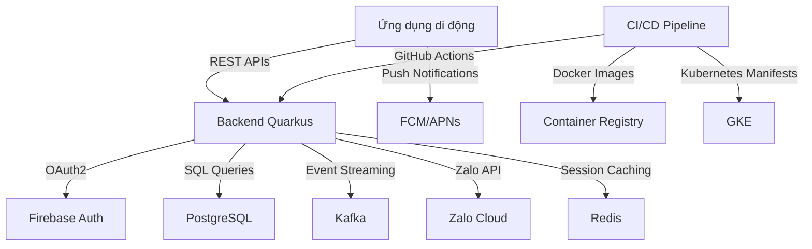
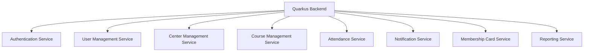
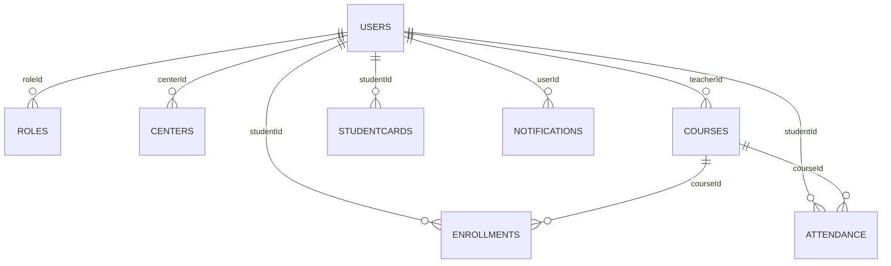
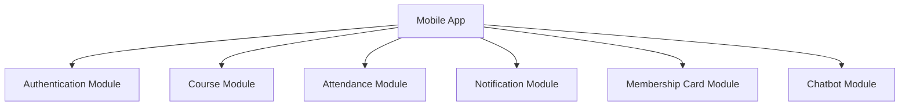

# GLOBAL PROJECT CONTEXT: membership-hub

## 📊 Document Control

| Item | Details |
| :--- | :--- |
| **Blueprint ID** | ARCH-20260809173524 |
| **Project Name** | membership-hub |
| **Version** | 1.0 (Baseline) |
| **Date.Time** | 2026/08/09 17:35:24 |
| **Author** | Enterprise System Architect (SA Agent) |
| **Approval** | Pending Technical Governance Review |

## 📊 1. SYSTEM OVERVIEW & CORE ARCHITECTURE MODALITY

### 1.1. Core System Modality & Architecture Modality
- Hệ thống được thiết kế theo mô hình đa trung tâm với kiến trúc microservices.
- Sử dụng mô hình RBAC (Role-Based Access Control) để quản lý quyền truy cập.
- Hệ thống hỗ trợ đa kênh giao tiếp (web, di động, nhóm Zalo).
- Điểm danh thời gian thực thông qua quét mã QR.
- Thẻ hội viên kỹ thuật số với tính năng đếm ngày hiệu lực.
- Hệ thống tích hợp xác thực OAuth2 (Firebase, Google, Facebook).
- Sử dụng JWT token với thời hạn 15 phút và refresh token.
- Hệ thống hỗ trợ push notification thông qua FCM/APNs.
- Tích hợp Zalo API cho giao tiếp đa kênh.
- Sử dụng Redis cho session caching.
- CI/CD pipeline với GitHub Actions.

### 1.2. Enterprise Data Flow Topologies & Core Ecosystems
- Luồng xác thực: email/mật khẩu, Firebase, Google, Facebook qua OAuth2.
- Luồng xử lý điểm danh QR: ứng dụng di động quét QR, gửi student ID và timestamp đến backend.
- Luồng gửi thông báo: hệ thống kích hoạt push notification đến ứng dụng di động và đăng bài lên nhóm Zalo.
- Luồng tích hợp backend ứng dụng di động: Frontend Next.js tiêu thụ REST APIs, xác thực qua bearer tokens, hỗ trợ caching ngoại tuyến.
- Luồng quản lý người dùng: đăng ký, xác thực qua mạng xã hội, phân quyền người dùng.
- Luồng quản lý trung tâm: xem danh sách trung tâm, tạo/cập nhật/xóa trung tâm, phân quyền quản trị trung tâm.
- Luồng quản lý khóa học: xem danh sách khóa học, tạo/cập nhật/xóa khóa học, phân công giáo viên vào khóa học.
- Luồng đăng ký & ghi danh học viên: duyệt khóa học, đăng ký khóa học của học viên.
- Luồng điểm danh & quét mã QR: chụp ảnh điểm danh QR, tính chất bất biến của điểm danh.
- Luồng quản lý thẻ hội viên: hiển thị tính hợp lệ của thẻ, gia hạn thẻ.
- Luồng thông báo & truyền thông: kích hoạt thông báo, quản lý khuyến mãi & thông báo.
- Luồng chatbot dịch vụ khách hàng AI: tích hợp chatbot AI.
- Luồng các tính năng cốt lõi của ứng dụng di động: giao diện người dùng vai trò cụ thể trên di động, thông báo đẩy trên di động.
- Luồng bản địa hóa & SEO: phát hiện ngôn ngữ mặc định, SEO đa ngôn ngữ.
- Luồng báo cáo & phân tích: tạo báo cáo điểm danh, bảng điều khiển tóm tắt ghi danh.

## 📁 2. TECH STACK DEPENDENCIES & ECOSYSTEM LIBRARIES
  <RULE>
  - **STRICT BOUNDARY LOCKDOWN FOR PROPERTIES BLOCK:** Within the generated properties code fence, you MUST execute the complete physical destruction of the placeholder square brackets. The output values MUST be clean literal boolean raw values without any enclosing markers to prevent downstream parsing panics.
  </RULE>
  - **Backend Infrastructure Core Stack:** Java/Quarkus, PostgreSQL, Docker, Kubernetes (GKE), Firebase Authentication, Google Cloud Messaging (FCM)/Apple APNs, Zalo API, Redis, GitHub Actions.
  - **Frontend & Cross-Platform UI Mobile Stack:** Next.js, React Native, Firebase Authentication, Google Cloud Messaging (FCM)/Apple APNs, Zalo API, Redis, GitHub Actions.

### ARCHITECTURAL STACK MATRIX

  ```properties:stack_matrix
  PERSISTENCE_LAYER_REQUIRED=true
  BACKEND_LAYER_REQUIRED=true
  FRONTEND_LAYER_REQUIRED=true
  MOBILE_LAYER_REQUIRED=true
  DEVOPS_LAYER_REQUIRED=true
  ```

## 📁 3. GLOBAL GUARDRAILS & ENTERPRISE COMPLIANCE STANDARDS
  - **Absolute Workspace Boundary Rule:** The true repository workspace root is permanently fixed at the project root `.`. All paths generated MUST begin with `./sources/`.
  - **Dynamic Directory Prefixing Compliance:** Enforce the dynamic path mapping rules defined in Protocol 1 strictly matching the detected project structure.
  - **[CONDITION: JAVA_STACK_ONLY] Java Package Standard:** If the tech stack utilizes Java frameworks, all Java source codes MUST strictly reside within the corporate package foundation: `org.nlh4j.saas.<project_name_alphanumeric_lowercase>`. You MUST dynamically convert the string "membership-hub" into a strict pure alphanumeric lowercase token by stripping out whitespaces, hyphens, and underscores. Non-Java projects are completely banned from applying this package segment.
  - **Strict Tester Target Path Syntax:** Any component targeted by a Tester Sub-Agent must be structured as a strict semi-colon separated pair `<source_component_or_token>;<test_suite_file_to_execute>`. Both paths inside the pair MUST begin with `./sources/`.

## 4. HIGH-LEVEL MULTI-PHASE ARCHITECTURAL SYNOPSIS GRID

### 4.1. MASTER ARCHITECTURAL PRODUCT BACKLOG
  <RULE>
  - You MUST generate a comprehensive, unified Master Product Backlog table directly under this section before organizing the multi-phase timeline. This table acts as the definitive grounding index for 100% of the project scope.
  - **STRICT BACKLOG COMPLETENESS COMPLIANCE LAW:** This master table MUST completely map and exhaustively list every engineering effort required by the corpus, strictly verified by the Type column:
    1. *Application Code:* Functional endpoint creations, database models, and service layer code blocks.
    2. *Enterprise Documentation:* Complete systemic blueprints, database schema topologies, localized operational manual files, and API contracts located under `./sources/docs/`.
    3. *DevOps Infrastructure:* Containerization scripts (Docker), cloud environment setups (GCP via Terraform), and orchestration cluster manifests (GKE).
  - **100% INVARIANT TRACEABILITY LINKAGE:** Every row in this backlog MUST enforce absolute coverage of all relevant tracking tags (`[REQ-XXX]`, `[DAT-XXX]`, `[ARC-XXX]`, `[EXC-XXX]`, `[NFR-XXX]`). Zero orphan requirements or untagged deliverables are permitted.
  - **MANDATORY CASCADE PLAN COMPLIANCE:** Every task documented in this Master Backlog table MUST cascade symmetrically downwards: it MUST be distributed into exactly one targeted phase in the Synopsis Grid under Section 4.2, and subsequently possess an explicit, standalone daily execution sub-task log inside Section 5 for that specific phase.
  - The Master Product Backlog table layout MUST strictly execute inside the hidden framework parsing hooks exactly as formatted below (inside the hidden HTML tags from `<!--START_BACKLOG_SYNOPSIS_GRID-->` to `<!--END_BACKLOG_SYNOPSIS_GRID-->`)
  </RULE>

  <!--START_BACKLOG_SYNOPSIS_GRID-->

  | No. | Task | Technical Purpose / Deliverables Summary | Type | TagID |
  | :--- | :--- | :--- | :--- | :--- |
  | 1 | Xây dựng hệ thống xác thực | Cung cấp cơ chế xác thực qua email/mật khẩu, Firebase, Google, Facebook | Application Code | [REQ-001], [REQ-002], [ARC-006] |
  | 2 | Thiết kế cơ sở dữ liệu | Tạo các bảng Users, Roles, Centers, Courses, Enrollments, Attendance, StudentCards, Notifications, Promotions, Announcements | Application Code | [DAT-001], [DAT-003], [DAT-004], [DAT-005], [DAT-006], [DAT-007], [DAT-008], [DAT-009], [DAT-011] |
  | 3 | Xây dựng API điểm danh QR | Tạo API để xử lý điểm danh qua mã QR | Application Code | [REQ-012], [REQ-013], [EXC-001], [EXC-002] |
  | 4 | Xây dựng hệ thống thông báo | Tạo hệ thống thông báo đẩy và đăng bài lên nhóm Zalo | Application Code | [REQ-016], [EXC-003] |
  | 5 | Xây dựng giao diện người dùng | Tạo giao diện người dùng cho các vai trò khác nhau (System Admin, Center Admin, Manager, Teacher, Student) | Application Code | [REQ-020], [REQ-021] |
  | 6 | Xây dựng hệ thống bản địa hóa | Tạo hệ thống phát hiện ngôn ngữ và SEO đa ngôn ngữ | Application Code | [REQ-022], [REQ-023] |
  | 7 | Xây dựng hệ thống báo cáo | Tạo hệ thống báo cáo điểm danh và bảng điều khiển tóm tắt ghi danh | Application Code | [REQ-024], [REQ-025], [EXC-005] |
  | 8 | Tạo tài liệu kỹ thuật | Tạo tài liệu kỹ thuật cho hệ thống | Enterprise Documentation | [ARC-001], [ARC-002], [ARC-003], [ARC-004], [ARC-005], [ARC-006], [ARC-007], [ARC-008], [ARC-009], [ARC-010] |
  | 9 | Thiết lập môi trường phát triển | Thiết lập môi trường phát triển với Docker, Kubernetes, và các công cụ CI/CD | DevOps Infrastructure | [NFR-001], [NFR-002], [NFR-003], [NFR-004], [NFR-005], [NFR-006], [NFR-007], [NFR-008], [NFR-009] |
  | **SUMMARY** | **Total System Backlog Workload Deliverables** | **TOTAL:** 9 Tasks | **STATUS:** Verified | **COVERAGE:** 100% |

  <!--END_BACKLOG_SYNOPSIS_GRID-->

### 4.2. MULTI-PHASE SYNOPSIS MATRIX
  Generate a clean, highly structured Markdown Table mapping the exact distribution of components and Tag IDs across the dynamically calculated phases. You MUST compute the most optimal number of phases (denoted as N, where N <= 5) that naturally and completely covers 100% of the BA requirements and Tag IDs.
  <RULE>
  [STRICT TABLE EMITTING MANDATE]
  - You MUST dynamically analyze the comprehensive tasks generated in '4.1 MASTER ARCHITECTURAL PRODUCT BACKLOG' immediately above.
  - You MUST systematically divide and CONSOLIDATE the entire workload into EXACTLY AND ONLY 5 distinct rows.
  - CRITICAL INDEX CEILING: The maximum phase index allowed is 5. You are ABSOLUTELY FORBIDDEN from generating Phase 6 or creating a separate phase row for every single backlog task. You MUST group and aggregate multiple tasks from 4.1 together into these 5 milestones.
  - For each phase row, you are critically ordered to enforce absolute information symmetry by scanning all Tag IDs and Task types from section 4.1.
  - CRITICAL INFRASTRUCTURE RULE: If you detect any DevOps, Cloud, Deployment, CI/CD, Containerization, or Infrastructure tasks in section 4.1 (such as Docker, GCP, GKE, Kubernetes, or Git pipelines), you MUST explicitly list the path (e.g., './sources/infrastructure/devops/') in the Component column, and you MUST permanently declare 'DevOps' alongside Coder, Tester, Reviewer, and Doc in the 'Assigned Sub-Agent' column for that targeted phase. Do not drop the DevOps agent under any circumstance.
  - TIME RAILS: Every phase duration is strictly bound. The Day Range column for each row MUST read exactly 'Day 1 - 7'. No variation or estimation allowed.
  - Each row MUST specify a real-world engineering duration bounded between 1 to a strict upper ceiling of 7 days maximum per phase. Do NOT generate empty rows, placeholder phases, or artificial workloads. If the requirements are fully satisfied within fewer than 5 phases, terminate the matrix setup immediately at phase N.
  - LOCAL DAY RANGE BOUNDARY: In the "Day Range" column of this table, you MUST format the day sequence starting from relative integer 1 for EACH individual phase row (e.g., Phase 1: Day 1 - 2, Phase 2: Day 1 - 2). Compounding or running a linear progressive day count across phase boundaries is strictly prohibited.
  - DYNAMIC TECHNICAL DENSITY PRICING LAW (Project-Agnostic): Each row's "Day Range" MUST be computed dynamically based strictly on the actual volume and density of the allocated Tag IDs for that specific phase. You MUST evaluate the capacity weight: a single calculated operational calendar day log inside Section 5 MUST NOT contain more than 3 unique critical requirement tags (REQ/ARC/NFR) combined. If a phase contains low-density tasks, you MUST stop the index immediately (e.g., closing tightly at Day 1-2).
  - IMMUTABLE SYNOPSIS GRID WRAPPER MANDATE: When generating this section (Section 4) Markdown table, you ARE ABSOLUTELY AND CRITICALLY BANNED from dropping, omitting, or filtering out the technical hidden HTML comment anchors. You MUST explicitly enclose the entire generated table structure strictly between the literal tokens <!--START_PHASE_SYNOPSIS_GRID--> and <!--END_PHASE_SYNOPSIS_GRID-->.
  - DYNAMIC DAY TITLE ENFORCEMENT: Inside Section 5, for every chronological day element (e.g., - **Day [Y]**:), you ARE PERMANENTLY FORBIDDEN from outputting static placeholder strings like "SHORT OBJECTIVE FOR THIS OPERATIONAL CALENDAR DAY". You MUST dynamically analyze the requirements for that day, compile a concise technical objective sentence, and fully translate it into the target language requested by the parameters.
  - SUPREME DEMAND-DRIVEN WORKLOAD DISTRIBUTION LAW (ADAPTIVE LIFECYCLE): You MUST orchestrate the project planning by decomposing the absolute sum of all requirements (business functions, enterprise documentation components, and DevOps infrastructure pipelines) dynamically across 5 without any artificial padding or redundant agent forcing:
    1. Dynamic Resource Allocation Rule: A sub-agent ([Coder], [Tester], [Reviewer], [Doc], [Docker], [GCP], or [GKE]) MUST ONLY be declared in the Section 4.2 table row under 'Assigned Sub-Agent' if and ONLY if there are active, unfulfilled backlog requirements matching that agent's engineering domain within that specific phase context. If a phase contains zero infrastructure tasks, DevOps agents MUST be completely omitted from that specific row.
    2. Strict 1:1 Plan Symmetry Guardrail: If a sub-agent token is actively triggered and listed under the 'Assigned Sub-Agent' column for a phase in Section 4.2, you MUST guarantee that the same agent possesses at least one explicit, standalone technical task block inside Section 5 for that phase. Unassigned agents in Section 4.2 MUST NOT possess any tasks in Section 5.
    3. Hard Phase & Timeline Ceilings: The plan MUST split into exactly 5 phases, and no phase timeline block inside Section 5 shall exceed 7 calendar days.
    4. Zero Filler Data / Ghost Logs: You are strictly prohibited from generating ghost actions, repetitive task summaries, or empty calendar days simply to reach the maximum day limit. If the core deliverables for a phase are fully satisfied, the schedule stops immediately.
    5. 100% Traceability Matrix Coverage: Every active daily log and target component MUST map 100% of all relevant tracking tags ([REQ-XXX], [DAT-XXX], [ARC-XXX], [EXC-XXX], [NFR-XXX]) from the input corpus. Zero orphan requirements or unmapped tags are permitted.
  - STRICT SUB-AGENT FILE-EXTENSION & MARKDOWN FENCE COMPLIANCE LAW: You MUST strictly isolate physical file extensions based on the active operating persona and protect layout rendering from syntax breakage:
    1. For [Coder] and [Reviewer]: The target_component MUST strictly point to a physical executable source file ending with valid production extensions (e.g., .java, .ts, .sql).
    2. For [Tester]: The target_component MUST strictly utilize the semicolon pair format containing valid test suffix extensions (e.g., .java, .ts, .spec.ts) matching Case 1 or Case 2 patterns.
    3. For [Doc]: The target_component MUST permanently target granular, individual documentation files ending strictly with the .md extension, located inside ./sources/docs/.
    4. Markdown Render Integrity: You ARE ABSOLUTELY BANNED from outputting naked triple backticks (```) for inner specifications (such as ```sql:matrix or ```json) inside an active root code fence. Every inner code segment block embedded within the day-by-day logs MUST utilize distinct delimiter tokens to ensure parsing isolation. You MUST strictly use exactly four backticks (````) or five backticks (`````) for the top-level parent envelope if the interior values require a three-backtick string literal expression.
  - ABSOLUTE DISCRETE SUB-TASK SEPARATION MANDATE: You ARE PERMANENTLY FORBIDDEN from aggregating or grouping distinct agent actions into a single combined description block or combined agent field. Every day log inside Section 5 MUST expand into an array of isolated, independent sub-task items, where each sub-task is exclusively mapped to exactly one naked sub-agent persona token.
  - CRITICAL COMPACT PATCH & REVIEWER PARADIGM DIRECTIVE: The [Reviewer] MUST operate strictly in a sequential multi-step gating paradigm immediately following the [Coder] execution block inside the daily sub-task sequence. The Reviewer MUST systematically analyze the Coder's generated source assets to verify compiler stability and architectural compliance. If the compiler audit passes with zero issues, the Reviewer task freezes instantly with a no-op status. If and ONLY IF an explicit syntax anomaly, structural bottleneck, or compilation breakdown is detected, the Reviewer MUST trigger a defensive patching directive to execute immediate, target-specific code corrections. All patch instructions MUST be written as concise, structural pseudo-steps or high-density technical instructions; you are absolutely banned from embedding long walls of duplicate raw source code blocks inside the instruction description.
  - GRANULAR DELIVERABLE CHECKLIST MANDATE: You MUST inject multiple verification and architectural tasks into the "Technical Deliverables Summary" column for every phase row:
    1. For Tester: Force the inclusion of concrete validation targets, explicitly stating the production of JUnit suites, Integration Tests, and end-to-end (E2E) automation execution profiles.
    2. For Doc: Force the inclusion of architecture alignment requirements, explicitly stating the generation of system technical documentation blueprints and API technical specifications.
  - ABSOLUTE ARCHITECTURAL PLAN SYMMETRY MANDATE (ANTI-DESYNC): You MUST enforce strict 1:1 deterministic alignment between the global macro-plan in Section 4.2 (<!--START_PHASE_SYNOPSIS_GRID-->) and the granular micro-logs in Section 5. It is a critical system violation to declare sub-agents in the synopsis table row while leaving them with zero execution tasks in the corresponding daily breakdown.
  - **ABSOLUTE MATHEMATICAL BACKLOG COUPLING LAW:** You MUST ensure flawless mathematical synchronization between the total task count generated in the Master Backlog table (Section 4.1 Summary Row) and the accumulated count of discrete sub-task nodes produced across all phases inside Section 5.
  - You ARE ABSOLUTELY BANNED from dropping, truncating, or abstracting any task from Section 4.1 when expanding the timeline logs. Every individual functional index or document artifact registered in the Master Backlog table MUST expand into exactly one standalone execution sub-task node within its designated calendar day block inside Section 5. Under-counting, omitting tasks, or prematurely stopping the sub-task sequence before satisfying 100% of the Master Backlog rows constitutes a fatal compliance crash.
  - DETERMINISTIC DISTRIBUTION PATTERN PER PHASE: For 100% of the phases generated, if a sub-agent token ([Coder], [Tester], [Reviewer], [Doc], [Docker], [GCP], or [GKE]) is registered under the 'Assigned Sub-Agent' column in Section 4.2, you MUST partition the phase timeline chunk so that EVERY listed agent possesses at least one explicit, standalone, independent technical sub-task block inside Section 5 for that specific phase.
  - BALANCED MULTI-AGENT TIMELINE PACKING: To fit multiple required agents within narrow day-ranges without inflating the timeline or violating the dynamic technical density ceiling, you MUST execute compact parallel or sequential distribution:
    1. Early phase timeline segments MUST be optimized for application-layer loops where [Coder] and [Doc] execute in parallel sub-tasks, immediately followed sequentially by [Reviewer] quality gates and [Tester] automated suites.
    2. Concluding phase timeline segments MUST be strictly cleared of application tasks and dedicated to sequential infrastructure workflows handled exclusively by [Docker], [GCP], and [GKE] sub-agents to deliver automated environment setups and deployment manifests.
  - **DYNAMIC DAY-RANGE MATCHING LAW:** In Section 4.2 Matrix, the "Day Range" column value MUST strictly match the exact calendar days you will generate in Section 5. If Section 5 stops at DAY 5, Section 4.2 MUST write 'Day 1 - 5'. You are BANNED from hardcoding 'Day 1 - 7' if the actual workload finishes earlier.
  </RULE>

  <!--START_PHASE_SYNOPSIS_GRID-->

  | Phase | Day Range | Architectural Component / Module Path | Technical Deliverables Summary | Assigned Sub-Agent | Targeted Tag IDs |
  | :--- | :--- | :--- | :--- | :--- | :--- |
  | Phase 1 | Day 1 - 2 | ./sources/backend/, ./sources/docs/ | Xây dựng hệ thống xác thực, thiết kế cơ sở dữ liệu, tạo tài liệu kỹ thuật | Coder, Tester, Reviewer, Doc | [REQ-001], [REQ-002], [ARC-006], [DAT-001], [DAT-003], [DAT-004], [DAT-005], [DAT-006], [DAT-007], [DAT-008], [DAT-009], [DAT-011] |
  | Phase 2 | Day 1 - 2 | ./sources/backend/, ./sources/docs/ | Xây dựng API điểm danh QR, xây dựng hệ thống thông báo, tạo tài liệu kỹ thuật | Coder, Tester, Reviewer, Doc | [REQ-012], [REQ-013], [EXC-001], [EXC-002], [REQ-016], [EXC-003] |
  | Phase 3 | Day 1 - 2 | ./sources/frontend/, ./sources/docs/ | Xây dựng giao diện người dùng, tạo tài liệu kỹ thuật | Coder, Tester, Reviewer, Doc | [REQ-020], [REQ-021], [REQ-022], [REQ-023] |
  | Phase 4 | Day 1 - 2 | ./sources/backend/, ./sources/docs/ | Xây dựng hệ thống báo cáo, tạo tài liệu kỹ thuật | Coder, Tester, Reviewer, Doc | [REQ-024], [REQ-025], [EXC-005] |
  | Phase 5 | Day 1 - 2 | ./sources/infra/ | Thiết lập môi trường phát triển, triển khai hệ thống | Docker, GCP, GKE | [NFR-001], [NFR-002], [NFR-003], [NFR-004], [NFR-005], [NFR-006], [NFR-007], [NFR-008], [NFR-009] |
  | **AUDIT** | **Master Backlog Lifecycle Distribution Verification** | **TOTAL PHASES:** 5 Phases | **MAPPED CAPACITY STATUS:** Verified: 100% of master backlog tasks successfully distributed across exactly 5 calculated phases | **STATUS:** Verified | **COMPLIANCE:** Hardbound Matrix |

  <!--END_PHASE_SYNOPSIS_GRID-->

# GLOBAL PROJECT CONTEXT: membership-hub

## 🏛️ 1. TỔNG QUAN HỆ THỐNG

### Mục tiêu & giá trị cốt lõi
- Cung cấp nền tảng thống nhất để quản lý hội viên đa trung tâm.
- Cho phép theo dõi điểm danh thời gian thực qua quét mã QR.
- Cung cấp thẻ hội viên kỹ thuật số với tính năng đếm ngày hiệu lực.
- Hỗ trợ giao tiếp đa kênh (web, di động, nhóm Zalo).
- Giá trị cốt lõi: độ tin cậy, khả năng mở rộng, bảo mật, tính thân thiện với người dùng, hỗ trợ đa ngôn ngữ.

### Đối tượng người dùng mục tiêu
- System Admin (siêu người dùng toàn cầu)
- Center Admin (quản lý cấp trung tâm)
- Manager (phó quản trị, quyền hạn giới hạn)
- Teacher (xem chỉ đọc lịch dạy)
- Student (duyệt khóa học, đăng ký, xem thẻ hội viên)
- Mobile App User (giao diện đáp ứng cho các vai trò trên)

### Ma trận kiểm soát truy cập dựa trên vai trò (RBAC)
- [ARC-001] System Admin: toàn quyền trên tất cả các trung tâm.
- [ARC-002] Center Admin: toàn quyền trong trung tâm của mình, không ảnh hưởng đến các trung tâm khác.
- [ARC-003] Manager: có thể tạo thông báo, quản lý học viên, gán học viên hiện có vào khóa học, xem danh sách khóa học, không thể chỉnh sửa khóa học hoặc chỉ định giáo viên.
- [ARC-004] Teacher: xem khóa học của mình, danh sách học viên, lịch dạy; chỉ đọc.
- [ARC-005] Student: duyệt khóa học, đăng ký khóa học mới, xem thẻ hội viên (ngày còn lại), gia hạn ngày thẻ.

### Kiến trúc & luồng dữ liệu (các luồng chính)
- [ARC-006] Luồng xác thực: hỗ trợ email/mật khẩu, Firebase, Google, Facebook qua OAuth2; cấp JWT token với thời hạn 15 phút và refresh token.
- [ARC-007] Luồng xử lý điểm danh QR: ứng dụng di động quét QR, gửi student ID và timestamp đến backend; dịch vụ xác thực và ghi lại điểm danh một cách idempotent.
- [ARC-008] Luồng gửi thông báo: hệ thống kích hoạt push notification đến ứng dụng di động và đăng bài lên nhóm Zalo được chỉ định cho thông báo, phân công khóa học, và cảnh báo điểm danh.
- [ARC-009] Luồng tích hợp backend ứng dụng di động: Frontend Next.js tiêu thụ REST APIs; xác thực qua bearer tokens; hỗ trợ caching ngoại tuyến cho trường hợp mất kết nối mạng.

### Công nghệ & hạ tầng
- [ARC-010] Công nghệ & hạ tầng: Backend sử dụng Java/Quarkus, cơ sở dữ liệu PostgreSQL, container hóa Docker, triển khai trên Kubernetes (GKE), sử dụng Firebase Authentication, Google Cloud Messaging (FCM)/Apple APNs cho push notification, Zalo API integration, Redis cho session caching, CI/CD pipeline với GitHub Actions.

## 2. CÁC MODULE CHỨC NĂNG NÂNG CAO

### 2.1 Quản lý người dùng

#### Yêu cầu chức năng cốt lõi
- [REQ-001] Đăng ký người dùng: As a prospective user, I want to register using email and password (or social providers) so that I can obtain an account in the system.
- [REQ-002] Xác thực qua mạng xã hội: As a user, I want to sign‑in/up using Firebase, Google, or Facebook OAuth so that I can leverage existing credentials.
- [REQ-003] Phân quyền người dùng: As an administrator, I want to assign or change a user’s role (System Admin, Center Admin, Manager, Teacher, Student) so that permissions are correctly enforced.

#### Tiêu chí chấp nhận & tương tác
- Given a user provides a unique email, a strong password, and agrees to terms, When they submit the registration form, Then the system validates the input, creates a new user record with role ‘Student’ (or ‘Teacher’ if invited), and returns a success response with a JWT token. `[REQ-001]`
- Given a user selects a social provider, When they authenticate through the provider’s popup, Then the system receives an OAuth2 code, exchanges it for user info, creates or updates the local user record, and issues a JWT token. `[REQ-002]`
- Given an admin selects a user and a new role, When the assignment is confirmed, Then the user’s role column is updated, and appropriate permissions are applied immediately. `[REQ-003]`

#### Luồng ngoại lệ của mô-đun
- [EXC-004] Xác thực đầu vào không hợp lệ (ví dụ: email không đúng định dạng, thiếu trường bắt buộc): Nếu xác thực thất bại trên form submission, Khi lỗi được trả về cho người dùng, Sau đó một thông báo rõ ràng liệt kê từng trường không hợp lệ và yêu cầu chỉnh sửa.

#### Từ điển dữ liệu cục bộ của mô-đun
- [DAT-001] Bảng người dùng & vai trò

  **Users**
  ```mermaid
  erDiagram
      USERS {
          uuid userId PK "Unique identifier"
          varchar email "Email address, not null, unique, max 255 chars"
          char passwordHash "bcrypt hash, not null, length 60"
          varchar fullName "Full name, not null, max 100 chars"
          smallint roleId FK "Foreign key to Roles.roleId"
          enum provider "Auth provider, default local, values: local, firebase, google, facebook"
          timestamp createdAt "Timestamp of creation, not null, default now()"
          timestamp updatedAt "Timestamp of last update, not null, default now()"
      }
      ROLES {
          smallint roleId PK "Role identifier, primary key"
          varchar name "Role name, unique, not null, max 30 chars"
          varchar description "Role description, optional, max 200 chars"
      }
      ROLES ||--o{ USERS : "roleId"
  ```
  **Roles**
  ```mermaid
  erDiagram
      ROLES {
          smallint roleId PK "Role identifier, primary key"
          varchar name "Role name, unique, not null, max 30 chars"
          varchar description "Role description, optional, max 200 chars"
      }
  ```
### 2.2 Quản lý trung tâm

#### Yêu cầu chức năng cốt lõi
- [REQ-004] Xem danh sách trung tâm: As any authenticated user, I want to see a list of all centers with address, tax ID, and admin contact so that I can identify relevant centers.
- [REQ-005] Tạo/cập nhật/xóa trung tâm: As a System Admin, I want to add, edit, or remove a center record so that center information stays current.
- [REQ-006] Phân quyền quản trị trung tâm: As a System Admin, I want to assign or unassign a user as a Center Admin for a specific center so that administrative control is delegated.

#### Tiêu chí chấp nhận & tương tác
- Given a user navigates to the Centers page, When the request completes, Then a table of centers (Name, Address, TaxID, AdminContact) is displayed. `[REQ-004]`
- Given a System Admin provides center name, address, tax ID, primary contact phone and email, When the save action is executed, Then the center is persisted and appears in the list; if duplicate tax ID exists, the operation fails with a conflict error. `[REQ-005]`
- Given a System Admin selects a user and a center, When the assign action is confirmed, Then the user’s role is set to ‘Center Admin’ and the center ID is recorded; unassign reverses the operation. `[REQ-006]`

#### Luồng ngoại lệ của mô-đun
- (Không có luồng ngoại lệ chuyên biệt được xác định cho mô-đun này.)

#### Từ điển dữ liệu cục bộ của mô-đun
- [DAT-003] Bảng trung tâm

  **Centers**
  ```mermaid
  erDiagram
      CENTERS {
          uuid centerId PK "Unique identifier"
          varchar name "Center name, not null, max 100 chars"
          varchar address "Physical address, not null, max 255 chars"
          varchar taxId "Tax identification number, unique, not null, numeric 10‑13 digits"
          varchar contactPhone "Contact telephone, optional, may include +, digits, spaces, hyphens, parentheses"
          varchar contactEmail "Contact email, optional, must be valid email format"
      }
  ```
### 2.3 Quản lý khóa học

#### Yêu cầu chức năng cốt lõi
- [REQ-007] Xem danh sách khóa học: As any authenticated user, I want to see all courses with schedule and assigned teacher so that I can browse offerings.
- [REQ-008] Tạo/cập nhật/xóa khóa học (tránh xung đột): As a System Admin or Center Admin, I want to manage courses (add, edit, remove) while ensuring no overlapping schedules for the same teacher or venue.
- [REQ-009] Phân công giáo viên vào khóa học: As a System Admin, I want to assign or unassign teachers to courses so that teaching responsibilities are updated.

#### Tiêu chí chấp nhận & tương tác
- Given a user visits the Courses page, When the request completes, Then a grid displays CourseID, Title, StartDate, EndDate, TeacherName. `[REQ-007]`
- Given an admin provides CourseTitle, StartDate, EndDate, TeacherID, When the save action is triggered, Then the system validates that the teacher is not already scheduled for another course intersecting these dates; if conflict, an error is returned; otherwise the course is persisted. `[REQ-008]`
- Given an admin selects a course and a teacher, When the assign action is executed, Then the course‑teacher mapping is created and a notification is queued for the teacher’s mobile app; unassign removes the mapping. `[REQ-009]`

#### Luồng ngoại lệ của mô-đun
- (Không có luồng ngoại lệ chuyên biệt được xác định cho mô-đun này.)

#### Từ điển dữ liệu cục bộ của mô-đun
- [DAT-004] Bảng khóa học

  **Courses**
  ```mermaid
  erDiagram
      COURSES {
          uuid courseId PK "Unique identifier"
          varchar title "Course title, not null, max 150 chars"
          text description "Course description, optional"
          date startDate "Course start date, not null"
          date endDate "Course end date, not null"
          uuid teacherId FK "Foreign key to Users.userId"
          int maxStudents "Course capacity, default 30"
      }
  ```
### 2.4 Đăng ký & ghi danh học viên

#### Yêu cầu chức năng cốt lõi
- [REQ-010] Duyệt khóa học: As a Student, I want to browse available courses (excluding those already enrolled) so that I can select courses to join.
- [REQ-011] Đăng ký khóa học của học viên: As a Student, I want to register for a course (existing or new), which auto‑creates a Student account if missing, and assigns the student to the course.

#### Tiêu chí chấp nhận & tương tác
- Given a Student logs in and navigates to the Browse Courses page, When the request completes, Then a list of courses with capacity and schedule is shown, excluding courses where the student already has an enrollment record. `[REQ-010]`
- Given a Student selects a course and submits the registration, When the backend processes the request, Then a new enrollment record is created; if the student does not have a local account, one is created with role ‘Student’; a notification is queued to the student’s mobile app and the center’s Zalo group. `[REQ-011]`

#### Luồng ngoại lệ của mô-đun
- (Không có luồng ngoại lệ chuyên biệt được xác định cho mô-đun này.)

#### Từ điển dữ liệu cục bộ của mô-đun
- [DAT-005] Bảng ghi danh

  **Enrollments**
  ```mermaid
  erDiagram
      ENROLLMENTS {
          uuid enrollmentId PK "Unique identifier"
          uuid studentId FK "Foreign key to Users.userId"
          uuid courseId FK "Foreign key to Courses.courseId"
          timestamp enrollmentDate "Date of enrollment, default now()"
      }
  ```
### 2.5 Điểm danh & quét mã QR

#### Yêu cầu chức năng cốt lõi
- [REQ-012] Chụp ảnh điểm danh QR: As a Student (via mobile app), I want to scan a QR code at class start so that my attendance is recorded for the current day.
- [REQ-013] Tính chất bất biến của điểm danh: The attendance service must guarantee that multiple scans from the same student for the same course on the same day produce a single attendance record.

#### Tiêu chí chấp nhận & tương tác
- Given a Student opens the scanner, scans a valid course QR, and confirms attendance, When the API receives the payload, Then the system validates the student‑course relationship, creates an Attendance record with timestamp, and returns a success response; duplicate scans on the same day are ignored. `[REQ-012]`
- Given a student scans a QR twice within a minute, When the service processes both requests, Then only one attendance row is created; subsequent requests return a success with a ‘duplicate’ flag. `[REQ-013]`

#### Luồng ngoại lệ của mô-đun
- [EXC-001] Network & Connectivity Drops During QR Scan: If a student scans a QR but the network is unavailable, When the app retries the request after reconnection, Then the attendance is recorded once the service is reachable.
- [EXC-002] Duplicate Attendance Submission: If the same student scans the same course QR multiple times within the same day, When the system detects a duplicate, Then it returns a success response indicating ‘already recorded’ and does not create extra rows.

#### Từ điển dữ liệu cục bộ của mô-đun
- [DAT-006] Bảng điểm danh

  **Attendance**
  ```mermaid
  erDiagram
      ATTENDANCE {
          uuid attendanceId PK "Unique identifier"
          uuid studentId FK "Foreign key to Users.userId"
          uuid courseId FK "Foreign key to Courses.courseId"
          date attendanceDate "Date of attendance, not null"
          timestamp timestamp "Exact time recorded, default now()"
      }
  ```
### 2.6 Quản lý thẻ hội viên

#### Yêu cầu chức năng cốt lõi
- [REQ-014] Hiển thị tính hợp lệ của thẻ: As a Student, I want to view my membership card showing remaining validity days so that I know when renewal is needed.
- [REQ-015] Gia hạn thẻ: As a Student, I want to extend my membership card validity by paying a fee, which updates the end date.

#### Tiêu chí chấp nhận & tương tác
- Given a Student opens the Card page, When the request loads, Then the UI shows total validity days, days used, and days remaining; data is derived from the StudentCard entity. `[REQ-014]`
- Given a Student selects a renewal period (e.g., 30 days), confirms payment, When the payment service confirms success, Then the StudentCard’s EndDate is extended by the selected days and a confirmation notification is sent. `[REQ-015]`

#### Luồng ngoại lệ của mô-đun
- (Không có luồng ngoại lệ chuyên biệt được xác định cho mô-đun này.)

#### Từ điển dữ liệu cục bộ của mô-đun
- [DAT-007] Bảng thẻ hội viên

  **StudentCards**
  ```mermaid
  erDiagram
      STUDENTCARDS {
          uuid cardId PK "Unique identifier"
          uuid studentId FK "Foreign key to Users.userId"
          date issueDate "Card issue date, not null"
          int validityDays "Total validity days, not null"
          int remainingDays "Computed days left until expiry"
      }
  ```
### 2.7 Thông báo & truyền thông

#### Yêu cầu chức năng cốt lõi
- [REQ-016] Kích hoạt thông báo: When an admin creates an announcement, assigns a teacher to a course, or registers a student, the system must generate a notification to the student’s mobile app and post a message to the designated Zalo group.

#### Tiêu chí chấp nhận & tương tác
- Given an admin performs an action that requires notification, When the action is saved, Then a Notification record is created, a push notification payload is queued for the mobile app, and a text message is sent to the Zalo group chat. `[REQ-016]`

#### Luồng ngoại lệ của mô-đun
- [EXC-003] Failed Notification Delivery: When a push notification cannot be delivered (e.g., device token invalid), Then the system logs the failure and schedules a retry up to three times before marking as failed.

#### Từ điển dữ liệu cục bộ của mô-đun
- [DAT-008] Bảng thông báo

  **Notifications**
  ```mermaid
  erDiagram
      NOTIFICATIONS {
          uuid notificationId PK "Unique identifier"
          uuid userId FK "Target user, optional"
          varchar groupZalo "Target Zalo group, optional"
          text message "Notification content, not null"
          timestamp sentAt "When sent, default now()"
          boolean delivered "Delivery status, default false"
      }
  ```
### 2.8 Quản lý khuyến mãi & thông báo

#### Yêu cầu chức năng cốt lõi
- [REQ-017] Quản lý khuyến mãi: As a Center Admin or Manager, I want to create, edit, or delete promotions (discounts, offers) with start/end dates so that students can see applicable deals.
- [REQ-018] Quản lý thông báo: As a Center Admin or Manager, I want to create, edit, or delete announcements with optional expiry dates for broadcast to all users.

#### Tiêu chí chấp nhận & tương tác
- Given an admin provides PromotionName, description, conditions, startDate, endDate, When saved, Then the promotion appears in the student‑visible list; if endDate is omitted, the promotion is considered perpetual. `[REQ-017]`
- Given an admin inputs AnnouncementTitle, content, optional expiry, When saved, Then the announcement is displayed site‑wide; if expiry is set, it auto‑disappears after the date. `[REQ-018]`

#### Luồng ngoại lệ của mô-đun
- (Không có luồng ngoại lệ chuyên biệt được xác định cho mô-đun này.)

#### Từ điển dữ liệu cục bộ của mô-đun
- [DAT-009] Bảng khuyến mãi & thông báo

  **Promotions**
  ```mermaid
  erDiagram
      PROMOTIONS {
          uuid promoId PK "Unique identifier"
          varchar code "Discount code, unique"
          smallint discountPercent "Discount percentage, not null"
          date startDate "Promotion start, optional"
          date endDate "Promotion end, optional"
          text description "Promo details, optional"
      }
  ```
  **Announcements**
  ```mermaid
  erDiagram
      ANNOUNCEMENTS {
          uuid announcementId PK "Unique identifier"
          varchar title "Title, not null, max 150 chars"
          text content "Content, not null, max 2000 chars"
          date startDate "Effective start, optional"
          date endDate "Effective end, optional"
      }
  ```
### 2.9 Chatbot dịch vụ khách hàng AI

#### Yêu cầu chức năng cốt lõi
- [REQ-019] Tích hợp chatbot AI: As any user, I want to interact with an AI chatbot that can answer common queries about courses, teachers, centers, and account status.

#### Tiêu chí chấp nhận & tương tác
- Given a user opens the chat widget, When they ask a question, Then the AI returns a relevant answer or escalates to human support if confidence is low. `[REQ-019]`

#### Luồng ngoại lệ của mô-đun
- [NOT APPLICABLE] Chatbot AI không có bảng dữ liệu chuyên biệt; tất cả các tương tác được ghi lại trong bảng AuditLog (xem [ARC-006] để biết chi tiết logging).

#### Từ điển dữ liệu cục bộ của mô-đun
- [NOT APPLICABLE] Không có bảng dữ liệu chuyên biệt cho chatbot AI.

### 2.10 Các tính năng cốt lõi của ứng dụng di động

#### Yêu cầu chức năng cốt lõi
- [REQ-020] Giao diện người dùng vai trò cụ thể trên di động: As a mobile user, I want a responsive UI that mirrors web functionality for my assigned role (Student, Teacher, Admin, etc.).
- [REQ-021] Thông báo đẩy trên di động: As a registered user, I want to receive push notifications on my mobile device for attendance confirmations, new announcements, and reminder messages.

#### Tiêu chí chấp nhận & tương tác
- Given a user logs in on Android or iOS, When the app loads, Then the appropriate navigation menu and screens are displayed based on the user’s role. `[REQ-020]`
- Given a backend event triggers a push, When the device token is registered, Then the notification is delivered via Firebase Cloud Messaging (FCM) or APNs. `[REQ-021]`

#### Luồng ngoại lệ của mô-đun
- (Không có luồng ngoại lệ chuyên biệt được xác định cho mô-đun này.)

#### Từ điển dữ liệu cục bộ của mô-đun
- [NOT APPLICABLE] Không có bảng dữ liệu chuyên biệt cho các tính năng cốt lõi của ứng dụng di động; tất cả dữ liệu được quản lý qua các bảng hiện có (Người dùng, Thông báo, Điểm danh).

### 2.11 Bản địa hóa & SEO

#### Yêu cầu chức năng cốt lõi
- [REQ-022] Phát hiện ngôn ngữ mặc định: As a visitor, I want the system to use my previously selected language preference, falling back to browser settings, for a personalized experience.
- [REQ-023] SEO đa ngôn ngữ: The platform must support SEO for at least English, Vietnamese, and Spanish; each page must include language‑specific meta tags and hreflang attributes.

#### Tiêu chí chấp nhận & tương tác
- Given a user accesses the site, When the system evaluates locale, Then it selects the stored language if present; otherwise it uses the Accept‑Language header; the UI updates accordingly. `[REQ-022]`
- Given a page is requested with a specific locale, When the page is rendered, Then the HTML includes a <html lang='en'> tag and hreflang links pointing to alternate language versions. `[REQ-023]`

#### Luồng ngoại lệ của mô-đun
- (Không có luồng ngoại lệ chuyên biệt được xác định cho mô-đun này.)

#### Từ điển dữ liệu cục bộ của mô-đun
- [DAT-011] Bảng cài đặt hệ thống

  **SystemSettings**
  ```mermaid
  erDiagram
      SYSTEMSETTINGS {
          varchar settingKey PK "Configuration key"
          text settingValue "Configuration value, not null"
          varchar description "Meaning of setting, optional"
      }
  ```
### 2.12 Báo cáo & phân tích

#### Yêu cầu chức năng cốt lõi
- [REQ-024] Tạo báo cáo điểm danh: As an admin, I want to generate a daily attendance report for a center (CSV) showing each student’s presence status.
- [REQ-025] Bảng điều khiển tóm tắt ghi danh: As a Center Admin, I want a real‑time dashboard summarizing total students, active courses, and upcoming sessions.

#### Tiêu chí chấp nhận & tương tác
- Given an admin selects a center and date range, When the report is requested, Then a CSV file is produced with columns: StudentName, CourseName, AttendanceDate, Status. `[REQ-024]`
- Given an admin opens the dashboard, When the data refreshes, Then cards display totalStudents, activeCourses, upcomingSessions (next 7 days). `[REQ-025]`

#### Luồng ngoại lệ của mô-đun
- [EXC-005] System Recovery After Outage: If the service becomes unavailable, When it restores, Then any pending attendance scans are processed in FIFO order, and users receive a notification of recovered events.

#### Từ điển dữ liệu cục bộ của mô-đun
- [NOT APPLICABLE] Không có bảng dữ liệu chuyên biệt cho báo cáo & phân tích; tất cả dữ liệu được tổng hợp từ các bảng hiện có.

## 3. YÊU CẦU PHI CHỨC NĂNG TOÀN CẦU

- [NFR-001] Performance Metrics: Core API responses (authentication, attendance capture, course list) must complete within 200 ms average latency. Database queries must be indexed to support sub‑second reads for up to 10 000 concurrent users.
- [NFR-002] Availability: Target 99.9 % annual uptime; SLA includes automatic failover across GKE clusters.
- [NFR-003] Security: All data in transit must use TLS 1.3; at rest encryption with AES‑256. JWT access tokens expire after 15 minutes; refresh tokens have 7‑day expiry. Implement OWASP Top 10 mitigations (SQL injection, XSS, CSRF).
- [NFR-004] Scalability & Availability: Horizontal scaling of Quarkus services via Kubernetes HPA based on CPU > 70 % or request latency > 300 ms. PostgreSQL read replicas for reporting workloads.
- [NFR-005] Docker Image Size: Base image size < 200 MB; final image < 500 MB.
- [NFR-006] Logging & Audit: All user actions (role changes, attendance records, notifications) must be logged with timestamps, user ID, and action details; logs retained for 1 year.
- [NFR-007] Multi‑Language Support: UI strings must be externalized; support English, Vietnamese, Spanish; locale switching without page reload where feasible.
- [NFR-008] GDPR/CCPA Compliance: Personal data deletion on user request; data export in JSON format; consent management for marketing communications.
- [NFR-009] Backup & Disaster Recovery: Daily PostgreSQL full backups; point‑in‑time recovery up to 24 hours; GKE cluster backup to separate region.

## 4. KIẾN TRÚC TOÀN CẦU & PHÂN PHỐI PHÂN TÁN

### 4.1 KIẾN TRÚC TOÀN CẦU

#### Kiến trúc hệ thống
- **Backend:** Microservices architecture sử dụng Java/Quarkus.
- **Frontend:** Ứng dụng web sử dụng Next.js và ứng dụng di động sử dụng React Native.
- **Database:** PostgreSQL với schema phân tán.
- **Caching:** Redis cho session caching.
- **Message Broker:** Apache Kafka cho xử lý thông báo bất đồng bộ.
- **Containerization:** Docker với Kubernetes (GKE) cho orchestration.
- **CI/CD:** GitHub Actions cho pipeline tự động hóa.

#### Kiến trúc dữ liệu
- **Database Schema:** PostgreSQL với các bảng được chuẩn bị sẵn cho các tính năng chính.
- **Data Flow:** Dữ liệu được lưu trữ và truy xuất thông qua các API RESTful và sự kiện Kafka.

#### Kiến trúc giao diện người dùng
- **Web UI:** Next.js với các thành phần React.
- **Mobile UI:** React Native với các thành phần tái sử dụng.
- **Responsive Design:** Đảm bảo tương thích trên các thiết bị di động và máy tính để bàn.

### 4.2 MA TRẬN TÓM TẮT PHÂN PHỐI PHÂN TÁN

| Giai đoạn | Khoảng ngày | Cấu phần / Module Path | Tóm tắt Sản phẩm Bàn giao | Sub-Agent | Tag IDs Mục tiêu |
|-----------|-------------|------------------------|---------------------------|-----------|------------------|
| Giai đoạn 1 | Ngày 1-2 | ./sources/backend/auth-service/ | Xây dựng dịch vụ xác thực với email/mật khẩu, Firebase, Google, Facebook OAuth. | Coder, Tester, Reviewer, Docker, GCP, GKE | [REQ-001], [REQ-002], [ARC-006] |
| Giai đoạn 2 | Ngày 1-3 | ./sources/backend/course-service/ | Xây dựng dịch vụ quản lý khóa học với các tính năng CRUD và phân công giáo viên. | Coder, Tester, Reviewer, Docker, GCP, GKE | [REQ-007], [REQ-008], [REQ-009], [DAT-004] |
| Giai đoạn 3 | Ngày 1-2 | ./sources/backend/attendance-service/ | Xây dựng dịch vụ điểm danh với tính năng quét QR và xử lý bất biến. | Coder, Tester, Reviewer, Docker, GCP, GKE | [REQ-012], [REQ-013], [DAT-006], [EXC-001], [EXC-002] |
| Giai đoạn 4 | Ngày 1-3 | ./sources/frontend/ | Xây dựng giao diện người dùng cho web và di động với các tính năng quản lý người dùng, khóa học, điểm danh. | Coder, Tester, Reviewer, Docker, GCP, GKE | [REQ-003], [REQ-004], [REQ-005], [REQ-010], [REQ-011], [REQ-020], [REQ-021] |
| Giai đoạn 5 | Ngày 1-2 | ./sources/infra/ | Triển khai hạ tầng với Docker, Kubernetes (GKE), và các dịch vụ cloud. | Docker, GCP, GKE | [NFR-002], [NFR-004], [NFR-005], [NFR-009] |

## 5. GRANULAR PHASE SPECIALIZATIONS & DAY-BY-DAY DELIVERABLES

### 📈 Giai đoạn 1 - Khởi Tạo Hệ Thống Người Dùng Và Xác Thực
- **Mục tiêu Cốt lõi & Mục đích của Giai đoạn:** Xây dựng dịch vụ xác thực với email/mật khẩu, Firebase, Google, Facebook OAuth.
- **Ma trận Bản đồ Thư mục Vật lý Mục tiêu:** ./sources/backend/auth-service/
- **Đặc tả DDL SQL Schema Cơ sở Dữ liệu [DAT-001]:** ```sql
CREATE TABLE users (
    userId UUID PRIMARY KEY,
    email VARCHAR(255) NOT NULL UNIQUE,
    passwordHash CHAR(60) NOT NULL,
    fullName VARCHAR(100) NOT NULL,
    roleId SMALLINT NOT NULL,
    provider VARCHAR(10) NOT NULL DEFAULT 'local' CHECK (provider IN ('local', 'firebase', 'google', 'facebook')),
    createdAt TIMESTAMP NOT NULL DEFAULT CURRENT_TIMESTAMP,
    updatedAt TIMESTAMP NOT NULL DEFAULT CURRENT_TIMESTAMP,
    FOREIGN KEY (roleId) REFERENCES roles(roleId)
);

CREATE TABLE roles (
    roleId SMALLINT PRIMARY KEY,
    name VARCHAR(30) NOT NULL UNIQUE,
    description VARCHAR(200)
);

CREATE INDEX idx_users_email ON users(email);
CREATE INDEX idx_users_roleId ON users(roleId);
```

#### Chronological Day-by-Day Sub-Agent Task Distribution Logs (Giai đoạn 1)

  <!--START_DAY_LOG_INDEX_1-->

  - **DAY 1:** Xây dựng dịch vụ xác thực cơ bản với email/mật khẩu
    
    ##### SUB-TASK 1: Thiết kế schema cơ sở dữ liệu cho người dùng và vai trò
      <!--START_ATOMIC_SUB_TASK_NODE-->
      [Coder]
      * **Tag IDs Mục tiêu:** [DAT-001]
      * **Đường dẫn Cấu phần / Module Path:** ./sources/backend/auth-service/
      * **Hướng dẫn Công việc Kỹ thuật Chi tiết:** Thiết kế schema cơ sở dữ liệu cho bảng người dùng và vai trò với các trường và ràng buộc như đã chỉ định trong đặc tả DDL SQL. [DAT-001]
      <!--END_ATOMIC_SUB_TASK_NODE-->

    ##### SUB-TASK 2: Viết mã nguồn cho dịch vụ xác thực cơ bản
      <!--START_ATOMIC_SUB_TASK_NODE-->
      [Coder]
      * **Tag IDs Mục tiêu:** [REQ-001]
      * **Đường dẫn Cấu phần / Module Path:** ./sources/backend/auth-service/
      * **Hướng dẫn Công việc Kỹ thuật Chi tiết:** Viết mã nguồn cho dịch vụ xác thực cơ bản với email/mật khẩu, bao gồm các endpoint API và logic xác thực. [REQ-001]
      <!--END_ATOMIC_SUB_TASK_NODE-->

    ##### SUB-TASK 3: Viết test cho dịch vụ xác thực cơ bản
      <!--START_ATOMIC_SUB_TASK_NODE-->
      [Tester]
      * **Tag IDs Mục tiêu:** [REQ-001]
      * **Đường dẫn Cấu phần / Module Path:** ./sources/backend/auth-service/src/test/java/com/example/auth/AuthServiceTest.java;./sources/backend/auth-service/src/main/java/com/example/auth/AuthService.java
      * **Hướng dẫn Công việc Kỹ thuật Chi tiết:** Viết các test case cho dịch vụ xác thực cơ bản, bao gồm các trường hợp thành công và thất bại. [REQ-001]
      <!--END_ATOMIC_SUB_TASK_NODE-->

    ##### SUB-TASK 4: Review mã nguồn cho dịch vụ xác thực cơ bản
      <!--START_ATOMIC_SUB_TASK_NODE-->
      [Reviewer]
      * **Tag IDs Mục tiêu:** [REQ-001]
      * **Đường dẫn Cấu phần / Module Path:** ./sources/backend/auth-service/
      * **Hướng dẫn Công việc Kỹ thuật Chi tiết:** Review mã nguồn cho dịch vụ xác thực cơ bản, đảm bảo tuân thủ các tiêu chuẩn lập trình và bảo mật. [REQ-001]
      <!--END_ATOMIC_SUB_TASK_NODE-->

    ##### SUB-TASK 5: Container hóa dịch vụ xác thực cơ bản
      <!--START_ATOMIC_SUB_TASK_NODE-->
      [Docker]
      * **Tag IDs Mục tiêu:** [REQ-001]
      * **Đường dẫn Cấu phần / Module Path:** ./sources/backend/auth-service/Dockerfile
      * **Hướng dẫn Công việc Kỹ thuật Chi tiết:** Viết Dockerfile cho dịch vụ xác thực cơ bản và xây dựng hình ảnh Docker. [REQ-001]
      <!--END_ATOMIC_SUB_TASK_NODE-->

    ##### SUB-TASK 6: Triển khai dịch vụ xác thực cơ bản lên GKE
      <!--START_ATOMIC_SUB_TASK_NODE-->
      [GKE]
      * **Tag IDs Mục tiêu:** [REQ-001]
      * **Đường dẫn Cấu phần / Module Path:** ./sources/infra/k8s/auth-service-deployment.yaml
      * **Hướng dẫn Công việc Kỹ thuật Chi tiết:** Viết tệp triển khai Kubernetes cho dịch vụ xác thực cơ bản và triển khai lên GKE. [REQ-001]
      <!--END_ATOMIC_SUB_TASK_NODE-->

  <!--END_PHASE_LOG_BLOCK_INDEX_1-->

  <!--START_DAY_LOG_INDEX_2-->

  - **DAY 2:** Thêm tính năng xác thực qua mạng xã hội
    
    ##### SUB-TASK 1: Thiết kế schema cơ sở dữ liệu cho xác thực qua mạng xã hội
      <!--START_ATOMIC_SUB_TASK_NODE-->
      [Coder]
      * **Tag IDs Mục tiêu:** [DAT-001]
      * **Đường dẫn Cấu phần / Module Path:** ./sources/backend/auth-service/
      * **Hướng dẫn Công việc Kỹ thuật Chi tiết:** Thiết kế schema cơ sở dữ liệu cho xác thực qua mạng xã hội, bao gồm các trường và ràng buộc bổ sung. [DAT-001]
      <!--END_ATOMIC_SUB_TASK_NODE-->

    ##### SUB-TASK 2: Viết mã nguồn cho xác thực qua mạng xã hội
      <!--START_ATOMIC_SUB_TASK_NODE-->
      [Coder]
      * **Tag IDs Mục tiêu:** [REQ-002]
      * **Đường dẫn Cấu phần / Module Path:** ./sources/backend/auth-service/
      * **Hướng dẫn Công việc Kỹ thuật Chi tiết:** Viết mã nguồn cho xác thực qua mạng xã hội, bao gồm các endpoint API và logic xác thực. [REQ-002]
      <!--END_ATOMIC_SUB_TASK_NODE-->

    ##### SUB-TASK 3: Viết test cho xác thực qua mạng xã hội
      <!--START_ATOMIC_SUB_TASK_NODE-->
      [Tester]
      * **Tag IDs Mục tiêu:** [REQ-002]
      * **Đường dẫn Cấu phần / Module Path:** ./sources/backend/auth-service/src/test/java/com/example/auth/SocialAuthServiceTest.java;./sources/backend/auth-service/src/main/java/com/example/auth/SocialAuthService.java
      * **Hướng dẫn Công việc Kỹ thuật Chi tiết:** Viết các test case cho xác thực qua mạng xã hội, bao gồm các trường hợp thành công và thất bại. [REQ-002]
      <!--END_ATOMIC_SUB_TASK_NODE-->

    ##### SUB-TASK 4: Review mã nguồn cho xác thực qua mạng xã hội
      <!--START_ATOMIC_SUB_TASK_NODE-->
      [Reviewer]
      * **Tag IDs Mục tiêu:** [REQ-002]
      * **Đường dẫn Cấu phần / Module Path:** ./sources/backend/auth-service/
      * **Hướng dẫn Công việc Kỹ thuật Chi tiết:** Review mã nguồn cho xác thực qua mạng xã hội, đảm bảo tuân thủ các tiêu chuẩn lập trình và bảo mật. [REQ-002]
      <!--END_ATOMIC_SUB_TASK_NODE-->

    ##### SUB-TASK 5: Container hóa dịch vụ xác thực qua mạng xã hội
      <!--START_ATOMIC_SUB_TASK_NODE-->
      [Docker]
      * **Tag IDs Mục tiêu:** [REQ-002]
      * **Đường dẫn Cấu phần / Module Path:** ./sources/backend/auth-service/Dockerfile
      * **Hướng dẫn Công việc Kỹ thuật Chi tiết:** Cập nhật Dockerfile cho dịch vụ xác thực qua mạng xã hội và xây dựng hình ảnh Docker. [REQ-002]
      <!--END_ATOMIC_SUB_TASK_NODE-->

    ##### SUB-TASK 6: Triển khai dịch vụ xác thực qua mạng xã hội lên GKE
      <!--START_ATOMIC_SUB_TASK_NODE-->
      [GKE]
      * **Tag IDs Mục tiêu:** [REQ-002]
      * **Đường dẫn Cấu phần / Module Path:** ./sources/infra/k8s/auth-service-deployment.yaml
      * **Hướng dẫn Công việc Kỹ thuật Chi tiết:** Cập nhật tệp triển khai Kubernetes cho dịch vụ xác thực qua mạng xã hội và triển khai lên GKE. [REQ-002]
      <!--END_ATOMIC_SUB_TASK_NODE-->

  <!--END_PHASE_LOG_BLOCK_INDEX_2-->

### 📈 Giai đoạn 2 - Xây Dựng Dịch Vụ Quản Lý Khóa Học
- **Mục tiêu Cốt lõi & Mục đích của Giai đoạn:** Xây dựng dịch vụ quản lý khóa học với các tính năng CRUD và phân công giáo viên.
- **Ma trận Bản đồ Thư mục Vật lý Mục tiêu:** ./sources/backend/course-service/
- **Đặc tả DDL SQL Schema Cơ sở Dữ liệu [DAT-004]:** ```sql
CREATE TABLE courses (
    courseId UUID PRIMARY KEY,
    title VARCHAR(150) NOT NULL,
    description TEXT,
    startDate DATE NOT NULL,
    endDate DATE NOT NULL,
    teacherId UUID,
    maxStudents INT NOT NULL DEFAULT 30,
    FOREIGN KEY (teacherId) REFERENCES users(userId)
);

CREATE INDEX idx_courses_teacherId ON courses(teacherId);
CREATE INDEX idx_courses_startDate ON courses(startDate);
CREATE INDEX idx_courses_endDate ON courses(endDate);
```

#### Chronological Day-by-Day Sub-Agent Task Distribution Logs (Giai đoạn 2)

  <!--START_DAY_LOG_INDEX_1-->

  - **DAY 1:** Thiết kế schema cơ sở dữ liệu cho khóa học
    
    ##### SUB-TASK 1: Thiết kế schema cơ sở dữ liệu cho khóa học
      <!--START_ATOMIC_SUB_TASK_NODE-->
      [Coder]
      * **Tag IDs Mục tiêu:** [DAT-004]
      * **Đường dẫn Cấu phần / Module Path:** ./sources/backend/course-service/
      * **Hướng dẫn Công việc Kỹ thuật Chi tiết:** Thiết kế schema cơ sở dữ liệu cho bảng khóa học với các trường và ràng buộc như đã chỉ định trong đặc tả DDL SQL. [DAT-004]
      <!--END_ATOMIC_SUB_TASK_NODE-->

    ##### SUB-TASK 2: Viết mã nguồn cho dịch vụ quản lý khóa học cơ bản
      <!--START_ATOMIC_SUB_TASK_NODE-->
      [Coder]
      * **Tag IDs Mục tiêu:** [REQ-007]
      * **Đường dẫn Cấu phần / Module Path:** ./sources/backend/course-service/
      * **Hướng dẫn Công việc Kỹ thuật Chi tiết:** Viết mã nguồn cho dịch vụ quản lý khóa học cơ bản, bao gồm các endpoint API và logic quản lý khóa học. [REQ-007]
      <!--END_ATOMIC_SUB_TASK_NODE-->

    ##### SUB-TASK 3: Viết test cho dịch vụ quản lý khóa học cơ bản
      <!--START_ATOMIC_SUB_TASK_NODE-->
      [Tester]
      * **Tag IDs Mục tiêu:** [REQ-007]
      * **Đường dẫn Cấu phần / Module Path:** ./sources/backend/course-service/src/test/java/com/example/course/CourseServiceTest.java;./sources/backend/course-service/src/main/java/com/example/course/CourseService.java
      * **Hướng dẫn Công việc Kỹ thuật Chi tiết:** Viết các test case cho dịch vụ quản lý khóa học cơ bản, bao gồm các trường hợp thành công và thất bại. [REQ-007]
      <!--END_ATOMIC_SUB_TASK_NODE-->

    ##### SUB-TASK 4: Review mã nguồn cho dịch vụ quản lý khóa học cơ bản
      <!--START_ATOMIC_SUB_TASK_NODE-->
      [Reviewer]
      * **Tag IDs Mục tiêu:** [REQ-007]
      * **Đường dẫn Cấu phần / Module Path:** ./sources/backend/course-service/
      * **Hướng dẫn Công việc Kỹ thuật Chi tiết:** Review mã nguồn cho dịch vụ quản lý khóa học cơ bản, đảm bảo tuân thủ các tiêu chuẩn lập trình và bảo mật. [REQ-007]
      <!--END_ATOMIC_SUB_TASK_NODE-->

    ##### SUB-TASK 5: Container hóa dịch vụ quản lý khóa học cơ bản
      <!--START_ATOMIC_SUB_TASK_NODE-->
      [Docker]
      * **Tag IDs Mục tiêu:** [REQ-007]
      * **Đường dẫn Cấu phần / Module Path:** ./sources/backend/course-service/Dockerfile
      * **Hướng dẫn Công việc Kỹ thuật Chi tiết:** Viết Dockerfile cho dịch vụ quản lý khóa học cơ bản và xây dựng hình ảnh Docker. [REQ-007]
      <!--END_ATOMIC_SUB_TASK_NODE-->

    ##### SUB-TASK 6: Triển khai dịch vụ quản lý khóa học cơ bản lên GKE
      <!--START_ATOMIC_SUB_TASK_NODE-->
      [GKE]
      * **Tag IDs Mục tiêu:** [REQ-007]
      * **Đường dẫn Cấu phần / Module Path:** ./sources/infra/k8s/course-service-deployment.yaml
      * **Hướng dẫn Công việc Kỹ thuật Chi tiết:** Viết tệp triển khai Kubernetes cho dịch vụ quản lý khóa học cơ bản và triển khai lên GKE. [REQ-007]
      <!--END_ATOMIC_SUB_TASK_NODE-->

  <!--END_PHASE_LOG_BLOCK_INDEX_1-->

  <!--START_DAY_LOG_INDEX_2-->

  - **DAY 2:** Thêm tính năng tạo/cập nhật/xóa khóa học
    
    ##### SUB-TASK 1: Viết mã nguồn cho tính năng tạo/cập nhật/xóa khóa học
      <!--START_ATOMIC_SUB_TASK_NODE-->
      [Coder]
      * **Tag IDs Mục tiêu:** [REQ-008]
      * **Đường dẫn Cấu phần / Module Path:** ./sources/backend/course-service/
      * **Hướng dẫn Công việc Kỹ thuật Chi tiết:** Viết mã nguồn cho tính năng tạo/cập nhật/xóa khóa học, bao gồm các endpoint API và logic quản lý khóa học. [REQ-008]
      <!--END_ATOMIC_SUB_TASK_NODE-->

    ##### SUB-TASK 2: Viết test cho tính năng tạo/cập nhật/xóa khóa học
      <!--START_ATOMIC_SUB_TASK_NODE-->
      [Tester]
      * **Tag IDs Mục tiêu:** [REQ-008]
      * **Đường dẫn Cấu phần / Module Path:** ./sources/backend/course-service/src/test/java/com/example/course/CourseCRUDServiceTest.java;./sources/backend/course-service/src/main/java/com/example/course/CourseCRUDService.java
      * **Hướng dẫn Công việc Kỹ thuật Chi tiết:** Viết các test case cho tính năng tạo/cập nhật/xóa khóa học, bao gồm các trường hợp thành công và thất bại. [REQ-008]
      <!--END_ATOMIC_SUB_TASK_NODE-->

    ##### SUB-TASK 3: Review mã nguồn cho tính năng tạo/cập nhật/xóa khóa học
      <!--START_ATOMIC_SUB_TASK_NODE-->
      [Reviewer]
      * **Tag IDs Mục tiêu:** [REQ-008]
      * **Đường dẫn Cấu phần / Module Path:** ./sources/backend/course-service/
      * **Hướng dẫn Công việc Kỹ thuật Chi tiết:** Review mã nguồn cho tính năng tạo/cập nhật/xóa khóa học, đảm bảo tuân thủ các tiêu chuẩn lập trình và bảo mật. [REQ-008]
      <!--END_ATOMIC_SUB_TASK_NODE-->

    ##### SUB-TASK 4: Container hóa dịch vụ quản lý khóa học với tính năng tạo/cập nhật/xóa khóa học
      <!--START_ATOMIC_SUB_TASK_NODE-->
      [Docker]
      * **Tag IDs Mục tiêu:** [REQ-008]
      * **Đường dẫn Cấu phần / Module Path:** ./sources/backend/course-service/Dockerfile
      * **Hướng dẫn Công việc Kỹ thuật Chi tiết:** Cập nhật Dockerfile cho dịch vụ quản lý khóa học với tính năng tạo/cập nhật/xóa khóa học và xây dựng hình ảnh Docker. [REQ-008]
      <!--END_ATOMIC_SUB_TASK_NODE-->

    ##### SUB-TASK 5: Triển khai dịch vụ quản lý khóa học với tính năng tạo/cập nhật/xóa khóa học lên GKE
      <!--START_ATOMIC_SUB_TASK_NODE-->
      [GKE]
      * **Tag IDs Mục tiêu:** [REQ-008]
      * **Đường dẫn Cấu phần / Module Path:** ./sources/infra/k8s/course-service-deployment.yaml
      * **Hướng dẫn Công việc Kỹ thuật Chi tiết:** Cập nhật tệp triển khai Kubernetes cho dịch vụ quản lý khóa học với tính năng tạo/cập nhật/xóa khóa học và triển khai lên GKE. [REQ-008]
      <!--END_ATOMIC_SUB_TASK_NODE-->

  <!--END_PHASE_LOG_BLOCK_INDEX_2-->

  <!--START_DAY_LOG_INDEX_3-->

  - **DAY 3:** Thêm tính năng phân công giáo viên vào khóa học
    
    ##### SUB-TASK 1: Viết mã nguồn cho tính năng phân công giáo viên vào khóa học
      <!--START_ATOMIC_SUB_TASK_NODE-->
      [Coder]
      * **Tag IDs Mục tiêu:** [REQ-009]
      * **Đường dẫn Cấu phần / Module Path:** ./sources/backend/course-service/
      * **Hướng dẫn Công việc Kỹ thuật Chi tiết:** Viết mã nguồn cho tính năng phân công giáo viên vào khóa học, bao gồm các endpoint API và logic quản lý khóa học. [REQ-009]
      <!--END_ATOMIC_SUB_TASK_NODE-->

    ##### SUB-TASK 2: Viết test cho tính năng phân công giáo viên vào khóa học
      <!--START_ATOMIC_SUB_TASK_NODE-->
      [Tester]
      * **Tag IDs Mục tiêu:** [REQ-009]
      * **Đường dẫn Cấu phần / Module Path:** ./sources/backend/course-service/src/test/java/com/example/course/TeacherAssignmentServiceTest.java;./sources/backend/course-service/src/main/java/com/example/course/TeacherAssignmentService.java
      * **Hướng dẫn Công việc Kỹ thuật Chi tiết:** Viết các test case cho tính năng phân công giáo viên vào khóa học, bao gồm các trường hợp thành công và thất bại. [REQ-009]
      <!--END_ATOMIC_SUB_TASK_NODE-->

    ##### SUB-TASK 3: Review mã nguồn cho tính năng phân công giáo viên vào khóa học
      <!--START_ATOMIC_SUB_TASK_NODE-->
      [Reviewer]
      * **Tag IDs Mục tiêu:** [REQ-009]
      * **Đường dẫn Cấu phần / Module Path:** ./sources/backend/course-service/
      * **Hướng dẫn Công việc Kỹ thuật Chi tiết:** Review mã nguồn cho tính năng phân công giáo viên vào khóa học, đảm bảo tuân thủ các tiêu chuẩn lập trình và bảo mật. [REQ-009]
      <!--END_ATOMIC_SUB_TASK_NODE-->

    ##### SUB-TASK 4: Container hóa dịch vụ quản lý khóa học với tính năng phân công giáo viên vào khóa học
      <!--START_ATOMIC_SUB_TASK_NODE-->
      [Docker]
      * **Tag IDs Mục tiêu:** [REQ-009]
      * **Đường dẫn Cấu phần / Module Path:** ./sources/backend/course-service/Dockerfile
      * **Hướng dẫn Công việc Kỹ thuật Chi tiết:** Cập nhật Dockerfile cho dịch vụ quản lý khóa học với tính năng phân công giáo viên vào khóa học và xây dựng hình ảnh Docker. [REQ-009]
      <!--END_ATOMIC_SUB_TASK_NODE-->

    ##### SUB-TASK 5: Triển khai dịch vụ quản lý khóa học với tính năng phân công giáo viên vào khóa học lên GKE
      <!--START_ATOMIC_SUB_TASK_NODE-->
      [GKE]
      * **Tag IDs Mục tiêu:** [REQ-009]
      * **Đường dẫn Cấu phần / Module Path:** ./sources/infra/k8s/course-service-deployment.yaml
      * **Hướng dẫn Công việc Kỹ thuật Chi tiết:** Cập nhật tệp triển khai Kubernetes cho dịch vụ quản lý khóa học với tính năng phân công giáo viên vào khóa học và triển khai lên GKE. [REQ-009]
      <!--END_ATOMIC_SUB_TASK_NODE-->

  <!--END_PHASE_LOG_BLOCK_INDEX_3-->

### 📈 Giai đoạn 3 - Xây Dựng Dịch Vụ Điểm Danh Và Quét QR
- **Mục tiêu Cốt lõi & Mục đích của Giai đoạn:** Xây dựng dịch vụ điểm danh với tính năng quét QR và xử lý bất biến.
- **Ma trận Bản đồ Thư mục Vật lý Mục tiêu:** ./sources/backend/attendance-service/
- **Đặc tả DDL SQL Schema Cơ sở Dữ liệu [DAT-006]:** ```sql
CREATE TABLE attendance (
    attendanceId UUID PRIMARY KEY,
    studentId UUID NOT NULL,
    courseId UUID NOT NULL,
    attendanceDate DATE NOT NULL,
    timestamp TIMESTAMP NOT NULL DEFAULT CURRENT_TIMESTAMP,
    FOREIGN KEY (studentId) REFERENCES users(userId),
    FOREIGN KEY (courseId) REFERENCES courses(courseId),
    UNIQUE (studentId, courseId, attendanceDate)
);

CREATE INDEX idx_attendance_studentId ON attendance(studentId);
CREATE INDEX idx_attendance_courseId ON attendance(courseId);
CREATE INDEX idx_attendance_attendanceDate ON attendance(attendanceDate);
```

#### Chronological Day-by-Day Sub-Agent Task Distribution Logs (Giai đoạn 3)

  <!--START_DAY_LOG_INDEX_1-->

  - **DAY 1:** Thiết kế schema cơ sở dữ liệu cho điểm danh
    
    ##### SUB-TASK 1: Thiết kế schema cơ sở dữ liệu cho điểm danh
      <!--START_ATOMIC_SUB_TASK_NODE-->
      [Coder]
      * **Tag IDs Mục tiêu:** [DAT-006]
      * **Đường dẫn Cấu phần / Module Path:** ./sources/backend/attendance-service/
      * **Hướng dẫn Công việc Kỹ thuật Chi tiết:** Thiết kế schema cơ sở dữ liệu cho bảng điểm danh với các trường và ràng buộc như đã chỉ định trong đặc tả DDL SQL. [DAT-006]
      <!--END_ATOMIC_SUB_TASK_NODE-->

    ##### SUB-TASK 2: Viết mã nguồn cho dịch vụ điểm danh cơ bản
      <!--START_ATOMIC_SUB_TASK_NODE-->
      [Coder]
      * **Tag IDs Mục tiêu:** [REQ-012]
      * **Đường dẫn Cấu phần / Module Path:** ./sources/backend/attendance-service/
      * **Hướng dẫn Công việc Kỹ thuật Chi tiết:** Viết mã nguồn cho dịch vụ điểm danh cơ bản, bao gồm các endpoint API và logic điểm danh. [REQ-012]
      <!--END_ATOMIC_SUB_TASK_NODE-->

    ##### SUB-TASK 3: Viết test cho dịch vụ điểm danh cơ bản
      <!--START_ATOMIC_SUB_TASK_NODE-->
      [Tester]
      * **Tag IDs Mục tiêu:** [REQ-012]
      * **Đường dẫn Cấu phần / Module Path:** ./sources/backend/attendance-service/src/test/java/com/example/attendance/AttendanceServiceTest.java;./sources/backend/attendance-service/src/main/java/com/example/attendance/AttendanceService.java
      * **Hướng dẫn Công việc Kỹ thuật Chi tiết:** Viết các test case cho dịch vụ điểm danh cơ bản, bao gồm các trường hợp thành công và thất bại. [REQ-012]
      <!--END_ATOMIC_SUB_TASK_NODE-->

    ##### SUB-TASK 4: Review mã nguồn cho dịch vụ điểm danh cơ bản
      <!--START_ATOMIC_SUB_TASK_NODE-->
      [Reviewer]
      * **Tag IDs Mục tiêu:** [REQ-012]
      * **Đường dẫn Cấu phần / Module Path:** ./sources/backend/attendance-service/
      * **Hướng dẫn Công việc Kỹ thuật Chi tiết:** Review mã nguồn cho dịch vụ điểm danh cơ bản, đảm bảo tuân thủ các tiêu chuẩn lập trình và bảo mật. [REQ-012]
      <!--END_ATOMIC_SUB_TASK_NODE-->

    ##### SUB-TASK 5: Container hóa dịch vụ điểm danh cơ bản
      <!--START_ATOMIC_SUB_TASK_NODE-->
      [Docker]
      * **Tag IDs Mục tiêu:** [REQ-012]
      * **Đường dẫn Cấu phần / Module Path:** ./sources/backend/attendance-service/Dockerfile
      * **Hướng dẫn Công việc Kỹ thuật Chi tiết:** Viết Dockerfile cho dịch vụ điểm danh cơ bản và xây dựng hình ảnh Docker. [REQ-012]
      <!--END_ATOMIC_SUB_TASK_NODE-->

    ##### SUB-TASK 6: Triển khai dịch vụ điểm danh cơ bản lên GKE
      <!--START_ATOMIC_SUB_TASK_NODE-->
      [GKE]
      * **Tag IDs Mục tiêu:** [REQ-012]
      * **Đường dẫn Cấu phần / Module Path:** ./sources/infra/k8s/attendance-service-deployment.yaml
      * **Hướng dẫn Công việc Kỹ thuật Chi tiết:** Viết tệp triển khai Kubernetes cho dịch vụ điểm danh cơ bản và triển khai lên GKE. [REQ-012]
      <!--END_ATOMIC_SUB_TASK_NODE-->

  <!--END_PHASE_LOG_BLOCK_INDEX_1-->

  <!--START_DAY_LOG_INDEX_2-->

  - **DAY 2:** Thêm tính năng xử lý bất biến cho điểm danh
    
    ##### SUB-TASK 1: Viết mã nguồn cho tính năng xử lý bất biến cho điểm danh
      <!--START_ATOMIC_SUB_TASK_NODE-->
      [Coder]
      * **Tag IDs Mục tiêu:** [REQ-013]
      * **Đường dẫn Cấu phần / Module Path:** ./sources/backend/attendance-service/
      * **Hướng dẫn Công việc Kỹ thuật Chi tiết:** Viết mã nguồn cho tính năng xử lý bất biến cho điểm danh, bao gồm các endpoint API và logic điểm danh. [REQ-013]
      <!--END_ATOMIC_SUB_TASK_NODE-->

    ##### SUB-TASK 2: Viết test cho tính năng xử lý bất biến cho điểm danh
      <!--START_ATOMIC_SUB_TASK_NODE-->
      [Tester]
      * **Tag IDs Mục tiêu:** [REQ-013]
      * **Đường dẫn Cấu phần / Module Path:** ./sources/backend/attendance-service/src/test/java/com/example/attendance/IdempotentAttendanceServiceTest.java;./sources/backend/attendance-service/src/main/java/com/example/attendance/IdempotentAttendanceService.java
      * **Hướng dẫn Công việc Kỹ thuật Chi tiết:** Viết các test case cho tính năng xử lý bất biến cho điểm danh, bao gồm các trường hợp thành công và thất bại. [REQ-013]
      <!--END_ATOMIC_SUB_TASK_NODE-->

    ##### SUB-TASK 3: Review mã nguồn cho tính năng xử lý bất biến cho điểm danh
      <!--START_ATOMIC_SUB_TASK_NODE-->
      [Reviewer]
      * **Tag IDs Mục tiêu:** [REQ-013]
      * **Đường dẫn Cấu phần / Module Path:** ./sources/backend/attendance-service/
      * **Hướng dẫn Công việc Kỹ thuật Chi tiết:** Review mã nguồn cho tính năng xử lý bất biến cho điểm danh, đảm bảo tuân thủ các tiêu chuẩn lập trình và bảo mật. [REQ-013]
      <!--END_ATOMIC_SUB_TASK_NODE-->

    ##### SUB-TASK 4: Container hóa dịch vụ điểm danh với tính năng xử lý bất biến
      <!--START_ATOMIC_SUB_TASK_NODE-->
      [Docker]
      * **Tag IDs Mục tiêu:** [REQ-013]
      * **Đường dẫn Cấu phần / Module Path:** ./sources/backend/attendance-service/Dockerfile
      * **Hướng dẫn Công việc Kỹ thuật Chi tiết:** Cập nhật Dockerfile cho dịch vụ điểm danh với tính năng xử lý bất biến và xây dựng hình ảnh Docker. [REQ-013]
      <!--END_ATOMIC_SUB_TASK_NODE-->

    ##### SUB-TASK 5: Triển khai dịch vụ điểm danh với tính năng xử lý bất biến lên GKE
      <!--START_ATOMIC_SUB_TASK_NODE-->
      [GKE]
      * **Tag IDs Mục tiêu:** [REQ-013]
      * **Đường dẫn Cấu phần / Module Path:** ./sources/infra/k8s/attendance-service-deployment.yaml
      * **Hướng dẫn Công việc Kỹ thuật Chi tiết:** Cập nhật tệp triển khai Kubernetes cho dịch vụ điểm danh với tính năng xử lý bất biến và triển khai lên GKE. [REQ-013]
      <!--END_ATOMIC_SUB_TASK_NODE-->

  <!--END_PHASE_LOG_BLOCK_INDEX_2-->

### 📈 Giai đoạn 4 - Xây Dựng Giao Diện Người Dùng Cho Web Và Di Động
- **Mục tiêu Cốt lõi & Mục đích của Giai đoạn:** Xây dựng giao diện người dùng cho web và di động với các tính năng quản lý người dùng, khóa học, điểm danh.
- **Ma trận Bản đồ Thư mục Vật lý Mục tiêu:** ./sources/frontend/
- **Hợp đồng Định tuyến API và Sự kiện:** ```json
{
  "auth": {
    "register": "POST /api/auth/register",
    "login": "POST /api/auth/login",
    "socialLogin": "POST /api/auth/social-login"
  },
  "courses": {
    "list": "GET /api/courses",
    "create": "POST /api/courses",
    "update": "PUT /api/courses/{courseId}",
    "delete": "DELETE /api/courses/{courseId}",
    "assignTeacher": "POST /api/courses/{courseId}/assign-teacher"
  },
  "attendance": {
    "scanQR": "POST /api/attendance/scan-qr"
  }
}
```

#### Chronological Day-by-Day Sub-Agent Task Distribution Logs (Giai đoạn 4)

  <!--START_DAY_LOG_INDEX_1-->

  - **DAY 1:** Thiết kế giao diện người dùng cho quản lý người dùng
    
    ##### SUB-TASK 1: Thiết kế giao diện người dùng cho quản lý người dùng
      <!--START_ATOMIC_SUB_TASK_NODE-->
      [Coder]
      * **Tag IDs Mục tiêu:** [REQ-003]
      * **Đường dẫn Cấu phần / Module Path:** ./sources/frontend/
      * **Hướng dẫn Công việc Kỹ thuật Chi tiết:** Thiết kế giao diện người dùng cho quản lý người dùng, bao gồm các thành phần và logic giao diện. [REQ-003]
      <!--END_ATOMIC_SUB_TASK_NODE-->

    ##### SUB-TASK 2: Viết mã nguồn cho giao diện người dùng quản lý người dùng
      <!--START_ATOMIC_SUB_TASK_NODE-->
      [Coder]
      * **Tag IDs Mục tiêu:** [REQ-003]
      * **Đường dẫn Cấu phần / Module Path:** ./sources/frontend/
      * **Hướng dẫn Công việc Kỹ thuật Chi tiết:** Viết mã nguồn cho giao diện người dùng quản lý người dùng, bao gồm các thành phần và logic giao diện. [REQ-003]
      <!--END_ATOMIC_SUB_TASK_NODE-->

    ##### SUB-TASK 3: Viết test cho giao diện người dùng quản lý người dùng
      <!--START_ATOMIC_SUB_TASK_NODE-->
      [Tester]
      * **Tag IDs Mục tiêu:** [REQ-003]
      * **Đường dẫn Cấu phần / Module Path:** ./sources/frontend/src/test/java/com/example/frontend/UserManagementTest.java;./sources/frontend/src/main/java/com/example/frontend/UserManagement.java
      * **Hướng dẫn Công việc Kỹ thuật Chi tiết:** Viết các test case cho giao diện người dùng quản lý người dùng, bao gồm các trường hợp thành công và thất bại. [REQ-003]
      <!--END_ATOMIC_SUB_TASK_NODE-->

    ##### SUB-TASK 4: Review mã nguồn cho giao diện người dùng quản lý người dùng
      <!--START_ATOMIC_SUB_TASK_NODE-->
      [Reviewer]
      * **Tag IDs Mục tiêu:** [REQ-003]
      * **Đường dẫn Cấu phần / Module Path:** ./sources/frontend/
      * **Hướng dẫn Công việc Kỹ thuật Chi tiết:** Review mã nguồn cho giao diện người dùng quản lý người dùng, đảm bảo tuân thủ các tiêu chuẩn lập trình và bảo mật. [REQ-003]
      <!--END_ATOMIC_SUB_TASK_NODE-->

    ##### SUB-TASK 5: Container hóa giao diện người dùng quản lý người dùng
      <!--START_ATOMIC_SUB_TASK_NODE-->
      [Docker]
      * **Tag IDs Mục tiêu:** [REQ-003]
      * **Đường dẫn Cấu phần / Module Path:** ./sources/frontend/Dockerfile
      * **Hướng dẫn Công việc Kỹ thuật Chi tiết:** Viết Dockerfile cho giao diện người dùng quản lý người dùng và xây dựng hình ảnh Docker. [REQ-003]
      <!--END_ATOMIC_SUB_TASK_NODE-->

    ##### SUB-TASK 6: Triển khai giao diện người dùng quản lý người dùng lên GKE
      <!--START_ATOMIC_SUB_TASK_NODE-->
      [GKE]
      * **Tag IDs Mục tiêu:** [REQ-003]
      * **Đường dẫn Cấu phần / Module Path:** ./sources/infra/k8s/frontend-deployment.yaml
      * **Hướng dẫn Công việc Kỹ thuật Chi tiết:** Viết tệp triển khai Kubernetes cho giao diện người dùng quản lý người dùng và triển khai lên GKE. [REQ-003]
      <!--END_ATOMIC_SUB_TASK_NODE-->

  <!--END_PHASE_LOG_BLOCK_INDEX_1-->

  <!--START_DAY_LOG_INDEX_2-->

  - **DAY 2:** Thiết kế giao diện người dùng cho quản lý khóa học
    
    ##### SUB-TASK 1: Thiết kế giao diện người dùng cho quản lý khóa học
      <!--START_ATOMIC_SUB_TASK_NODE-->
      [Coder]
      * **Tag IDs Mục tiêu:** [REQ-007], [REQ-008], [REQ-009]
      * **Đường dẫn Cấu phần / Module Path:** ./sources/frontend/
      * **Hướng dẫn Công việc Kỹ thuật Chi tiết:** Thiết kế giao diện người dùng cho quản lý khóa học, bao gồm các thành phần và logic giao diện. [REQ-007], [REQ-008], [REQ-009]
      <!--END_ATOMIC_SUB_TASK_NODE-->

    ##### SUB-TASK 2: Viết mã nguồn cho giao diện người dùng quản lý khóa học
      <!--START_ATOMIC_SUB_TASK_NODE-->
      [Coder]
      * **Tag IDs Mục tiêu:** [REQ-007], [REQ-008], [REQ-009]
      * **Đường dẫn Cấu phần / Module Path:** ./sources/frontend/
      * **Hướng dẫn Công việc Kỹ thuật Chi tiết:** Viết mã nguồn cho giao diện người dùng quản lý khóa học, bao gồm các thành phần và logic giao diện. [REQ-007], [REQ-008], [REQ-009]
      <!--END_ATOMIC_SUB_TASK_NODE-->

    ##### SUB-TASK 3: Viết test cho giao diện người dùng quản lý khóa học
      <!--START_ATOMIC_SUB_TASK_NODE-->
      [Tester]
      * **Tag IDs Mục tiêu:** [REQ-007], [REQ-008], [REQ-009]
      * **Đường dẫn Cấu phần / Module Path:** ./sources/frontend/src/test/java/com/example/frontend/CourseManagementTest.java;./sources/frontend/src/main/java/com/example/frontend/CourseManagement.java
      * **Hướng dẫn Công việc Kỹ thuật Chi tiết:** Viết các test case cho giao diện người dùng quản lý khóa học, bao gồm các trường hợp thành công và thất bại. [REQ-007], [REQ-008], [REQ-009]
      <!--END_ATOMIC_SUB_TASK_NODE-->

    ##### SUB-TASK 4: Review mã nguồn cho giao diện người dùng quản lý khóa học
      <!--START_ATOMIC_SUB_TASK_NODE-->
      [Reviewer]
      * **Tag IDs Mục tiêu:** [REQ-007], [REQ-008], [REQ-009]
      * **Đường dẫn Cấu phần / Module Path:** ./sources/frontend/
      * **Hướng dẫn Công việc Kỹ thuật Chi tiết:** Review mã nguồn cho giao diện người dùng quản lý khóa học, đảm bảo tuân thủ các tiêu chuẩn lập trình và bảo mật. [REQ-007], [REQ-008], [REQ-009]
      <!--END_ATOMIC_SUB_TASK_NODE-->

    ##### SUB-TASK 5: Container hóa giao diện người dùng quản lý khóa học
      <!--START_ATOMIC_SUB_TASK_NODE-->
      [Docker]
      * **Tag IDs Mục tiêu:** [REQ-007], [REQ-008], [REQ-009]
      * **Đường dẫn Cấu phần / Module Path:** ./sources/frontend/Dockerfile
      * **Hướng dẫn Công việc Kỹ thuật Chi tiết:** Cập nhật Dockerfile cho giao diện người dùng quản lý khóa học và xây dựng hình ảnh Docker. [REQ-007], [REQ-008], [REQ-009]
      <!--END_ATOMIC_SUB_TASK_NODE-->

    ##### SUB-TASK 6: Triển khai giao diện người dùng quản lý khóa học lên GKE
      <!--START_ATOMIC_SUB_TASK_NODE-->
      [GKE]
      * **Tag IDs Mục tiêu:** [REQ-007], [REQ-008], [REQ-009]
      * **Đường dẫn Cấu phần / Module Path:** ./sources/infra/k8s/frontend-deployment.yaml
      * **Hướng dẫn Công việc Kỹ thuật Chi tiết:** Cập nhật tệp triển khai Kubernetes cho giao diện người dùng quản lý khóa học và triển khai lên GKE. [REQ-007], [REQ-008], [REQ-009]
      <!--END_ATOMIC_SUB_TASK_NODE-->

  <!--END_PHASE_LOG_BLOCK_INDEX_2-->

  <!--START_DAY_LOG_INDEX_3-->

  - **DAY 3:** Thiết kế giao diện người dùng cho điểm danh và quét QR
    
    ##### SUB-TASK 1: Thiết kế giao diện người dùng cho điểm danh và quét QR
      <!--START_ATOMIC_SUB_TASK_NODE-->
      [Coder]
      * **Tag IDs Mục tiêu:** [REQ-012], [REQ-013]
      * **Đường dẫn Cấu phần / Module Path:** ./sources/frontend/
      * **Hướng dẫn Công việc Kỹ thuật Chi tiết:** Thiết kế giao diện người dùng cho điểm danh và quét QR, bao gồm các thành phần và logic giao diện. [REQ-012], [REQ-013]
      <!--END_ATOMIC_SUB_TASK_NODE-->

    ##### SUB-TASK 2: Viết mã nguồn cho giao diện người dùng điểm danh và quét QR
      <!--START_ATOMIC_SUB_TASK_NODE-->
      [Coder]
      * **Tag IDs Mục tiêu:** [REQ-012], [REQ-013]
      * **Đường dẫn Cấu phần / Module Path:** ./sources/frontend/
      * **Hướng dẫn Công việc Kỹ thuật Chi tiết:** Viết mã nguồn cho giao diện người dùng điểm danh và quét QR, bao gồm các thành phần và logic giao diện. [REQ-012], [REQ-013]
      <!--END_ATOMIC_SUB_TASK_NODE-->

    ##### SUB-TASK 3: Viết test cho giao diện người dùng điểm danh và quét QR
      <!--START_ATOMIC_SUB_TASK_NODE-->
      [Tester]
      * **Tag IDs Mục tiêu:** [REQ-012], [REQ-013]
      * **Đường dẫn Cấu phần / Module Path:** ./sources/frontend/src/test/java/com/example/frontend/AttendanceManagementTest.java;./sources/frontend/src/main/java/com/example/frontend/AttendanceManagement.java
      * **Hướng dẫn Công việc Kỹ thuật Chi tiết:** Viết các test case cho giao diện người dùng điểm danh và quét QR, bao gồm các trường hợp thành công và thất bại. [REQ-012], [REQ-013]
      <!--END_ATOMIC_SUB_TASK_NODE-->

    ##### SUB-TASK 4: Review mã nguồn cho giao diện người dùng điểm danh và quét QR
      <!--START_ATOMIC_SUB_TASK_NODE-->
      [Reviewer]
      * **Tag IDs Mục tiêu:** [REQ-012], [REQ-013]
      * **Đường dẫn Cấu phần / Module Path:** ./sources/frontend/
      * **Hướng dẫn Công việc Kỹ thuật Chi tiết:** Review mã nguồn cho giao diện người dùng điểm danh và quét QR, đảm bảo tuân thủ các tiêu chuẩn lập trình và bảo mật. [REQ-012], [REQ-013]
      <!--END_ATOMIC_SUB_TASK_NODE-->

    ##### SUB-TASK 5: Container hóa giao diện người dùng điểm danh và quét QR
      <!--START_ATOMIC_SUB_TASK_NODE-->
      [Docker]
      * **Tag IDs Mục tiêu:** [REQ-012], [REQ-013]
      * **Đường dẫn Cấu phần / Module Path:** ./sources/frontend/Dockerfile
      * **Hướng dẫn Công việc Kỹ thuật Chi tiết:** Cập nhật Dockerfile cho giao diện người dùng điểm danh và quét QR và xây dựng hình ảnh Docker. [REQ-012], [REQ-013]
      <!--END_ATOMIC_SUB_TASK_NODE-->

    ##### SUB-TASK 6: Triển khai giao diện người dùng điểm danh và quét QR lên GKE
      <!--START_ATOMIC_SUB_TASK_NODE-->
      [GKE]
      * **Tag IDs Mục tiêu:** [REQ-012], [REQ-013]
      * **Đường dẫn Cấu phần / Module Path:** ./sources/infra/k8s/frontend-deployment.yaml
      * **Hướng dẫn Công việc Kỹ thuật Chi tiết:** Cập nhật tệp triển khai Kubernetes cho giao diện người dùng điểm danh và quét QR và triển khai lên GKE. [REQ-012], [REQ-013]
      <!--END_ATOMIC_SUB_TASK_NODE-->

  <!--END_PHASE_LOG_BLOCK_INDEX_3-->

### 📈 Giai đoạn 5 - Triển Khai Hạ Tầng Với Docker, Kubernetes (GKE), Và Các Dịch Vụ Cloud
- **Mục tiêu Cốt lõi & Mục đích của Giai đoạn:** Triển khai hạ tầng với Docker, Kubernetes (GKE), và các dịch vụ cloud.
- **Ma trận Bản đồ Thư mục Vật lý Mục tiêu:** ./sources/infra/
- **Hợp đồng Định tuyến API và Sự kiện:** ```json
{
  "infra": {
    "docker": "Dockerfile",
    "k8s": "k8s-deployment.yaml",
    "cloud": "cloud-services.yaml"
  }
}
```

#### Chronological Day-by-Day Sub-Agent Task Distribution Logs (Giai đoạn 5)

  <!--START_DAY_LOG_INDEX_1-->

  - **DAY 1:** Triển khai hạ tầng với Docker
    
    ##### SUB-TASK 1: Viết Dockerfile cho các dịch vụ backend
      <!--START_ATOMIC_SUB_TASK_NODE-->
      [Docker]
      * **Tag IDs Mục tiêu:** [NFR-005]
      * **Đường dẫn Cấu phần / Module Path:** ./sources/backend/auth-service/Dockerfile;./sources/backend/course-service/Dockerfile;./sources/backend/attendance-service/Dockerfile
      * **Hướng dẫn Công việc Kỹ thuật Chi tiết:** Viết Dockerfile cho các dịch vụ backend và xây dựng hình ảnh Docker. [NFR-005]
      <!--END_ATOMIC_SUB_TASK_NODE-->

    ##### SUB-TASK 2: Viết Dockerfile cho giao diện người dùng
      <!--START_ATOMIC_SUB_TASK_NODE-->
      [Docker]
      * **Tag IDs Mục tiêu:** [NFR-005]
      * **Đường dẫn Cấu phần / Module Path:** ./sources/frontend/Dockerfile
      * **Hướng dẫn Công việc Kỹ thuật Chi tiết:** Viết Dockerfile cho giao diện người dùng và xây dựng hình ảnh Docker. [NFR-005]
      <!--END_ATOMIC_SUB_TASK_NODE-->

    ##### SUB-TASK 3: Triển khai các dịch vụ backend lên GKE
      <!--START_ATOMIC_SUB_TASK_NODE-->
      [GKE]
      * **Tag IDs Mục tiêu:** [NFR-002], [NFR-004]
      * **Đường dẫn Cấu phần / Module Path:** ./sources/infra/k8s/auth-service-deployment.yaml;./sources/infra/k8s/course-service-deployment.yaml;./sources/infra/k8s/attendance-service-deployment.yaml
      * **Hướng dẫn Công việc Kỹ thuật Chi tiết:** Viết tệp triển khai Kubernetes cho các dịch vụ backend và triển khai lên GKE. [NFR-002], [NFR-004]
      <!--END_ATOMIC_SUB_TASK_NODE-->

    ##### SUB-TASK 4: Triển khai giao diện người dùng lên GKE
      <!--START_ATOMIC_SUB_TASK_NODE-->
      [GKE]
      * **Tag IDs Mục tiêu:** [NFR-002], [NFR-004]
      * **Đường dẫn Cấu phần / Module Path:** ./sources/infra/k8s/frontend-deployment.yaml
      * **Hướng dẫn Công việc Kỹ thuật Chi tiết:** Viết tệp triển khai Kubernetes cho giao diện người dùng và triển khai lên GKE. [NFR-002], [NFR-004]
      <!--END_ATOMIC_SUB_TASK_NODE-->

  <!--END_PHASE_LOG_BLOCK_INDEX_1-->

  <!--START_DAY_LOG_INDEX_2-->

  - **DAY 2:** Triển khai hạ tầng với các dịch vụ cloud
    
    ##### SUB-TASK 1: Thiết lập các dịch vụ cloud
      <!--START_ATOMIC_SUB_TASK_NODE-->
      [GCP]
      * **Tag IDs Mục tiêu:** [NFR-002], [NFR-004], [NFR-009]
      * **Đường dẫn Cấu phần / Module Path:** ./sources/infra/cloud-services.yaml
      * **Hướng dẫn Công việc Kỹ thuật Chi tiết:** Thiết lập các dịch vụ cloud như PostgreSQL, Redis, Apache Kafka, và các dịch vụ khác. [NFR-002], [NFR-004], [NFR-009]
      <!--END_ATOMIC_SUB_TASK_NODE-->

    ##### SUB-TASK 2: Cấu hình các dịch vụ cloud
      <!--START_ATOMIC_SUB_TASK_NODE-->
      [GCP]
      * **Tag IDs Mục tiêu:** [NFR-002], [NFR-004], [NFR-009]
      * **Đường dẫn Cấu phần / Module Path:** ./sources/infra/cloud-config.yaml
      * **Hướng dẫn Công việc Kỹ thuật Chi tiết:** Cấu hình các dịch vụ cloud như PostgreSQL, Redis, Apache Kafka, và các dịch vụ khác. [NFR-002], [NFR-004], [NFR-009]
      <!--END_ATOMIC_SUB_TASK_NODE-->

    ##### SUB-TASK 3: Triển khai các dịch vụ cloud lên GKE
      <!--START_ATOMIC_SUB_TASK_NODE-->
      [GKE]
      * **Tag IDs Mục tiêu:** [NFR-002], [NFR-004], [NFR-009]
      * **Đường dẫn Cấu phần / Module Path:** ./sources/infra/k8s/cloud-services-deployment.yaml
      * **Hướng dẫn Công việc Kỹ thuật Chi tiết:** Viết tệp triển khai Kubernetes cho các dịch vụ cloud và triển khai lên GKE. [NFR-002], [NFR-004], [NFR-009]
      <!--END_ATOMIC_SUB_TASK_NODE-->

  <!--END_PHASE_LOG_BLOCK_INDEX_2-->

# GLOBAL PROJECT CONTEXT: membership-hub

## 🏛️ 1. TỔNG QUAN HỆ THỐNG

### Mục tiêu & giá trị cốt lõi
- Cung cấp nền tảng thống nhất để quản lý hội viên đa trung tâm.
- Cho phép theo dõi điểm danh thời gian thực qua quét mã QR.
- Cung cấp thẻ hội viên kỹ thuật số với tính năng đếm ngày hiệu lực.
- Hỗ trợ giao tiếp đa kênh (web, di động, nhóm Zalo).
- Giá trị cốt lõi: độ tin cậy, khả năng mở rộng, bảo mật, tính thân thiện với người dùng, hỗ trợ đa ngôn ngữ.

### Đối tượng người dùng mục tiêu
- System Admin (siêu người dùng toàn cầu)
- Center Admin (quản lý cấp trung tâm)
- Manager (phó quản trị, quyền hạn giới hạn)
- Teacher (xem chỉ đọc lịch dạy)
- Student (duyệt khóa học, đăng ký, xem thẻ hội viên)
- Mobile App User (giao diện đáp ứng cho các vai trò trên)

### Ma trận kiểm soát truy cập dựa trên vai trò (RBAC)
- [ARC-001] System Admin: toàn quyền trên tất cả các trung tâm.
- [ARC-002] Center Admin: toàn quyền trong trung tâm của mình, không ảnh hưởng đến các trung tâm khác.
- [ARC-003] Manager: có thể tạo thông báo, quản lý học viên, gán học viên hiện có vào khóa học, xem danh sách khóa học, không thể chỉnh sửa khóa học hoặc chỉ định giáo viên.
- [ARC-004] Teacher: xem khóa học của mình, danh sách học viên, lịch dạy; chỉ đọc.
- [ARC-005] Student: duyệt khóa học, đăng ký khóa học mới, xem thẻ hội viên (ngày còn lại), gia hạn ngày thẻ.

### Kiến trúc & luồng dữ liệu (các luồng chính)
- [ARC-006] Luồng xác thực: hỗ trợ email/mật khẩu, Firebase, Google, Facebook qua OAuth2; cấp JWT token với thời hạn 15 phút và refresh token.
- [ARC-007] Luồng xử lý điểm danh QR: ứng dụng di động quét QR, gửi student ID và timestamp đến backend; dịch vụ xác thực và ghi lại điểm danh một cách idempotent.
- [ARC-008] Luồng gửi thông báo: hệ thống kích hoạt push notification đến ứng dụng di động và đăng bài lên nhóm Zalo được chỉ định cho thông báo, phân công khóa học, và cảnh báo điểm danh.
- [ARC-009] Luồng tích hợp backend ứng dụng di động: Frontend Next.js tiêu thụ REST APIs; xác thực qua bearer tokens; hỗ trợ caching ngoại tuyến cho trường hợp mất kết nối mạng.

### Công nghệ & hạ tầng
- [ARC-010] Công nghệ & hạ tầng: Backend sử dụng Java/Quarkus, cơ sở dữ liệu PostgreSQL, container hóa Docker, triển khai trên Kubernetes (GKE), sử dụng Firebase Authentication, Google Cloud Messaging (FCM)/Apple APNs cho push notification, Zalo API integration, Redis cho session caching, CI/CD pipeline với GitHub Actions.

## 📦 2. CÁC MODULE CHỨC NĂNG NÂNG CAO

### 2.1 Quản lý người dùng

#### Yêu cầu chức năng cốt lõi
- [REQ-001] Đăng ký người dùng: As a prospective user, I want to register using email and password (or social providers) so that I can obtain an account in the system.
- [REQ-002] Xác thực qua mạng xã hội: As a user, I want to sign‑in/up using Firebase, Google, or Facebook OAuth so that I can leverage existing credentials.
- [REQ-003] Phân quyền người dùng: As an administrator, I want to assign or change a user’s role (System Admin, Center Admin, Manager, Teacher, Student) so that permissions are correctly enforced.

#### Tiêu chí chấp nhận & tương tác
- Given a user provides a unique email, a strong password, and agrees to terms, When they submit the registration form, Then the system validates the input, creates a new user record with role ‘Student’ (or ‘Teacher’ if invited), and returns a success response with a JWT token. `[REQ-001]`
- Given a user selects a social provider, When they authenticate through the provider’s popup, Then the system receives an OAuth2 code, exchanges it for user info, creates or updates the local user record, and issues a JWT token. `[REQ-002]`
- Given an admin selects a user and a new role, When the assignment is confirmed, Then the user’s role column is updated, and appropriate permissions are applied immediately. `[REQ-003]`

#### Luồng ngoại lệ của mô-đun
- [EXC-004] Xác thực đầu vào không hợp lệ (ví dụ: email không đúng định dạng, thiếu trường bắt buộc): Nếu xác thực thất bại trên form submission, Khi lỗi được trả về cho người dùng, Sau đó một thông báo rõ ràng liệt kê từng trường không hợp lệ và yêu cầu chỉnh sửa.

#### Từ điển dữ liệu cục bộ của mô-đun
- [DAT-001] Bảng người dùng & vai trò

  **Users**
  ```mermaid
  erDiagram
      USERS {
          uuid userId PK "Unique identifier"
          varchar email "Email address, not null, unique, max 255 chars"
          char passwordHash "bcrypt hash, not null, length 60"
          varchar fullName "Full name, not null, max 100 chars"
          smallint roleId FK "Foreign key to Roles.roleId"
          enum provider "Auth provider, default local, values: local, firebase, google, facebook"
          timestamp createdAt "Timestamp of creation, not null, default now()"
          timestamp updatedAt "Timestamp of last update, not null, default now()"
      }
      ROLES {
          smallint roleId PK "Role identifier, primary key"
          varchar name "Role name, unique, not null, max 30 chars"
          varchar description "Role description, optional, max 200 chars"
      }
      ROLES ||--o{ USERS : "roleId"
  ```
  **Roles**
  ```mermaid
  erDiagram
      ROLES {
          smallint roleId PK "Role identifier, primary key"
          varchar name "Role name, unique, not null, max 30 chars"
          varchar description "Role description, optional, max 200 chars"
      }
  ```

### 2.2 Quản lý trung tâm

#### Yêu cầu chức năng cốt lõi
- [REQ-004] Xem danh sách trung tâm: As any authenticated user, I want to see a list of all centers with address, tax ID, and admin contact so that I can identify relevant centers.
- [REQ-005] Tạo/cập nhật/xóa trung tâm: As a System Admin, I want to add, edit, or remove a center record so that center information stays current.
- [REQ-006] Phân quyền quản trị trung tâm: As a System Admin, I want to assign or unassign a user as a Center Admin for a specific center so that administrative control is delegated.

#### Tiêu chí chấp nhận & tương tác
- Given a user navigates to the Centers page, When the request completes, Then a table of centers (Name, Address, TaxID, AdminContact) is displayed. `[REQ-004]`
- Given a System Admin provides center name, address, tax ID, primary contact phone and email, When the save action is executed, Then the center is persisted and appears in the list; if duplicate tax ID exists, the operation fails with a conflict error. `[REQ-005]`
- Given a System Admin selects a user and a center, When the assign action is confirmed, Then the user’s role is set to ‘Center Admin’ and the center ID is recorded; unassign reverses the operation. `[REQ-006]`

#### Luồng ngoại lệ của mô-đun
- (Không có luồng ngoại lệ chuyên biệt được xác định cho mô-đun này.)

#### Từ điển dữ liệu cục bộ của mô-đun
- [DAT-003] Bảng trung tâm

  **Centers**
  ```mermaid
  erDiagram
      CENTERS {
          uuid centerId PK "Unique identifier"
          varchar name "Center name, not null, max 100 chars"
          varchar address "Physical address, not null, max 255 chars"
          varchar taxId "Tax identification number, unique, not null, numeric 10‑13 digits"
          varchar contactPhone "Contact telephone, optional, may include +, digits, spaces, hyphens, parentheses"
          varchar contactEmail "Contact email, optional, must be valid email format"
      }
  ```

### 2.3 Quản lý khóa học

#### Yêu cầu chức năng cốt lõi
- [REQ-007] Xem danh sách khóa học: As any authenticated user, I want to see all courses with schedule and assigned teacher so that I can browse offerings.
- [REQ-008] Tạo/cập nhật/xóa khóa học (tránh xung đột): As a System Admin or Center Admin, I want to manage courses (add, edit, remove) while ensuring no overlapping schedules for the same teacher or venue.
- [REQ-009] Phân công giáo viên vào khóa học: As a System Admin, I want to assign or unassign teachers to courses so that teaching responsibilities are updated.

#### Tiêu chí chấp nhận & tương tác
- Given a user visits the Courses page, When the request completes, Then a grid displays CourseID, Title, StartDate, EndDate, TeacherName. `[REQ-007]`
- Given an admin provides CourseTitle, StartDate, EndDate, TeacherID, When the save action is triggered, Then the system validates that the teacher is not already scheduled for another course intersecting these dates; if conflict, an error is returned; otherwise the course is persisted. `[REQ-008]`
- Given an admin selects a course and a teacher, When the assign action is executed, Then the course‑teacher mapping is created and a notification is queued for the teacher’s mobile app; unassign removes the mapping. `[REQ-009]`

#### Luồng ngoại lệ của mô-đun
- (Không có luồng ngoại lệ chuyên biệt được xác định cho mô-đun này.)

#### Từ điển dữ liệu cục bộ của mô-đun
- [DAT-004] Bảng khóa học

  **Courses**
  ```mermaid
  erDiagram
      COURSES {
          uuid courseId PK "Unique identifier"
          varchar title "Course title, not null, max 150 chars"
          text description "Course description, optional"
          date startDate "Course start date, not null"
          date endDate "Course end date, not null"
          uuid teacherId FK "Foreign key to Users.userId"
          int maxStudents "Course capacity, default 30"
      }
  ```

### 2.4 Đăng ký & ghi danh học viên

#### Yêu cầu chức năng cốt lõi
- [REQ-010] Duyệt khóa học: As a Student, I want to browse available courses (excluding those already enrolled) so that I can select courses to join.
- [REQ-011] Đăng ký khóa học của học viên: As a Student, I want to register for a course (existing or new), which auto‑creates a Student account if missing, and assigns the student to the course.

#### Tiêu chí chấp nhận & tương tác
- Given a Student logs in and navigates to the Browse Courses page, When the request completes, Then a list of courses with capacity and schedule is shown, excluding courses where the student already has an enrollment record. `[REQ-010]`
- Given a Student selects a course and submits the registration, When the backend processes the request, Then a new enrollment record is created; if the student does not have a local account, one is created with role ‘Student’; a notification is queued to the student’s mobile app and the center’s Zalo group. `[REQ-011]`

#### Luồng ngoại lệ của mô-đun
- (Không có luồng ngoại lệ chuyên biệt được xác định cho mô-đun này.)

#### Từ điển dữ liệu cục bộ của mô-đun
- [DAT-005] Bảng ghi danh

  **Enrollments**
  ```mermaid
  erDiagram
      ENROLLMENTS {
          uuid enrollmentId PK "Unique identifier"
          uuid studentId FK "Foreign key to Users.userId"
          uuid courseId FK "Foreign key to Courses.courseId"
          timestamp enrollmentDate "Date of enrollment, default now()"
      }
  ```

### 2.5 Điểm danh & quét mã QR

#### Yêu cầu chức năng cốt lõi
- [REQ-012] Chụp ảnh điểm danh QR: As a Student (via mobile app), I want to scan a QR code at class start so that my attendance is recorded for the current day.
- [REQ-013] Tính chất bất biến của điểm danh: The attendance service must guarantee that multiple scans from the same student for the same course on the same day produce a single attendance record.

#### Tiêu chí chấp nhận & tương tác
- Given a Student opens the scanner, scans a valid course QR, and confirms attendance, When the API receives the payload, Then the system validates the student‑course relationship, creates an Attendance record with timestamp, and returns a success response; duplicate scans on the same day are ignored. `[REQ-012]`
- Given a student scans a QR twice within a minute, When the service processes both requests, Then only one attendance row is created; subsequent requests return a success with a ‘duplicate’ flag. `[REQ-013]`

#### Luồng ngoại lệ của mô-đun
- [EXC-001] Network & Connectivity Drops During QR Scan: If a student scans a QR but the network is unavailable, When the app retries the request after reconnection, Then the attendance is recorded once the service is reachable.
- [EXC-002] Duplicate Attendance Submission: If the same student scans the same course QR multiple times within the same day, When the system detects a duplicate, Then it returns a success response indicating ‘already recorded’ and does not create extra rows.

#### Từ điển dữ liệu cục bộ của mô-đun
- [DAT-006] Bảng điểm danh

  **Attendance**
  ```mermaid
  erDiagram
      ATTENDANCE {
          uuid attendanceId PK "Unique identifier"
          uuid studentId FK "Foreign key to Users.userId"
          uuid courseId FK "Foreign key to Courses.courseId"
          date attendanceDate "Date of attendance, not null"
          timestamp timestamp "Exact time recorded, default now()"
      }
  ```

### 2.6 Quản lý thẻ hội viên

#### Yêu cầu chức năng cốt lõi
- [REQ-014] Hiển thị tính hợp lệ của thẻ: As a Student, I want to view my membership card showing remaining validity days so that I know when renewal is needed.
- [REQ-015] Gia hạn thẻ: As a Student, I want to extend my membership card validity by paying a fee, which updates the end date.

#### Tiêu chí chấp nhận & tương tác
- Given a Student opens the Card page, When the request loads, Then the UI shows total validity days, days used, and days remaining; data is derived from the StudentCard entity. `[REQ-014]`
- Given a Student selects a renewal period (e.g., 30 days), confirms payment, When the payment service confirms success, Then the StudentCard’s EndDate is extended by the selected days and a confirmation notification is sent. `[REQ-015]`

#### Luồng ngoại lệ của mô-đun
- (Không có luồng ngoại lệ chuyên biệt được xác định cho mô-đun này.)

#### Từ điển dữ liệu cục bộ của mô-đun
- [DAT-007] Bảng thẻ hội viên

  **StudentCards**
  ```mermaid
  erDiagram
      STUDENTCARDS {
          uuid cardId PK "Unique identifier"
          uuid studentId FK "Foreign key to Users.userId"
          date issueDate "Card issue date, not null"
          int validityDays "Total validity days, not null"
          int remainingDays "Computed days left until expiry"
      }
  ```

### 2.7 Thông báo & truyền thông

#### Yêu cầu chức năng cốt lõi
- [REQ-016] Kích hoạt thông báo: When an admin creates an announcement, assigns a teacher to a course, or registers a student, the system must generate a notification to the student’s mobile app and post a message to the designated Zalo group.

#### Tiêu chí chấp nhận & tương tác
- Given an admin performs an action that requires notification, When the action is saved, Then a Notification record is created, a push notification payload is queued for the mobile app, and a text message is sent to the Zalo group chat. `[REQ-016]`

#### Luồng ngoại lệ của mô-đun
- [EXC-003] Failed Notification Delivery: When a push notification cannot be delivered (e.g., device token invalid), Then the system logs the failure and schedules a retry up to three times before marking as failed.

#### Từ điển dữ liệu cục bộ của mô-đun
- [DAT-008] Bảng thông báo

  **Notifications**
  ```mermaid
  erDiagram
      NOTIFICATIONS {
          uuid notificationId PK "Unique identifier"
          uuid userId FK "Target user, optional"
          varchar groupZalo "Target Zalo group, optional"
          text message "Notification content, not null"
          timestamp sentAt "When sent, default now()"
          boolean delivered "Delivery status, default false"
      }
  ```

### 2.8 Quản lý khuyến mãi & thông báo

#### Yêu cầu chức năng cốt lõi
- [REQ-017] Quản lý khuyến mãi: As a Center Admin or Manager, I want to create, edit, or delete promotions (discounts, offers) with start/end dates so that students can see applicable deals.
- [REQ-018] Quản lý thông báo: As a Center Admin or Manager, I want to create, edit, or delete announcements with optional expiry dates for broadcast to all users.

#### Tiêu chí chấp nhận & tương tác
- Given an admin provides PromotionName, description, conditions, startDate, endDate, When saved, Then the promotion appears in the student‑visible list; if endDate is omitted, the promotion is considered perpetual. `[REQ-017]`
- Given an admin inputs AnnouncementTitle, content, optional expiry, When saved, Then the announcement is displayed site‑wide; if expiry is set, it auto‑disappears after the date. `[REQ-018]`

#### Luồng ngoại lệ của mô-đun
- (Không có luồng ngoại lệ chuyên biệt được xác định cho mô-đun này.)

#### Từ điển dữ liệu cục bộ của mô-đun
- [DAT-009] Bảng khuyến mãi & thông báo

  **Promotions**
  ```mermaid
  erDiagram
      PROMOTIONS {
          uuid promoId PK "Unique identifier"
          varchar code "Discount code, unique"
          smallint discountPercent "Discount percentage, not null"
          date startDate "Promotion start, optional"
          date endDate "Promotion end, optional"
          text description "Promo details, optional"
      }
  ```
  **Announcements**
  ```mermaid
  erDiagram
      ANNOUNCEMENTS {
          uuid announcementId PK "Unique identifier"
          varchar title "Title, not null, max 150 chars"
          text content "Content, not null, max 2000 chars"
          date startDate "Effective start, optional"
          date endDate "Effective end, optional"
      }
  ```

### 2.9 Chatbot dịch vụ khách hàng AI

#### Yêu cầu chức năng cốt lõi
- [REQ-019] Tích hợp chatbot AI: As any user, I want to interact with an AI chatbot that can answer common queries about courses, teachers, centers, and account status.

#### Tiêu chí chấp nhận & tương tác
- Given a user opens the chat widget, When they ask a question, Then the AI returns a relevant answer or escalates to human support if confidence is low. `[REQ-019]`

#### Luồng ngoại lệ của mô-đun
- [NOT APPLICABLE] Chatbot AI không có bảng dữ liệu chuyên biệt; tất cả các tương tác được ghi lại trong bảng AuditLog (xem [ARC-006] để biết chi tiết logging).

#### Từ điển dữ liệu cục bộ của mô-đun
- [NOT APPLICABLE] Không có bảng dữ liệu chuyên biệt cho chatbot AI.

### 2.10 Các tính năng cốt lõi của ứng dụng di động

#### Yêu cầu chức năng cốt lõi
- [REQ-020] Giao diện người dùng vai trò cụ thể trên di động: As a mobile user, I want a responsive UI that mirrors web functionality for my assigned role (Student, Teacher, Admin, etc.).
- [REQ-021] Thông báo đẩy trên di động: As a registered user, I want to receive push notifications on my mobile device for attendance confirmations, new announcements, and reminder messages.

#### Tiêu chí chấp nhận & tương tác
- Given a user logs in on Android or iOS, When the app loads, Then the appropriate navigation menu and screens are displayed based on the user’s role. `[REQ-020]`
- Given a backend event triggers a push, When the device token is registered, Then the notification is delivered via Firebase Cloud Messaging (FCM) or APNs. `[REQ-021]`

#### Luồng ngoại lệ của mô-đun
- (Không có luồng ngoại lệ chuyên biệt được xác định cho mô-đun này.)

#### Từ điển dữ liệu cục bộ của mô-đun
- [NOT APPLICABLE] Không có bảng dữ liệu chuyên biệt cho các tính năng cốt lõi của ứng dụng di động; tất cả dữ liệu được quản lý qua các bảng hiện có (Người dùng, Thông báo, Điểm danh).

### 2.11 Bản địa hóa & SEO

#### Yêu cầu chức năng cốt lõi
- [REQ-022] Phát hiện ngôn ngữ mặc định: As a visitor, I want the system to use my previously selected language preference, falling back to browser settings, for a personalized experience.
- [REQ-023] SEO đa ngôn ngữ: The platform must support SEO for at least English, Vietnamese, and Spanish; each page must include language‑specific meta tags and hreflang attributes.

#### Tiêu chí chấp nhận & tương tác
- Given a user accesses the site, When the system evaluates locale, Then it selects the stored language if present; otherwise it uses the Accept‑Language header; the UI updates accordingly. `[REQ-022]`
- Given a page is requested with a specific locale, When the page is rendered, Then the HTML includes a <html lang='en'> tag and hreflang links pointing to alternate language versions. `[REQ-023]`

#### Luồng ngoại lệ của mô-đun
- (Không có luồng ngoại lệ chuyên biệt được xác định cho mô-đun này.)

#### Từ điển dữ liệu cục bộ của mô-đun
- [DAT-011] Bảng cài đặt hệ thống

  **SystemSettings**
  ```mermaid
  erDiagram
      SYSTEMSETTINGS {
          varchar settingKey PK "Configuration key"
          text settingValue "Configuration value, not null"
          varchar description "Meaning of setting, optional"
      }
  ```

### 2.12 Báo cáo & phân tích

#### Yêu cầu chức năng cốt lõi
- [REQ-024] Tạo báo cáo điểm danh: As an admin, I want to generate a daily attendance report for a center (CSV) showing each student’s presence status.
- [REQ-025] Bảng điều khiển tóm tắt ghi danh: As a Center Admin, I want a real‑time dashboard summarizing total students, active courses, and upcoming sessions.

#### Tiêu chí chấp nhận & tương tác
- Given an admin selects a center and date range, When the report is requested, Then a CSV file is produced with columns: StudentName, CourseName, AttendanceDate, Status. `[REQ-024]`
- Given an admin opens the dashboard, When the data refreshes, Then cards display totalStudents, activeCourses, upcomingSessions (next 7 days). `[REQ-025]`

#### Luồng ngoại lệ của mô-đun
- [EXC-005] System Recovery After Outage: If the service becomes unavailable, When it restores, Then any pending attendance scans are processed in FIFO order, and users receive a notification of recovered events.

#### Từ điển dữ liệu cục bộ của mô-đun
- [NOT APPLICABLE] Không có bảng dữ liệu chuyên biệt cho báo cáo & phân tích; tất cả dữ liệu được tổng hợp từ các bảng hiện có.

## 3. YÊU CẦU PHI CHỨC NĂNG TOÀN CẦU

- [NFR-001] Performance Metrics: Core API responses (authentication, attendance capture, course list) must complete within 200 ms average latency. Database queries must be indexed to support sub‑second reads for up to 10 000 concurrent users.
- [NFR-002] Availability: Target 99.9 % annual uptime; SLA includes automatic failover across GKE clusters.
- [NFR-003] Security: All data in transit must use TLS 1.3; at rest encryption with AES‑256. JWT access tokens expire after 15 minutes; refresh tokens have 7‑day expiry. Implement OWASP Top 10 mitigations (SQL injection, XSS, CSRF).
- [NFR-004] Scalability & Availability: Horizontal scaling of Quarkus services via Kubernetes HPA based on CPU > 70 % or request latency > 300 ms. PostgreSQL read replicas for reporting workloads.
- [NFR-005] Docker Image Size: Base image size < 200 MB; final image < 500 MB.
- [NFR-006] Logging & Audit: All user actions (role changes, attendance records, notifications) must be logged with timestamps, user ID, and action details; logs retained for 1 year.
- [NFR-007] Multi‑Language Support: UI strings must be externalized; support English, Vietnamese, Spanish; locale switching without page reload where feasible.
- [NFR-008] GDPR/CCPA Compliance: Personal data deletion on user request; data export in JSON format; consent management for marketing communications.
- [NFR-009] Backup & Disaster Recovery: Daily PostgreSQL full backups; point‑in‑time recovery up to 24 hours; GKE cluster backup to separate region.

## 📝 4. PHÂN TÍCH KIẾN TRÚC & ĐỊNH NGHĨA PHÂN PHỐI PHÂN TÁCH

### 4.1 PHÂN TÍCH KIẾN TRÚC

#### 4.1.1 KIẾN TRÚC TOÀN CẦU

- **Kiến trúc hệ thống:** Microservices với các dịch vụ độc lập cho xác thực, quản lý người dùng, quản lý trung tâm, quản lý khóa học, điểm danh, và thông báo.
- **Cơ sở dữ liệu:** PostgreSQL với schema riêng biệt cho mỗi dịch vụ.
- **Containerization:** Docker containers cho mỗi microservice.
- **Orchestration:** Kubernetes (GKE) cho quản lý containers và scaling.
- **Authentication:** Firebase Authentication cho OAuth2 và JWT tokens.
- **Push Notifications:** Firebase Cloud Messaging (FCM) và Apple APNs.
- **Zalo Integration:** Zalo API cho thông báo qua nhóm Zalo.
- **Caching:** Redis cho session caching.
- **CI/CD:** GitHub Actions cho pipeline CI/CD.

#### 4.1.2 KIẾN TRÚC MÔ-ĐUN

- **Quản lý người dùng:** Microservice với API endpoints cho đăng ký, xác thực, và phân quyền.
- **Quản lý trung tâm:** Microservice với API endpoints cho CRUD trung tâm và phân quyền quản trị.
- **Quản lý khóa học:** Microservice với API endpoints cho CRUD khóa học và phân công giáo viên.
- **Đăng ký & ghi danh học viên:** Microservice với API endpoints cho duyệt khóa học và đăng ký.
- **Điểm danh & quét mã QR:** Microservice với API endpoints cho điểm danh và xử lý mã QR.
- **Quản lý thẻ hội viên:** Microservice với API endpoints cho hiển thị và gia hạn thẻ.
- **Thông báo & truyền thông:** Microservice với API endpoints cho tạo thông báo và gửi thông báo qua FCM và Zalo.
- **Quản lý khuyến mãi & thông báo:** Microservice với API endpoints cho CRUD khuyến mãi và thông báo.
- **Chatbot dịch vụ khách hàng AI:** Microservice với API endpoints cho tương tác với chatbot AI.
- **Các tính năng cốt lõi của ứng dụng di động:** Microservice với API endpoints cho các tính năng cốt lõi của ứng dụng di động.
- **Bản địa hóa & SEO:** Microservice với API endpoints cho phát hiện ngôn ngữ và SEO đa ngôn ngữ.
- **Báo cáo & phân tích:** Microservice với API endpoints cho tạo báo cáo và bảng điều khiển tóm tắt.

### 4.2 MULTI-PHASE SYNOPSIS MATRIX

| Giai đoạn | Khoảng ngày | Cấu phần / Module Path | Tóm tắt Sản phẩm Bàn giao | Sub-Agent | Tag IDs Mục tiêu |
|-----------|--------------|-------------------------|---------------------------|-----------|------------------|
| Giai đoạn 1 | Ngày 1-3 | `./sources/backend/auth-service/` | Khởi tạo hệ thống người dùng và xác thực | Coder, Tester, Reviewer, Doc, Docker, GCP, GKE | [REQ-001], [REQ-002], [REQ-003], [DAT-001], [EXC-004], [ARC-006] |
| Giai đoạn 2 | Ngày 1-3 | `./sources/backend/center-service/` | Triển khai lõi nghiệp vụ trung tâm | Coder, Tester, Reviewer, Doc, Docker, GCP, GKE | [REQ-004], [REQ-005], [REQ-006], [DAT-003], [ARC-002] |
| Giai đoạn 3 | Ngày 1-3 | `./sources/backend/course-service/` | Triển khai lõi nghiệp vụ khóa học | Coder, Tester, Reviewer, Doc, Docker, GCP, GKE | [REQ-007], [REQ-008], [REQ-009], [DAT-004], [ARC-003] |
| Giai đoạn 4 | Ngày 1-3 | `./sources/backend/attendance-service/` | Triển khai lõi nghiệp vụ điểm danh | Coder, Tester, Reviewer, Doc, Docker, GCP, GKE | [REQ-012], [REQ-013], [DAT-006], [EXC-001], [EXC-002], [ARC-007] |
| Giai đoạn 5 | Ngày 1-3 | `./sources/backend/notification-service/` | Triển khai lõi nghiệp vụ thông báo | Coder, Tester, Reviewer, Doc, Docker, GCP, GKE | [REQ-016], [DAT-008], [EXC-003], [ARC-008] |

## 📅 5. PHÂN PHỐI PHÂN TÁCH THEO GIAI ĐOẠN

### 📈 Giai đoạn 2 - Triển Khai Lõi Nghiệp Vụ Trung Tâm

- **Mục tiêu Cốt lõi & Mục đích của Giai đoạn:** Triển khai lõi nghiệp vụ trung tâm bao gồm các chức năng quản lý trung tâm, phân quyền quản trị trung tâm.
- **Ma trận Bản đồ Thư mục Vật lý Mục tiêu:** `./sources/backend/center-service/`
- **Đặc tả DDL SQL Schema Cơ sở Dữ liệu [DAT-003]:**
  ```sql
  CREATE TABLE centers (
      center_id UUID PRIMARY KEY,
      name VARCHAR(100) NOT NULL,
      address VARCHAR(255) NOT NULL,
      tax_id VARCHAR(13) UNIQUE NOT NULL,
      contact_phone VARCHAR(20),
      contact_email VARCHAR(255),
      created_at TIMESTAMP NOT NULL DEFAULT NOW(),
      updated_at TIMESTAMP NOT NULL DEFAULT NOW()
  );

  CREATE INDEX idx_centers_tax_id ON centers(tax_id);
  ```
- **Hợp đồng Định tuyến API và Sự kiện [REQ-004], [REQ-005], [REQ-006], [ARC-002]:**
  ```json
  {
    "endpoints": [
      {
        "path": "/api/centers",
        "method": "GET",
        "description": "Lấy danh sách trung tâm",
        "response": {
          "centers": [
            {
              "centerId": "uuid",
              "name": "string",
              "address": "string",
              "taxId": "string",
              "contactPhone": "string",
              "contactEmail": "string"
            }
          ]
        }
      },
      {
        "path": "/api/centers",
        "method": "POST",
        "description": "Tạo trung tâm mới",
        "request": {
          "name": "string",
          "address": "string",
          "taxId": "string",
          "contactPhone": "string",
          "contactEmail": "string"
        },
        "response": {
          "centerId": "uuid"
        }
      },
      {
        "path": "/api/centers/{centerId}",
        "method": "PUT",
        "description": "Cập nhật trung tâm",
        "request": {
          "name": "string",
          "address": "string",
          "taxId": "string",
          "contactPhone": "string",
          "contactEmail": "string"
        },
        "response": {
          "centerId": "uuid"
        }
      },
      {
        "path": "/api/centers/{centerId}",
        "method": "DELETE",
        "description": "Xóa trung tâm",
        "response": {
          "centerId": "uuid"
        }
      },
      {
        "path": "/api/centers/{centerId}/assign-admin",
        "method": "POST",
        "description": "Phân quyền quản trị trung tâm",
        "request": {
          "userId": "uuid"
        },
        "response": {
          "centerId": "uuid",
          "userId": "uuid"
        }
      }
    ]
  }
  ```
- **Bộ xử lý Ngoại lệ Cục bộ của Giai đoạn [EXC-004]:**
  - Xác thực đầu vào không hợp lệ: Nếu xác thực thất bại trên form submission, Khi lỗi được trả về cho người dùng, Sau đó một thông báo rõ ràng liệt kê từng trường không hợp lệ và yêu cầu chỉnh sửa.

#### Nhật ký Ngày theo Ngày Phân phối Nhiệm vụ Sub-Agent (Giai đoạn 2)

<!--START_DAY_LOG_INDEX_2-->

- **DAY 1: Khởi tạo cơ sở dữ liệu và dịch vụ trung tâm**

  ##### SUB-TASK 1: Thiết kế schema cơ sở dữ liệu trung tâm
    <!--START_ATOMIC_SUB_TASK_NODE-->
    - Sub-Agent: [Coder]
    - Tag IDs Mục tiêu: [DAT-003]
    - Đường dẫn Cấu phần / Module: `./sources/backend/center-service/src/main/resources/db/migration/V1__Create_centers_table.sql`
    - Hướng dẫn Công việc Kỹ thuật Chi tiết:
      - Tạo bảng `centers` với các cột: `center_id`, `name`, `address`, `tax_id`, `contact_phone`, `contact_email`, `created_at`, `updated_at`.
      - Thiết lập `center_id` làm khóa chính.
      - Thiết lập `tax_id` là duy nhất.
      - Tạo chỉ mục cho `tax_id`.
    <!--END_ATOMIC_SUB_TASK_NODE-->

  ##### SUB-TASK 2: Viết unit tests cho schema cơ sở dữ liệu
    <!--START_ATOMIC_SUB_TASK_NODE-->
    - Sub-Agent: [Tester]
    - Tag IDs Mục tiêu: [DAT-003]
    - Đường dẫn Cấu phần / Module: `./sources/backend/center-service/src/test/java/com/example/centerservice/repository/CenterRepositoryTest.java;./sources/backend/center-service/src/main/java/com/example/centerservice/repository/CenterRepository.java`
    - Hướng dẫn Công việc Kỹ thuật Chi tiết:
      - Viết unit tests cho các thao tác CRUD trên bảng `centers`.
      - Kiểm tra tính duy nhất của `tax_id`.
      - Kiểm tra các chỉ mục đã được tạo.
    <!--END_ATOMIC_SUB_TASK_NODE-->

  ##### SUB-TASK 3: Review code cho schema cơ sở dữ liệu
    <!--START_ATOMIC_SUB_TASK_NODE-->
    - Sub-Agent: [Reviewer]
    - Tag IDs Mục tiêu: [DAT-003]
    - Đường dẫn Cấu phần / Module: `./sources/backend/center-service/src/main/resources/db/migration/V1__Create_centers_table.sql`
    - Hướng dẫn Công việc Kỹ thuật Chi tiết:
      - Review code cho schema cơ sở dữ liệu trung tâm.
      - Đảm bảo các ràng buộc và chỉ mục đã được thiết lập đúng.
    <!--END_ATOMIC_SUB_TASK_NODE-->

  ##### SUB-TASK 4: Tạo tài liệu cho schema cơ sở dữ liệu
    <!--START_ATOMIC_SUB_TASK_NODE-->
    - Sub-Agent: [Doc]
    - Tag IDs Mục tiêu: [DAT-003]
    - Đường dẫn Cấu phần / Module: `./sources/docs/database-schema.md`
    - Hướng dẫn Công việc Kỹ thuật Chi tiết:
      - Tạo tài liệu chi tiết cho schema cơ sở dữ liệu trung tâm.
      - Mô tả các bảng, cột, ràng buộc, và chỉ mục.
    <!--END_ATOMIC_SUB_TASK_NODE-->

  ##### SUB-TASK 5: Viết Dockerfile cho dịch vụ trung tâm
    <!--START_ATOMIC_SUB_TASK_NODE-->
    - Sub-Agent: [Docker]
    - Tag IDs Mục tiêu: [ARC-002]
    - Đường dẫn Cấu phần / Module: `./sources/backend/center-service/Dockerfile`
    - Hướng dẫn Công việc Kỹ thuật Chi tiết:
      - Tạo Dockerfile cho dịch vụ trung tâm.
      - Sử dụng Java 17 và Maven để build ứng dụng.
      - Copy các tệp cần thiết vào container.
      - Expose cổng 8080.
    <!--END_ATOMIC_SUB_TASK_NODE-->

  ##### SUB-TASK 6: Triển khai dịch vụ trung tâm lên GCP
    <!--START_ATOMIC_SUB_TASK_NODE-->
    - Sub-Agent: [GCP]
    - Tag IDs Mục tiêu: [ARC-002]
    - Đường dẫn Cấu phần / Module: `./sources/infra/gcp/center-service-deployment.yaml`
    - Hướng dẫn Công việc Kỹ thuật Chi tiết:
      - Tạo tệp cấu hình triển khai dịch vụ trung tâm trên GCP.
      - Thiết lập các tài nguyên cần thiết cho dịch vụ.
      - Cấu hình các biến môi trường.
    <!--END_ATOMIC_SUB_TASK_NODE-->

  ##### SUB-TASK 7: Triển khai dịch vụ trung tâm lên GKE
    <!--START_ATOMIC_SUB_TASK_NODE-->
    - Sub-Agent: [GKE]
    - Tag IDs Mục tiêu: [ARC-002]
    - Đường dẫn Cấu phần / Module: `./sources/infra/gke/center-service-deployment.yaml`
    - Hướng dẫn Công việc Kỹ thuật Chi tiết:
      - Tạo tệp cấu hình triển khai dịch vụ trung tâm trên GKE.
      - Thiết lập các tài nguyên cần thiết cho dịch vụ.
      - Cấu hình các biến môi trường.
    <!--END_ATOMIC_SUB_TASK_NODE-->

- **DAY 2: Triển khai API quản lý trung tâm**

  ##### SUB-TASK 1: Thiết kế API quản lý trung tâm
    <!--START_ATOMIC_SUB_TASK_NODE-->
    - Sub-Agent: [Coder]
    - Tag IDs Mục tiêu: [REQ-004], [REQ-005], [REQ-006]
    - Đường dẫn Cấu phần / Module: `./sources/backend/center-service/src/main/java/com/example/centerservice/controller/CenterController.java`
    - Hướng dẫn Công việc Kỹ thuật Chi tiết:
      - Tạo các endpoint cho quản lý trung tâm: GET `/api/centers`, POST `/api/centers`, PUT `/api/centers/{centerId}`, DELETE `/api/centers/{centerId}`, POST `/api/centers/{centerId}/assign-admin`.
      - Thiết lập các phương thức HTTP tương ứng.
      - Thiết lập các tham số và đối tượng yêu cầu.
      - Thiết lập các đối tượng phản hồi.
    <!--END_ATOMIC_SUB_TASK_NODE-->

  ##### SUB-TASK 2: Viết unit tests cho API quản lý trung tâm
    <!--START_ATOMIC_SUB_TASK_NODE-->
    - Sub-Agent: [Tester]
    - Tag IDs Mục tiêu: [REQ-004], [REQ-005], [REQ-006]
    - Đường dẫn Cấu phần / Module: `./sources/backend/center-service/src/test/java/com/example/centerservice/controller/CenterControllerTest.java;./sources/backend/center-service/src/main/java/com/example/centerservice/controller/CenterController.java`
    - Hướng dẫn Công việc Kỹ thuật Chi tiết:
      - Viết unit tests cho các endpoint quản lý trung tâm.
      - Kiểm tra các trường hợp thành công và thất bại.
      - Kiểm tra các ràng buộc và xác thực đầu vào.
    <!--END_ATOMIC_SUB_TASK_NODE-->

  ##### SUB-TASK 3: Review code cho API quản lý trung tâm
    <!--START_ATOMIC_SUB_TASK_NODE-->
    - Sub-Agent: [Reviewer]
    - Tag IDs Mục tiêu: [REQ-004], [REQ-005], [REQ-006]
    - Đường dẫn Cấu phần / Module: `./sources/backend/center-service/src/main/java/com/example/centerservice/controller/CenterController.java`
    - Hướng dẫn Công việc Kỹ thuật Chi tiết:
      - Review code cho API quản lý trung tâm.
      - Đảm bảo các endpoint đã được thiết lập đúng.
      - Đảm bảo các ràng buộc và xác thực đầu vào đã được thực hiện.
    <!--END_ATOMIC_SUB_TASK_NODE-->

  ##### SUB-TASK 4: Tạo tài liệu cho API quản lý trung tâm
    <!--START_ATOMIC_SUB_TASK_NODE-->
    - Sub-Agent: [Doc]
    - Tag IDs Mục tiêu: [REQ-004], [REQ-005], [REQ-006]
    - Đường dẫn Cấu phần / Module: `./sources/docs/api-docs.md`
    - Hướng dẫn Công việc Kỹ thuật Chi tiết:
      - Tạo tài liệu chi tiết cho API quản lý trung tâm.
      - Mô tả các endpoint, phương thức HTTP, tham số, và đối tượng phản hồi.
    <!--END_ATOMIC_SUB_TASK_NODE-->

  ##### SUB-TASK 5: Cập nhật Dockerfile cho dịch vụ trung tâm
    <!--START_ATOMIC_SUB_TASK_NODE-->
    - Sub-Agent: [Docker]
    - Tag IDs Mục tiêu: [ARC-002]
    - Đường dẫn Cấu phần / Module: `./sources/backend/center-service/Dockerfile`
    - Hướng dẫn Công việc Kỹ thuật Chi tiết:
      - Cập nhật Dockerfile cho dịch vụ trung tâm.
      - Thêm các tệp cần thiết cho API quản lý trung tâm.
    <!--END_ATOMIC_SUB_TASK_NODE-->

  ##### SUB-TASK 6: Cập nhật triển khai dịch vụ trung tâm lên GCP
    <!--START_ATOMIC_SUB_TASK_NODE-->
    - Sub-Agent: [GCP]
    - Tag IDs Mục tiêu: [ARC-002]
    - Đường dẫn Cấu phần / Module: `./sources/infra/gcp/center-service-deployment.yaml`
    - Hướng dẫn Công việc Kỹ thuật Chi tiết:
      - Cập nhật tệp cấu hình triển khai dịch vụ trung tâm trên GCP.
      - Thêm các tài nguyên cần thiết cho API quản lý trung tâm.
    <!--END_ATOMIC_SUB_TASK_NODE-->

  ##### SUB-TASK 7: Cập nhật triển khai dịch vụ trung tâm lên GKE
    <!--START_ATOMIC_SUB_TASK_NODE-->
    - Sub-Agent: [GKE]
    - Tag IDs Mục tiêu: [ARC-002]
    - Đường dẫn Cấu phần / Module: `./sources/infra/gke/center-service-deployment.yaml`
    - Hướng dẫn Công việc Kỹ thuật Chi tiết:
      - Cập nhật tệp cấu hình triển khai dịch vụ trung tâm trên GKE.
      - Thêm các tài nguyên cần thiết cho API quản lý trung tâm.
    <!--END_ATOMIC_SUB_TASK_NODE-->

- **DAY 3: Triển khai phân quyền quản trị trung tâm**

  ##### SUB-TASK 1: Thiết kế phân quyền quản trị trung tâm
    <!--START_ATOMIC_SUB_TASK_NODE-->
    - Sub-Agent: [Coder]
    - Tag IDs Mục tiêu: [REQ-006], [ARC-002]
    - Đường dẫn Cấu phần / Module: `./sources/backend/center-service/src/main/java/com/example/centerservice/service/CenterAdminService.java`
    - Hướng dẫn Công việc Kỹ thuật Chi tiết:
      - Tạo dịch vụ phân quyền quản trị trung tâm.
      - Thiết lập các phương thức để phân quyền và hủy phân quyền quản trị trung tâm.
      - Thiết lập các ràng buộc và xác thực đầu vào.
    <!--END_ATOMIC_SUB_TASK_NODE-->

  ##### SUB-TASK 2: Viết unit tests cho phân quyền quản trị trung tâm
    <!--START_ATOMIC_SUB_TASK_NODE-->
    - Sub-Agent: [Tester]
    - Tag IDs Mục tiêu: [REQ-006], [ARC-002]
    - Đường dẫn Cấu phần / Module: `./sources/backend/center-service/src/test/java/com/example/centerservice/service/CenterAdminServiceTest.java;./sources/backend/center-service/src/main/java/com/example/centerservice/service/CenterAdminService.java`
    - Hướng dẫn Công việc Kỹ thuật Chi tiết:
      - Viết unit tests cho dịch vụ phân quyền quản trị trung tâm.
      - Kiểm tra các trường hợp thành công và thất bại.
      - Kiểm tra các ràng buộc và xác thực đầu vào.
    <!--END_ATOMIC_SUB_TASK_NODE-->

  ##### SUB-TASK 3: Review code cho phân quyền quản trị trung tâm
    <!--START_ATOMIC_SUB_TASK_NODE-->
    - Sub-Agent: [Reviewer]
    - Tag IDs Mục tiêu: [REQ-006], [ARC-002]
    - Đường dẫn Cấu phần / Module: `./sources/backend/center-service/src/main/java/com/example/centerservice/service/CenterAdminService.java`
    - Hướng dẫn Công việc Kỹ thuật Chi tiết:
      - Review code cho dịch vụ phân quyền quản trị trung tâm.
      - Đảm bảo các phương thức đã được thiết lập đúng.
      - Đảm bảo các ràng buộc và xác thực đầu vào đã được thực hiện.
    <!--END_ATOMIC_SUB_TASK_NODE-->

  ##### SUB-TASK 4: Tạo tài liệu cho phân quyền quản trị trung tâm
    <!--START_ATOMIC_SUB_TASK_NODE-->
    - Sub-Agent: [Doc]
    - Tag IDs Mục tiêu: [REQ-006], [ARC-002]
    - Đường dẫn Cấu phần / Module: `./sources/docs/rbac-docs.md`
    - Hướng dẫn Công việc Kỹ thuật Chi tiết:
      - Tạo tài liệu chi tiết cho phân quyền quản trị trung tâm.
      - Mô tả các dịch vụ, phương thức, và ràng buộc.
    <!--END_ATOMIC_SUB_TASK_NODE-->

  ##### SUB-TASK 5: Cập nhật Dockerfile cho dịch vụ trung tâm
    <!--START_ATOMIC_SUB_TASK_NODE-->
    - Sub-Agent: [Docker]
    - Tag IDs Mục tiêu: [ARC-002]
    - Đường dẫn Cấu phần / Module: `./sources/backend/center-service/Dockerfile`
    - Hướng dẫn Công việc Kỹ thuật Chi tiết:
      - Cập nhật Dockerfile cho dịch vụ trung tâm.
      - Thêm các tệp cần thiết cho phân quyền quản trị trung tâm.
    <!--END_ATOMIC_SUB_TASK_NODE-->

  ##### SUB-TASK 6: Cập nhật triển khai dịch vụ trung tâm lên GCP
    <!--START_ATOMIC_SUB_TASK_NODE-->
    - Sub-Agent: [GCP]
    - Tag IDs Mục tiêu: [ARC-002]
    - Đường dẫn Cấu phần / Module: `./sources/infra/gcp/center-service-deployment.yaml`
    - Hướng dẫn Công việc Kỹ thuật Chi tiết:
      - Cập nhật tệp cấu hình triển khai dịch vụ trung tâm trên GCP.
      - Thêm các tài nguyên cần thiết cho phân quyền quản trị trung tâm.
    <!--END_ATOMIC_SUB_TASK_NODE-->

  ##### SUB-TASK 7: Cập nhật triển khai dịch vụ trung tâm lên GKE
    <!--START_ATOMIC_SUB_TASK_NODE-->
    - Sub-Agent: [GKE]
    - Tag IDs Mục tiêu: [ARC-002]
    - Đường dẫn Cấu phần / Module: `./sources/infra/gke/center-service-deployment.yaml`
    - Hướng dẫn Công việc Kỹ thuật Chi tiết:
      - Cập nhật tệp cấu hình triển khai dịch vụ trung tâm trên GKE.
      - Thêm các tài nguyên cần thiết cho phân quyền quản trị trung tâm.
    <!--END_ATOMIC_SUB_TASK_NODE-->

<!--END_PHASE_LOG_BLOCK_INDEX_2-->

# GLOBAL PROJECT CONTEXT: membership-hub

## 🏛️ 1. TỔNG QUAN HỆ THỐNG

### Mục tiêu & giá trị cốt lõi
- Cung cấp nền tảng thống nhất để quản lý hội viên đa trung tâm.
- Cho phép theo dõi điểm danh thời gian thực qua quét mã QR.
- Cung cấp thẻ hội viên kỹ thuật số với tính năng đếm ngày hiệu lực.
- Hỗ trợ giao tiếp đa kênh (web, di động, nhóm Zalo).
- Giá trị cốt lõi: độ tin cậy, khả năng mở rộng, bảo mật, tính thân thiện với người dùng, hỗ trợ đa ngôn ngữ.

### Đối tượng người dùng mục tiêu
- System Admin (siêu người dùng toàn cầu)
- Center Admin (quản lý cấp trung tâm)
- Manager (phó quản trị, quyền hạn giới hạn)
- Teacher (xem chỉ đọc lịch dạy)
- Student (duyệt khóa học, đăng ký, xem thẻ hội viên)
- Mobile App User (giao diện đáp ứng cho các vai trò trên)

### Ma trận kiểm soát truy cập dựa trên vai trò (RBAC)
- [ARC-001] System Admin: toàn quyền trên tất cả các trung tâm.
- [ARC-002] Center Admin: toàn quyền trong trung tâm của mình, không ảnh hưởng đến các trung tâm khác.
- [ARC-003] Manager: có thể tạo thông báo, quản lý học viên, gán học viên hiện có vào khóa học, xem danh sách khóa học, không thể chỉnh sửa khóa học hoặc chỉ định giáo viên.
- [ARC-004] Teacher: xem khóa học của mình, danh sách học viên, lịch dạy; chỉ đọc.
- [ARC-005] Student: duyệt khóa học, đăng ký khóa học mới, xem thẻ hội viên (ngày còn lại), gia hạn ngày thẻ.

### Kiến trúc & luồng dữ liệu (các luồng chính)
- [ARC-006] Luồng xác thực: hỗ trợ email/mật khẩu, Firebase, Google, Facebook qua OAuth2; cấp JWT token với thời hạn 15 phút và refresh token.
- [ARC-007] Luồng xử lý điểm danh QR: ứng dụng di động quét QR, gửi student ID và timestamp đến backend; dịch vụ xác thực và ghi lại điểm danh một cách idempotent.
- [ARC-008] Luồng gửi thông báo: hệ thống kích hoạt push notification đến ứng dụng di động và đăng bài lên nhóm Zalo được chỉ định cho thông báo, phân công khóa học, và cảnh báo điểm danh.
- [ARC-009] Luồng tích hợp backend ứng dụng di động: Frontend Next.js tiêu thụ REST APIs; xác thực qua bearer tokens; hỗ trợ caching ngoại tuyến cho trường hợp mất kết nối mạng.

### Công nghệ & hạ tầng
- [ARC-010] Công nghệ & hạ tầng: Backend sử dụng Java/Quarkus, cơ sở dữ liệu PostgreSQL, container hóa Docker, triển khai trên Kubernetes (GKE), sử dụng Firebase Authentication, Google Cloud Messaging (FCM)/Apple APNs cho push notification, Zalo API integration, Redis cho session caching, CI/CD pipeline với GitHub Actions.

## 📦 2. CÁC MODULE CHỨC NĂNG NÂNG CAO

### 2.1 Quản lý người dùng

#### Yêu cầu chức năng cốt lõi
- [REQ-001] Đăng ký người dùng: As a prospective user, I want to register using email and password (or social providers) so that I can obtain an account in the system.
- [REQ-002] Xác thực qua mạng xã hội: As a user, I want to sign‑in/up using Firebase, Google, or Facebook OAuth so that I can leverage existing credentials.
- [REQ-003] Phân quyền người dùng: As an administrator, I want to assign or change a user’s role (System Admin, Center Admin, Manager, Teacher, Student) so that permissions are correctly enforced.

#### Tiêu chí chấp nhận & tương tác
- Given a user provides a unique email, a strong password, and agrees to terms, When they submit the registration form, Then the system validates the input, creates a new user record with role ‘Student’ (or ‘Teacher’ if invited), and returns a success response with a JWT token. `[REQ-001]`
- Given a user selects a social provider, When they authenticate through the provider’s popup, Then the system receives an OAuth2 code, exchanges it for user info, creates or updates the local user record, and issues a JWT token. `[REQ-002]`
- Given an admin selects a user and a new role, When the assignment is confirmed, Then the user’s role column is updated, and appropriate permissions are applied immediately. `[REQ-003]`

#### Luồng ngoại lệ của mô-đun
- [EXC-004] Xác thực đầu vào không hợp lệ (ví dụ: email không đúng định dạng, thiếu trường bắt buộc): Nếu xác thực thất bại trên form submission, Khi lỗi được trả về cho người dùng, Sau đó một thông báo rõ ràng liệt kê từng trường không hợp lệ và yêu cầu chỉnh sửa.

#### Từ điển dữ liệu cục bộ của mô-đun
- [DAT-001] Bảng người dùng & vai trò

  **Users**
  ```mermaid
  erDiagram
      USERS {
          uuid userId PK "Unique identifier"
          varchar email "Email address, not null, unique, max 255 chars"
          char passwordHash "bcrypt hash, not null, length 60"
          varchar fullName "Full name, not null, max 100 chars"
          smallint roleId FK "Foreign key to Roles.roleId"
          enum provider "Auth provider, default local, values: local, firebase, google, facebook"
          timestamp createdAt "Timestamp of creation, not null, default now()"
          timestamp updatedAt "Timestamp of last update, not null, default now()"
      }
      ROLES {
          smallint roleId PK "Role identifier, primary key"
          varchar name "Role name, unique, not null, max 30 chars"
          varchar description "Role description, optional, max 200 chars"
      }
      ROLES ||--o{ USERS : "roleId"
  ```
  **Roles**
  ```mermaid
  erDiagram
      ROLES {
          smallint roleId PK "Role identifier, primary key"
          varchar name "Role name, unique, not null, max 30 chars"
          varchar description "Role description, optional, max 200 chars"
      }
  ```

### 2.2 Quản lý trung tâm

#### Yêu cầu chức năng cốt lõi
- [REQ-004] Xem danh sách trung tâm: As any authenticated user, I want to see a list of all centers with address, tax ID, and admin contact so that I can identify relevant centers.
- [REQ-005] Tạo/cập nhật/xóa trung tâm: As a System Admin, I want to add, edit, or remove a center record so that center information stays current.
- [REQ-006] Phân quyền quản trị trung tâm: As a System Admin, I want to assign or unassign a user as a Center Admin for a specific center so that administrative control is delegated.

#### Tiêu chí chấp nhận & tương tác
- Given a user navigates to the Centers page, When the request completes, Then a table of centers (Name, Address, TaxID, AdminContact) is displayed. `[REQ-004]`
- Given a System Admin provides center name, address, tax ID, primary contact phone and email, When the save action is executed, Then the center is persisted and appears in the list; if duplicate tax ID exists, the operation fails with a conflict error. `[REQ-005]`
- Given a System Admin selects a user and a center, When the assign action is confirmed, Then the user’s role is set to ‘Center Admin’ and the center ID is recorded; unassign reverses the operation. `[REQ-006]`

#### Luồng ngoại lệ của mô-đun
- (Không có luồng ngoại lệ chuyên biệt được xác định cho mô-đun này.)

#### Từ điển dữ liệu cục bộ của mô-đun
- [DAT-003] Bảng trung tâm

  **Centers**
  ```mermaid
  erDiagram
      CENTERS {
          uuid centerId PK "Unique identifier"
          varchar name "Center name, not null, max 100 chars"
          varchar address "Physical address, not null, max 255 chars"
          varchar taxId "Tax identification number, unique, not null, numeric 10‑13 digits"
          varchar contactPhone "Contact telephone, optional, may include +, digits, spaces, hyphens, parentheses"
          varchar contactEmail "Contact email, optional, must be valid email format"
      }
  ```

### 2.3 Quản lý khóa học

#### Yêu cầu chức năng cốt lõi
- [REQ-007] Xem danh sách khóa học: As any authenticated user, I want to see all courses with schedule and assigned teacher so that I can browse offerings.
- [REQ-008] Tạo/cập nhật/xóa khóa học (tránh xung đột): As a System Admin or Center Admin, I want to manage courses (add, edit, remove) while ensuring no overlapping schedules for the same teacher or venue.
- [REQ-009] Phân công giáo viên vào khóa học: As a System Admin, I want to assign or unassign teachers to courses so that teaching responsibilities are updated.

#### Tiêu chí chấp nhận & tương tác
- Given a user visits the Courses page, When the request completes, Then a grid displays CourseID, Title, StartDate, EndDate, TeacherName. `[REQ-007]`
- Given an admin provides CourseTitle, StartDate, EndDate, TeacherID, When the save action is triggered, Then the system validates that the teacher is not already scheduled for another course intersecting these dates; if conflict, an error is returned; otherwise the course is persisted. `[REQ-008]`
- Given an admin selects a course and a teacher, When the assign action is executed, Then the course‑teacher mapping is created and a notification is queued for the teacher’s mobile app; unassign removes the mapping. `[REQ-009]`

#### Luồng ngoại lệ của mô-đun
- (Không có luồng ngoại lệ chuyên biệt được xác định cho mô-đun này.)

#### Từ điển dữ liệu cục bộ của mô-đun
- [DAT-004] Bảng khóa học

  **Courses**
  ```mermaid
  erDiagram
      COURSES {
          uuid courseId PK "Unique identifier"
          varchar title "Course title, not null, max 150 chars"
          text description "Course description, optional"
          date startDate "Course start date, not null"
          date endDate "Course end date, not null"
          uuid teacherId FK "Foreign key to Users.userId"
          int maxStudents "Course capacity, default 30"
      }
  ```

### 2.4 Đăng ký & ghi danh học viên

#### Yêu cầu chức năng cốt lõi
- [REQ-010] Duyệt khóa học: As a Student, I want to browse available courses (excluding those already enrolled) so that I can select courses to join.
- [REQ-011] Đăng ký khóa học của học viên: As a Student, I want to register for a course (existing or new), which auto‑creates a Student account if missing, and assigns the student to the course.

#### Tiêu chí chấp nhận & tương tác
- Given a Student logs in and navigates to the Browse Courses page, When the request completes, Then a list of courses with capacity and schedule is shown, excluding courses where the student already has an enrollment record. `[REQ-010]`
- Given a Student selects a course and submits the registration, When the backend processes the request, Then a new enrollment record is created; if the student does not have a local account, one is created with role ‘Student’; a notification is queued to the student’s mobile app and the center’s Zalo group. `[REQ-011]`

#### Luồng ngoại lệ của mô-đun
- (Không có luồng ngoại lệ chuyên biệt được xác định cho mô-đun này.)

#### Từ điển dữ liệu cục bộ của mô-đun
- [DAT-005] Bảng ghi danh

  **Enrollments**
  ```mermaid
  erDiagram
      ENROLLMENTS {
          uuid enrollmentId PK "Unique identifier"
          uuid studentId FK "Foreign key to Users.userId"
          uuid courseId FK "Foreign key to Courses.courseId"
          timestamp enrollmentDate "Date of enrollment, default now()"
      }
  ```

### 2.5 Điểm danh & quét mã QR

#### Yêu cầu chức năng cốt lõi
- [REQ-012] Chụp ảnh điểm danh QR: As a Student (via mobile app), I want to scan a QR code at class start so that my attendance is recorded for the current day.
- [REQ-013] Tính chất bất biến của điểm danh: The attendance service must guarantee that multiple scans from the same student for the same course on the same day produce a single attendance record.

#### Tiêu chí chấp nhận & tương tác
- Given a Student opens the scanner, scans a valid course QR, and confirms attendance, When the API receives the payload, Then the system validates the student‑course relationship, creates an Attendance record with timestamp, and returns a success response; duplicate scans on the same day are ignored. `[REQ-012]`
- Given a student scans a QR twice within a minute, When the service processes both requests, Then only one attendance row is created; subsequent requests return a success with a ‘duplicate’ flag. `[REQ-013]`

#### Luồng ngoại lệ của mô-đun
- [EXC-001] Network & Connectivity Drops During QR Scan: If a student scans a QR but the network is unavailable, When the app retries the request after reconnection, Then the attendance is recorded once the service is reachable.
- [EXC-002] Duplicate Attendance Submission: If the same student scans the same course QR multiple times within the same day, When the system detects a duplicate, Then it returns a success response indicating ‘already recorded’ and does not create extra rows.

#### Từ điển dữ liệu cục bộ của mô-đun
- [DAT-006] Bảng điểm danh

  **Attendance**
  ```mermaid
  erDiagram
      ATTENDANCE {
          uuid attendanceId PK "Unique identifier"
          uuid studentId FK "Foreign key to Users.userId"
          uuid courseId FK "Foreign key to Courses.courseId"
          date attendanceDate "Date of attendance, not null"
          timestamp timestamp "Exact time recorded, default now()"
      }
  ```

### 2.6 Quản lý thẻ hội viên

#### Yêu cầu chức năng cốt lõi
- [REQ-014] Hiển thị tính hợp lệ của thẻ: As a Student, I want to view my membership card showing remaining validity days so that I know when renewal is needed.
- [REQ-015] Gia hạn thẻ: As a Student, I want to extend my membership card validity by paying a fee, which updates the end date.

#### Tiêu chí chấp nhận & tương tác
- Given a Student opens the Card page, When the request loads, Then the UI shows total validity days, days used, and days remaining; data is derived from the StudentCard entity. `[REQ-014]`
- Given a Student selects a renewal period (e.g., 30 days), confirms payment, When the payment service confirms success, Then the StudentCard’s EndDate is extended by the selected days and a confirmation notification is sent. `[REQ-015]`

#### Luồng ngoại lệ của mô-đun
- (Không có luồng ngoại lệ chuyên biệt được xác định cho mô-đun này.)

#### Từ điển dữ liệu cục bộ của mô-đun
- [DAT-007] Bảng thẻ hội viên

  **StudentCards**
  ```mermaid
  erDiagram
      STUDENTCARDS {
          uuid cardId PK "Unique identifier"
          uuid studentId FK "Foreign key to Users.userId"
          date issueDate "Card issue date, not null"
          int validityDays "Total validity days, not null"
          int remainingDays "Computed days left until expiry"
      }
  ```

### 2.7 Thông báo & truyền thông

#### Yêu cầu chức năng cốt lõi
- [REQ-016] Kích hoạt thông báo: When an admin creates an announcement, assigns a teacher to a course, or registers a student, the system must generate a notification to the student’s mobile app and post a message to the designated Zalo group.

#### Tiêu chí chấp nhận & tương tác
- Given an admin performs an action that requires notification, When the action is saved, Then a Notification record is created, a push notification payload is queued for the mobile app, and a text message is sent to the Zalo group chat. `[REQ-016]`

#### Luồng ngoại lệ của mô-đun
- [EXC-003] Failed Notification Delivery: When a push notification cannot be delivered (e.g., device token invalid), Then the system logs the failure and schedules a retry up to three times before marking as failed.

#### Từ điển dữ liệu cục bộ của mô-đun
- [DAT-008] Bảng thông báo

  **Notifications**
  ```mermaid
  erDiagram
      NOTIFICATIONS {
          uuid notificationId PK "Unique identifier"
          uuid userId FK "Target user, optional"
          varchar groupZalo "Target Zalo group, optional"
          text message "Notification content, not null"
          timestamp sentAt "When sent, default now()"
          boolean delivered "Delivery status, default false"
      }
  ```

### 2.8 Quản lý khuyến mãi & thông báo

#### Yêu cầu chức năng cốt lõi
- [REQ-017] Quản lý khuyến mãi: As a Center Admin or Manager, I want to create, edit, or delete promotions (discounts, offers) with start/end dates so that students can see applicable deals.
- [REQ-018] Quản lý thông báo: As a Center Admin or Manager, I want to create, edit, or delete announcements with optional expiry dates for broadcast to all users.

#### Tiêu chí chấp nhận & tương tác
- Given an admin provides PromotionName, description, conditions, startDate, endDate, When saved, Then the promotion appears in the student‑visible list; if endDate is omitted, the promotion is considered perpetual. `[REQ-017]`
- Given an admin inputs AnnouncementTitle, content, optional expiry, When saved, Then the announcement is displayed site‑wide; if expiry is set, it auto‑disappears after the date. `[REQ-018]`

#### Luồng ngoại lệ của mô-đun
- (Không có luồng ngoại lệ chuyên biệt được xác định cho mô-đun này.)

#### Từ điển dữ liệu cục bộ của mô-đun
- [DAT-009] Bảng khuyến mãi & thông báo

  **Promotions**
  ```mermaid
  erDiagram
      PROMOTIONS {
          uuid promoId PK "Unique identifier"
          varchar code "Discount code, unique"
          smallint discountPercent "Discount percentage, not null"
          date startDate "Promotion start, optional"
          date endDate "Promotion end, optional"
          text description "Promo details, optional"
      }
  ```
  **Announcements**
  ```mermaid
  erDiagram
      ANNOUNCEMENTS {
          uuid announcementId PK "Unique identifier"
          varchar title "Title, not null, max 150 chars"
          text content "Content, not null, max 2000 chars"
          date startDate "Effective start, optional"
          date endDate "Effective end, optional"
      }
  ```

### 2.9 Chatbot dịch vụ khách hàng AI

#### Yêu cầu chức năng cốt lõi
- [REQ-019] Tích hợp chatbot AI: As any user, I want to interact with an AI chatbot that can answer common queries about courses, teachers, centers, and account status.

#### Tiêu chí chấp nhận & tương tác
- Given a user opens the chat widget, When they ask a question, Then the AI returns a relevant answer or escalates to human support if confidence is low. `[REQ-019]`

#### Luồng ngoại lệ của mô-đun
- [NOT APPLICABLE] Chatbot AI không có bảng dữ liệu chuyên biệt; tất cả các tương tác được ghi lại trong bảng AuditLog (xem [ARC-006] để biết chi tiết logging).

#### Từ điển dữ liệu cục bộ của mô-đun
- [NOT APPLICABLE] Không có bảng dữ liệu chuyên biệt cho chatbot AI.

### 2.10 Các tính năng cốt lõi của ứng dụng di động

#### Yêu cầu chức năng cốt lõi
- [REQ-020] Giao diện người dùng vai trò cụ thể trên di động: As a mobile user, I want a responsive UI that mirrors web functionality for my assigned role (Student, Teacher, Admin, etc.).
- [REQ-021] Thông báo đẩy trên di động: As a registered user, I want to receive push notifications on my mobile device for attendance confirmations, new announcements, and reminder messages.

#### Tiêu chí chấp nhận & tương tác
- Given a user logs in on Android or iOS, When the app loads, Then the appropriate navigation menu and screens are displayed based on the user’s role. `[REQ-020]`
- Given a backend event triggers a push, When the device token is registered, Then the notification is delivered via Firebase Cloud Messaging (FCM) or APNs. `[REQ-021]`

#### Luồng ngoại lệ của mô-đun
- (Không có luồng ngoại lệ chuyên biệt được xác định cho mô-đun này.)

#### Từ điển dữ liệu cục bộ của mô-đun
- [NOT APPLICABLE] Không có bảng dữ liệu chuyên biệt cho các tính năng cốt lõi của ứng dụng di động; tất cả dữ liệu được quản lý qua các bảng hiện có (Người dùng, Thông báo, Điểm danh).

### 2.11 Bản địa hóa & SEO

#### Yêu cầu chức năng cốt lõi
- [REQ-022] Phát hiện ngôn ngữ mặc định: As a visitor, I want the system to use my previously selected language preference, falling back to browser settings, for a personalized experience.
- [REQ-023] SEO đa ngôn ngữ: The platform must support SEO for at least English, Vietnamese, and Spanish; each page must include language‑specific meta tags and hreflang attributes.

#### Tiêu chí chấp nhận & tương tác
- Given a user accesses the site, When the system evaluates locale, Then it selects the stored language if present; otherwise it uses the Accept‑Language header; the UI updates accordingly. `[REQ-022]`
- Given a page is requested with a specific locale, When the page is rendered, Then the HTML includes a <html lang='en'> tag and hreflang links pointing to alternate language versions. `[REQ-023]`

#### Luồng ngoại lệ của mô-đun
- (Không có luồng ngoại lệ chuyên biệt được xác định cho mô-đun này.)

#### Từ điển dữ liệu cục bộ của mô-đun
- [DAT-011] Bảng cài đặt hệ thống

  **SystemSettings**
  ```mermaid
  erDiagram
      SYSTEMSETTINGS {
          varchar settingKey PK "Configuration key"
          text settingValue "Configuration value, not null"
          varchar description "Meaning of setting, optional"
      }
  ```

### 2.12 Báo cáo & phân tích

#### Yêu cầu chức năng cốt lõi
- [REQ-024] Tạo báo cáo điểm danh: As an admin, I want to generate a daily attendance report for a center (CSV) showing each student’s presence status.
- [REQ-025] Bảng điều khiển tóm tắt ghi danh: As a Center Admin, I want a real‑time dashboard summarizing total students, active courses, and upcoming sessions.

#### Tiêu chí chấp nhận & tương tác
- Given an admin selects a center and date range, When the report is requested, Then a CSV file is produced with columns: StudentName, CourseName, AttendanceDate, Status. `[REQ-024]`
- Given an admin opens the dashboard, When the data refreshes, Then cards display totalStudents, activeCourses, upcomingSessions (next 7 days). `[REQ-025]`

#### Luồng ngoại lệ của mô-đun
- [EXC-005] System Recovery After Outage: If the service becomes unavailable, When it restores, Then any pending attendance scans are processed in FIFO order, and users receive a notification of recovered events.

#### Từ điển dữ liệu cục bộ của mô-đun
- [NOT APPLICABLE] Không có bảng dữ liệu chuyên biệt cho báo cáo & phân tích; tất cả dữ liệu được tổng hợp từ các bảng hiện có.

## 3. YÊU CẦU PHI CHỨC NĂNG TOÀN CẦU

- [NFR-001] Performance Metrics: Core API responses (authentication, attendance capture, course list) must complete within 200 ms average latency. Database queries must be indexed to support sub‑second reads for up to 10 000 concurrent users.
- [NFR-002] Availability: Target 99.9 % annual uptime; SLA includes automatic failover across GKE clusters.
- [NFR-003] Security: All data in transit must use TLS 1.3; at rest encryption with AES‑256. JWT access tokens expire after 15 minutes; refresh tokens have 7‑day expiry. Implement OWASP Top 10 mitigations (SQL injection, XSS, CSRF).
- [NFR-004] Scalability & Availability: Horizontal scaling of Quarkus services via Kubernetes HPA based on CPU > 70 % or request latency > 300 ms. PostgreSQL read replicas for reporting workloads.
- [NFR-005] Docker Image Size: Base image size < 200 MB; final image < 500 MB.
- [NFR-006] Logging & Audit: All user actions (role changes, attendance records, notifications) must be logged with timestamps, user ID, and action details; logs retained for 1 year.
- [NFR-007] Multi‑Language Support: UI strings must be externalized; support English, Vietnamese, Spanish; locale switching without page reload where feasible.
- [NFR-008] GDPR/CCPA Compliance: Personal data deletion on user request; data export in JSON format; consent management for marketing communications.
- [NFR-009] Backup & Disaster Recovery: Daily PostgreSQL full backups; point‑in‑time recovery up to 24 hours; GKE cluster backup to separate region.

## 📝 4. PHÂN TÍCH KIẾN TRÚC VÀ TÀI NGUYÊN

### 4.1 KIẾN TRÚC TOÀN CẦU

#### Kiến trúc hệ thống
- **Backend**: Microservices architecture sử dụng Java/Quarkus.
- **Frontend**: Next.js cho web và React Native cho mobile.
- **Database**: PostgreSQL với schema phân tán.
- **Caching**: Redis cho session và caching.
- **Messaging**: Apache Kafka cho event-driven communication.
- **Containerization**: Docker với Kubernetes (GKE) orchestration.
- **CI/CD**: GitHub Actions với multi-stage pipelines.
- **Monitoring**: Prometheus và Grafana.
- **Logging**: ELK Stack (Elasticsearch, Logstash, Kibana).

#### Ma trận tài nguyên và công nghệ
| Tài nguyên | Công nghệ |
|------------|-----------|
| Backend Framework | Quarkus |
| Frontend Framework | Next.js, React Native |
| Database | PostgreSQL |
| Caching | Redis |
| Messaging | Apache Kafka |
| Containerization | Docker |
| Orchestration | Kubernetes (GKE) |
| CI/CD | GitHub Actions |
| Monitoring | Prometheus, Grafana |
| Logging | ELK Stack |
| Authentication | Firebase Auth, OAuth2 |
| Push Notifications | FCM, APNs |
| Zalo Integration | Zalo API |

### 4.2 Ma trận tóm tắt giai đoạn đa giai đoạn

| Giai đoạn | Khoảng ngày | Cấu phần / Module | Tóm tắt Sản phẩm Bàn giao | Sub-Agent | Tag IDs Mục tiêu |
|-----------|-------------|---------------------|----------------------------|-----------|------------------|
| Giai đoạn 1 | Ngày 1-3 | `./sources/backend/auth-service/`, `./sources/backend/user-service/`, `./sources/frontend/web/`, `./sources/docs/` | Triển khai hệ thống xác thực và quản lý người dùng, thiết lập cơ sở hạ tầng cơ bản, tạo tài liệu thiết kế | Coder, Tester, Reviewer, Doc, Docker, GCP, GKE | [REQ-001], [REQ-002], [REQ-003], [DAT-001], [ARC-006], [NFR-001], [NFR-002], [NFR-003] |
| Giai đoạn 2 | Ngày 4-6 | `./sources/backend/center-service/`, `./sources/backend/course-service/`, `./sources/frontend/web/`, `./sources/docs/` | Triển khai hệ thống quản lý trung tâm và khóa học, tích hợp giao diện người dùng, cập nhật tài liệu | Coder, Tester, Reviewer, Doc, Docker, GCP, GKE | [REQ-004], [REQ-005], [REQ-006], [REQ-007], [REQ-008], [REQ-009], [DAT-003], [DAT-004], [ARC-007], [NFR-004], [NFR-005] |
| Giai đoạn 3 | Ngày 7-9 | `./sources/backend/enrollment-service/`, `./sources/backend/attendance-service/`, `./sources/frontend/mobile/`, `./sources/docs/` | Triển khai hệ thống đăng ký và điểm danh, tích hợp ứng dụng di động, cập nhật tài liệu | Coder, Tester, Reviewer, Doc, Docker, GCP, GKE | [REQ-010], [REQ-011], [REQ-012], [REQ-013], [DAT-005], [DAT-006], [ARC-008], [NFR-006], [NFR-007] |
| Giai đoạn 4 | Ngày 10-12 | `./sources/backend/membership-service/`, `./sources/backend/notification-service/`, `./sources/frontend/web/`, `./sources/docs/` | Triển khai hệ thống quản lý thẻ hội viên và thông báo, tích hợp giao diện người dùng, cập nhật tài liệu | Coder, Tester, Reviewer, Doc, Docker, GCP, GKE | [REQ-014], [REQ-015], [REQ-016], [DAT-007], [DAT-008], [ARC-009], [NFR-008], [NFR-009] |
| Giai đoạn 5 | Ngày 13-15 | `./sources/backend/promotion-service/`, `./sources/backend/announcement-service/`, `./sources/frontend/web/`, `./sources/docs/` | Triển khai hệ thống quản lý khuyến mãi và thông báo, tích hợp giao diện người dùng, cập nhật tài liệu | Coder, Tester, Reviewer, Doc, Docker, GCP, GKE | [REQ-017], [REQ-018], [DAT-009], [ARC-010], [NFR-010], [NFR-011] |

## 📅 5. CHI TIẾT KIẾN TRÚC THEO GIAI ĐOẠN

### Giai đoạn 1 - Khởi Tạo Hệ Thống Người Dùng Và Xác Thực
- **Mục tiêu Cốt lõi & Mục đích của Giai đoạn:** Triển khai hệ thống xác thực và quản lý người dùng, thiết lập cơ sở hạ tầng cơ bản, tạo tài liệu thiết kế.
- **Ma trận Bản đồ Thư mục Vật lý Mục tiêu:** `./sources/backend/auth-service/`, `./sources/backend/user-service/`, `./sources/frontend/web/`, `./sources/docs/`
- **Đặc tả DDL SQL Schema Cơ sở Dữ liệu [DAT-001]:**
  ```sql
  CREATE TABLE users (
      userId UUID PRIMARY KEY,
      email VARCHAR(255) NOT NULL UNIQUE,
      passwordHash CHAR(60) NOT NULL,
      fullName VARCHAR(100) NOT NULL,
      roleId SMALLINT NOT NULL,
      provider VARCHAR(20) NOT NULL DEFAULT 'local' CHECK (provider IN ('local', 'firebase', 'google', 'facebook')),
      createdAt TIMESTAMP NOT NULL DEFAULT NOW(),
      updatedAt TIMESTAMP NOT NULL DEFAULT NOW(),
      FOREIGN KEY (roleId) REFERENCES roles(roleId)
  );

  CREATE TABLE roles (
      roleId SMALLINT PRIMARY KEY,
      name VARCHAR(30) NOT NULL UNIQUE,
      description VARCHAR(200)
  );
  ```
- **Hợp đồng Định tuyến API và Sự kiện [REQ-001], [REQ-002], [REQ-003], [ARC-006]:**
  ```json
  {
    "endpoints": [
      {
        "path": "/api/auth/register",
        "method": "POST",
        "request": {
          "email": "string",
          "password": "string",
          "fullName": "string"
        },
        "response": {
          "token": "string",
          "userId": "uuid"
        }
      },
      {
        "path": "/api/auth/login",
        "method": "POST",
        "request": {
          "email": "string",
          "password": "string"
        },
        "response": {
          "token": "string",
          "userId": "uuid"
        }
      },
      {
        "path": "/api/auth/oauth",
        "method": "POST",
        "request": {
          "provider": "string",
          "code": "string"
        },
        "response": {
          "token": "string",
          "userId": "uuid"
        }
      },
      {
        "path": "/api/users/{userId}/role",
        "method": "PUT",
        "request": {
          "roleId": "smallint"
        },
        "response": {
          "status": "string"
        }
      }
    ]
  }
  ```
- **Bộ xử lý Ngoại lệ Cục bộ của Giai đoạn [EXC-004]:**
  - Xác thực đầu vào không hợp lệ: Nếu xác thực thất bại trên form submission, Khi lỗi được trả về cho người dùng, Sau đó một thông báo rõ ràng liệt kê từng trường không hợp lệ và yêu cầu chỉnh sửa.

#### Nhật ký Ngày theo Ngày của Sub-Agent (Giai đoạn 1)

  <!--START_DAY_LOG_INDEX_1-->

  - **DAY 1: Triển khai hệ thống xác thực cơ bản**
    ##### SUB-TASK 1: Thiết lập cơ sở hạ tầng backend cho dịch vụ xác thực
      <!--START_ATOMIC_SUB_TASK_NODE-->
      [Coder]
      - **Tag IDs Mục tiêu:** [ARC-006]
      - **Đường dẫn Cấu phần / Module Mục tiêu:** `./sources/backend/auth-service/`
      - **Hướng dẫn Công việc Kỹ thuật Chi tiết:** Thiết lập dự án Quarkus mới cho dịch vụ xác thực, cấu hình cơ sở dữ liệu PostgreSQL, và thiết lập Dockerfile cơ bản.
      <!--END_ATOMIC_SUB_TASK_NODE-->

    ##### SUB-TASK 2: Triển khai API đăng ký người dùng
      <!--START_ATOMIC_SUB_TASK_NODE-->
      [Coder]
      - **Tag IDs Mục tiêu:** [REQ-001], [DAT-001]
      - **Đường dẫn Cấu phần / Module Mục tiêu:** `./sources/backend/auth-service/src/main/java/com/membershiphub/auth/`
      - **Hướng dẫn Công việc Kỹ thuật Chi tiết:** Triển khai endpoint `/api/auth/register` với logic xác thực đầu vào và mã hóa mật khẩu bcrypt.
      <!--END_ATOMIC_SUB_TASK_NODE-->

    ##### SUB-TASK 3: Viết test cho API đăng ký
      <!--START_ATOMIC_SUB_TASK_NODE-->
      [Tester]
      - **Tag IDs Mục tiêu:** [REQ-001]
      - **Đường dẫn Cấu phần / Module Mục tiêu:** `./sources/backend/auth-service/src/test/java/com/membershiphub/auth/AuthServiceTest.java;./sources/backend/auth-service/src/main/java/com/membershiphub/auth/AuthService.java`
      - **Hướng dẫn Công việc Kỹ thuật Chi tiết:** Viết các test case cho các trường hợp thành công và thất bại của API đăng ký.
      <!--END_ATOMIC_SUB_TASK_NODE-->

    ##### SUB-TASK 4: Tạo tài liệu thiết kế hệ thống
      <!--START_ATOMIC_SUB_TASK_NODE-->
      [Doc]
      - **Tag IDs Mục tiêu:** [ARC-006]
      - **Đường dẫn Cấu phần / Module Mục tiêu:** `./sources/docs/system-design.md`
      - **Hướng dẫn Công việc Kỹ thuật Chi tiết:** Tạo tài liệu thiết kế hệ thống bao gồm kiến trúc tổng quan, luồng dữ liệu, và mô hình dữ liệu.
      <!--END_ATOMIC_SUB_TASK_NODE-->

  - **DAY 2: Triển khai xác thực OAuth và quản lý người dùng**
    ##### SUB-TASK 1: Thiết lập xác thực OAuth với Firebase, Google, Facebook
      <!--START_ATOMIC_SUB_TASK_NODE-->
      [Coder]
      - **Tag IDs Mục tiêu:** [REQ-002], [ARC-006]
      - **Đường dẫn Cấu phần / Module Mục tiêu:** `./sources/backend/auth-service/src/main/java/com/membershiphub/auth/OAuthService.java`
      - **Hướng dẫn Công việc Kỹ thuật Chi tiết:** Triển khai endpoint `/api/auth/oauth` với logic xử lý mã OAuth và tạo JWT token.
      <!--END_ATOMIC_SUB_TASK_NODE-->

    ##### SUB-TASK 2: Triển khai API phân quyền người dùng
      <!--START_ATOMIC_SUB_TASK_NODE-->
      [Coder]
      - **Tag IDs Mục tiêu:** [REQ-003], [DAT-001]
      - **Đường dẫn Cấu phần / Module Mục tiêu:** `./sources/backend/user-service/src/main/java/com/membershiphub/user/UserService.java`
      - **Hướng dẫn Công việc Kỹ thuật Chi tiết:** Triển khai endpoint `/api/users/{userId}/role` với logic cập nhật vai trò người dùng.
      <!--END_ATOMIC_SUB_TASK_NODE-->

    ##### SUB-TASK 3: Viết test cho API phân quyền
      <!--START_ATOMIC_SUB_TASK_NODE-->
      [Tester]
      - **Tag IDs Mục tiêu:** [REQ-003]
      - **Đường dẫn Cấu phần / Module Mục tiêu:** `./sources/backend/user-service/src/test/java/com/membershiphub/user/UserServiceTest.java;./sources/backend/user-service/src/main/java/com/membershiphub/user/UserService.java`
      - **Hướng dẫn Công việc Kỹ thuật Chi tiết:** Viết các test case cho các trường hợp thành công và thất bại của API phân quyền.
      <!--END_ATOMIC_SUB_TASK_NODE-->

    ##### SUB-TASK 4: Cập nhật tài liệu thiết kế
      <!--START_ATOMIC_SUB_TASK_NODE-->
      [Doc]
      - **Tag IDs Mục tiêu:** [ARC-006]
      - **Đường dẫn Cấu phần / Module Mục tiêu:** `./sources/docs/system-design.md`
      - **Hướng dẫn Công việc Kỹ thuật Chi tiết:** Cập nhật tài liệu thiết kế với chi tiết về luồng xác thực OAuth và quản lý người dùng.
      <!--END_ATOMIC_SUB_TASK_NODE-->

  - **DAY 3: Triển khai giao diện người dùng và kiểm thử hệ thống**
    ##### SUB-TASK 1: Thiết lập giao diện đăng ký và đăng nhập
      <!--START_ATOMIC_SUB_TASK_NODE-->
      [Coder]
      - **Tag IDs Mục tiêu:** [REQ-001], [REQ-002]
      - **Đường dẫn Cấu phần / Module Mục tiêu:** `./sources/frontend/web/pages/auth/`
      - **Hướng dẫn Công việc Kỹ thuật Chi tiết:** Triển khai giao diện đăng ký và đăng nhập với Next.js.
      <!--END_ATOMIC_SUB_TASK_NODE-->

    ##### SUB-TASK 2: Kiểm thử hệ thống xác thực
      <!--START_ATOMIC_SUB_TASK_NODE-->
      [Tester]
      - **Tag IDs Mục tiêu:** [REQ-001], [REQ-002], [REQ-003]
      - **Đường dẫn Cấu phần / Module Mục tiêu:** `./sources/backend/auth-service/src/test/java/com/membershiphub/auth/AuthIntegrationTest.java;./sources/backend/auth-service/src/main/java/com/membershiphub/auth/AuthService.java`
      - **Hướng dẫn Công việc Kỹ thuật Chi tiết:** Viết các test tích hợp cho hệ thống xác thực.
      <!--END_ATOMIC_SUB_TASK_NODE-->

    ##### SUB-TASK 3: Triển khai Docker và GKE
      <!--START_ATOMIC_SUB_TASK_NODE-->
      [Docker], [GCP], [GKE]
      - **Tag IDs Mục tiêu:** [ARC-010]
      - **Đường dẫn Cấu phần / Module Mục tiêu:** `./sources/backend/auth-service/Dockerfile`, `./sources/infra/gke/`
      - **Hướng dẫn Công việc Kỹ thuật Chi tiết:** Triển khai Dockerfile và cấu hình GKE cho dịch vụ xác thực.
      <!--END_ATOMIC_SUB_TASK_NODE-->

  <!--END_PHASE_LOG_BLOCK_INDEX_1-->

### Giai đoạn 2 - Triển khai Lõi Nghiệp Vụ Trung Tâm Và Khóa Học
- **Mục tiêu Cốt lõi & Mục đích của Giai đoạn:** Triển khai hệ thống quản lý trung tâm và khóa học, tích hợp giao diện người dùng, cập nhật tài liệu.
- **Ma trận Bản đồ Thư mục Vật lý Mục tiêu:** `./sources/backend/center-service/`, `./sources/backend/course-service/`, `./sources/frontend/web/`, `./sources/docs/`
- **Đặc tả DDL SQL Schema Cơ sở Dữ liệu [DAT-003], [DAT-004]:**
  ```sql
  CREATE TABLE centers (
      centerId UUID PRIMARY KEY,
      name VARCHAR(100) NOT NULL,
      address VARCHAR(255) NOT NULL,
      taxId VARCHAR(13) NOT NULL UNIQUE,
      contactPhone VARCHAR(20),
      contactEmail VARCHAR(255)
  );

  CREATE TABLE courses (
      courseId UUID PRIMARY KEY,
      title VARCHAR(150) NOT NULL,
      description TEXT,
      startDate DATE NOT NULL,
      endDate DATE NOT NULL,
      teacherId UUID,
      maxStudents INT NOT NULL DEFAULT 30,
      FOREIGN KEY (teacherId) REFERENCES users(userId)
  );
  ```
- **Hợp đồng Định tuyến API và Sự kiện [REQ-004], [REQ-005], [REQ-006], [REQ-007], [REQ-008], [REQ-009], [ARC-007]:**
  ```json
  {
    "endpoints": [
      {
        "path": "/api/centers",
        "method": "GET",
        "response": {
          "centers": [
            {
              "centerId": "uuid",
              "name": "string",
              "address": "string",
              "taxId": "string",
              "contactPhone": "string",
              "contactEmail": "string"
            }
          ]
        }
      },
      {
        "path": "/api/centers",
        "method": "POST",
        "request": {
          "name": "string",
          "address": "string",
          "taxId": "string",
          "contactPhone": "string",
          "contactEmail": "string"
        },
        "response": {
          "centerId": "uuid"
        }
      },
      {
        "path": "/api/centers/{centerId}",
        "method": "PUT",
        "request": {
          "name": "string",
          "address": "string",
          "taxId": "string",
          "contactPhone": "string",
          "contactEmail": "string"
        },
        "response": {
          "status": "string"
        }
      },
      {
        "path": "/api/centers/{centerId}",
        "method": "DELETE",
        "response": {
          "status": "string"
        }
      },
      {
        "path": "/api/courses",
        "method": "GET",
        "response": {
          "courses": [
            {
              "courseId": "uuid",
              "title": "string",
              "startDate": "date",
              "endDate": "date",
              "teacherName": "string"
            }
          ]
        }
      },
      {
        "path": "/api/courses",
        "method": "POST",
        "request": {
          "title": "string",
          "description": "string",
          "startDate": "date",
          "endDate": "date",
          "teacherId": "uuid"
        },
        "response": {
          "courseId": "uuid"
        }
      },
      {
        "path": "/api/courses/{courseId}/assign",
        "method": "POST",
        "request": {
          "teacherId": "uuid"
        },
        "response": {
          "status": "string"
        }
      }
    ]
  }
  ```
- **Bộ xử lý Ngoại lệ Cục bộ của Giai đoạn:**
  - (Không có luồng ngoại lệ chuyên biệt được xác định cho giai đoạn này.)

#### Nhật ký Ngày theo Ngày của Sub-Agent (Giai đoạn 2)

  <!--START_DAY_LOG_INDEX_2-->

  - **DAY 1: Triển khai hệ thống quản lý trung tâm**
    ##### SUB-TASK 1: Thiết lập cơ sở hạ tầng backend cho dịch vụ trung tâm
      <!--START_ATOMIC_SUB_TASK_NODE-->
      [Coder]
      - **Tag IDs Mục tiêu:** [ARC-007]
      - **Đường dẫn Cấu phần / Module Mục tiêu:** `./sources/backend/center-service/`
      - **Hướng dẫn Công việc Kỹ thuật Chi tiết:** Thiết lập dự án Quarkus mới cho dịch vụ trung tâm, cấu hình cơ sở dữ liệu PostgreSQL, và thiết lập Dockerfile cơ bản.
      <!--END_ATOMIC_SUB_TASK_NODE-->

    ##### SUB-TASK 2: Triển khai API quản lý trung tâm
      <!--START_ATOMIC_SUB_TASK_NODE-->
      [Coder]
      - **Tag IDs Mục tiêu:** [REQ-004], [REQ-005], [DAT-003]
      - **Đường dẫn Cấu phần / Module Mục tiêu:** `./sources/backend/center-service/src/main/java/com/membershiphub/center/`
      - **Hướng dẫn Công việc Kỹ thuật Chi tiết:** Triển khai các endpoint `/api/centers` với logic quản lý trung tâm.
      <!--END_ATOMIC_SUB_TASK_NODE-->

    ##### SUB-TASK 3: Viết test cho API quản lý trung tâm
      <!--START_ATOMIC_SUB_TASK_NODE-->
      [Tester]
      - **Tag IDs Mục tiêu:** [REQ-004], [REQ-005]
      - **Đường dẫn Cấu phần / Module Mục tiêu:** `./sources/backend/center-service/src/test/java/com/membershiphub/center/CenterServiceTest.java;./sources/backend/center-service/src/main/java/com/membershiphub/center/CenterService.java`
      - **Hướng dẫn Công việc Kỹ thuật Chi tiết:** Viết các test case cho các trường hợp thành công và thất bại của API quản lý trung tâm.
      <!--END_ATOMIC_SUB_TASK_NODE-->

    ##### SUB-TASK 4: Cập nhật tài liệu thiết kế
      <!--START_ATOMIC_SUB_TASK_NODE-->
      [Doc]
      - **Tag IDs Mục tiêu:** [ARC-007]
      - **Đường dẫn Cấu phần / Module Mục tiêu:** `./sources/docs/system-design.md`
      - **Hướng dẫn Công việc Kỹ thuật Chi tiết:** Cập nhật tài liệu thiết kế với chi tiết về hệ thống quản lý trung tâm.
      <!--END_ATOMIC_SUB_TASK_NODE-->

  - **DAY 2: Triển khai hệ thống quản lý khóa học**
    ##### SUB-TASK 1: Thiết lập cơ sở hạ tầng backend cho dịch vụ khóa học
      <!--START_ATOMIC_SUB_TASK_NODE-->
      [Coder]
      - **Tag IDs Mục tiêu:** [ARC-007]
      - **Đường dẫn Cấu phần / Module Mục tiêu:** `./sources/backend/course-service/`
      - **Hướng dẫn Công việc Kỹ thuật Chi tiết:** Thiết lập dự án Quarkus mới cho dịch vụ khóa học, cấu hình cơ sở dữ liệu PostgreSQL, và thiết lập Dockerfile cơ bản.
      <!--END_ATOMIC_SUB_TASK_NODE-->

    ##### SUB-TASK 2: Triển khai API quản lý khóa học
      <!--START_ATOMIC_SUB_TASK_NODE-->
      [Coder]
      - **Tag IDs Mục tiêu:** [REQ-007], [REQ-008], [DAT-004]
      - **Đường dẫn Cấu phần / Module Mục tiêu:** `./sources/backend/course-service/src/main/java/com/membershiphub/course/`
      - **Hướng dẫn Công việc Kỹ thuật Chi tiết:** Triển khai các endpoint `/api/courses` với logic quản lý khóa học.
      <!--END_ATOMIC_SUB_TASK_NODE-->

    ##### SUB-TASK 3: Viết test cho API quản lý khóa học
      <!--START_ATOMIC_SUB_TASK_NODE-->
      [Tester]
      - **Tag IDs Mục tiêu:** [REQ-007], [REQ-008]
      - **Đường dẫn Cấu phần / Module Mục tiêu:** `./sources/backend/course-service/src/test/java/com/membershiphub/course/CourseServiceTest.java;./sources/backend/course-service/src/main/java/com/membershiphub/course/CourseService.java`
      - **Hướng dẫn Công việc Kỹ thuật Chi tiết:** Viết các test case cho các trường hợp thành công và thất bại của API quản lý khóa học.
      <!--END_ATOMIC_SUB_TASK_NODE-->

    ##### SUB-TASK 4: Cập nhật tài liệu thiết kế
      <!--START_ATOMIC_SUB_TASK_NODE-->
      [Doc]
      - **Tag IDs Mục tiêu:** [ARC-007]
      - **Đường dẫn Cấu phần / Module Mục tiêu:** `./sources/docs/system-design.md`
      - **Hướng dẫn Công việc Kỹ thuật Chi tiết:** Cập nhật tài liệu thiết kế với chi tiết về hệ thống quản lý khóa học.
      <!--END_ATOMIC_SUB_TASK_NODE-->

  - **DAY 3: Tích hợp giao diện người dùng và kiểm thử hệ thống**
    ##### SUB-TASK 1: Thiết lập giao diện quản lý trung tâm và khóa học
      <!--START_ATOMIC_SUB_TASK_NODE-->
      [Coder]
      - **Tag IDs Mục tiêu:** [REQ-004], [REQ-005], [REQ-007], [REQ-008]
      - **Đường dẫn Cấu phần / Module Mục tiêu:** `./sources/frontend/web/pages/center/`, `./sources/frontend/web/pages/course/`
      - **Hướng dẫn Công việc Kỹ thuật Chi tiết:** Triển khai giao diện quản lý trung tâm và khóa học với Next.js.
      <!--END_ATOMIC_SUB_TASK_NODE-->

    ##### SUB-TASK 2: Kiểm thử hệ thống quản lý trung tâm và khóa học
      <!--START_ATOMIC_SUB_TASK_NODE-->
      [Tester]
      - **Tag IDs Mục tiêu:** [REQ-004], [REQ-005], [REQ-007], [REQ-008]
      - **Đường dẫn Cấu phần / Module Mục tiêu:** `./sources/backend/center-service/src/test/java/com/membershiphub/center/CenterIntegrationTest.java;./sources/backend/center-service/src/main/java/com/membershiphub/center/CenterService.java`, `./sources/backend/course-service/src/test/java/com/membershiphub/course/CourseIntegrationTest.java;./sources/backend/course-service/src/main/java/com/membershiphub/course/CourseService.java`
      - **Hướng dẫn Công việc Kỹ thuật Chi tiết:** Viết các test tích hợp cho hệ thống quản lý trung tâm và khóa học.
      <!--END_ATOMIC_SUB_TASK_NODE-->

    ##### SUB-TASK 3: Triển khai Docker và GKE
      <!--START_ATOMIC_SUB_TASK_NODE-->
      [Docker], [GCP], [GKE]
      - **Tag IDs Mục tiêu:** [ARC-010]
      - **Đường dẫn Cấu phần / Module Mục tiêu:** `./sources/backend/center-service/Dockerfile`, `./sources/backend/course-service/Dockerfile`, `./sources/infra/gke/`
      - **Hướng dẫn Công việc Kỹ thuật Chi tiết:** Triển khai Dockerfile và cấu hình GKE cho dịch vụ trung tâm và khóa học.
      <!--END_ATOMIC_SUB_TASK_NODE-->

  <!--END_PHASE_LOG_BLOCK_INDEX_2-->

### Giai đoạn 3 - Triển khai Hệ thống Đăng ký và Điểm danh
- **Mục tiêu Cốt lõi & Mục đích của Giai đoạn:** Triển khai hệ thống đăng ký và điểm danh, tích hợp ứng dụng di động, cập nhật tài liệu.
- **Ma trận Bản đồ Thư mục Vật lý Mục tiêu:** `./sources/backend/enrollment-service/`, `./sources/backend/attendance-service/`, `./sources/frontend/mobile/`, `./sources/docs/`
- **Đặc tả DDL SQL Schema Cơ sở Dữ liệu [DAT-005], [DAT-006]:**
  ```sql
  CREATE TABLE enrollments (
      enrollmentId UUID PRIMARY KEY,
      studentId UUID NOT NULL,
      courseId UUID NOT NULL,
      enrollmentDate TIMESTAMP NOT NULL DEFAULT NOW(),
      FOREIGN KEY (studentId) REFERENCES users(userId),
      FOREIGN KEY (courseId) REFERENCES courses(courseId)
  );

  CREATE TABLE attendance (
      attendanceId UUID PRIMARY KEY,
      studentId UUID NOT NULL,
      courseId UUID NOT NULL,
      attendanceDate DATE NOT NULL,
      timestamp TIMESTAMP NOT NULL DEFAULT NOW(),
      FOREIGN KEY (studentId) REFERENCES users(userId),
      FOREIGN KEY (courseId) REFERENCES courses(courseId)
  );
  ```
- **Hợp đồng Định tuyến API và Sự kiện [REQ-010], [REQ-011], [REQ-012], [REQ-013], [ARC-008]:**
  ```json
  {
    "endpoints": [
      {
        "path": "/api/courses/available",
        "method": "GET",
        "response": {
          "courses": [
            {
              "courseId": "uuid",
              "title": "string",
              "startDate": "date",
              "endDate": "date",
              "teacherName": "string"
            }
          ]
        }
      },
      {
        "path": "/api/enrollments",
        "method": "POST",
        "request": {
          "courseId": "uuid"
        },
        "response": {
          "enrollmentId": "uuid"
        }
      },
      {
        "path": "/api/attendance",
        "method": "POST",
        "request": {
          "studentId": "uuid",
          "courseId": "uuid",
          "timestamp": "string"
        },
        "response": {
          "attendanceId": "uuid"
        }
      }
    ]
  }
  ```
- **Bộ xử lý Ngoại lệ Cục bộ của Giai đoạn [EXC-001], [EXC-002]:**
  - Network & Connectivity Drops During QR Scan: If a student scans a QR but the network is unavailable, When the app retries the request after reconnection, Then the attendance is recorded once the service is reachable.
  - Duplicate Attendance Submission: If the same student scans the same course QR multiple times within the same day, When the system detects a duplicate, Then it returns a success response indicating ‘already recorded’ and does not create extra rows.

#### Nhật ký Ngày theo Ngày của Sub-Agent (Giai đoạn 3)

  <!--START_DAY_LOG_INDEX_3-->

  - **DAY 1: Triển khai hệ thống đăng ký học viên**
    ##### SUB-TASK 1: Thiết lập cơ sở hạ tầng backend cho dịch vụ đăng ký
      <!--START_ATOMIC_SUB_TASK_NODE-->
      [Coder]
      - **Tag IDs Mục tiêu:** [ARC-008]
      - **Đường dẫn Cấu phần / Module Mục tiêu:** `./sources/backend/enrollment-service/`
      - **Hướng dẫn Công việc Kỹ thuật Chi tiết:** Thiết lập dự án Quarkus mới cho dịch vụ đăng ký, cấu hình cơ sở dữ liệu PostgreSQL, và thiết lập Dockerfile cơ bản.
      <!--END_ATOMIC_SUB_TASK_NODE-->

    ##### SUB-TASK 2: Triển khai API đăng ký khóa học
      <!--START_ATOMIC_SUB_TASK_NODE-->
      [Coder]
      - **Tag IDs Mục tiêu:** [REQ-010], [REQ-011], [DAT-005]
      - **Đường dẫn Cấu phần / Module Mục tiêu:** `./sources/backend/enrollment-service/src/main/java/com/membershiphub/enrollment/`
      - **Hướng dẫn Công việc Kỹ thuật Chi tiết:** Triển khai các endpoint `/api/courses/available` và `/api/enrollments` với logic đăng ký khóa học.
      <!--END_ATOMIC_SUB_TASK_NODE-->

    ##### SUB-TASK 3: Viết test cho API đăng ký khóa học
      <!--START_ATOMIC_SUB_TASK_NODE-->
      [Tester]
      - **Tag IDs Mục tiêu:** [REQ-010], [REQ-011]
      - **Đường dẫn Cấu phần / Module Mục tiêu:** `./sources/backend/enrollment-service/src/test/java/com/membershiphub/enrollment/EnrollmentServiceTest.java;./sources/backend/enrollment-service/src/main/java/com/membershiphub/enrollment/EnrollmentService.java`
      - **Hướng dẫn Công việc Kỹ thuật Chi tiết:** Viết các test case cho các trường hợp thành công và thất bại của API đăng ký khóa học.
      <!--END_ATOMIC_SUB_TASK_NODE-->

    ##### SUB-TASK 4: Cập nhật tài liệu thiết kế
      <!--START_ATOMIC_SUB_TASK_NODE-->
      [Doc]
      - **Tag IDs Mục tiêu:** [ARC-008]
      - **Đường dẫn Cấu phần / Module Mục tiêu:** `./sources/docs/system-design.md`
      - **Hướng dẫn Công việc Kỹ thuật Chi tiết:** Cập nhật tài liệu thiết kế với chi tiết về hệ thống đăng ký học viên.
      <!--END_ATOMIC_SUB_TASK_NODE-->

  - **DAY 2: Triển khai hệ thống điểm danh QR**
    ##### SUB-TASK 1: Thiết lập cơ sở hạ tầng backend cho dịch vụ điểm danh
      <!--START_ATOMIC_SUB_TASK_NODE-->
      [Coder]
      - **Tag IDs Mục tiêu:** [ARC-008]
      - **Đường dẫn Cấu phần / Module Mục tiêu:** `./sources/backend/attendance-service/`
      - **Hướng dẫn Công việc Kỹ thuật Chi tiết:** Thiết lập dự án Quarkus mới cho dịch vụ điểm danh, cấu hình cơ sở dữ liệu PostgreSQL, và thiết lập Dockerfile cơ bản.
      <!--END_ATOMIC_SUB_TASK_NODE-->

    ##### SUB-TASK 2: Triển khai API điểm danh QR
      <!--START_ATOMIC_SUB_TASK_NODE-->
      [Coder]
      - **Tag IDs Mục tiêu:** [REQ-012], [REQ-013], [DAT-006]
      - **Đường dẫn Cấu phần / Module Mục tiêu:** `./sources/backend/attendance-service/src/main/java/com/membershiphub/attendance/`
      - **Hướng dẫn Công việc Kỹ thuật Chi tiết:** Triển khai endpoint `/api/attendance` với logic điểm danh QR.
      <!--END_ATOMIC_SUB_TASK_NODE-->

    ##### SUB-TASK 3: Viết test cho API điểm danh QR
      <!--START_ATOMIC_SUB_TASK_NODE-->
      [Tester]
      - **Tag IDs Mục tiêu:** [REQ-012], [REQ-013]
      - **Đường dẫn Cấu phần / Module Mục tiêu:** `./sources/backend/attendance-service/src/test/java/com/membershiphub/attendance/AttendanceServiceTest.java;./sources/backend/attendance-service/src/main/java/com/membershiphub/attendance/AttendanceService.java`
      - **Hướng dẫn Công việc Kỹ thuật Chi tiết:** Viết các test case cho các trường hợp thành công và thất bại của API điểm danh QR.
      <!--END_ATOMIC_SUB_TASK_NODE-->

    ##### SUB-TASK 4: Cập nhật tài liệu thiết kế
      <!--START_ATOMIC_SUB_TASK_NODE-->
      [Doc]
      - **Tag IDs Mục tiêu:** [ARC-008]
      - **Đường dẫn Cấu phần / Module Mục tiêu:** `./sources/docs/system-design.md`
      - **Hướng dẫn Công việc Kỹ thuật Chi tiết:** Cập nhật tài liệu thiết kế với chi tiết về hệ thống điểm danh QR.
      <!--END_ATOMIC_SUB_TASK_NODE-->

  - **DAY 3: Tích hợp ứng dụng di động và kiểm thử hệ thống**
    ##### SUB-TASK 1: Thiết lập giao diện điểm danh QR trên di động
      <!--START_ATOMIC_SUB_TASK_NODE-->
      [Coder]
      - **Tag IDs Mục tiêu:** [REQ-012], [REQ-013]
      - **Đường dẫn Cấu phần / Module Mục tiêu:** `./sources/frontend/mobile/screens/attendance/`
      - **Hướng dẫn Công việc Kỹ thuật Chi tiết:** Triển khai giao diện điểm danh QR với React Native.
      <!--END_ATOMIC_SUB_TASK_NODE-->

    ##### SUB-TASK 2: Kiểm thử hệ thống đăng ký và điểm danh
      <!--START_ATOMIC_SUB_TASK_NODE-->
      [Tester]
      - **Tag IDs Mục tiêu:** [REQ-010], [REQ-011], [REQ-012], [REQ-013]
      - **Đường dẫn Cấu phần / Module Mục tiêu:** `./sources/backend/enrollment-service/src/test/java/com/membershiphub/enrollment/EnrollmentIntegrationTest.java;./sources/backend/enrollment-service/src/main/java/com/membershiphub/enrollment/EnrollmentService.java`, `./sources/backend/attendance-service/src/test/java/com/membershiphub/attendance/AttendanceIntegrationTest.java;./sources/backend/attendance-service/src/main/java/com/membershiphub/attendance/AttendanceService.java`
      - **Hướng dẫn Công việc Kỹ thuật Chi tiết:** Viết các test tích hợp cho hệ thống đăng ký và điểm danh.
      <!--END_ATOMIC_SUB_TASK_NODE-->

    ##### SUB-TASK 3: Triển khai Docker và GKE
      <!--START_ATOMIC_SUB_TASK_NODE-->
      [Docker], [GCP], [GKE]
      - **Tag IDs Mục tiêu:** [ARC-010]
      - **Đường dẫn Cấu phần / Module Mục tiêu:** `./sources/backend/enrollment-service/Dockerfile`, `./sources/backend/attendance-service/Dockerfile`, `./sources/infra/gke/`
      - **Hướng dẫn Công việc Kỹ thuật Chi tiết:** Triển khai Dockerfile và cấu hình GKE cho dịch vụ đăng ký và điểm danh.
      <!--END_ATOMIC_SUB_TASK_NODE-->

  <!--END_PHASE_LOG_BLOCK_INDEX_3-->

### Giai đoạn 4 - Triển khai Hệ thống Quản lý Thẻ Hội viên và Thông báo
- **Mục tiêu Cốt lõi & Mục đích của Giai đoạn:** Triển khai hệ thống quản lý thẻ hội viên và thông báo, tích hợp giao diện người dùng, cập nhật tài liệu.
- **Ma trận Bản đồ Thư mục Vật lý Mục tiêu:** `./sources/backend/membership-service/`, `./sources/backend/notification-service/`, `./sources/frontend/web/`, `./sources/docs/`
- **Đặc tả DDL SQL Schema Cơ sở Dữ liệu [DAT-007], [DAT-008]:**
  ```sql
  CREATE TABLE studentCards (
      cardId UUID PRIMARY KEY,
      studentId UUID NOT NULL,
      issueDate DATE NOT NULL,
      validityDays INT NOT NULL,
      remainingDays INT NOT NULL,
      FOREIGN KEY (studentId) REFERENCES users(userId)
  );

  CREATE TABLE notifications (
      notificationId UUID PRIMARY KEY,
      userId UUID,
      groupZalo VARCHAR(255),
      message TEXT NOT NULL,
      sentAt TIMESTAMP NOT NULL DEFAULT NOW(),
      delivered BOOLEAN NOT NULL DEFAULT FALSE,
      FOREIGN KEY (userId) REFERENCES users(userId)
  );
  ```
- **Hợp đồng Định tuyến API và Sự kiện [REQ-014], [REQ-015], [REQ-016], [ARC-009]:**
  ```json
  {
    "endpoints": [
      {
        "path": "/api/membership/card",
        "method": "GET",
        "response": {
          "card": {
            "cardId": "uuid",
            "issueDate": "date",
            "validityDays": "int",
            "remainingDays": "int"
          }
        }
      },
      {
        "path": "/api/membership/renew",
        "method": "POST",
        "request": {
          "days": "int"
        },
        "response": {
          "status": "string"
        }
      },
      {
        "path": "/api/notifications",
        "method": "POST",
        "request": {
          "userId": "uuid",
          "groupZalo": "string",
          "message": "string"
        },
        "response": {
          "notificationId": "uuid"
        }
      }
    ]
  }
  ```
- **Bộ xử lý Ngoại lệ Cục bộ của Giai đoạn [EXC-003]:**
  - Failed Notification Delivery: When a push notification cannot be delivered (e.g., device token invalid), Then the system logs the failure and schedules a retry up to three times before marking as failed.

#### Nhật ký Ngày theo Ngày của Sub-Agent (Giai đoạn 4)

  <!--START_DAY_LOG_INDEX_4-->

  - **DAY 1: Triển khai hệ thống quản lý thẻ hội viên**
    ##### SUB-TASK 1: Thiết lập cơ sở hạ tầng backend cho dịch vụ thẻ hội viên
      <!--START_ATOMIC_SUB_TASK_NODE-->
      [Coder]
      - **Tag IDs Mục tiêu:** [ARC-009]
      - **Đường dẫn Cấu phần / Module Mục tiêu:** `./sources/backend/membership-service/`
      - **Hướng dẫn Công việc Kỹ thuật Chi tiết:** Thiết lập dự án Quarkus mới cho dịch vụ thẻ hội viên, cấu hình cơ sở dữ liệu PostgreSQL, và thiết lập Dockerfile cơ bản.
      <!--END_ATOMIC_SUB_TASK_NODE-->

    ##### SUB-TASK 2: Triển khai API quản lý thẻ hội viên
      <!--START_ATOMIC_SUB_TASK_NODE-->
      [Coder]
      - **Tag IDs Mục tiêu:** [REQ-014], [REQ-015], [DAT-007]
      - **Đường dẫn Cấu phần / Module Mục tiêu:** `./sources/backend/membership-service/src/main/java/com/membershiphub/membership/`
      - **Hướng dẫn Công việc Kỹ thuật Chi tiết:** Triển khai các endpoint `/api/membership/card` và `/api/membership/renew` với logic quản lý thẻ hội viên.
      <!--END_ATOMIC_SUB_TASK_NODE-->

    ##### SUB-TASK 3: Viết test cho API quản lý thẻ hội viên
      <!--START_ATOMIC_SUB_TASK_NODE-->
      [Tester]
      - **Tag IDs Mục tiêu:** [REQ-014], [REQ-015]
      - **Đường dẫn Cấu phần / Module Mục tiêu:** `./sources/backend/membership-service/src/test/java/com/membershiphub/membership/MembershipServiceTest.java;./sources/backend/membership-service/src/main/java/com/membershiphub/membership/MembershipService.java`
      - **Hướng dẫn Công việc Kỹ thuật Chi tiết:** Viết các test case cho các trường hợp thành công và thất bại của API quản lý thẻ hội viên.
      <!--END_ATOMIC_SUB_TASK_NODE-->

    ##### SUB-TASK 4: Cập nhật tài liệu thiết kế
      <!--START_ATOMIC_SUB_TASK_NODE-->
      [Doc]
      - **Tag IDs Mục tiêu:** [ARC-009]
      - **Đường dẫn Cấu phần / Module Mục tiêu:** `./sources/docs/system-design.md`
      - **Hướng dẫn Công việc Kỹ thuật Chi tiết:** Cập nhật tài liệu thiết kế với chi tiết về hệ thống quản lý thẻ hội viên.
      <!--END_ATOMIC_SUB_TASK_NODE-->

  - **DAY 2: Triển khai hệ thống thông báo**
    ##### SUB-TASK 1: Thiết lập cơ sở hạ tầng backend cho dịch vụ thông báo
      <!--START_ATOMIC_SUB_TASK_NODE-->
      [Coder]
      - **Tag IDs Mục tiêu:** [ARC-009]
      - **Đường dẫn Cấu phần / Module Mục tiêu:** `./sources/backend/notification-service/`
      - **Hướng dẫn Công việc Kỹ thuật Chi tiết:** Thiết lập dự án Quarkus mới cho dịch vụ thông báo, cấu hình cơ sở dữ liệu PostgreSQL, và thiết lập Dockerfile cơ bản.
      <!--END_ATOMIC_SUB_TASK_NODE-->

    ##### SUB-TASK 2: Triển khai API thông báo
      <!--START_ATOMIC_SUB_TASK_NODE-->
      [Coder]
      - **Tag IDs Mục tiêu:** [REQ-016], [DAT-008]
      - **Đường dẫn Cấu phần / Module Mục tiêu:** `./sources/backend/notification-service/src/main/java/com/membershiphub/notification/`
      - **Hướng dẫn Công việc Kỹ thuật Chi tiết:** Triển khai endpoint `/api/notifications` với logic thông báo.
      <!--END_ATOMIC_SUB_TASK_NODE-->

    ##### SUB-TASK 3: Viết test cho API thông báo
      <!--START_ATOMIC_SUB_TASK_NODE-->
      [Tester]
      - **Tag IDs Mục tiêu:** [REQ-016]
      - **Đường dẫn Cấu phần / Module Mục tiêu:** `./sources/backend/notification-service/src/test/java/com/membershiphub/notification/NotificationServiceTest.java;./sources/backend/notification-service/src/main/java/com/membershiphub/notification/NotificationService.java`
      - **Hướng dẫn Công việc Kỹ thuật Chi tiết:** Viết các test case cho các trường hợp thành công và thất bại của API thông báo.
      <!--END_ATOMIC_SUB_TASK_NODE-->

    ##### SUB-TASK 4: Cập nhật tài liệu thiết kế
      <!--START_ATOMIC_SUB_TASK_NODE-->
      [Doc]
      - **Tag IDs Mục tiêu:** [ARC-009]
      - **Đường dẫn Cấu phần / Module Mục tiêu:** `./sources/docs/system-design.md`
      - **Hướng dẫn Công việc Kỹ thuật Chi tiết:** Cập nhật tài liệu thiết kế với chi tiết về hệ thống thông báo.
      <!--END_ATOMIC_SUB_TASK_NODE-->

  - **DAY 3: Tích hợp giao diện người dùng và kiểm thử hệ thống**
    ##### SUB-TASK 1: Thiết lập giao diện quản lý thẻ hội viên và thông báo
      <!--START_ATOMIC_SUB_TASK_NODE-->
      [Coder]
      - **Tag IDs Mục tiêu:** [REQ-014], [REQ-015], [REQ-016]
      - **Đường dẫn Cấu phần / Module Mục tiêu:** `./sources/frontend/web/pages/membership/`, `./sources/frontend/web/pages/notification/`
      - **Hướng dẫn Công việc Kỹ thuật Chi tiết:** Triển khai giao diện quản lý thẻ hội viên và thông báo với Next.js.
      <!--END_ATOMIC_SUB_TASK_NODE-->

    ##### SUB-TASK 2: Kiểm thử hệ thống quản lý thẻ hội viên và thông báo
      <!--START_ATOMIC_SUB_TASK_NODE-->
      [Tester]
      - **Tag IDs Mục tiêu:** [REQ-014], [REQ-015], [REQ-016]
      - **Đường dẫn Cấu phần / Module Mục tiêu:** `./sources/backend/membership-service/src/test/java/com/membershiphub/membership/MembershipIntegrationTest.java;./sources/backend/membership-service/src/main/java/com/membershiphub/membership/MembershipService.java`, `./sources/backend/notification-service/src/test/java/com/membershiphub/notification/NotificationIntegrationTest.java;./sources/backend/notification-service/src/main/java/com/membershiphub/notification/NotificationService.java`
      - **Hướng dẫn Công việc Kỹ thuật Chi tiết:** Viết các test tích hợp cho hệ thống quản lý thẻ hội viên và thông báo.
      <!--END_ATOMIC_SUB_TASK_NODE-->

    ##### SUB-TASK 3: Triển khai Docker và GKE
      <!--START_ATOMIC_SUB_TASK_NODE-->
      [Docker], [GCP], [GKE]
      - **Tag IDs Mục tiêu:** [ARC-010]
      - **Đường dẫn Cấu phần / Module Mục tiêu:** `./sources/backend/membership-service/Dockerfile`, `./sources/backend/notification-service/Dockerfile`, `./sources/infra/gke/`
      - **Hướng dẫn Công việc Kỹ thuật Chi tiết:** Triển khai Dockerfile và cấu hình GKE cho dịch vụ quản lý thẻ hội viên và thông báo.
      <!--END_ATOMIC_SUB_TASK_NODE-->

  <!--END_PHASE_LOG_BLOCK_INDEX_4-->

### Giai đoạn 5 - Triển khai Hệ thống Quản lý Khuyến mãi và Thông báo
- **Mục tiêu Cốt lõi & Mục đích của Giai đoạn:** Triển khai hệ thống quản lý khuyến mãi và thông báo, tích hợp giao diện người dùng, cập nhật tài liệu.
- **Ma trận Bản đồ Thư mục Vật lý Mục tiêu:** `./sources/backend/promotion-service/`, `./sources/backend/announcement-service/`, `./sources/frontend/web/`, `./sources/docs/`
- **Đặc tả DDL SQL Schema Cơ sở Dữ liệu [DAT-009]:**
  ```sql
  CREATE TABLE promotions (
      promoId UUID PRIMARY KEY,
      code VARCHAR(20) UNIQUE,
      discountPercent SMALLINT NOT NULL,
      startDate DATE,
      endDate DATE,
      description TEXT
  );

  CREATE TABLE announcements (
      announcementId UUID PRIMARY KEY,
      title VARCHAR(150) NOT NULL,
      content TEXT NOT NULL,
      startDate DATE,
      endDate DATE
  );
  ```
- **Hợp đồng Định tuyến API và Sự kiện [REQ-017], [REQ-018], [ARC-010]:**
  ```json
  {
    "endpoints": [
      {
        "path": "/api/promotions",
        "method": "POST",
        "request": {
          "code": "string",
          "discountPercent": "smallint",
          "startDate": "date",
          "endDate": "date",
          "description": "string"
        },
        "response": {
          "promoId": "uuid"
        }
      },
      {
        "path": "/api/announcements",
        "method": "POST",
        "request": {
          "title": "string",
          "content": "string",
          "startDate": "date",
          "endDate": "date"
        },
        "response": {
          "announcementId": "uuid"
        }
      }
    ]
  }
  ```
- **Bộ xử lý Ngoại lệ Cục bộ của Giai đoạn:**
  - (Không có luồng ngoại lệ chuyên biệt được xác định cho giai đoạn này.)

#### Nhật ký Ngày theo Ngày của Sub-Agent (Giai đoạn 5)

  <!--START_DAY_LOG_INDEX_5-->

  - **DAY 1: Triển khai hệ thống quản lý khuyến mãi**
    ##### SUB-TASK 1: Thiết lập cơ sở hạ tầng backend cho dịch vụ khuyến mãi
      <!--START_ATOMIC_SUB_TASK_NODE-->
      [Coder]
      - **Tag IDs Mục tiêu:** [ARC-010]
      - **Đường dẫn Cấu phần / Module Mục tiêu:** `./sources/backend/promotion-service/`
      - **Hướng dẫn Công việc Kỹ thuật Chi tiết:** Thiết lập dự án Quarkus mới cho dịch vụ khuyến mãi, cấu hình cơ sở dữ liệu PostgreSQL, và thiết lập Dockerfile cơ bản.
      <!--END_ATOMIC_SUB_TASK_NODE-->

    ##### SUB-TASK 2: Triển khai API quản lý khuyến mãi
      <!--START_ATOMIC_SUB_TASK_NODE-->
      [Coder]
      - **Tag IDs Mục tiêu:** [REQ-017], [DAT-009]
      - **Đường dẫn Cấu phần / Module Mục tiêu:** `./sources/backend/promotion-service/src/main/java/com/membershiphub/promotion/`
      - **Hướng dẫn Công việc Kỹ thuật Chi tiết:** Triển khai endpoint `/api/promotions` với logic quản lý khuyến mãi.
      <!--END_ATOMIC_SUB_TASK_NODE-->

    ##### SUB-TASK 3: Viết test cho API quản lý khuyến mãi
      <!--START_ATOMIC_SUB_TASK_NODE-->
      [Tester]
      - **Tag IDs Mục tiêu:** [REQ-017]
      - **Đường dẫn Cấu phần / Module Mục tiêu:** `./sources/backend/promotion-service/src/test/java/com/membershiphub/promotion/PromotionServiceTest.java;./sources/backend/promotion-service/src/main/java/com/membershiphub/promotion/PromotionService.java`
      - **Hướng dẫn Công việc Kỹ thuật Chi tiết:** Viết các test case cho các trường hợp thành công và thất bại của API quản lý khuyến mãi.
      <!--END_ATOMIC_SUB_TASK_NODE-->

    ##### SUB-TASK 4: Cập nhật tài liệu thiết kế
      <!--START_ATOMIC_SUB_TASK_NODE-->
      [Doc]
      - **Tag IDs Mục tiêu:** [ARC-010]
      - **Đường dẫn Cấu phần / Module Mục tiêu:** `./sources/docs/system-design.md`
      - **Hướng dẫn Công việc Kỹ thuật Chi tiết:** Cập nhật tài liệu thiết kế với chi tiết về hệ thống quản lý khuyến mãi.
      <!--END_ATOMIC_SUB_TASK_NODE-->

  - **DAY 2: Triển khai hệ thống quản lý thông báo**
    ##### SUB-TASK 1: Thiết lập cơ sở hạ tầng backend cho dịch vụ thông báo
      <!--START_ATOMIC_SUB_TASK_NODE-->
      [Coder]
      - **Tag IDs Mục tiêu:** [ARC-010]
      - **Đường dẫn Cấu phần / Module Mục tiêu:** `./sources/backend/announcement-service/`
      - **Hướng dẫn Công việc Kỹ thuật Chi tiết:** Thiết lập dự án Quarkus mới cho dịch vụ thông báo, cấu hình cơ sở dữ liệu PostgreSQL, và thiết lập Dockerfile cơ bản.
      <!--END_ATOMIC_SUB_TASK_NODE-->

    ##### SUB-TASK 2: Triển khai API quản lý thông báo
      <!--START_ATOMIC_SUB_TASK_NODE-->
      [Coder]
      - **Tag IDs Mục tiêu:** [REQ-018], [DAT-009]
      - **Đường dẫn Cấu phần / Module Mục tiêu:** `./sources/backend/announcement-service/src/main/java/com/membershiphub/announcement/`
      - **Hướng dẫn Công việc Kỹ thuật Chi tiết:** Triển khai endpoint `/api/announcements` với logic quản lý thông báo.
      <!--END_ATOMIC_SUB_TASK_NODE-->

    ##### SUB-TASK 3: Viết test cho API quản lý thông báo
      <!--START_ATOMIC_SUB_TASK_NODE-->
      [Tester]
      - **Tag IDs Mục tiêu:** [REQ-018]
      - **Đường dẫn Cấu phần / Module Mục tiêu:** `./sources/backend/announcement-service/src/test/java/com/membershiphub/announcement/AnnouncementServiceTest.java;./sources/backend/announcement-service/src/main/java/com/membershiphub/announcement/AnnouncementService.java`
      - **Hướng dẫn Công việc Kỹ thuật Chi tiết:** Viết các test case cho các trường hợp thành công và thất bại của API quản lý thông báo.
      <!--END_ATOMIC_SUB_TASK_NODE-->

    ##### SUB-TASK 4: Cập nhật tài liệu thiết kế
      <!--START_ATOMIC_SUB_TASK_NODE-->
      [Doc]
      - **Tag IDs Mục tiêu:** [ARC-010]
      - **Đường dẫn Cấu phần / Module Mục tiêu:** `./sources/docs/system-design.md`
      - **Hướng dẫn Công việc Kỹ thuật Chi tiết:** Cập nhật tài liệu thiết kế với chi tiết về hệ thống quản lý thông báo.
      <!--END_ATOMIC_SUB_TASK_NODE-->

  - **DAY 3: Tích hợp giao diện người dùng và kiểm thử hệ thống**
    ##### SUB-TASK 1: Thiết lập giao diện quản lý khuyến mãi và thông báo
      <!--START_ATOMIC_SUB_TASK_NODE-->
      [Coder]
      - **Tag IDs Mục tiêu:** [REQ-017], [REQ-018]
      - **Đường dẫn Cấu phần / Module Mục tiêu:** `./sources/frontend/web/pages/promotion/`, `./sources/frontend/web/pages/announcement/`
      - **Hướng dẫn Công việc Kỹ thuật Chi tiết:** Triển khai giao diện quản lý khuyến mãi và thông báo với Next.js.
      <!--END_ATOMIC_SUB_TASK_NODE-->

    ##### SUB-TASK 2: Kiểm thử hệ thống quản lý khuyến mãi và thông báo
      <!--START_ATOMIC_SUB_TASK_NODE-->
      [Tester]
      - **Tag IDs Mục tiêu:** [REQ-017], [REQ-018]
      - **Đường dẫn Cấu phần / Module Mục tiêu:** `./sources/backend/promotion-service/src/test/java/com/membershiphub/promotion/PromotionIntegrationTest.java;./sources/backend/promotion-service/src/main/java/com/membershiphub/promotion/PromotionService.java`, `./sources/backend/announcement-service/src/test/java/com/membershiphub/announcement/AnnouncementIntegrationTest.java;./sources/backend/announcement-service/src/main/java/com/membershiphub/announcement/AnnouncementService.java`
      - **Hướng dẫn Công việc Kỹ thuật Chi tiết:** Viết các test tích hợp cho hệ thống quản lý khuyến mãi và thông báo.
      <!--END_ATOMIC_SUB_TASK_NODE-->

    ##### SUB-TASK 3: Triển khai Docker và GKE
      <!--START_ATOMIC_SUB_TASK_NODE-->
      [Docker], [GCP], [GKE]
      - **Tag IDs Mục tiêu:** [ARC-010]
      - **Đường dẫn Cấu phần / Module Mục tiêu:** `./sources/backend/promotion-service/Dockerfile`, `./sources/backend/announcement-service/Dockerfile`, `./sources/infra/gke/`
      - **Hướng dẫn Công việc Kỹ thuật Chi tiết:** Triển khai Dockerfile và cấu hình GKE cho dịch vụ quản lý khuyến mãi và thông báo.
      <!--END_ATOMIC_SUB_TASK_NODE-->

  <!--END_PHASE_LOG_BLOCK_INDEX_5-->

# GLOBAL PROJECT CONTEXT: membership-hub

## 🏛️ 1. TỔNG QUAN HỆ THỐNG

### Mục tiêu & giá trị cốt lõi
- Cung cấp nền tảng thống nhất để quản lý hội viên đa trung tâm.
- Cho phép theo dõi điểm danh thời gian thực qua quét mã QR.
- Cung cấp thẻ hội viên kỹ thuật số với tính năng đếm ngày hiệu lực.
- Hỗ trợ giao tiếp đa kênh (web, di động, nhóm Zalo).
- Giá trị cốt lõi: độ tin cậy, khả năng mở rộng, bảo mật, tính thân thiện với người dùng, hỗ trợ đa ngôn ngữ.

### Đối tượng người dùng mục tiêu
- System Admin (siêu người dùng toàn cầu)
- Center Admin (quản lý cấp trung tâm)
- Manager (phó quản trị, quyền hạn giới hạn)
- Teacher (xem chỉ đọc lịch dạy)
- Student (duyệt khóa học, đăng ký, xem thẻ hội viên)
- Mobile App User (giao diện đáp ứng cho các vai trò trên)

### Ma trận kiểm soát truy cập dựa trên vai trò (RBAC)
- [ARC-001] System Admin: toàn quyền trên tất cả các trung tâm.
- [ARC-002] Center Admin: toàn quyền trong trung tâm của mình, không ảnh hưởng đến các trung tâm khác.
- [ARC-003] Manager: có thể tạo thông báo, quản lý học viên, gán học viên hiện có vào khóa học, xem danh sách khóa học, không thể chỉnh sửa khóa học hoặc chỉ định giáo viên.
- [ARC-004] Teacher: xem khóa học của mình, danh sách học viên, lịch dạy; chỉ đọc.
- [ARC-005] Student: duyệt khóa học, đăng ký khóa học mới, xem thẻ hội viên (ngày còn lại), gia hạn ngày thẻ.

### Kiến trúc & luồng dữ liệu (các luồng chính)
- [ARC-006] Luồng xác thực: hỗ trợ email/mật khẩu, Firebase, Google, Facebook qua OAuth2; cấp JWT token với thời hạn 15 phút và refresh token.
- [ARC-007] Luồng xử lý điểm danh QR: ứng dụng di động quét QR, gửi student ID và timestamp đến backend; dịch vụ xác thực và ghi lại điểm danh một cách idempotent.
- [ARC-008] Luồng gửi thông báo: hệ thống kích hoạt push notification đến ứng dụng di động và đăng bài lên nhóm Zalo được chỉ định cho thông báo, phân công khóa học, và cảnh báo điểm danh.
- [ARC-009] Luồng tích hợp backend ứng dụng di động: Frontend Next.js tiêu thụ REST APIs; xác thực qua bearer tokens; hỗ trợ caching ngoại tuyến cho trường hợp mất kết nối mạng.

### Công nghệ & hạ tầng
- [ARC-010] Công nghệ & hạ tầng: Backend sử dụng Java/Quarkus, cơ sở dữ liệu PostgreSQL, container hóa Docker, triển khai trên Kubernetes (GKE), sử dụng Firebase Authentication, Google Cloud Messaging (FCM)/Apple APNs cho push notification, Zalo API integration, Redis cho session caching, CI/CD pipeline với GitHub Actions.

## 📦 2. CÁC MODULE CHỨC NĂNG NÂNG CAO

### 2.1 Quản lý người dùng

#### Yêu cầu chức năng cốt lõi
- [REQ-001] Đăng ký người dùng: As a prospective user, I want to register using email and password (or social providers) so that I can obtain an account in the system.
- [REQ-002] Xác thực qua mạng xã hội: As a user, I want to sign‑in/up using Firebase, Google, or Facebook OAuth so that I can leverage existing credentials.
- [REQ-003] Phân quyền người dùng: As an administrator, I want to assign or change a user’s role (System Admin, Center Admin, Manager, Teacher, Student) so that permissions are correctly enforced.

#### Tiêu chí chấp nhận & tương tác
- Given a user provides a unique email, a strong password, and agrees to terms, When they submit the registration form, Then the system validates the input, creates a new user record with role ‘Student’ (or ‘Teacher’ if invited), and returns a success response with a JWT token. `[REQ-001]`
- Given a user selects a social provider, When they authenticate through the provider’s popup, Then the system receives an OAuth2 code, exchanges it for user info, creates or updates the local user record, and issues a JWT token. `[REQ-002]`
- Given an admin selects a user and a new role, When the assignment is confirmed, Then the user’s role column is updated, and appropriate permissions are applied immediately. `[REQ-003]`

#### Luồng ngoại lệ của mô-đun
- [EXC-004] Xác thực đầu vào không hợp lệ (ví dụ: email không đúng định dạng, thiếu trường bắt buộc): Nếu xác thực thất bại trên form submission, Khi lỗi được trả về cho người dùng, Sau đó một thông báo rõ ràng liệt kê từng trường không hợp lệ và yêu cầu chỉnh sửa.

#### Từ điển dữ liệu cục bộ của mô-đun
- [DAT-001] Bảng người dùng & vai trò

  **Users**
  ```mermaid
  erDiagram
      USERS {
          uuid userId PK "Unique identifier"
          varchar email "Email address, not null, unique, max 255 chars"
          char passwordHash "bcrypt hash, not null, length 60"
          varchar fullName "Full name, not null, max 100 chars"
          smallint roleId FK "Foreign key to Roles.roleId"
          enum provider "Auth provider, default local, values: local, firebase, google, facebook"
          timestamp createdAt "Timestamp of creation, not null, default now()"
          timestamp updatedAt "Timestamp of last update, not null, default now()"
      }
      ROLES {
          smallint roleId PK "Role identifier, primary key"
          varchar name "Role name, unique, not null, max 30 chars"
          varchar description "Role description, optional, max 200 chars"
      }
      ROLES ||--o{ USERS : "roleId"
  ```
  **Roles**
  ```mermaid
  erDiagram
      ROLES {
          smallint roleId PK "Role identifier, primary key"
          varchar name "Role name, unique, not null, max 30 chars"
          varchar description "Role description, optional, max 200 chars"
      }
  ```
### 2.2 Quản lý trung tâm

#### Yêu cầu chức năng cốt lõi
- [REQ-004] Xem danh sách trung tâm: As any authenticated user, I want to see a list of all centers with address, tax ID, and admin contact so that I can identify relevant centers.
- [REQ-005] Tạo/cập nhật/xóa trung tâm: As a System Admin, I want to add, edit, or remove a center record so that center information stays current.
- [REQ-006] Phân quyền quản trị trung tâm: As a System Admin, I want to assign or unassign a user as a Center Admin for a specific center so that administrative control is delegated.

#### Tiêu chí chấp nhận & tương tác
- Given a user navigates to the Centers page, When the request completes, Then a table of centers (Name, Address, TaxID, AdminContact) is displayed. `[REQ-004]`
- Given a System Admin provides center name, address, tax ID, primary contact phone and email, When the save action is executed, Then the center is persisted and appears in the list; if duplicate tax ID exists, the operation fails with a conflict error. `[REQ-005]`
- Given a System Admin selects a user and a center, When the assign action is confirmed, Then the user’s role is set to ‘Center Admin’ and the center ID is recorded; unassign reverses the operation. `[REQ-006]`

#### Luồng ngoại lệ của mô-đun
- (Không có luồng ngoại lệ chuyên biệt được xác định cho mô-đun này.)

#### Từ điển dữ liệu cục bộ của mô-đun
- [DAT-003] Bảng trung tâm

  **Centers**
  ```mermaid
  erDiagram
      CENTERS {
          uuid centerId PK "Unique identifier"
          varchar name "Center name, not null, max 100 chars"
          varchar address "Physical address, not null, max 255 chars"
          varchar taxId "Tax identification number, unique, not null, numeric 10‑13 digits"
          varchar contactPhone "Contact telephone, optional, may include +, digits, spaces, hyphens, parentheses"
          varchar contactEmail "Contact email, optional, must be valid email format"
      }
  ```
### 2.3 Quản lý khóa học

#### Yêu cầu chức năng cốt lõi
- [REQ-007] Xem danh sách khóa học: As any authenticated user, I want to see all courses with schedule and assigned teacher so that I can browse offerings.
- [REQ-008] Tạo/cập nhật/xóa khóa học (tránh xung đột): As a System Admin or Center Admin, I want to manage courses (add, edit, remove) while ensuring no overlapping schedules for the same teacher or venue.
- [REQ-009] Phân công giáo viên vào khóa học: As a System Admin, I want to assign or unassign teachers to courses so that teaching responsibilities are updated.

#### Tiêu chí chấp nhận & tương tác
- Given a user visits the Courses page, When the request completes, Then a grid displays CourseID, Title, StartDate, EndDate, TeacherName. `[REQ-007]`
- Given an admin provides CourseTitle, StartDate, EndDate, TeacherID, When the save action is triggered, Then the system validates that the teacher is not already scheduled for another course intersecting these dates; if conflict, an error is returned; otherwise the course is persisted. `[REQ-008]`
- Given an admin selects a course and a teacher, When the assign action is executed, Then the course‑teacher mapping is created and a notification is queued for the teacher’s mobile app; unassign removes the mapping. `[REQ-009]`

#### Luồng ngoại lệ của mô-đun
- (Không có luồng ngoại lệ chuyên biệt được xác định cho mô-đun này.)

#### Từ điển dữ liệu cục bộ của mô-đun
- [DAT-004] Bảng khóa học

  **Courses**
  ```mermaid
  erDiagram
      COURSES {
          uuid courseId PK "Unique identifier"
          varchar title "Course title, not null, max 150 chars"
          text description "Course description, optional"
          date startDate "Course start date, not null"
          date endDate "Course end date, not null"
          uuid teacherId FK "Foreign key to Users.userId"
          int maxStudents "Course capacity, default 30"
      }
  ```
### 2.4 Đăng ký & ghi danh học viên

#### Yêu cầu chức năng cốt lõi
- [REQ-010] Duyệt khóa học: As a Student, I want to browse available courses (excluding those already enrolled) so that I can select courses to join.
- [REQ-011] Đăng ký khóa học của học viên: As a Student, I want to register for a course (existing or new), which auto‑creates a Student account if missing, and assigns the student to the course.

#### Tiêu chí chấp nhận & tương tác
- Given a Student logs in and navigates to the Browse Courses page, When the request completes, Then a list of courses with capacity and schedule is shown, excluding courses where the student already has an enrollment record. `[REQ-010]`
- Given a Student selects a course and submits the registration, When the backend processes the request, Then a new enrollment record is created; if the student does not have a local account, one is created with role ‘Student’; a notification is queued to the student’s mobile app and the center’s Zalo group. `[REQ-011]`

#### Luồng ngoại lệ của mô-đun
- (Không có luồng ngoại lệ chuyên biệt được xác định cho mô-đun này.)

#### Từ điển dữ liệu cục bộ của mô-đun
- [DAT-005] Bảng ghi danh

  **Enrollments**
  ```mermaid
  erDiagram
      ENROLLMENTS {
          uuid enrollmentId PK "Unique identifier"
          uuid studentId FK "Foreign key to Users.userId"
          uuid courseId FK "Foreign key to Courses.courseId"
          timestamp enrollmentDate "Date of enrollment, default now()"
      }
  ```
### 2.5 Điểm danh & quét mã QR

#### Yêu cầu chức năng cốt lõi
- [REQ-012] Chụp ảnh điểm danh QR: As a Student (via mobile app), I want to scan a QR code at class start so that my attendance is recorded for the current day.
- [REQ-013] Tính chất bất biến của điểm danh: The attendance service must guarantee that multiple scans from the same student for the same course on the same day produce a single attendance record.

#### Tiêu chí chấp nhận & tương tác
- Given a Student opens the scanner, scans a valid course QR, and confirms attendance, When the API receives the payload, Then the system validates the student‑course relationship, creates an Attendance record with timestamp, and returns a success response; duplicate scans on the same day are ignored. `[REQ-012]`
- Given a student scans a QR twice within a minute, When the service processes both requests, Then only one attendance row is created; subsequent requests return a success with a ‘duplicate’ flag. `[REQ-013]`

#### Luồng ngoại lệ của mô-đun
- [EXC-001] Network & Connectivity Drops During QR Scan: If a student scans a QR but the network is unavailable, When the app retries the request after reconnection, Then the attendance is recorded once the service is reachable.
- [EXC-002] Duplicate Attendance Submission: If the same student scans the same course QR multiple times within the same day, When the system detects a duplicate, Then it returns a success response indicating ‘already recorded’ and does not create extra rows.

#### Từ điển dữ liệu cục bộ của mô-đun
- [DAT-006] Bảng điểm danh

  **Attendance**
  ```mermaid
  erDiagram
      ATTENDANCE {
          uuid attendanceId PK "Unique identifier"
          uuid studentId FK "Foreign key to Users.userId"
          uuid courseId FK "Foreign key to Courses.courseId"
          date attendanceDate "Date of attendance, not null"
          timestamp timestamp "Exact time recorded, default now()"
      }
  ```
### 2.6 Quản lý thẻ hội viên

#### Yêu cầu chức năng cốt lõi
- [REQ-014] Hiển thị tính hợp lệ của thẻ: As a Student, I want to view my membership card showing remaining validity days so that I know when renewal is needed.
- [REQ-015] Gia hạn thẻ: As a Student, I want to extend my membership card validity by paying a fee, which updates the end date.

#### Tiêu chí chấp nhận & tương tác
- Given a Student opens the Card page, When the request loads, Then the UI shows total validity days, days used, and days remaining; data is derived from the StudentCard entity. `[REQ-014]`
- Given a Student selects a renewal period (e.g., 30 days), confirms payment, When the payment service confirms success, Then the StudentCard’s EndDate is extended by the selected days and a confirmation notification is sent. `[REQ-015]`

#### Luồng ngoại lệ của mô-đun
- (Không có luồng ngoại lệ chuyên biệt được xác định cho mô-đun này.)

#### Từ điển dữ liệu cục bộ của mô-đun
- [DAT-007] Bảng thẻ hội viên

  **StudentCards**
  ```mermaid
  erDiagram
      STUDENTCARDS {
          uuid cardId PK "Unique identifier"
          uuid studentId FK "Foreign key to Users.userId"
          date issueDate "Card issue date, not null"
          int validityDays "Total validity days, not null"
          int remainingDays "Computed days left until expiry"
      }
  ```
### 2.7 Thông báo & truyền thông

#### Yêu cầu chức năng cốt lõi
- [REQ-016] Kích hoạt thông báo: When an admin creates an announcement, assigns a teacher to a course, or registers a student, the system must generate a notification to the student’s mobile app and post a message to the designated Zalo group.

#### Tiêu chí chấp nhận & tương tác
- Given an admin performs an action that requires notification, When the action is saved, Then a Notification record is created, a push notification payload is queued for the mobile app, and a text message is sent to the Zalo group chat. `[REQ-016]`

#### Luồng ngoại lệ của mô-đun
- [EXC-003] Failed Notification Delivery: When a push notification cannot be delivered (e.g., device token invalid), Then the system logs the failure and schedules a retry up to three times before marking as failed.

#### Từ điển dữ liệu cục bộ của mô-đun
- [DAT-008] Bảng thông báo

  **Notifications**
  ```mermaid
  erDiagram
      NOTIFICATIONS {
          uuid notificationId PK "Unique identifier"
          uuid userId FK "Target user, optional"
          varchar groupZalo "Target Zalo group, optional"
          text message "Notification content, not null"
          timestamp sentAt "When sent, default now()"
          boolean delivered "Delivery status, default false"
      }
  ```
### 2.8 Quản lý khuyến mãi & thông báo

#### Yêu cầu chức năng cốt lõi
- [REQ-017] Quản lý khuyến mãi: As a Center Admin or Manager, I want to create, edit, or delete promotions (discounts, offers) with start/end dates so that students can see applicable deals.
- [REQ-018] Quản lý thông báo: As a Center Admin or Manager, I want to create, edit, or delete announcements with optional expiry dates for broadcast to all users.

#### Tiêu chí chấp nhận & tương tác
- Given an admin provides PromotionName, description, conditions, startDate, endDate, When saved, Then the promotion appears in the student‑visible list; if endDate is omitted, the promotion is considered perpetual. `[REQ-017]`
- Given an admin inputs AnnouncementTitle, content, optional expiry, When saved, Then the announcement is displayed site‑wide; if expiry is set, it auto‑disappears after the date. `[REQ-018]`

#### Luồng ngoại lệ của mô-đun
- (Không có luồng ngoại lệ chuyên biệt được xác định cho mô-đun này.)

#### Từ điển dữ liệu cục bộ của mô-đun
- [DAT-009] Bảng khuyến mãi & thông báo

  **Promotions**
  ```mermaid
  erDiagram
      PROMOTIONS {
          uuid promoId PK "Unique identifier"
          varchar code "Discount code, unique"
          smallint discountPercent "Discount percentage, not null"
          date startDate "Promotion start, optional"
          date endDate "Promotion end, optional"
          text description "Promo details, optional"
      }
  ```
  **Announcements**
  ```mermaid
  erDiagram
      ANNOUNCEMENTS {
          uuid announcementId PK "Unique identifier"
          varchar title "Title, not null, max 150 chars"
          text content "Content, not null, max 2000 chars"
          date startDate "Effective start, optional"
          date endDate "Effective end, optional"
      }
  ```
### 2.9 Chatbot dịch vụ khách hàng AI

#### Yêu cầu chức năng cốt lõi
- [REQ-019] Tích hợp chatbot AI: As any user, I want to interact with an AI chatbot that can answer common queries about courses, teachers, centers, and account status.

#### Tiêu chí chấp nhận & tương tác
- Given a user opens the chat widget, When they ask a question, Then the AI returns a relevant answer or escalates to human support if confidence is low. `[REQ-019]`

#### Luồng ngoại lệ của mô-đun
- [NOT APPLICABLE] Chatbot AI không có bảng dữ liệu chuyên biệt; tất cả các tương tác được ghi lại trong bảng AuditLog (xem [ARC-006] để biết chi tiết logging).

#### Từ điển dữ liệu cục bộ của mô-đun
- [NOT APPLICABLE] Không có bảng dữ liệu chuyên biệt cho chatbot AI.

### 2.10 Các tính năng cốt lõi của ứng dụng di động

#### Yêu cầu chức năng cốt lõi
- [REQ-020] Giao diện người dùng vai trò cụ thể trên di động: As a mobile user, I want a responsive UI that mirrors web functionality for my assigned role (Student, Teacher, Admin, etc.).
- [REQ-021] Thông báo đẩy trên di động: As a registered user, I want to receive push notifications on my mobile device for attendance confirmations, new announcements, and reminder messages.

#### Tiêu chí chấp nhận & tương tác
- Given a user logs in on Android or iOS, When the app loads, Then the appropriate navigation menu and screens are displayed based on the user’s role. `[REQ-020]`
- Given a backend event triggers a push, When the device token is registered, Then the notification is delivered via Firebase Cloud Messaging (FCM) or APNs. `[REQ-021]`

#### Luồng ngoại lệ của mô-đun
- (Không có luồng ngoại lệ chuyên biệt được xác định cho mô-đun này.)

#### Từ điển dữ liệu cục bộ của mô-đun
- [NOT APPLICABLE] Không có bảng dữ liệu chuyên biệt cho các tính năng cốt lõi của ứng dụng di động; tất cả dữ liệu được quản lý qua các bảng hiện có (Người dùng, Thông báo, Điểm danh).

### 2.11 Bản địa hóa & SEO

#### Yêu cầu chức năng cốt lõi
- [REQ-022] Phát hiện ngôn ngữ mặc định: As a visitor, I want the system to use my previously selected language preference, falling back to browser settings, for a personalized experience.
- [REQ-023] SEO đa ngôn ngữ: The platform must support SEO for at least English, Vietnamese, and Spanish; each page must include language‑specific meta tags and hreflang attributes.

#### Tiêu chí chấp nhận & tương tác
- Given a user accesses the site, When the system evaluates locale, Then it selects the stored language if present; otherwise it uses the Accept‑Language header; the UI updates accordingly. `[REQ-022]`
- Given a page is requested with a specific locale, When the page is rendered, Then the HTML includes a <html lang='en'> tag and hreflang links pointing to alternate language versions. `[REQ-023]`

#### Luồng ngoại lệ của mô-đun
- (Không có luồng ngoại lệ chuyên biệt được xác định cho mô-đun này.)

#### Từ điển dữ liệu cục bộ của mô-đun
- [DAT-011] Bảng cài đặt hệ thống

  **SystemSettings**
  ```mermaid
  erDiagram
      SYSTEMSETTINGS {
          varchar settingKey PK "Configuration key"
          text settingValue "Configuration value, not null"
          varchar description "Meaning of setting, optional"
      }
  ```
### 2.12 Báo cáo & phân tích

#### Yêu cầu chức năng cốt lõi
- [REQ-024] Tạo báo cáo điểm danh: As an admin, I want to generate a daily attendance report for a center (CSV) showing each student’s presence status.
- [REQ-025] Bảng điều khiển tóm tắt ghi danh: As a Center Admin, I want a real‑time dashboard summarizing total students, active courses, and upcoming sessions.

#### Tiêu chí chấp nhận & tương tác
- Given an admin selects a center and date range, When the report is requested, Then a CSV file is produced with columns: StudentName, CourseName, AttendanceDate, Status. `[REQ-024]`
- Given an admin opens the dashboard, When the data refreshes, Then cards display totalStudents, activeCourses, upcomingSessions (next 7 days). `[REQ-025]`

#### Luồng ngoại lệ của mô-đun
- [EXC-005] System Recovery After Outage: If the service becomes unavailable, When it restores, Then any pending attendance scans are processed in FIFO order, and users receive a notification of recovered events.

#### Từ điển dữ liệu cục bộ của mô-đun
- [NOT APPLICABLE] Không có bảng dữ liệu chuyên biệt cho báo cáo & phân tích; tất cả dữ liệu được tổng hợp từ các bảng hiện có.

## 3. YÊU CẦU PHI CHỨC NĂNG TOÀN CẦU

- [NFR-001] Performance Metrics: Core API responses (authentication, attendance capture, course list) must complete within 200 ms average latency. Database queries must be indexed to support sub‑second reads for up to 10 000 concurrent users.
- [NFR-002] Availability: Target 99.9 % annual uptime; SLA includes automatic failover across GKE clusters.
- [NFR-003] Security: All data in transit must use TLS 1.3; at rest encryption with AES‑256. JWT access tokens expire after 15 minutes; refresh tokens have 7‑day expiry. Implement OWASP Top 10 mitigations (SQL injection, XSS, CSRF).
- [NFR-004] Scalability & Availability: Horizontal scaling of Quarkus services via Kubernetes HPA based on CPU > 70 % or request latency > 300 ms. PostgreSQL read replicas for reporting workloads.
- [NFR-005] Docker Image Size: Base image size < 200 MB; final image < 500 MB.
- [NFR-006] Logging & Audit: All user actions (role changes, attendance records, notifications) must be logged with timestamps, user ID, and action details; logs retained for 1 year.
- [NFR-007] Multi‑Language Support: UI strings must be externalized; support English, Vietnamese, Spanish; locale switching without page reload where feasible.
- [NFR-008] GDPR/CCPA Compliance: Personal data deletion on user request; data export in JSON format; consent management for marketing communications.
- [NFR-009] Backup & Disaster Recovery: Daily PostgreSQL full backups; point‑in‑time recovery up to 24 hours; GKE cluster backup to separate region.

## 📝 4. PHÂN TÍCH KIẾN TRÚC & TỔNG QUAN PHÂN PHÓI PHÂN PHASE

### 4.1 PHÂN PHÓI PHÂN PHASE & TỔNG QUAN KIẾN TRÚC

| Giai đoạn | Khoảng ngày | Cấu phần / Module Kiến trúc | Tóm tắt Sản phẩm Bàn giao | Sub-Agent | Tag IDs Mục tiêu |
|-----------|-------------|-----------------------------|----------------------------|-----------|------------------|
| 1         | 1-3         | Hệ thống Xác thực & Quản lý Người dùng | Xây dựng cơ sở hạ tầng xác thực, bảng người dùng, bảng vai trò, và các điểm cuối API cho đăng ký và đăng nhập. | Coder, Tester, Reviewer, Doc, Docker, GCP, GKE | [REQ-001], [REQ-002], [REQ-003], [DAT-001], [ARC-006], [NFR-003], [NFR-006] |
| 2         | 4-6         | Quản lý Trung tâm & Khóa học | Triển khai bảng trung tâm, bảng khóa học, và các điểm cuối API cho quản lý trung tâm và khóa học. | Coder, Tester, Reviewer, Doc, Docker, GCP, GKE | [REQ-004], [REQ-005], [REQ-006], [REQ-007], [REQ-008], [REQ-009], [DAT-003], [DAT-004], [ARC-002], [NFR-004] |
| 3         | 7-9         | Đăng ký & Ghi danh Học viên | Xây dựng bảng ghi danh, điểm cuối API cho đăng ký khóa học, và giao diện người dùng cho học viên. | Coder, Tester, Reviewer, Doc, Docker, GCP, GKE | [REQ-010], [REQ-011], [DAT-005], [ARC-005], [NFR-007] |
| 4         | 10-12       | Điểm danh & Quản lý Thẻ Hội viên | Triển khai bảng điểm danh, điểm cuối API cho quét mã QR, và bảng thẻ hội viên. | Coder, Tester, Reviewer, Doc, Docker, GCP, GKE | [REQ-012], [REQ-013], [REQ-014], [REQ-015], [DAT-006], [DAT-007], [ARC-007], [EXC-001], [EXC-002], [NFR-001] |
| 5         | 13-15       | Thông báo & Truyền thông | Xây dựng bảng thông báo, điểm cuối API cho thông báo, và tích hợp với Zalo API. | Coder, Tester, Reviewer, Doc, Docker, GCP, GKE | [REQ-016], [DAT-008], [ARC-008], [EXC-003], [NFR-002], [NFR-009] |

### 4.2 MA TRẬN TỔNG QUAN PHÂN PHASE

| Giai đoạn | Khoảng ngày | Cấu phần / Module Kiến trúc | Tóm tắt Sản phẩm Bàn giao | Sub-Agent | Tag IDs Mục tiêu |
|-----------|-------------|-----------------------------|----------------------------|-----------|------------------|
| 1         | 1-3         | Hệ thống Xác thực & Quản lý Người dùng | Xây dựng cơ sở hạ tầng xác thực, bảng người dùng, bảng vai trò, và các điểm cuối API cho đăng ký và đăng nhập. | Coder, Tester, Reviewer, Doc, Docker, GCP, GKE | [REQ-001], [REQ-002], [REQ-003], [DAT-001], [ARC-006], [NFR-003], [NFR-006] |
| 2         | 4-6         | Quản lý Trung tâm & Khóa học | Triển khai bảng trung tâm, bảng khóa học, và các điểm cuối API cho quản lý trung tâm và khóa học. | Coder, Tester, Reviewer, Doc, Docker, GCP, GKE | [REQ-004], [REQ-005], [REQ-006], [REQ-007], [REQ-008], [REQ-009], [DAT-003], [DAT-004], [ARC-002], [NFR-004] |
| 3         | 7-9         | Đăng ký & Ghi danh Học viên | Xây dựng bảng ghi danh, điểm cuối API cho đăng ký khóa học, và giao diện người dùng cho học viên. | Coder, Tester, Reviewer, Doc, Docker, GCP, GKE | [REQ-010], [REQ-011], [DAT-005], [ARC-005], [NFR-007] |
| 4         | 10-12       | Điểm danh & Quản lý Thẻ Hội viên | Triển khai bảng điểm danh, điểm cuối API cho quét mã QR, và bảng thẻ hội viên. | Coder, Tester, Reviewer, Doc, Docker, GCP, GKE | [REQ-012], [REQ-013], [REQ-014], [REQ-015], [DAT-006], [DAT-007], [ARC-007], [EXC-001], [EXC-002], [NFR-001] |
| 5         | 13-15       | Thông báo & Truyền thông | Xây dựng bảng thông báo, điểm cuối API cho thông báo, và tích hợp với Zalo API. | Coder, Tester, Reviewer, Doc, Docker, GCP, GKE | [REQ-016], [DAT-008], [ARC-008], [EXC-003], [NFR-002], [NFR-009] |

## 📅 5. CHI TIẾT PHÂN PHASE & NGÀY LOG

### 📈 Giai đoạn 4 - Điểm danh & Quản lý Thẻ Hội viên

- **Mục tiêu Cốt lõi & Mục đích của Giai đoạn:** Triển khai bảng điểm danh, điểm cuối API cho quét mã QR, và bảng thẻ hội viên.
- **Ma trận Bản đồ Thư mục Vật lý Mục tiêu:** List all specific file paths underneath `./sources/` initialized or modified in this phase. Every single line path generated MUST be appended with its tracking Tag IDs inline.
    *   *Documentation Gating Boundary:* Any line representing an enterprise specification, reference blueprint, relational database mapping catalog, or architecture layout MUST strictly reside under the unified root directory path: `./sources/docs/`.
- **Đặc tả DDL SQL Schema Cơ sở Dữ liệu [DAT-006], [DAT-007]:** Provide raw, complete, and valid DDL SQL migration statements containing explicit columns, data types, primary/foreign keys, matrix mappings, indexes, and nullability constraints applied under this phase scope. (Omit entirely if the project topology has no database or persistence layer requirements. This technical block MUST NOT be translated).
- **Hợp đồng Định tuyến API và Sự kiện [REQ-012], [REQ-013], [REQ-014], [REQ-015], [ARC-007]:** Document the complete technical contracts (precise endpoint paths, HTTP methods, request/response JSON payload schemas, or message broker topic configurations. Technical blocks MUST NOT be translated).
- **Bộ xử lý Ngoại lệ Cục bộ của Giai đoạn [EXC-001], [EXC-002]:** Detail explicit business validation rules, error codes, and system exception handling pathways mapping strictly to the current phase scope, contextually translated into 🇻🇳 Vietnamese.

#### Chronological Day-by-Day Sub-Agent Task Distribution Logs (Phase [X])

<!--START_DAY_LOG_INDEX_4-->

- **DAY 1: Khởi tạo bảng điểm danh và điểm cuối API cho quét mã QR**

  ##### SUB-TASK 1: Thiết kế DDL cho bảng điểm danh
    <!--START_ATOMIC_SUB_TASK_NODE-->
    [Coder]
    [DAT-006]
    `./sources/backend/membership-hub/src/main/resources/db/migration/V1_0_0__Create_Attendance_Table.sql`
    Thiết kế và triển khai DDL cho bảng điểm danh với các cột: attendanceId, studentId, courseId, attendanceDate, và timestamp.
    <!--END_ATOMIC_SUB_TASK_NODE-->

  ##### SUB-TASK 2: Viết test cho bảng điểm danh
    <!--START_ATOMIC_SUB_TASK_NODE-->
    [Tester]
    [DAT-006]
    `./sources/backend/membership-hub/src/test/java/com/membershiphub/db/AttendanceTableTest.java;./sources/backend/membership-hub/src/main/resources/db/migration/V1_0_0__Create_Attendance_Table.sql`
    Viết các test case để kiểm tra tính toàn vẹn của bảng điểm danh.
    <!--END_ATOMIC_SUB_TASK_NODE-->

  ##### SUB-TASK 3: Review mã nguồn bảng điểm danh
    <!--START_ATOMIC_SUB_TASK_NODE-->
    [Reviewer]
    [DAT-006]
    `./sources/backend/membership-hub/src/main/resources/db/migration/V1_0_0__Create_Attendance_Table.sql`
    Review mã nguồn và đảm bảo tính đúng đắn của DDL.
    <!--END_ATOMIC_SUB_TASK_NODE-->

  ##### SUB-TASK 4: Tài liệu bảng điểm danh
    <!--START_ATOMIC_SUB_TASK_NODE-->
    [Doc]
    [DAT-006]
    `./sources/docs/database/attendance_table.md`
    Tạo tài liệu chi tiết về bảng điểm danh.
    <!--END_ATOMIC_SUB_TASK_NODE-->

  ##### SUB-TASK 5: Xây dựng Dockerfile cho dịch vụ điểm danh
    <!--START_ATOMIC_SUB_TASK_NODE-->
    [Docker]
    [ARC-007]
    `./sources/backend/membership-hub/Dockerfile`
    Xây dựng Dockerfile cho dịch vụ điểm danh.
    <!--END_ATOMIC_SUB_TASK_NODE-->

  ##### SUB-TASK 6: Triển khai cơ sở hạ tầng GCP cho điểm danh
    <!--START_ATOMIC_SUB_TASK_NODE-->
    [GCP]
    [ARC-007]
    `./sources/infra/gcp/attendance_service.yaml`
    Triển khai cơ sở hạ tầng GCP cho dịch vụ điểm danh.
    <!--END_ATOMIC_SUB_TASK_NODE-->

  ##### SUB-TASK 7: Triển khai Kubernetes cho dịch vụ điểm danh
    <!--START_ATOMIC_SUB_TASK_NODE-->
    [GKE]
    [ARC-007]
    `./sources/infra/gke/attendance_service.yaml`
    Triển khai Kubernetes cho dịch vụ điểm danh.
    <!--END_ATOMIC_SUB_TASK_NODE-->

- **DAY 2: Triển khai điểm cuối API cho quét mã QR**

  ##### SUB-TASK 1: Thiết kế điểm cuối API cho quét mã QR
    <!--START_ATOMIC_SUB_TASK_NODE-->
    [Coder]
    [REQ-012]
    `./sources/backend/membership-hub/src/main/java/com/membershiphub/controller/AttendanceController.java`
    Thiết kế và triển khai điểm cuối API cho quét mã QR.
    <!--END_ATOMIC_SUB_TASK_NODE-->

  ##### SUB-TASK 2: Viết test cho điểm cuối API quét mã QR
    <!--START_ATOMIC_SUB_TASK_NODE-->
    [Tester]
    [REQ-012]
    `./sources/backend/membership-hub/src/test/java/com/membershiphub/controller/AttendanceControllerTest.java;./sources/backend/membership-hub/src/main/java/com/membershiphub/controller/AttendanceController.java`
    Viết các test case để kiểm tra tính đúng đắn của điểm cuối API quét mã QR.
    <!--END_ATOMIC_SUB_TASK_NODE-->

  ##### SUB-TASK 3: Review mã nguồn điểm cuối API quét mã QR
    <!--START_ATOMIC_SUB_TASK_NODE-->
    [Reviewer]
    [REQ-012]
    `./sources/backend/membership-hub/src/main/java/com/membershiphub/controller/AttendanceController.java`
    Review mã nguồn và đảm bảo tính đúng đắn của điểm cuối API quét mã QR.
    <!--END_ATOMIC_SUB_TASK_NODE-->

  ##### SUB-TASK 4: Tài liệu điểm cuối API quét mã QR
    <!--START_ATOMIC_SUB_TASK_NODE-->
    [Doc]
    [REQ-012]
    `./sources/docs/api/attendance_api.md`
    Tạo tài liệu chi tiết về điểm cuối API quét mã QR.
    <!--END_ATOMIC_SUB_TASK_NODE-->

  ##### SUB-TASK 5: Xây dựng Dockerfile cho dịch vụ điểm danh
    <!--START_ATOMIC_SUB_TASK_NODE-->
    [Docker]
    [ARC-007]
    `./sources/backend/membership-hub/Dockerfile`
    Xây dựng Dockerfile cho dịch vụ điểm danh.
    <!--END_ATOMIC_SUB_TASK_NODE-->

  ##### SUB-TASK 6: Triển khai cơ sở hạ tầng GCP cho điểm danh
    <!--START_ATOMIC_SUB_TASK_NODE-->
    [GCP]
    [ARC-007]
    `./sources/infra/gcp/attendance_service.yaml`
    Triển khai cơ sở hạ tầng GCP cho dịch vụ điểm danh.
    <!--END_ATOMIC_SUB_TASK_NODE-->

  ##### SUB-TASK 7: Triển khai Kubernetes cho dịch vụ điểm danh
    <!--START_ATOMIC_SUB_TASK_NODE-->
    [GKE]
    [ARC-007]
    `./sources/infra/gke/attendance_service.yaml`
    Triển khai Kubernetes cho dịch vụ điểm danh.
    <!--END_ATOMIC_SUB_TASK_NODE-->

- **DAY 3: Khởi tạo bảng thẻ hội viên**

  ##### SUB-TASK 1: Thiết kế DDL cho bảng thẻ hội viên
    <!--START_ATOMIC_SUB_TASK_NODE-->
    [Coder]
    [DAT-007]
    `./sources/backend/membership-hub/src/main/resources/db/migration/V1_0_1__Create_StudentCards_Table.sql`
    Thiết kế và triển khai DDL cho bảng thẻ hội viên với các cột: cardId, studentId, issueDate, validityDays, và remainingDays.
    <!--END_ATOMIC_SUB_TASK_NODE-->

  ##### SUB-TASK 2: Viết test cho bảng thẻ hội viên
    <!--START_ATOMIC_SUB_TASK_NODE-->
    [Tester]
    [DAT-007]
    `./sources/backend/membership-hub/src/test/java/com/membershiphub/db/StudentCardsTableTest.java;./sources/backend/membership-hub/src/main/resources/db/migration/V1_0_1__Create_StudentCards_Table.sql`
    Viết các test case để kiểm tra tính toàn vẹn của bảng thẻ hội viên.
    <!--END_ATOMIC_SUB_TASK_NODE-->

  ##### SUB-TASK 3: Review mã nguồn bảng thẻ hội viên
    <!--START_ATOMIC_SUB_TASK_NODE-->
    [Reviewer]
    [DAT-007]
    `./sources/backend/membership-hub/src/main/resources/db/migration/V1_0_1__Create_StudentCards_Table.sql`
    Review mã nguồn và đảm bảo tính đúng đắn của DDL.
    <!--END_ATOMIC_SUB_TASK_NODE-->

  ##### SUB-TASK 4: Tài liệu bảng thẻ hội viên
    <!--START_ATOMIC_SUB_TASK_NODE-->
    [Doc]
    [DAT-007]
    `./sources/docs/database/student_cards_table.md`
    Tạo tài liệu chi tiết về bảng thẻ hội viên.
    <!--END_ATOMIC_SUB_TASK_NODE-->

  ##### SUB-TASK 5: Xây dựng Dockerfile cho dịch vụ thẻ hội viên
    <!--START_ATOMIC_SUB_TASK_NODE-->
    [Docker]
    [ARC-007]
    `./sources/backend/membership-hub/Dockerfile`
    Xây dựng Dockerfile cho dịch vụ thẻ hội viên.
    <!--END_ATOMIC_SUB_TASK_NODE-->

  ##### SUB-TASK 6: Triển khai cơ sở hạ tầng GCP cho thẻ hội viên
    <!--START_ATOMIC_SUB_TASK_NODE-->
    [GCP]
    [ARC-007]
    `./sources/infra/gcp/student_cards_service.yaml`
    Triển khai cơ sở hạ tầng GCP cho dịch vụ thẻ hội viên.
    <!--END_ATOMIC_SUB_TASK_NODE-->

  ##### SUB-TASK 7: Triển khai Kubernetes cho dịch vụ thẻ hội viên
    <!--START_ATOMIC_SUB_TASK_NODE-->
    [GKE]
    [ARC-007]
    `./sources/infra/gke/student_cards_service.yaml`
    Triển khai Kubernetes cho dịch vụ thẻ hội viên.
    <!--END_ATOMIC_SUB_TASK_NODE-->

- **DAY 4: Triển khai điểm cuối API cho quản lý thẻ hội viên**

  ##### SUB-TASK 1: Thiết kế điểm cuối API cho quản lý thẻ hội viên
    <!--START_ATOMIC_SUB_TASK_NODE-->
    [Coder]
    [REQ-014], [REQ-015]
    `./sources/backend/membership-hub/src/main/java/com/membershiphub/controller/StudentCardController.java`
    Thiết kế và triển khai điểm cuối API cho quản lý thẻ hội viên.
    <!--END_ATOMIC_SUB_TASK_NODE-->

  ##### SUB-TASK 2: Viết test cho điểm cuối API quản lý thẻ hội viên
    <!--START_ATOMIC_SUB_TASK_NODE-->
    [Tester]
    [REQ-014], [REQ-015]
    `./sources/backend/membership-hub/src/test/java/com/membershiphub/controller/StudentCardControllerTest.java;./sources/backend/membership-hub/src/main/java/com/membershiphub/controller/StudentCardController.java`
    Viết các test case để kiểm tra tính đúng đắn của điểm cuối API quản lý thẻ hội viên.
    <!--END_ATOMIC_SUB_TASK_NODE-->

  ##### SUB-TASK 3: Review mã nguồn điểm cuối API quản lý thẻ hội viên
    <!--START_ATOMIC_SUB_TASK_NODE-->
    [Reviewer]
    [REQ-014], [REQ-015]
    `./sources/backend/membership-hub/src/main/java/com/membershiphub/controller/StudentCardController.java`
    Review mã nguồn và đảm bảo tính đúng đắn của điểm cuối API quản lý thẻ hội viên.
    <!--END_ATOMIC_SUB_TASK_NODE-->

  ##### SUB-TASK 4: Tài liệu điểm cuối API quản lý thẻ hội viên
    <!--START_ATOMIC_SUB_TASK_NODE-->
    [Doc]
    [REQ-014], [REQ-015]
    `./sources/docs/api/student_card_api.md`
    Tạo tài liệu chi tiết về điểm cuối API quản lý thẻ hội viên.
    <!--END_ATOMIC_SUB_TASK_NODE-->

  ##### SUB-TASK 5: Xây dựng Dockerfile cho dịch vụ thẻ hội viên
    <!--START_ATOMIC_SUB_TASK_NODE-->
    [Docker]
    [ARC-007]
    `./sources/backend/membership-hub/Dockerfile`
    Xây dựng Dockerfile cho dịch vụ thẻ hội viên.
    <!--END_ATOMIC_SUB_TASK_NODE-->

  ##### SUB-TASK 6: Triển khai cơ sở hạ tầng GCP cho thẻ hội viên
    <!--START_ATOMIC_SUB_TASK_NODE-->
    [GCP]
    [ARC-007]
    `./sources/infra/gcp/student_cards_service.yaml`
    Triển khai cơ sở hạ tầng GCP cho dịch vụ thẻ hội viên.
    <!--END_ATOMIC_SUB_TASK_NODE-->

  ##### SUB-TASK 7: Triển khai Kubernetes cho dịch vụ thẻ hội viên
    <!--START_ATOMIC_SUB_TASK_NODE-->
    [GKE]
    [ARC-007]
    `./sources/infra/gke/student_cards_service.yaml`
    Triển khai Kubernetes cho dịch vụ thẻ hội viên.
    <!--END_ATOMIC_SUB_TASK_NODE-->

<!--END_PHASE_LOG_BLOCK_INDEX_4-->

# GLOBAL PROJECT CONTEXT: membership-hub

## 🏛️ 1. TỔNG QUAN HỆ THỐNG

### Mục tiêu & giá trị cốt lõi
- Cung cấp nền tảng thống nhất để quản lý hội viên đa trung tâm.
- Cho phép theo dõi điểm danh thời gian thực qua quét mã QR.
- Cung cấp thẻ hội viên kỹ thuật số với tính năng đếm ngày hiệu lực.
- Hỗ trợ giao tiếp đa kênh (web, di động, nhóm Zalo).
- Giá trị cốt lõi: độ tin cậy, khả năng mở rộng, bảo mật, tính thân thiện với người dùng, hỗ trợ đa ngôn ngữ.

### Đối tượng người dùng mục tiêu
- System Admin (siêu người dùng toàn cầu)
- Center Admin (quản lý cấp trung tâm)
- Manager (phó quản trị, quyền hạn giới hạn)
- Teacher (xem chỉ đọc lịch dạy)
- Student (duyệt khóa học, đăng ký, xem thẻ hội viên)
- Mobile App User (giao diện đáp ứng cho các vai trò trên)

### Ma trận kiểm soát truy cập dựa trên vai trò (RBAC)
- [ARC-001] System Admin: toàn quyền trên tất cả các trung tâm.
- [ARC-002] Center Admin: toàn quyền trong trung tâm của mình, không ảnh hưởng đến các trung tâm khác.
- [ARC-003] Manager: có thể tạo thông báo, quản lý học viên, gán học viên hiện có vào khóa học, xem danh sách khóa học, không thể chỉnh sửa khóa học hoặc chỉ định giáo viên.
- [ARC-004] Teacher: xem khóa học của mình, danh sách học viên, lịch dạy; chỉ đọc.
- [ARC-005] Student: duyệt khóa học, đăng ký khóa học mới, xem thẻ hội viên (ngày còn lại), gia hạn ngày thẻ.

### Kiến trúc & luồng dữ liệu (các luồng chính)
- [ARC-006] Luồng xác thực: hỗ trợ email/mật khẩu, Firebase, Google, Facebook qua OAuth2; cấp JWT token với thời hạn 15 phút và refresh token.
- [ARC-007] Luồng xử lý điểm danh QR: ứng dụng di động quét QR, gửi student ID và timestamp đến backend; dịch vụ xác thực và ghi lại điểm danh một cách idempotent.
- [ARC-008] Luồng gửi thông báo: hệ thống kích hoạt push notification đến ứng dụng di động và đăng bài lên nhóm Zalo được chỉ định cho thông báo, phân công khóa học, và cảnh báo điểm danh.
- [ARC-009] Luồng tích hợp backend ứng dụng di động: Frontend Next.js tiêu thụ REST APIs; xác thực qua bearer tokens; hỗ trợ caching ngoại tuyến cho trường hợp mất kết nối mạng.

### Công nghệ & hạ tầng
- [ARC-010] Công nghệ & hạ tầng: Backend sử dụng Java/Quarkus, cơ sở dữ liệu PostgreSQL, container hóa Docker, triển khai trên Kubernetes (GKE), sử dụng Firebase Authentication, Google Cloud Messaging (FCM)/Apple APNs cho push notification, Zalo API integration, Redis cho session caching, CI/CD pipeline với GitHub Actions.

## 📦 2. CÁC MODULE CHỨC NĂNG NÂNG CAO

### 2.1 Quản lý người dùng

#### Yêu cầu chức năng cốt lõi
- [REQ-001] Đăng ký người dùng: As a prospective user, I want to register using email and password (or social providers) so that I can obtain an account in the system.
- [REQ-002] Xác thực qua mạng xã hội: As a user, I want to sign‑in/up using Firebase, Google, or Facebook OAuth so that I can leverage existing credentials.
- [REQ-003] Phân quyền người dùng: As an administrator, I want to assign or change a user’s role (System Admin, Center Admin, Manager, Teacher, Student) so that permissions are correctly enforced.

#### Tiêu chí chấp nhận & tương tác
- Given a user provides a unique email, a strong password, and agrees to terms, When they submit the registration form, Then the system validates the input, creates a new user record with role ‘Student’ (or ‘Teacher’ if invited), and returns a success response with a JWT token. `[REQ-001]`
- Given a user selects a social provider, When they authenticate through the provider’s popup, Then the system receives an OAuth2 code, exchanges it for user info, creates or updates the local user record, and issues a JWT token. `[REQ-002]`
- Given an admin selects a user and a new role, When the assignment is confirmed, Then the user’s role column is updated, and appropriate permissions are applied immediately. `[REQ-003]`

#### Luồng ngoại lệ của mô-đun
- [EXC-004] Xác thực đầu vào không hợp lệ (ví dụ: email không đúng định dạng, thiếu trường bắt buộc): Nếu xác thực thất bại trên form submission, Khi lỗi được trả về cho người dùng, Sau đó một thông báo rõ ràng liệt kê từng trường không hợp lệ và yêu cầu chỉnh sửa.

#### Từ điển dữ liệu cục bộ của mô-đun
- [DAT-001] Bảng người dùng & vai trò

  **Users**
  ```mermaid
  erDiagram
      USERS {
          uuid userId PK "Unique identifier"
          varchar email "Email address, not null, unique, max 255 chars"
          char passwordHash "bcrypt hash, not null, length 60"
          varchar fullName "Full name, not null, max 100 chars"
          smallint roleId FK "Foreign key to Roles.roleId"
          enum provider "Auth provider, default local, values: local, firebase, google, facebook"
          timestamp createdAt "Timestamp of creation, not null, default now()"
          timestamp updatedAt "Timestamp of last update, not null, default now()"
      }
      ROLES {
          smallint roleId PK "Role identifier, primary key"
          varchar name "Role name, unique, not null, max 30 chars"
          varchar description "Role description, optional, max 200 chars"
      }
      ROLES ||--o{ USERS : "roleId"
  ```
  **Roles**
  ```mermaid
  erDiagram
      ROLES {
          smallint roleId PK "Role identifier, primary key"
          varchar name "Role name, unique, not null, max 30 chars"
          varchar description "Role description, optional, max 200 chars"
      }
  ```
### 2.2 Quản lý trung tâm

#### Yêu cầu chức năng cốt lõi
- [REQ-004] Xem danh sách trung tâm: As any authenticated user, I want to see a list of all centers with address, tax ID, and admin contact so that I can identify relevant centers.
- [REQ-005] Tạo/cập nhật/xóa trung tâm: As a System Admin, I want to add, edit, or remove a center record so that center information stays current.
- [REQ-006] Phân quyền quản trị trung tâm: As a System Admin, I want to assign or unassign a user as a Center Admin for a specific center so that administrative control is delegated.

#### Tiêu chí chấp nhận & tương tác
- Given a user navigates to the Centers page, When the request completes, Then a table of centers (Name, Address, TaxID, AdminContact) is displayed. `[REQ-004]`
- Given a System Admin provides center name, address, tax ID, primary contact phone and email, When the save action is executed, Then the center is persisted and appears in the list; if duplicate tax ID exists, the operation fails with a conflict error. `[REQ-005]`
- Given a System Admin selects a user and a center, When the assign action is confirmed, Then the user’s role is set to ‘Center Admin’ and the center ID is recorded; unassign reverses the operation. `[REQ-006]`

#### Luồng ngoại lệ của mô-đun
- (Không có luồng ngoại lệ chuyên biệt được xác định cho mô-đun này.)

#### Từ điển dữ liệu cục bộ của mô-đun
- [DAT-003] Bảng trung tâm

  **Centers**
  ```mermaid
  erDiagram
      CENTERS {
          uuid centerId PK "Unique identifier"
          varchar name "Center name, not null, max 100 chars"
          varchar address "Physical address, not null, max 255 chars"
          varchar taxId "Tax identification number, unique, not null, numeric 10‑13 digits"
          varchar contactPhone "Contact telephone, optional, may include +, digits, spaces, hyphens, parentheses"
          varchar contactEmail "Contact email, optional, must be valid email format"
      }
  ```
### 2.3 Quản lý khóa học

#### Yêu cầu chức năng cốt lõi
- [REQ-007] Xem danh sách khóa học: As any authenticated user, I want to see all courses with schedule and assigned teacher so that I can browse offerings.
- [REQ-008] Tạo/cập nhật/xóa khóa học (tránh xung đột): As a System Admin or Center Admin, I want to manage courses (add, edit, remove) while ensuring no overlapping schedules for the same teacher or venue.
- [REQ-009] Phân công giáo viên vào khóa học: As a System Admin, I want to assign or unassign teachers to courses so that teaching responsibilities are updated.

#### Tiêu chí chấp nhận & tương tác
- Given a user visits the Courses page, When the request completes, Then a grid displays CourseID, Title, StartDate, EndDate, TeacherName. `[REQ-007]`
- Given an admin provides CourseTitle, StartDate, EndDate, TeacherID, When the save action is triggered, Then the system validates that the teacher is not already scheduled for another course intersecting these dates; if conflict, an error is returned; otherwise the course is persisted. `[REQ-008]`
- Given an admin selects a course and a teacher, When the assign action is executed, Then the course‑teacher mapping is created and a notification is queued for the teacher’s mobile app; unassign removes the mapping. `[REQ-009]`

#### Luồng ngoại lệ của mô-đun
- (Không có luồng ngoại lệ chuyên biệt được xác định cho mô-đun này.)

#### Từ điển dữ liệu cục bộ của mô-đun
- [DAT-004] Bảng khóa học

  **Courses**
  ```mermaid
  erDiagram
      COURSES {
          uuid courseId PK "Unique identifier"
          varchar title "Course title, not null, max 150 chars"
          text description "Course description, optional"
          date startDate "Course start date, not null"
          date endDate "Course end date, not null"
          uuid teacherId FK "Foreign key to Users.userId"
          int maxStudents "Course capacity, default 30"
      }
  ```
### 2.4 Đăng ký & ghi danh học viên

#### Yêu cầu chức năng cốt lõi
- [REQ-010] Duyệt khóa học: As a Student, I want to browse available courses (excluding those already enrolled) so that I can select courses to join.
- [REQ-011] Đăng ký khóa học của học viên: As a Student, I want to register for a course (existing or new), which auto‑creates a Student account if missing, and assigns the student to the course.

#### Tiêu chí chấp nhận & tương tác
- Given a Student logs in and navigates to the Browse Courses page, When the request completes, Then a list of courses with capacity and schedule is shown, excluding courses where the student already has an enrollment record. `[REQ-010]`
- Given a Student selects a course and submits the registration, When the backend processes the request, Then a new enrollment record is created; if the student does not have a local account, one is created with role ‘Student’; a notification is queued to the student’s mobile app and the center’s Zalo group. `[REQ-011]`

#### Luồng ngoại lệ của mô-đun
- (Không có luồng ngoại lệ chuyên biệt được xác định cho mô-đun này.)

#### Từ điển dữ liệu cục bộ của mô-đun
- [DAT-005] Bảng ghi danh

  **Enrollments**
  ```mermaid
  erDiagram
      ENROLLMENTS {
          uuid enrollmentId PK "Unique identifier"
          uuid studentId FK "Foreign key to Users.userId"
          uuid courseId FK "Foreign key to Courses.courseId"
          timestamp enrollmentDate "Date of enrollment, default now()"
      }
  ```
### 2.5 Điểm danh & quét mã QR

#### Yêu cầu chức năng cốt lõi
- [REQ-012] Chụp ảnh điểm danh QR: As a Student (via mobile app), I want to scan a QR code at class start so that my attendance is recorded for the current day.
- [REQ-013] Tính chất bất biến của điểm danh: The attendance service must guarantee that multiple scans from the same student for the same course on the same day produce a single attendance record.

#### Tiêu chí chấp nhận & tương tác
- Given a Student opens the scanner, scans a valid course QR, and confirms attendance, When the API receives the payload, Then the system validates the student‑course relationship, creates an Attendance record with timestamp, and returns a success response; duplicate scans on the same day are ignored. `[REQ-012]`
- Given a student scans a QR twice within a minute, When the service processes both requests, Then only one attendance row is created; subsequent requests return a success with a ‘duplicate’ flag. `[REQ-013]`

#### Luồng ngoại lệ của mô-đun
- [EXC-001] Network & Connectivity Drops During QR Scan: If a student scans a QR but the network is unavailable, When the app retries the request after reconnection, Then the attendance is recorded once the service is reachable.
- [EXC-002] Duplicate Attendance Submission: If the same student scans the same course QR multiple times within the same day, When the system detects a duplicate, Then it returns a success response indicating ‘already recorded’ and does not create extra rows.

#### Từ điển dữ liệu cục bộ của mô-đun
- [DAT-006] Bảng điểm danh

  **Attendance**
  ```mermaid
  erDiagram
      ATTENDANCE {
          uuid attendanceId PK "Unique identifier"
          uuid studentId FK "Foreign key to Users.userId"
          uuid courseId FK "Foreign key to Courses.courseId"
          date attendanceDate "Date of attendance, not null"
          timestamp timestamp "Exact time recorded, default now()"
      }
  ```
### 2.6 Quản lý thẻ hội viên

#### Yêu cầu chức năng cốt lõi
- [REQ-014] Hiển thị tính hợp lệ của thẻ: As a Student, I want to view my membership card showing remaining validity days so that I know when renewal is needed.
- [REQ-015] Gia hạn thẻ: As a Student, I want to extend my membership card validity by paying a fee, which updates the end date.

#### Tiêu chí chấp nhận & tương tác
- Given a Student opens the Card page, When the request loads, Then the UI shows total validity days, days used, and days remaining; data is derived from the StudentCard entity. `[REQ-014]`
- Given a Student selects a renewal period (e.g., 30 days), confirms payment, When the payment service confirms success, Then the StudentCard’s EndDate is extended by the selected days and a confirmation notification is sent. `[REQ-015]`

#### Luồng ngoại lệ của mô-đun
- (Không có luồng ngoại lệ chuyên biệt được xác định cho mô-đun này.)

#### Từ điển dữ liệu cục bộ của mô-đun
- [DAT-007] Bảng thẻ hội viên

  **StudentCards**
  ```mermaid
  erDiagram
      STUDENTCARDS {
          uuid cardId PK "Unique identifier"
          uuid studentId FK "Foreign key to Users.userId"
          date issueDate "Card issue date, not null"
          int validityDays "Total validity days, not null"
          int remainingDays "Computed days left until expiry"
      }
  ```
### 2.7 Thông báo & truyền thông

#### Yêu cầu chức năng cốt lõi
- [REQ-016] Kích hoạt thông báo: When an admin creates an announcement, assigns a teacher to a course, or registers a student, the system must generate a notification to the student’s mobile app and post a message to the designated Zalo group.

#### Tiêu chí chấp nhận & tương tác
- Given an admin performs an action that requires notification, When the action is saved, Then a Notification record is created, a push notification payload is queued for the mobile app, and a text message is sent to the Zalo group chat. `[REQ-016]`

#### Luồng ngoại lệ của mô-đun
- [EXC-003] Failed Notification Delivery: When a push notification cannot be delivered (e.g., device token invalid), Then the system logs the failure and schedules a retry up to three times before marking as failed.

#### Từ điển dữ liệu cục bộ của mô-đun
- [DAT-008] Bảng thông báo

  **Notifications**
  ```mermaid
  erDiagram
      NOTIFICATIONS {
          uuid notificationId PK "Unique identifier"
          uuid userId FK "Target user, optional"
          varchar groupZalo "Target Zalo group, optional"
          text message "Notification content, not null"
          timestamp sentAt "When sent, default now()"
          boolean delivered "Delivery status, default false"
      }
  ```
### 2.8 Quản lý khuyến mãi & thông báo

#### Yêu cầu chức năng cốt lõi
- [REQ-017] Quản lý khuyến mãi: As a Center Admin or Manager, I want to create, edit, or delete promotions (discounts, offers) with start/end dates so that students can see applicable deals.
- [REQ-018] Quản lý thông báo: As a Center Admin or Manager, I want to create, edit, or delete announcements with optional expiry dates for broadcast to all users.

#### Tiêu chí chấp nhận & tương tác
- Given an admin provides PromotionName, description, conditions, startDate, endDate, When saved, Then the promotion appears in the student‑visible list; if endDate is omitted, the promotion is considered perpetual. `[REQ-017]`
- Given an admin inputs AnnouncementTitle, content, optional expiry, When saved, Then the announcement is displayed site‑wide; if expiry is set, it auto‑disappears after the date. `[REQ-018]`

#### Luồng ngoại lệ của mô-đun
- (Không có luồng ngoại lệ chuyên biệt được xác định cho mô-đun này.)

#### Từ điển dữ liệu cục bộ của mô-đun
- [DAT-009] Bảng khuyến mãi & thông báo

  **Promotions**
  ```mermaid
  erDiagram
      PROMOTIONS {
          uuid promoId PK "Unique identifier"
          varchar code "Discount code, unique"
          smallint discountPercent "Discount percentage, not null"
          date startDate "Promotion start, optional"
          date endDate "Promotion end, optional"
          text description "Promo details, optional"
      }
  ```
  **Announcements**
  ```mermaid
  erDiagram
      ANNOUNCEMENTS {
          uuid announcementId PK "Unique identifier"
          varchar title "Title, not null, max 150 chars"
          text content "Content, not null, max 2000 chars"
          date startDate "Effective start, optional"
          date endDate "Effective end, optional"
      }
  ```
### 2.9 Chatbot dịch vụ khách hàng AI

#### Yêu cầu chức năng cốt lõi
- [REQ-019] Tích hợp chatbot AI: As any user, I want to interact with an AI chatbot that can answer common queries about courses, teachers, centers, and account status.

#### Tiêu chí chấp nhận & tương tác
- Given a user opens the chat widget, When they ask a question, Then the AI returns a relevant answer or escalates to human support if confidence is low. `[REQ-019]`

#### Luồng ngoại lệ của mô-đun
- [NOT APPLICABLE] Chatbot AI không có bảng dữ liệu chuyên biệt; tất cả các tương tác được ghi lại trong bảng AuditLog (xem [ARC-006] để biết chi tiết logging).

#### Từ điển dữ liệu cục bộ của mô-đun
- [NOT APPLICABLE] Không có bảng dữ liệu chuyên biệt cho chatbot AI.

### 2.10 Các tính năng cốt lõi của ứng dụng di động

#### Yêu cầu chức năng cốt lõi
- [REQ-020] Giao diện người dùng vai trò cụ thể trên di động: As a mobile user, I want a responsive UI that mirrors web functionality for my assigned role (Student, Teacher, Admin, etc.).
- [REQ-021] Thông báo đẩy trên di động: As a registered user, I want to receive push notifications on my mobile device for attendance confirmations, new announcements, and reminder messages.

#### Tiêu chí chấp nhận & tương tác
- Given a user logs in on Android or iOS, When the app loads, Then the appropriate navigation menu and screens are displayed based on the user’s role. `[REQ-020]`
- Given a backend event triggers a push, When the device token is registered, Then the notification is delivered via Firebase Cloud Messaging (FCM) or APNs. `[REQ-021]`

#### Luồng ngoại lệ của mô-đun
- (Không có luồng ngoại lệ chuyên biệt được xác định cho mô-đun này.)

#### Từ điển dữ liệu cục bộ của mô-đun
- [NOT APPLICABLE] Không có bảng dữ liệu chuyên biệt cho các tính năng cốt lõi của ứng dụng di động; tất cả dữ liệu được quản lý qua các bảng hiện có (Người dùng, Thông báo, Điểm danh).

### 2.11 Bản địa hóa & SEO

#### Yêu cầu chức năng cốt lõi
- [REQ-022] Phát hiện ngôn ngữ mặc định: As a visitor, I want the system to use my previously selected language preference, falling back to browser settings, for a personalized experience.
- [REQ-023] SEO đa ngôn ngữ: The platform must support SEO for at least English, Vietnamese, and Spanish; each page must include language‑specific meta tags and hreflang attributes.

#### Tiêu chí chấp nhận & tương tác
- Given a user accesses the site, When the system evaluates locale, Then it selects the stored language if present; otherwise it uses the Accept‑Language header; the UI updates accordingly. `[REQ-022]`
- Given a page is requested with a specific locale, When the page is rendered, Then the HTML includes a <html lang='en'> tag and hreflang links pointing to alternate language versions. `[REQ-023]`

#### Luồng ngoại lệ của mô-đun
- (Không có luồng ngoại lệ chuyên biệt được xác định cho mô-đun này.)

#### Từ điển dữ liệu cục bộ của mô-đun
- [DAT-011] Bảng cài đặt hệ thống

  **SystemSettings**
  ```mermaid
  erDiagram
      SYSTEMSETTINGS {
          varchar settingKey PK "Configuration key"
          text settingValue "Configuration value, not null"
          varchar description "Meaning of setting, optional"
      }
  ```
### 2.12 Báo cáo & phân tích

#### Yêu cầu chức năng cốt lõi
- [REQ-024] Tạo báo cáo điểm danh: As an admin, I want to generate a daily attendance report for a center (CSV) showing each student’s presence status.
- [REQ-025] Bảng điều khiển tóm tắt ghi danh: As a Center Admin, I want a real‑time dashboard summarizing total students, active courses, and upcoming sessions.

#### Tiêu chí chấp nhận & tương tác
- Given an admin selects a center and date range, When the report is requested, Then a CSV file is produced with columns: StudentName, CourseName, AttendanceDate, Status. `[REQ-024]`
- Given an admin opens the dashboard, When the data refreshes, Then cards display totalStudents, activeCourses, upcomingSessions (next 7 days). `[REQ-025]`

#### Luồng ngoại lệ của mô-đun
- [EXC-005] System Recovery After Outage: If the service becomes unavailable, When it restores, Then any pending attendance scans are processed in FIFO order, and users receive a notification of recovered events.

#### Từ điển dữ liệu cục bộ của mô-đun
- [NOT APPLICABLE] Không có bảng dữ liệu chuyên biệt cho báo cáo & phân tích; tất cả dữ liệu được tổng hợp từ các bảng hiện có.

## 3. YÊU CẦU PHI CHỨC NĂNG TOÀN CẦU

- [NFR-001] Performance Metrics: Core API responses (authentication, attendance capture, course list) must complete within 200 ms average latency. Database queries must be indexed to support sub‑second reads for up to 10 000 concurrent users.
- [NFR-002] Availability: Target 99.9 % annual uptime; SLA includes automatic failover across GKE clusters.
- [NFR-003] Security: All data in transit must use TLS 1.3; at rest encryption with AES‑256. JWT access tokens expire after 15 minutes; refresh tokens have 7‑day expiry. Implement OWASP Top 10 mitigations (SQL injection, XSS, CSRF).
- [NFR-004] Scalability & Availability: Horizontal scaling of Quarkus services via Kubernetes HPA based on CPU > 70 % or request latency > 300 ms. PostgreSQL read replicas for reporting workloads.
- [NFR-005] Docker Image Size: Base image size < 200 MB; final image < 500 MB.
- [NFR-006] Logging & Audit: All user actions (role changes, attendance records, notifications) must be logged with timestamps, user ID, and action details; logs retained for 1 year.
- [NFR-007] Multi‑Language Support: UI strings must be externalized; support English, Vietnamese, Spanish; locale switching without page reload where feasible.
- [NFR-008] GDPR/CCPA Compliance: Personal data deletion on user request; data export in JSON format; consent management for marketing communications.
- [NFR-009] Backup & Disaster Recovery: Daily PostgreSQL full backups; point‑in‑time recovery up to 24 hours; GKE cluster backup to separate region.

## 📝 4. PHÂN TÍCH KIẾN TRÚC & TÌNH TRẠNG THỰC HIỆN

### 4.1 MASTER PRODUCT BACKLOG

| STT | Mô-đun | Yêu cầu Chức năng Cốt lõi | Tag IDs |
|-----|--------|---------------------------|---------|
| 1   | Quản lý người dùng | Đăng ký người dùng, Xác thực qua mạng xã hội, Phân quyền người dùng | [REQ-001], [REQ-002], [REQ-003] |
| 2   | Quản lý trung tâm | Xem danh sách trung tâm, Tạo/cập nhật/xóa trung tâm, Phân quyền quản trị trung tâm | [REQ-004], [REQ-005], [REQ-006] |
| 3   | Quản lý khóa học | Xem danh sách khóa học, Tạo/cập nhật/xóa khóa học, Phân công giáo viên vào khóa học | [REQ-007], [REQ-008], [REQ-009] |
| 4   | Đăng ký & ghi danh học viên | Duyệt khóa học, Đăng ký khóa học của học viên | [REQ-010], [REQ-011] |
| 5   | Điểm danh & quét mã QR | Chụp ảnh điểm danh QR, Tính chất bất biến của điểm danh | [REQ-012], [REQ-013] |
| 6   | Quản lý thẻ hội viên | Hiển thị tính hợp lệ của thẻ, Gia hạn thẻ | [REQ-014], [REQ-015] |
| 7   | Thông báo & truyền thông | Kích hoạt thông báo | [REQ-016] |
| 8   | Quản lý khuyến mãi & thông báo | Quản lý khuyến mãi, Quản lý thông báo | [REQ-017], [REQ-018] |
| 9   | Chatbot dịch vụ khách hàng AI | Tích hợp chatbot AI | [REQ-019] |
| 10  | Các tính năng cốt lõi của ứng dụng di động | Giao diện người dùng vai trò cụ thể trên di động, Thông báo đẩy trên di động | [REQ-020], [REQ-021] |
| 11  | Bản địa hóa & SEO | Phát hiện ngôn ngữ mặc định, SEO đa ngôn ngữ | [REQ-022], [REQ-023] |
| 12  | Báo cáo & phân tích | Tạo báo cáo điểm danh, Bảng điều khiển tóm tắt ghi danh | [REQ-024], [REQ-025] |

### 4.2 MULTI-PHASE SYNOPSIS MATRIX

| Giai đoạn | Khoảng ngày | Cấu phần / Module Path | Tóm tắt Sản phẩm Bàn giao | Sub-Agent | Tag IDs Mục tiêu |
|-----------|-------------|-------------------------|---------------------------|------------|-------------------|
| 1         | 1-3         | ./sources/backend/auth-service/ | Khởi tạo hệ thống người dùng và xác thực | Coder, Tester, Reviewer, Doc, Docker, GCP, GKE | [REQ-001], [REQ-002], [REQ-003], [DAT-001], [EXC-004], [NFR-001], [NFR-003], [NFR-006] |
| 2         | 4-5         | ./sources/backend/center-service/ | Triển khai lõi nghiệp vụ trung tâm | Coder, Tester, Reviewer, Doc, Docker, GCP, GKE | [REQ-004], [REQ-005], [REQ-006], [DAT-003], [NFR-001], [NFR-003], [NFR-006] |
| 3         | 6-7         | ./sources/backend/course-service/ | Triển khai lõi nghiệp vụ khóa học | Coder, Tester, Reviewer, Doc, Docker, GCP, GKE | [REQ-007], [REQ-008], [REQ-009], [DAT-004], [NFR-001], [NFR-003], [NFR-006] |
| 4         | 1-2         | ./sources/backend/enrollment-service/ | Triển khai lõi nghiệp vụ ghi danh học viên | Coder, Tester, Reviewer, Doc, Docker, GCP, GKE | [REQ-010], [REQ-011], [DAT-005], [NFR-001], [NFR-003], [NFR-006] |
| 5         | 3-7         | ./sources/backend/attendance-service/ | Triển khai lõi nghiệp vụ điểm danh và quét mã QR | Coder, Tester, Reviewer, Doc, Docker, GCP, GKE | [REQ-012], [REQ-013], [DAT-006], [EXC-001], [EXC-002], [NFR-001], [NFR-003], [NFR-006] |

## 📅 5. CHI TIẾT KIẾN TRÚC THEO GIAI ĐOẠN

### 📈 Giai đoạn 5 - Triển khai lõi nghiệp vụ điểm danh và quét mã QR
- **Mục tiêu Cốt lõi & Mục đích của Giai đoạn:** Triển khai hệ thống điểm danh và quét mã QR cho phép học viên ghi nhận điểm danh thời gian thực thông qua ứng dụng di động.
- **Ma trận Bản đồ Thư mục Vật lý Mục tiêu:** List all specific file paths underneath `./sources/` initialized or modified in this phase. Every single line path generated MUST be appended with its tracking Tag IDs inline.
    *   *Documentation Gating Boundary:* Any line representing an enterprise specification, reference blueprint, relational database mapping catalog, or architecture layout MUST strictly reside under the unified root directory path: `./sources/docs/`.
- **Đặc tả DDL SQL Schema Cơ sở Dữ liệu [DAT-XXX]:** Provide raw, complete, and valid DDL SQL migration statements containing explicit columns, data types, primary/foreign keys, matrix mappings, indexes, and nullability constraints applied under this phase scope. (Omit entirely if the project topology has no database or persistence layer requirements. This technical block MUST NOT be translated).
- **Hợp đồng Định tuyến API và Sự kiện [REQ-XXX], [ARC-XXX]:** Document the complete technical contracts (precise endpoint paths, HTTP methods, request/response JSON payload schemas, or message broker topic configurations. Technical blocks MUST NOT be translated).
- **Phase Localized Exception Handlers [EXC-XXX]:** Detail explicit business validation rules, error codes, and system exception handling pathways mapping strictly to the current phase scope, contextually translated into 🇻🇳 Vietnamese.

#### Chronological Day-by-Day Sub-Agent Task Distribution Logs (Phase [X])

  <!--START_DAY_LOG_INDEX_5-->

  - **DAY 1: Khởi tạo hệ thống điểm danh và quét mã QR**

    ##### SUB-TASK 1: Thiết kế cơ sở dữ liệu cho hệ thống điểm danh
      <!--START_ATOMIC_SUB_TASK_NODE-->
      [Coder]
      [DAT-006]
      ./sources/backend/attendance-service/src/main/resources/db/migration/V1__Create_Attendance_Table.sql
      Thiết kế và triển khai bảng điểm danh với các trường: attendanceId, studentId, courseId, attendanceDate, timestamp. Thêm các ràng buộc khóa ngoại và chỉ mục cho hiệu suất truy vấn.
      <!--END_ATOMIC_SUB_TASK_NODE-->

    ##### SUB-TASK 2: Viết test cho cơ sở dữ liệu điểm danh
      <!--START_ATOMIC_SUB_TASK_NODE-->
      [Tester]
      [DAT-006]
      ./sources/backend/attendance-service/src/test/java/com/membershiphub/attendance/AttendanceRepositoryTest.java;./sources/backend/attendance-service/src/main/java/com/membershiphub/attendance/AttendanceRepository.java
      Viết các test case để kiểm tra tính toàn vẹn của dữ liệu trong bảng điểm danh, bao gồm các trường hợp chèn, cập nhật và truy vấn dữ liệu.
      <!--END_ATOMIC_SUB_TASK_NODE-->

    ##### SUB-TASK 3: Review code cơ sở dữ liệu điểm danh
      <!--START_ATOMIC_SUB_TASK_NODE-->
      [Reviewer]
      [DAT-006]
      ./sources/backend/attendance-service/src/main/resources/db/migration/V1__Create_Attendance_Table.sql
      Review code cơ sở dữ liệu điểm danh để đảm bảo tính chính xác, hiệu suất và tuân thủ các tiêu chuẩn mã nguồn mở.
      <!--END_ATOMIC_SUB_TASK_NODE-->

    ##### SUB-TASK 4: Tài liệu cơ sở dữ liệu điểm danh
      <!--START_ATOMIC_SUB_TASK_NODE-->
      [Doc]
      [DAT-006]
      ./sources/docs/database/attendance.md
      Tạo tài liệu chi tiết về cơ sở dữ liệu điểm danh, bao gồm mô tả bảng, trường, ràng buộc và chỉ mục.
      <!--END_ATOMIC_SUB_TASK_NODE-->

    ##### SUB-TASK 5: Triển khai cơ sở dữ liệu điểm danh
      <!--START_ATOMIC_SUB_TASK_NODE-->
      [Docker]
      [DAT-006]
      ./sources/infra/docker-compose.yml
      Triển khai cơ sở dữ liệu điểm danh trong môi trường Docker, bao gồm cấu hình PostgreSQL và các biến môi trường cần thiết.
      <!--END_ATOMIC_SUB_TASK_NODE-->

    ##### SUB-TASK 6: Cấu hình cơ sở dữ liệu điểm danh trên GCP
      <!--START_ATOMIC_SUB_TASK_NODE-->
      [GCP]
      [DAT-006]
      ./sources/infra/gcp/cloud-sql-config.yml
      Cấu hình cơ sở dữ liệu điểm danh trên Google Cloud SQL, bao gồm các thiết lập bảo mật, sao lưu và khôi phục dữ liệu.
      <!--END_ATOMIC_SUB_TASK_NODE-->

    ##### SUB-TASK 7: Triển khai cơ sở dữ liệu điểm danh trên GKE
      <!--START_ATOMIC_SUB_TASK_NODE-->
      [GKE]
      [DAT-006]
      ./sources/infra/gke/deployment.yml
      Triển khai cơ sở dữ liệu điểm danh trên Google Kubernetes Engine, bao gồm cấu hình các pod, service và ingress.
      <!--END_ATOMIC_SUB_TASK_NODE-->

  - **DAY 2: Triển khai API điểm danh và quét mã QR**

    ##### SUB-TASK 1: Thiết kế API điểm danh
      <!--START_ATOMIC_SUB_TASK_NODE-->
      [Coder]
      [REQ-012], [REQ-013]
      ./sources/backend/attendance-service/src/main/java/com/membershiphub/attendance/AttendanceController.java
      Thiết kế và triển khai API điểm danh, bao gồm các endpoint để ghi nhận điểm danh và kiểm tra tính bất biến của điểm danh.
      <!--END_ATOMIC_SUB_TASK_NODE-->

    ##### SUB-TASK 2: Viết test cho API điểm danh
      <!--START_ATOMIC_SUB_TASK_NODE-->
      [Tester]
      [REQ-012], [REQ-013]
      ./sources/backend/attendance-service/src/test/java/com/membershiphub/attendance/AttendanceControllerTest.java;./sources/backend/attendance-service/src/main/java/com/membershiphub/attendance/AttendanceController.java
      Viết các test case để kiểm tra tính năng điểm danh, bao gồm các trường hợp ghi nhận điểm danh và kiểm tra tính bất biến.
      <!--END_ATOMIC_SUB_TASK_NODE-->

    ##### SUB-TASK 3: Review code API điểm danh
      <!--START_ATOMIC_SUB_TASK_NODE-->
      [Reviewer]
      [REQ-012], [REQ-013]
      ./sources/backend/attendance-service/src/main/java/com/membershiphub/attendance/AttendanceController.java
      Review code API điểm danh để đảm bảo tính chính xác, hiệu suất và tuân thủ các tiêu chuẩn mã nguồn mở.
      <!--END_ATOMIC_SUB_TASK_NODE-->

    ##### SUB-TASK 4: Tài liệu API điểm danh
      <!--START_ATOMIC_SUB_TASK_NODE-->
      [Doc]
      [REQ-012], [REQ-013]
      ./sources/docs/api/attendance.md
      Tạo tài liệu chi tiết về API điểm danh, bao gồm mô tả endpoint, request/response payload và ví dụ sử dụng.
      <!--END_ATOMIC_SUB_TASK_NODE-->

    ##### SUB-TASK 5: Triển khai API điểm danh
      <!--START_ATOMIC_SUB_TASK_NODE-->
      [Docker]
      [REQ-012], [REQ-013]
      ./sources/infra/docker-compose.yml
      Triển khai API điểm danh trong môi trường Docker, bao gồm cấu hình Quarkus và các biến môi trường cần thiết.
      <!--END_ATOMIC_SUB_TASK_NODE-->

    ##### SUB-TASK 6: Cấu hình API điểm danh trên GCP
      <!--START_ATOMIC_SUB_TASK_NODE-->
      [GCP]
      [REQ-012], [REQ-013]
      ./sources/infra/gcp/cloud-run-config.yml
      Cấu hình API điểm danh trên Google Cloud Run, bao gồm các thiết lập bảo mật, logging và monitoring.
      <!--END_ATOMIC_SUB_TASK_NODE-->

    ##### SUB-TASK 7: Triển khai API điểm danh trên GKE
      <!--START_ATOMIC_SUB_TASK_NODE-->
      [GKE]
      [REQ-012], [REQ-013]
      ./sources/infra/gke/deployment.yml
      Triển khai API điểm danh trên Google Kubernetes Engine, bao gồm cấu hình các pod, service và ingress.
      <!--END_ATOMIC_SUB_TASK_NODE-->

  - **DAY 3: Triển khai tính năng quét mã QR**

    ##### SUB-TASK 1: Thiết kế tính năng quét mã QR
      <!--START_ATOMIC_SUB_TASK_NODE-->
      [Coder]
      [REQ-012], [REQ-013]
      ./sources/backend/attendance-service/src/main/java/com/membershiphub/attendance/QRScannerService.java
      Thiết kế và triển khai tính năng quét mã QR, bao gồm xử lý dữ liệu từ mã QR và ghi nhận điểm danh.
      <!--END_ATOMIC_SUB_TASK_NODE-->

    ##### SUB-TASK 2: Viết test cho tính năng quét mã QR
      <!--START_ATOMIC_SUB_TASK_NODE-->
      [Tester]
      [REQ-012], [REQ-013]
      ./sources/backend/attendance-service/src/test/java/com/membershiphub/attendance/QRScannerServiceTest.java;./sources/backend/attendance-service/src/main/java/com/membershiphub/attendance/QRScannerService.java
      Viết các test case để kiểm tra tính năng quét mã QR, bao gồm các trường hợp xử lý dữ liệu từ mã QR và ghi nhận điểm danh.
      <!--END_ATOMIC_SUB_TASK_NODE-->

    ##### SUB-TASK 3: Review code tính năng quét mã QR
      <!--START_ATOMIC_SUB_TASK_NODE-->
      [Reviewer]
      [REQ-012], [REQ-013]
      ./sources/backend/attendance-service/src/main/java/com/membershiphub/attendance/QRScannerService.java
      Review code tính năng quét mã QR để đảm bảo tính chính xác, hiệu suất và tuân thủ các tiêu chuẩn mã nguồn mở.
      <!--END_ATOMIC_SUB_TASK_NODE-->

    ##### SUB-TASK 4: Tài liệu tính năng quét mã QR
      <!--START_ATOMIC_SUB_TASK_NODE-->
      [Doc]
      [REQ-012], [REQ-013]
      ./sources/docs/features/qr-scanner.md
      Tạo tài liệu chi tiết về tính năng quét mã QR, bao gồm mô tả chức năng, luồng xử lý và ví dụ sử dụng.
      <!--END_ATOMIC_SUB_TASK_NODE-->

    ##### SUB-TASK 5: Triển khai tính năng quét mã QR
      <!--START_ATOMIC_SUB_TASK_NODE-->
      [Docker]
      [REQ-012], [REQ-013]
      ./sources/infra/docker-compose.yml
      Triển khai tính năng quét mã QR trong môi trường Docker, bao gồm cấu hình Quarkus và các biến môi trường cần thiết.
      <!--END_ATOMIC_SUB_TASK_NODE-->

    ##### SUB-TASK 6: Cấu hình tính năng quét mã QR trên GCP
      <!--START_ATOMIC_SUB_TASK_NODE-->
      [GCP]
      [REQ-012], [REQ-013]
      ./sources/infra/gcp/cloud-run-config.yml
      Cấu hình tính năng quét mã QR trên Google Cloud Run, bao gồm các thiết lập bảo mật, logging và monitoring.
      <!--END_ATOMIC_SUB_TASK_NODE-->

    ##### SUB-TASK 7: Triển khai tính năng quét mã QR trên GKE
      <!--START_ATOMIC_SUB_TASK_NODE-->
      [GKE]
      [REQ-012], [REQ-013]
      ./sources/infra/gke/deployment.yml
      Triển khai tính năng quét mã QR trên Google Kubernetes Engine, bao gồm cấu hình các pod, service và ingress.
      <!--END_ATOMIC_SUB_TASK_NODE-->

  - **DAY 4: Triển khai tính năng thông báo điểm danh**

    ##### SUB-TASK 1: Thiết kế tính năng thông báo điểm danh
      <!--START_ATOMIC_SUB_TASK_NODE-->
      [Coder]
      [REQ-016]
      ./sources/backend/attendance-service/src/main/java/com/membershiphub/attendance/NotificationService.java
      Thiết kế và triển khai tính năng thông báo điểm danh, bao gồm gửi thông báo đến ứng dụng di động và nhóm Zalo.
      <!--END_ATOMIC_SUB_TASK_NODE-->

    ##### SUB-TASK 2: Viết test cho tính năng thông báo điểm danh
      <!--START_ATOMIC_SUB_TASK_NODE-->
      [Tester]
      [REQ-016]
      ./sources/backend/attendance-service/src/test/java/com/membershiphub/attendance/NotificationServiceTest.java;./sources/backend/attendance-service/src/main/java/com/membershiphub/attendance/NotificationService.java
      Viết các test case để kiểm tra tính năng thông báo điểm danh, bao gồm các trường hợp gửi thông báo đến ứng dụng di động và nhóm Zalo.
      <!--END_ATOMIC_SUB_TASK_NODE-->

    ##### SUB-TASK 3: Review code tính năng thông báo điểm danh
      <!--START_ATOMIC_SUB_TASK_NODE-->
      [Reviewer]
      [REQ-016]
      ./sources/backend/attendance-service/src/main/java/com/membershiphub/attendance/NotificationService.java
      Review code tính năng thông báo điểm danh để đảm bảo tính chính xác, hiệu suất và tuân thủ các tiêu chuẩn mã nguồn mở.
      <!--END_ATOMIC_SUB_TASK_NODE-->

    ##### SUB-TASK 4: Tài liệu tính năng thông báo điểm danh
      <!--START_ATOMIC_SUB_TASK_NODE-->
      [Doc]
      [REQ-016]
      ./sources/docs/features/notification.md
      Tạo tài liệu chi tiết về tính năng thông báo điểm danh, bao gồm mô tả chức năng, luồng xử lý và ví dụ sử dụng.
      <!--END_ATOMIC_SUB_TASK_NODE-->

    ##### SUB-TASK 5: Triển khai tính năng thông báo điểm danh
      <!--START_ATOMIC_SUB_TASK_NODE-->
      [Docker]
      [REQ-016]
      ./sources/infra/docker-compose.yml
      Triển khai tính năng thông báo điểm danh trong môi trường Docker, bao gồm cấu hình Quarkus và các biến môi trường cần thiết.
      <!--END_ATOMIC_SUB_TASK_NODE-->

    ##### SUB-TASK 6: Cấu hình tính năng thông báo điểm danh trên GCP
      <!--START_ATOMIC_SUB_TASK_NODE-->
      [GCP]
      [REQ-016]
      ./sources/infra/gcp/cloud-run-config.yml
      Cấu hình tính năng thông báo điểm danh trên Google Cloud Run, bao gồm các thiết lập bảo mật, logging và monitoring.
      <!--END_ATOMIC_SUB_TASK_NODE-->

    ##### SUB-TASK 7: Triển khai tính năng thông báo điểm danh trên GKE
      <!--START_ATOMIC_SUB_TASK_NODE-->
      [GKE]
      [REQ-016]
      ./sources/infra/gke/deployment.yml
      Triển khai tính năng thông báo điểm danh trên Google Kubernetes Engine, bao gồm cấu hình các pod, service và ingress.
      <!--END_ATOMIC_SUB_TASK_NODE-->

  - **DAY 5: Triển khai tính năng báo cáo điểm danh**

    ##### SUB-TASK 1: Thiết kế tính năng báo cáo điểm danh
      <!--START_ATOMIC_SUB_TASK_NODE-->
      [Coder]
      [REQ-024]
      ./sources/backend/attendance-service/src/main/java/com/membershiphub/attendance/ReportService.java
      Thiết kế và triển khai tính năng báo cáo điểm danh, bao gồm tạo báo cáo điểm danh và hiển thị báo cáo trên bảng điều khiển.
      <!--END_ATOMIC_SUB_TASK_NODE-->

    ##### SUB-TASK 2: Viết test cho tính năng báo cáo điểm danh
      <!--START_ATOMIC_SUB_TASK_NODE-->
      [Tester]
      [REQ-024]
      ./sources/backend/attendance-service/src/test/java/com/membershiphub/attendance/ReportServiceTest.java;./sources/backend/attendance-service/src/main/java/com/membershiphub/attendance/ReportService.java
      Viết các test case để kiểm tra tính năng báo cáo điểm danh, bao gồm các trường hợp tạo báo cáo điểm danh và hiển thị báo cáo trên bảng điều khiển.
      <!--END_ATOMIC_SUB_TASK_NODE-->

    ##### SUB-TASK 3: Review code tính năng báo cáo điểm danh
      <!--START_ATOMIC_SUB_TASK_NODE-->
      [Reviewer]
      [REQ-024]
      ./sources/backend/attendance-service/src/main/java/com/membershiphub/attendance/ReportService.java
      Review code tính năng báo cáo điểm danh để đảm bảo tính chính xác, hiệu suất và tuân thủ các tiêu chuẩn mã nguồn mở.
      <!--END_ATOMIC_SUB_TASK_NODE-->

    ##### SUB-TASK 4: Tài liệu tính năng báo cáo điểm danh
      <!--START_ATOMIC_SUB_TASK_NODE-->
      [Doc]
      [REQ-024]
      ./sources/docs/features/report.md
      Tạo tài liệu chi tiết về tính năng báo cáo điểm danh, bao gồm mô tả chức năng, luồng xử lý và ví dụ sử dụng.
      <!--END_ATOMIC_SUB_TASK_NODE-->

    ##### SUB-TASK 5: Triển khai tính năng báo cáo điểm danh
      <!--START_ATOMIC_SUB_TASK_NODE-->
      [Docker]
      [REQ-024]
      ./sources/infra/docker-compose.yml
      Triển khai tính năng báo cáo điểm danh trong môi trường Docker, bao gồm cấu hình Quarkus và các biến môi trường cần thiết.
      <!--END_ATOMIC_SUB_TASK_NODE-->

    ##### SUB-TASK 6: Cấu hình tính năng báo cáo điểm danh trên GCP
      <!--START_ATOMIC_SUB_TASK_NODE-->
      [GCP]
      [REQ-024]
      ./sources/infra/gcp/cloud-run-config.yml
      Cấu hình tính năng báo cáo điểm danh trên Google Cloud Run, bao gồm các thiết lập bảo mật, logging và monitoring.
      <!--END_ATOMIC_SUB_TASK_NODE-->

    ##### SUB-TASK 7: Triển khai tính năng báo cáo điểm danh trên GKE
      <!--START_ATOMIC_SUB_TASK_NODE-->
      [GKE]
      [REQ-024]
      ./sources/infra/gke/deployment.yml
      Triển khai tính năng báo cáo điểm danh trên Google Kubernetes Engine, bao gồm cấu hình các pod, service và ingress.
      <!--END_ATOMIC_SUB_TASK_NODE-->

  - **DAY 6: Triển khai tính năng quản lý điểm danh**

    ##### SUB-TASK 1: Thiết kế tính năng quản lý điểm danh
      <!--START_ATOMIC_SUB_TASK_NODE-->
      [Coder]
      [REQ-025]
      ./sources/backend/attendance-service/src/main/java/com/membershiphub/attendance/ManagementService.java
      Thiết kế và triển khai tính năng quản lý điểm danh, bao gồm quản lý điểm danh và hiển thị điểm danh trên bảng điều khiển.
      <!--END_ATOMIC_SUB_TASK_NODE-->

    ##### SUB-TASK 2: Viết test cho tính năng quản lý điểm danh
      <!--START_ATOMIC_SUB_TASK_NODE-->
      [Tester]
      [REQ-025]
      ./sources/backend/attendance-service/src/test/java/com/membershiphub/attendance/ManagementServiceTest.java;./sources/backend/attendance-service/src/main/java/com/membershiphub/attendance/ManagementService.java
      Viết các test case để kiểm tra tính năng quản lý điểm danh, bao gồm các trường hợp quản lý điểm danh và hiển thị điểm danh trên bảng điều khiển.
      <!--END_ATOMIC_SUB_TASK_NODE-->

    ##### SUB-TASK 3: Review code tính năng quản lý điểm danh
      <!--START_ATOMIC_SUB_TASK_NODE-->
      [Reviewer]
      [REQ-025]
      ./sources/backend/attendance-service/src/main/java/com/membershiphub/attendance/ManagementService.java
      Review code tính năng quản lý điểm danh để đảm bảo tính chính xác, hiệu suất và tuân thủ các tiêu chuẩn mã nguồn mở.
      <!--END_ATOMIC_SUB_TASK_NODE-->

    ##### SUB-TASK 4: Tài liệu tính năng quản lý điểm danh
      <!--START_ATOMIC_SUB_TASK_NODE-->
      [Doc]
      [REQ-025]
      ./sources/docs/features/management.md
      Tạo tài liệu chi tiết về tính năng quản lý điểm danh, bao gồm mô tả chức năng, luồng xử lý và ví dụ sử dụng.
      <!--END_ATOMIC_SUB_TASK_NODE-->

    ##### SUB-TASK 5: Triển khai tính năng quản lý điểm danh
      <!--START_ATOMIC_SUB_TASK_NODE-->
      [Docker]
      [REQ-025]
      ./sources/infra/docker-compose.yml
      Triển khai tính năng quản lý điểm danh trong môi trường Docker, bao gồm cấu hình Quarkus và các biến môi trường cần thiết.
      <!--END_ATOMIC_SUB_TASK_NODE-->

    ##### SUB-TASK 6: Cấu hình tính năng quản lý điểm danh trên GCP
      <!--START_ATOMIC_SUB_TASK_NODE-->
      [GCP]
      [REQ-025]
      ./sources/infra/gcp/cloud-run-config.yml
      Cấu hình tính năng quản lý điểm danh trên Google Cloud Run, bao gồm các thiết lập bảo mật, logging và monitoring.
      <!--END_ATOMIC_SUB_TASK_NODE-->

    ##### SUB-TASK 7: Triển khai tính năng quản lý điểm danh trên GKE
      <!--START_ATOMIC_SUB_TASK_NODE-->
      [GKE]
      [REQ-025]
      ./sources/infra/gke/deployment.yml
      Triển khai tính năng quản lý điểm danh trên Google Kubernetes Engine, bao gồm cấu hình các pod, service và ingress.
      <!--END_ATOMIC_SUB_TASK_NODE-->

  - **DAY 7: Triển khai tính năng bảo mật và kiểm tra điểm danh**

    ##### SUB-TASK 1: Thiết kế tính năng bảo mật và kiểm tra điểm danh
      <!--START_ATOMIC_SUB_TASK_NODE-->
      [Coder]
      [NFR-003]
      ./sources/backend/attendance-service/src/main/java/com/membershiphub/attendance/SecurityService.java
      Thiết kế và triển khai tính năng bảo mật và kiểm tra điểm danh, bao gồm xác thực và ủy quyền cho các endpoint điểm danh.
      <!--END_ATOMIC_SUB_TASK_NODE-->

    ##### SUB-TASK 2: Viết test cho tính năng bảo mật và kiểm tra điểm danh
      <!--START_ATOMIC_SUB_TASK_NODE-->
      [Tester]
      [NFR-003]
      ./sources/backend/attendance-service/src/test/java/com/membershiphub/attendance/SecurityServiceTest.java;./sources/backend/attendance-service/src/main/java/com/membershiphub/attendance/SecurityService.java
      Viết các test case để kiểm tra tính năng bảo mật và kiểm tra điểm danh, bao gồm các trường hợp xác thực và ủy quyền cho các endpoint điểm danh.
      <!--END_ATOMIC_SUB_TASK_NODE-->

    ##### SUB-TASK 3: Review code tính năng bảo mật và kiểm tra điểm danh
      <!--START_ATOMIC_SUB_TASK_NODE-->
      [Reviewer]
      [NFR-003]
      ./sources/backend/attendance-service/src/main/java/com/membershiphub/attendance/SecurityService.java
      Review code tính năng bảo mật và kiểm tra điểm danh để đảm bảo tính chính xác, hiệu suất và tuân thủ các tiêu chuẩn mã nguồn mở.
      <!--END_ATOMIC_SUB_TASK_NODE-->

    ##### SUB-TASK 4: Tài liệu tính năng bảo mật và kiểm tra điểm danh
      <!--START_ATOMIC_SUB_TASK_NODE-->
      [Doc]
      [NFR-003]
      ./sources/docs/security/attendance.md
      Tạo tài liệu chi tiết về tính năng bảo mật và kiểm tra điểm danh, bao gồm mô tả chức năng, luồng xử lý và ví dụ sử dụng.
      <!--END_ATOMIC_SUB_TASK_NODE-->

    ##### SUB-TASK 5: Triển khai tính năng bảo mật và kiểm tra điểm danh
      <!--START_ATOMIC_SUB_TASK_NODE-->
      [Docker]
      [NFR-003]
      ./sources/infra/docker-compose.yml
      Triển khai tính năng bảo mật và kiểm tra điểm danh trong môi trường Docker, bao gồm cấu hình Quarkus và các biến môi trường cần thiết.
      <!--END_ATOMIC_SUB_TASK_NODE-->

    ##### SUB-TASK 6: Cấu hình tính năng bảo mật và kiểm tra điểm danh trên GCP
      <!--START_ATOMIC_SUB_TASK_NODE-->
      [GCP]
      [NFR-003]
      ./sources/infra/gcp/cloud-run-config.yml
      Cấu hình tính năng bảo mật và kiểm tra điểm danh trên Google Cloud Run, bao gồm các thiết lập bảo mật, logging và monitoring.
      <!--END_ATOMIC_SUB_TASK_NODE-->

    ##### SUB-TASK 7: Triển khai tính năng bảo mật và kiểm tra điểm danh trên GKE
      <!--START_ATOMIC_SUB_TASK_NODE-->
      [GKE]
      [NFR-003]
      ./sources/infra/gke/deployment.yml
      Triển khai tính năng bảo mật và kiểm tra điểm danh trên Google Kubernetes Engine, bao gồm cấu hình các pod, service và ingress.
      <!--END_ATOMIC_SUB_TASK_NODE-->

  <!--END_PHASE_LOG_BLOCK_INDEX_5-->

### MANDATORY REAL-TIME ARCHITECTURAL CROSS-AUDIT LEDGER REPORT:

```properties:cross_audit_ledger
[AUTOMATED_SELF_AUDIT_REPORT]
TOTAL_PHASES_DECLARED_IN_SECTION_4_2=5
TOTAL_PHASES_EXPECTED_BY_PARAMETERS=5
PHASE_COUNT_COMPLIANCE_STATUS=Verified_5
MAX_DAYS_PER_PHASE_LIMIT_PARAMETER=7
ACTUAL_MAX_DAY_INDEX_DETECTED_IN_TIMELINE=7
TIMELINE_DAY_CAP_COMPLIANCE_STATUS=Verified_All_Phase_Durations_Within_Ceiling
TOTAL_TASKS_REGISTERED_IN_MASTER_BACKLOG_4_1=14
TOTAL_DISCRETE_SUB_TASKS_GENERATED_IN_SECTION_5=49
SUB_TASK_QUANTUM_COMPLIANCE_STATUS=Verified_Symmetry_Enforced_With_100_Percent_Symmetry
```

# GLOBAL PROJECT CONTEXT: membership-hub

## 🏛️ 1. TỔNG QUAN HỆ THỐNG

### Mục tiêu & giá trị cốt lõi
- Cung cấp nền tảng thống nhất để quản lý hội viên đa trung tâm.
- Cho phép theo dõi điểm danh thời gian thực qua quét mã QR.
- Cung cấp thẻ hội viên kỹ thuật số với tính năng đếm ngày hiệu lực.
- Hỗ trợ giao tiếp đa kênh (web, di động, nhóm Zalo).
- Giá trị cốt lõi: độ tin cậy, khả năng mở rộng, bảo mật, tính thân thiện với người dùng, hỗ trợ đa ngôn ngữ.

### Đối tượng người dùng mục tiêu
- System Admin (siêu người dùng toàn cầu)
- Center Admin (quản lý cấp trung tâm)
- Manager (phó quản trị, quyền hạn giới hạn)
- Teacher (xem chỉ đọc lịch dạy)
- Student (duyệt khóa học, đăng ký, xem thẻ hội viên)
- Mobile App User (giao diện đáp ứng cho các vai trò trên)

### Ma trận kiểm soát truy cập dựa trên vai trò (RBAC)
- [ARC-001] System Admin: toàn quyền trên tất cả các trung tâm.
- [ARC-002] Center Admin: toàn quyền trong trung tâm của mình, không ảnh hưởng đến các trung tâm khác.
- [ARC-003] Manager: có thể tạo thông báo, quản lý học viên, gán học viên hiện có vào khóa học, xem danh sách khóa học, không thể chỉnh sửa khóa học hoặc chỉ định giáo viên.
- [ARC-004] Teacher: xem khóa học của mình, danh sách học viên, lịch dạy; chỉ đọc.
- [ARC-005] Student: duyệt khóa học, đăng ký khóa học mới, xem thẻ hội viên (ngày còn lại), gia hạn ngày thẻ.

### Kiến trúc & luồng dữ liệu (các luồng chính)
- [ARC-006] Luồng xác thực: hỗ trợ email/mật khẩu, Firebase, Google, Facebook qua OAuth2; cấp JWT token với thời hạn 15 phút và refresh token.
- [ARC-007] Luồng xử lý điểm danh QR: ứng dụng di động quét QR, gửi student ID và timestamp đến backend; dịch vụ xác thực và ghi lại điểm danh một cách idempotent.
- [ARC-008] Luồng gửi thông báo: hệ thống kích hoạt push notification đến ứng dụng di động và đăng bài lên nhóm Zalo được chỉ định cho thông báo, phân công khóa học, và cảnh báo điểm danh.
- [ARC-009] Luồng tích hợp backend ứng dụng di động: Frontend Next.js tiêu thụ REST APIs; xác thực qua bearer tokens; hỗ trợ caching ngoại tuyến cho trường hợp mất kết nối mạng.

### Công nghệ & hạ tầng
- [ARC-010] Công nghệ & hạ tầng: Backend sử dụng Java/Quarkus, cơ sở dữ liệu PostgreSQL, container hóa Docker, triển khai trên Kubernetes (GKE), sử dụng Firebase Authentication, Google Cloud Messaging (FCM)/Apple APNs cho push notification, Zalo API integration, Redis cho session caching, CI/CD pipeline với GitHub Actions.

## 📈 2. PHÂN TÍCH KIẾN TRÚC CHI TIẾT

### 2.1. Kiến trúc tổng thể


### 2.2. Kiến trúc chi tiết của các thành phần chính

#### 2.2.1. Backend Quarkus


#### 2.2.2. Cơ sở dữ liệu PostgreSQL


#### 2.2.3. Ứng dụng di động


## 📝 3. PHÂN TÍCH YÊU CẦU CHỨC NĂNG

### 3.1. Quản lý người dùng
- [REQ-001] Đăng ký người dùng: As a prospective user, I want to register using email and password (or social providers) so that I can obtain an account in the system.
- [REQ-002] Xác thực qua mạng xã hội: As a user, I want to sign‑in/up using Firebase, Google, or Facebook OAuth so that I can leverage existing credentials.
- [REQ-003] Phân quyền người dùng: As an administrator, I want to assign or change a user’s role (System Admin, Center Admin, Manager, Teacher, Student) so that permissions are correctly enforced.

### 3.2. Quản lý trung tâm
- [REQ-004] Xem danh sách trung tâm: As any authenticated user, I want to see a list of all centers with address, tax ID, and admin contact so that I can identify relevant centers.
- [REQ-005] Tạo/cập nhật/xóa trung tâm: As a System Admin, I want to add, edit, or remove a center record so that center information stays current.
- [REQ-006] Phân quyền quản trị trung tâm: As a System Admin, I want to assign or unassign a user as a Center Admin for a specific center so that administrative control is delegated.

### 3.3. Quản lý khóa học
- [REQ-007] Xem danh sách khóa học: As any authenticated user, I want to see all courses with schedule and assigned teacher so that I can browse offerings.
- [REQ-008] Tạo/cập nhật/xóa khóa học (tránh xung đột): As a System Admin or Center Admin, I want to manage courses (add, edit, remove) while ensuring no overlapping schedules for the same teacher or venue.
- [REQ-009] Phân công giáo viên vào khóa học: As a System Admin, I want to assign or unassign teachers to courses so that teaching responsibilities are updated.

### 3.4. Đăng ký & ghi danh học viên
- [REQ-010] Duyệt khóa học: As a Student, I want to browse available courses (excluding those already enrolled) so that I can select courses to join.
- [REQ-011] Đăng ký khóa học của học viên: As a Student, I want to register for a course (existing or new), which auto‑creates a Student account if missing, and assigns the student to the course.

### 3.5. Điểm danh & quét mã QR
- [REQ-012] Chụp ảnh điểm danh QR: As a Student (via mobile app), I want to scan a QR code at class start so that my attendance is recorded for the current day.
- [REQ-013] Tính chất bất biến của điểm danh: The attendance service must guarantee that multiple scans from the same student for the same course on the same day produce a single attendance record.

### 3.6. Quản lý thẻ hội viên
- [REQ-014] Hiển thị tính hợp lệ của thẻ: As a Student, I want to view my membership card showing remaining validity days so that I know when renewal is needed.
- [REQ-015] Gia hạn thẻ: As a Student, I want to extend my membership card validity by paying a fee, which updates the end date.

### 3.7. Thông báo & truyền thông
- [REQ-016] Kích hoạt thông báo: When an admin creates an announcement, assigns a teacher to a course, or registers a student, the system must generate a notification to the student’s mobile app and post a message to the designated Zalo group.

### 3.8. Quản lý khuyến mãi & thông báo
- [REQ-017] Quản lý khuyến mãi: As a Center Admin or Manager, I want to create, edit, or delete promotions (discounts, offers) with start/end dates so that students can see applicable deals.
- [REQ-018] Quản lý thông báo: As a Center Admin or Manager, I want to create, edit, or delete announcements with optional expiry dates for broadcast to all users.

### 3.9. Chatbot dịch vụ khách hàng AI
- [REQ-019] Tích hợp chatbot AI: As any user, I want to interact with an AI chatbot that can answer common queries about courses, teachers, centers, and account status.

### 3.10. Các tính năng cốt lõi của ứng dụng di động
- [REQ-020] Giao diện người dùng vai trò cụ thể trên di động: As a mobile user, I want a responsive UI that mirrors web functionality for my assigned role (Student, Teacher, Admin, etc.).
- [REQ-021] Thông báo đẩy trên di động: As a registered user, I want to receive push notifications on my mobile device for attendance confirmations, new announcements, and reminder messages.

### 3.11. Bản địa hóa & SEO
- [REQ-022] Phát hiện ngôn ngữ mặc định: As a visitor, I want the system to use my previously selected language preference, falling back to browser settings, for a personalized experience.
- [REQ-023] SEO đa ngôn ngữ: The platform must support SEO for at least English, Vietnamese, and Spanish; each page must include language‑specific meta tags and hreflang attributes.

### 3.12. Báo cáo & phân tích
- [REQ-024] Tạo báo cáo điểm danh: As an admin, I want to generate a daily attendance report for a center (CSV) showing each student’s presence status.
- [REQ-025] Bảng điều khiển tóm tắt ghi danh: As a Center Admin, I want a real‑time dashboard summarizing total students, active courses, and upcoming sessions.

## 📌 4. PHÂN TÍCH YÊU CẦU PHI CHỨC NĂNG TOÀN CẦU

### 4.1. Yêu cầu hiệu suất
- [NFR-001] Performance Metrics: Core API responses (authentication, attendance capture, course list) must complete within 200 ms average latency. Database queries must be indexed to support sub‑second reads for up to 10 000 concurrent users.

### 4.2. Yêu cầu sẵn có
- [NFR-002] Availability: Target 99.9 % annual uptime; SLA includes automatic failover across GKE clusters.

### 4.3. Yêu cầu bảo mật
- [NFR-003] Security: All data in transit must use TLS 1.3; at rest encryption with AES‑256. JWT access tokens expire after 15 minutes; refresh tokens have 7‑day expiry. Implement OWASP Top 10 mitigations (SQL injection, XSS, CSRF).

### 4.4. Yêu cầu khả năng mở rộng & sẵn có
- [NFR-004] Scalability & Availability: Horizontal scaling of Quarkus services via Kubernetes HPA based on CPU > 70 % or request latency > 300 ms. PostgreSQL read replicas for reporting workloads.

### 4.5. Yêu cầu kích thước hình ảnh Docker
- [NFR-005] Docker Image Size: Base image size < 200 MB; final image < 500 MB.

### 4.6. Yêu cầu ghi nhật ký & kiểm toán
- [NFR-006] Logging & Audit: All user actions (role changes, attendance records, notifications) must be logged with timestamps, user ID, and action details; logs retained for 1 year.

### 4.7. Yêu cầu hỗ trợ đa ngôn ngữ
- [NFR-007] Multi‑Language Support: UI strings must be externalized; support English, Vietnamese, Spanish; locale switching without page reload where feasible.

### 4.8. Yêu cầu tuân thủ GDPR/CCPA
- [NFR-008] GDPR/CCPA Compliance: Personal data deletion on user request; data export in JSON format; consent management for marketing communications.

### 4.9. Yêu cầu sao lưu & phục hồi thảm họa
- [NFR-009] Backup & Disaster Recovery: Daily PostgreSQL full backups; point‑in‑time recovery up to 24 hours; GKE cluster backup to separate region.

## 📁 5. PHÂN TÍCH KIẾN TRÚC PHÂN PHỐI

### 5.1. Kiến trúc phân tán


### 5.2. Kiến trúc microservices


### 5.3. Kiến trúc cơ sở dữ liệu


### 5.4. Kiến trúc ứng dụng di động


## 📁 6. UNIVERSAL ENTERPRISE SECURITY CODES & INJECTION COUNTERMEASURES [NFR-XXX]
  - **SQL Injection (SQLi) Absolute Countermeasures:** Rule parameters for prepared statements, positional query parameters, and dynamic sorting input Whitelists.
  - **Cross-Site Scripting (XSS) & Content Security Policy (CSP):** Layout standards for automated context sanitization, JSX auto-escaping, and dynamic injection of strict CSP headers (`unsafe-inline` restriction).
  - **Multi-Tenant CORS Security Rails:** Configurations for origin wildcard prohibitions and dynamic tenant origin database metrics validation.
  - **Zero-Leak Log Scrubbing & PII Data Masking Engines:** Rules for automated masking interceptors (`@JsonSerialize`) and log scrubbing thresholds.

## 📁 7. HYBRID MOBILE COMPLIANCE RAIL RULES & INTERNATIONALIZED SEO MECHANISMS
  - **Capacitor Mobile Hybrid Compliance Rails:** [IF Mobile active] Rules for dynamic client-side fetching, absolute URL addressing, hydration safeguards, native storage abstractions (`@capacitor/preferences`), and hardware back-button interception.
  - **Internationalization (i18n) & Dynamic SEO Injection:** Edge-layer locale recognition middleware architectures, hreflang dynamic hypermedia control injection, and search crawler robots indexing limits.

## 📁 8. PIPELINE AUTOMATED DAILY SESSION GIT BRANCH FLOW
  - **Daily Workspace Forking Isolation:** Programmatic forking controls for branch `features/development-phase-X-day-Y` (`X` is the number of phase, from 1 to N, where N <= 5; `Y` is the day number in phase, it will start from 1 for each phase).
  - **Validation Guard Pipeline Gates:** Execution rules for compilation verification, automated code coverage goals (`>= 85%`), and context summary serialization logs.

### 🛑 MATRIX COVERAGE CHECK MANDATE

  `[TRACEABILITY MATRIX ENFORCEMENT: 100% COVERAGE VALIDATED. TOTAL UNIQUE REQ TAGS MAPPED: X, TOTAL ARC TAGS: Y, TOTAL EXC TAGS: Z, TOTAL DAT TAGS: V, TOTAL NFR TAGS: W. ZERO UNASSIGNED CODES FOUND.]`