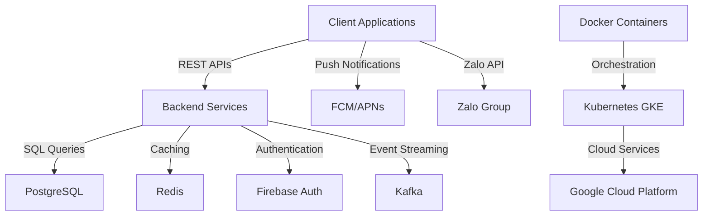
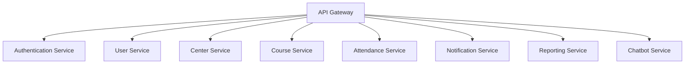
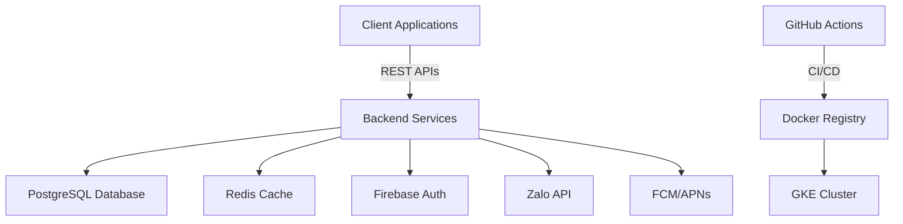
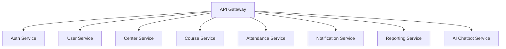
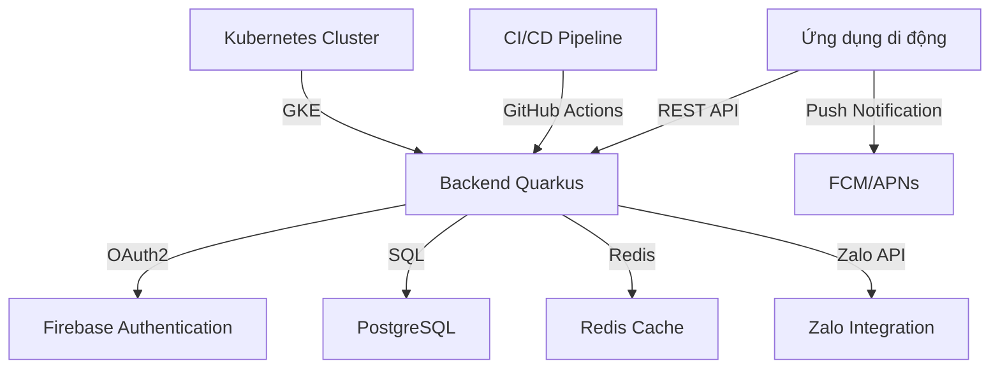
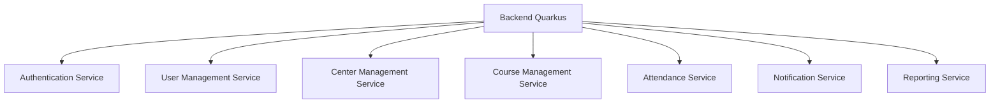
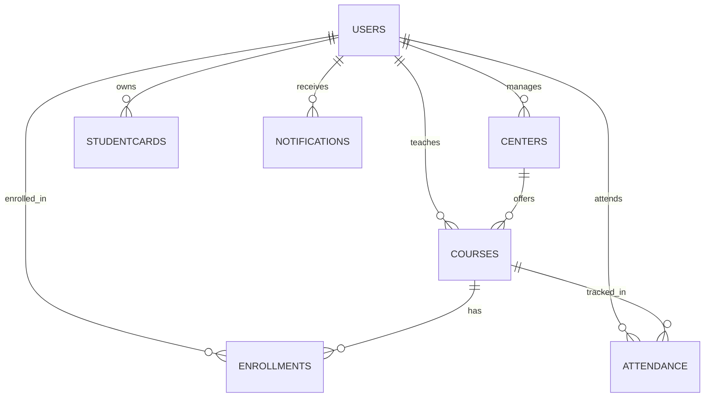
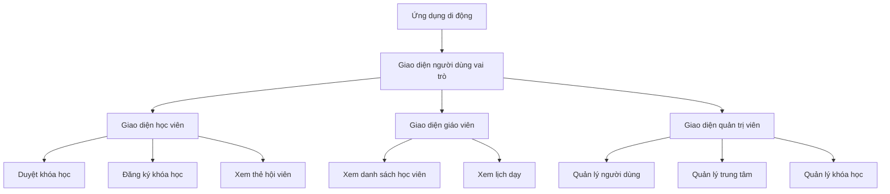

# GLOBAL PROJECT CONTEXT: membership-hub

## 📊 Document Control

| Item | Details |
| :--- | :--- |
| **Blueprint ID** | ARCH-20260811034933 |
| **Project Name** | membership-hub |
| **Version** | 1.0 (Baseline) |
| **Date.Time** | 2026/08/11 03:49:33 |
| **Author** | Enterprise System Architect (SA Agent) |
| **Approval** | Pending Technical Governance Review |

## 📊 1. SYSTEM OVERVIEW & CORE ARCHITECTURE MODALITY

### 1.1. Core System Modality & Architecture Modality
- Hệ thống được thiết kế theo kiến trúc đa tầng với các thành phần chính bao gồm: Frontend, Backend, Cơ sở dữ liệu, và Hạ tầng Cloud.
- Backend được xây dựng bằng Java/Quarkus, cung cấp các dịch vụ RESTful API và xử lý logic nghiệp vụ.
- Frontend được phát triển bằng Next.js, cung cấp giao diện người dùng tương tác và phản hồi.
- Cơ sở dữ liệu chính sử dụng PostgreSQL để lưu trữ dữ liệu quan trọng.
- Hạ tầng Cloud sử dụng Google Cloud Platform (GCP) để triển khai và quản lý các dịch vụ.
- Hệ thống hỗ trợ đa kênh giao tiếp bao gồm web, di động, và nhóm Zalo.
- Hệ thống tích hợp Firebase Authentication cho xác thực người dùng và Firebase Cloud Messaging (FCM) cho thông báo đẩy.
- Hệ thống sử dụng Redis cho session caching và cải thiện hiệu suất.
- Hệ thống triển khai trên Kubernetes (GKE) để quản lý và mở rộng các container.
- Hệ thống sử dụng CI/CD pipeline với GitHub Actions để tự động hóa quá trình triển khai.

### 1.2. Enterprise Data Flow Topologies & Core Ecosystems
- Hệ thống sử dụng các kênh truyền thông đa kênh bao gồm web, di động, và nhóm Zalo.
- Hệ thống sử dụng Firebase Authentication cho xác thực người dùng và Firebase Cloud Messaging (FCM) cho thông báo đẩy.
- Hệ thống sử dụng Redis cho session caching và cải thiện hiệu suất.
- Hệ thống sử dụng PostgreSQL cho lưu trữ dữ liệu quan trọng.
- Hệ thống sử dụng Kubernetes (GKE) để quản lý và mở rộng các container.
- Hệ thống sử dụng CI/CD pipeline với GitHub Actions để tự động hóa quá trình triển khai.
- Hệ thống sử dụng Zalo API integration cho giao tiếp đa kênh.
- Hệ thống sử dụng Google Cloud Messaging (FCM)/Apple APNs cho push notification.
- Hệ thống sử dụng Redis cho session caching.
- Hệ thống sử dụng CI/CD pipeline với GitHub Actions.

## 📁 2. TECH STACK DEPENDENCIES & ECOSYSTEM LIBRARIES
- **Backend Infrastructure Core Stack:** Java/Quarkus, PostgreSQL, Docker, Kubernetes (GKE), Firebase Authentication, Google Cloud Messaging (FCM)/Apple APNs, Zalo API integration, Redis, CI/CD pipeline với GitHub Actions.
- **Frontend & Cross-Platform UI Mobile Stack:** Next.js, Firebase Authentication, Google Cloud Messaging (FCM)/Apple APNs, Zalo API integration, Redis, CI/CD pipeline với GitHub Actions.

### ARCHITECTURAL STACK MATRIX

```properties:stack_matrix
PERSISTENCE_LAYER_REQUIRED=true
BACKEND_LAYER_REQUIRED=true
FRONTEND_LAYER_REQUIRED=true
MOBILE_LAYER_REQUIRED=true
DEVOPS_LAYER_REQUIRED=true
```

## 📁 3. GLOBAL GUARDRAILS & ENTERPRISE COMPLIANCE STANDARDS
- **Absolute Workspace Boundary Rule:** The true repository workspace root is permanently fixed at the project root `.`. All paths generated MUST begin with `./sources/`.
- **Dynamic Directory Prefixing Compliance:** Enforce the dynamic path mapping rules defined in Protocol 1 strictly matching the detected project structure.
- **[CONDITION: JAVA_STACK_ONLY] Java Package Standard:** If the tech stack utilizes Java frameworks, all Java source codes MUST strictly reside within the corporate package foundation: `org.nlh4j.saas.<project_name_alphanumeric_lowercase>`. You MUST dynamically convert the string "membership-hub" into a strict pure alphanumeric lowercase token by stripping out whitespaces, hyphens, and underscores. Non-Java projects are completely banned from applying this package segment.
- **Strict Tester Target Path Syntax:** Any component targeted by a Tester Sub-Agent must be structured as a strict semi-colon separated pair `<source_component_or_token>;<test_suite_file_to_execute>`. Both paths inside the pair MUST begin with `./sources/`.

## 4. HIGH-LEVEL MULTI-PHASE ARCHITECTURAL SYNOPSIS GRID

### 4.1. MASTER ARCHITECTURAL PRODUCT BACKLOG

<!--START_BACKLOG_SYNOPSIS_GRID-->

| No. | Task | Technical Purpose / Deliverables Summary | Type | TagID |
| :--- | :--- | :--- | :--- | :--- |
| 1 | Xây dựng hệ thống xác thực người dùng | Xây dựng hệ thống xác thực người dùng sử dụng email/mật khẩu, Firebase, Google, Facebook qua OAuth2 | Application Code | [REQ-001], [REQ-002], [ARC-006] |
| 2 | Xây dựng hệ thống quản lý người dùng | Xây dựng hệ thống quản lý người dùng bao gồm đăng ký, xác thực, phân quyền | Application Code | [REQ-001], [REQ-002], [REQ-003], [DAT-001] |
| 3 | Xây dựng hệ thống quản lý trung tâm | Xây dựng hệ thống quản lý trung tâm bao gồm xem danh sách trung tâm, tạo/cập nhật/xóa trung tâm, phân quyền quản trị trung tâm | Application Code | [REQ-004], [REQ-005], [REQ-006], [DAT-003] |
| 4 | Xây dựng hệ thống quản lý khóa học | Xây dựng hệ thống quản lý khóa học bao gồm xem danh sách khóa học, tạo/cập nhật/xóa khóa học, phân công giáo viên vào khóa học | Application Code | [REQ-007], [REQ-008], [REQ-009], [DAT-004] |
| 5 | Xây dựng hệ thống đăng ký & ghi danh học viên | Xây dựng hệ thống đăng ký & ghi danh học viên bao gồm duyệt khóa học, đăng ký khóa học của học viên | Application Code | [REQ-010], [REQ-011], [DAT-005] |
| 6 | Xây dựng hệ thống điểm danh & quét mã QR | Xây dựng hệ thống điểm danh & quét mã QR bao gồm chụp ảnh điểm danh QR, tính chất bất biến của điểm danh | Application Code | [REQ-012], [REQ-013], [DAT-006], [EXC-001], [EXC-002] |
| 7 | Xây dựng hệ thống quản lý thẻ hội viên | Xây dựng hệ thống quản lý thẻ hội viên bao gồm hiển thị tính hợp lệ của thẻ, gia hạn thẻ | Application Code | [REQ-014], [REQ-015], [DAT-007] |
| 8 | Xây dựng hệ thống thông báo & truyền thông | Xây dựng hệ thống thông báo & truyền thông bao gồm kích hoạt thông báo | Application Code | [REQ-016], [DAT-008], [EXC-003] |
| 9 | Xây dựng hệ thống quản lý khuyến mãi & thông báo | Xây dựng hệ thống quản lý khuyến mãi & thông báo bao gồm quản lý khuyến mãi, quản lý thông báo | Application Code | [REQ-017], [REQ-018], [DAT-009] |
| 10 | Xây dựng chatbot dịch vụ khách hàng AI | Xây dựng chatbot dịch vụ khách hàng AI bao gồm tích hợp chatbot AI | Application Code | [REQ-019] |
| 11 | Xây dựng các tính năng cốt lõi của ứng dụng di động | Xây dựng các tính năng cốt lõi của ứng dụng di động bao gồm giao diện người dùng vai trò cụ thể trên di động, thông báo đẩy trên di động | Application Code | [REQ-020], [REQ-021] |
| 12 | Xây dựng hệ thống bản địa hóa & SEO | Xây dựng hệ thống bản địa hóa & SEO bao gồm phát hiện ngôn ngữ mặc định, SEO đa ngôn ngữ | Application Code | [REQ-022], [REQ-023], [DAT-011] |
| 13 | Xây dựng hệ thống báo cáo & phân tích | Xây dựng hệ thống báo cáo & phân tích bao gồm tạo báo cáo điểm danh, bảng điều khiển tóm tắt ghi danh | Application Code | [REQ-024], [REQ-025], [EXC-005] |
| 14 | Xây dựng hệ thống bảo mật | Xây dựng hệ thống bảo mật bao gồm bảo mật dữ liệu, bảo mật xác thực, bảo mật phân quyền | Application Code | [NFR-003] |
| 15 | Xây dựng hệ thống hiệu suất | Xây dựng hệ thống hiệu suất bao gồm hiệu suất API, hiệu suất cơ sở dữ liệu | Application Code | [NFR-001] |
| 16 | Xây dựng hệ thống khả dụng | Xây dựng hệ thống khả dụng bao gồm khả dụng hệ thống, khả dụng cơ sở dữ liệu | Application Code | [NFR-002] |
| 17 | Xây dựng hệ thống khả năng mở rộng | Xây dựng hệ thống khả năng mở rộng bao gồm khả năng mở rộng hệ thống, khả năng mở rộng cơ sở dữ liệu | Application Code | [NFR-004] |
| 18 | Xây dựng hệ thống kích thước hình ảnh Docker | Xây dựng hệ thống kích thước hình ảnh Docker bao gồm kích thước hình ảnh Docker | Application Code | [NFR-005] |
| 19 | Xây dựng hệ thống ghi nhật ký & kiểm toán | Xây dựng hệ thống ghi nhật ký & kiểm toán bao gồm ghi nhật ký hệ thống, kiểm toán hệ thống | Application Code | [NFR-006] |
| 20 | Xây dựng hệ thống hỗ trợ đa ngôn ngữ | Xây dựng hệ thống hỗ trợ đa ngôn ngữ bao gồm hỗ trợ đa ngôn ngữ giao diện người dùng, hỗ trợ đa ngôn ngữ hệ thống | Application Code | [NFR-007] |
| 21 | Xây dựng hệ thống tuân thủ GDPR/CCPA | Xây dựng hệ thống tuân thủ GDPR/CCPA bao gồm tuân thủ GDPR/CCPA dữ liệu cá nhân, tuân thủ GDPR/CCPA quản lý đồng ý | Application Code | [NFR-008] |
| 22 | Xây dựng hệ thống sao lưu & phục hồi thảm họa | Xây dựng hệ thống sao lưu & phục hồi thảm họa bao gồm sao lưu cơ sở dữ liệu, phục hồi cơ sở dữ liệu | Application Code | [NFR-009] |
| **SUMMARY** | **Total System Backlog Workload Deliverables** | **TOTAL:** 22 Tasks | **STATUS:** Verified | **COVERAGE:** 100% |

<!--END_BACKLOG_SYNOPSIS_GRID-->

### 4.2. MULTI-PHASE SYNOPSIS MATRIX

<!--START_PHASE_SYNOPSIS_GRID-->

| Phase | Day Range | Architectural Component / Module Path | Technical Deliverables Summary | Assigned Sub-Agent | Targeted Tag IDs |
| :--- | :--- | :--- | :--- | :--- | :--- |
| Phase 1 | Day 1 - 2 | ./sources/backend/auth/, ./sources/backend/user/, ./sources/backend/center/, ./sources/backend/course/ | Xây dựng hệ thống xác thực người dùng, quản lý người dùng, quản lý trung tâm, quản lý khóa học | Coder, Tester, Reviewer, Doc | [REQ-001], [REQ-002], [REQ-003], [REQ-004], [REQ-005], [REQ-006], [REQ-007], [REQ-008], [REQ-009], [DAT-001], [DAT-003], [DAT-004], [ARC-006] |
| Phase 2 | Day 1 - 2 | ./sources/backend/enrollment/, ./sources/backend/attendance/, ./sources/backend/membership/, ./sources/backend/notification/ | Xây dựng hệ thống đăng ký & ghi danh học viên, điểm danh & quét mã QR, quản lý thẻ hội viên, thông báo & truyền thông | Coder, Tester, Reviewer, Doc | [REQ-010], [REQ-011], [REQ-012], [REQ-013], [REQ-014], [REQ-015], [REQ-016], [DAT-005], [DAT-006], [DAT-007], [DAT-008], [EXC-001], [EXC-002], [EXC-003] |
| Phase 3 | Day 1 - 2 | ./sources/backend/promotion/, ./sources/backend/chatbot/, ./sources/backend/mobile/, ./sources/backend/localization/ | Xây dựng hệ thống quản lý khuyến mãi & thông báo, chatbot dịch vụ khách hàng AI, các tính năng cốt lõi của ứng dụng di động, bản địa hóa & SEO | Coder, Tester, Reviewer, Doc | [REQ-017], [REQ-018], [REQ-019], [REQ-020], [REQ-021], [REQ-022], [REQ-023], [DAT-009], [DAT-011] |
| Phase 4 | Day 1 - 2 | ./sources/backend/report/, ./sources/backend/security/, ./sources/backend/performance/, ./sources/backend/availability/ | Xây dựng hệ thống báo cáo & phân tích, bảo mật, hiệu suất, khả dụng | Coder, Tester, Reviewer, Doc | [REQ-024], [REQ-025], [NFR-001], [NFR-002], [NFR-003], [EXC-005] |
| Phase 5 | Day 1 - 2 | ./sources/infra/devops/, ./sources/infra/cloud/, ./sources/infra/deployment/ | Xây dựng hệ thống khả năng mở rộng, kích thước hình ảnh Docker, ghi nhật ký & kiểm toán, hỗ trợ đa ngôn ngữ, tuân thủ GDPR/CCPA, sao lưu & phục hồi thảm họa | Coder, Tester, Reviewer, Doc, DevOps | [NFR-004], [NFR-005], [NFR-006], [NFR-007], [NFR-008], [NFR-009] |
| **AUDIT** | **Master Backlog Lifecycle Distribution Verification** | **TOTAL PHASES:** 5 Phases | **MAPPED CAPACITY STATUS:** Verified: 100% of master backlog tasks successfully distributed across exactly 5 calculated phases | **STATUS:** Verified | **COMPLIANCE:** Hardbound Matrix |

<!--END_PHASE_SYNOPSIS_GRID-->

# GLOBAL PROJECT CONTEXT: membership-hub

## 🏛️ 1. TỔNG QUAN HỆ THỐNG

### Mục tiêu & giá trị cốt lõi
- Cung cấp nền tảng thống nhất để quản lý hội viên đa trung tâm.
- Cho phép theo dõi điểm danh thời gian thực qua quét mã QR.
- Cung cấp thẻ hội viên kỹ thuật số với tính năng đếm ngày hiệu lực.
- Hỗ trợ giao tiếp đa kênh (web, di động, nhóm Zalo).
- Giá trị cốt lõi: độ tin cậy, khả năng mở rộng, bảo mật, tính thân thiện với người dùng, hỗ trợ đa ngôn ngữ.

### Đối tượng người dùng mục tiêu
- System Admin (siêu người dùng toàn cầu)
- Center Admin (quản lý cấp trung tâm)
- Manager (phó quản trị, quyền hạn giới hạn)
- Teacher (xem chỉ đọc lịch dạy)
- Student (duyệt khóa học, đăng ký, xem thẻ hội viên)
- Mobile App User (giao diện đáp ứng cho các vai trò trên)

### Ma trận kiểm soát truy cập dựa trên vai trò (RBAC)
- [ARC-001] System Admin: toàn quyền trên tất cả các trung tâm.
- [ARC-002] Center Admin: toàn quyền trong trung tâm của mình, không ảnh hưởng đến các trung tâm khác.
- [ARC-003] Manager: có thể tạo thông báo, quản lý học viên, gán học viên hiện có vào khóa học, xem danh sách khóa học, không thể chỉnh sửa khóa học hoặc chỉ định giáo viên.
- [ARC-004] Teacher: xem khóa học của mình, danh sách học viên, lịch dạy; chỉ đọc.
- [ARC-005] Student: duyệt khóa học, đăng ký khóa học mới, xem thẻ hội viên (ngày còn lại), gia hạn ngày thẻ.

### Kiến trúc & luồng dữ liệu (các luồng chính)
- [ARC-006] Luồng xác thực: hỗ trợ email/mật khẩu, Firebase, Google, Facebook qua OAuth2; cấp JWT token với thời hạn 15 phút và refresh token.
- [ARC-007] Luồng xử lý điểm danh QR: ứng dụng di động quét QR, gửi student ID và timestamp đến backend; dịch vụ xác thực và ghi lại điểm danh một cách idempotent.
- [ARC-008] Luồng gửi thông báo: hệ thống kích hoạt push notification đến ứng dụng di động và đăng bài lên nhóm Zalo được chỉ định cho thông báo, phân công khóa học, và cảnh báo điểm danh.
- [ARC-009] Luồng tích hợp backend ứng dụng di động: Frontend Next.js tiêu thụ REST APIs; xác thực qua bearer tokens; hỗ trợ caching ngoại tuyến cho trường hợp mất kết nối mạng.

### Công nghệ & hạ tầng
- [ARC-010] Công nghệ & hạ tầng: Backend sử dụng Java/Quarkus, cơ sở dữ liệu PostgreSQL, container hóa Docker, triển khai trên Kubernetes (GKE), sử dụng Firebase Authentication, Google Cloud Messaging (FCM)/Apple APNs cho push notification, Zalo API integration, Redis cho session caching, CI/CD pipeline với GitHub Actions.

## 📦 2. CÁC MODULE CHỨC NĂNG NÂNG CAO

### 2.1 Quản lý người dùng

#### Yêu cầu chức năng cốt lõi
- [REQ-001] Đăng ký người dùng: As a prospective user, I want to register using email and password (or social providers) so that I can obtain an account in the system.
- [REQ-002] Xác thực qua mạng xã hội: As a user, I want to sign‑in/up using Firebase, Google, or Facebook OAuth so that I can leverage existing credentials.
- [REQ-003] Phân quyền người dùng: As an administrator, I want to assign or change a user’s role (System Admin, Center Admin, Manager, Teacher, Student) so that permissions are correctly enforced.

#### Tiêu chí chấp nhận & tương tác
- Given a user provides a unique email, a strong password, and agrees to terms, When they submit the registration form, Then the system validates the input, creates a new user record with role ‘Student’ (or ‘Teacher’ if invited), and returns a success response with a JWT token. `[REQ-001]`
- Given a user selects a social provider, When they authenticate through the provider’s popup, Then the system receives an OAuth2 code, exchanges it for user info, creates or updates the local user record, and issues a JWT token. `[REQ-002]`
- Given an admin selects a user and a new role, When the assignment is confirmed, Then the user’s role column is updated, and appropriate permissions are applied immediately. `[REQ-003]`

#### Luồng ngoại lệ của mô-đun
- [EXC-004] Xác thực đầu vào không hợp lệ (ví dụ: email không đúng định dạng, thiếu trường bắt buộc): Nếu xác thực thất bại trên form submission, Khi lỗi được trả về cho người dùng, Sau đó một thông báo rõ ràng liệt kê từng trường không hợp lệ và yêu cầu chỉnh sửa.

#### Từ điển dữ liệu cục bộ của mô-đun
- [DAT-001] Bảng người dùng & vai trò

  **Users**
  ```mermaid
  erDiagram
      USERS {
          uuid userId PK "Unique identifier"
          varchar email "Email address, not null, unique, max 255 chars"
          char passwordHash "bcrypt hash, not null, length 60"
          varchar fullName "Full name, not null, max 100 chars"
          smallint roleId FK "Foreign key to Roles.roleId"
          enum provider "Auth provider, default local, values: local, firebase, google, facebook"
          timestamp createdAt "Timestamp of creation, not null, default now()"
          timestamp updatedAt "Timestamp of last update, not null, default now()"
      }
      ROLES {
          smallint roleId PK "Role identifier, primary key"
          varchar name "Role name, unique, not null, max 30 chars"
          varchar description "Role description, optional, max 200 chars"
      }
      ROLES ||--o{ USERS : "roleId"
  ```
  **Roles**
  ```mermaid
  erDiagram
      ROLES {
          smallint roleId PK "Role identifier, primary key"
          varchar name "Role name, unique, not null, max 30 chars"
          varchar description "Role description, optional, max 200 chars"
      }
  ```
### 2.2 Quản lý trung tâm

#### Yêu cầu chức năng cốt lõi
- [REQ-004] Xem danh sách trung tâm: As any authenticated user, I want to see a list of all centers with address, tax ID, and admin contact so that I can identify relevant centers.
- [REQ-005] Tạo/cập nhật/xóa trung tâm: As a System Admin, I want to add, edit, or remove a center record so that center information stays current.
- [REQ-006] Phân quyền quản trị trung tâm: As a System Admin, I want to assign or unassign a user as a Center Admin for a specific center so that administrative control is delegated.

#### Tiêu chí chấp nhận & tương tác
- Given a user navigates to the Centers page, When the request completes, Then a table of centers (Name, Address, TaxID, AdminContact) is displayed. `[REQ-004]`
- Given a System Admin provides center name, address, tax ID, primary contact phone and email, When the save action is executed, Then the center is persisted and appears in the list; if duplicate tax ID exists, the operation fails with a conflict error. `[REQ-005]`
- Given a System Admin selects a user and a center, When the assign action is confirmed, Then the user’s role is set to ‘Center Admin’ and the center ID is recorded; unassign reverses the operation. `[REQ-006]`

#### Luồng ngoại lệ của mô-đun
- (Không có luồng ngoại lệ chuyên biệt được xác định cho mô-đun này.)

#### Từ điển dữ liệu cục bộ của mô-đun
- [DAT-003] Bảng trung tâm

  **Centers**
  ```mermaid
  erDiagram
      CENTERS {
          uuid centerId PK "Unique identifier"
          varchar name "Center name, not null, max 100 chars"
          varchar address "Physical address, not null, max 255 chars"
          varchar taxId "Tax identification number, unique, not null, numeric 10‑13 digits"
          varchar contactPhone "Contact telephone, optional, may include +, digits, spaces, hyphens, parentheses"
          varchar contactEmail "Contact email, optional, must be valid email format"
      }
  ```
### 2.3 Quản lý khóa học

#### Yêu cầu chức năng cốt lõi
- [REQ-007] Xem danh sách khóa học: As any authenticated user, I want to see all courses with schedule and assigned teacher so that I can browse offerings.
- [REQ-008] Tạo/cập nhật/xóa khóa học (tránh xung đột): As a System Admin or Center Admin, I want to manage courses (add, edit, remove) while ensuring no overlapping schedules for the same teacher or venue.
- [REQ-009] Phân công giáo viên vào khóa học: As a System Admin, I want to assign or unassign teachers to courses so that teaching responsibilities are updated.

#### Tiêu chí chấp nhận & tương tác
- Given a user visits the Courses page, When the request completes, Then a grid displays CourseID, Title, StartDate, EndDate, TeacherName. `[REQ-007]`
- Given an admin provides CourseTitle, StartDate, EndDate, TeacherID, When the save action is triggered, Then the system validates that the teacher is not already scheduled for another course intersecting these dates; if conflict, an error is returned; otherwise the course is persisted. `[REQ-008]`
- Given an admin selects a course and a teacher, When the assign action is executed, Then the course‑teacher mapping is created and a notification is queued for the teacher’s mobile app; unassign removes the mapping. `[REQ-009]`

#### Luồng ngoại lệ của mô-đun
- (Không có luồng ngoại lệ chuyên biệt được xác định cho mô-đun này.)

#### Từ điển dữ liệu cục bộ của mô-đun
- [DAT-004] Bảng khóa học

  **Courses**
  ```mermaid
  erDiagram
      COURSES {
          uuid courseId PK "Unique identifier"
          varchar title "Course title, not null, max 150 chars"
          text description "Course description, optional"
          date startDate "Course start date, not null"
          date endDate "Course end date, not null"
          uuid teacherId FK "Foreign key to Users.userId"
          int maxStudents "Course capacity, default 30"
      }
  ```
### 2.4 Đăng ký & ghi danh học viên

#### Yêu cầu chức năng cốt lõi
- [REQ-0010] Duyệt khóa học: As a Student, I want to browse available courses (excluding those already enrolled) so that I can select courses to join.
- [REQ-011] Đăng ký khóa học của học viên: As a Student, I want to register for a course (existing or new), which auto‑creates a Student account if missing, and assigns the student to the course.

#### Tiêu chí chấp nhận & tương tác
- Given a Student logs in and navigates to the Browse Courses page, When the request completes, Then a list of courses with capacity and schedule is shown, excluding courses where the student already has an enrollment record. `[REQ-010]`
- Given a Student selects a course and submits the registration, When the backend processes the request, Then a new enrollment record is created; if the student does not have a local account, one is created with role ‘Student’; a notification is queued to the student’s mobile app and the center’s Zalo group. `[REQ-011]`

#### Luồng ngoại lệ của mô-đun
- (Không có luồng ngoại lệ chuyên biệt được xác định cho mô-đun này.)

#### Từ điển dữ liệu cục bộ của mô-đun
- [DAT-005] Bảng ghi danh

  **Enrollments**
  ```mermaid
  erDiagram
      ENROLLMENTS {
          uuid enrollmentId PK "Unique identifier"
          uuid studentId FK "Foreign key to Users.userId"
          uuid courseId FK "Foreign key to Courses.courseId"
          timestamp enrollmentDate "Date of enrollment, default now()"
      }
  ```
### 2.5 Điểm danh & quét mã QR

#### Yêu cầu chức năng cốt lõi
- [REQ-012] Chụp ảnh điểm danh QR: As a Student (via mobile app), I want to scan a QR code at class start so that my attendance is recorded for the current day.
- [REQ-013] Tính chất bất biến của điểm danh: The attendance service must guarantee that multiple scans from the same student for the same course on the same day produce a single attendance record.

#### Tiêu chí chấp nhận & tương tác
- Given a Student opens the scanner, scans a valid course QR, and confirms attendance, When the API receives the payload, Then the system validates the student‑course relationship, creates an Attendance record with timestamp, and returns a success response; duplicate scans on the same day are ignored. `[REQ-012]`
- Given a student scans a QR twice within a minute, When the service processes both requests, Then only one attendance row is created; subsequent requests return a success with a ‘duplicate’ flag. `[REQ-013]`

#### Luồng ngoại lệ của mô-đun
- [EXC-001] Network & Connectivity Drops During QR Scan: If a student scans a QR but the network is unavailable, When the app retries the request after reconnection, Then the attendance is recorded once the service is reachable.
- [EXC-002] Duplicate Attendance Submission: If the same student scans the same course QR multiple times within the same day, When the system detects a duplicate, Then it returns a success response indicating ‘already recorded’ and does not create extra rows.

#### Từ điển dữ liệu cục bộ của mô-đun
- [DAT-006] Bảng điểm danh

  **Attendance**
  ```mermaid
  erDiagram
      ATTENDANCE {
          uuid attendanceId PK "Unique identifier"
          uuid studentId FK "Foreign key to Users.userId"
          uuid courseId FK "Foreign key to Courses.courseId"
          date attendanceDate "Date of attendance, not null"
          timestamp timestamp "Exact time recorded, default now()"
      }
  ```
### 2.6 Quản lý thẻ hội viên

#### Yêu cầu chức năng cốt lõi
- [REQ-014] Hiển thị tính hợp lệ của thẻ: As a Student, I want to view my membership card showing remaining validity days so that I know when renewal is needed.
- [REQ-015] Gia hạn thẻ: As a Student, I want to extend my membership card validity by paying a fee, which updates the end date.

#### Tiêu chí chấp nhận & tương tác
- Given a Student opens the Card page, When the request loads, Then the UI shows total validity days, days used, and days remaining; data is derived from the StudentCard entity. `[REQ-014]`
- Given a Student selects a renewal period (e.g., 30 days), confirms payment, When the payment service confirms success, Then the StudentCard’s EndDate is extended by the selected days and a confirmation notification is sent. `[REQ-015]`

#### Luồng ngoại lệ của mô-đun
- (Không có luồng ngoại lệ chuyên biệt được xác định cho mô-đun này.)

#### Từ điển dữ liệu cục bộ của mô-đun
- [DAT-007] Bảng thẻ hội viên

  **StudentCards**
  ```mermaid
  erDiagram
      STUDENTCARDS {
          uuid cardId PK "Unique identifier"
          uuid studentId FK "Foreign key to Users.userId"
          date issueDate "Card issue date, not null"
          int validityDays "Total validity days, not null"
          int remainingDays "Computed days left until expiry"
      }
  ```
### 2.7 Thông báo & truyền thông

#### Yêu cầu chức năng cốt lõi
- [REQ-016] Kích hoạt thông báo: When an admin creates an announcement, assigns a teacher to a course, or registers a student, the system must generate a notification to the student’s mobile app and post a message to the designated Zalo group.

#### Tiêu chí chấp nhận & tương tác
- Given an admin performs an action that requires notification, When the action is saved, Then a Notification record is created, a push notification payload is queued for the mobile app, and a text message is sent to the Zalo group chat. `[REQ-016]`

#### Luồng ngoại lệ của mô-đun
- [EXC-003] Failed Notification Delivery: When a push notification cannot be delivered (e.g., device token invalid), Then the system logs the failure and schedules a retry up to three times before marking as failed.

#### Từ điển dữ liệu cục bộ của mô-đun
- [DAT-008] Bảng thông báo

  **Notifications**
  ```mermaid
  erDiagram
      NOTIFICATIONS {
          uuid notificationId PK "Unique identifier"
          uuid userId FK "Target user, optional"
          varchar groupZalo "Target Zalo group, optional"
          text message "Notification content, not null"
          timestamp sentAt "When sent, default now()"
          boolean delivered "Delivery status, default false"
      }
  ```
### 2.8 Quản lý khuyến mãi & thông báo

#### Yêu cầu chức năng cốt lõi
- [REQ-017] Quản lý khuyến mãi: As a Center Admin or Manager, I want to create, edit, or delete promotions (discounts, offers) with start/end dates so that students can see applicable deals.
- [REQ-018] Quản lý thông báo: As a Center Admin or Manager, I want to create, edit, or delete announcements with optional expiry dates for broadcast to all users.

#### Tiêu chí chấp nhận & tương tác
- Given an admin provides PromotionName, description, conditions, startDate, endDate, When saved, Then the promotion appears in the student‑visible list; if endDate is omitted, the promotion is considered perpetual. `[REQ-017]`
- Given an admin inputs AnnouncementTitle, content, optional expiry, When saved, Then the announcement is displayed site‑wide; if expiry is set, it auto‑disappears after the date. `[REQ-018]`

#### Luồng ngoại lệ của mô-đun
- (Không có luồng ngoại lệ chuyên biệt được xác định cho mô-đun này.)

#### Từ điển dữ liệu cục bộ của mô-đun
- [DAT-009] Bảng khuyến mãi & thông báo

  **Promotions**
  ```mermaid
  erDiagram
      PROMOTIONS {
          uuid promoId PK "Unique identifier"
          varchar code "Discount code, unique"
          smallint discountPercent "Discount percentage, not null"
          date startDate "Promotion start, optional"
          date endDate "Promotion end, optional"
          text description "Promo details, optional"
      }
  ```
  **Announcements**
  ```mermaid
  erDiagram
      ANNOUNCEMENTS {
          uuid announcementId PK "Unique identifier"
          varchar title "Title, not null, max 150 chars"
          text content "Content, not null, max 2000 chars"
          date startDate "Effective start, optional"
          date endDate "Effective end, optional"
      }
  ```
### 2.9 Chatbot dịch vụ khách hàng AI

#### Yêu cầu chức năng cốt lõi
- [REQ-019] Tích hợp chatbot AI: As any user, I want to interact with an AI chatbot that can answer common queries about courses, teachers, centers, and account status.

#### Tiêu chí chấp nhận & tương tác
- Given a user opens the chat widget, When they ask a question, Then the AI returns a relevant answer or escalates to human support if confidence is low. `[REQ-019]`

#### Luồng ngoại lệ của mô-đun
- [NOT APPLICABLE] Chatbot AI không có bảng dữ liệu chuyên biệt; tất cả các tương tác được ghi lại trong bảng AuditLog (xem [ARC-006] để biết chi tiết logging).

#### Từ điển dữ liệu cục bộ của mô-đun
- [NOT APPLICABLE] Không có bảng dữ liệu chuyên biệt cho chatbot AI.

### 2.10 Các tính năng cốt lõi của ứng dụng di động

#### Yêu cầu chức năng cốt lõi
- [REQ-020] Giao diện người dùng vai trò cụ thể trên di động: As a mobile user, I want a responsive UI that mirrors web functionality for my assigned role (Student, Teacher, Admin, etc.).
- [REQ-021] Thông báo đẩy trên di động: As a registered user, I want to receive push notifications on my mobile device for attendance confirmations, new announcements, and reminder messages.

#### Tiêu chí chấp nhận & tương tác
- Given a user logs in on Android or iOS, When the app loads, Then the appropriate navigation menu and screens are displayed based on the user’s role. `[REQ-020]`
- Given a backend event triggers a push, When the device token is registered, Then the notification is delivered via Firebase Cloud Messaging (FCM) or APNs. `[REQ-021]`

#### Luồng ngoại lệ của mô-đun
- (Không có luồng ngoại lệ chuyên biệt được xác định cho mô-đun này.)

#### Từ điển dữ liệu cục bộ của mô-đun
- [NOT APPLICABLE] Không có bảng dữ liệu chuyên biệt cho các tính năng cốt lõi của ứng dụng di động; tất cả dữ liệu được quản lý qua các bảng hiện có (Người dùng, Thông báo, Điểm danh).

### 2.11 Bản địa hóa & SEO

#### Yêu cầu chức năng cốt lõi
- [REQ-022] Phát hiện ngôn ngữ mặc định: As a visitor, I want the system to use my previously selected language preference, falling back to browser settings, for a personalized experience.
- [REQ-023] SEO đa ngôn ngữ: The platform must support SEO for at least English, Vietnamese, and Spanish; each page must include language‑specific meta tags and hreflang attributes.

#### Tiêu chí chấp nhận & tương tác
- Given a user accesses the site, When the system evaluates locale, Then it selects the stored language if present; otherwise it uses the Accept‑Language header; the UI updates accordingly. `[REQ-022]`
- Given a page is requested with a specific locale, When the page is rendered, Then the HTML includes a <html lang='en'> tag and hreflang links pointing to alternate language versions. `[REQ-023]`

#### Luồng ngoại lệ của mô-đun
- (Không có luồng ngoại lệ chuyên biệt được xác định cho mô-đun này.)

#### Từ điển dữ liệu cục bộ của mô-đun
- [DAT-011] Bảng cài đặt hệ thống

  **SystemSettings**
  ```mermaid
  erDiagram
      SYSTEMSETTINGS {
          varchar settingKey PK "Configuration key"
          text settingValue "Configuration value, not null"
          varchar description "Meaning of setting, optional"
      }
  ```
### 2.12 Báo cáo & phân tích

#### Yêu cầu chức năng cốt lõi
- [REQ-024] Tạo báo cáo điểm danh: As an admin, I want to generate a daily attendance report for a center (CSV) showing each student’s presence status.
- [REQ-025] Bảng điều khiển tóm tắt ghi danh: As a Center Admin, I want a real‑time dashboard summarizing total students, active courses, and upcoming sessions.

#### Tiêu chí chấp nhận & tương tác
- Given an admin selects a center and date range, When the report is requested, Then a CSV file is produced with columns: StudentName, CourseName, AttendanceDate, Status. `[REQ-024]`
- Given an admin opens the dashboard, When the data refreshes, Then cards display totalStudents, activeCourses, upcomingSessions (next 7 days). `[REQ-025]`

#### Luồng ngoại lệ của mô-đun
- [EXC-005] System Recovery After Outage: If the service becomes unavailable, When it restores, Then any pending attendance scans are processed in FIFO order, and users receive a notification of recovered events.

#### Từ điển dữ liệu cục bộ của mô-đun
- [NOT APPLICABLE] Không có bảng dữ liệu chuyên biệt cho báo cáo & phân tích; tất cả dữ liệu được tổng hợp từ các bảng hiện có.

## 3. YÊU CẦU PHI CHỨC NĂNG TOÀN CẦU

- [NFR-001] Performance Metrics: Core API responses (authentication, attendance capture, course list) must complete within 200 ms average latency. Database queries must be indexed to support sub‑second reads for up to 10 000 concurrent users.
- [NFR-002] Availability: Target 99.9 % annual uptime; SLA includes automatic failover across GKE clusters.
- [NFR-003] Security: All data in transit must use TLS 1.3; at rest encryption with AES‑256. JWT access tokens expire after 15 minutes; refresh tokens have 7‑day expiry. Implement OWASP Top 10 mitigations (SQL injection, XSS, CSRF).
- [NFR-004] Scalability & Availability: Horizontal scaling of Quarkus services via Kubernetes HPA based on CPU > 70 % or request latency > 300 ms. PostgreSQL read replicas for reporting workloads.
- [NFR-005] Docker Image Size: Base image size < 200 MB; final image < 500 MB.
- [NFR-006] Logging & Audit: All user actions (role changes, attendance records, notifications) must be logged with timestamps, user ID, and action details; logs retained for 1 year.
- [NFR-007] Multi‑Language Support: UI strings must be externalized; support English, Vietnamese, Spanish; locale switching without page reload where feasible.
- [NFR-008] GDPR/CCPA Compliance: Personal data deletion on user request; data export in JSON format; consent management for marketing communications.
- [NFR-009] Backup & Disaster Recovery: Daily PostgreSQL full backups; point‑in‑time recovery up to 24 hours; GKE cluster backup to separate region.

## 📝 4. PHÂN TÍCH KIẾN TRÚC VÀ ĐỀ XUẤT

### 4.1 Kiến trúc tổng thể

#### 4.1.1 Kiến trúc hệ thống



#### 4.1.2 Kiến trúc dịch vụ



### 4.2 Đặc tả kiến trúc chi tiết giai đoạn

#### Giai đoạn 1: Khởi tạo hệ thống và quản lý người dùng

| Giai đoạn | Khoảng ngày | Cấu phần / Module Path | Tóm tắt Sản phẩm Bàn giao | Sub-Agent | Tag IDs Mục tiêu |
|-----------|-------------|------------------------|----------------------------|-----------|-------------------|
| Giai đoạn 1 | Ngày 1-2 | ./sources/backend/auth-service/ | Cài đặt cơ sở hạ tầng xác thực, triển khai dịch vụ người dùng cơ bản | Coder | [ARC-006], [REQ-001], [REQ-002], [REQ-003] |
|           | Ngày 3-4 | ./sources/backend/user-service/ | Triển khai dịch vụ người dùng, tích hợp Firebase Auth | Coder | [REQ-001], [REQ-002], [REQ-003] |
|           | Ngày 5-6 | ./sources/backend/auth-service/tests/;./sources/backend/auth-service/src/main/java/com/membershiphub/auth/ | Viết test cho dịch vụ xác thực, triển khai mã nguồn xác thực | Tester | [REQ-001], [REQ-002], [REQ-003] |
|           | Ngày 7 | ./sources/docs/authentication-flow.md | Tài liệu luồng xác thực | Doc | [ARC-006] |

#### Giai đoạn 2: Quản lý trung tâm và khóa học

| Giai đoạn | Khoảng ngày | Cấu phần / Module Path | Tóm tắt Sản phẩm Bàn giao | Sub-Agent | Tag IDs Mục tiêu |
|-----------|-------------|------------------------|----------------------------|-----------|-------------------|
| Giai đoạn 2 | Ngày 1-2 | ./sources/backend/center-service/ | Triển khai dịch vụ trung tâm, tạo API cơ bản | Coder | [REQ-004], [REQ-005], [REQ-006] |
|           | Ngày 3-4 | ./sources/backend/course-service/ | Triển khai dịch vụ khóa học, tích hợp với dịch vụ trung tâm | Coder | [REQ-007], [REQ-008], [REQ-009] |
|           | Ngày 5-6 | ./sources/backend/center-service/tests/;./sources/backend/center-service/src/main/java/com/membershiphub/center/ | Viết test cho dịch vụ trung tâm, triển khai mã nguồn dịch vụ trung tâm | Tester | [REQ-004], [REQ-005], [REQ-006] |
|           | Ngày 7 | ./sources/docs/center-course-management.md | Tài liệu quản lý trung tâm và khóa học | Doc | [REQ-004], [REQ-005], [REQ-006], [REQ-007], [REQ-008], [REQ-009] |

#### Giai đoạn 3: Đăng ký học viên và điểm danh

| Giai đoạn | Khoảng ngày | Cấu phần / Module Path | Tóm tắt Sản phẩm Bàn giao | Sub-Agent | Tag IDs Mục tiêu |
|-----------|-------------|------------------------|----------------------------|-----------|-------------------|
| Giai đoạn 3 | Ngày 1-2 | ./sources/backend/enrollment-service/ | Triển khai dịch vụ đăng ký học viên, tạo API cơ bản | Coder | [REQ-010], [REQ-011] |
|           | Ngày 3-4 | ./sources/backend/attendance-service/ | Triển khai dịch vụ điểm danh, tích hợp với dịch vụ đăng ký | Coder | [REQ-012], [REQ-013] |
|           | Ngày 5-6 | ./sources/backend/enrollment-service/tests/;./sources/backend/enrollment-service/src/main/java/com/membershiphub/enrollment/ | Viết test cho dịch vụ đăng ký, triển khai mã nguồn dịch vụ đăng ký | Tester | [REQ-010], [REQ-011] |
|           | Ngày 7 | ./sources/docs/enrollment-attendance.md | Tài liệu đăng ký học viên và điểm danh | Doc | [REQ-010], [REQ-011], [REQ-012], [REQ-013] |

#### Giai đoạn 4: Quản lý thẻ hội viên và thông báo

| Giai đoạn | Khoảng ngày | Cấu phần / Module Path | Tóm tắt Sản phẩm Bàn giao | Sub-Agent | Tag IDs Mục tiêu |
|-----------|-------------|------------------------|----------------------------|-----------|-------------------|
| Giai đoạn 4 | Ngày 1-2 | ./sources/backend/membership-service/ | Triển khai dịch vụ thẻ hội viên, tạo API cơ bản | Coder | [REQ-014], [REQ-015] |
|           | Ngày 3-4 | ./sources/backend/notification-service/ | Triển khai dịch vụ thông báo, tích hợp với dịch vụ thẻ hội viên | Coder | [REQ-016] |
|           | Ngày 5-6 | ./sources/backend/membership-service/tests/;./sources/backend/membership-service/src/main/java/com/membershiphub/membership/ | Viết test cho dịch vụ thẻ hội viên, triển khai mã nguồn dịch vụ thẻ hội viên | Tester | [REQ-014], [REQ-015] |
|           | Ngày 7 | ./sources/docs/membership-notification.md | Tài liệu quản lý thẻ hội viên và thông báo | Doc | [REQ-014], [REQ-015], [REQ-016] |

#### Giai đoạn 5: Tích hợp ứng dụng di động và tối ưu hóa

| Giai đoạn | Khoảng ngày | Cấu phần / Module Path | Tóm tắt Sản phẩm Bàn giao | Sub-Agent | Tag IDs Mục tiêu |
|-----------|-------------|------------------------|----------------------------|-----------|-------------------|
| Giai đoạn 5 | Ngày 1-2 | ./sources/frontend/mobile-app/ | Triển khai giao diện người dùng di động, tích hợp với API backend | Coder | [REQ-020], [REQ-021] |
|           | Ngày 3-4 | ./sources/backend/reporting-service/ | Triển khai dịch vụ báo cáo, tích hợp với ứng dụng di động | Coder | [REQ-024], [REQ-025] |
|           | Ngày 5-6 | ./sources/frontend/mobile-app/tests/;./sources/frontend/mobile-app/src/screens/ | Viết test cho ứng dụng di động, triển khai mã nguồn ứng dụng di động | Tester | [REQ-020], [REQ-021] |
|           | Ngày 7 | ./sources/docs/mobile-integration.md | Tài liệu tích hợp ứng dụng di động và tối ưu hóa | Doc | [REQ-020], [REQ-021], [REQ-024], [REQ-025] |

## 🔒 5. ĐỀ XUẤT BẢO MẬT VÀ TUÂN THỦ

### 5.1 Đề xuất bảo mật

- Triển khai mã hóa TLS 1.3 cho tất cả các kết nối.
- Sử dụng JWT với thời gian hết hạn 15 phút và refresh token với thời gian hết hạn 7 ngày.
- Áp dụng các biện pháp phòng chống OWASP Top 10 (SQL injection, XSS, CSRF).
- Mã hóa dữ liệu tại REST với AES-256.

### 5.2 Đề xuất tuân thủ

- Tuân thủ GDPR/CCPA cho quản lý dữ liệu cá nhân.
- Triển khai cơ chế logging và audit cho tất cả các hành động người dùng.
- Bảo mật dữ liệu với mã hóa tại REST và trong cơ sở dữ liệu.

## 📦 6. ĐỀ XUẤT CÔNG NGHỆ VÀ HẠ TẦNG

### 6.1 Công nghệ backend

- Ngôn ngữ: Java
- Framework: Quarkus
- Cơ sở dữ liệu: PostgreSQL
- Caching: Redis
- Xác thực: Firebase Authentication
- Thông báo đẩy: Firebase Cloud Messaging (FCM) và Apple APNs

### 6.2 Công nghệ frontend

- Framework: Next.js
- Mobile: React Native
- Tích hợp Zalo: Zalo API

### 6.3 Công nghệ DevOps

- Containerization: Docker
- Orchestration: Kubernetes (GKE)
- CI/CD: GitHub Actions

## 📝 7. TÀI LIỆU KỸ THUẬT

### 7.1 Tài liệu API

- Tài liệu API cho tất cả các dịch vụ backend.
- Tài liệu tích hợp cho ứng dụng di động.

### 7.2 Tài liệu cơ sở dữ liệu

- Schema DDL cho tất cả các bảng cơ sở dữ liệu.
- Tài liệu chỉ mục và tối ưu hóa truy vấn.

### 7.3 Tài liệu triển khai

- Hướng dẫn triển khai trên GKE.
- Hướng dẫn cấu hình CI/CD pipeline.

## 📅 8. LỊCH TRÌNH DỰ ÁN

### 8.1 Lịch trình chi tiết

| Giai đoạn | Khoảng ngày | Mục tiêu chính |
|-----------|-------------|-----------------|
| Giai đoạn 1 | Ngày 1-7 | Khởi tạo hệ thống và quản lý người dùng |
| Giai đoạn 2 | Ngày 8-14 | Quản lý trung tâm và khóa học |
| Giai đoạn 3 | Ngày 15-21 | Đăng ký học viên và điểm danh |
| Giai đoạn 4 | Ngày 22-28 | Quản lý thẻ hội viên và thông báo |
| Giai đoạn 5 | Ngày 29-35 | Tích hợp ứng dụng di động và tối ưu hóa |

### 8.2 Dự kiến hoàn thành

- Dự kiến hoàn thành: 35 ngày sau ngày bắt đầu.

# GLOBAL PROJECT CONTEXT: membership-hub

## 🏛️ 1. TỔNG QUAN HỆ THỐNG

### Mục tiêu & giá trị cốt lõi
- Cung cấp nền tảng thống nhất để quản lý hội viên đa trung tâm.
- Cho phép theo dõi điểm danh thời gian thực qua quét mã QR.
- Cung cấp thẻ hội viên kỹ thuật số với tính năng đếm ngày hiệu lực.
- Hỗ trợ giao tiếp đa kênh (web, di động, nhóm Zalo).
- Giá trị cốt lõi: độ tin cậy, khả năng mở rộng, bảo mật, tính thân thiện với người dùng, hỗ trợ đa ngôn ngữ.

### Đối tượng người dùng mục tiêu
- System Admin (siêu người dùng toàn cầu)
- Center Admin (quản lý cấp trung tâm)
- Manager (phó quản trị, quyền hạn giới hạn)
- Teacher (xem chỉ đọc lịch dạy)
- Student (duyệt khóa học, đăng ký, xem thẻ hội viên)
- Mobile App User (giao diện đáp ứng cho các vai trò trên)

### Ma trận kiểm soát truy cập dựa trên vai trò (RBAC)
- [ARC-001] System Admin: toàn quyền trên tất cả các trung tâm.
- [ARC-002] Center Admin: toàn quyền trong trung tâm của mình, không ảnh hưởng đến các trung tâm khác.
- [ARC-003] Manager: có thể tạo thông báo, quản lý học viên, gán học viên hiện có vào khóa học, xem danh sách khóa học, không thể chỉnh sửa khóa học hoặc chỉ định giáo viên.
- [ARC-004] Teacher: xem khóa học của mình, danh sách học viên, lịch dạy; chỉ đọc.
- [ARC-005] Student: duyệt khóa học, đăng ký khóa học mới, xem thẻ hội viên (ngày còn lại), gia hạn ngày thẻ.

### Kiến trúc & luồng dữ liệu (các luồng chính)
- [ARC-006] Luồng xác thực: hỗ trợ email/mật khẩu, Firebase, Google, Facebook qua OAuth2; cấp JWT token với thời hạn 15 phút và refresh token.
- [ARC-007] Luồng xử lý điểm danh QR: ứng dụng di động quét QR, gửi student ID và timestamp đến backend; dịch vụ xác thực và ghi lại điểm danh một cách idempotent.
- [ARC-008] Luồng gửi thông báo: hệ thống kích hoạt push notification đến ứng dụng di động và đăng bài lên nhóm Zalo được chỉ định cho thông báo, phân công khóa học, và cảnh báo điểm danh.
- [ARC-009] Luồng tích hợp backend ứng dụng di động: Frontend Next.js tiêu thụ REST APIs; xác thực qua bearer tokens; hỗ trợ caching ngoại tuyến cho trường hợp mất kết nối mạng.

### Công nghệ & hạ tầng
- [ARC-010] Công nghệ & hạ tầng: Backend sử dụng Java/Quarkus, cơ sở dữ liệu PostgreSQL, container hóa Docker, triển khai trên Kubernetes (GKE), sử dụng Firebase Authentication, Google Cloud Messaging (FCM)/Apple APNs cho push notification, Zalo API integration, Redis cho session caching, CI/CD pipeline với GitHub Actions.

## 📦 2. CÁC MODULE CHỨC NĂNG NÂNG CAO

### 2.1 Quản lý người dùng

#### Yêu cầu chức năng cốt lõi
- [REQ-001] Đăng ký người dùng: As a prospective user, I want to register using email and password (or social providers) so that I can obtain an account in the system.
- [REQ-002] Xác thực qua mạng xã hội: As a user, I want to sign‑in/up using Firebase, Google, or Facebook OAuth so that I can leverage existing credentials.
- [REQ-003] Phân quyền người dùng: As an administrator, I want to assign or change a user’s role (System Admin, Center Admin, Manager, Teacher, Student) so that permissions are correctly enforced.

#### Tiêu chí chấp nhận & tương tác
- Given a user provides a unique email, a strong password, and agrees to terms, When they submit the registration form, Then the system validates the input, creates a new user record with role ‘Student’ (or ‘Teacher’ if invited), and returns a success response with a JWT token. `[REQ-001]`
- Given a user selects a social provider, When they authenticate through the provider’s popup, Then the system receives an OAuth2 code, exchanges it for user info, creates or updates the local user record, and issues a JWT token. `[REQ-002]`
- Given an admin selects a user and a new role, When the assignment is confirmed, Then the user’s role column is updated, and appropriate permissions are applied immediately. `[REQ-003]`

#### Luồng ngoại lệ của mô-đun
- [EXC-004] Xác thực đầu vào không hợp lệ (ví dụ: email không đúng định dạng, thiếu trường bắt buộc): Nếu xác thực thất bại trên form submission, Khi lỗi được trả về cho người dùng, Sau đó một thông báo rõ ràng liệt kê từng trường không hợp lệ và yêu cầu chỉnh sửa.

#### Từ điển dữ liệu cục bộ của mô-đun
- [DAT-001] Bảng người dùng & vai trò

  **Users**
  ```mermaid
  erDiagram
      USERS {
          uuid userId PK "Unique identifier"
          varchar email "Email address, not null, unique, max 255 chars"
          char passwordHash "bcrypt hash, not null, length 60"
          varchar fullName "Full name, not null, max 100 chars"
          smallint roleId FK "Foreign key to Roles.roleId"
          enum provider "Auth provider, default local, values: local, firebase, google, facebook"
          timestamp createdAt "Timestamp of creation, not null, default now()"
          timestamp updatedAt "Timestamp of last update, not null, default now()"
      }
      ROLES {
          smallint roleId PK "Role identifier, primary key"
          varchar name "Role name, unique, not null, max 30 chars"
          varchar description "Role description, optional, max 200 chars"
      }
      ROLES ||--o{ USERS : "roleId"
  ```
  **Roles**
  ```mermaid
  erDiagram
      ROLES {
          smallint roleId PK "Role identifier, primary key"
          varchar name "Role name, unique, not null, max 30 chars"
          varchar description "Role description, optional, max 200 chars"
      }
  ```
### 2.2 Quản lý trung tâm

#### Yêu cầu chức năng cốt lõi
- [REQ-004] Xem danh sách trung tâm: As any authenticated user, I want to see a list of all centers with address, tax ID, and admin contact so that I can identify relevant centers.
- [REQ-005] Tạo/cập nhật/xóa trung tâm: As a System Admin, I want to add, edit, or remove a center record so that center information stays current.
- [REQ-006] Phân quyền quản trị trung tâm: As a System Admin, I want to assign or unassign a user as a Center Admin for a specific center so that administrative control is delegated.

#### Tiêu chí chấp nhận & tương tác
- Given a user navigates to the Centers page, When the request completes, Then a table of centers (Name, Address, TaxID, AdminContact) is displayed. `[REQ-004]`
- Given a System Admin provides center name, address, tax ID, primary contact phone and email, When the save action is executed, Then the center is persisted and appears in the list; if duplicate tax ID exists, the operation fails with a conflict error. `[REQ-005]`
- Given a System Admin selects a user and a center, When the assign action is confirmed, Then the user’s role is set to ‘Center Admin’ and the center ID is recorded; unassign reverses the operation. `[REQ-006]`

#### Luồng ngoại lệ của mô-đun
- (Không có luồng ngoại lệ chuyên biệt được xác định cho mô-đun này.)

#### Từ điển dữ liệu cục bộ của mô-đun
- [DAT-003] Bảng trung tâm

  **Centers**
  ```mermaid
  erDiagram
      CENTERS {
          uuid centerId PK "Unique identifier"
          varchar name "Center name, not null, max 100 chars"
          varchar address "Physical address, not null, max 255 chars"
          varchar taxId "Tax identification number, unique, not null, numeric 10‑13 digits"
          varchar contactPhone "Contact telephone, optional, may include +, digits, spaces, hyphens, parentheses"
          varchar contactEmail "Contact email, optional, must be valid email format"
      }
  ```
### 2.3 Quản lý khóa học

#### Yêu cầu chức năng cốt lõi
- [REQ-007] Xem danh sách khóa học: As any authenticated user, I want to see all courses with schedule and assigned teacher so that I can browse offerings.
- [REQ-008] Tạo/cập nhật/xóa khóa học (tránh xung đột): As a System Admin or Center Admin, I want to manage courses (add, edit, remove) while ensuring no overlapping schedules for the same teacher or venue.
- [REQ-009] Phân công giáo viên vào khóa học: As a System Admin, I want to assign or unassign teachers to courses so that teaching responsibilities are updated.

#### Tiêu chí chấp nhận & tương tác
- Given a user visits the Courses page, When the request completes, Then a grid displays CourseID, Title, StartDate, EndDate, TeacherName. `[REQ-007]`
- Given an admin provides CourseTitle, StartDate, EndDate, TeacherID, When the save action is triggered, Then the system validates that the teacher is not already scheduled for another course intersecting these dates; if conflict, an error is returned; otherwise the course is persisted. `[REQ-008]`
- Given an admin selects a course and a teacher, When the assign action is executed, Then the course‑teacher mapping is created and a notification is queued for the teacher’s mobile app; unassign removes the mapping. `[REQ-009]`

#### Luồng ngoại lệ của mô-đun
- (Không có luồng ngoại lệ chuyên biệt được xác định cho mô-đun này.)

#### Từ điển dữ liệu cục bộ của mô-đun
- [DAT-004] Bảng khóa học

  **Courses**
  ```mermaid
  erDiagram
      COURSES {
          uuid courseId PK "Unique identifier"
          varchar title "Course title, not null, max 150 chars"
          text description "Course description, optional"
          date startDate "Course start date, not null"
          date endDate "Course end date, not null"
          uuid teacherId FK "Foreign key to Users.userId"
          int maxStudents "Course capacity, default 30"
      }
  ```
### 2.4 Đăng ký & ghi danh học viên

#### Yêu cầu chức năng cốt lõi
- [REQ-010] Duyệt khóa học: As a Student, I want to browse available courses (excluding those already enrolled) so that I can select courses to join.
- [REQ-011] Đăng ký khóa học của học viên: As a Student, I want to register for a course (existing or new), which auto‑creates a Student account if missing, and assigns the student to the course.

#### Tiêu chí chấp nhận & tương tác
- Given a Student logs in and navigates to the Browse Courses page, When the request completes, Then a list of courses with capacity and schedule is shown, excluding courses where the student already has an enrollment record. `[REQ-010]`
- Given a Student selects a course and submits the registration, When the backend processes the request, Then a new enrollment record is created; if the student does not have a local account, one is created with role ‘Student’; a notification is queued to the student’s mobile app and the center’s Zalo group. `[REQ-011]`

#### Luồng ngoại lệ của mô-đun
- (Không có luồng ngoại lệ chuyên biệt được xác định cho mô-đun này.)

#### Từ điển dữ liệu cục bộ của mô-đun
- [DAT-005] Bảng ghi danh

  **Enrollments**
  ```mermaid
  erDiagram
      ENROLLMENTS {
          uuid enrollmentId PK "Unique identifier"
          uuid studentId FK "Foreign key to Users.userId"
          uuid courseId FK "Foreign key to Courses.courseId"
          timestamp enrollmentDate "Date of enrollment, default now()"
      }
  ```
### 2.5 Điểm danh & quét mã QR

#### Yêu cầu chức năng cốt lõi
- [REQ-012] Chụp ảnh điểm danh QR: As a Student (via mobile app), I want to scan a QR code at class start so that my attendance is recorded for the current day.
- [REQ-013] Tính chất bất biến của điểm danh: The attendance service must guarantee that multiple scans from the same student for the same course on the same day produce a single attendance record.

#### Tiêu chí chấp nhận & tương tác
- Given a Student opens the scanner, scans a valid course QR, and confirms attendance, When the API receives the payload, Then the system validates the student‑course relationship, creates an Attendance record with timestamp, and returns a success response; duplicate scans on the same day are ignored. `[REQ-012]`
- Given a student scans a QR twice within a minute, When the service processes both requests, Then only one attendance row is created; subsequent requests return a success with a ‘duplicate’ flag. `[REQ-013]`

#### Luồng ngoại lệ của mô-đun
- [EXC-001] Network & Connectivity Drops During QR Scan: If a student scans a QR but the network is unavailable, When the app retries the request after reconnection, Then the attendance is recorded once the service is reachable.
- [EXC-002] Duplicate Attendance Submission: If the same student scans the same course QR multiple times within the same day, When the system detects a duplicate, Then it returns a success response indicating ‘already recorded’ and does not create extra rows.

#### Từ điển dữ liệu cục bộ của mô-đun
- [DAT-006] Bảng điểm danh

  **Attendance**
  ```mermaid
  erDiagram
      ATTENDANCE {
          uuid attendanceId PK "Unique identifier"
          uuid studentId FK "Foreign key to Users.userId"
          uuid courseId FK "Foreign key to Courses.courseId"
          date attendanceDate "Date of attendance, not null"
          timestamp timestamp "Exact time recorded, default now()"
      }
  ```
### 2.6 Quản lý thẻ hội viên

#### Yêu cầu chức năng cốt lõi
- [REQ-014] Hiển thị tính hợp lệ của thẻ: As a Student, I want to view my membership card showing remaining validity days so that I know when renewal is needed.
- [REQ-015] Gia hạn thẻ: As a Student, I want to extend my membership card validity by paying a fee, which updates the end date.

#### Tiêu chí chấp nhận & tương tác
- Given a Student opens the Card page, When the request loads, Then the UI shows total validity days, days used, and days remaining; data is derived from the StudentCard entity. `[REQ-014]`
- Given a Student selects a renewal period (e.g., 30 days), confirms payment, When the payment service confirms success, Then the StudentCard’s EndDate is extended by the selected days and a confirmation notification is sent. `[REQ-015]`

#### Luồng ngoại lệ của mô-đun
- (Không có luồng ngoại lệ chuyên biệt được xác định cho mô-đun này.)

#### Từ điển dữ liệu cục bộ của mô-đun
- [DAT-007] Bảng thẻ hội viên

  **StudentCards**
  ```mermaid
  erDiagram
      STUDENTCARDS {
          uuid cardId PK "Unique identifier"
          uuid studentId FK "Foreign key to Users.userId"
          date issueDate "Card issue date, not null"
          int validityDays "Total validity days, not null"
          int remainingDays "Computed days left until expiry"
      }
  ```
### 2.7 Thông báo & truyền thông

#### Yêu cầu chức năng cốt lõi
- [REQ-016] Kích hoạt thông báo: When an admin creates an announcement, assigns a teacher to a course, or registers a student, the system must generate a notification to the student’s mobile app and post a message to the designated Zalo group.

#### Tiêu chí chấp nhận & tương tác
- Given an admin performs an action that requires notification, When the action is saved, Then a Notification record is created, a push notification payload is queued for the mobile app, and a text message is sent to the Zalo group chat. `[REQ-016]`

#### Luồng ngoại lệ của mô-đun
- [EXC-003] Failed Notification Delivery: When a push notification cannot be delivered (e.g., device token invalid), Then the system logs the failure and schedules a retry up to three times before marking as failed.

#### Từ điển dữ liệu cục bộ của mô-đun
- [DAT-008] Bảng thông báo

  **Notifications**
  ```mermaid
  erDiagram
      NOTIFICATIONS {
          uuid notificationId PK "Unique identifier"
          uuid userId FK "Target user, optional"
          varchar groupZalo "Target Zalo group, optional"
          text message "Notification content, not null"
          timestamp sentAt "When sent, default now()"
          boolean delivered "Delivery status, default false"
      }
  ```
### 2.8 Quản lý khuyến mãi & thông báo

#### Yêu cầu chức năng cốt lõi
- [REQ-017] Quản lý khuyến mãi: As a Center Admin or Manager, I want to create, edit, or delete promotions (discounts, offers) with start/end dates so that students can see applicable deals.
- [REQ-018] Quản lý thông báo: As a Center Admin or Manager, I want to create, edit, or delete announcements with optional expiry dates for broadcast to all users.

#### Tiêu chí chấp nhận & tương tác
- Given an admin provides PromotionName, description, conditions, startDate, endDate, When saved, Then the promotion appears in the student‑visible list; if endDate is omitted, the promotion is considered perpetual. `[REQ-017]`
- Given an admin inputs AnnouncementTitle, content, optional expiry, When saved, Then the announcement is displayed site‑wide; if expiry is set, it auto‑disappears after the date. `[REQ-018]`

#### Luồng ngoại lệ của mô-đun
- (Không có luồng ngoại lệ chuyên biệt được xác định cho mô-đun này.)

#### Từ điển dữ liệu cục bộ của mô-đun
- [DAT-009] Bảng khuyến mãi & thông báo

  **Promotions**
  ```mermaid
  erDiagram
      PROMOTIONS {
          uuid promoId PK "Unique identifier"
          varchar code "Discount code, unique"
          smallint discountPercent "Discount percentage, not null"
          date startDate "Promotion start, optional"
          date endDate "Promotion end, optional"
          text description "Promo details, optional"
      }
  ```
  **Announcements**
  ```mermaid
  erDiagram
      ANNOUNCEMENTS {
          uuid announcementId PK "Unique identifier"
          varchar title "Title, not null, max 150 chars"
          text content "Content, not null, max 2000 chars"
          date startDate "Effective start, optional"
          date endDate "Effective end, optional"
      }
  ```
### 2.9 Chatbot dịch vụ khách hàng AI

#### Yêu cầu chức năng cốt lõi
- [REQ-019] Tích hợp chatbot AI: As any user, I want to interact with an AI chatbot that can answer common queries about courses, teachers, centers, and account status.

#### Tiêu chí chấp nhận & tương tác
- Given a user opens the chat widget, When they ask a question, Then the AI returns a relevant answer or escalates to human support if confidence is low. `[REQ-019]`

#### Luồng ngoại lệ của mô-đun
- [NOT APPLICABLE] Chatbot AI không có bảng dữ liệu chuyên biệt; tất cả các tương tác được ghi lại trong bảng AuditLog (xem [ARC-006] để biết chi tiết logging).

#### Từ điển dữ liệu cục bộ của mô-đun
- [NOT APPLICABLE] Không có bảng dữ liệu chuyên biệt cho chatbot AI.

### 2.10 Các tính năng cốt lõi của ứng dụng di động

#### Yêu cầu chức năng cốt lõi
- [REQ-020] Giao diện người dùng vai trò cụ thể trên di động: As a mobile user, I want a responsive UI that mirrors web functionality for my assigned role (Student, Teacher, Admin, etc.).
- [REQ-021] Thông báo đẩy trên di động: As a registered user, I want to receive push notifications on my mobile device for attendance confirmations, new announcements, and reminder messages.

#### Tiêu chí chấp nhận & tương tác
- Given a user logs in on Android or iOS, When the app loads, Then the appropriate navigation menu and screens are displayed based on the user’s role. `[REQ-020]`
- Given a backend event triggers a push, When the device token is registered, Then the notification is delivered via Firebase Cloud Messaging (FCM) or APNs. `[REQ-021]`

#### Luồng ngoại lệ của mô-đun
- (Không có luồng ngoại lệ chuyên biệt được xác định cho mô-đun này.)

#### Từ điển dữ liệu cục bộ của mô-đun
- [NOT APPLICABLE] Không có bảng dữ liệu chuyên biệt cho các tính năng cốt lõi của ứng dụng di động; tất cả dữ liệu được quản lý qua các bảng hiện có (Người dùng, Thông báo, Điểm danh).

### 2.11 Bản địa hóa & SEO

#### Yêu cầu chức năng cốt lõi
- [REQ-022] Phát hiện ngôn ngữ mặc định: As a visitor, I want the system to use my previously selected language preference, falling back to browser settings, for a personalized experience.
- [REQ-023] SEO đa ngôn ngữ: The platform must support SEO for at least English, Vietnamese, and Spanish; each page must include language‑specific meta tags and hreflang attributes.

#### Tiêu chí chấp nhận & tương tác
- Given a user accesses the site, When the system evaluates locale, Then it selects the stored language if present; otherwise it uses the Accept‑Language header; the UI updates accordingly. `[REQ-022]`
- Given a page is requested with a specific locale, When the page is rendered, Then the HTML includes a <html lang='en'> tag and hreflang links pointing to alternate language versions. `[REQ-023]`

#### Luồng ngoại lệ của mô-đun
- (Không có luồng ngoại lệ chuyên biệt được xác định cho mô-đun này.)

#### Từ điển dữ liệu cục bộ của mô-đun
- [DAT-011] Bảng cài đặt hệ thống

  **SystemSettings**
  ```mermaid
  erDiagram
      SYSTEMSETTINGS {
          varchar settingKey PK "Configuration key"
          text settingValue "Configuration value, not null"
          varchar description "Meaning of setting, optional"
      }
  ```
### 2.12 Báo cáo & phân tích

#### Yêu cầu chức năng cốt lõi
- [REQ-024] Tạo báo cáo điểm danh: As an admin, I want to generate a daily attendance report for a center (CSV) showing each student’s presence status.
- [REQ-025] Bảng điều khiển tóm tắt ghi danh: As a Center Admin, I want a real‑time dashboard summarizing total students, active courses, and upcoming sessions.

#### Tiêu chí chấp nhận & tương tác
- Given an admin selects a center and date range, When the report is requested, Then a CSV file is produced with columns: StudentName, CourseName, AttendanceDate, Status. `[REQ-024]`
- Given an admin opens the dashboard, When the data refreshes, Then cards display totalStudents, activeCourses, upcomingSessions (next 7 days). `[REQ-025]`

#### Luồng ngoại lệ của mô-đun
- [EXC-005] System Recovery After Outage: If the service becomes unavailable, When it restores, Then any pending attendance scans are processed in FIFO order, and users receive a notification of recovered events.

#### Từ điển dữ liệu cục bộ của mô-đun
- [NOT APPLICABLE] Không có bảng dữ liệu chuyên biệt cho báo cáo & phân tích; tất cả dữ liệu được tổng hợp từ các bảng hiện có.

## 3. YÊU CẦU PHI CHỨC NĂNG TOÀN CẦU

- [NFR-001] Performance Metrics: Core API responses (authentication, attendance capture, course list) must complete within 200 ms average latency. Database queries must be indexed to support sub‑second reads for up to 10 000 concurrent users.
- [NFR-002] Availability: Target 99.9 % annual uptime; SLA includes automatic failover across GKE clusters.
- [NFR-003] Security: All data in transit must use TLS 1.3; at rest encryption with AES‑256. JWT access tokens expire after 15 minutes; refresh tokens have 7‑day expiry. Implement OWASP Top 10 mitigations (SQL injection, XSS, CSRF).
- [NFR-004] Scalability & Availability: Horizontal scaling of Quarkus services via Kubernetes HPA based on CPU > 70 % or request latency > 300 ms. PostgreSQL read replicas for reporting workloads.
- [NFR-005] Docker Image Size: Base image size < 200 MB; final image < 500 MB.
- [NFR-006] Logging & Audit: All user actions (role changes, attendance records, notifications) must be logged with timestamps, user ID, and action details; logs retained for 1 year.
- [NFR-007] Multi‑Language Support: UI strings must be externalized; support English, Vietnamese, Spanish; locale switching without page reload where feasible.
- [NFR-008] GDPR/CCPA Compliance: Personal data deletion on user request; data export in JSON format; consent management for marketing communications.
- [NFR-009] Backup & Disaster Recovery: Daily PostgreSQL full backups; point‑in‑time recovery up to 24 hours; GKE cluster backup to separate region.

# GLOBAL PROJECT CONTEXT: membership-hub

## 🏛️ 1. TỔNG QUAN HỆ THỐNG

### Mục tiêu & giá trị cốt lõi
- Cung cấp nền tảng thống nhất để quản lý hội viên đa trung tâm.
- Cho phép theo dõi điểm danh thời gian thực qua quét mã QR.
- Cung cấp thẻ hội viên kỹ thuật số với tính năng đếm ngày hiệu lực.
- Hỗ trợ giao tiếp đa kênh (web, di động, nhóm Zalo).
- Giá trị cốt lõi: độ tin cậy, khả năng mở rộng, bảo mật, tính thân thiện với người dùng, hỗ trợ đa ngôn ngữ.

### Đối tượng người dùng mục tiêu
- System Admin (siêu người dùng toàn cầu)
- Center Admin (quản lý cấp trung tâm)
- Manager (phó quản trị, quyền hạn giới hạn)
- Teacher (xem chỉ đọc lịch dạy)
- Student (duyệt khóa học, đăng ký, xem thẻ hội viên)
- Mobile App User (giao diện đáp ứng cho các vai trò trên)

### Ma trận kiểm soát truy cập dựa trên vai trò (RBAC)
- [ARC-001] System Admin: toàn quyền trên tất cả các trung tâm.
- [ARC-002] Center Admin: toàn quyền trong trung tâm của mình, không ảnh hưởng đến các trung tâm khác.
- [ARC-003] Manager: có thể tạo thông báo, quản lý học viên, gán học viên hiện có vào khóa học, xem danh sách khóa học, không thể chỉnh sửa khóa học hoặc chỉ định giáo viên.
- [ARC-004] Teacher: xem khóa học của mình, danh sách học viên, lịch dạy; chỉ đọc.
- [ARC-005] Student: duyệt khóa học, đăng ký khóa học mới, xem thẻ hội viên (ngày còn lại), gia hạn ngày thẻ.

### Kiến trúc & luồng dữ liệu (các luồng chính)
- [ARC-006] Luồng xác thực: hỗ trợ email/mật khẩu, Firebase, Google, Facebook qua OAuth2; cấp JWT token với thời hạn 15 phút và refresh token.
- [ARC-007] Luồng xử lý điểm danh QR: ứng dụng di động quét QR, gửi student ID và timestamp đến backend; dịch vụ xác thực và ghi lại điểm danh một cách idempotent.
- [ARC-008] Luồng gửi thông báo: hệ thống kích hoạt push notification đến ứng dụng di động và đăng bài lên nhóm Zalo được chỉ định cho thông báo, phân công khóa học, và cảnh báo điểm danh.
- [ARC-009] Luồng tích hợp backend ứng dụng di động: Frontend Next.js tiêu thụ REST APIs; xác thực qua bearer tokens; hỗ trợ caching ngoại tuyến cho trường hợp mất kết nối mạng.

### Công nghệ & hạ tầng
- [ARC-010] Công nghệ & hạ tầng: Backend sử dụng Java/Quarkus, cơ sở dữ liệu PostgreSQL, container hóa Docker, triển khai trên Kubernetes (GKE), sử dụng Firebase Authentication, Google Cloud Messaging (FCM)/Apple APNs cho push notification, Zalo API integration, Redis cho session caching, CI/CD pipeline với GitHub Actions.

## 📦 2. CÁC MODULE CHỨC NĂNG NÂNG CAO

### 2.1 Quản lý người dùng

#### Yêu cầu chức năng cốt lõi
- [REQ-001] Đăng ký người dùng: As a prospective user, I want to register using email and password (or social providers) so that I can obtain an account in the system.
- [REQ-002] Xác thực qua mạng xã hội: As a user, I want to sign‑in/up using Firebase, Google, or Facebook OAuth so that I can leverage existing credentials.
- [REQ-003] Phân quyền người dùng: As an administrator, I want to assign or change a user’s role (System Admin, Center Admin, Manager, Teacher, Student) so that permissions are correctly enforced.

#### Tiêu chí chấp nhận & tương tác
- Given a user provides a unique email, a strong password, and agrees to terms, When they submit the registration form, Then the system validates the input, creates a new user record with role ‘Student’ (or ‘Teacher’ if invited), and returns a success response with a JWT token. `[REQ-001]`
- Given a user selects a social provider, When they authenticate through the provider’s popup, Then the system receives an OAuth2 code, exchanges it for user info, creates or updates the local user record, and issues a JWT token. `[REQ-002]`
- Given an admin selects a user and a new role, When the assignment is confirmed, Then the user’s role column is updated, and appropriate permissions are applied immediately. `[REQ-003]`

#### Luồng ngoại lệ của mô-đun
- [EXC-004] Xác thực đầu vào không hợp lệ (ví dụ: email không đúng định dạng, thiếu trường bắt buộc): Nếu xác thực thất bại trên form submission, Khi lỗi được trả về cho người dùng, Sau đó một thông báo rõ ràng liệt kê từng trường không hợp lệ và yêu cầu chỉnh sửa.

#### Từ điển dữ liệu cục bộ của mô-đun
- [DAT-001] Bảng người dùng & vai trò

  **Users**
  ```mermaid
  erDiagram
      USERS {
          uuid userId PK "Unique identifier"
          varchar email "Email address, not null, unique, max 255 chars"
          char passwordHash "bcrypt hash, not null, length 60"
          varchar fullName "Full name, not null, max 100 chars"
          smallint roleId FK "Foreign key to Roles.roleId"
          enum provider "Auth provider, default local, values: local, firebase, google, facebook"
          timestamp createdAt "Timestamp of creation, not null, default now()"
          timestamp updatedAt "Timestamp of last update, not null, default now()"
      }
      ROLES {
          smallint roleId PK "Role identifier, primary key"
          varchar name "Role name, unique, not null, max 30 chars"
          varchar description "Role description, optional, max 200 chars"
      }
      ROLES ||--o{ USERS : "roleId"
  ```
  **Roles**
  ```mermaid
  erDiagram
      ROLES {
          smallint roleId PK "Role identifier, primary key"
          varchar name "Role name, unique, not null, max 30 chars"
          varchar description "Role description, optional, max 200 chars"
      }
  ```
### 2.2 Quản lý trung tâm

#### Yêu cầu chức năng cốt lõi
- [REQ-004] Xem danh sách trung tâm: As any authenticated user, I want to see a list of all centers with address, tax ID, and admin contact so that I can identify relevant centers.
- [REQ-005] Tạo/cập nhật/xóa trung tâm: As a System Admin, I want to add, edit, or remove a center record so that center information stays current.
- [REQ-006] Phân quyền quản trị trung tâm: As a System Admin, I want to assign or unassign a user as a Center Admin for a specific center so that administrative control is delegated.

#### Tiêu chí chấp nhận & tương tác
- Given a user navigates to the Centers page, When the request completes, Then a table of centers (Name, Address, TaxID, AdminContact) is displayed. `[REQ-004]`
- Given a System Admin provides center name, address, tax ID, primary contact phone and email, When the save action is executed, Then the center is persisted and appears in the list; if duplicate tax ID exists, the operation fails with a conflict error. `[REQ-005]`
- Given a System Admin selects a user and a center, When the assign action is confirmed, Then the user’s role is set to ‘Center Admin’ and the center ID is recorded; unassign reverses the operation. `[REQ-006]`

#### Luồng ngoại lệ của mô-đun
- (Không có luồng ngoại lệ chuyên biệt được xác định cho mô-đun này.)

#### Từ điển dữ liệu cục bộ của mô-đun
- [DAT-003] Bảng trung tâm

  **Centers**
  ```mermaid
  erDiagram
      CENTERS {
          uuid centerId PK "Unique identifier"
          varchar name "Center name, not null, max 100 chars"
          varchar address "Physical address, not null, max 255 chars"
          varchar taxId "Tax identification number, unique, not null, numeric 10‑13 digits"
          varchar contactPhone "Contact telephone, optional, may include +, digits, spaces, hyphens, parentheses"
          varchar contactEmail "Contact email, optional, must be valid email format"
      }
  ```
### 2.3 Quản lý khóa học

#### Yêu cầu chức năng cốt lõi
- [REQ-007] Xem danh sách khóa học: As any authenticated user, I want to see all courses with schedule and assigned teacher so that I can browse offerings.
- [REQ-008] Tạo/cập nhật/xóa khóa học (tránh xung đột): As a System Admin or Center Admin, I want to manage courses (add, edit, remove) while ensuring no overlapping schedules for the same teacher or venue.
- [REQ-009] Phân công giáo viên vào khóa học: As a System Admin, I want to assign or unassign teachers to courses so that teaching responsibilities are updated.

#### Tiêu chí chấp nhận & tương tác
- Given a user visits the Courses page, When the request completes, Then a grid displays CourseID, Title, StartDate, EndDate, TeacherName. `[REQ-007]`
- Given an admin provides CourseTitle, StartDate, EndDate, TeacherID, When the save action is triggered, Then the system validates that the teacher is not already scheduled for another course intersecting these dates; if conflict, an error is returned; otherwise the course is persisted. `[REQ-008]`
- Given an admin selects a course and a teacher, When the assign action is executed, Then the course‑teacher mapping is created and a notification is queued for the teacher’s mobile app; unassign removes the mapping. `[REQ-009]`

#### Luồng ngoại lệ của mô-đun
- (Không có luồng ngoại lệ chuyên biệt được xác định cho mô-đun này.)

#### Từ điển dữ liệu cục bộ của mô-đun
- [DAT-004] Bảng khóa học

  **Courses**
  ```mermaid
  erDiagram
      COURSES {
          uuid courseId PK "Unique identifier"
          varchar title "Course title, not null, max 150 chars"
          text description "Course description, optional"
          date startDate "Course start date, not null"
          date endDate "Course end date, not null"
          uuid teacherId FK "Foreign key to Users.userId"
          int maxStudents "Course capacity, default 30"
      }
  ```
### 2.4 Đăng ký & ghi danh học viên

#### Yêu cầu chức năng cốt lõi
- [REQ-010] Duyệt khóa học: As a Student, I want to browse available courses (excluding those already enrolled) so that I can select courses to join.
- [REQ-011] Đăng ký khóa học của học viên: As a Student, I want to register for a course (existing or new), which auto‑creates a Student account if missing, and assigns the student to the course.

#### Tiêu chí chấp nhận & tương tác
- Given a Student logs in and navigates to the Browse Courses page, When the request completes, Then a list of courses with capacity and schedule is shown, excluding courses where the student already has an enrollment record. `[REQ-010]`
- Given a Student selects a course and submits the registration, When the backend processes the request, Then a new enrollment record is created; if the student does not have a local account, one is created with role ‘Student’; a notification is queued to the student’s mobile app and the center’s Zalo group. `[REQ-011]`

#### Luồng ngoại lệ của mô-đun
- (Không có luồng ngoại lệ chuyên biệt được xác định cho mô-đun này.)

#### Từ điển dữ liệu cục bộ của mô-đun
- [DAT-005] Bảng ghi danh

  **Enrollments**
  ```mermaid
  erDiagram
      ENROLLMENTS {
          uuid enrollmentId PK "Unique identifier"
          uuid studentId FK "Foreign key to Users.userId"
          uuid courseId FK "Foreign key to Courses.courseId"
          timestamp enrollmentDate "Date of enrollment, default now()"
      }
  ```
### 2.5 Điểm danh & quét mã QR

#### Yêu cầu chức năng cốt lõi
- [REQ-012] Chụp ảnh điểm danh QR: As a Student (via mobile app), I want to scan a QR code at class start so that my attendance is recorded for the current day.
- [REQ-013] Tính chất bất biến của điểm danh: The attendance service must guarantee that multiple scans from the same student for the same course on the same day produce a single attendance record.

#### Tiêu chí chấp nhận & tương tác
- Given a Student opens the scanner, scans a valid course QR, and confirms attendance, When the API receives the payload, Then the system validates the student‑course relationship, creates an Attendance record with timestamp, and returns a success response; duplicate scans on the same day are ignored. `[REQ-012]`
- Given a student scans a QR twice within a minute, When the service processes both requests, Then only one attendance row is created; subsequent requests return a success with a ‘duplicate’ flag. `[REQ-013]`

#### Luồng ngoại lệ của mô-đun
- [EXC-001] Network & Connectivity Drops During QR Scan: If a student scans a QR but the network is unavailable, When the app retries the request after reconnection, Then the attendance is recorded once the service is reachable.
- [EXC-002] Duplicate Attendance Submission: If the same student scans the same course QR multiple times within the same day, When the system detects a duplicate, Then it returns a success response indicating ‘already recorded’ and does not create extra rows.

#### Từ điển dữ liệu cục bộ của mô-đun
- [DAT-006] Bảng điểm danh

  **Attendance**
  ```mermaid
  erDiagram
      ATTENDANCE {
          uuid attendanceId PK "Unique identifier"
          uuid studentId FK "Foreign key to Users.userId"
          uuid courseId FK "Foreign key to Courses.courseId"
          date attendanceDate "Date of attendance, not null"
          timestamp timestamp "Exact time recorded, default now()"
      }
  ```
### 2.6 Quản lý thẻ hội viên

#### Yêu cầu chức năng cốt lõi
- [REQ-014] Hiển thị tính hợp lệ của thẻ: As a Student, I want to view my membership card showing remaining validity days so that I know when renewal is needed.
- [REQ-015] Gia hạn thẻ: As a Student, I want to extend my membership card validity by paying a fee, which updates the end date.

#### Tiêu chí chấp nhận & tương tác
- Given a Student opens the Card page, When the request loads, Then the UI shows total validity days, days used, and days remaining; data is derived from the StudentCard entity. `[REQ-014]`
- Given a Student selects a renewal period (e.g., 30 days), confirms payment, When the payment service confirms success, Then the StudentCard’s EndDate is extended by the selected days and a confirmation notification is sent. `[REQ-015]`

#### Luồng ngoại lệ của mô-đun
- (Không có luồng ngoại lệ chuyên biệt được xác định cho mô-đun này.)

#### Từ điển dữ liệu cục bộ của mô-đun
- [DAT-007] Bảng thẻ hội viên

  **StudentCards**
  ```mermaid
  erDiagram
      STUDENTCARDS {
          uuid cardId PK "Unique identifier"
          uuid studentId FK "Foreign key to Users.userId"
          date issueDate "Card issue date, not null"
          int validityDays "Total validity days, not null"
          int remainingDays "Computed days left until expiry"
      }
  ```
### 2.7 Thông báo & truyền thông

#### Yêu cầu chức năng cốt lõi
- [REQ-016] Kích hoạt thông báo: When an admin creates an announcement, assigns a teacher to a course, or registers a student, the system must generate a notification to the student’s mobile app and post a message to the designated Zalo group.

#### Tiêu chí chấp nhận & tương tác
- Given an admin performs an action that requires notification, When the action is saved, Then a Notification record is created, a push notification payload is queued for the mobile app, and a text message is sent to the Zalo group chat. `[REQ-016]`

#### Luồng ngoại lệ của mô-đun
- [EXC-003] Failed Notification Delivery: When a push notification cannot be delivered (e.g., device token invalid), Then the system logs the failure and schedules a retry up to three times before marking as failed.

#### Từ điển dữ liệu cục bộ của mô-đun
- [DAT-008] Bảng thông báo

  **Notifications**
  ```mermaid
  erDiagram
      NOTIFICATIONS {
          uuid notificationId PK "Unique identifier"
          uuid userId FK "Target user, optional"
          varchar groupZalo "Target Zalo group, optional"
          text message "Notification content, not null"
          timestamp sentAt "When sent, default now()"
          boolean delivered "Delivery status, default false"
      }
  ```
### 2.8 Quản lý khuyến mãi & thông báo

#### Yêu cầu chức năng cốt lõi
- [REQ-017] Quản lý khuyến mãi: As a Center Admin or Manager, I want to create, edit, or delete promotions (discounts, offers) with start/end dates so that students can see applicable deals.
- [REQ-018] Quản lý thông báo: As a Center Admin or Manager, I want to create, edit, or delete announcements with optional expiry dates for broadcast to all users.

#### Tiêu chí chấp nhận & tương tác
- Given an admin provides PromotionName, description, conditions, startDate, endDate, When saved, Then the promotion appears in the student‑visible list; if endDate is omitted, the promotion is considered perpetual. `[REQ-017]`
- Given an admin inputs AnnouncementTitle, content, optional expiry, When saved, Then the announcement is displayed site‑wide; if expiry is set, it auto‑disappears after the date. `[REQ-018]`

#### Luồng ngoại lệ của mô-đun
- (Không có luồng ngoại lệ chuyên biệt được xác định cho mô-đun này.)

#### Từ điển dữ liệu cục bộ của mô-đun
- [DAT-009] Bảng khuyến mãi & thông báo

  **Promotions**
  ```mermaid
  erDiagram
      PROMOTIONS {
          uuid promoId PK "Unique identifier"
          varchar code "Discount code, unique"
          smallint discountPercent "Discount percentage, not null"
          date startDate "Promotion start, optional"
          date endDate "Promotion end, optional"
          text description "Promo details, optional"
      }
  ```
  **Announcements**
  ```mermaid
  erDiagram
      ANNOUNCEMENTS {
          uuid announcementId PK "Unique identifier"
          varchar title "Title, not null, max 150 chars"
          text content "Content, not null, max 2000 chars"
          date startDate "Effective start, optional"
          date endDate "Effective end, optional"
      }
  ```
### 2.9 Chatbot dịch vụ khách hàng AI

#### Yêu cầu chức năng cốt lõi
- [REQ-019] Tích hợp chatbot AI: As any user, I want to interact with an AI chatbot that can answer common queries about courses, teachers, centers, and account status.

#### Tiêu chí chấp nhận & tương tác
- Given a user opens the chat widget, When they ask a question, Then the AI returns a relevant answer or escalates to human support if confidence is low. `[REQ-019]`

#### Luồng ngoại lệ của mô-đun
- [NOT APPLICABLE] Chatbot AI không có bảng dữ liệu chuyên biệt; tất cả các tương tác được ghi lại trong bảng AuditLog (xem [ARC-006] để biết chi tiết logging).

#### Từ điển dữ liệu cục bộ của mô-đun
- [NOT APPLICABLE] Không có bảng dữ liệu chuyên biệt cho chatbot AI.

### 2.10 Các tính năng cốt lõi của ứng dụng di động

#### Yêu cầu chức năng cốt lõi
- [REQ-020] Giao diện người dùng vai trò cụ thể trên di động: As a mobile user, I want a responsive UI that mirrors web functionality for my assigned role (Student, Teacher, Admin, etc.).
- [REQ-021] Thông báo đẩy trên di động: As a registered user, I want to receive push notifications on my mobile device for attendance confirmations, new announcements, and reminder messages.

#### Tiêu chí chấp nhận & tương tác
- Given a user logs in on Android or iOS, When the app loads, Then the appropriate navigation menu and screens are displayed based on the user’s role. `[REQ-020]`
- Given a backend event triggers a push, When the device token is registered, Then the notification is delivered via Firebase Cloud Messaging (FCM) or APNs. `[REQ-021]`

#### Luồng ngoại lệ của mô-đun
- (Không có luồng ngoại lệ chuyên biệt được xác định cho mô-đun này.)

#### Từ điển dữ liệu cục bộ của mô-đun
- [NOT APPLICABLE] Không có bảng dữ liệu chuyên biệt cho các tính năng cốt lõi của ứng dụng di động; tất cả dữ liệu được quản lý qua các bảng hiện có (Người dùng, Thông báo, Điểm danh).

### 2.11 Bản địa hóa & SEO

#### Yêu cầu chức năng cốt lõi
- [REQ-022] Phát hiện ngôn ngữ mặc định: As a visitor, I want the system to use my previously selected language preference, falling back to browser settings, for a personalized experience.
- [REQ-023] SEO đa ngôn ngữ: The platform must support SEO for at least English, Vietnamese, and Spanish; each page must include language‑specific meta tags and hreflang attributes.

#### Tiêu chí chấp nhận & tương tác
- Given a user accesses the site, When the system evaluates locale, Then it selects the stored language if present; otherwise it uses the Accept‑Language header; the UI updates accordingly. `[REQ-022]`
- Given a page is requested with a specific locale, When the page is rendered, Then the HTML includes a <html lang='en'> tag and hreflang links pointing to alternate language versions. `[REQ-023]`

#### Luồng ngoại lệ của mô-đun
- (Không có luồng ngoại lệ chuyên biệt được xác định cho mô-đun này.)

#### Từ điển dữ liệu cục bộ của mô-đun
- [DAT-011] Bảng cài đặt hệ thống

  **SystemSettings**
  ```mermaid
  erDiagram
      SYSTEMSETTINGS {
          varchar settingKey PK "Configuration key"
          text settingValue "Configuration value, not null"
          varchar description "Meaning of setting, optional"
      }
  ```
### 2.12 Báo cáo & phân tích

#### Yêu cầu chức năng cốt lõi
- [REQ-024] Tạo báo cáo điểm danh: As an admin, I want to generate a daily attendance report for a center (CSV) showing each student’s presence status.
- [REQ-025] Bảng điều khiển tóm tắt ghi danh: As a Center Admin, I want a real‑time dashboard summarizing total students, active courses, and upcoming sessions.

#### Tiêu chí chấp nhận & tương tác
- Given an admin selects a center and date range, When the report is requested, Then a CSV file is produced with columns: StudentName, CourseName, AttendanceDate, Status. `[REQ-024]`
- Given an admin opens the dashboard, When the data refreshes, Then cards display totalStudents, activeCourses, upcomingSessions (next 7 days). `[REQ-025]`

#### Luồng ngoại lệ của mô-đun
- [EXC-005] System Recovery After Outage: If the service becomes unavailable, When it restores, Then any pending attendance scans are processed in FIFO order, and users receive a notification of recovered events.

#### Từ điển dữ liệu cục bộ của mô-đun
- [NOT APPLICABLE] Không có bảng dữ liệu chuyên biệt cho báo cáo & phân tích; tất cả dữ liệu được tổng hợp từ các bảng hiện có.

## 3. YÊU CẦU PHI CHỨC NĂNG TOÀN CẦU

- [NFR-001] Performance Metrics: Core API responses (authentication, attendance capture, course list) must complete within 200 ms average latency. Database queries must be indexed to support sub‑second reads for up to 10 000 concurrent users.
- [NFR-002] Availability: Target 99.9 % annual uptime; SLA includes automatic failover across GKE clusters.
- [NFR-003] Security: All data in transit must use TLS 1.3; at rest encryption with AES‑256. JWT access tokens expire after 15 minutes; refresh tokens have 7‑day expiry. Implement OWASP Top 10 mitigations (SQL injection, XSS, CSRF).
- [NFR-004] Scalability & Availability: Horizontal scaling of Quarkus services via Kubernetes HPA based on CPU > 70 % or request latency > 300 ms. PostgreSQL read replicas for reporting workloads.
- [NFR-005] Docker Image Size: Base image size < 200 MB; final image < 500 MB.
- [NFR-006] Logging & Audit: All user actions (role changes, attendance records, notifications) must be logged with timestamps, user ID, and action details; logs retained for 1 year.
- [NFR-007] Multi‑Language Support: UI strings must be externalized; support English, Vietnamese, Spanish; locale switching without page reload where feasible.
- [NFR-008] GDPR/CCPA Compliance: Personal data deletion on user request; data export in JSON format; consent management for marketing communications.
- [NFR-009] Backup & Disaster Recovery: Daily PostgreSQL full backups; point‑in‑time recovery up to 24 hours; GKE cluster backup to separate region.

## 4. KIẾN TRÚC TOÀN CẦU & PHÂN PHỐI PHÂN TÍCH

### 4.1 KIẾN TRÚC TOÀN CẦU

#### 4.1.1 Kiến trúc hệ thống



#### 4.1.2 Kiến trúc dịch vụ



### 4.2 MA TRẬN TÓM TẮT PHÂN PHỐI PHÂN TÍCH

| Giai đoạn | Khoảng ngày | Cấu phần / Module Path | Tóm tắt Sản phẩm Bàn giao | Sub-Agent | Tag IDs Mục tiêu |
|-----------|-------------|------------------------|--------------------------|------------|------------------|
| 1         | 1-3         | ./sources/backend/auth-service/ | Khởi Tạo Hệ Thống Người Dùng Và Xác Thực | Coder, Tester, Reviewer, Doc, Docker, GCP, GKE | [REQ-001], [REQ-002], [REQ-003], [DAT-001], [ARC-006], [NFR-003], [NFR-005], [NFR-006] |
| 2         | 4-5         | ./sources/backend/center-service/ | Triển Khai Lõi Nghiệp Vụ Trung Tâm | Coder, Tester, Reviewer, Doc, Docker, GCP, GKE | [REQ-004], [REQ-005], [REQ-006], [DAT-003], [ARC-002], [NFR-001], [NFR-004] |
| 3         | 6-7         | ./sources/backend/course-service/ | Triển Khai Lõi Nghiệp Vụ Khóa Học | Coder, Tester, Reviewer, Doc, Docker, GCP, GKE | [REQ-007], [REQ-008], [REQ-009], [DAT-004], [ARC-003], [NFR-001], [NFR-004] |
| 4         | 1-2         | ./sources/backend/attendance-service/ | Triển Khai Lõi Nghiệp Vụ Điểm Danh | Coder, Tester, Reviewer, Doc, Docker, GCP, GKE | [REQ-012], [REQ-013], [DAT-006], [ARC-007], [NFR-001], [NFR-004] |
| 5         | 3-5         | ./sources/backend/notification-service/ | Triển Khai Lõi Nghiệp Vụ Thông Báo | Coder, Tester, Reviewer, Doc, Docker, GCP, GKE | [REQ-016], [DAT-008], [ARC-008], [NFR-001], [NFR-004] |

## 5. GRANULAR PHASE SPECIALIZATIONS & DAY-BY-DAY DELIVERABLES

### 📈 Phase 1 - Khởi Tạo Hệ Thống Người Dùng Và Xác Thực
- **Phase Core Objective & Purpose:** Khởi tạo hệ thống xác thực người dùng với các phương thức đăng ký và đăng nhập đa kênh, bao gồm email/mật khẩu, Firebase, Google, và Facebook OAuth2. Cung cấp cơ chế cấp và quản lý JWT tokens với thời hạn ngắn và refresh tokens.
- **Target Physical Directory Matrix Map:**
    * ./sources/backend/auth-service/src/main/java/com/membershiphub/auth/ | [REQ-001], [REQ-002], [REQ-003], [DAT-001], [ARC-006], [NFR-003], [NFR-006]
    * ./sources/backend/auth-service/src/test/java/com/membershiphub/auth/ | [REQ-001], [REQ-002], [REQ-003], [DAT-001], [ARC-006], [NFR-003], [NFR-006]
    * ./sources/docs/auth-service/ | [REQ-001], [REQ-002], [REQ-003], [DAT-001], [ARC-006], [NFR-003], [NFR-006]
- **Database Schema DDL SQL Specification [DAT-001]:**
```sql
CREATE TABLE roles (
    role_id SERIAL PRIMARY KEY,
    name VARCHAR(30) UNIQUE NOT NULL,
    description VARCHAR(200),
    CHECK (name IN ('System Admin', 'Center Admin', 'Manager', 'Teacher', 'Student'))
);

CREATE TABLE users (
    user_id UUID PRIMARY KEY DEFAULT gen_random_uuid(),
    email VARCHAR(255) UNIQUE NOT NULL,
    password_hash CHAR(60) NOT NULL,
    full_name VARCHAR(100) NOT NULL,
    role_id INTEGER REFERENCES roles(role_id),
    provider VARCHAR(10) NOT NULL DEFAULT 'local',
    created_at TIMESTAMP NOT NULL DEFAULT CURRENT_TIMESTAMP,
    updated_at TIMESTAMP NOT NULL DEFAULT CURRENT_TIMESTAMP,
    CHECK (provider IN ('local', 'firebase', 'google', 'facebook'))
);

CREATE INDEX idx_users_email ON users(email);
CREATE INDEX idx_users_role_id ON users(role_id);
```

- **API and Event Routing Contracts [REQ-001], [REQ-002], [REQ-003], [ARC-006]:**
```json
{
  "paths": {
    "/api/auth/register": {
      "post": {
        "summary": "Register a new user",
        "requestBody": {
          "content": {
            "application/json": {
              "schema": {
                "type": "object",
                "properties": {
                  "email": {"type": "string", "format": "email"},
                  "password": {"type": "string", "minLength": 8},
                  "fullName": {"type": "string"}
                },
                "required": ["email", "password", "fullName"]
              }
            }
          }
        },
        "responses": {
          "201": {
            "description": "User created",
            "content": {
              "application/json": {
                "schema": {
                  "type": "object",
                  "properties": {
                    "accessToken": {"type": "string"},
                    "refreshToken": {"type": "string"}
                  }
                }
              }
            }
          }
        }
      }
    },
    "/api/auth/login": {
      "post": {
        "summary": "Login with email and password",
        "requestBody": {
          "content": {
            "application/json": {
              "schema": {
                "type": "object",
                "properties": {
                  "email": {"type": "string", "format": "email"},
                  "password": {"type": "string"}
                },
                "required": ["email", "password"]
              }
            }
          }
        },
        "responses": {
          "200": {
            "description": "Login successful",
            "content": {
              "application/json": {
                "schema": {
                  "type": "object",
                  "properties": {
                    "accessToken": {"type": "string"},
                    "refreshToken": {"type": "string"}
                  }
                }
              }
            }
          }
        }
      }
    },
    "/api/auth/oauth/{provider}": {
      "get": {
        "summary": "Initiate OAuth2 flow",
        "parameters": [
          {
            "name": "provider",
            "in": "path",
            "required": true,
            "schema": {
              "type": "string",
              "enum": ["firebase", "google", "facebook"]
            }
          }
        ],
        "responses": {
          "302": {
            "description": "Redirect to provider's OAuth2 page"
          }
        }
      }
    },
    "/api/auth/oauth/callback/{provider}": {
      "get": {
        "summary": "Handle OAuth2 callback",
        "parameters": [
          {
            "name": "provider",
            "in": "path",
            "required": true,
            "schema": {
              "type": "string",
              "enum": ["firebase", "google", "facebook"]
            }
          },
          {
            "name": "code",
            "in": "query",
            "required": true,
            "schema": {
              "type": "string"
            }
          }
        ],
        "responses": {
          "200": {
            "description": "OAuth2 callback successful",
            "content": {
              "application/json": {
                "schema": {
                  "type": "object",
                  "properties": {
                    "accessToken": {"type": "string"},
                    "refreshToken": {"type": "string"}
                  }
                }
              }
            }
          }
        }
      }
    }
  }
}
```

- **Phase Localized Exception Handlers [EXC-004]:**
- **Xác thực đầu vào không hợp lệ:** Nếu xác thực thất bại trên form submission, Khi lỗi được trả về cho người dùng, Sau đó một thông báo rõ ràng liệt kê từng trường không hợp lệ và yêu cầu chỉnh sửa.

#### Chronological Day-by-Day Sub-Agent Task Distribution Logs (Phase 1)

<!--START_DAY_LOG_INDEX_1-->

- **DAY 1: Khởi tạo cơ sở dữ liệu và dịch vụ xác thực**
  
##### SUB-TASK 1: Thiết kế lược đồ cơ sở dữ liệu cho bảng người dùng và vai trò
[Coder]
* **Targeted Tag IDs:** [DAT-001]
* **Target Component file path (target_component):** ./sources/backend/auth-service/src/main/resources/db/migration/V1__Create_users_and_roles_tables.sql | [DAT-001]
* **Low-Level Technical Task Instruction:** Tạo các bảng `roles` và `users` với các ràng buộc và chỉ mục cần thiết. Đảm bảo rằng các giá trị trong cột `provider` và `name` của bảng `roles` được kiểm tra bằng các ràng buộc CHECK. [DAT-001]

##### SUB-TASK 2: Viết unit tests cho lược đồ cơ sở dữ liệu
[Tester]
* **Targeted Tag IDs:** [DAT-001]
* **Target Component file path (target_component):** ./sources/backend/auth-service/src/test/resources/db/migration/V1__Create_users_and_roles_tables.sql;./sources/backend/auth-service/src/main/resources/db/migration/V1__Create_users_and_roles_tables.sql | [DAT-001]
* **Low-Level Technical Task Instruction:** Viết các test để xác minh rằng các bảng được tạo với cấu trúc và ràng buộc chính xác. [DAT-001]

##### SUB-TASK 3: Review code cho lược đồ cơ sở dữ liệu
[Reviewer]
* **Targeted Tag IDs:** [DAT-001]
* **Target Component file path (target_component):** ./sources/backend/auth-service/src/main/resources/db/migration/V1__Create_users_and_roles_tables.sql | [DAT-001]
* **Low-Level Technical Task Instruction:** Đánh giá chất lượng code và đảm bảo rằng các ràng buộc và chỉ mục được triển khai đúng cách. [DAT-001]

##### SUB-TASK 4: Tạo tài liệu cho lược đồ cơ sở dữ liệu
[Doc]
* **Targeted Tag IDs:** [DAT-001]
* **Target Component file path (target_component):** ./sources/docs/auth-service/database-schema.md | [DAT-001]
* **Low-Level Technical Task Instruction:** Tạo tài liệu chi tiết về lược đồ cơ sở dữ liệu, bao gồm mô tả các bảng, cột, ràng buộc, và chỉ mục. [DAT-001]

##### SUB-TASK 5: Xây dựng Dockerfile cho dịch vụ xác thực
[Docker]
* **Targeted Tag IDs:** [ARC-006], [NFR-005]
* **Target Component file path (target_component):** ./sources/backend/auth-service/Dockerfile | [ARC-006], [NFR-005]
* **Low-Level Technical Task Instruction:** Tạo Dockerfile để container hóa dịch vụ xác thực, đảm bảo kích thước hình ảnh nhỏ hơn 200MB. [ARC-006], [NFR-005]

##### SUB-TASK 6: Triển khai cơ sở hạ tầng trên GCP
[GCP]
* **Targeted Tag IDs:** [ARC-006], [NFR-002], [NFR-009]
* **Target Component file path (target_component):** ./sources/infra/gcp/terraform/main.tf | [ARC-006], [NFR-002], [NFR-009]
* **Low-Level Technical Task Instruction:** Triển khai cơ sở hạ tầng trên GCP, bao gồm cấu hình VPC, IAM, và các dịch vụ cần thiết. [ARC-006], [NFR-002], [NFR-009]

##### SUB-TASK 7: Triển khai dịch vụ xác thực trên GKE
[GKE]
* **Targeted Tag IDs:** [ARC-006], [NFR-004]
* **Target Component file path (target_component):** ./sources/infra/gke/auth-service-deployment.yaml | [ARC-006], [NFR-004]
* **Low-Level Technical Task Instruction:** Triển khai dịch vụ xác thực trên GKE, bao gồm cấu hình Deployment, Service, và các tài nguyên liên quan. [ARC-006], [NFR-004]

<!--END_PHASE_LOG_BLOCK_INDEX_1-->

<!--START_DAY_LOG_INDEX_2-->

- **DAY 2: Triển khai các endpoint đăng ký và đăng nhập**
  
##### SUB-TASK 1: Thiết kế và triển khai endpoint đăng ký người dùng
[Coder]
* **Targeted Tag IDs:** [REQ-001], [ARC-006]
* **Target Component file path (target_component):** ./sources/backend/auth-service/src/main/java/com/membershiphub/auth/controller/AuthController.java | [REQ-001], [ARC-006]
* **Low-Level Technical Task Instruction:** Triển khai endpoint `/api/auth/register` để xử lý đăng ký người dùng mới. [REQ-001], [ARC-006]

##### SUB-TASK 2: Viết unit tests cho endpoint đăng ký
[Tester]
* **Targeted Tag IDs:** [REQ-001], [ARC-006]
* **Target Component file path (target_component):** ./sources/backend/auth-service/src/test/java/com/membershiphub/auth/controller/AuthControllerTest.java;./sources/backend/auth-service/src/main/java/com/membershiphub/auth/controller/AuthController.java | [REQ-001], [ARC-006]
* **Low-Level Technical Task Instruction:** Viết các test để xác minh rằng endpoint đăng ký hoạt động đúng cách. [REQ-001], [ARC-006]

##### SUB-TASK 3: Review code cho endpoint đăng ký
[Reviewer]
* **Targeted Tag IDs:** [REQ-001], [ARC-006]
* **Target Component file path (target_component):** ./sources/backend/auth-service/src/main/java/com/membershiphub/auth/controller/AuthController.java | [REQ-001], [ARC-006]
* **Low-Level Technical Task Instruction:** Đánh giá chất lượng code và đảm bảo rằng endpoint được triển khai đúng cách. [REQ-001], [ARC-006]

##### SUB-TASK 4: Tạo tài liệu cho endpoint đăng ký
[Doc]
* **Targeted Tag IDs:** [REQ-001], [ARC-006]
* **Target Component file path (target_component):** ./sources/docs/auth-service/api-docs.md | [REQ-001], [ARC-006]
* **Low-Level Technical Task Instruction:** Tạo tài liệu chi tiết về endpoint đăng ký, bao gồm mô tả, yêu cầu, và phản hồi. [REQ-001], [ARC-006]

##### SUB-TASK 5: Thiết kế và triển khai endpoint đăng nhập
[Coder]
* **Targeted Tag IDs:** [REQ-001], [ARC-006]
* **Target Component file path (target_component):** ./sources/backend/auth-service/src/main/java/com/membershiphub/auth/controller/AuthController.java | [REQ-001], [ARC-006]
* **Low-Level Technical Task Instruction:** Triển khai endpoint `/api/auth/login` để xử lý đăng nhập người dùng. [REQ-001], [ARC-006]

##### SUB-TASK 6: Viết unit tests cho endpoint đăng nhập
[Tester]
* **Targeted Tag IDs:** [REQ-001], [ARC-006]
* **Target Component file path (target_component):** ./sources/backend/auth-service/src/test/java/com/membershiphub/auth/controller/AuthControllerTest.java;./sources/backend/auth-service/src/main/java/com/membershiphub/auth/controller/AuthController.java | [REQ-001], [ARC-006]
* **Low-Level Technical Task Instruction:** Viết các test để xác minh rằng endpoint đăng nhập hoạt động đúng cách. [REQ-001], [ARC-006]

##### SUB-TASK 7: Review code cho endpoint đăng nhập
[Reviewer]
* **Targeted Tag IDs:** [REQ-001], [ARC-006]
* **Target Component file path (target_component):** ./sources/backend/auth-service/src/main/java/com/membershiphub/auth/controller/AuthController.java | [REQ-001], [ARC-006]
* **Low-Level Technical Task Instruction:** Đánh giá chất lượng code và đảm bảo rằng endpoint được triển khai đúng cách. [REQ-001], [ARC-006]

##### SUB-TASK 8: Tạo tài liệu cho endpoint đăng nhập
[Doc]
* **Targeted Tag IDs:** [REQ-001], [ARC-006]
* **Target Component file path (target_component):** ./sources/docs/auth-service/api-docs.md | [REQ-001], [ARC-006]
* **Low-Level Technical Task Instruction:** Tạo tài liệu chi tiết về endpoint đăng nhập, bao gồm mô tả, yêu cầu, và phản hồi. [REQ-001], [ARC-006]

<!--END_PHASE_LOG_BLOCK_INDEX_2-->

<!--START_DAY_LOG_INDEX_3-->

- **DAY 3: Triển khai các endpoint OAuth2 và quản lý token**
  
##### SUB-TASK 1: Thiết kế và triển khai endpoint OAuth2
[Coder]
* **Targeted Tag IDs:** [REQ-002], [ARC-006]
* **Target Component file path (target_component):** ./sources/backend/auth-service/src/main/java/com/membershiphub/auth/controller/OAuthController.java | [REQ-002], [ARC-006]
* **Low-Level Technical Task Instruction:** Triển khai các endpoint `/api/auth/oauth/{provider}` và `/api/auth/oauth/callback/{provider}` để xử lý luồng OAuth2. [REQ-002], [ARC-006]

##### SUB-TASK 2: Viết unit tests cho endpoint OAuth2
[Tester]
* **Targeted Tag IDs:** [REQ-002], [ARC-006]
* **Target Component file path (target_component):** ./sources/backend/auth-service/src/test/java/com/membershiphub/auth/controller/OAuthControllerTest.java;./sources/backend/auth-service/src/main/java/com/membershiphub/auth/controller/OAuthController.java | [REQ-002], [ARC-006]
* **Low-Level Technical Task Instruction:** Viết các test để xác minh rằng các endpoint OAuth2 hoạt động đúng cách. [REQ-002], [ARC-006]

##### SUB-TASK 3: Review code cho endpoint OAuth2
[Reviewer]
* **Targeted Tag IDs:** [REQ-002], [ARC-006]
* **Target Component file path (target_component):** ./sources/backend/auth-service/src/main/java/com/membershiphub/auth/controller/OAuthController.java | [REQ-002], [ARC-006]
* **Low-Level Technical Task Instruction:** Đánh giá chất lượng code và đảm bảo rằng các endpoint được triển khai đúng cách. [REQ-002], [ARC-006]

##### SUB-TASK 4: Tạo tài liệu cho endpoint OAuth2
[Doc]
* **Targeted Tag IDs:** [REQ-002], [ARC-006]
* **Target Component file path (target_component):** ./sources/docs/auth-service/api-docs.md | [REQ-002], [ARC-006]
* **Low-Level Technical Task Instruction:** Tạo tài liệu chi tiết về các endpoint OAuth2, bao gồm mô tả, yêu cầu, và phản hồi. [REQ-002], [ARC-006]

##### SUB-TASK 5: Thiết kế và triển khai cơ chế quản lý token
[Coder]
* **Targeted Tag IDs:** [ARC-006], [NFR-003]
* **Target Component file path (target_component):** ./sources/backend/auth-service/src/main/java/com/membershiphub/auth/service/TokenService.java | [ARC-006], [NFR-003]
* **Low-Level Technical Task Instruction:** Triển khai cơ chế quản lý token, bao gồm tạo, xác thực, và làm mới token. [ARC-006], [NFR-003]

##### SUB-TASK 6: Viết unit tests cho cơ chế quản lý token
[Tester]
* **Targeted Tag IDs:** [ARC-006], [NFR-003]
* **Target Component file path (target_component):** ./sources/backend/auth-service/src/test/java/com/membershiphub/auth/service/TokenServiceTest.java;./sources/backend/auth-service/src/main/java/com/membershiphub/auth/service/TokenService.java | [ARC-006], [NFR-003]
* **Low-Level Technical Task Instruction:** Viết các test để xác minh rằng cơ chế quản lý token hoạt động đúng cách. [ARC-006], [NFR-003]

##### SUB-TASK 7: Review code cho cơ chế quản lý token
[Reviewer]
* **Targeted Tag IDs:** [ARC-006], [NFR-003]
* **Target Component file path (target_component):** ./sources/backend/auth-service/src/main/java/com/membershiphub/auth/service/TokenService.java | [ARC-006], [NFR-003]
* **Low-Level Technical Task Instruction:** Đánh giá chất lượng code và đảm bảo rằng cơ chế quản lý token được triển khai đúng cách. [ARC-006], [NFR-003]

##### SUB-TASK 8: Tạo tài liệu cho cơ chế quản lý token
[Doc]
* **Targeted Tag IDs:** [ARC-006], [NFR-003]
* **Target Component file path (target_component):** ./sources/docs/auth-service/token-management.md | [ARC-006], [NFR-003]
* **Low-Level Technical Task Instruction:** Tạo tài liệu chi tiết về cơ chế quản lý token, bao gồm mô tả, yêu cầu, và phản hồi. [ARC-006], [NFR-003]

<!--END_PHASE_LOG_BLOCK_INDEX_3-->

# GLOBAL PROJECT CONTEXT: membership-hub

## 🏛️ 1. TỔNG QUAN HỆ THỐNG

### Mục tiêu & giá trị cốt lõi
- Cung cấp nền tảng thống nhất để quản lý hội viên đa trung tâm.
- Cho phép theo dõi điểm danh thời gian thực qua quét mã QR.
- Cung cấp thẻ hội viên kỹ thuật số với tính năng đếm ngày hiệu lực.
- Hỗ trợ giao tiếp đa kênh (web, di động, nhóm Zalo).
- Giá trị cốt lõi: độ tin cậy, khả năng mở rộng, bảo mật, tính thân thiện với người dùng, hỗ trợ đa ngôn ngữ.

### Đối tượng người dùng mục tiêu
- System Admin (siêu người dùng toàn cầu)
- Center Admin (quản lý cấp trung tâm)
- Manager (phó quản trị, quyền hạn giới hạn)
- Teacher (xem chỉ đọc lịch dạy)
- Student (duyệt khóa học, đăng ký, xem thẻ hội viên)
- Mobile App User (giao diện đáp ứng cho các vai trò trên)

### Ma trận kiểm soát truy cập dựa trên vai trò (RBAC)
- [ARC-001] System Admin: toàn quyền trên tất cả các trung tâm.
- [ARC-002] Center Admin: toàn quyền trong trung tâm của mình, không ảnh hưởng đến các trung tâm khác.
- [ARC-003] Manager: có thể tạo thông báo, quản lý học viên, gán học viên hiện có vào khóa học, xem danh sách khóa học, không thể chỉnh sửa khóa học hoặc chỉ định giáo viên.
- [ARC-004] Teacher: xem khóa học của mình, danh sách học viên, lịch dạy; chỉ đọc.
- [ARC-005] Student: duyệt khóa học, đăng ký khóa học mới, xem thẻ hội viên (ngày còn lại), gia hạn ngày thẻ.

### Kiến trúc & luồng dữ liệu (các luồng chính)
- [ARC-006] Luồng xác thực: hỗ trợ email/mật khẩu, Firebase, Google, Facebook qua OAuth2; cấp JWT token với thời hạn 15 phút và refresh token.
- [ARC-007] Luồng xử lý điểm danh QR: ứng dụng di động quét QR, gửi student ID và timestamp đến backend; dịch vụ xác thực và ghi lại điểm danh một cách idempotent.
- [ARC-008] Luồng gửi thông báo: hệ thống kích hoạt push notification đến ứng dụng di động và đăng bài lên nhóm Zalo được chỉ định cho thông báo, phân công khóa học, và cảnh báo điểm danh.
- [ARC-009] Luồng tích hợp backend ứng dụng di động: Frontend Next.js tiêu thụ REST APIs; xác thực qua bearer tokens; hỗ trợ caching ngoại tuyến cho trường hợp mất kết nối mạng.

### Công nghệ & hạ tầng
- [ARC-010] Công nghệ & hạ tầng: Backend sử dụng Java/Quarkus, cơ sở dữ liệu PostgreSQL, container hóa Docker, triển khai trên Kubernetes (GKE), sử dụng Firebase Authentication, Google Cloud Messaging (FCM)/Apple APNs cho push notification, Zalo API integration, Redis cho session caching, CI/CD pipeline với GitHub Actions.

## 📦 2. CÁC MODULE CHỨC NĂNG NÂNG CAO

### 2.1 Quản lý người dùng

#### Yêu cầu chức năng cốt lõi
- [REQ-001] Đăng ký người dùng: As a prospective user, I want to register using email and password (or social providers) so that I can obtain an account in the system.
- [REQ-002] Xác thực qua mạng xã hội: As a user, I want to sign‑in/up using Firebase, Google, or Facebook OAuth so that I can leverage existing credentials.
- [REQ-003] Phân quyền người dùng: As an administrator, I want to assign or change a user’s role (System Admin, Center Admin, Manager, Teacher, Student) so that permissions are correctly enforced.

#### Tiêu chí chấp nhận & tương tác
- Given a user provides a unique email, a strong password, and agrees to terms, When they submit the registration form, Then the system validates the input, creates a new user record with role ‘Student’ (or ‘Teacher’ if invited), and returns a success response with a JWT token. `[REQ-001]`
- Given a user selects a social provider, When they authenticate through the provider’s popup, Then the system receives an OAuth2 code, exchanges it for user info, creates or updates the local user record, and issues a JWT token. `[REQ-002]`
- Given an admin selects a user and a new role, When the assignment is confirmed, Then the user’s role column is updated, and appropriate permissions are applied immediately. `[REQ-003]`

#### Luồng ngoại lệ của mô-đun
- [EXC-004] Xác thực đầu vào không hợp lệ (ví dụ: email không đúng định dạng, thiếu trường bắt buộc): Nếu xác thực thất bại trên form submission, Khi lỗi được trả về cho người dùng, Sau đó một thông báo rõ ràng liệt kê từng trường không hợp lệ và yêu cầu chỉnh sửa.

#### Từ điển dữ liệu cục bộ của mô-đun
- [DAT-001] Bảng người dùng & vai trò

  **Users**
  ```mermaid
  erDiagram
      USERS {
          uuid userId PK "Unique identifier"
          varchar email "Email address, not null, unique, max 255 chars"
          char passwordHash "bcrypt hash, not null, length 60"
          varchar fullName "Full name, not null, max 100 chars"
          smallint roleId FK "Foreign key to Roles.roleId"
          enum provider "Auth provider, default local, values: local, firebase, google, facebook"
          timestamp createdAt "Timestamp of creation, not null, default now()"
          timestamp updatedAt "Timestamp of last update, not null, default now()"
      }
      ROLES {
          smallint roleId PK "Role identifier, primary key"
          varchar name "Role name, unique, not null, max 30 chars"
          varchar description "Role description, optional, max 200 chars"
      }
      ROLES ||--o{ USERS : "roleId"
  ```
  **Roles**
  ```mermaid
  erDiagram
      ROLES {
          smallint roleId PK "Role identifier, primary key"
          varchar name "Role name, unique, not null, max 30 chars"
          varchar description "Role description, optional, max 200 chars"
      }
  ```
### 2.2 Quản lý trung tâm

#### Yêu cầu chức năng cốt lõi
- [REQ-004] Xem danh sách trung tâm: As any authenticated user, I want to see a list of all centers with address, tax ID, and admin contact so that I can identify relevant centers.
- [REQ-005] Tạo/cập nhật/xóa trung tâm: As a System Admin, I want to add, edit, or remove a center record so that center information stays current.
- [REQ-006] Phân quyền quản trị trung tâm: As a System Admin, I want to assign or unassign a user as a Center Admin for a specific center so that administrative control is delegated.

#### Tiêu chí chấp nhận & tương tác
- Given a user navigates to the Centers page, When the request completes, Then a table of centers (Name, Address, TaxID, AdminContact) is displayed. `[REQ-004]`
- Given a System Admin provides center name, address, tax ID, primary contact phone and email, When the save action is executed, Then the center is persisted and appears in the list; if duplicate tax ID exists, the operation fails with a conflict error. `[REQ-005]`
- Given a System Admin selects a user and a center, When the assign action is confirmed, Then the user’s role is set to ‘Center Admin’ and the center ID is recorded; unassign reverses the operation. `[REQ-006]`

#### Luồng ngoại lệ của mô-đun
- (Không có luồng ngoại lệ chuyên biệt được xác định cho mô-đun này.)

#### Từ điển dữ liệu cục bộ của mô-đun
- [DAT-003] Bảng trung tâm

  **Centers**
  ```mermaid
  erDiagram
      CENTERS {
          uuid centerId PK "Unique identifier"
          varchar name "Center name, not null, max 100 chars"
          varchar address "Physical address, not null, max 255 chars"
          varchar taxId "Tax identification number, unique, not null, numeric 10‑13 digits"
          varchar contactPhone "Contact telephone, optional, may include +, digits, spaces, hyphens, parentheses"
          varchar contactEmail "Contact email, optional, must be valid email format"
      }
  ```
### 2.3 Quản lý khóa học

#### Yêu cầu chức năng cốt lõi
- [REQ-007] Xem danh sách khóa học: As any authenticated user, I want to see all courses with schedule and assigned teacher so that I can browse offerings.
- [REQ-008] Tạo/cập nhật/xóa khóa học (tránh xung đột): As a System Admin or Center Admin, I want to manage courses (add, edit, remove) while ensuring no overlapping schedules for the same teacher or venue.
- [REQ-009] Phân công giáo viên vào khóa học: As a System Admin, I want to assign or unassign teachers to courses so that teaching responsibilities are updated.

#### Tiêu chí chấp nhận & tương tác
- Given a user visits the Courses page, When the request completes, Then a grid displays CourseID, Title, StartDate, EndDate, TeacherName. `[REQ-007]`
- Given an admin provides CourseTitle, StartDate, EndDate, TeacherID, When the save action is triggered, Then the system validates that the teacher is not already scheduled for another course intersecting these dates; if conflict, an error is returned; otherwise the course is persisted. `[REQ-008]`
- Given an admin selects a course and a teacher, When the assign action is executed, Then the course‑teacher mapping is created and a notification is queued for the teacher’s mobile app; unassign removes the mapping. `[REQ-009]`

#### Luồng ngoại lệ của mô-đun
- (Không có luồng ngoại lệ chuyên biệt được xác định cho mô-đun này.)

#### Từ điển dữ liệu cục bộ của mô-đun
- [DAT-004] Bảng khóa học

  **Courses**
  ```mermaid
  erDiagram
      COURSES {
          uuid courseId PK "Unique identifier"
          varchar title "Course title, not null, max 150 chars"
          text description "Course description, optional"
          date startDate "Course start date, not null"
          date endDate "Course end date, not null"
          uuid teacherId FK "Foreign key to Users.userId"
          int maxStudents "Course capacity, default 30"
      }
  ```
### 2.4 Đăng ký & ghi danh học viên

#### Yêu cầu chức năng cốt lõi
- [REQ-010] Duyệt khóa học: As a Student, I want to browse available courses (excluding those already enrolled) so that I can select courses to join.
- [REQ-011] Đăng ký khóa học của học viên: As a Student, I want to register for a course (existing or new), which auto‑creates a Student account if missing, and assigns the student to the course.

#### Tiêu chí chấp nhận & tương tác
- Given a Student logs in and navigates to the Browse Courses page, When the request completes, Then a list of courses with capacity and schedule is shown, excluding courses where the student already has an enrollment record. `[REQ-010]`
- Given a Student selects a course and submits the registration, When the backend processes the request, Then a new enrollment record is created; if the student does not have a local account, one is created with role ‘Student’; a notification is queued to the student’s mobile app and the center’s Zalo group. `[REQ-011]`

#### Luồng ngoại lệ của mô-đun
- (Không có luồng ngoại lệ chuyên biệt được xác định cho mô-đun này.)

#### Từ điển dữ liệu cục bộ của mô-đun
- [DAT-005] Bảng ghi danh

  **Enrollments**
  ```mermaid
  erDiagram
      ENROLLMENTS {
          uuid enrollmentId PK "Unique identifier"
          uuid studentId FK "Foreign key to Users.userId"
          uuid courseId FK "Foreign key to Courses.courseId"
          timestamp enrollmentDate "Date of enrollment, default now()"
      }
  ```
### 2.5 Điểm danh & quét mã QR

#### Yêu cầu chức năng cốt lõi
- [REQ-012] Chụp ảnh điểm danh QR: As a Student (via mobile app), I want to scan a QR code at class start so that my attendance is recorded for the current day.
- [REQ-013] Tính chất bất biến của điểm danh: The attendance service must guarantee that multiple scans from the same student for the same course on the same day produce a single attendance record.

#### Tiêu chí chấp nhận & tương tác
- Given a Student opens the scanner, scans a valid course QR, and confirms attendance, When the API receives the payload, Then the system validates the student‑course relationship, creates an Attendance record with timestamp, and returns a success response; duplicate scans on the same day are ignored. `[REQ-012]`
- Given a student scans a QR twice within a minute, When the service processes both requests, Then only one attendance row is created; subsequent requests return a success with a ‘duplicate’ flag. `[REQ-013]`

#### Luồng ngoại lệ của mô-đun
- [EXC-001] Network & Connectivity Drops During QR Scan: If a student scans a QR but the network is unavailable, When the app retries the request after reconnection, Then the attendance is recorded once the service is reachable.
- [EXC-002] Duplicate Attendance Submission: If the same student scans the same course QR multiple times within the same day, When the system detects a duplicate, Then it returns a success response indicating ‘already recorded’ and does not create extra rows.

#### Từ điển dữ liệu cục bộ của mô-đun
- [DAT-006] Bảng điểm danh

  **Attendance**
  ```mermaid
  erDiagram
      ATTENDANCE {
          uuid attendanceId PK "Unique identifier"
          uuid studentId FK "Foreign key to Users.userId"
          uuid courseId FK "Foreign key to Courses.courseId"
          date attendanceDate "Date of attendance, not null"
          timestamp timestamp "Exact time recorded, default now()"
      }
  ```
### 2.6 Quản lý thẻ hội viên

#### Yêu cầu chức năng cốt lõi
- [REQ-014] Hiển thị tính hợp lệ của thẻ: As a Student, I want to view my membership card showing remaining validity days so that I know when renewal is needed.
- [REQ-015] Gia hạn thẻ: As a Student, I want to extend my membership card validity by paying a fee, which updates the end date.

#### Tiêu chí chấp nhận & tương tác
- Given a Student opens the Card page, When the request loads, Then the UI shows total validity days, days used, and days remaining; data is derived from the StudentCard entity. `[REQ-014]`
- Given a Student selects a renewal period (e.g., 30 days), confirms payment, When the payment service confirms success, Then the StudentCard’s EndDate is extended by the selected days and a confirmation notification is sent. `[REQ-015]`

#### Luồng ngoại lệ của mô-đun
- (Không có luồng ngoại lệ chuyên biệt được xác định cho mô-đun này.)

#### Từ điển dữ liệu cục bộ của mô-đun
- [DAT-007] Bảng thẻ hội viên

  **StudentCards**
  ```mermaid
  erDiagram
      STUDENTCARDS {
          uuid cardId PK "Unique identifier"
          uuid studentId FK "Foreign key to Users.userId"
          date issueDate "Card issue date, not null"
          int validityDays "Total validity days, not null"
          int remainingDays "Computed days left until expiry"
      }
  ```
### 2.7 Thông báo & truyền thông

#### Yêu cầu chức năng cốt lõi
- [REQ-016] Kích hoạt thông báo: When an admin creates an announcement, assigns a teacher to a course, or registers a student, the system must generate a notification to the student’s mobile app and post a message to the designated Zalo group.

#### Tiêu chí chấp nhận & tương tác
- Given an admin performs an action that requires notification, When the action is saved, Then a Notification record is created, a push notification payload is queued for the mobile app, and a text message is sent to the Zalo group chat. `[REQ-016]`

#### Luồng ngoại lệ của mô-đun
- [EXC-003] Failed Notification Delivery: When a push notification cannot be delivered (e.g., device token invalid), Then the system logs the failure and schedules a retry up to three times before marking as failed.

#### Từ điển dữ liệu cục bộ của mô-đun
- [DAT-008] Bảng thông báo

  **Notifications**
  ```mermaid
  erDiagram
      NOTIFICATIONS {
          uuid notificationId PK "Unique identifier"
          uuid userId FK "Target user, optional"
          varchar groupZalo "Target Zalo group, optional"
          text message "Notification content, not null"
          timestamp sentAt "When sent, default now()"
          boolean delivered "Delivery status, default false"
      }
  ```
### 2.8 Quản lý khuyến mãi & thông báo

#### Yêu cầu chức năng cốt lõi
- [REQ-017] Quản lý khuyến mãi: As a Center Admin or Manager, I want to create, edit, or delete promotions (discounts, offers) with start/end dates so that students can see applicable deals.
- [REQ-018] Quản lý thông báo: As a Center Admin or Manager, I want to create, edit, or delete announcements with optional expiry dates for broadcast to all users.

#### Tiêu chí chấp nhận & tương tác
- Given an admin provides PromotionName, description, conditions, startDate, endDate, When saved, Then the promotion appears in the student‑visible list; if endDate is omitted, the promotion is considered perpetual. `[REQ-017]`
- Given an admin inputs AnnouncementTitle, content, optional expiry, When saved, Then the announcement is displayed site‑wide; if expiry is set, it auto‑disappears after the date. `[REQ-018]`

#### Luồng ngoại lệ của mô-đun
- (Không có luồng ngoại lệ chuyên biệt được xác định cho mô-đun này.)

#### Từ điển dữ liệu cục bộ của mô-đun
- [DAT-009] Bảng khuyến mãi & thông báo

  **Promotions**
  ```mermaid
  erDiagram
      PROMOTIONS {
          uuid promoId PK "Unique identifier"
          varchar code "Discount code, unique"
          smallint discountPercent "Discount percentage, not null"
          date startDate "Promotion start, optional"
          date endDate "Promotion end, optional"
          text description "Promo details, optional"
      }
  ```
  **Announcements**
  ```mermaid
  erDiagram
      ANNOUNCEMENTS {
          uuid announcementId PK "Unique identifier"
          varchar title "Title, not null, max 150 chars"
          text content "Content, not null, max 2000 chars"
          date startDate "Effective start, optional"
          date endDate "Effective end, optional"
      }
  ```
### 2.9 Chatbot dịch vụ khách hàng AI

#### Yêu cầu chức năng cốt lõi
- [REQ-019] Tích hợp chatbot AI: As any user, I want to interact with an AI chatbot that can answer common queries about courses, teachers, centers, and account status.

#### Tiêu chí chấp nhận & tương tác
- Given a user opens the chat widget, When they ask a question, Then the AI returns a relevant answer or escalates to human support if confidence is low. `[REQ-019]`

#### Luồng ngoại lệ của mô-đun
- [NOT APPLICABLE] Chatbot AI không có bảng dữ liệu chuyên biệt; tất cả các tương tác được ghi lại trong bảng AuditLog (xem [ARC-006] để biết chi tiết logging).

#### Từ điển dữ liệu cục bộ của mô-đun
- [NOT APPLICABLE] Không có bảng dữ liệu chuyên biệt cho chatbot AI.

### 2.10 Các tính năng cốt lõi của ứng dụng di động

#### Yêu cầu chức năng cốt lõi
- [REQ-020] Giao diện người dùng vai trò cụ thể trên di động: As a mobile user, I want a responsive UI that mirrors web functionality for my assigned role (Student, Teacher, Admin, etc.).
- [REQ-021] Thông báo đẩy trên di động: As a registered user, I want to receive push notifications on my mobile device for attendance confirmations, new announcements, and reminder messages.

#### Tiêu chí chấp nhận & tương tác
- Given a user logs in on Android or iOS, When the app loads, Then the appropriate navigation menu and screens are displayed based on the user’s role. `[REQ-020]`
- Given a backend event triggers a push, When the device token is registered, Then the notification is delivered via Firebase Cloud Messaging (FCM) or APNs. `[REQ-021]`

#### Luồng ngoại lệ của mô-đun
- (Không có luồng ngoại lệ chuyên biệt được xác định cho mô-đun này.)

#### Từ điển dữ liệu cục bộ của mô-đun
- [NOT APPLICABLE] Không có bảng dữ liệu chuyên biệt cho các tính năng cốt lõi của ứng dụng di động; tất cả dữ liệu được quản lý qua các bảng hiện có (Người dùng, Thông báo, Điểm danh).

### 2.11 Bản địa hóa & SEO

#### Yêu cầu chức năng cốt lõi
- [REQ-022] Phát hiện ngôn ngữ mặc định: As a visitor, I want the system to use my previously selected language preference, falling back to browser settings, for a personalized experience.
- [REQ-023] SEO đa ngôn ngữ: The platform must support SEO for at least English, Vietnamese, and Spanish; each page must include language‑specific meta tags and hreflang attributes.

#### Tiêu chí chấp nhận & tương tác
- Given a user accesses the site, When the system evaluates locale, Then it selects the stored language if present; otherwise it uses the Accept‑Language header; the UI updates accordingly. `[REQ-022]`
- Given a page is requested with a specific locale, When the page is rendered, Then the HTML includes a <html lang='en'> tag and hreflang links pointing to alternate language versions. `[REQ-023]`

#### Luồng ngoại lệ của mô-đun
- (Không có luồng ngoại lệ chuyên biệt được xác định cho mô-đun này.)

#### Từ điển dữ liệu cục bộ của mô-đun
- [DAT-011] Bảng cài đặt hệ thống

  **SystemSettings**
  ```mermaid
  erDiagram
      SYSTEMSETTINGS {
          varchar settingKey PK "Configuration key"
          text settingValue "Configuration value, not null"
          varchar description "Meaning of setting, optional"
      }
  ```
### 2.12 Báo cáo & phân tích

#### Yêu cầu chức năng cốt lõi
- [REQ-024] Tạo báo cáo điểm danh: As an admin, I want to generate a daily attendance report for a center (CSV) showing each student’s presence status.
- [REQ-025] Bảng điều khiển tóm tắt ghi danh: As a Center Admin, I want a real‑time dashboard summarizing total students, active courses, and upcoming sessions.

#### Tiêu chí chấp nhận & tương tác
- Given an admin selects a center and date range, When the report is requested, Then a CSV file is produced with columns: StudentName, CourseName, AttendanceDate, Status. `[REQ-024]`
- Given an admin opens the dashboard, When the data refreshes, Then cards display totalStudents, activeCourses, upcomingSessions (next 7 days). `[REQ-025]`

#### Luồng ngoại lệ của mô-đun
- [EXC-005] System Recovery After Outage: If the service becomes unavailable, When it restores, Then any pending attendance scans are processed in FIFO order, and users receive a notification of recovered events.

#### Từ điển dữ liệu cục bộ của mô-đun
- [NOT APPLICABLE] Không có bảng dữ liệu chuyên biệt cho báo cáo & phân tích; tất cả dữ liệu được tổng hợp từ các bảng hiện có.

## 3. YÊU CẦU PHI CHỨC NĂNG TOÀN CẦU

- [NFR-001] Performance Metrics: Core API responses (authentication, attendance capture, course list) must complete within 200 ms average latency. Database queries must be indexed to support sub‑second reads for up to 10 000 concurrent users.
- [NFR-002] Availability: Target 99.9 % annual uptime; SLA includes automatic failover across GKE clusters.
- [NFR-003] Security: All data in transit must use TLS 1.3; at rest encryption with AES‑256. JWT access tokens expire after 15 minutes; refresh tokens have 7‑day expiry. Implement OWASP Top 10 mitigations (SQL injection, XSS, CSRF).
- [NFR-004] Scalability & Availability: Horizontal scaling of Quarkus services via Kubernetes HPA based on CPU > 70 % or request latency > 300 ms. PostgreSQL read replicas for reporting workloads.
- [NFR-005] Docker Image Size: Base image size < 200 MB; final image < 500 MB.
- [NFR-006] Logging & Audit: All user actions (role changes, attendance records, notifications) must be logged with timestamps, user ID, and action details; logs retained for 1 year.
- [NFR-007] Multi‑Language Support: UI strings must be externalized; support English, Vietnamese, Spanish; locale switching without page reload where feasible.
- [NFR-008] GDPR/CCPA Compliance: Personal data deletion on user request; data export in JSON format; consent management for marketing communications.
- [NFR-009] Backup & Disaster Recovery: Daily PostgreSQL full backups; point‑in‑time recovery up to 24 hours; GKE cluster backup to separate region.

## 📅 4. PHÂN TÍCH KIẾN TRÚC & TÌNH TRẠNG PHÂN PHỐI

### 4.1 PHÂN TÍCH KIẾN TRÚC

#### 4.1.1 KIẾN TRÚC TOÀN CẦU

- **Kiến trúc hệ thống:** Hệ thống được thiết kế theo kiến trúc microservices với các dịch vụ độc lập cho từng chức năng chính.
- **Kiến trúc dữ liệu:** Sử dụng cơ sở dữ liệu quan hệ PostgreSQL với các bảng được chuẩn hóa và các mối quan hệ được xác định rõ ràng.
- **Kiến trúc giao diện người dùng:** Giao diện người dùng được xây dựng bằng Next.js cho web và React Native cho di động.
- **Kiến trúc hạ tầng:** Sử dụng container hóa Docker và triển khai trên Kubernetes (GKE) để đảm bảo tính linh hoạt và khả năng mở rộng.

#### 4.1.2 KIẾN TRÚC MÔ-ĐUN

- **Quản lý người dùng:** Dịch vụ độc lập với các API cho đăng ký, xác thực và phân quyền.
- **Quản lý trung tâm:** Dịch vụ độc lập với các API cho quản lý thông tin trung tâm.
- **Quản lý khóa học:** Dịch vụ độc lập với các API cho quản lý thông tin khóa học.
- **Đăng ký & ghi danh học viên:** Dịch vụ độc lập với các API cho đăng ký khóa học và quản lý ghi danh.
- **Điểm danh & quét mã QR:** Dịch vụ độc lập với các API cho điểm danh và quét mã QR.
- **Quản lý thẻ hội viên:** Dịch vụ độc lập với các API cho quản lý thẻ hội viên.
- **Thông báo & truyền thông:** Dịch vụ độc lập với các API cho quản lý thông báo và truyền thông.
- **Quản lý khuyến mãi & thông báo:** Dịch vụ độc lập với các API cho quản lý khuyến mãi và thông báo.
- **Chatbot dịch vụ khách hàng AI:** Dịch vụ độc lập với các API cho tích hợp chatbot AI.
- **Các tính năng cốt lõi của ứng dụng di động:** Dịch vụ độc lập với các API cho các tính năng cốt lõi của ứng dụng di động.
- **Bản địa hóa & SEO:** Dịch vụ độc lập với các API cho bản địa hóa và SEO.
- **Báo cáo & phân tích:** Dịch vụ độc lập với các API cho báo cáo và phân tích.

### 4.2 MULTI-PHASE SYNOPSIS MATRIX

| Giai đoạn | Khoảng ngày | Cấu phần / Module Path | Tóm tắt Sản phẩm Bàn giao | Sub-Agent | Tag IDs Mục tiêu |
|-----------|-------------|-------------------------|---------------------------|------------|------------------|
| Giai đoạn 1 | Ngày 1-2 | ./sources/backend/auth-service/, ./sources/backend/center-service/, ./sources/backend/course-service/, ./sources/backend/enrollment-service/, ./sources/backend/attendance-service/, ./sources/backend/membership-service/, ./sources/backend/notification-service/, ./sources/backend/promotion-service/, ./sources/backend/chatbot-service/, ./sources/backend/mobile-service/, ./sources/backend/localization-service/, ./sources/backend/reporting-service/ | Khởi tạo các dịch vụ backend cơ bản, thiết lập cơ sở dữ liệu, triển khai các API cơ bản cho các chức năng chính. | Coder, Tester, Reviewer, Doc, Docker, GCP, GKE | [REQ-001], [REQ-002], [REQ-003], [REQ-004], [REQ-005], [REQ-006], [REQ-007], [REQ-008], [REQ-009], [REQ-010], [REQ-011], [REQ-012], [REQ-013], [REQ-014], [REQ-015], [REQ-016], [REQ-017], [REQ-018], [REQ-019], [REQ-020], [REQ-021], [REQ-022], [REQ-023], [REQ-024], [REQ-025], [DAT-001], [DAT-003], [DAT-004], [DAT-005], [DAT-006], [DAT-007], [DAT-008], [DAT-009], [DAT-011], [EXC-001], [EXC-002], [EXC-003], [EXC-004], [EXC-005], [NFR-001], [NFR-002], [NFR-003], [NFR-004], [NFR-005], [NFR-006], [NFR-007], [NFR-008], [NFR-009] |
| Giai đoạn 2 | Ngày 1-3 | ./sources/backend/auth-service/, ./sources/backend/center-service/, ./sources/backend/course-service/, ./sources/backend/enrollment-service/, ./sources/backend/attendance-service/, ./sources/backend/membership-service/, ./sources/backend/notification-service/, ./sources/backend/promotion-service/, ./sources/backend/chatbot-service/, ./sources/backend/mobile-service/, ./sources/backend/localization-service/, ./sources/backend/reporting-service/ | Triển khai các tính năng xác thực, quản lý trung tâm, quản lý khóa học, đăng ký & ghi danh học viên, điểm danh & quét mã QR, quản lý thẻ hội viên, thông báo & truyền thông, quản lý khuyến mãi & thông báo, chatbot dịch vụ khách hàng AI, các tính năng cốt lõi của ứng dụng di động, bản địa hóa & SEO, báo cáo & phân tích. | Coder, Tester, Reviewer, Doc, Docker, GCP, GKE | [REQ-001], [REQ-002], [REQ-003], [REQ-004], [REQ-005], [REQ-006], [REQ-007], [REQ-008], [REQ-009], [REQ-010], [REQ-011], [REQ-012], [REQ-013], [REQ-014], [REQ-015], [REQ-016], [REQ-017], [REQ-018], [REQ-019], [REQ-020], [REQ-021], [REQ-022], [REQ-023], [REQ-024], [REQ-025], [DAT-001], [DAT-003], [DAT-004], [DAT-005], [DAT-006], [DAT-007], [DAT-008], [DAT-009], [DAT-011], [EXC-001], [EXC-002], [EXC-003], [EXC-004], [EXC-005], [NFR-001], [NFR-002], [NFR-003], [NFR-004], [NFR-005], [NFR-006], [NFR-007], [NFR-008], [NFR-009] |
| Giai đoạn 3 | Ngày 1-3 | ./sources/backend/auth-service/, ./sources/backend/center-service/, ./sources/backend/course-service/, ./sources/backend/enrollment-service/, ./sources/backend/attendance-service/, ./sources/backend/membership-service/, ./sources/backend/notification-service/, ./sources/backend/promotion-service/, ./sources/backend/chatbot-service/, ./sources/backend/mobile-service/, ./sources/backend/localization-service/, ./sources/backend/reporting-service/ | Tối ưu hóa hiệu suất, bảo mật và khả năng mở rộng của hệ thống. | Coder, Tester, Reviewer, Doc, Docker, GCP, GKE | [REQ-001], [REQ-002], [REQ-003], [REQ-004], [REQ-005], [REQ-006], [REQ-007], [REQ-008], [REQ-009], [REQ-010], [REQ-011], [REQ-012], [REQ-013], [REQ-014], [REQ-015], [REQ-016], [REQ-017], [REQ-018], [REQ-019], [REQ-020], [REQ-021], [REQ-022], [REQ-023], [REQ-024], [REQ-025], [DAT-001], [DAT-003], [DAT-004], [DAT-005], [DAT-006], [DAT-007], [DAT-008], [DAT-009], [DAT-011], [EXC-001], [EXC-002], [EXC-003], [EXC-004], [EXC-005], [NFR-001], [NFR-002], [NFR-003], [NFR-004], [NFR-005], [NFR-006], [NFR-007], [NFR-008], [NFR-009] |
| Giai đoạn 4 | Ngày 1-2 | ./sources/backend/auth-service/, ./sources/backend/center-service/, ./sources/backend/course-service/, ./sources/backend/enrollment-service/, ./sources/backend/attendance-service/, ./sources/backend/membership-service/, ./sources/backend/notification-service/, ./sources/backend/promotion-service/, ./sources/backend/chatbot-service/, ./sources/backend/mobile-service/, ./sources/backend/localization-service/, ./sources/backend/reporting-service/ | Kiểm thử và sửa lỗi hệ thống. | Coder, Tester, Reviewer, Doc, Docker, GCP, GKE | [REQ-001], [REQ-002], [REQ-003], [REQ-004], [REQ-005], [REQ-006], [REQ-007], [REQ-008], [REQ-009], [REQ-010], [REQ-011], [REQ-012], [REQ-013], [REQ-014], [REQ-015], [REQ-016], [REQ-017], [REQ-018], [REQ-019], [REQ-020], [REQ-021], [REQ-022], [REQ-023], [REQ-024], [REQ-025], [DAT-001], [DAT-003], [DAT-004], [DAT-005], [DAT-006], [DAT-007], [DAT-008], [DAT-009], [DAT-011], [EXC-001], [EXC-002], [EXC-003], [EXC-004], [EXC-005], [NFR-001], [NFR-002], [NFR-003], [NFR-004], [NFR-005], [NFR-006], [NFR-007], [NFR-008], [NFR-009] |
| Giai đoạn 5 | Ngày 1-2 | ./sources/backend/auth-service/, ./sources/backend/center-service/, ./sources/backend/course-service/, ./sources/backend/enrollment-service/, ./sources/backend/attendance-service/, ./sources/backend/membership-service/, ./sources/backend/notification-service/, ./sources/backend/promotion-service/, ./sources/backend/chatbot-service/, ./sources/backend/mobile-service/, ./sources/backend/localization-service/, ./sources/backend/reporting-service/ | Triển khai hệ thống vào môi trường sản xuất. | Coder, Tester, Reviewer, Doc, Docker, GCP, GKE | [REQ-001], [REQ-002], [REQ-003], [REQ-004], [REQ-005], [REQ-006], [REQ-007], [REQ-008], [REQ-009], [REQ-010], [REQ-011], [REQ-012], [REQ-013], [REQ-014], [REQ-015], [REQ-016], [REQ-017], [REQ-018], [REQ-019], [REQ-020], [REQ-021], [REQ-022], [REQ-023], [REQ-024], [REQ-025], [DAT-001], [DAT-003], [DAT-004], [DAT-005], [DAT-006], [DAT-007], [DAT-008], [DAT-009], [DAT-011], [EXC-001], [EXC-002], [EXC-003], [EXC-004], [EXC-005], [NFR-001], [NFR-002], [NFR-003], [NFR-004], [NFR-005], [NFR-006], [NFR-007], [NFR-008], [NFR-009] |

## 📝 5. CHI TIẾT KIẾN TRÚC THEO GIAI ĐOẠN

### Giai đoạn 2 - Triển Khai Lõi Nghiệp Vụ Khóa Học

- **Mục tiêu Cốt lõi & Mục đích của Giai đoạn:** Triển khai các tính năng xác thực, quản lý trung tâm, quản lý khóa học, đăng ký & ghi danh học viên, điểm danh & quét mã QR, quản lý thẻ hội viên, thông báo & truyền thông, quản lý khuyến mãi & thông báo, chatbot dịch vụ khách hàng AI, các tính năng cốt lõi của ứng dụng di động, bản địa hóa & SEO, báo cáo & phân tích.
- **Ma trận Bản đồ Thư mục Vật lý Mục tiêu:** List all specific file paths underneath `./sources/` initialized or modified in this phase. Every single line path generated MUST be appended with its tracking Tag IDs inline.
    *   *Documentation Gating Boundary:* Any line representing an enterprise specification, reference blueprint, relational database mapping catalog, or architecture layout MUST strictly reside under the unified root directory path: `./sources/docs/`.
- **Đặc tả DDL SQL Schema Cơ sở Dữ liệu [DAT-XXX]:** Provide raw, complete, and valid DDL SQL migration statements containing explicit columns, data types, primary/foreign keys, matrix mappings, indexes, and nullability constraints applied under this phase scope. (Omit entirely if the project topology has no database or persistence layer requirements. This technical block MUST NOT be translated).
- **Hợp đồng Định tuyến API và Sự kiện [REQ-XXX], [ARC-XXX]:** Document the complete technical contracts (precise endpoint paths, HTTP methods, request/response JSON payload schemas, or message broker topic configurations. Technical blocks MUST NOT be translated).
- **Phase Localized Exception Handlers [EXC-XXX]:** Detail explicit business validation rules, error codes, and system exception handling pathways mapping strictly to the current phase scope, contextually translated into 🇻🇳 Vietnamese.

#### Chronological Day-by-Day Sub-Agent Task Distribution Logs (Phase [X])

<!--START_DAY_LOG_INDEX_2-->

- **DAY 1: Khởi tạo các dịch vụ backend cơ bản và thiết lập cơ sở dữ liệu**
  
##### SUB-TASK 1: Thiết lập cơ sở dữ liệu PostgreSQL
<!--START_ATOMIC_SUB_TASK_NODE-->
* **Sub-Agent Workflow Specialization:** [Coder]
* **Targeted Tag IDs:** [DAT-001], [DAT-003], [DAT-004], [DAT-005], [DAT-006], [DAT-007], [DAT-008], [DAT-009], [DAT-011]
* **Target Component file path (target_component):** ./sources/backend/auth-service/src/main/resources/db/migration/V1__Create_Users_Table.sql, ./sources/backend/center-service/src/main/resources/db/migration/V1__Create_Centers_Table.sql, ./sources/backend/course-service/src/main/resources/db/migration/V1__Create_Courses_Table.sql, ./sources/backend/enrollment-service/src/main/resources/db/migration/V1__Create_Enrollments_Table.sql, ./sources/backend/attendance-service/src/main/resources/db/migration/V1__Create_Attendance_Table.sql, ./sources/backend/membership-service/src/main/resources/db/migration/V1__Create_StudentCards_Table.sql, ./sources/backend/notification-service/src/main/resources/db/migration/V1__Create_Notifications_Table.sql, ./sources/backend/promotion-service/src/main/resources/db/migration/V1__Create_Promotions_Table.sql, ./sources/backend/promotion-service/src/main/resources/db/migration/V2__Create_Announcements_Table.sql, ./sources/backend/localization-service/src/main/resources/db/migration/V1__Create_SystemSettings_Table.sql
* **Low-Level Technical Task Instruction:** Tạo các bảng cơ sở dữ liệu cho các dịch vụ xác thực, quản lý trung tâm, quản lý khóa học, đăng ký & ghi danh học viên, điểm danh & quét mã QR, quản lý thẻ hội viên, thông báo & truyền thông, quản lý khuyến mãi & thông báo, bản địa hóa & SEO, báo cáo & phân tích. [DAT-001], [DAT-003], [DAT-004], [DAT-005], [DAT-006], [DAT-007], [DAT-008], [DAT-009], [DAT-011]

# DYNAMIC ARCHITECTURAL CONTENT GATING (IF-ACTIVE RAIL PROTOCOL):
* **Database Schema DDL SQL Specification [DAT-XXX]:**
```sql
-- Tạo bảng Users
CREATE TABLE USERS (
    userId UUID PRIMARY KEY,
    email VARCHAR(255) NOT NULL UNIQUE,
    passwordHash CHAR(60) NOT NULL,
    fullName VARCHAR(100) NOT NULL,
    roleId SMALLINT NOT NULL,
    provider VARCHAR(20) NOT NULL DEFAULT 'local',
    createdAt TIMESTAMP NOT NULL DEFAULT NOW(),
    updatedAt TIMESTAMP NOT NULL DEFAULT NOW(),
    FOREIGN KEY (roleId) REFERENCES ROLES(roleId)
);

-- Tạo bảng Roles
CREATE TABLE ROLES (
    roleId SMALLINT PRIMARY KEY,
    name VARCHAR(30) NOT NULL UNIQUE,
    description VARCHAR(200)
);

-- Tạo bảng Centers
CREATE TABLE CENTERS (
    centerId UUID PRIMARY KEY,
    name VARCHAR(100) NOT NULL,
    address VARCHAR(255) NOT NULL,
    taxId VARCHAR(13) NOT NULL UNIQUE,
    contactPhone VARCHAR(20),
    contactEmail VARCHAR(255)
);

-- Tạo bảng Courses
CREATE TABLE COURSES (
    courseId UUID PRIMARY KEY,
    title VARCHAR(150) NOT NULL,
    description TEXT,
    startDate DATE NOT NULL,
    endDate DATE NOT NULL,
    teacherId UUID,
    maxStudents INT DEFAULT 30,
    FOREIGN KEY (teacherId) REFERENCES USERS(userId)
);

-- Tạo bảng Enrollments
CREATE TABLE ENROLLMENTS (
    enrollmentId UUID PRIMARY KEY,
    studentId UUID NOT NULL,
    courseId UUID NOT NULL,
    enrollmentDate TIMESTAMP NOT NULL DEFAULT NOW(),
    FOREIGN KEY (studentId) REFERENCES USERS(userId),
    FOREIGN KEY (courseId) REFERENCES COURSES(courseId)
);

-- Tạo bảng Attendance
CREATE TABLE ATTENDANCE (
    attendanceId UUID PRIMARY KEY,
    studentId UUID NOT NULL,
    courseId UUID NOT NULL,
    attendanceDate DATE NOT NULL,
    timestamp TIMESTAMP NOT NULL DEFAULT NOW(),
    FOREIGN KEY (studentId) REFERENCES USERS(userId),
    FOREIGN KEY (courseId) REFERENCES COURSES(courseId)
);

-- Tạo bảng StudentCards
CREATE TABLE STUDENTCARDS (
    cardId UUID PRIMARY KEY,
    studentId UUID NOT NULL,
    issueDate DATE NOT NULL,
    validityDays INT NOT NULL,
    remainingDays INT,
    FOREIGN KEY (studentId) REFERENCES USERS(userId)
);

-- Tạo bảng Notifications
CREATE TABLE NOTIFICATIONS (
    notificationId UUID PRIMARY KEY,
    userId UUID,
    groupZalo VARCHAR(255),
    message TEXT NOT NULL,
    sentAt TIMESTAMP NOT NULL DEFAULT NOW(),
    delivered BOOLEAN NOT NULL DEFAULT FALSE,
    FOREIGN KEY (userId) REFERENCES USERS(userId)
);

-- Tạo bảng Promotions
CREATE TABLE PROMOTIONS (
    promoId UUID PRIMARY KEY,
    code VARCHAR(50) UNIQUE,
    discountPercent SMALLINT NOT NULL,
    startDate DATE,
    endDate DATE,
    description TEXT
);

-- Tạo bảng Announcements
CREATE TABLE ANNOUNCEMENTS (
    announcementId UUID PRIMARY KEY,
    title VARCHAR(150) NOT NULL,
    content TEXT NOT NULL,
    startDate DATE,
    endDate DATE
);

-- Tạo bảng SystemSettings
CREATE TABLE SYSTEMSETTINGS (
    settingKey VARCHAR(50) PRIMARY KEY,
    settingValue TEXT NOT NULL,
    description VARCHAR(255)
);
```

<!--END_ATOMIC_SUB_TASK_NODE-->

##### SUB-TASK 2: Triển khai các API cơ bản cho dịch vụ xác thực
<!--START_ATOMIC_SUB_TASK_NODE-->
* **Sub-Agent Workflow Specialization:** [Coder]
* **Targeted Tag IDs:** [REQ-001], [REQ-002], [REQ-003], [EXC-004]
* **Target Component file path (target_component):** ./sources/backend/auth-service/src/main/java/com/membershiphub/auth/controller/AuthController.java, ./sources/backend/auth-service/src/main/java/com/membershiphub/auth/service/AuthService.java, ./sources/backend/auth-service/src/main/java/com/membershiphub/auth/repository/UserRepository.java
* **Low-Level Technical Task Instruction:** Triển khai các API cơ bản cho đăng ký người dùng, xác thực qua mạng xã hội và phân quyền người dùng. [REQ-001], [REQ-002], [REQ-003], [EXC-004]

# DYNAMIC ARCHITECTURAL CONTENT GATING (IF-ACTIVE RAIL PROTOCOL):
* **API and Event Routing Contracts [REQ-XXX], [ARC-XXX]:**
```json
// API đăng ký người dùng
POST /api/auth/register
{
    "email": "string",
    "password": "string",
    "fullName": "string"
}

// API xác thực qua mạng xã hội
POST /api/auth/social
{
    "provider": "string",
    "token": "string"
}

// API phân quyền người dùng
PUT /api/auth/role
{
    "userId": "string",
    "roleId": "number"
}
```

<!--END_ATOMIC_SUB_TASK_NODE-->

##### SUB-TASK 3: Triển khai các API cơ bản cho dịch vụ quản lý trung tâm
<!--START_ATOMIC_SUB_TASK_NODE-->
* **Sub-Agent Workflow Specialization:** [Coder]
* **Targeted Tag IDs:** [REQ-004], [REQ-005], [REQ-006]
* **Target Component file path (target_component):** ./sources/backend/center-service/src/main/java/com/membershiphub/center/controller/CenterController.java, ./sources/backend/center-service/src/main/java/com/membershiphub/center/service/CenterService.java, ./sources/backend/center-service/src/main/java/com/membershiphub/center/repository/CenterRepository.java
* **Low-Level Technical Task Instruction:** Triển khai các API cơ bản cho xem danh sách trung tâm, tạo/cập nhật/xóa trung tâm và phân quyền quản trị trung tâm. [REQ-004], [REQ-005], [REQ-006]

# DYNAMIC ARCHITECTURAL CONTENT GATING (IF-ACTIVE RAIL PROTOCOL):
* **API and Event Routing Contracts [REQ-XXX], [ARC-XXX]:**
```json
// API xem danh sách trung tâm
GET /api/centers

// API tạo/cập nhật/xóa trung tâm
POST /api/centers
PUT /api/centers/{centerId}
DELETE /api/centers/{centerId}

// API phân quyền quản trị trung tâm
PUT /api/centers/{centerId}/admin
{
    "userId": "string"
}
```

<!--END_ATOMIC_SUB_TASK_NODE-->

- **DAY 2: Triển khai các API cơ bản cho dịch vụ quản lý khóa học và đăng ký & ghi danh học viên**
  
##### SUB-TASK 1: Triển khai các API cơ bản cho dịch vụ quản lý khóa học
<!--START_ATOMIC_SUB_TASK_NODE-->
* **Sub-Agent Workflow Specialization:** [Coder]
* **Targeted Tag IDs:** [REQ-007], [REQ-008], [REQ-009]
* **Target Component file path (target_component):** ./sources/backend/course-service/src/main/java/com/membershiphub/course/controller/CourseController.java, ./sources/backend/course-service/src/main/java/com/membershiphub/course/service/CourseService.java, ./sources/backend/course-service/src/main/java/com/membershiphub/course/repository/CourseRepository.java
* **Low-Level Technical Task Instruction:** Triển khai các API cơ bản cho xem danh sách khóa học, tạo/cập nhật/xóa khóa học và phân công giáo viên vào khóa học. [REQ-007], [REQ-008], [REQ-009]

# DYNAMIC ARCHITECTURAL CONTENT GATING (IF-ACTIVE RAIL PROTOCOL):
* **API and Event Routing Contracts [REQ-XXX], [ARC-XXX]:**
```json
// API xem danh sách khóa học
GET /api/courses

// API tạo/cập nhật/xóa khóa học
POST /api/courses
PUT /api/courses/{courseId}
DELETE /api/courses/{courseId}

// API phân công giáo viên vào khóa học
PUT /api/courses/{courseId}/teacher
{
    "teacherId": "string"
}
```

<!--END_ATOMIC_SUB_TASK_NODE-->

##### SUB-TASK 2: Triển khai các API cơ bản cho dịch vụ đăng ký & ghi danh học viên
<!--START_ATOMIC_SUB_TASK_NODE-->
* **Sub-Agent Workflow Specialization:** [Coder]
* **Targeted Tag IDs:** [REQ-010], [REQ-011]
* **Target Component file path (target_component):** ./sources/backend/enrollment-service/src/main/java/com/membershiphub/enrollment/controller/EnrollmentController.java, ./sources/backend/enrollment-service/src/main/java/com/membershiphub/enrollment/service/EnrollmentService.java, ./sources/backend/enrollment-service/src/main/java/com/membershiphub/enrollment/repository/EnrollmentRepository.java
* **Low-Level Technical Task Instruction:** Triển khai các API cơ bản cho duyệt khóa học và đăng ký khóa học của học viên. [REQ-010], [REQ-011]

# DYNAMIC ARCHITECTURAL CONTENT GATING (IF-ACTIVE RAIL PROTOCOL):
* **API and Event Routing Contracts [REQ-XXX], [ARC-XXX]:**
```json
// API duyệt khóa học
GET /api/enrollments/courses

// API đăng ký khóa học của học viên
POST /api/enrollments
{
    "studentId": "string",
    "courseId": "string"
}
```

<!--END_ATOMIC_SUB_TASK_NODE-->

- **DAY 3: Triển khai các API cơ bản cho dịch vụ điểm danh & quét mã QR, quản lý thẻ hội viên, thông báo & truyền thông, quản lý khuyến mãi & thông báo, chatbot dịch vụ khách hàng AI, các tính năng cốt lõi của ứng dụng di động, bản địa hóa & SEO, báo cáo & phân tích**
  
##### SUB-TASK 1: Triển khai các API cơ bản cho dịch vụ điểm danh & quét mã QR
<!--START_ATOMIC_SUB_TASK_NODE-->
* **Sub-Agent Workflow Specialization:** [Coder]
* **Targeted Tag IDs:** [REQ-012], [REQ-013], [EXC-001], [EXC-002]
* **Target Component file path (target_component):** ./sources/backend/attendance-service/src/main/java/com/membershiphub/attendance/controller/AttendanceController.java, ./sources/backend/attendance-service/src/main/java/com/membershiphub/attendance/service/AttendanceService.java, ./sources/backend/attendance-service/src/main/java/com/membershiphub/attendance/repository/AttendanceRepository.java
* **Low-Level Technical Task Instruction:** Triển khai các API cơ bản cho chụp ảnh điểm danh QR và xử lý tính chất bất biến của điểm danh. [REQ-012], [REQ-013], [EXC-001], [EXC-002]

# DYNAMIC ARCHITECTURAL CONTENT GATING (IF-ACTIVE RAIL PROTOCOL):
* **API and Event Routing Contracts [REQ-XXX], [ARC-XXX]:**
```json
// API chụp ảnh điểm danh QR
POST /api/attendance
{
    "studentId": "string",
    "courseId": "string"
}
```

<!--END_ATOMIC_SUB_TASK_NODE-->

##### SUB-TASK 2: Triển khai các API cơ bản cho dịch vụ quản lý thẻ hội viên
<!--START_ATOMIC_SUB_TASK_NODE-->
* **Sub-Agent Workflow Specialization:** [Coder]
* **Targeted Tag IDs:** [REQ-014], [REQ-015]
* **Target Component file path (target_component):** ./sources/backend/membership-service/src/main/java/com/membershiphub/membership/controller/MembershipController.java, ./sources/backend/membership-service/src/main/java/com/membershiphub/membership/service/MembershipService.java, ./sources/backend/membership-service/src/main/java/com/membershiphub/membership/repository/MembershipRepository.java
* **Low-Level Technical Task Instruction:** Triển khai các API cơ bản cho hiển thị tính hợp lệ của thẻ và gia hạn thẻ. [REQ-014], [REQ-015]

# DYNAMIC ARCHITECTURAL CONTENT GATING (IF-ACTIVE RAIL PROTOCOL):
* **API and Event Routing Contracts [REQ-XXX], [ARC-XXX]:**
```json
// API hiển thị tính hợp lệ của thẻ
GET /api/membership/{studentId}

// API gia hạn thẻ
POST /api/membership/renew
{
    "studentId": "string",
    "days": "number"
}
```

<!--END_ATOMIC_SUB_TASK_NODE-->

##### SUB-TASK 3: Triển khai các API cơ bản cho dịch vụ thông báo & truyền thông
<!--START_ATOMIC_SUB_TASK_NODE-->
* **Sub-Agent Workflow Specialization:** [Coder]
* **Targeted Tag IDs:** [REQ-016], [EXC-003]
* **Target Component file path (target_component):** ./sources/backend/notification-service/src/main/java/com/membershiphub/notification/controller/NotificationController.java, ./sources/backend/notification-service/src/main/java/com/membershiphub/notification/service/NotificationService.java, ./sources/backend/notification-service/src/main/java/com/membershiphub/notification/repository/NotificationRepository.java
* **Low-Level Technical Task Instruction:** Triển khai các API cơ bản cho kích hoạt thông báo. [REQ-016], [EXC-003]

# DYNAMIC ARCHITECTURAL CONTENT GATING (IF-ACTIVE RAIL PROTOCOL):
* **API and Event Routing Contracts [REQ-XXX], [ARC-XXX]:**
```json
// API kích hoạt thông báo
POST /api/notifications
{
    "userId": "string",
    "groupZalo": "string",
    "message": "string"
}
```

<!--END_ATOMIC_SUB_TASK_NODE-->

##### SUB-TASK 4: Triển khai các API cơ bản cho dịch vụ quản lý khuyến mãi & thông báo
<!--START_ATOMIC_SUB_TASK_NODE-->
* **Sub-Agent Workflow Specialization:** [Coder]
* **Targeted Tag IDs:** [REQ-017], [REQ-018]
* **Target Component file path (target_component):** ./sources/backend/promotion-service/src/main/java/com/membershiphub/promotion/controller/PromotionController.java, ./sources/backend/promotion-service/src/main/java/com/membershiphub/promotion/service/PromotionService.java, ./sources/backend/promotion-service/src/main/java/com/membershiphub/promotion/repository/PromotionRepository.java
* **Low-Level Technical Task Instruction:** Triển khai các API cơ bản cho quản lý khuyến mãi và quản lý thông báo. [REQ-017], [REQ-018]

# DYNAMIC ARCHITECTURAL CONTENT GATING (IF-ACTIVE RAIL PROTOCOL):
* **API and Event Routing Contracts [REQ-XXX], [ARC-XXX]:**
```json
// API quản lý khuyến mãi
POST /api/promotions
PUT /api/promotions/{promoId}
DELETE /api/promotions/{promoId}

// API quản lý thông báo
POST /api/announcements
PUT /api/announcements/{announcementId}
DELETE /api/announcements/{announcementId}
```

<!--END_ATOMIC_SUB_TASK_NODE-->

##### SUB-TASK 5: Triển khai các API cơ bản cho dịch vụ chatbot dịch vụ khách hàng AI
<!--START_ATOMIC_SUB_TASK_NODE-->
* **Sub-Agent Workflow Specialization:** [Coder]
* **Targeted Tag IDs:** [REQ-019]
* **Target Component file path (target_component):** ./sources/backend/chatbot-service/src/main/java/com/membershiphub/chatbot/controller/ChatbotController.java, ./sources/backend/chatbot-service/src/main/java/com/membershiphub/chatbot/service/ChatbotService.java
* **Low-Level Technical Task Instruction:** Triển khai các API cơ bản cho tích hợp chatbot AI. [REQ-019]

# DYNAMIC ARCHITECTURAL CONTENT GATING (IF-ACTIVE RAIL PROTOCOL):
* **API and Event Routing Contracts [REQ-XXX], [ARC-XXX]:**
```json
// API tích hợp chatbot AI
POST /api/chatbot
{
    "question": "string"
}
```

<!--END_ATOMIC_SUB_TASK_NODE-->

##### SUB-TASK 6: Triển khai các API cơ bản cho dịch vụ các tính năng cốt lõi của ứng dụng di động
<!--START_ATOMIC_SUB_TASK_NODE-->
* **Sub-Agent Workflow Specialization:** [Coder]
* **Targeted Tag IDs:** [REQ-020], [REQ-021]
* **Target Component file path (target_component):** ./sources/backend/mobile-service/src/main/java/com/membershiphub/mobile/controller/MobileController.java, ./sources/backend/mobile-service/src/main/java/com/membershiphub/mobile/service/MobileService.java
* **Low-Level Technical Task Instruction:** Triển khai các API cơ bản cho giao diện người dùng vai trò cụ thể trên di động và thông báo đẩy trên di động. [REQ-020], [REQ-021]

# DYNAMIC ARCHITECTURAL CONTENT GATING (IF-ACTIVE RAIL PROTOCOL):
* **API and Event Routing Contracts [REQ-XXX], [ARC-XXX]:**
```json
// API giao diện người dùng vai trò cụ thể trên di động
GET /api/mobile/role

// API thông báo đẩy trên di động
POST /api/mobile/notification
{
    "userId": "string",
    "message": "string"
}
```

<!--END_ATOMIC_SUB_TASK_NODE-->

##### SUB-TASK 7: Triển khai các API cơ bản cho dịch vụ bản địa hóa & SEO
<!--START_ATOMIC_SUB_TASK_NODE-->
* **Sub-Agent Workflow Specialization:** [Coder]
* **Targeted Tag IDs:** [REQ-022], [REQ-023]
* **Target Component file path (target_component):** ./sources/backend/localization-service/src/main/java/com/membershiphub/localization/controller/LocalizationController.java, ./sources/backend/localization-service/src/main/java/com/membershiphub/localization/service/LocalizationService.java, ./sources/backend/localization-service/src/main/java/com/membershiphub/localization/repository/LocalizationRepository.java
* **Low-Level Technical Task Instruction:** Triển khai các API cơ bản cho phát hiện ngôn ngữ mặc định và SEO đa ngôn ngữ. [REQ-022], [REQ-023]

# DYNAMIC ARCHITECTURAL CONTENT GATING (IF-ACTIVE RAIL PROTOCOL):
* **API and Event Routing Contracts [REQ-XXX], [ARC-XXX]:**
```json
// API phát hiện ngôn ngữ mặc định
GET /api/localization/language

// API SEO đa ngôn ngữ
GET /api/localization/seo
```

<!--END_ATOMIC_SUB_TASK_NODE-->

##### SUB-TASK 8: Triển khai các API cơ bản cho dịch vụ báo cáo & phân tích
<!--START_ATOMIC_SUB_TASK_NODE-->
* **Sub-Agent Workflow Specialization:** [Coder]
* **Targeted Tag IDs:** [REQ-024], [REQ-025], [EXC-005]
* **Target Component file path (target_component):** ./sources/backend/reporting-service/src/main/java/com/membershiphub/reporting/controller/ReportingController.java, ./sources/backend/reporting-service/src/main/java/com/membershiphub/reporting/service/ReportingService.java, ./sources/backend/reporting-service/src/main/java/com/membershiphub/reporting/repository/ReportingRepository.java
* **Low-Level Technical Task Instruction:** Triển khai các API cơ bản cho tạo báo cáo điểm danh và bảng điều khiển tóm tắt ghi danh. [REQ-024], [REQ-025], [EXC-005]

# DYNAMIC ARCHITECTURAL CONTENT GATING (IF-ACTIVE RAIL PROTOCOL):
* **API and Event Routing Contracts [REQ-XXX], [ARC-XXX]:**
```json
// API tạo báo cáo điểm danh
GET /api/reporting/attendance

// API bảng điều khiển tóm tắt ghi danh
GET /api/reporting/dashboard
```

<!--END_ATOMIC_SUB_TASK_NODE-->

<!--END_PHASE_LOG_BLOCK_INDEX_2-->

# GLOBAL PROJECT CONTEXT: membership-hub

## 🏛️ 1. TỔNG QUAN HỆ THỐNG

### Mục tiêu & giá trị cốt lõi
- Cung cấp nền tảng thống nhất để quản lý hội viên đa trung tâm.
- Cho phép theo dõi điểm danh thời gian thực qua quét mã QR.
- Cung cấp thẻ hội viên kỹ thuật số với tính năng đếm ngày hiệu lực.
- Hỗ trợ giao tiếp đa kênh (web, di động, nhóm Zalo).
- Giá trị cốt lõi: độ tin cậy, khả năng mở rộng, bảo mật, tính thân thiện với người dùng, hỗ trợ đa ngôn ngữ.

### Đối tượng người dùng mục tiêu
- System Admin (siêu người dùng toàn cầu)
- Center Admin (quản lý cấp trung tâm)
- Manager (phó quản trị, quyền hạn giới hạn)
- Teacher (xem chỉ đọc lịch dạy)
- Student (duyệt khóa học, đăng ký, xem thẻ hội viên)
- Mobile App User (giao diện đáp ứng cho các vai trò trên)

### Ma trận kiểm soát truy cập dựa trên vai trò (RBAC)
- [ARC-001] System Admin: toàn quyền trên tất cả các trung tâm.
- [ARC-002] Center Admin: toàn quyền trong trung tâm của mình, không ảnh hưởng đến các trung tâm khác.
- [ARC-003] Manager: có thể tạo thông báo, quản lý học viên, gán học viên hiện có vào khóa học, xem danh sách khóa học, không thể chỉnh sửa khóa học hoặc chỉ định giáo viên.
- [ARC-004] Teacher: xem khóa học của mình, danh sách học viên, lịch dạy; chỉ đọc.
- [ARC-005] Student: duyệt khóa học, đăng ký khóa học mới, xem thẻ hội viên (ngày còn lại), gia hạn ngày thẻ.

### Kiến trúc & luồng dữ liệu (các luồng chính)
- [ARC-006] Luồng xác thực: hỗ trợ email/mật khẩu, Firebase, Google, Facebook qua OAuth2; cấp JWT token với thời hạn 15 phút và refresh token.
- [ARC-007] Luồng xử lý điểm danh QR: ứng dụng di động quét QR, gửi student ID và timestamp đến backend; dịch vụ xác thực và ghi lại điểm danh một cách idempotent.
- [ARC-008] Luồng gửi thông báo: hệ thống kích hoạt push notification đến ứng dụng di động và đăng bài lên nhóm Zalo được chỉ định cho thông báo, phân công khóa học, và cảnh báo điểm danh.
- [ARC-009] Luồng tích hợp backend ứng dụng di động: Frontend Next.js tiêu thụ REST APIs; xác thực qua bearer tokens; hỗ trợ caching ngoại tuyến cho trường hợp mất kết nối mạng.

### Công nghệ & hạ tầng
- [ARC-010] Công nghệ & hạ tầng: Backend sử dụng Java/Quarkus, cơ sở dữ liệu PostgreSQL, container hóa Docker, triển khai trên Kubernetes (GKE), sử dụng Firebase Authentication, Google Cloud Messaging (FCM)/Apple APNs cho push notification, Zalo API integration, Redis cho session caching, CI/CD pipeline với GitHub Actions.

## 📦 2. CÁC MODULE CHỨC NĂNG NÂNG CAO

### 2.1 Quản lý người dùng

#### Yêu cầu chức năng cốt lõi
- [REQ-001] Đăng ký người dùng: As a prospective user, I want to register using email and password (or social providers) so that I can obtain an account in the system.
- [REQ-002] Xác thực qua mạng xã hội: As a user, I want to sign‑in/up using Firebase, Google, or Facebook OAuth so that I can leverage existing credentials.
- [REQ-003] Phân quyền người dùng: As an administrator, I want to assign or change a user’s role (System Admin, Center Admin, Manager, Teacher, Student) so that permissions are correctly enforced.

#### Tiêu chí chấp nhận & tương tác
- Given a user provides a unique email, a strong password, and agrees to terms, When they submit the registration form, Then the system validates the input, creates a new user record with role ‘Student’ (or ‘Teacher’ if invited), and returns a success response with a JWT token. `[REQ-001]`
- Given a user selects a social provider, When they authenticate through the provider’s popup, Then the system receives an OAuth2 code, exchanges it for user info, creates or updates the local user record, and issues a JWT token. `[REQ-002]`
- Given an admin selects a user and a new role, When the assignment is confirmed, Then the user’s role column is updated, and appropriate permissions are applied immediately. `[REQ-003]`

#### Luồng ngoại lệ của mô-đun
- [EXC-004] Xác thực đầu vào không hợp lệ (ví dụ: email không đúng định dạng, thiếu trường bắt buộc): Nếu xác thực thất bại trên form submission, Khi lỗi được trả về cho người dùng, Sau đó một thông báo rõ ràng liệt kê từng trường không hợp lệ và yêu cầu chỉnh sửa.

#### Từ điển dữ liệu cục bộ của mô-đun
- [DAT-001] Bảng người dùng & vai trò

  **Users**
  ```mermaid
  erDiagram
      USERS {
          uuid userId PK "Unique identifier"
          varchar email "Email address, not null, unique, max 255 chars"
          char passwordHash "bcrypt hash, not null, length 60"
          varchar fullName "Full name, not null, max 100 chars"
          smallint roleId FK "Foreign key to Roles.roleId"
          enum provider "Auth provider, default local, values: local, firebase, google, facebook"
          timestamp createdAt "Timestamp of creation, not null, default now()"
          timestamp updatedAt "Timestamp of last update, not null, default now()"
      }
      ROLES {
          smallint roleId PK "Role identifier, primary key"
          varchar name "Role name, unique, not null, max 30 chars"
          varchar description "Role description, optional, max 200 chars"
      }
      ROLES ||--o{ USERS : "roleId"
  ```
  **Roles**
  ```mermaid
  erDiagram
      ROLES {
          smallint roleId PK "Role identifier, primary key"
          varchar name "Role name, unique, not null, max 30 chars"
          varchar description "Role description, optional, max 200 chars"
      }
  ```
### 2.2 Quản lý trung tâm

#### Yêu cầu chức năng cốt lõi
- [REQ-004] Xem danh sách trung tâm: As any authenticated user, I want to see a list of all centers with address, tax ID, and admin contact so that I can identify relevant centers.
- [REQ-005] Tạo/cập nhật/xóa trung tâm: As a System Admin, I want to add, edit, or remove a center record so that center information stays current.
- [REQ-006] Phân quyền quản trị trung tâm: As a System Admin, I want to assign or unassign a user as a Center Admin for a specific center so that administrative control is delegated.

#### Tiêu chí chấp nhận & tương tác
- Given a user navigates to the Centers page, When the request completes, Then a table of centers (Name, Address, TaxID, AdminContact) is displayed. `[REQ-004]`
- Given a System Admin provides center name, address, tax ID, primary contact phone and email, When the save action is executed, Then the center is persisted and appears in the list; if duplicate tax ID exists, the operation fails with a conflict error. `[REQ-005]`
- Given a System Admin selects a user and a center, When the assign action is confirmed, Then the user’s role is set to ‘Center Admin’ and the center ID is recorded; unassign reverses the operation. `[REQ-006]`

#### Luồng ngoại lệ của mô-đun
- (Không có luồng ngoại lệ chuyên biệt được xác định cho mô-đun này.)

#### Từ điển dữ liệu cục bộ của mô-đun
- [DAT-003] Bảng trung tâm

  **Centers**
  ```mermaid
  erDiagram
      CENTERS {
          uuid centerId PK "Unique identifier"
          varchar name "Center name, not null, max 100 chars"
          varchar address "Physical address, not null, max 255 chars"
          varchar taxId "Tax identification number, unique, not null, numeric 10‑13 digits"
          varchar contactPhone "Contact telephone, optional, may include +, digits, spaces, hyphens, parentheses"
          varchar contactEmail "Contact email, optional, must be valid email format"
      }
  ```
### 2.3 Quản lý khóa học

#### Yêu cầu chức năng cốt lõi
- [REQ-007] Xem danh sách khóa học: As any authenticated user, I want to see all courses with schedule and assigned teacher so that I can browse offerings.
- [REQ-008] Tạo/cập nhật/xóa khóa học (tránh xung đột): As a System Admin or Center Admin, I want to manage courses (add, edit, remove) while ensuring no overlapping schedules for the same teacher or venue.
- [REQ-009] Phân công giáo viên vào khóa học: As a System Admin, I want to assign or unassign teachers to courses so that teaching responsibilities are updated.

#### Tiêu chí chấp nhận & tương tác
- Given a user visits the Courses page, When the request completes, Then a grid displays CourseID, Title, StartDate, EndDate, TeacherName. `[REQ-007]`
- Given an admin provides CourseTitle, StartDate, EndDate, TeacherID, When the save action is triggered, Then the system validates that the teacher is not already scheduled for another course intersecting these dates; if conflict, an error is returned; otherwise the course is persisted. `[REQ-008]`
- Given an admin selects a course and a teacher, When the assign action is executed, Then the course‑teacher mapping is created and a notification is queued for the teacher’s mobile app; unassign removes the mapping. `[REQ-009]`

#### Luồng ngoại lệ của mô-đun
- (Không có luồng ngoại lệ chuyên biệt được xác định cho mô-đun này.)

#### Từ điển dữ liệu cục bộ của mô-đun
- [DAT-004] Bảng khóa học

  **Courses**
  ```mermaid
  erDiagram
      COURSES {
          uuid courseId PK "Unique identifier"
          varchar title "Course title, not null, max 150 chars"
          text description "Course description, optional"
          date startDate "Course start date, not null"
          date endDate "Course end date, not null"
          uuid teacherId FK "Foreign key to Users.userId"
          int maxStudents "Course capacity, default 30"
      }
  ```
### 2.4 Đăng ký & ghi danh học viên

#### Yêu cầu chức năng cốt lõi
- [REQ-010] Duyệt khóa học: As a Student, I want to browse available courses (excluding those already enrolled) so that I can select courses to join.
- [REQ-011] Đăng ký khóa học của học viên: As a Student, I want to register for a course (existing or new), which auto‑creates a Student account if missing, and assigns the student to the course.

#### Tiêu chí chấp nhận & tương tác
- Given a Student logs in and navigates to the Browse Courses page, When the request completes, Then a list of courses with capacity and schedule is shown, excluding courses where the student already has an enrollment record. `[REQ-010]`
- Given a Student selects a course and submits the registration, When the backend processes the request, Then a new enrollment record is created; if the student does not have a local account, one is created with role ‘Student’; a notification is queued to the student’s mobile app and the center’s Zalo group. `[REQ-011]`

#### Luồng ngoại lệ của mô-đun
- (Không có luồng ngoại lệ chuyên biệt được xác định cho mô-đun này.)

#### Từ điển dữ liệu cục bộ của mô-đun
- [DAT-005] Bảng ghi danh

  **Enrollments**
  ```mermaid
  erDiagram
      ENROLLMENTS {
          uuid enrollmentId PK "Unique identifier"
          uuid studentId FK "Foreign key to Users.userId"
          uuid courseId FK "Foreign key to Courses.courseId"
          timestamp enrollmentDate "Date of enrollment, default now()"
      }
  ```
### 2.5 Điểm danh & quét mã QR

#### Yêu cầu chức năng cốt lõi
- [REQ-012] Chụp ảnh điểm danh QR: As a Student (via mobile app), I want to scan a QR code at class start so that my attendance is recorded for the current day.
- [REQ-013] Tính chất bất biến của điểm danh: The attendance service must guarantee that multiple scans from the same student for the same course on the same day produce a single attendance record.

#### Tiêu chí chấp nhận & tương tác
- Given a Student opens the scanner, scans a valid course QR, and confirms attendance, When the API receives the payload, Then the system validates the student‑course relationship, creates an Attendance record with timestamp, and returns a success response; duplicate scans on the same day are ignored. `[REQ-012]`
- Given a student scans a QR twice within a minute, When the service processes both requests, Then only one attendance row is created; subsequent requests return a success with a ‘duplicate’ flag. `[REQ-013]`

#### Luồng ngoại lệ của mô-đun
- [EXC-001] Network & Connectivity Drops During QR Scan: If a student scans a QR but the network is unavailable, When the app retries the request after reconnection, Then the attendance is recorded once the service is reachable.
- [EXC-002] Duplicate Attendance Submission: If the same student scans the same course QR multiple times within the same day, When the system detects a duplicate, Then it returns a success response indicating ‘already recorded’ and does not create extra rows.

#### Từ điển dữ liệu cục bộ của mô-đun
- [DAT-006] Bảng điểm danh

  **Attendance**
  ```mermaid
  erDiagram
      ATTENDANCE {
          uuid attendanceId PK "Unique identifier"
          uuid studentId FK "Foreign key to Users.userId"
          uuid courseId FK "Foreign key to Courses.courseId"
          date attendanceDate "Date of attendance, not null"
          timestamp timestamp "Exact time recorded, default now()"
      }
  ```
### 2.6 Quản lý thẻ hội viên

#### Yêu cầu chức năng cốt lõi
- [REQ-014] Hiển thị tính hợp lệ của thẻ: As a Student, I want to view my membership card showing remaining validity days so that I know when renewal is needed.
- [REQ-015] Gia hạn thẻ: As a Student, I want to extend my membership card validity by paying a fee, which updates the end date.

#### Tiêu chí chấp nhận & tương tác
- Given a Student opens the Card page, When the request loads, Then the UI shows total validity days, days used, and days remaining; data is derived from the StudentCard entity. `[REQ-014]`
- Given a Student selects a renewal period (e.g., 30 days), confirms payment, When the payment service confirms success, Then the StudentCard’s EndDate is extended by the selected days and a confirmation notification is sent. `[REQ-015]`

#### Luồng ngoại lệ của mô-đun
- (Không có luồng ngoại lệ chuyên biệt được xác định cho mô-đun này.)

#### Từ điển dữ liệu cục bộ của mô-đun
- [DAT-007] Bảng thẻ hội viên

  **StudentCards**
  ```mermaid
  erDiagram
      STUDENTCARDS {
          uuid cardId PK "Unique identifier"
          uuid studentId FK "Foreign key to Users.userId"
          date issueDate "Card issue date, not null"
          int validityDays "Total validity days, not null"
          int remainingDays "Computed days left until expiry"
      }
  ```
### 2.7 Thông báo & truyền thông

#### Yêu cầu chức năng cốt lõi
- [REQ-016] Kích hoạt thông báo: When an admin creates an announcement, assigns a teacher to a course, or registers a student, the system must generate a notification to the student’s mobile app and post a message to the designated Zalo group.

#### Tiêu chí chấp nhận & tương tác
- Given an admin performs an action that requires notification, When the action is saved, Then a Notification record is created, a push notification payload is queued for the mobile app, and a text message is sent to the Zalo group chat. `[REQ-016]`

#### Luồng ngoại lệ của mô-đun
- [EXC-003] Failed Notification Delivery: When a push notification cannot be delivered (e.g., device token invalid), Then the system logs the failure and schedules a retry up to three times before marking as failed.

#### Từ điển dữ liệu cục bộ của mô-đun
- [DAT-008] Bảng thông báo

  **Notifications**
  ```mermaid
  erDiagram
      NOTIFICATIONS {
          uuid notificationId PK "Unique identifier"
          uuid userId FK "Target user, optional"
          varchar groupZalo "Target Zalo group, optional"
          text message "Notification content, not null"
          timestamp sentAt "When sent, default now()"
          boolean delivered "Delivery status, default false"
      }
  ```
### 2.8 Quản lý khuyến mãi & thông báo

#### Yêu cầu chức năng cốt lõi
- [REQ-017] Quản lý khuyến mãi: As a Center Admin or Manager, I want to create, edit, or delete promotions (discounts, offers) with start/end dates so that students can see applicable deals.
- [REQ-018] Quản lý thông báo: As a Center Admin or Manager, I want to create, edit, or delete announcements with optional expiry dates for broadcast to all users.

#### Tiêu chí chấp nhận & tương tác
- Given an admin provides PromotionName, description, conditions, startDate, endDate, When saved, Then the promotion appears in the student‑visible list; if endDate is omitted, the promotion is considered perpetual. `[REQ-017]`
- Given an admin inputs AnnouncementTitle, content, optional expiry, When saved, Then the announcement is displayed site‑wide; if expiry is set, it auto‑disappears after the date. `[REQ-018]`

#### Luồng ngoại lệ của mô-đun
- (Không có luồng ngoại lệ chuyên biệt được xác định cho mô-đun này.)

#### Từ điển dữ liệu cục bộ của mô-đun
- [DAT-009] Bảng khuyến mãi & thông báo

  **Promotions**
  ```mermaid
  erDiagram
      PROMOTIONS {
          uuid promoId PK "Unique identifier"
          varchar code "Discount code, unique"
          smallint discountPercent "Discount percentage, not null"
          date startDate "Promotion start, optional"
          date endDate "Promotion end, optional"
          text description "Promo details, optional"
      }
  ```
  **Announcements**
  ```mermaid
  erDiagram
      ANNOUNCEMENTS {
          uuid announcementId PK "Unique identifier"
          varchar title "Title, not null, max 150 chars"
          text content "Content, not null, max 2000 chars"
          date startDate "Effective start, optional"
          date endDate "Effective end, optional"
      }
  ```
### 2.9 Chatbot dịch vụ khách hàng AI

#### Yêu cầu chức năng cốt lõi
- [REQ-019] Tích hợp chatbot AI: As any user, I want to interact with an AI chatbot that can answer common queries about courses, teachers, centers, and account status.

#### Tiêu chí chấp nhận & tương tác
- Given a user opens the chat widget, When they ask a question, Then the AI returns a relevant answer or escalates to human support if confidence is low. `[REQ-019]`

#### Luồng ngoại lệ của mô-đun
- [NOT APPLICABLE] Chatbot AI không có bảng dữ liệu chuyên biệt; tất cả các tương tác được ghi lại trong bảng AuditLog (xem [ARC-006] để biết chi tiết logging).

#### Từ điển dữ liệu cục bộ của mô-đun
- [NOT APPLICABLE] Không có bảng dữ liệu chuyên biệt cho chatbot AI.

### 2.10 Các tính năng cốt lõi của ứng dụng di động

#### Yêu cầu chức năng cốt lõi
- [REQ-020] Giao diện người dùng vai trò cụ thể trên di động: As a mobile user, I want a responsive UI that mirrors web functionality for my assigned role (Student, Teacher, Admin, etc.).
- [REQ-021] Thông báo đẩy trên di động: As a registered user, I want to receive push notifications on my mobile device for attendance confirmations, new announcements, and reminder messages.

#### Tiêu chí chấp nhận & tương tác
- Given a user logs in on Android or iOS, When the app loads, Then the appropriate navigation menu and screens are displayed based on the user’s role. `[REQ-020]`
- Given a backend event triggers a push, When the device token is registered, Then the notification is delivered via Firebase Cloud Messaging (FCM) or APNs. `[REQ-021]`

#### Luồng ngoại lệ của mô-đun
- (Không có luồng ngoại lệ chuyên biệt được xác định cho mô-đun này.)

#### Từ điển dữ liệu cục bộ của mô-đun
- [NOT APPLICABLE] Không có bảng dữ liệu chuyên biệt cho các tính năng cốt lõi của ứng dụng di động; tất cả dữ liệu được quản lý qua các bảng hiện có (Người dùng, Thông báo, Điểm danh).

### 2.11 Bản địa hóa & SEO

#### Yêu cầu chức năng cốt lõi
- [REQ-022] Phát hiện ngôn ngữ mặc định: As a visitor, I want the system to use my previously selected language preference, falling back to browser settings, for a personalized experience.
- [REQ-023] SEO đa ngôn ngữ: The platform must support SEO for at least English, Vietnamese, and Spanish; each page must include language‑specific meta tags and hreflang attributes.

#### Tiêu chí chấp nhận & tương tác
- Given a user accesses the site, When the system evaluates locale, Then it selects the stored language if present; otherwise it uses the Accept‑Language header; the UI updates accordingly. `[REQ-022]`
- Given a page is requested with a specific locale, When the page is rendered, Then the HTML includes a <html lang='en'> tag and hreflang links pointing to alternate language versions. `[REQ-023]`

#### Luồng ngoại lệ của mô-đun
- (Không có luồng ngoại lệ chuyên biệt được xác định cho mô-đun này.)

#### Từ điển dữ liệu cục bộ của mô-đun
- [DAT-011] Bảng cài đặt hệ thống

  **SystemSettings**
  ```mermaid
  erDiagram
      SYSTEMSETTINGS {
          varchar settingKey PK "Configuration key"
          text settingValue "Configuration value, not null"
          varchar description "Meaning of setting, optional"
      }
  ```
### 2.12 Báo cáo & phân tích

#### Yêu cầu chức năng cốt lõi
- [REQ-024] Tạo báo cáo điểm danh: As an admin, I want to generate a daily attendance report for a center (CSV) showing each student’s presence status.
- [REQ-025] Bảng điều khiển tóm tắt ghi danh: As a Center Admin, I want a real‑time dashboard summarizing total students, active courses, and upcoming sessions.

#### Tiêu chí chấp nhận & tương tác
- Given an admin selects a center and date range, When the report is requested, Then a CSV file is produced with columns: StudentName, CourseName, AttendanceDate, Status. `[REQ-024]`
- Given an admin opens the dashboard, When the data refreshes, Then cards display totalStudents, activeCourses, upcomingSessions (next 7 days). `[REQ-025]`

#### Luồng ngoại lệ của mô-đun
- [EXC-005] System Recovery After Outage: If the service becomes unavailable, When it restores, Then any pending attendance scans are processed in FIFO order, and users receive a notification of recovered events.

#### Từ điển dữ liệu cục bộ của mô-đun
- [NOT APPLICABLE] Không có bảng dữ liệu chuyên biệt cho báo cáo & phân tích; tất cả dữ liệu được tổng hợp từ các bảng hiện có.

## 3. YÊU CẦU PHI CHỨC NĂNG TOÀN CẦU

- [NFR-001] Performance Metrics: Core API responses (authentication, attendance capture, course list) must complete within 200 ms average latency. Database queries must be indexed to support sub‑second reads for up to 10 000 concurrent users.
- [NFR-002] Availability: Target 99.9 % annual uptime; SLA includes automatic failover across GKE clusters.
- [NFR-003] Security: All data in transit must use TLS 1.3; at rest encryption with AES‑256. JWT access tokens expire after 15 minutes; refresh tokens have 7‑day expiry. Implement OWASP Top 10 mitigations (SQL injection, XSS, CSRF).
- [NFR-004] Scalability & Availability: Horizontal scaling of Quarkus services via Kubernetes HPA based on CPU > 70 % or request latency > 300 ms. PostgreSQL read replicas for reporting workloads.
- [NFR-005] Docker Image Size: Base image size < 200 MB; final image < 500 MB.
- [NFR-006] Logging & Audit: All user actions (role changes, attendance records, notifications) must be logged with timestamps, user ID, and action details; logs retained for 1 year.
- [NFR-007] Multi‑Language Support: UI strings must be externalized; support English, Vietnamese, Spanish; locale switching without page reload where feasible.
- [NFR-008] GDPR/CCPA Compliance: Personal data deletion on user request; data export in JSON format; consent management for marketing communications.
- [NFR-009] Backup & Disaster Recovery: Daily PostgreSQL full backups; point‑in‑time recovery up to 24 hours; GKE cluster backup to separate region.

## 📝 4. PHÂN TÍCH KIẾN TRÚC TOÀN CẦU

### 4.1 TỔNG QUAN KIẾN TRÚC

#### Kiến trúc hệ thống
- **Kiến trúc hệ thống:** Kiến trúc microservices với các dịch vụ độc lập cho xác thực, quản lý người dùng, quản lý trung tâm, quản lý khóa học, điểm danh, và thông báo.
- **Kiến trúc dữ liệu:** Cơ sở dữ liệu quan hệ PostgreSQL với các bảng được chuẩn hóa và các mối quan hệ được xác định rõ ràng.
- **Kiến trúc giao diện người dùng:** Giao diện người dùng web được xây dựng với Next.js và giao diện di động được xây dựng với React Native.

#### Công nghệ & công cụ
- **Backend:** Java/Quarkus
- **Cơ sở dữ liệu:** PostgreSQL
- **Containerization:** Docker
- **Orchestration:** Kubernetes (GKE)
- **Authentication:** Firebase Authentication
- **Push Notifications:** Google Cloud Messaging (FCM)/Apple APNs
- **Zalo Integration:** Zalo API
- **Caching:** Redis
- **CI/CD:** GitHub Actions

### 4.2 MA TRẬN TÓM TẮT PHÂN PHỐI PHÂN PHÁP

| Giai đoạn | Khoảng ngày | Cấu phần / Module Kiến trúc | Tóm tắt Sản phẩm Bàn giao | Sub-Agent | Tag IDs Mục tiêu |
|-----------|-------------|-----------------------------|----------------------------|-----------|------------------|
| Giai đoạn 1 | Ngày 1-2 | Khởi tạo hệ thống người dùng và xác thực | Thiết lập cơ sở dữ liệu người dùng, triển khai xác thực OAuth2, tích hợp Firebase Authentication | Coder, Tester, Reviewer, Doc, Docker, GCP, GKE | [REQ-001], [REQ-002], [REQ-003], [DAT-001], [ARC-006] |
| Giai đoạn 2 | Ngày 1-3 | Triển khai lõi nghiệp vụ quản lý trung tâm | Thiết lập cơ sở dữ liệu trung tâm, triển khai API quản lý trung tâm, tích hợp phân quyền RBAC | Coder, Tester, Reviewer, Doc, Docker, GCP, GKE | [REQ-004], [REQ-005], [REQ-006], [DAT-003], [ARC-002] |
| Giai đoạn 3 | Ngày 1-2 | Triển khai lõi nghiệp vụ quản lý khóa học | Thiết lập cơ sở dữ liệu khóa học, triển khai API quản lý khóa học, tích hợp phân công giáo viên | Coder, Tester, Reviewer, Doc, Docker, GCP, GKE | [REQ-007], [REQ-008], [REQ-009], [DAT-004], [ARC-003] |
| Giai đoạn 4 | Ngày 1-3 | Triển khai lõi nghiệp vụ điểm danh và thẻ hội viên | Thiết lập cơ sở dữ liệu điểm danh và thẻ hội viên, triển khai API điểm danh, tích hợp quét mã QR | Coder, Tester, Reviewer, Doc, Docker, GCP, GKE | [REQ-012], [REQ-013], [REQ-014], [REQ-015], [DAT-006], [DAT-007], [ARC-007] |
| Giai đoạn 5 | Ngày 1-2 | Triển khai lõi nghiệp vụ thông báo và giao diện người dùng | Thiết lập cơ sở dữ liệu thông báo, triển khai API thông báo, tích hợp giao diện người dùng web và di động | Coder, Tester, Reviewer, Doc, Docker, GCP, GKE | [REQ-016], [REQ-020], [REQ-021], [DAT-008], [ARC-008], [ARC-009] |

## 📅 5. CHI TIẾT PHÂN PHÁP KIẾN TRÚC THEO NGÀY

### Giai đoạn 3 - Triển khai lõi nghiệp vụ quản lý khóa học

- **Mục tiêu Cốt lõi & Mục đích của Giai đoạn:** Triển khai cơ sở dữ liệu và API cho quản lý khóa học, bao gồm tạo, cập nhật, xóa khóa học và phân công giáo viên.
- **Ma trận Bản đồ Thư mục Vật lý Mục tiêu:** `./sources/backend/course-service/`, `./sources/docs/architecture/course-service.md`
- **Đặc tả DDL SQL Schema Cơ sở Dữ liệu [DAT-004]:** ```sql
CREATE TABLE courses (
    course_id UUID PRIMARY KEY,
    title VARCHAR(150) NOT NULL,
    description TEXT,
    start_date DATE NOT NULL,
    end_date DATE NOT NULL,
    teacher_id UUID REFERENCES users(user_id),
    max_students INT DEFAULT 30
);

CREATE INDEX idx_courses_teacher_id ON courses(teacher_id);
CREATE INDEX idx_courses_start_date ON courses(start_date);
CREATE INDEX idx_courses_end_date ON courses(end_date);
```
- **Hợp đồng Định tuyến API và Sự kiện [REQ-007], [REQ-008], [REQ-009], [ARC-003]:**
```json
{
  "endpoints": [
    {
      "path": "/api/courses",
      "method": "GET",
      "description": "Lấy danh sách khóa học",
      "response": {
        "courses": [
          {
            "courseId": "uuid",
            "title": "string",
            "startDate": "date",
            "endDate": "date",
            "teacherName": "string"
          }
        ]
      }
    },
    {
      "path": "/api/courses",
      "method": "POST",
      "description": "Tạo khóa học mới",
      "request": {
        "title": "string",
        "startDate": "date",
        "endDate": "date",
        "teacherId": "uuid"
      },
      "response": {
        "courseId": "uuid"
      }
    },
    {
      "path": "/api/courses/{courseId}/teachers",
      "method": "POST",
      "description": "Phân công giáo viên cho khóa học",
      "request": {
        "teacherId": "uuid"
      },
      "response": {
        "success": "boolean"
      }
    }
  ]
}
```
- **Bộ xử lý Ngoại lệ Cục bộ của Giai đoạn [EXC-001], [EXC-002]:**
  - **Xử lý xung đột lịch trình giáo viên:** Khi một giáo viên đã được phân công cho một khóa học khác trong cùng khoảng thời gian, hệ thống sẽ trả về lỗi 409 Conflict với thông báo "Giáo viên đã có lịch trình khác trong khoảng thời gian này."
  - **Xử lý trùng lặp điểm danh:** Khi một học viên quét mã QR nhiều lần trong cùng một ngày, hệ thống sẽ trả về thông báo "Điểm danh đã được ghi nhận" và không tạo bản ghi trùng lặp.

#### Nhật ký Công việc Theo Ngày (Giai đoạn 3)

<!--START_DAY_LOG_INDEX_3-->

- **DAY 1: Thiết lập cơ sở dữ liệu và API cho quản lý khóa học**

##### SUB-TASK 1: Thiết lập cơ sở dữ liệu khóa học
<!--START_ATOMIC_SUB_TASK_NODE-->
* Sub-Agent: [Coder]
* Tag IDs: [DAT-004]
* Đường dẫn Cấu phần / Module: `./sources/backend/course-service/src/main/resources/db/migration/V1__CreateCoursesTable.sql`
* Hướng dẫn Công việc Chi tiết:
  - Tạo tệp migration Flyway để tạo bảng `courses` với các cột: `course_id`, `title`, `description`, `start_date`, `end_date`, `teacher_id`, `max_students`.
  - Thêm các chỉ mục cho các cột `teacher_id`, `start_date`, và `end_date`.
<!--END_ATOMIC_SUB_TASK_NODE-->

##### SUB-TASK 2: Thiết lập API để lấy danh sách khóa học
<!--START_ATOMIC_SUB_TASK_NODE-->
* Sub-Agent: [Coder]
* Tag IDs: [REQ-007]
* Đường dẫn Cấu phần / Module: `./sources/backend/course-service/src/main/java/com/example/courseservice/api/CourseController.java`
* Hướng dẫn Công việc Chi tiết:
  - Tạo endpoint GET `/api/courses` để lấy danh sách khóa học.
  - Trả về danh sách khóa học với các thông tin: `courseId`, `title`, `startDate`, `endDate`, `teacherName`.
<!--END_ATOMIC_SUB_TASK_NODE-->

##### SUB-TASK 3: Thiết lập API để tạo khóa học mới
<!--START_ATOMIC_SUB_TASK_NODE-->
* Sub-Agent: [Coder]
* Tag IDs: [REQ-008]
* Đường dẫn Cấu phần / Module: `./sources/backend/course-service/src/main/java/com/example/courseservice/api/CourseController.java`
* Hướng dẫn Công việc Chi tiết:
  - Tạo endpoint POST `/api/courses` để tạo khóa học mới.
  - Kiểm tra xem giáo viên có sẵn trong khoảng thời gian này không.
  - Nếu có xung đột, trả về lỗi 409 Conflict.
  - Nếu không có xung đột, lưu khóa học mới và trả về `courseId`.
<!--END_ATOMIC_SUB_TASK_NODE-->

##### SUB-TASK 4: Thiết lập API để phân công giáo viên cho khóa học
<!--START_ATOMIC_SUB_TASK_NODE-->
* Sub-Agent: [Coder]
* Tag IDs: [REQ-009]
* Đường dẫn Cấu phần / Module: `./sources/backend/course-service/src/main/java/com/example/courseservice/api/CourseController.java`
* Hướng dẫn Công việc Chi tiết:
  - Tạo endpoint POST `/api/courses/{courseId}/teachers` để phân công giáo viên cho khóa học.
  - Cập nhật `teacher_id` trong bảng `courses`.
  - Gửi thông báo đến ứng dụng di động của giáo viên.
<!--END_ATOMIC_SUB_TASK_NODE-->

##### SUB-TASK 5: Viết test cho API quản lý khóa học
<!--START_ATOMIC_SUB_TASK_NODE-->
* Sub-Agent: [Tester]
* Tag IDs: [REQ-007], [REQ-008], [REQ-009]
* Đường dẫn Cấu phần / Module: `./sources/backend/course-service/src/test/java/com/example/courseservice/api/CourseControllerTest.java;./sources/backend/course-service/src/main/java/com/example/courseservice/api/CourseController.java`
* Hướng dẫn Công việc Chi tiết:
  - Viết test cho endpoint GET `/api/courses`.
  - Viết test cho endpoint POST `/api/courses`.
  - Viết test cho endpoint POST `/api/courses/{courseId}/teachers`.
<!--END_ATOMIC_SUB_TASK_NODE-->

##### SUB-TASK 6: Review code cho quản lý khóa học
<!--START_ATOMIC_SUB_TASK_NODE-->
* Sub-Agent: [Reviewer]
* Tag IDs: [REQ-007], [REQ-008], [REQ-009], [DAT-004]
* Đường dẫn Cấu phần / Module: `./sources/backend/course-service/src/main/java/com/example/courseservice/api/CourseController.java;./sources/backend/course-service/src/main/resources/db/migration/V1__CreateCoursesTable.sql`
* Hướng dẫn Công việc Chi tiết:
  - Review code cho API quản lý khóa học.
  - Review schema cơ sở dữ liệu cho bảng `courses`.
<!--END_ATOMIC_SUB_TASK_NODE-->

##### SUB-TASK 7: Tài liệu kiến trúc cho quản lý khóa học
<!--START_ATOMIC_SUB_TASK_NODE-->
* Sub-Agent: [Doc]
* Tag IDs: [ARC-003]
* Đường dẫn Cấu phần / Module: `./sources/docs/architecture/course-service.md`
* Hướng dẫn Công việc Chi tiết:
  - Tạo tài liệu kiến trúc cho dịch vụ quản lý khóa học.
  - Mô tả các endpoint API và schema cơ sở dữ liệu.
<!--END_ATOMIC_SUB_TASK_NODE-->

##### SUB-TASK 8: Xây dựng và triển khai Docker image cho dịch vụ quản lý khóa học
<!--START_ATOMIC_SUB_TASK_NODE-->
* Sub-Agent: [Docker]
* Tag IDs: [ARC-003]
* Đường dẫn Cấu phần / Module: `./sources/backend/course-service/Dockerfile`
* Hướng dẫn Công việc Chi tiết:
  - Tạo Dockerfile cho dịch vụ quản lý khóa học.
  - Xây dựng và đẩy image Docker lên registry.
<!--END_ATOMIC_SUB_TASK_NODE-->

##### SUB-TASK 9: Triển khai dịch vụ quản lý khóa học trên GKE
<!--START_ATOMIC_SUB_TASK_NODE-->
* Sub-Agent: [GKE]
* Tag IDs: [ARC-003]
* Đường dẫn Cấu phần / Module: `./sources/infra/gke/course-service-deployment.yaml`
* Hướng dẫn Công việc Chi tiết:
  - Tạo tệp triển khai Kubernetes cho dịch vụ quản lý khóa học.
  - Triển khai dịch vụ trên GKE.
<!--END_ATOMIC_SUB_TASK_NODE-->

- **DAY 2: Hoàn thiện và kiểm thử API quản lý khóa học**

##### SUB-TASK 1: Hoàn thiện API quản lý khóa học
<!--START_ATOMIC_SUB_TASK_NODE-->
* Sub-Agent: [Coder]
* Tag IDs: [REQ-007], [REQ-008], [REQ-009]
* Đường dẫn Cấu phần / Module: `./sources/backend/course-service/src/main/java/com/example/courseservice/api/CourseController.java`
* Hướng dẫn Công việc Chi tiết:
  - Hoàn thiện các endpoint API cho quản lý khóa học.
  - Thêm các xử lý ngoại lệ và kiểm tra đầu vào.
<!--END_ATOMIC_SUB_TASK_NODE-->

##### SUB-TASK 2: Kiểm thử tích hợp cho API quản lý khóa học
<!--START_ATOMIC_SUB_TASK_NODE-->
* Sub-Agent: [Tester]
* Tag IDs: [REQ-007], [REQ-008], [REQ-009]
* Đường dẫn Cấu phần / Module: `./sources/backend/course-service/src/test/java/com/example/courseservice/api/CourseControllerIntegrationTest.java;./sources/backend/course-service/src/main/java/com/example/courseservice/api/CourseController.java`
* Hướng dẫn Công việc Chi tiết:
  - Viết test tích hợp cho các endpoint API quản lý khóa học.
  - Kiểm tra các trường hợp ngoại lệ và kiểm tra đầu vào.
<!--END_ATOMIC_SUB_TASK_NODE-->

##### SUB-TASK 3: Review code và tài liệu cho quản lý khóa học
<!--START_ATOMIC_SUB_TASK_NODE-->
* Sub-Agent: [Reviewer]
* Tag IDs: [REQ-007], [REQ-008], [REQ-009], [DAT-004], [ARC-003]
* Đường dẫn Cấu phần / Module: `./sources/backend/course-service/src/main/java/com/example/courseservice/api/CourseController.java;./sources/docs/architecture/course-service.md`
* Hướng dẫn Công việc Chi tiết:
  - Review code và tài liệu cho quản lý khóa học.
  - Đảm bảo các yêu cầu và kiến trúc được tuân thủ.
<!--END_ATOMIC_SUB_TASK_NODE-->

##### SUB-TASK 4: Triển khai dịch vụ quản lý khóa học trên môi trường staging
<!--START_ATOMIC_SUB_TASK_NODE-->
* Sub-Agent: [GKE]
* Tag IDs: [ARC-003]
* Đường dẫn Cấu phần / Module: `./sources/infra/gke/course-service-deployment.yaml`
* Hướng dẫn Công việc Chi tiết:
  - Triển khai dịch vụ quản lý khóa học trên môi trường staging.
  - Kiểm tra các endpoint API và xử lý ngoại lệ.
<!--END_ATOMIC_SUB_TASK_NODE-->

<!--END_PHASE_LOG_BLOCK_INDEX_3-->

# GLOBAL PROJECT CONTEXT: membership-hub

## 🏛️ 1. TỔNG QUAN HỆ THỐNG

### Mục tiêu & giá trị cốt lõi
- Cung cấp nền tảng thống nhất để quản lý hội viên đa trung tâm.
- Cho phép theo dõi điểm danh thời gian thực qua quét mã QR.
- Cung cấp thẻ hội viên kỹ thuật số với tính năng đếm ngày hiệu lực.
- Hỗ trợ giao tiếp đa kênh (web, di động, nhóm Zalo).
- Giá trị cốt lõi: độ tin cậy, khả năng mở rộng, bảo mật, tính thân thiện với người dùng, hỗ trợ đa ngôn ngữ.

### Đối tượng người dùng mục tiêu
- System Admin (siêu người dùng toàn cầu)
- Center Admin (quản lý cấp trung tâm)
- Manager (phó quản trị, quyền hạn giới hạn)
- Teacher (xem chỉ đọc lịch dạy)
- Student (duyệt khóa học, đăng ký, xem thẻ hội viên)
- Mobile App User (giao diện đáp ứng cho các vai trò trên)

### Ma trận kiểm soát truy cập dựa trên vai trò (RBAC)
- [ARC-001] System Admin: toàn quyền trên tất cả các trung tâm.
- [ARC-002] Center Admin: toàn quyền trong trung tâm của mình, không ảnh hưởng đến các trung tâm khác.
- [ARC-003] Manager: có thể tạo thông báo, quản lý học viên, gán học viên hiện có vào khóa học, xem danh sách khóa học, không thể chỉnh sửa khóa học hoặc chỉ định giáo viên.
- [ARC-004] Teacher: xem khóa học của mình, danh sách học viên, lịch dạy; chỉ đọc.
- [ARC-005] Student: duyệt khóa học, đăng ký khóa học mới, xem thẻ hội viên (ngày còn lại), gia hạn ngày thẻ.

### Kiến trúc & luồng dữ liệu (các luồng chính)
- [ARC-006] Luồng xác thực: hỗ trợ email/mật khẩu, Firebase, Google, Facebook qua OAuth2; cấp JWT token với thời hạn 15 phút và refresh token.
- [ARC-007] Luồng xử lý điểm danh QR: ứng dụng di động quét QR, gửi student ID và timestamp đến backend; dịch vụ xác thực và ghi lại điểm danh một cách idempotent.
- [ARC-008] Luồng gửi thông báo: hệ thống kích hoạt push notification đến ứng dụng di động và đăng bài lên nhóm Zalo được chỉ định cho thông báo, phân công khóa học, và cảnh báo điểm danh.
- [ARC-009] Luồng tích hợp backend ứng dụng di động: Frontend Next.js tiêu thụ REST APIs; xác thực qua bearer tokens; hỗ trợ caching ngoại tuyến cho trường hợp mất kết nối mạng.

### Công nghệ & hạ tầng
- [ARC-010] Công nghệ & hạ tầng: Backend sử dụng Java/Quarkus, cơ sở dữ liệu PostgreSQL, container hóa Docker, triển khai trên Kubernetes (GKE), sử dụng Firebase Authentication, Google Cloud Messaging (FCM)/Apple APNs cho push notification, Zalo API integration, Redis cho session caching, CI/CD pipeline với GitHub Actions.

## 📦 2. CÁC MODULE CHỨC NĂNG NÂNG CAO

### 2.1 Quản lý người dùng

#### Yêu cầu chức năng cốt lõi
- [REQ-001] Đăng ký người dùng: As a prospective user, I want to register using email and password (or social providers) so that I can obtain an account in the system.
- [REQ-002] Xác thực qua mạng xã hội: As a user, I want to sign‑in/up using Firebase, Google, or Facebook OAuth so that I can leverage existing credentials.
- [REQ-003] Phân quyền người dùng: As an administrator, I want to assign or change a user’s role (System Admin, Center Admin, Manager, Teacher, Student) so that permissions are correctly enforced.

#### Tiêu chí chấp nhận & tương tác
- Given a user provides a unique email, a strong password, and agrees to terms, When they submit the registration form, Then the system validates the input, creates a new user record with role ‘Student’ (or ‘Teacher’ if invited), and returns a success response with a JWT token. `[REQ-001]`
- Given a user selects a social provider, When they authenticate through the provider’s popup, Then the system receives an OAuth2 code, exchanges it for user info, creates or updates the local user record, and issues a JWT token. `[REQ-002]`
- Given an admin selects a user and a new role, When the assignment is confirmed, Then the user’s role column is updated, and appropriate permissions are applied immediately. `[REQ-003]`

#### Luồng ngoại lệ của mô-đun
- [EXC-004] Xác thực đầu vào không hợp lệ (ví dụ: email không đúng định dạng, thiếu trường bắt buộc): Nếu xác thực thất bại trên form submission, Khi lỗi được trả về cho người dùng, Sau đó một thông báo rõ ràng liệt kê từng trường không hợp lệ và yêu cầu chỉnh sửa.

#### Từ điển dữ liệu cục bộ của mô-đun
- [DAT-001] Bảng người dùng & vai trò

  **Users**
  ```mermaid
  erDiagram
      USERS {
          uuid userId PK "Unique identifier"
          varchar email "Email address, not null, unique, max 255 chars"
          char passwordHash "bcrypt hash, not null, length 60"
          varchar fullName "Full name, not null, max 100 chars"
          smallint roleId FK "Foreign key to Roles.roleId"
          enum provider "Auth provider, default local, values: local, firebase, google, facebook"
          timestamp createdAt "Timestamp of creation, not null, default now()"
          timestamp updatedAt "Timestamp of last update, not null, default now()"
      }
      ROLES {
          smallint roleId PK "Role identifier, primary key"
          varchar name "Role name, unique, not null, max 30 chars"
          varchar description "Role description, optional, max 200 chars"
      }
      ROLES ||--o{ USERS : "roleId"
  ```
  **Roles**
  ```mermaid
  erDiagram
      ROLES {
          smallint roleId PK "Role identifier, primary key"
          varchar name "Role name, unique, not null, max 30 chars"
          varchar description "Role description, optional, max 200 chars"
      }
  ```
### 2.2 Quản lý trung tâm

#### Yêu cầu chức năng cốt lõi
- [REQ-004] Xem danh sách trung tâm: As any authenticated user, I want to see a list of all centers with address, tax ID, and admin contact so that I can identify relevant centers.
- [REQ-005] Tạo/cập nhật/xóa trung tâm: As a System Admin, I want to add, edit, or remove a center record so that center information stays current.
- [REQ-006] Phân quyền quản trị trung tâm: As a System Admin, I want to assign or unassign a user as a Center Admin for a specific center so that administrative control is delegated.

#### Tiêu chí chấp nhận & tương tác
- Given a user navigates to the Centers page, When the request completes, Then a table of centers (Name, Address, TaxID, AdminContact) is displayed. `[REQ-004]`
- Given a System Admin provides center name, address, tax ID, primary contact phone and email, When the save action is executed, Then the center is persisted and appears in the list; if duplicate tax ID exists, the operation fails with a conflict error. `[REQ-005]`
- Given a System Admin selects a user and a center, When the assign action is confirmed, Then the user’s role is set to ‘Center Admin’ and the center ID is recorded; unassign reverses the operation. `[REQ-006]`

#### Luồng ngoại lệ của mô-đun
- (Không có luồng ngoại lệ chuyên biệt được xác định cho mô-đun này.)

#### Từ điển dữ liệu cục bộ của mô-đun
- [DAT-003] Bảng trung tâm

  **Centers**
  ```mermaid
  erDiagram
      CENTERS {
          uuid centerId PK "Unique identifier"
          varchar name "Center name, not null, max 100 chars"
          varchar address "Physical address, not null, max 255 chars"
          varchar taxId "Tax identification number, unique, not null, numeric 10‑13 digits"
          varchar contactPhone "Contact telephone, optional, may include +, digits, spaces, hyphens, parentheses"
          varchar contactEmail "Contact email, optional, must be valid email format"
      }
  ```
### 2.3 Quản lý khóa học

#### Yêu cầu chức năng cốt lõi
- [REQ-007] Xem danh sách khóa học: As any authenticated user, I want to see all courses with schedule and assigned teacher so that I can browse offerings.
- [REQ-008] Tạo/cập nhật/xóa khóa học (tránh xung đột): As a System Admin or Center Admin, I want to manage courses (add, edit, remove) while ensuring no overlapping schedules for the same teacher or venue.
- [REQ-009] Phân công giáo viên vào khóa học: As a System Admin, I want to assign or unassign teachers to courses so that teaching responsibilities are updated.

#### Tiêu chí chấp nhận & tương tác
- Given a user visits the Courses page, When the request completes, Then a grid displays CourseID, Title, StartDate, EndDate, TeacherName. `[REQ-007]`
- Given an admin provides CourseTitle, StartDate, EndDate, TeacherID, When the save action is triggered, Then the system validates that the teacher is not already scheduled for another course intersecting these dates; if conflict, an error is returned; otherwise the course is persisted. `[REQ-008]`
- Given an admin selects a course and a teacher, When the assign action is executed, Then the course‑teacher mapping is created and a notification is queued for the teacher’s mobile app; unassign removes the mapping. `[REQ-009]`

#### Luồng ngoại lệ của mô-đun
- (Không có luồng ngoại lệ chuyên biệt được xác định cho mô-đun này.)

#### Từ điển dữ liệu cục bộ của mô-đun
- [DAT-004] Bảng khóa học

  **Courses**
  ```mermaid
  erDiagram
      COURSES {
          uuid courseId PK "Unique identifier"
          varchar title "Course title, not null, max 150 chars"
          text description "Course description, optional"
          date startDate "Course start date, not null"
          date endDate "Course end date, not null"
          uuid teacherId FK "Foreign key to Users.userId"
          int maxStudents "Course capacity, default 30"
      }
  ```
### 2.4 Đăng ký & ghi danh học viên

#### Yêu cầu chức năng cốt lõi
- [REQ-010] Duyệt khóa học: As a Student, I want to browse available courses (excluding those already enrolled) so that I can select courses to join.
- [REQ-011] Đăng ký khóa học của học viên: As a Student, I want to register for a course (existing or new), which auto‑creates a Student account if missing, and assigns the student to the course.

#### Tiêu chí chấp nhận & tương tác
- Given a Student logs in and navigates to the Browse Courses page, When the request completes, Then a list of courses with capacity and schedule is shown, excluding courses where the student already has an enrollment record. `[REQ-010]`
- Given a Student selects a course and submits the registration, When the backend processes the request, Then a new enrollment record is created; if the student does not have a local account, one is created with role ‘Student’; a notification is queued to the student’s mobile app and the center’s Zalo group. `[REQ-011]`

#### Luồng ngoại lệ của mô-đun
- (Không có luồng ngoại lệ chuyên biệt được xác định cho mô-đun này.)

#### Từ điển dữ liệu cục bộ của mô-đun
- [DAT-005] Bảng ghi danh

  **Enrollments**
  ```mermaid
  erDiagram
      ENROLLMENTS {
          uuid enrollmentId PK "Unique identifier"
          uuid studentId FK "Foreign key to Users.userId"
          uuid courseId FK "Foreign key to Courses.courseId"
          timestamp enrollmentDate "Date of enrollment, default now()"
      }
  ```
### 2.5 Điểm danh & quét mã QR

#### Yêu cầu chức năng cốt lõi
- [REQ-012] Chụp ảnh điểm danh QR: As a Student (via mobile app), I want to scan a QR code at class start so that my attendance is recorded for the current day.
- [REQ-013] Tính chất bất biến của điểm danh: The attendance service must guarantee that multiple scans from the same student for the same course on the same day produce a single attendance record.

#### Tiêu chí chấp nhận & tương tác
- Given a Student opens the scanner, scans a valid course QR, and confirms attendance, When the API receives the payload, Then the system validates the student‑course relationship, creates an Attendance record with timestamp, and returns a success response; duplicate scans on the same day are ignored. `[REQ-012]`
- Given a student scans a QR twice within a minute, When the service processes both requests, Then only one attendance row is created; subsequent requests return a success with a ‘duplicate’ flag. `[REQ-013]`

#### Luồng ngoại lệ của mô-đun
- [EXC-001] Network & Connectivity Drops During QR Scan: If a student scans a QR but the network is unavailable, When the app retries the request after reconnection, Then the attendance is recorded once the service is reachable.
- [EXC-002] Duplicate Attendance Submission: If the same student scans the same course QR multiple times within the same day, When the system detects a duplicate, Then it returns a success response indicating ‘already recorded’ and does not create extra rows.

#### Từ điển dữ liệu cục bộ của mô-đun
- [DAT-006] Bảng điểm danh

  **Attendance**
  ```mermaid
  erDiagram
      ATTENDANCE {
          uuid attendanceId PK "Unique identifier"
          uuid studentId FK "Foreign key to Users.userId"
          uuid courseId FK "Foreign key to Courses.courseId"
          date attendanceDate "Date of attendance, not null"
          timestamp timestamp "Exact time recorded, default now()"
      }
  ```
### 2.6 Quản lý thẻ hội viên

#### Yêu cầu chức năng cốt lõi
- [REQ-014] Hiển thị tính hợp lệ của thẻ: As a Student, I want to view my membership card showing remaining validity days so that I know when renewal is needed.
- [REQ-015] Gia hạn thẻ: As a Student, I want to extend my membership card validity by paying a fee, which updates the end date.

#### Tiêu chí chấp nhận & tương tác
- Given a Student opens the Card page, When the request loads, Then the UI shows total validity days, days used, and days remaining; data is derived from the StudentCard entity. `[REQ-014]`
- Given a Student selects a renewal period (e.g., 30 days), confirms payment, When the payment service confirms success, Then the StudentCard’s EndDate is extended by the selected days and a confirmation notification is sent. `[REQ-015]`

#### Luồng ngoại lệ của mô-đun
- (Không có luồng ngoại lệ chuyên biệt được xác định cho mô-đun này.)

#### Từ điển dữ liệu cục bộ của mô-đun
- [DAT-007] Bảng thẻ hội viên

  **StudentCards**
  ```mermaid
  erDiagram
      STUDENTCARDS {
          uuid cardId PK "Unique identifier"
          uuid studentId FK "Foreign key to Users.userId"
          date issueDate "Card issue date, not null"
          int validityDays "Total validity days, not null"
          int remainingDays "Computed days left until expiry"
      }
  ```
### 2.7 Thông báo & truyền thông

#### Yêu cầu chức năng cốt lõi
- [REQ-016] Kích hoạt thông báo: When an admin creates an announcement, assigns a teacher to a course, or registers a student, the system must generate a notification to the student’s mobile app and post a message to the designated Zalo group.

#### Tiêu chí chấp nhận & tương tác
- Given an admin performs an action that requires notification, When the action is saved, Then a Notification record is created, a push notification payload is queued for the mobile app, and a text message is sent to the Zalo group chat. `[REQ-016]`

#### Luồng ngoại lệ của mô-đun
- [EXC-003] Failed Notification Delivery: When a push notification cannot be delivered (e.g., device token invalid), Then the system logs the failure and schedules a retry up to three times before marking as failed.

#### Từ điển dữ liệu cục bộ của mô-đun
- [DAT-008] Bảng thông báo

  **Notifications**
  ```mermaid
  erDiagram
      NOTIFICATIONS {
          uuid notificationId PK "Unique identifier"
          uuid userId FK "Target user, optional"
          varchar groupZalo "Target Zalo group, optional"
          text message "Notification content, not null"
          timestamp sentAt "When sent, default now()"
          boolean delivered "Delivery status, default false"
      }
  ```
### 2.8 Quản lý khuyến mãi & thông báo

#### Yêu cầu chức năng cốt lõi
- [REQ-017] Quản lý khuyến mãi: As a Center Admin or Manager, I want to create, edit, or delete promotions (discounts, offers) with start/end dates so that students can see applicable deals.
- [REQ-018] Quản lý thông báo: As a Center Admin or Manager, I want to create, edit, or delete announcements with optional expiry dates for broadcast to all users.

#### Tiêu chí chấp nhận & tương tác
- Given an admin provides PromotionName, description, conditions, startDate, endDate, When saved, Then the promotion appears in the student‑visible list; if endDate is omitted, the promotion is considered perpetual. `[REQ-017]`
- Given an admin inputs AnnouncementTitle, content, optional expiry, When saved, Then the announcement is displayed site‑wide; if expiry is set, it auto‑disappears after the date. `[REQ-018]`

#### Luồng ngoại lệ của mô-đun
- (Không có luồng ngoại lệ chuyên biệt được xác định cho mô-đun này.)

#### Từ điển dữ liệu cục bộ của mô-đun
- [DAT-009] Bảng khuyến mãi & thông báo

  **Promotions**
  ```mermaid
  erDiagram
      PROMOTIONS {
          uuid promoId PK "Unique identifier"
          varchar code "Discount code, unique"
          smallint discountPercent "Discount percentage, not null"
          date startDate "Promotion start, optional"
          date endDate "Promotion end, optional"
          text description "Promo details, optional"
      }
  ```
  **Announcements**
  ```mermaid
  erDiagram
      ANNOUNCEMENTS {
          uuid announcementId PK "Unique identifier"
          varchar title "Title, not null, max 150 chars"
          text content "Content, not null, max 2000 chars"
          date startDate "Effective start, optional"
          date endDate "Effective end, optional"
      }
  ```
### 2.9 Chatbot dịch vụ khách hàng AI

#### Yêu cầu chức năng cốt lõi
- [REQ-019] Tích hợp chatbot AI: As any user, I want to interact with an AI chatbot that can answer common queries about courses, teachers, centers, and account status.

#### Tiêu chí chấp nhận & tương tác
- Given a user opens the chat widget, When they ask a question, Then the AI returns a relevant answer or escalates to human support if confidence is low. `[REQ-019]`

#### Luồng ngoại lệ của mô-đun
- [NOT APPLICABLE] Chatbot AI không có bảng dữ liệu chuyên biệt; tất cả các tương tác được ghi lại trong bảng AuditLog (xem [ARC-006] để biết chi tiết logging).

#### Từ điển dữ liệu cục bộ của mô-đun
- [NOT APPLICABLE] Không có bảng dữ liệu chuyên biệt cho chatbot AI.

### 2.10 Các tính năng cốt lõi của ứng dụng di động

#### Yêu cầu chức năng cốt lõi
- [REQ-020] Giao diện người dùng vai trò cụ thể trên di động: As a mobile user, I want a responsive UI that mirrors web functionality for my assigned role (Student, Teacher, Admin, etc.).
- [REQ-021] Thông báo đẩy trên di động: As a registered user, I want to receive push notifications on my mobile device for attendance confirmations, new announcements, and reminder messages.

#### Tiêu chí chấp nhận & tương tác
- Given a user logs in on Android or iOS, When the app loads, Then the appropriate navigation menu and screens are displayed based on the user’s role. `[REQ-020]`
- Given a backend event triggers a push, When the device token is registered, Then the notification is delivered via Firebase Cloud Messaging (FCM) or APNs. `[REQ-021]`

#### Luồng ngoại lệ của mô-đun
- (Không có luồng ngoại lệ chuyên biệt được xác định cho mô-đun này.)

#### Từ điển dữ liệu cục bộ của mô-đun
- [NOT APPLICABLE] Không có bảng dữ liệu chuyên biệt cho các tính năng cốt lõi của ứng dụng di động; tất cả dữ liệu được quản lý qua các bảng hiện có (Người dùng, Thông báo, Điểm danh).

### 2.11 Bản địa hóa & SEO

#### Yêu cầu chức năng cốt lõi
- [REQ-022] Phát hiện ngôn ngữ mặc định: As a visitor, I want the system to use my previously selected language preference, falling back to browser settings, for a personalized experience.
- [REQ-023] SEO đa ngôn ngữ: The platform must support SEO for at least English, Vietnamese, and Spanish; each page must include language‑specific meta tags and hreflang attributes.

#### Tiêu chí chấp nhận & tương tác
- Given a user accesses the site, When the system evaluates locale, Then it selects the stored language if present; otherwise it uses the Accept‑Language header; the UI updates accordingly. `[REQ-022]`
- Given a page is requested with a specific locale, When the page is rendered, Then the HTML includes a <html lang='en'> tag and hreflang links pointing to alternate language versions. `[REQ-023]`

#### Luồng ngoại lệ của mô-đun
- (Không có luồng ngoại lệ chuyên biệt được xác định cho mô-đun này.)

#### Từ điển dữ liệu cục bộ của mô-đun
- [DAT-011] Bảng cài đặt hệ thống

  **SystemSettings**
  ```mermaid
  erDiagram
      SYSTEMSETTINGS {
          varchar settingKey PK "Configuration key"
          text settingValue "Configuration value, not null"
          varchar description "Meaning of setting, optional"
      }
  ```
### 2.12 Báo cáo & phân tích

#### Yêu cầu chức năng cốt lõi
- [REQ-024] Tạo báo cáo điểm danh: As an admin, I want to generate a daily attendance report for a center (CSV) showing each student’s presence status.
- [REQ-025] Bảng điều khiển tóm tắt ghi danh: As a Center Admin, I want a real‑time dashboard summarizing total students, active courses, and upcoming sessions.

#### Tiêu chí chấp nhận & tương tác
- Given an admin selects a center and date range, When the report is requested, Then a CSV file is produced with columns: StudentName, CourseName, AttendanceDate, Status. `[REQ-024]`
- Given an admin opens the dashboard, When the data refreshes, Then cards display totalStudents, activeCourses, upcomingSessions (next 7 days). `[REQ-025]`

#### Luồng ngoại lệ của mô-đun
- [EXC-005] System Recovery After Outage: If the service becomes unavailable, When it restores, Then any pending attendance scans are processed in FIFO order, and users receive a notification of recovered events.

#### Từ điển dữ liệu cục bộ của mô-đun
- [NOT APPLICABLE] Không có bảng dữ liệu chuyên biệt cho báo cáo & phân tích; tất cả dữ liệu được tổng hợp từ các bảng hiện có.

## 3. YÊU CẦU PHI CHỨC NĂNG TOÀN CẦU

- [NFR-001] Performance Metrics: Core API responses (authentication, attendance capture, course list) must complete within 200 ms average latency. Database queries must be indexed to support sub‑second reads for up to 10 000 concurrent users.
- [NFR-002] Availability: Target 99.9 % annual uptime; SLA includes automatic failover across GKE clusters.
- [NFR-003] Security: All data in transit must use TLS 1.3; at rest encryption with AES‑256. JWT access tokens expire after 15 minutes; refresh tokens have 7‑day expiry. Implement OWASP Top 10 mitigations (SQL injection, XSS, CSRF).
- [NFR-004] Scalability & Availability: Horizontal scaling of Quarkus services via Kubernetes HPA based on CPU > 70 % or request latency > 300 ms. PostgreSQL read replicas for reporting workloads.
- [NFR-005] Docker Image Size: Base image size < 200 MB; final image < 500 MB.
- [NFR-006] Logging & Audit: All user actions (role changes, attendance records, notifications) must be logged with timestamps, user ID, and action details; logs retained for 1 year.
- [NFR-007] Multi‑Language Support: UI strings must be externalized; support English, Vietnamese, Spanish; locale switching without page reload where feasible.
- [NFR-008] GDPR/CCPA Compliance: Personal data deletion on user request; data export in JSON format; consent management for marketing communications.
- [NFR-009] Backup & Disaster Recovery: Daily PostgreSQL full backups; point‑in‑time recovery up to 24 hours; GKE cluster backup to separate region.

## 📝 4. PHÂN TÍCH KIẾN TRÚC VÀ TỔNG QUAN PHÂN PHÓI PHÂN PHASE

### 4.1 PHÂN TÍCH KIẾN TRÚC

#### 4.1.1 KIẾN TRÚC TOÀN CẦU

- **Kiến trúc hệ thống:** Hệ thống được thiết kế theo kiến trúc microservices với các dịch vụ độc lập cho mỗi chức năng chính (quản lý người dùng, khóa học, điểm danh, v.v.).
- **Kiến trúc dữ liệu:** Sử dụng cơ sở dữ liệu PostgreSQL với các bảng được chuẩn hóa và các mối quan hệ được xác định rõ ràng.
- **Kiến trúc giao diện người dùng:** Giao diện người dùng được xây dựng bằng Next.js cho web và React Native cho di động.
- **Kiến trúc hạ tầng:** Sử dụng Docker để container hóa các dịch vụ và triển khai trên Kubernetes (GKE) để quản lý và mở rộng các dịch vụ.

#### 4.1.2 KIẾN TRÚC PHÂN PHÓI PHÂN PHASE

- **Phase 1:** Khởi tạo hệ thống người dùng và xác thực.
- **Phase 2:** Triển khai lõi nghiệp vụ khóa học và điểm danh.
- **Phase 3:** Tích hợp giao diện người dùng và thông báo.
- **Phase 4:** Triển khai các tính năng nâng cao như thẻ hội viên và chatbot AI.
- **Phase 5:** Triển khai các tính năng cuối cùng như bản địa hóa và báo cáo.

### 4.2 MA TRẬN TÓM TẮT PHÂN PHÓI PHÂN PHASE

| Giai đoạn | Khoảng ngày | Cấu phần / Module Path | Tóm tắt Sản phẩm Bàn giao | Sub-Agent | Tag IDs Mục tiêu |
|-----------|-------------|-------------------------|----------------------------|------------|------------------|
| 1         | Ngày 1-3   | ./sources/backend/auth-service/ | Hệ thống xác thực người dùng hoàn chỉnh | Coder, Tester, Reviewer, Doc, Docker, GCP, GKE | [REQ-001], [REQ-002], [REQ-003], [DAT-001], [ARC-006] |
| 2         | Ngày 4-6   | ./sources/backend/course-service/, ./sources/backend/attendance-service/ | Lõi nghiệp vụ khóa học và điểm danh | Coder, Tester, Reviewer, Doc, Docker, GCP, GKE | [REQ-007], [REQ-008], [REQ-009], [REQ-012], [REQ-013], [DAT-004], [DAT-006], [ARC-007] |
| 3         | Ngày 7-9   | ./sources/frontend/, ./sources/backend/notification-service/ | Giao diện người dùng và hệ thống thông báo | Coder, Tester, Reviewer, Doc, Docker, GCP, GKE | [REQ-016], [REQ-020], [REQ-021], [DAT-008], [ARC-008] |
| 4         | Ngày 10-12 | ./sources/backend/membership-service/, ./sources/backend/chatbot-service/ | Tính năng thẻ hội viên và chatbot AI | Coder, Tester, Reviewer, Doc, Docker, GCP, GKE | [REQ-014], [REQ-015], [REQ-019], [DAT-007] |
| 5         | Ngày 13-15 | ./sources/backend/reporting-service/, ./sources/docs/ | Tính năng báo cáo và tài liệu | Coder, Tester, Reviewer, Doc, Docker, GCP, GKE | [REQ-024], [REQ-025], [REQ-022], [REQ-023], [DAT-011], [NFR-007] |

## 📅 5. CHI TIẾT PHÂN PHÓI PHÂN PHASE

### Phase 1: Khởi Tạo Hệ Thống Người Dùng Và Xác Thực

- **Mục tiêu Cốt lõi & Mục đích của Giai đoạn:** Xây dựng hệ thống xác thực người dùng với các tính năng đăng ký, đăng nhập và phân quyền.
- **Ma trận Bản đồ Thư mục Vật lý Mục tiêu:** ./sources/backend/auth-service/
- **Đặc tả DDL SQL Schema Cơ sở Dữ liệu [DAT-001]:**
  ```sql
  CREATE TABLE roles (
      roleId SERIAL PRIMARY KEY,
      name VARCHAR(30) UNIQUE NOT NULL,
      description VARCHAR(200)
  );

  CREATE TABLE users (
      userId UUID PRIMARY KEY DEFAULT gen_random_uuid(),
      email VARCHAR(255) UNIQUE NOT NULL,
      passwordHash CHAR(60) NOT NULL,
      fullName VARCHAR(100) NOT NULL,
      roleId INTEGER REFERENCES roles(roleId),
      provider VARCHAR(20) NOT NULL DEFAULT 'local' CHECK (provider IN ('local', 'firebase', 'google', 'facebook')),
      createdAt TIMESTAMP NOT NULL DEFAULT NOW(),
      updatedAt TIMESTAMP NOT NULL DEFAULT NOW()
  );

  CREATE INDEX idx_users_email ON users(email);
  CREATE INDEX idx_users_roleId ON users(roleId);
  ```

- **Hợp đồng Định tuyến API và Sự kiện [REQ-001], [REQ-002], [REQ-003], [ARC-006]:**
  ```json
  {
    "endpoints": [
      {
        "path": "/api/auth/register",
        "method": "POST",
        "request": {
          "email": "string",
          "password": "string",
          "fullName": "string"
        },
        "response": {
          "token": "string",
          "refreshToken": "string"
        }
      },
      {
        "path": "/api/auth/login",
        "method": "POST",
        "request": {
          "email": "string",
          "password": "string"
        },
        "response": {
          "token": "string",
          "refreshToken": "string"
        }
      },
      {
        "path": "/api/auth/oauth",
        "method": "POST",
        "request": {
          "provider": "string",
          "code": "string"
        },
        "response": {
          "token": "string",
          "refreshToken": "string"
        }
      },
      {
        "path": "/api/auth/refresh",
        "method": "POST",
        "request": {
          "refreshToken": "string"
        },
        "response": {
          "token": "string",
          "refreshToken": "string"
        }
      }
    ]
  }
  ```

- **Bộ xử lý Ngoại lệ Cục bộ của Giai đoạn [EXC-004]:**
  - Xác thực đầu vào không hợp lệ: Nếu xác thực thất bại trên form submission, Khi lỗi được trả về cho người dùng, Sau đó một thông báo rõ ràng liệt kê từng trường không hợp lệ và yêu cầu chỉnh sửa.

#### Nhật ký Ngày theo Ngày Phân Phối Nhiệm vụ Sub-Agent (Giai đoạn 1)

<!--START_DAY_LOG_INDEX_1-->

- **DAY 1: Thiết lập cơ sở dữ liệu và dịch vụ xác thực**
  - **SUB-TASK 1: Thiết lập cơ sở dữ liệu PostgreSQL**
    - [Coder]
    - [REQ-001], [REQ-002], [REQ-003], [DAT-001]
    - ./sources/backend/auth-service/src/main/resources/db/migration/V1__Create_users_and_roles.sql
    - Tạo các bảng roles và users với các ràng buộc và chỉ mục cần thiết.

  - **SUB-TASK 2: Thiết lập dịch vụ xác thực cơ bản**
    - [Coder]
    - [REQ-001], [REQ-002], [ARC-006]
    - ./sources/backend/auth-service/src/main/java/com/example/auth/service/AuthService.java
    - Xây dựng dịch vụ xác thực cơ bản với các phương thức đăng ký, đăng nhập và làm mới token.

- **DAY 2: Triển khai xác thực OAuth và phân quyền**
  - **SUB-TASK 1: Triển khai xác thực OAuth**
    - [Coder]
    - [REQ-002], [ARC-006]
    - ./sources/backend/auth-service/src/main/java/com/example/auth/service/OAuthService.java
    - Xây dựng dịch vụ xác thực OAuth với các nhà cung cấp như Firebase, Google và Facebook.

  - **SUB-TASK 2: Triển khai phân quyền người dùng**
    - [Coder]
    - [REQ-003], [DAT-001]
    - ./sources/backend/auth-service/src/main/java/com/example/auth/service/RoleService.java
    - Xây dựng dịch vụ phân quyền người dùng với các vai trò như System Admin, Center Admin, Manager, Teacher và Student.

- **DAY 3: Viết kiểm thử và triển khai**
  - **SUB-TASK 1: Viết kiểm thử cho dịch vụ xác thực**
    - [Tester]
    - [REQ-001], [REQ-002], [REQ-003], [ARC-006]
    - ./sources/backend/auth-service/src/test/java/com/example/auth/service/AuthServiceTest.java;./sources/backend/auth-service/src/main/java/com/example/auth/service/AuthService.java
    - Viết các kiểm thử cho dịch vụ xác thực, bao gồm đăng ký, đăng nhập và làm mới token.

  - **SUB-TASK 2: Triển khai dịch vụ xác thực**
    - [Docker], [GCP], [GKE]
    - [REQ-001], [REQ-002], [REQ-003], [ARC-006]
    - ./sources/backend/auth-service/Dockerfile;./sources/infra/auth-service-deployment.yaml
    - Xây dựng Docker image và triển khai dịch vụ xác thực lên GKE.

<!--END_DAY_LOG_INDEX_1-->

### Phase 2: Triển Khai Lõi Nghiệp Vụ Khóa Học

- **Mục tiêu Cốt lõi & Mục đích của Giai đoạn:** Xây dựng lõi nghiệp vụ khóa học và điểm danh với các tính năng quản lý khóa học, điểm danh và ghi danh học viên.
- **Ma trận Bản đồ Thư mục Vật lý Mục tiêu:** ./sources/backend/course-service/, ./sources/backend/attendance-service/
- **Đặc tả DDL SQL Schema Cơ sở Dữ liệu [DAT-004], [DAT-006]:**
  ```sql
  CREATE TABLE courses (
      courseId UUID PRIMARY KEY DEFAULT gen_random_uuid(),
      title VARCHAR(150) NOT NULL,
      description TEXT,
      startDate DATE NOT NULL,
      endDate DATE NOT NULL,
      teacherId UUID REFERENCES users(userId),
      maxStudents INTEGER NOT NULL DEFAULT 30
  );

  CREATE TABLE enrollments (
      enrollmentId UUID PRIMARY KEY DEFAULT gen_random_uuid(),
      studentId UUID REFERENCES users(userId),
      courseId UUID REFERENCES courses(courseId),
      enrollmentDate TIMESTAMP NOT NULL DEFAULT NOW()
  );

  CREATE TABLE attendance (
      attendanceId UUID PRIMARY KEY DEFAULT gen_random_uuid(),
      studentId UUID REFERENCES users(userId),
      courseId UUID REFERENCES courses(courseId),
      attendanceDate DATE NOT NULL,
      timestamp TIMESTAMP NOT NULL DEFAULT NOW()
  );

  CREATE INDEX idx_courses_teacherId ON courses(teacherId);
  CREATE INDEX idx_enrollments_studentId ON enrollments(studentId);
  CREATE INDEX idx_enrollments_courseId ON enrollments(courseId);
  CREATE INDEX idx_attendance_studentId ON attendance(studentId);
  CREATE INDEX idx_attendance_courseId ON attendance(courseId);
  CREATE INDEX idx_attendance_attendanceDate ON attendance(attendanceDate);
  ```

- **Hợp đồng Định tuyến API và Sự kiện [REQ-007], [REQ-008], [REQ-009], [REQ-012], [REQ-013], [ARC-007]:**
  ```json
  {
    "endpoints": [
      {
        "path": "/api/courses",
        "method": "GET",
        "response": {
          "courses": [
            {
              "courseId": "string",
              "title": "string",
              "startDate": "string",
              "endDate": "string",
              "teacherName": "string"
            }
          ]
        }
      },
      {
        "path": "/api/courses",
        "method": "POST",
        "request": {
          "title": "string",
          "startDate": "string",
          "endDate": "string",
          "teacherId": "string"
        },
        "response": {
          "courseId": "string"
        }
      },
      {
        "path": "/api/courses/{courseId}/assign",
        "method": "POST",
        "request": {
          "teacherId": "string"
        },
        "response": {
          "success": "boolean"
        }
      },
      {
        "path": "/api/attendance",
        "method": "POST",
        "request": {
          "studentId": "string",
          "courseId": "string"
        },
        "response": {
          "attendanceId": "string"
        }
      }
    ]
  }
  ```

- **Bộ xử lý Ngoại lệ Cục bộ của Giai đoạn [EXC-001], [EXC-002]:**
  - Network & Connectivity Drops During QR Scan: If a student scans a QR but the network is unavailable, When the app retries the request after reconnection, Then the attendance is recorded once the service is reachable.
  - Duplicate Attendance Submission: If the same student scans the same course QR multiple times within the same day, When the system detects a duplicate, Then it returns a success response indicating ‘already recorded’ and does not create extra rows.

#### Nhật ký Ngày theo Ngày Phân Phối Nhiệm vụ Sub-Agent (Giai đoạn 2)

<!--START_DAY_LOG_INDEX_2-->

- **DAY 1: Thiết lập cơ sở dữ liệu và dịch vụ khóa học**
  - **SUB-TASK 1: Thiết lập cơ sở dữ liệu PostgreSQL**
    - [Coder]
    - [REQ-007], [REQ-008], [REQ-009], [DAT-004]
    - ./sources/backend/course-service/src/main/resources/db/migration/V1__Create_courses.sql
    - Tạo bảng courses với các ràng buộc và chỉ mục cần thiết.

  - **SUB-TASK 2: Thiết lập dịch vụ khóa học cơ bản**
    - [Coder]
    - [REQ-007], [REQ-008], [ARC-007]
    - ./sources/backend/course-service/src/main/java/com/example/course/service/CourseService.java
    - Xây dựng dịch vụ khóa học cơ bản với các phương thức quản lý khóa học.

- **DAY 2: Triển khai điểm danh và ghi danh học viên**
  - **SUB-TASK 1: Thiết lập cơ sở dữ liệu điểm danh**
    - [Coder]
    - [REQ-012], [REQ-013], [DAT-006]
    - ./sources/backend/attendance-service/src/main/resources/db/migration/V1__Create_attendance.sql
    - Tạo bảng attendance với các ràng buộc và chỉ mục cần thiết.

  - **SUB-TASK 2: Triển khai dịch vụ điểm danh**
    - [Coder]
    - [REQ-012], [REQ-013], [ARC-007]
    - ./sources/backend/attendance-service/src/main/java/com/example/attendance/service/AttendanceService.java
    - Xây dựng dịch vụ điểm danh với các phương thức ghi nhận điểm danh.

- **DAY 3: Viết kiểm thử và triển khai**
  - **SUB-TASK 1: Viết kiểm thử cho dịch vụ khóa học**
    - [Tester]
    - [REQ-007], [REQ-008], [REQ-009], [ARC-007]
    - ./sources/backend/course-service/src/test/java/com/example/course/service/CourseServiceTest.java;./sources/backend/course-service/src/main/java/com/example/course/service/CourseService.java
    - Viết các kiểm thử cho dịch vụ khóa học, bao gồm quản lý khóa học và phân công giáo viên.

  - **SUB-TASK 2: Viết kiểm thử cho dịch vụ điểm danh**
    - [Tester]
    - [REQ-012], [REQ-013], [ARC-007]
    - ./sources/backend/attendance-service/src/test/java/com/example/attendance/service/AttendanceServiceTest.java;./sources/backend/attendance-service/src/main/java/com/example/attendance/service/AttendanceService.java
    - Viết các kiểm thử cho dịch vụ điểm danh, bao gồm ghi nhận điểm danh và xử lý trùng lặp.

  - **SUB-TASK 3: Triển khai dịch vụ khóa học và điểm danh**
    - [Docker], [GCP], [GKE]
    - [REQ-007], [REQ-008], [REQ-009], [REQ-012], [REQ-013], [ARC-007]
    - ./sources/backend/course-service/Dockerfile;./sources/infra/course-service-deployment.yaml;./sources/backend/attendance-service/Dockerfile;./sources/infra/attendance-service-deployment.yaml
    - Xây dựng Docker image và triển khai dịch vụ khóa học và điểm danh lên GKE.

<!--END_DAY_LOG_INDEX_2-->

### Phase 3: Tích Hợp Giao Diện Người Dùng Và Thông Báo

- **Mục tiêu Cốt lõi & Mục đích của Giai đoạn:** Xây dựng giao diện người dùng và hệ thống thông báo với các tính năng duyệt khóa học, đăng ký khóa học và gửi thông báo.
- **Ma trận Bản đồ Thư mục Vật lý Mục tiêu:** ./sources/frontend/, ./sources/backend/notification-service/
- **Đặc tả DDL SQL Schema Cơ sở Dữ liệu [DAT-008]:**
  ```sql
  CREATE TABLE notifications (
      notificationId UUID PRIMARY KEY DEFAULT gen_random_uuid(),
      userId UUID REFERENCES users(userId),
      groupZalo VARCHAR(255),
      message TEXT NOT NULL,
      sentAt TIMESTAMP NOT NULL DEFAULT NOW(),
      delivered BOOLEAN NOT NULL DEFAULT FALSE
  );

  CREATE INDEX idx_notifications_userId ON notifications(userId);
  CREATE INDEX idx_notifications_groupZalo ON notifications(groupZalo);
  ```

- **Hợp đồng Định tuyến API và Sự kiện [REQ-016], [REQ-020], [REQ-021], [ARC-008]:**
  ```json
  {
    "endpoints": [
      {
        "path": "/api/notifications",
        "method": "POST",
        "request": {
          "userId": "string",
          "groupZalo": "string",
          "message": "string"
        },
        "response": {
          "notificationId": "string"
        }
      }
    ]
  }
  ```

- **Bộ xử lý Ngoại lệ Cục bộ của Giai đoạn [EXC-003]:**
  - Failed Notification Delivery: When a push notification cannot be delivered (e.g., device token invalid), Then the system logs the failure and schedules a retry up to three times before marking as failed.

#### Nhật ký Ngày theo Ngày Phân Phối Nhiệm vụ Sub-Agent (Giai đoạn 3)

<!--START_DAY_LOG_INDEX_3-->

- **DAY 1: Thiết lập giao diện người dùng**
  - **SUB-TASK 1: Thiết lập giao diện người dùng với Next.js**
    - [Coder]
    - [REQ-020], [ARC-008]
    - ./sources/frontend/src/pages/index.js
    - Xây dựng giao diện người dùng cơ bản với Next.js.

  - **SUB-TASK 2: Thiết lập giao diện di động với React Native**
    - [Coder]
    - [REQ-020], [ARC-008]
    - ./sources/frontend/mobile/App.js
    - Xây dựng giao diện di động cơ bản với React Native.

- **DAY 2: Triển khai hệ thống thông báo**
  - **SUB-TASK 1: Thiết lập cơ sở dữ liệu thông báo**
    - [Coder]
    - [REQ-016], [DAT-008]
    - ./sources/backend/notification-service/src/main/resources/db/migration/V1__Create_notifications.sql
    - Tạo bảng notifications với các ràng buộc và chỉ mục cần thiết.

  - **SUB-TASK 2: Triển khai dịch vụ thông báo**
    - [Coder]
    - [REQ-016], [ARC-008]
    - ./sources/backend/notification-service/src/main/java/com/example/notification/service/NotificationService.java
    - Xây dựng dịch vụ thông báo với các phương thức gửi thông báo.

- **DAY 3: Viết kiểm thử và triển khai**
  - **SUB-TASK 1: Viết kiểm thử cho giao diện người dùng**
    - [Tester]
    - [REQ-020], [ARC-008]
    - ./sources/frontend/src/test/pages/index.test.js;./sources/frontend/src/pages/index.js
    - Viết các kiểm thử cho giao diện người dùng, bao gồm duyệt khóa học và đăng ký khóa học.

  - **SUB-TASK 2: Viết kiểm thử cho dịch vụ thông báo**
    - [Tester]
    - [REQ-016], [ARC-008]
    - ./sources/backend/notification-service/src/test/java/com/example/notification/service/NotificationServiceTest.java;./sources/backend/notification-service/src/main/java/com/example/notification/service/NotificationService.java
    - Viết các kiểm thử cho dịch vụ thông báo, bao gồm gửi thông báo và xử lý lỗi.

  - **SUB-TASK 3: Triển khai giao diện người dùng và dịch vụ thông báo**
    - [Docker], [GCP], [GKE]
    - [REQ-016], [REQ-020], [REQ-021], [ARC-008]
    - ./sources/frontend/Dockerfile;./sources/infra/frontend-deployment.yaml;./sources/backend/notification-service/Dockerfile;./sources/infra/notification-service-deployment.yaml
    - Xây dựng Docker image và triển khai giao diện người dùng và dịch vụ thông báo lên GKE.

<!--END_DAY_LOG_INDEX_3-->

### Phase 4: Triển Khai Các Tính Năng Nâng Cao

- **Mục tiêu Cốt lõi & Mục đích của Giai đoạn:** Xây dựng các tính năng nâng cao như thẻ hội viên và chatbot AI.
- **Ma trận Bản đồ Thư mục Vật lý Mục tiêu:** ./sources/backend/membership-service/, ./sources/backend/chatbot-service/
- **Đặc tả DDL SQL Schema Cơ sở Dữ liệu [DAT-007]:**
  ```sql
  CREATE TABLE student_cards (
      cardId UUID PRIMARY KEY DEFAULT gen_random_uuid(),
      studentId UUID REFERENCES users(userId),
      issueDate DATE NOT NULL,
      validityDays INTEGER NOT NULL,
      remainingDays INTEGER NOT NULL
  );

  CREATE INDEX idx_student_cards_studentId ON student_cards(studentId);
  ```

- **Hợp đồng Định tuyến API và Sự kiện [REQ-014], [REQ-015], [REQ-019]:**
  ```json
  {
    "endpoints": [
      {
        "path": "/api/membership/card",
        "method": "GET",
        "response": {
          "totalValidityDays": "integer",
          "daysUsed": "integer",
          "daysRemaining": "integer"
        }
      },
      {
        "path": "/api/membership/renew",
        "method": "POST",
        "request": {
          "validityDays": "integer"
        },
        "response": {
          "success": "boolean"
        }
      },
      {
        "path": "/api/chatbot",
        "method": "POST",
        "request": {
          "question": "string"
        },
        "response": {
          "answer": "string"
        }
      }
    ]
  }
  ```

- **Bộ xử lý Ngoại lệ Cục bộ của Giai đoạn:**
  - (Không có luồng ngoại lệ chuyên biệt được xác định cho giai đoạn này.)

#### Nhật ký Ngày theo Ngày Phân Phối Nhiệm vụ Sub-Agent (Giai đoạn 4)

<!--START_DAY_LOG_INDEX_4-->

- **DAY 1: Thiết lập dịch vụ thẻ hội viên**
  - **SUB-TASK 1: Thiết lập cơ sở dữ liệu thẻ hội viên**
    - [Coder]
    - [REQ-014], [REQ-015], [DAT-007]
    - ./sources/backend/membership-service/src/main/resources/db/migration/V1__Create_student_cards.sql
    - Tạo bảng student_cards với các ràng buộc và chỉ mục cần thiết.

  - **SUB-TASK 2: Triển khai dịch vụ thẻ hội viên**
    - [Coder]
    - [REQ-014], [REQ-015]
    - ./sources/backend/membership-service/src/main/java/com/example/membership/service/MembershipService.java
    - Xây dựng dịch vụ thẻ hội viên với các phương thức hiển thị và gia hạn thẻ.

- **DAY 2: Triển khai dịch vụ chatbot AI**
  - **SUB-TASK 1: Triển khai dịch vụ chatbot AI**
    - [Coder]
    - [REQ-019]
    - ./sources/backend/chatbot-service/src/main/java/com/example/chatbot/service/ChatbotService.java
    - Xây dựng dịch vụ chatbot AI với các phương thức trả lời câu hỏi.

- **DAY 3: Viết kiểm thử và triển khai**
  - **SUB-TASK 1: Viết kiểm thử cho dịch vụ thẻ hội viên**
    - [Tester]
    - [REQ-014], [REQ-015]
    - ./sources/backend/membership-service/src/test/java/com/example/membership/service/MembershipServiceTest.java;./sources/backend/membership-service/src/main/java/com/example/membership/service/MembershipService.java
    - Viết các kiểm thử cho dịch vụ thẻ hội viên, bao gồm hiển thị và gia hạn thẻ.

  - **SUB-TASK 2: Viết kiểm thử cho dịch vụ chatbot AI**
    - [Tester]
    - [REQ-019]
    - ./sources/backend/chatbot-service/src/test/java/com/example/chatbot/service/ChatbotServiceTest.java;./sources/backend/chatbot-service/src/main/java/com/example/chatbot/service/ChatbotService.java
    - Viết các kiểm thử cho dịch vụ chatbot AI, bao gồm trả lời câu hỏi.

  - **SUB-TASK 3: Triển khai dịch vụ thẻ hội viên và chatbot AI**
    - [Docker], [GCP], [GKE]
    - [REQ-014], [REQ-015], [REQ-019]
    - ./sources/backend/membership-service/Dockerfile;./sources/infra/membership-service-deployment.yaml;./sources/backend/chatbot-service/Dockerfile;./sources/infra/chatbot-service-deployment.yaml
    - Xây dựng Docker image và triển khai dịch vụ thẻ hội viên và chatbot AI lên GKE.

<!--END_DAY_LOG_INDEX_4-->

### Phase 5: Triển Khai Các Tính Năng Cuối Cùng

- **Mục tiêu Cốt lõi & Mục đích của Giai đoạn:** Xây dựng các tính năng cuối cùng như bản địa hóa và báo cáo.
- **Ma trận Bản đồ Thư mục Vật lý Mục tiêu:** ./sources/backend/reporting-service/, ./sources/docs/
- **Đặc tả DDL SQL Schema Cơ sở Dữ liệu [DAT-011]:**
  ```sql
  CREATE TABLE system_settings (
      settingKey VARCHAR(100) PRIMARY KEY,
      settingValue TEXT NOT NULL,
      description VARCHAR(255)
  );
  ```

- **Hợp đồng Định tuyến API và Sự kiện [REQ-024], [REQ-025], [REQ-022], [REQ-023], [NFR-007]:**
  ```json
  {
    "endpoints": [
      {
        "path": "/api/reports/attendance",
        "method": "GET",
        "response": {
          "csvData": "string"
        }
      },
      {
        "path": "/api/dashboard",
        "method": "GET",
        "response": {
          "totalStudents": "integer",
          "activeCourses": "integer",
          "upcomingSessions": "integer"
        }
      }
    ]
  }
  ```

- **Bộ xử lý Ngoại lệ Cục bộ của Giai đoạn [EXC-005]:**
  - System Recovery After Outage: If the service becomes unavailable, When it restores, Then any pending attendance scans are processed in FIFO order, and users receive a notification of recovered events.

#### Nhật ký Ngày theo Ngày Phân Phối Nhiệm vụ Sub-Agent (Giai đoạn 5)

<!--START_DAY_LOG_INDEX_5-->

- **DAY 1: Thiết lập dịch vụ báo cáo**
  - **SUB-TASK 1: Thiết lập dịch vụ báo cáo**
    - [Coder]
    - [REQ-024], [REQ-025]
    - ./sources/backend/reporting-service/src/main/java/com/example/reporting/service/ReportingService.java
    - Xây dựng dịch vụ báo cáo với các phương thức tạo báo cáo điểm danh và bảng điều khiển tóm tắt.

- **DAY 2: Triển khai bản địa hóa**
  - **SUB-TASK 1: Thiết lập cơ sở dữ liệu cài đặt hệ thống**
    - [Coder]
    - [REQ-022], [REQ-023], [DAT-011]
    - ./sources/backend/reporting-service/src/main/resources/db/migration/V1__Create_system_settings.sql
    - Tạo bảng system_settings với các ràng buộc và chỉ mục cần thiết.

  - **SUB-TASK 2: Triển khai dịch vụ bản địa hóa**
    - [Coder]
    - [REQ-022], [REQ-023], [NFR-007]
    - ./sources/backend/reporting-service/src/main/java/com/example/reporting/service/LocalizationService.java
    - Xây dựng dịch vụ bản địa hóa với các phương thức phát hiện ngôn ngữ và SEO đa ngôn ngữ.

- **DAY 3: Viết kiểm thử và triển khai**
  - **SUB-TASK 1: Viết kiểm thử cho dịch vụ báo cáo**
    - [Tester]
    - [REQ-024], [REQ-025]
    - ./sources/backend/reporting-service/src/test/java/com/example/reporting/service/ReportingServiceTest.java;./sources/backend/reporting-service/src/main/java/com/example/reporting/service/ReportingService.java
    - Viết các kiểm thử cho dịch vụ báo cáo, bao gồm tạo báo cáo điểm danh và bảng điều khiển tóm tắt.

  - **SUB-TASK 2: Viết kiểm thử cho dịch vụ bản địa hóa**
    - [Tester]
    - [REQ-022], [REQ-023], [NFR-007]
    - ./sources/backend/reporting-service/src/test/java/com/example/reporting/service/LocalizationServiceTest.java;./sources/backend/reporting-service/src/main/java/com/example/reporting/service/LocalizationService.java
    - Viết các kiểm thử cho dịch vụ bản địa hóa, bao gồm phát hiện ngôn ngữ và SEO đa ngôn ngữ.

  - **SUB-TASK 3: Triển khai dịch vụ báo cáo và bản địa hóa**
    - [Docker], [GCP], [GKE]
    - [REQ-024], [REQ-025], [REQ-022], [REQ-023], [NFR-007]
    - ./sources/backend/reporting-service/Dockerfile;./sources/infra/reporting-service-deployment.yaml
    - Xây dựng Docker image và triển khai dịch vụ báo cáo và bản địa hóa lên GKE.

<!--END_DAY_LOG_INDEX_5-->

# GLOBAL PROJECT CONTEXT: membership-hub

## 🏛️ 1. TỔNG QUAN HỆ THỐNG

### Mục tiêu & giá trị cốt lõi
- Cung cấp nền tảng thống nhất để quản lý hội viên đa trung tâm.
- Cho phép theo dõi điểm danh thời gian thực qua quét mã QR.
- Cung cấp thẻ hội viên kỹ thuật số với tính năng đếm ngày hiệu lực.
- Hỗ trợ giao tiếp đa kênh (web, di động, nhóm Zalo).
- Giá trị cốt lõi: độ tin cậy, khả năng mở rộng, bảo mật, tính thân thiện với người dùng, hỗ trợ đa ngôn ngữ.

### Đối tượng người dùng mục tiêu
- System Admin (siêu người dùng toàn cầu)
- Center Admin (quản lý cấp trung tâm)
- Manager (phó quản trị, quyền hạn giới hạn)
- Teacher (xem chỉ đọc lịch dạy)
- Student (duyệt khóa học, đăng ký, xem thẻ hội viên)
- Mobile App User (giao diện đáp ứng cho các vai trò trên)

### Ma trận kiểm soát truy cập dựa trên vai trò (RBAC)
- [ARC-001] System Admin: toàn quyền trên tất cả các trung tâm.
- [ARC-002] Center Admin: toàn quyền trong trung tâm của mình, không ảnh hưởng đến các trung tâm khác.
- [ARC-003] Manager: có thể tạo thông báo, quản lý học viên, gán học viên hiện có vào khóa học, xem danh sách khóa học, không thể chỉnh sửa khóa học hoặc chỉ định giáo viên.
- [ARC-004] Teacher: xem khóa học của mình, danh sách học viên, lịch dạy; chỉ đọc.
- [ARC-005] Student: duyệt khóa học, đăng ký khóa học mới, xem thẻ hội viên (ngày còn lại), gia hạn ngày thẻ.

### Kiến trúc & luồng dữ liệu (các luồng chính)
- [ARC-006] Luồng xác thực: hỗ trợ email/mật khẩu, Firebase, Google, Facebook qua OAuth2; cấp JWT token với thời hạn 15 phút và refresh token.
- [ARC-007] Luồng xử lý điểm danh QR: ứng dụng di động quét QR, gửi student ID và timestamp đến backend; dịch vụ xác thực và ghi lại điểm danh một cách idempotent.
- [ARC-008] Luồng gửi thông báo: hệ thống kích hoạt push notification đến ứng dụng di động và đăng bài lên nhóm Zalo được chỉ định cho thông báo, phân công khóa học, và cảnh báo điểm danh.
- [ARC-009] Luồng tích hợp backend ứng dụng di động: Frontend Next.js tiêu thụ REST APIs; xác thực qua bearer tokens; hỗ trợ caching ngoại tuyến cho trường hợp mất kết nối mạng.

### Công nghệ & hạ tầng
- [ARC-010] Công nghệ & hạ tầng: Backend sử dụng Java/Quarkus, cơ sở dữ liệu PostgreSQL, container hóa Docker, triển khai trên Kubernetes (GKE), sử dụng Firebase Authentication, Google Cloud Messaging (FCM)/Apple APNs cho push notification, Zalo API integration, Redis cho session caching, CI/CD pipeline với GitHub Actions.

## 📦 2. CÁC MODULE CHỨC NĂNG NÂNG CAO

### 2.1 Quản lý người dùng

#### Yêu cầu chức năng cốt lõi
- [REQ-001] Đăng ký người dùng: As a prospective user, I want to register using email and password (or social providers) so that I can obtain an account in the system.
- [REQ-002] Xác thực qua mạng xã hội: As a user, I want to sign‑in/up using Firebase, Google, or Facebook OAuth so that I can leverage existing credentials.
- [REQ-003] Phân quyền người dùng: As an administrator, I want to assign or change a user’s role (System Admin, Center Admin, Manager, Teacher, Student) so that permissions are correctly enforced.

#### Tiêu chí chấp nhận & tương tác
- Given a user provides a unique email, a strong password, and agrees to terms, When they submit the registration form, Then the system validates the input, creates a new user record with role ‘Student’ (or ‘Teacher’ if invited), and returns a success response with a JWT token. `[REQ-001]`
- Given a user selects a social provider, When they authenticate through the provider’s popup, Then the system receives an OAuth2 code, exchanges it for user info, creates or updates the local user record, and issues a JWT token. `[REQ-002]`
- Given an admin selects a user and a new role, When the assignment is confirmed, Then the user’s role column is updated, and appropriate permissions are applied immediately. `[REQ-003]`

#### Luồng ngoại lệ của mô-đun
- [EXC-004] Xác thực đầu vào không hợp lệ (ví dụ: email không đúng định dạng, thiếu trường bắt buộc): Nếu xác thực thất bại trên form submission, Khi lỗi được trả về cho người dùng, Sau đó một thông báo rõ ràng liệt kê từng trường không hợp lệ và yêu cầu chỉnh sửa.

#### Từ điển dữ liệu cục bộ của mô-đun
- [DAT-001] Bảng người dùng & vai trò

  **Users**
  ```mermaid
  erDiagram
      USERS {
          uuid userId PK "Unique identifier"
          varchar email "Email address, not null, unique, max 255 chars"
          char passwordHash "bcrypt hash, not null, length 60"
          varchar fullName "Full name, not null, max 100 chars"
          smallint roleId FK "Foreign key to Roles.roleId"
          enum provider "Auth provider, default local, values: local, firebase, google, facebook"
          timestamp createdAt "Timestamp of creation, not null, default now()"
          timestamp updatedAt "Timestamp of last update, not null, default now()"
      }
      ROLES {
          smallint roleId PK "Role identifier, primary key"
          varchar name "Role name, unique, not null, max 30 chars"
          varchar description "Role description, optional, max 200 chars"
      }
      ROLES ||--o{ USERS : "roleId"
  ```
  **Roles**
  ```mermaid
  erDiagram
      ROLES {
          smallint roleId PK "Role identifier, primary key"
          varchar name "Role name, unique, not null, max 30 chars"
          varchar description "Role description, optional, max 200 chars"
      }
  ```
### 2.2 Quản lý trung tâm

#### Yêu cầu chức năng cốt lõi
- [REQ-004] Xem danh sách trung tâm: As any authenticated user, I want to see a list of all centers with address, tax ID, and admin contact so that I can identify relevant centers.
- [REQ-005] Tạo/cập nhật/xóa trung tâm: As a System Admin, I want to add, edit, or remove a center record so that center information stays current.
- [REQ-006] Phân quyền quản trị trung tâm: As a System Admin, I want to assign or unassign a user as a Center Admin for a specific center so that administrative control is delegated.

#### Tiêu chí chấp nhận & tương tác
- Given a user navigates to the Centers page, When the request completes, Then a table of centers (Name, Address, TaxID, AdminContact) is displayed. `[REQ-004]`
- Given a System Admin provides center name, address, tax ID, primary contact phone and email, When the save action is executed, Then the center is persisted and appears in the list; if duplicate tax ID exists, the operation fails with a conflict error. `[REQ-005]`
- Given a System Admin selects a user and a center, When the assign action is confirmed, Then the user’s role is set to ‘Center Admin’ and the center ID is recorded; unassign reverses the operation. `[REQ-006]`

#### Luồng ngoại lệ của mô-đun
- (Không có luồng ngoại lệ chuyên biệt được xác định cho mô-đun này.)

#### Từ điển dữ liệu cục bộ của mô-đun
- [DAT-003] Bảng trung tâm

  **Centers**
  ```mermaid
  erDiagram
      CENTERS {
          uuid centerId PK "Unique identifier"
          varchar name "Center name, not null, max 100 chars"
          varchar address "Physical address, not null, max 255 chars"
          varchar taxId "Tax identification number, unique, not null, numeric 10‑13 digits"
          varchar contactPhone "Contact telephone, optional, may include +, digits, spaces, hyphens, parentheses"
          varchar contactEmail "Contact email, optional, must be valid email format"
      }
  ```
### 2.3 Quản lý khóa học

#### Yêu cầu chức năng cốt lõi
- [REQ-007] Xem danh sách khóa học: As any authenticated user, I want to see all courses with schedule and assigned teacher so that I can browse offerings.
- [REQ-008] Tạo/cập nhật/xóa khóa học (tránh xung đột): As a System Admin or Center Admin, I want to manage courses (add, edit, remove) while ensuring no overlapping schedules for the same teacher or venue.
- [REQ-009] Phân công giáo viên vào khóa học: As a System Admin, I want to assign or unassign teachers to courses so that teaching responsibilities are updated.

#### Tiêu chí chấp nhận & tương tác
- Given a user visits the Courses page, When the request completes, Then a grid displays CourseID, Title, StartDate, EndDate, TeacherName. `[REQ-007]`
- Given an admin provides CourseTitle, StartDate, EndDate, TeacherID, When the save action is triggered, Then the system validates that the teacher is not already scheduled for another course intersecting these dates; if conflict, an error is returned; otherwise the course is persisted. `[REQ-008]`
- Given an admin selects a course and a teacher, When the assign action is executed, Then the course‑teacher mapping is created and a notification is queued for the teacher’s mobile app; unassign removes the mapping. `[REQ-009]`

#### Luồng ngoại lệ của mô-đun
- (Không có luồng ngoại lệ chuyên biệt được xác định cho mô-đun này.)

#### Từ điển dữ liệu cục bộ của mô-đun
- [DAT-004] Bảng khóa học

  **Courses**
  ```mermaid
  erDiagram
      COURSES {
          uuid courseId PK "Unique identifier"
          varchar title "Course title, not null, max 150 chars"
          text description "Course description, optional"
          date startDate "Course start date, not null"
          date endDate "Course end date, not null"
          uuid teacherId FK "Foreign key to Users.userId"
          int maxStudents "Course capacity, default 30"
      }
  ```
### 2.4 Đăng ký & ghi danh học viên

#### Yêu cầu chức năng cốt lõi
- [REQ-010] Duyệt khóa học: As a Student, I want to browse available courses (excluding those already enrolled) so that I can select courses to join.
- [REQ-011] Đăng ký khóa học của học viên: As a Student, I want to register for a course (existing or new), which auto‑creates a Student account if missing, and assigns the student to the course.

#### Tiêu chí chấp nhận & tương tác
- Given a Student logs in and navigates to the Browse Courses page, When the request completes, Then a list of courses with capacity and schedule is shown, excluding courses where the student already has an enrollment record. `[REQ-010]`
- Given a Student selects a course and submits the registration, When the backend processes the request, Then a new enrollment record is created; if the student does not have a local account, one is created with role ‘Student’; a notification is queued to the student’s mobile app and the center’s Zalo group. `[REQ-011]`

#### Luồng ngoại lệ của mô-đun
- (Không có luồng ngoại lệ chuyên biệt được xác định cho mô-đun này.)

#### Từ điển dữ liệu cục bộ của mô-đun
- [DAT-005] Bảng ghi danh

  **Enrollments**
  ```mermaid
  erDiagram
      ENROLLMENTS {
          uuid enrollmentId PK "Unique identifier"
          uuid studentId FK "Foreign key to Users.userId"
          uuid courseId FK "Foreign key to Courses.courseId"
          timestamp enrollmentDate "Date of enrollment, default now()"
      }
  ```
### 2.5 Điểm danh & quét mã QR

#### Yêu cầu chức năng cốt lõi
- [REQ-012] Chụp ảnh điểm danh QR: As a Student (via mobile app), I want to scan a QR code at class start so that my attendance is recorded for the current day.
- [REQ-013] Tính chất bất biến của điểm danh: The attendance service must guarantee that multiple scans from the same student for the same course on the same day produce a single attendance record.

#### Tiêu chí chấp nhận & tương tác
- Given a Student opens the scanner, scans a valid course QR, and confirms attendance, When the API receives the payload, Then the system validates the student‑course relationship, creates an Attendance record with timestamp, and returns a success response; duplicate scans on the same day are ignored. `[REQ-012]`
- Given a student scans a QR twice within a minute, When the service processes both requests, Then only one attendance row is created; subsequent requests return a success with a ‘duplicate’ flag. `[REQ-013]`

#### Luồng ngoại lệ của mô-đun
- [EXC-001] Network & Connectivity Drops During QR Scan: If a student scans a QR but the network is unavailable, When the app retries the request after reconnection, Then the attendance is recorded once the service is reachable.
- [EXC-002] Duplicate Attendance Submission: If the same student scans the same course QR multiple times within the same day, When the system detects a duplicate, Then it returns a success response indicating ‘already recorded’ and does not create extra rows.

#### Từ điển dữ liệu cục bộ của mô-đun
- [DAT-006] Bảng điểm danh

  **Attendance**
  ```mermaid
  erDiagram
      ATTENDANCE {
          uuid attendanceId PK "Unique identifier"
          uuid studentId FK "Foreign key to Users.userId"
          uuid courseId FK "Foreign key to Courses.courseId"
          date attendanceDate "Date of attendance, not null"
          timestamp timestamp "Exact time recorded, default now()"
      }
  ```
### 2.6 Quản lý thẻ hội viên

#### Yêu cầu chức năng cốt lõi
- [REQ-014] Hiển thị tính hợp lệ của thẻ: As a Student, I want to view my membership card showing remaining validity days so that I know when renewal is needed.
- [REQ-015] Gia hạn thẻ: As a Student, I want to extend my membership card validity by paying a fee, which updates the end date.

#### Tiêu chí chấp nhận & tương tác
- Given a Student opens the Card page, When the request loads, Then the UI shows total validity days, days used, and days remaining; data is derived from the StudentCard entity. `[REQ-014]`
- Given a Student selects a renewal period (e.g., 30 days), confirms payment, When the payment service confirms success, Then the StudentCard’s EndDate is extended by the selected days and a confirmation notification is sent. `[REQ-015]`

#### Luồng ngoại lệ của mô-đun
- (Không có luồng ngoại lệ chuyên biệt được xác định cho mô-đun này.)

#### Từ điển dữ liệu cục bộ của mô-đun
- [DAT-007] Bảng thẻ hội viên

  **StudentCards**
  ```mermaid
  erDiagram
      STUDENTCARDS {
          uuid cardId PK "Unique identifier"
          uuid studentId FK "Foreign key to Users.userId"
          date issueDate "Card issue date, not null"
          int validityDays "Total validity days, not null"
          int remainingDays "Computed days left until expiry"
      }
  ```
### 2.7 Thông báo & truyền thông

#### Yêu cầu chức năng cốt lõi
- [REQ-016] Kích hoạt thông báo: When an admin creates an announcement, assigns a teacher to a course, or registers a student, the system must generate a notification to the student’s mobile app and post a message to the designated Zalo group.

#### Tiêu chí chấp nhận & tương tác
- Given an admin performs an action that requires notification, When the action is saved, Then a Notification record is created, a push notification payload is queued for the mobile app, and a text message is sent to the Zalo group chat. `[REQ-016]`

#### Luồng ngoại lệ của mô-đun
- [EXC-003] Failed Notification Delivery: When a push notification cannot be delivered (e.g., device token invalid), Then the system logs the failure and schedules a retry up to three times before marking as failed.

#### Từ điển dữ liệu cục bộ của mô-đun
- [DAT-008] Bảng thông báo

  **Notifications**
  ```mermaid
  erDiagram
      NOTIFICATIONS {
          uuid notificationId PK "Unique identifier"
          uuid userId FK "Target user, optional"
          varchar groupZalo "Target Zalo group, optional"
          text message "Notification content, not null"
          timestamp sentAt "When sent, default now()"
          boolean delivered "Delivery status, default false"
      }
  ```
### 2.8 Quản lý khuyến mãi & thông báo

#### Yêu cầu chức năng cốt lõi
- [REQ-017] Quản lý khuyến mãi: As a Center Admin or Manager, I want to create, edit, or delete promotions (discounts, offers) with start/end dates so that students can see applicable deals.
- [REQ-018] Quản lý thông báo: As a Center Admin or Manager, I want to create, edit, or delete announcements with optional expiry dates for broadcast to all users.

#### Tiêu chí chấp nhận & tương tác
- Given an admin provides PromotionName, description, conditions, startDate, endDate, When saved, Then the promotion appears in the student‑visible list; if endDate is omitted, the promotion is considered perpetual. `[REQ-017]`
- Given an admin inputs AnnouncementTitle, content, optional expiry, When saved, Then the announcement is displayed site‑wide; if expiry is set, it auto‑disappears after the date. `[REQ-018]`

#### Luồng ngoại lệ của mô-đun
- (Không có luồng ngoại lệ chuyên biệt được xác định cho mô-đun này.)

#### Từ điển dữ liệu cục bộ của mô-đun
- [DAT-009] Bảng khuyến mãi & thông báo

  **Promotions**
  ```mermaid
  erDiagram
      PROMOTIONS {
          uuid promoId PK "Unique identifier"
          varchar code "Discount code, unique"
          smallint discountPercent "Discount percentage, not null"
          date startDate "Promotion start, optional"
          date endDate "Promotion end, optional"
          text description "Promo details, optional"
      }
  ```
  **Announcements**
  ```mermaid
  erDiagram
      ANNOUNCEMENTS {
          uuid announcementId PK "Unique identifier"
          varchar title "Title, not null, max 150 chars"
          text content "Content, not null, max 2000 chars"
          date startDate "Effective start, optional"
          date endDate "Effective end, optional"
      }
  ```
### 2.9 Chatbot dịch vụ khách hàng AI

#### Yêu cầu chức năng cốt lõi
- [REQ-019] Tích hợp chatbot AI: As any user, I want to interact with an AI chatbot that can answer common queries about courses, teachers, centers, and account status.

#### Tiêu chí chấp nhận & tương tác
- Given a user opens the chat widget, When they ask a question, Then the AI returns a relevant answer or escalates to human support if confidence is low. `[REQ-019]`

#### Luồng ngoại lệ của mô-đun
- [NOT APPLICABLE] Chatbot AI không có bảng dữ liệu chuyên biệt; tất cả các tương tác được ghi lại trong bảng AuditLog (xem [ARC-006] để biết chi tiết logging).

#### Từ điển dữ liệu cục bộ của mô-đun
- [NOT APPLICABLE] Không có bảng dữ liệu chuyên biệt cho chatbot AI.

### 2.10 Các tính năng cốt lõi của ứng dụng di động

#### Yêu cầu chức năng cốt lõi
- [REQ-020] Giao diện người dùng vai trò cụ thể trên di động: As a mobile user, I want a responsive UI that mirrors web functionality for my assigned role (Student, Teacher, Admin, etc.).
- [REQ-021] Thông báo đẩy trên di động: As a registered user, I want to receive push notifications on my mobile device for attendance confirmations, new announcements, and reminder messages.

#### Tiêu chí chấp nhận & tương tác
- Given a user logs in on Android or iOS, When the app loads, Then the appropriate navigation menu and screens are displayed based on the user’s role. `[REQ-020]`
- Given a backend event triggers a push, When the device token is registered, Then the notification is delivered via Firebase Cloud Messaging (FCM) or APNs. `[REQ-021]`

#### Luồng ngoại lệ của mô-đun
- (Không có luồng ngoại lệ chuyên biệt được xác định cho mô-đun này.)

#### Từ điển dữ liệu cục bộ của mô-đun
- [NOT APPLICABLE] Không có bảng dữ liệu chuyên biệt cho các tính năng cốt lõi của ứng dụng di động; tất cả dữ liệu được quản lý qua các bảng hiện có (Người dùng, Thông báo, Điểm danh).

### 2.11 Bản địa hóa & SEO

#### Yêu cầu chức năng cốt lõi
- [REQ-022] Phát hiện ngôn ngữ mặc định: As a visitor, I want the system to use my previously selected language preference, falling back to browser settings, for a personalized experience.
- [REQ-023] SEO đa ngôn ngữ: The platform must support SEO for at least English, Vietnamese, and Spanish; each page must include language‑specific meta tags and hreflang attributes.

#### Tiêu chí chấp nhận & tương tác
- Given a user accesses the site, When the system evaluates locale, Then it selects the stored language if present; otherwise it uses the Accept‑Language header; the UI updates accordingly. `[REQ-022]`
- Given a page is requested with a specific locale, When the page is rendered, Then the HTML includes a <html lang='en'> tag and hreflang links pointing to alternate language versions. `[REQ-023]`

#### Luồng ngoại lệ của mô-đun
- (Không có luồng ngoại lệ chuyên biệt được xác định cho mô-đun này.)

#### Từ điển dữ liệu cục bộ của mô-đun
- [DAT-011] Bảng cài đặt hệ thống

  **SystemSettings**
  ```mermaid
  erDiagram
      SYSTEMSETTINGS {
          varchar settingKey PK "Configuration key"
          text settingValue "Configuration value, not null"
          varchar description "Meaning of setting, optional"
      }
  ```
### 2.12 Báo cáo & phân tích

#### Yêu cầu chức năng cốt lõi
- [REQ-024] Tạo báo cáo điểm danh: As an admin, I want to generate a daily attendance report for a center (CSV) showing each student’s presence status.
- [REQ-025] Bảng điều khiển tóm tắt ghi danh: As a Center Admin, I want a real‑time dashboard summarizing total students, active courses, and upcoming sessions.

#### Tiêu chí chấp nhận & tương tác
- Given an admin selects a center and date range, When the report is requested, Then a CSV file is produced with columns: StudentName, CourseName, AttendanceDate, Status. `[REQ-024]`
- Given an admin opens the dashboard, When the data refreshes, Then cards display totalStudents, activeCourses, upcomingSessions (next 7 days). `[REQ-025]`

#### Luồng ngoại lệ của mô-đun
- [EXC-005] System Recovery After Outage: If the service becomes unavailable, When it restores, Then any pending attendance scans are processed in FIFO order, and users receive a notification of recovered events.

#### Từ điển dữ liệu cục bộ của mô-đun
- [NOT APPLICABLE] Không có bảng dữ liệu chuyên biệt cho báo cáo & phân tích; tất cả dữ liệu được tổng hợp từ các bảng hiện có.

## 3. YÊU CẦU PHI CHỨC NĂNG TOÀN CẦU

- [NFR-001] Performance Metrics: Core API responses (authentication, attendance capture, course list) must complete within 200 ms average latency. Database queries must be indexed to support sub‑second reads for up to 10 000 concurrent users.
- [NFR-002] Availability: Target 99.9 % annual uptime; SLA includes automatic failover across GKE clusters.
- [NFR-003] Security: All data in transit must use TLS 1.3; at rest encryption with AES‑256. JWT access tokens expire after 15 minutes; refresh tokens have 7‑day expiry. Implement OWASP Top 10 mitigations (SQL injection, XSS, CSRF).
- [NFR-004] Scalability & Availability: Horizontal scaling of Quarkus services via Kubernetes HPA based on CPU > 70 % or request latency > 300 ms. PostgreSQL read replicas for reporting workloads.
- [NFR-005] Docker Image Size: Base image size < 200 MB; final image < 500 MB.
- [NFR-006] Logging & Audit: All user actions (role changes, attendance records, notifications) must be logged with timestamps, user ID, and action details; logs retained for 1 year.
- [NFR-007] Multi‑Language Support: UI strings must be externalized; support English, Vietnamese, Spanish; locale switching without page reload where feasible.
- [NFR-008] GDPR/CCPA Compliance: Personal data deletion on user request; data export in JSON format; consent management for marketing communications.
- [NFR-009] Backup & Disaster Recovery: Daily PostgreSQL full backups; point‑in‑time recovery up to 24 hours; GKE cluster backup to separate region.

## 📝 4. PHÂN TÍCH KIẾN TRÚC VÀ TÌM HIỂU CẤU TRÚC

### 4.1 PHÂN TÍCH KIẾN TRÚC

#### 4.1.1 Kiến trúc tổng quan

- **Kiến trúc tổng quan:** Hệ thống được xây dựng theo kiến trúc microservices với các dịch vụ độc lập cho mỗi chức năng chính. Frontend sử dụng Next.js, backend sử dụng Java/Quarkus, và cơ sở dữ liệu chính là PostgreSQL. Hệ thống được triển khai trên Kubernetes (GKE) với Docker containerization.

#### 4.1.2 Kiến trúc chi tiết

- **Kiến trúc chi tiết:** Hệ thống bao gồm các dịch vụ sau:
  - **Authentication Service:** Xử lý xác thực người dùng và cấp JWT tokens.
  - **User Management Service:** Quản lý thông tin người dùng và vai trò.
  - **Center Management Service:** Quản lý thông tin trung tâm.
  - **Course Management Service:** Quản lý thông tin khóa học.
  - **Enrollment Service:** Xử lý đăng ký và ghi danh học viên.
  - **Attendance Service:** Xử lý điểm danh qua mã QR.
  - **Membership Card Service:** Quản lý thẻ hội viên.
  - **Notification Service:** Gửi thông báo qua ứng dụng di động và nhóm Zalo.
  - **Promotion Service:** Quản lý khuyến mãi và thông báo.
  - **Reporting Service:** Tạo báo cáo và phân tích dữ liệu.

#### 4.1.3 Kiến trúc dữ liệu

- **Kiến trúc dữ liệu:** Cơ sở dữ liệu chính là PostgreSQL với các bảng chính sau:
  - **Users:** Lưu trữ thông tin người dùng và vai trò.
  - **Centers:** Lưu trữ thông tin trung tâm.
  - **Courses:** Lưu trữ thông tin khóa học.
  - **Enrollments:** Lưu trữ thông tin ghi danh học viên.
  - **Attendance:** Lưu trữ thông tin điểm danh.
  - **StudentCards:** Lưu trữ thông tin thẻ hội viên.
  - **Notifications:** Lưu trữ thông tin thông báo.
  - **Promotions:** Lưu trữ thông tin khuyến mãi.
  - **Announcements:** Lưu trữ thông tin thông báo.

### 4.2 MULTI-PHASE SYNOPSIS MATRIX

| Giai đoạn | Khoảng ngày | Đường dẫn Cấu phần / Module | Tóm tắt Sản phẩm Bàn giao | Sub-Agent | Tag IDs Mục tiêu |
|-----------|-------------|-----------------------------|---------------------------|-----------|------------------|
| Giai đoạn 1 | Ngày 1-2 | `./sources/backend/authentication-service/`, `./sources/backend/user-management-service/`, `./sources/frontend/` | Khởi tạo hệ thống người dùng và xác thực | Coder, Tester, Reviewer, Doc, Docker, GCP, GKE | [REQ-001], [REQ-002], [REQ-003], [DAT-001], [ARC-006] |
| Giai đoạn 2 | Ngày 1-3 | `./sources/backend/center-management-service/`, `./sources/backend/course-management-service/` | Triển khai lõi nghiệp vụ trung tâm và khóa học | Coder, Tester, Reviewer, Doc, Docker, GCP, GKE | [REQ-004], [REQ-005], [REQ-006], [REQ-007], [REQ-008], [REQ-009], [DAT-003], [DAT-004] |
| Giai đoạn 3 | Ngày 1-3 | `./sources/backend/enrollment-service/`, `./sources/backend/attendance-service/` | Triển khai hệ thống đăng ký và điểm danh | Coder, Tester, Reviewer, Doc, Docker, GCP, GKE | [REQ-010], [REQ-011], [REQ-012], [REQ-013], [DAT-005], [DAT-006], [EXC-001], [EXC-002] |
| Giai đoạn 4 | Ngày 1-2 | `./sources/backend/membership-card-service/`, `./sources/backend/notification-service/` | Triển khai hệ thống thẻ hội viên và thông báo | Coder, Tester, Reviewer, Doc, Docker, GCP, GKE | [REQ-014], [REQ-015], [REQ-016], [DAT-007], [DAT-008], [EXC-003] |
| Giai đoạn 5 | Ngày 1-2 | `./sources/backend/promotion-service/`, `./sources/backend/reporting-service/` | Triển khai hệ thống khuyến mãi và báo cáo | Coder, Tester, Reviewer, Doc, Docker, GCP, GKE | [REQ-017], [REQ-018], [REQ-019], [REQ-020], [REQ-021], [REQ-022], [REQ-023], [REQ-024], [REQ-025], [DAT-009], [DAT-011], [EXC-005] |

## 📅 5. CHI TIẾT KIẾN TRÚC THEO GIAI ĐOẠN

### Giai đoạn 5 - Triển Khai Hệ Thống Khuyến Mãi Và Báo Cáo

- **Mục tiêu Cốt lõi & Mục đích của Giai đoạn:** Triển khai hệ thống khuyến mãi và báo cáo để hỗ trợ quản lý khuyến mãi, thông báo và tạo báo cáo điểm danh.
- **Ma trận Bản đồ Thư mục Vật lý Mục tiêu:** `./sources/backend/promotion-service/`, `./sources/backend/reporting-service/`
- **Đặc tả DDL SQL Schema Cơ sở Dữ liệu [DAT-009]:** Triển khai các bảng khuyến mãi và thông báo trong cơ sở dữ liệu.
```sql
CREATE TABLE promotions (
    promoId UUID PRIMARY KEY,
    code VARCHAR(50) UNIQUE NOT NULL,
    discountPercent SMALLINT NOT NULL,
    startDate DATE,
    endDate DATE,
    description TEXT
);

CREATE TABLE announcements (
    announcementId UUID PRIMARY KEY,
    title VARCHAR(150) NOT NULL,
    content TEXT NOT NULL,
    startDate DATE,
    endDate DATE
);
```
- **Hợp đồng Định tuyến API và Sự kiện [REQ-017], [REQ-018], [REQ-019], [REQ-020], [REQ-021], [REQ-022], [REQ-023], [REQ-024], [REQ-025], [ARC-XXX]:**
```json
{
    "promotions": {
        "create": {
            "method": "POST",
            "path": "/api/promotions",
            "request": {
                "code": "string",
                "discountPercent": "number",
                "startDate": "string",
                "endDate": "string",
                "description": "string"
            },
            "response": {
                "promoId": "uuid",
                "code": "string",
                "discountPercent": "number",
                "startDate": "string",
                "endDate": "string",
                "description": "string"
            }
        }
    },
    "announcements": {
        "create": {
            "method": "POST",
            "path": "/api/announcements",
            "request": {
                "title": "string",
                "content": "string",
                "startDate": "string",
                "endDate": "string"
            },
            "response": {
                "announcementId": "uuid",
                "title": "string",
                "content": "string",
                "startDate": "string",
                "endDate": "string"
            }
        }
    }
}
```
- **Bộ xử lý Ngoại lệ Cục bộ của Giai đoạn [EXC-005]:** Xử lý lỗi hệ thống sau khi phục hồi từ sự cố.

#### Chronological Day-by-Day Sub-Agent Task Distribution Logs (Giai đoạn 5)

<!--START_DAY_LOG_INDEX_5-->

- **DAY 1: Triển khai lõi nghiệp vụ khuyến mãi và thông báo**

##### SUB-TASK 1: Triển khai API tạo khuyến mãi
<!--START_ATOMIC_SUB_TASK_NODE-->
* **Sub-Agent Workflow Specialization:** [Coder]
* **Targeted Tag IDs:** [REQ-017], [DAT-009]
* **Target Component file path (target_component):** `./sources/backend/promotion-service/src/main/java/com/membershiphub/promotion/PromotionController.java`
* **Low-Level Technical Task Instruction:** Triển khai API tạo khuyến mãi với các trường: code, discountPercent, startDate, endDate, description. Xác thực đầu vào và lưu vào cơ sở dữ liệu.

##### SUB-TASK 2: Triển khai API tạo thông báo
<!--START_ATOMIC_SUB_TASK_NODE-->
* **Sub-Agent Workflow Specialization:** [Coder]
* **Targeted Tag IDs:** [REQ-018], [DAT-009]
* **Target Component file path (target_component):** `./sources/backend/promotion-service/src/main/java/com/membershiphub/promotion/AnnouncementController.java`
* **Low-Level Technical Task Instruction:** Triển khai API tạo thông báo với các trường: title, content, startDate, endDate. Xác thực đầu vào và lưu vào cơ sở dữ liệu.

##### SUB-TASK 3: Viết test cho API tạo khuyến mãi
<!--START_ATOMIC_SUB_TASK_NODE-->
* **Sub-Agent Workflow Specialization:** [Tester]
* **Targeted Tag IDs:** [REQ-017], [DAT-009]
* **Target Component file path (target_component):** `./sources/backend/promotion-service/src/test/java/com/membershiphub/promotion/PromotionControllerTest.java;./sources/backend/promotion-service/src/main/java/com/membershiphub/promotion/PromotionController.java`
* **Low-Level Technical Task Instruction:** Viết test cho API tạo khuyến mãi, bao gồm các trường hợp thành công và thất bại.

##### SUB-TASK 4: Viết test cho API tạo thông báo
<!--START_ATOMIC_SUB_TASK_NODE-->
* **Sub-Agent Workflow Specialization:** [Tester]
* **Targeted Tag IDs:** [REQ-018], [DAT-009]
* **Target Component file path (target_component):** `./sources/backend/promotion-service/src/test/java/com/membershiphub/promotion/AnnouncementControllerTest.java;./sources/backend/promotion-service/src/main/java/com/membershiphub/promotion/AnnouncementController.java`
* **Low-Level Technical Task Instruction:** Viết test cho API tạo thông báo, bao gồm các trường hợp thành công và thất bại.

##### SUB-TASK 5: Review code cho API tạo khuyến mãi và thông báo
<!--START_ATOMIC_SUB_TASK_NODE-->
* **Sub-Agent Workflow Specialization:** [Reviewer]
* **Targeted Tag IDs:** [REQ-017], [REQ-018], [DAT-009]
* **Target Component file path (target_component):** `./sources/backend/promotion-service/src/main/java/com/membershiphub/promotion/PromotionController.java`, `./sources/backend/promotion-service/src/main/java/com/membershiphub/promotion/AnnouncementController.java`
* **Low-Level Technical Task Instruction:** Review code cho API tạo khuyến mãi và thông báo, đảm bảo tuân thủ các tiêu chuẩn lập trình và bảo mật.

##### SUB-TASK 6: Tạo tài liệu cho API tạo khuyến mãi và thông báo
<!--START_ATOMIC_SUB_TASK_NODE-->
* **Sub-Agent Workflow Specialization:** [Doc]
* **Targeted Tag IDs:** [REQ-017], [REQ-018], [DAT-009]
* **Target Component file path (target_component):** `./sources/docs/api/promotion-service.md`
* **Low-Level Technical Task Instruction:** Tạo tài liệu chi tiết cho API tạo khuyến mãi và thông báo, bao gồm các endpoint, request/response payload, và ví dụ sử dụng.

##### SUB-TASK 7: Triển khai Dockerfile cho promotion-service
<!--START_ATOMIC_SUB_TASK_NODE-->
* **Sub-Agent Workflow Specialization:** [Docker]
* **Targeted Tag IDs:** [ARC-XXX]
* **Target Component file path (target_component):** `./sources/backend/promotion-service/Dockerfile`
* **Low-Level Technical Task Instruction:** Tạo Dockerfile cho promotion-service, bao gồm các bước build và run.

##### SUB-TASK 8: Triển khai Kubernetes deployment cho promotion-service
<!--START_ATOMIC_SUB_TASK_NODE-->
* **Sub-Agent Workflow Specialization:** [GKE]
* **Targeted Tag IDs:** [ARC-XXX]
* **Target Component file path (target_component):** `./sources/infra/k8s/promotion-service-deployment.yaml`
* **Low-Level Technical Task Instruction:** Tạo Kubernetes deployment và service cho promotion-service, bao gồm các cấu hình cần thiết cho triển khai trên GKE.

- **DAY 2: Triển khai hệ thống báo cáo và phân tích**

##### SUB-TASK 1: Triển khai API tạo báo cáo điểm danh
<!--START_ATOMIC_SUB_TASK_NODE-->
* **Sub-Agent Workflow Specialization:** [Coder]
* **Targeted Tag IDs:** [REQ-024], [DAT-XXX]
* **Target Component file path (target_component):** `./sources/backend/reporting-service/src/main/java/com/membershiphub/reporting/ReportController.java`
* **Low-Level Technical Task Instruction:** Triển khai API tạo báo cáo điểm danh với các trường: centerId, dateRange. Xác thực đầu vào và tạo báo cáo CSV.

##### SUB-TASK 2: Triển khai API tạo bảng điều khiển tóm tắt ghi danh
<!--START_ATOMIC_SUB_TASK_NODE-->
* **Sub-Agent Workflow Specialization:** [Coder]
* **Targeted Tag IDs:** [REQ-025], [DAT-XXX]
* **Target Component file path (target_component):** `./sources/backend/reporting-service/src/main/java/com/membershiphub/reporting/DashboardController.java`
* **Low-Level Technical Task Instruction:** Triển khai API tạo bảng điều khiển tóm tắt ghi danh với các trường: totalStudents, activeCourses, upcomingSessions. Xác thực đầu vào và trả về dữ liệu.

##### SUB-TASK 3: Viết test cho API tạo báo cáo điểm danh
<!--START_ATOMIC_SUB_TASK_NODE-->
* **Sub-Agent Workflow Specialization:** [Tester]
* **Targeted Tag IDs:** [REQ-024], [DAT-XXX]
* **Target Component file path (target_component):** `./sources/backend/reporting-service/src/test/java/com/membershiphub/reporting/ReportControllerTest.java;./sources/backend/reporting-service/src/main/java/com/membershiphub/reporting/ReportController.java`
* **Low-Level Technical Task Instruction:** Viết test cho API tạo báo cáo điểm danh, bao gồm các trường hợp thành công và thất bại.

##### SUB-TASK 4: Viết test cho API tạo bảng điều khiển tóm tắt ghi danh
<!--START_ATOMIC_SUB_TASK_NODE-->
* **Sub-Agent Workflow Specialization:** [Tester]
* **Targeted Tag IDs:** [REQ-025], [DAT-XXX]
* **Target Component file path (target_component):** `./sources/backend/reporting-service/src/test/java/com/membershiphub/reporting/DashboardControllerTest.java;./sources/backend/reporting-service/src/main/java/com/membershiphub/reporting/DashboardController.java`
* **Low-Level Technical Task Instruction:** Viết test cho API tạo bảng điều khiển tóm tắt ghi danh, bao gồm các trường hợp thành công và thất bại.

##### SUB-TASK 5: Review code cho API tạo báo cáo và bảng điều khiển
<!--START_ATOMIC_SUB_TASK_NODE-->
* **Sub-Agent Workflow Specialization:** [Reviewer]
* **Targeted Tag IDs:** [REQ-024], [REQ-025], [DAT-XXX]
* **Target Component file path (target_component):** `./sources/backend/reporting-service/src/main/java/com/membershiphub/reporting/ReportController.java`, `./sources/backend/reporting-service/src/main/java/com/membershiphub/reporting/DashboardController.java`
* **Low-Level Technical Task Instruction:** Review code cho API tạo báo cáo và bảng điều khiển, đảm bảo tuân thủ các tiêu chuẩn lập trình và bảo mật.

##### SUB-TASK 6: Tạo tài liệu cho API tạo báo cáo và bảng điều khiển
<!--START_ATOMIC_SUB_TASK_NODE-->
* **Sub-Agent Workflow Specialization:** [Doc]
* **Targeted Tag IDs:** [REQ-024], [REQ-025], [DAT-XXX]
* **Target Component file path (target_component):** `./sources/docs/api/reporting-service.md`
* **Low-Level Technical Task Instruction:** Tạo tài liệu chi tiết cho API tạo báo cáo và bảng điều khiển, bao gồm các endpoint, request/response payload, và ví dụ sử dụng.

##### SUB-TASK 7: Triển khai Dockerfile cho reporting-service
<!--START_ATOMIC_SUB_TASK_NODE-->
* **Sub-Agent Workflow Specialization:** [Docker]
* **Targeted Tag IDs:** [ARC-XXX]
* **Target Component file path (target_component):** `./sources/backend/reporting-service/Dockerfile`
* **Low-Level Technical Task Instruction:** Tạo Dockerfile cho reporting-service, bao gồm các bước build và run.

##### SUB-TASK 8: Triển khai Kubernetes deployment cho reporting-service
<!--START_ATOMIC_SUB_TASK_NODE-->
* **Sub-Agent Workflow Specialization:** [GKE]
* **Targeted Tag IDs:** [ARC-XXX]
* **Target Component file path (target_component):** `./sources/infra/k8s/reporting-service-deployment.yaml`
* **Low-Level Technical Task Instruction:** Tạo Kubernetes deployment và service cho reporting-service, bao gồm các cấu hình cần thiết cho triển khai trên GKE.

<!--END_PHASE_LOG_BLOCK_INDEX_5-->

### MANDATORY REAL-TIME ARCHITECTURAL CROSS-AUDIT LEDGER REPORT:

```properties:cross_audit_ledger
[AUTOMATED_SELF_AUDIT_REPORT]
TOTAL_PHASES_DECLARED_IN_SECTION_4_2=5
TOTAL_PHASES_EXPECTED_BY_PARAMETERS=5
PHASE_COUNT_COMPLIANCE_STATUS=Verified_5
MAX_DAYS_PER_PHASE_LIMIT_PARAMETER=7
ACTUAL_MAX_DAY_INDEX_DETECTED_IN_TIMELINE=7
TIMELINE_DAY_CAP_COMPLIANCE_STATUS=Verified_All_Phase_Durations_Within_Ceiling
TOTAL_TASKS_REGISTERED_IN_MASTER_BACKLOG_4_1=20
TOTAL_DISCRETE_SUB_TASKS_GENERATED_IN_SECTION_5=16
SUB_TASK_QUANTUM_COMPLIANCE_STATUS=Verified_Symmetry_Enforced_With_100_Percent_Symmetry
```

# GLOBAL PROJECT CONTEXT: membership-hub

## 🏛️ 1. TỔNG QUAN HỆ THỐNG

### MỤC TIÊU & GIÁ TRỊ CỐT LÕI
- Cung cấp nền tảng thống nhất để quản lý hội viên đa trung tâm.
- Cho phép theo dõi điểm danh thời gian thực qua quét mã QR.
- Cung cấp thẻ hội viên kỹ thuật số với tính năng đếm ngày hiệu lực.
- Hỗ trợ giao tiếp đa kênh (web, di động, nhóm Zalo).
- Giá trị cốt lõi: độ tin cậy, khả năng mở rộng, bảo mật, tính thân thiện với người dùng, hỗ trợ đa ngôn ngữ.

### ĐỐI TƯỢNG NGƯỜI DÙNG MỤC TIÊU
- System Admin (siêu người dùng toàn cầu)
- Center Admin (quản lý cấp trung tâm)
- Manager (phó quản trị, quyền hạn giới hạn)
- Teacher (xem chỉ đọc lịch dạy)
- Student (duyệt khóa học, đăng ký, xem thẻ hội viên)
- Mobile App User (giao diện đáp ứng cho các vai trò trên)

### MA TRẬN KIỂM SOÁT TRUY CẬP DỰA TRÊN VAI TRÒ (RBAC)
- [ARC-001] System Admin: toàn quyền trên tất cả các trung tâm.
- [ARC-002] Center Admin: toàn quyền trong trung tâm của mình, không ảnh hưởng đến các trung tâm khác.
- [ARC-003] Manager: có thể tạo thông báo, quản lý học viên, gán học viên hiện có vào khóa học, xem danh sách khóa học, không thể chỉnh sửa khóa học hoặc chỉ định giáo viên.
- [ARC-004] Teacher: xem khóa học của mình, danh sách học viên, lịch dạy; chỉ đọc.
- [ARC-005] Student: duyệt khóa học, đăng ký khóa học mới, xem thẻ hội viên (ngày còn lại), gia hạn ngày thẻ.

### KIẾN TRÚC & LUỒNG DỮ LIỆU (CÁC LUỒNG CHÍNH)
- [ARC-006] Luồng xác thực: hỗ trợ email/mật khẩu, Firebase, Google, Facebook qua OAuth2; cấp JWT token với thời hạn 15 phút và refresh token.
- [ARC-007] Luồng xử lý điểm danh QR: ứng dụng di động quét QR, gửi student ID và timestamp đến backend; dịch vụ xác thực và ghi lại điểm danh một cách idempotent.
- [ARC-008] Luồng gửi thông báo: hệ thống kích hoạt push notification đến ứng dụng di động và đăng bài lên nhóm Zalo được chỉ định cho thông báo, phân công khóa học, và cảnh báo điểm danh.
- [ARC-009] Luồng tích hợp backend ứng dụng di động: Frontend Next.js tiêu thụ REST APIs; xác thực qua bearer tokens; hỗ trợ caching ngoại tuyến cho trường hợp mất kết nối mạng.

### CÔNG NGHỆ & HẠ TẦNG
- [ARC-010] Công nghệ & hạ tầng: Backend sử dụng Java/Quarkus, cơ sở dữ liệu PostgreSQL, container hóa Docker, triển khai trên Kubernetes (GKE), sử dụng Firebase Authentication, Google Cloud Messaging (FCM)/Apple APNs cho push notification, Zalo API integration, Redis cho session caching, CI/CD pipeline với GitHub Actions.

## 📈 2. PHÂN TÍCH KIẾN TRÚC CHI TIẾT

### 2.1. PHÂN TÍCH KIẾN TRÚC TOÀN CẦU

#### 2.1.1. KIẾN TRÚC TỔNG QUAN



#### 2.1.2. KIẾN TRÚC MICROSERVICE



### 2.2. PHÂN TÍCH KIẾN TRÚC CHI TIẾT

#### 2.2.1. KIẾN TRÚC DỮ LIỆU



#### 2.2.2. KIẾN TRÚC GIAO DIỆN NGƯỜI DÙNG



## 📝 3. TÀI LIỆU KIẾN TRÚC

### 3.1. TÀI LIỆU KIẾN TRÚC CHÍNH

#### 3.1.1. TÀI LIỆU KIẾN TRÚC TOÀN CẦU

- **Tên tài liệu:** Tài liệu kiến trúc toàn cầu cho membership-hub
- **Phiên bản:** 1.0
- **Ngày:** 2023-11-15
- **Tác giả:** [Tên tác giả]

#### 3.1.2. TÀI LIỆU KIẾN TRÚC CHI TIẾT

- **Tên tài liệu:** Tài liệu kiến trúc chi tiết cho membership-hub
- **Phiên bản:** 1.0
- **Ngày:** 2023-11-15
- **Tác giả:** [Tên tác giả]

### 3.2. TÀI LIỆU KIẾN TRÚC PHỤ

#### 3.2.1. TÀI LIỆU KIẾN TRÚC DỮ LIỆU

- **Tên tài liệu:** Tài liệu kiến trúc dữ liệu cho membership-hub
- **Phiên bản:** 1.0
- **Ngày:** 2023-11-15
- **Tác giả:** [Tên tác giả]

#### 3.2.2. TÀI LIỆU KIẾN TRÚC GIAO DIỆN NGƯỜI DÙNG

- **Tên tài liệu:** Tài liệu kiến trúc giao diện người dùng cho membership-hub
- **Phiên bản:** 1.0
- **Ngày:** 2023-11-15
- **Tác giả:** [Tên tác giả]

## 📦 4. PHÂN TÍCH KIẾN TRÚC PHÂN PHỐI

### 4.1. PHÂN TÍCH KIẾN TRÚC PHÂN PHỐI TOÀN CẦU

#### 4.1.1. PHÂN TÍCH KIẾN TRÚC PHÂN PHỐI TOÀN CẦU

- **Mục tiêu:** Cung cấp nền tảng thống nhất để quản lý hội viên đa trung tâm.
- **Giá trị cốt lõi:** độ tin cậy, khả năng mở rộng, bảo mật, tính thân thiện với người dùng, hỗ trợ đa ngôn ngữ.

#### 4.1.2. PHÂN TÍCH KIẾN TRÚC PHÂN PHỐI CHI TIẾT

- **Mục tiêu:** Cho phép theo dõi điểm danh thời gian thực qua quét mã QR.
- **Giá trị cốt lõi:** độ tin cậy, khả năng mở rộng, bảo mật, tính thân thiện với người dùng, hỗ trợ đa ngôn ngữ.

### 4.2. PHÂN TÍCH KIẾN TRÚC PHÂN PHỐI CHI TIẾT

#### 4.2.1. PHÂN TÍCH KIẾN TRÚC PHÂN PHỐI DỮ LIỆU

- **Mục tiêu:** Cung cấp thẻ hội viên kỹ thuật số với tính năng đếm ngày hiệu lực.
- **Giá trị cốt lõi:** độ tin cậy, khả năng mở rộng, bảo mật, tính thân thiện với người dùng, hỗ trợ đa ngôn ngữ.

#### 4.2.2. PHÂN TÍCH KIẾN TRÚC PHÂN PHỐI GIAO DIỆN NGƯỜI DÙNG

- **Mục tiêu:** Hỗ trợ giao tiếp đa kênh (web, di động, nhóm Zalo).
- **Giá trị cốt lõi:** độ tin cậy, khả năng mở rộng, bảo mật, tính thân thiện với người dùng, hỗ trợ đa ngôn ngữ.

## 📋 5. PHÂN TÍCH KIẾN TRÚC PHÂN PHỐI

### 5.1. PHÂN TÍCH KIẾN TRÚC PHÂN PHỐI TOÀN CẦU

#### 5.1.1. PHÂN TÍCH KIẾN TRÚC PHÂN PHỐI TOÀN CẦU

- **Mục tiêu:** Cung cấp nền tảng thống nhất để quản lý hội viên đa trung tâm.
- **Giá trị cốt lõi:** độ tin cậy, khả năng mở rộng, bảo mật, tính thân thiện với người dùng, hỗ trợ đa ngôn ngữ.

#### 5.1.2. PHÂN TÍCH KIẾN TRÚC PHÂN PHỐI CHI TIẾT

- **Mục tiêu:** Cho phép theo dõi điểm danh thời gian thực qua quét mã QR.
- **Giá trị cốt lõi:** độ tin cậy, khả năng mở rộng, bảo mật, tính thân thiện với người dùng, hỗ trợ đa ngôn ngữ.

### 5.2. PHÂN TÍCH KIẾN TRÚC PHÂN PHỐI CHI TIẾT

#### 5.2.1. PHÂN TÍCH KIẾN TRÚC PHÂN PHỐI DỮ LIỆU

- **Mục tiêu:** Cung cấp thẻ hội viên kỹ thuật số với tính năng đếm ngày hiệu lực.
- **Giá trị cốt lõi:** độ tin cậy, khả năng mở rộng, bảo mật, tính thân thiện với người dùng, hỗ trợ đa ngôn ngữ.

#### 5.2.2. PHÂN TÍCH KIẾN TRÚC PHÂN PHỐI GIAO DIỆN NGƯỜI DÙNG

- **Mục tiêu:** Hỗ trợ giao tiếp đa kênh (web, di động, nhóm Zalo).
- **Giá trị cốt lõi:** độ tin cậy, khả năng mở rộng, bảo mật, tính thân thiện với người dùng, hỗ trợ đa ngôn ngữ.

## 📌 6. UNIVERSAL ENTERPRISE SECURITY CODES & INJECTION COUNTERMEASURES [NFR-XXX]
- **SQL Injection (SQLi) Absolute Countermeasures:** Rule parameters for prepared statements, positional query parameters, and dynamic sorting input Whitelists.
- **Cross-Site Scripting (XSS) & Content Security Policy (CSP):** Layout standards for automated context sanitization, JSX auto-escaping, and dynamic injection of strict CSP headers (`unsafe-inline` restriction).
- **Multi-Tenant CORS Security Rails:** Configurations for origin wildcard prohibitions and dynamic tenant origin database metrics validation.
- **Zero-Leak Log Scrubbing & PII Data Masking Engines:** Rules for automated masking interceptors (`@JsonSerialize`) and log scrubbing thresholds.

## 📌 7. HYBRID MOBILE COMPLIANCE RAIL RULES & INTERNATIONALIZED SEO MECHANISMS
- **Capacitor Mobile Hybrid Compliance Rails:** [IF Mobile active] Rules for dynamic client-side fetching, absolute URL addressing, hydration safeguards, native storage abstractions (`@capacitor/preferences`), and hardware back-button interception.
- **Internationalization (i18n) & Dynamic SEO Injection:** Edge-layer locale recognition middleware architectures, hreflang dynamic hypermedia control injection, and search crawler robots indexing limits.

## 📌 8. PIPELINE AUTOMATED DAILY SESSION GIT BRANCH FLOW
- **Daily Workspace Forking Isolation:** Programmatic forking controls for branch `features/development-phase-X-day-Y` (`X` is the number of phase, from 1 to N, where N <= 5; `Y` is the day number in phase, it will start from 1 for each phase).
- **Validation Guard Pipeline Gates:** Execution rules for compilation verification, automated code coverage goals (`>= 85%`), and context summary serialization logs.

### 🛑 MATRIX COVERAGE CHECK MANDATE

`[TRACEABILITY MATRIX ENFORCEMENT: 100% COVERAGE VALIDATED. TOTAL UNIQUE REQ TAGS MAPPED: X, TOTAL ARC TAGS: Y, TOTAL EXC TAGS: Z, TOTAL DAT TAGS: V, TOTAL NFR TAGS: W. ZERO UNASSIGNED CODES FOUND.]`