# GLOBAL PROJECT CONTEXT: membership-hub

## 📊 Document Control

| Item | Details |
| :--- | :--- |
| **Blueprint ID** | ARCH-20260812040838 |
| **Project Name** | membership-hub |
| **Version** | 1.0 (Baseline) |
| **Date.Time** | 2026/08/12 04:08:38 |
| **Author** | Enterprise System Architect (SA Agent) |
| **Approval** | Pending Technical Governance Review |

## 📊 1. SYSTEM OVERVIEW & CORE ARCHITECTURE MODALITY

### 1.1. Core System Modality & Architecture Modality
- Hệ thống được thiết kế theo kiến trúc microservices với các dịch vụ độc lập cho quản lý người dùng, trung tâm, khóa học, điểm danh và thẻ hội viên.
- Sử dụng mô hình Event-Driven Architecture (EDA) cho các tính năng như thông báo và điểm danh để đảm bảo tính thời gian thực.
- Áp dụng mô hình CQRS (Command Query Responsibility Segregation) để tách biệt các thao tác ghi và đọc dữ liệu.
- Sử dụng mô hình Reactive Programming cho các tính năng tương tác người dùng để đảm bảo phản hồi nhanh và hiệu suất cao.
- Hệ thống được thiết kế để hỗ trợ mở rộng ngang (horizontal scaling) để xử lý tải cao.
- Sử dụng cơ chế caching để tối ưu hóa hiệu suất cho các truy vấn thường xuyên.

### 1.2. Enterprise Data Flow Topologies & Core Ecosystems
- Sử dụng Kafka để quản lý các luồng dữ liệu thời gian thực như điểm danh và thông báo.
- Các dịch vụ giao tiếp với nhau thông qua REST APIs và gRPC cho hiệu suất cao.
- Sử dụng Redis để caching các truy vấn thường xuyên và quản lý phiên làm việc.
- Các dịch vụ lưu trữ dữ liệu trong PostgreSQL với các bảng được thiết kế theo chuẩn chuẩn hóa.
- Sử dụng Firebase Authentication cho quản lý xác thực người dùng.
- Sử dụng Google Cloud Messaging (FCM) và Apple APNs cho gửi thông báo đẩy đến thiết bị di động.
- Sử dụng Zalo API để gửi thông báo đến nhóm Zalo.
- Sử dụng Docker để container hóa các dịch vụ và triển khai trên Kubernetes (GKE).

## 📁 2. TECH STACK DEPENDENCIES & ECOSYSTEM LIBRARIES
- **Backend Infrastructure Core Stack:** Java/Quarkus, PostgreSQL, Docker, Kubernetes (GKE), Firebase Authentication, Google Cloud Messaging (FCM)/Apple APNs, Zalo API, Redis, GitHub Actions
- **Frontend & Cross-Platform UI Mobile Stack:** Next.js, React Native, Firebase Authentication, Google Cloud Messaging (FCM)/Apple APNs

### ARCHITECTURAL STACK MATRIX

```properties:stack_matrix
PERSISTENCE_LAYER_REQUIRED=true
BACKEND_LAYER_REQUIRED=true
FRONTEND_LAYER_REQUIRED=true
MOBILE_LAYER_REQUIRED=true
DEVOPS_LAYER_REQUIRED=true
```

## 📁 3. GLOBAL GUARDRAILS & ENTERPRISE COMPLIANCE STANDARDS
- **Absolute Workspace Boundary Rule:** The true repository workspace root is permanently fixed at the project root `.`. All paths generated MUST begin with `./sources/`.
- **Dynamic Directory Prefixing Compliance:** Enforce the dynamic path mapping rules defined in Protocol 1 strictly matching the detected project structure.
- **[CONDITION: JAVA_STACK_ONLY] Java Package Standard:** If the tech stack utilizes Java frameworks, all Java source codes MUST strictly reside within the corporate package foundation: `org.nlh4j.saas.<project_name_alphanumeric_lowercase>`. You MUST dynamically convert the string "membership-hub" into a strict pure alphanumeric lowercase token by stripping out whitespaces, hyphens, and underscores. Non-Java projects are completely banned from applying this package segment.
- **Strict Tester Target Path Syntax:** Any component targeted by a Tester Sub-Agent must be structured as a strict semi-colon separated pair `<source_component_or_token>;<test_suite_file_to_execute>`. Both paths inside the pair MUST begin with `./sources/`.

# GLOBAL PROJECT CONTEXT: membership-hub

## 🏛️ 1. TỔNG QUAN HỆ THỐNG

### 1.1. MỤC TIÊU & GIÁ TRỊ CỐT LÕI
- Cung cấp nền tảng thống nhất để quản lý hội viên đa trung tâm.
- Cho phép theo dõi điểm danh thời gian thực qua quét mã QR.
- Cung cấp thẻ hội viên kỹ thuật số với tính năng đếm ngày hiệu lực.
- Hỗ trợ giao tiếp đa kênh (web, di động, nhóm Zalo).
- Giá trị cốt lõi: độ tin cậy, khả năng mở rộng, bảo mật, tính thân thiện với người dùng, hỗ trợ đa ngôn ngữ.

### 1.2. ĐỐI TƯỢNG NGƯỜI DÙNG MỤC TIÊU
- System Admin (siêu người dùng toàn cầu)
- Center Admin (quản lý cấp trung tâm)
- Manager (phó quản trị, quyền hạn giới hạn)
- Teacher (xem chỉ đọc lịch dạy)
- Student (duyệt khóa học, đăng ký, xem thẻ hội viên)
- Mobile App User (giao diện đáp ứng cho các vai trò trên)

### 1.3. MA TRẬN KIỂM SOÁT TRUY CẬP DỰA TRÊN VAI TRÒ (RBAC)
- [ARC-001] System Admin: toàn quyền trên tất cả các trung tâm.
- [ARC-002] Center Admin: toàn quyền trong trung tâm của mình, không ảnh hưởng đến các trung tâm khác.
- [ARC-003] Manager: có thể tạo thông báo, quản lý học viên, gán học viên hiện có vào khóa học, xem danh sách khóa học, không thể chỉnh sửa khóa học hoặc chỉ định giáo viên.
- [ARC-004] Teacher: xem khóa học của mình, danh sách học viên, lịch dạy; chỉ đọc.
- [ARC-005] Student: duyệt khóa học, đăng ký khóa học mới, xem thẻ hội viên (ngày còn lại), gia hạn ngày thẻ.

### 1.4. KIẾN TRÚC & LUỒNG DỮ LIỆU (CÁC LUỒNG CHÍNH)
- [ARC-006] Luồng xác thực: hỗ trợ email/mật khẩu, Firebase, Google, Facebook qua OAuth2; cấp JWT token với thời hạn 15 phút và refresh token.
- [ARC-007] Luồng xử lý điểm danh QR: ứng dụng di động quét QR, gửi student ID và timestamp đến backend; dịch vụ xác thực và ghi lại điểm danh một cách idempotent.
- [ARC-008] Luồng gửi thông báo: hệ thống kích hoạt push notification đến ứng dụng di động và đăng bài lên nhóm Zalo được chỉ định cho thông báo, phân công khóa học, và cảnh báo điểm danh.
- [ARC-009] Luồng tích hợp backend ứng dụng di động: Frontend Next.js tiêu thụ REST APIs; xác thực qua bearer tokens; hỗ trợ caching ngoại tuyến cho trường hợp mất kết nối mạng.

### 1.5. CÔNG NGHỆ & HẠ TẦNG
- [ARC-010] Công nghệ & hạ tầng: Backend sử dụng Java/Quarkus, cơ sở dữ liệu PostgreSQL, container hóa Docker, triển khai trên Kubernetes (GKE), sử dụng Firebase Authentication, Google Cloud Messaging (FCM)/Apple APNs cho push notification, Zalo API integration, Redis cho session caching, CI/CD pipeline với GitHub Actions.

## 2. CÁC MODULE CHỨC NĂNG NÂNG CAO

### 2.1. QUẢN LÝ NGƯỜI DÙNG

#### Yêu cầu chức năng cốt lõi
- [REQ-001] Đăng ký người dùng: As a prospective user, I want to register using email and password (or social providers) so that I can obtain an account in the system.
- [REQ-002] Xác thực qua mạng xã hội: As a user, I want to sign‑in/up using Firebase, Google, or Facebook OAuth so that I can leverage existing credentials.
- [REQ-003] Phân quyền người dùng: As an administrator, I want to assign or change a user’s role (System Admin, Center Admin, Manager, Teacher, Student) so that permissions are correctly enforced.

#### Tiêu chí chấp nhận & tương tác
- Given a user provides a unique email, a strong password, and agrees to terms, When they submit the registration form, Then the system validates the input, creates a new user record with role ‘Student’ (or ‘Teacher’ if invited), and returns a success response with a JWT token. `[REQ-001]`
- Given a user selects a social provider, When they authenticate through the provider’s popup, Then the system receives an OAuth2 code, exchanges it for user info, creates or updates the local user record, and issues a JWT token. `[REQ-002]`
- Given an admin selects a user and a new role, When the assignment is confirmed, Then the user’s role column is updated, and appropriate permissions are applied immediately. `[REQ-003]`

#### Luồng ngoại lệ của mô-đun
- [EXC-004] Xác thực đầu vào không hợp lệ (ví dụ: email không đúng định dạng, thiếu trường bắt buộc): Nếu xác thực thất bại trên form submission, Khi lỗi được trả về cho người dùng, Sau đó một thông báo rõ ràng liệt kê từng trường không hợp lệ và yêu cầu chỉnh sửa.

#### Từ điển dữ liệu cục bộ của mô-đun
- [DAT-001] Bảng người dùng & vai trò

  **Users**
  ```mermaid
  erDiagram
      USERS {
          uuid userId PK "Unique identifier"
          varchar email "Email address, not null, unique, max 255 chars"
          char passwordHash "bcrypt hash, not null, length 60"
          varchar fullName "Full name, not null, max 100 chars"
          smallint roleId FK "Foreign key to Roles.roleId"
          enum provider "Auth provider, default local, values: local, firebase, google, facebook"
          timestamp createdAt "Timestamp of creation, not null, default now()"
          timestamp updatedAt "Timestamp of last update, not null, default now()"
      }
      ROLES {
          smallint roleId PK "Role identifier, primary key"
          varchar name "Role name, unique, not null, max 30 chars"
          varchar description "Role description, optional, max 200 chars"
      }
      ROLES ||--o{ USERS : "roleId"
  ```
  **Roles**
  ```mermaid
  erDiagram
      ROLES {
          smallint roleId PK "Role identifier, primary key"
          varchar name "Role name, unique, not null, max 30 chars"
          varchar description "Role description, optional, max 200 chars"
      }
  ```

### 2.2. QUẢN LÝ TRUNG TÂM

#### Yêu cầu chức năng cốt lõi
- [REQ-004] Xem danh sách trung tâm: As any authenticated user, I want to see a list of all centers with address, tax ID, and admin contact so that I can identify relevant centers.
- [REQ-005] Tạo/cập nhật/xóa trung tâm: As a System Admin, I want to add, edit, or remove a center record so that center information stays current.
- [REQ-006] Phân quyền quản trị trung tâm: As a System Admin, I want to assign or unassign a user as a Center Admin for a specific center so that administrative control is delegated.

#### Tiêu chí chấp nhận & tương tác
- Given a user navigates to the Centers page, When the request completes, Then a table of centers (Name, Address, TaxID, AdminContact) is displayed. `[REQ-004]`
- Given a System Admin provides center name, address, tax ID, primary contact phone and email, When the save action is executed, Then the center is persisted and appears in the list; if duplicate tax ID exists, the operation fails with a conflict error. `[REQ-005]`
- Given a System Admin selects a user and a center, When the assign action is confirmed, Then the user’s role is set to ‘Center Admin’ and the center ID is recorded; unassign reverses the operation. `[REQ-006]`

#### Từ điển dữ liệu cục bộ của mô-đun
- [DAT-003] Bảng trung tâm

  **Centers**
  ```mermaid
  erDiagram
      CENTERS {
          uuid centerId PK "Unique identifier"
          varchar name "Center name, not null, max 100 chars"
          varchar address "Physical address, not null, max 255 chars"
          varchar taxId "Tax identification number, unique, not null, numeric 10‑13 digits"
          varchar contactPhone "Contact telephone, optional, may include +, digits, spaces, hyphens, parentheses"
          varchar contactEmail "Contact email, optional, must be valid email format"
      }
  ```

### 2.3. QUẢN LÝ KHÓA HỌC

#### Yêu cầu chức năng cốt lõi
- [REQ-007] Xem danh sách khóa học: As any authenticated user, I want to see all courses with schedule and assigned teacher so that I can browse offerings.
- [REQ-008] Tạo/cập nhật/xóa khóa học (tránh xung đột): As a System Admin or Center Admin, I want to manage courses (add, edit, remove) while ensuring no overlapping schedules for the same teacher or venue.
- [REQ-009] Phân công giáo viên vào khóa học: As a System Admin, I want to assign or unassign teachers to courses so that teaching responsibilities are updated.

#### Tiêu chí chấp nhận & tương tác
- Given a user visits the Courses page, When the request completes, Then a grid displays CourseID, Title, StartDate, EndDate, TeacherName. `[REQ-007]`
- Given an admin provides CourseTitle, StartDate, EndDate, TeacherID, When the save action is triggered, Then the system validates that the teacher is not already scheduled for another course intersecting these dates; if conflict, an error is returned; otherwise the course is persisted. `[REQ-008]`
- Given an admin selects a course and a teacher, When the assign action is executed, Then the course‑teacher mapping is created and a notification is queued for the teacher’s mobile app; unassign removes the mapping. `[REQ-009]`

#### Từ điển dữ liệu cục bộ của mô-đun
- [DAT-004] Bảng khóa học

  **Courses**
  ```mermaid
  erDiagram
      COURSES {
          uuid courseId PK "Unique identifier"
          varchar title "Course title, not null, max 150 chars"
          text description "Course description, optional"
          date startDate "Course start date, not null"
          date endDate "Course end date, not null"
          uuid teacherId FK "Foreign key to Users.userId"
          int maxStudents "Course capacity, default 30"
      }
  ```

### 2.4. ĐĂNG KÝ & GHI DANH HỌC VIÊN

#### Yêu cầu chức năng cốt lõi
- [REQ-010] Duyệt khóa học: As a Student, I want to browse available courses (excluding those already enrolled) so that I can select courses to join.
- [REQ-011] Đăng ký khóa học của học viên: As a Student, I want to register for a course (existing or new), which auto‑creates a Student account if missing, and assigns the student to the course.

#### Tiêu chí chấp nhận & tương tác
- Given a Student logs in and navigates to the Browse Courses page, When the request completes, Then a list of courses with capacity and schedule is shown, excluding courses where the student already has an enrollment record. `[REQ-010]`
- Given a Student selects a course and submits the registration, When the backend processes the request, Then a new enrollment record is created; if the student does not have a local account, one is created with role ‘Student’; a notification is queued to the student’s mobile app and the center’s Zalo group. `[REQ-011]`

#### Từ điển dữ liệu cục bộ của mô-đun
- [DAT-005] Bảng ghi danh

  **Enrollments**
  ```mermaid
  erDiagram
      ENROLLMENTS {
          uuid enrollmentId PK "Unique identifier"
          uuid studentId FK "Foreign key to Users.userId"
          uuid courseId FK "Foreign key to Courses.courseId"
          timestamp enrollmentDate "Date of enrollment, default now()"
      }
  ```

### 2.5. ĐIỂM DANH & QUÉT MÃ QR

#### Yêu cầu chức năng cốt lõi
- [REQ-012] Chụp ảnh điểm danh QR: As a Student (via mobile app), I want to scan a QR code at class start so that my attendance is recorded for the current day.
- [REQ-013] Tính chất bất biến của điểm danh: The attendance service must guarantee that multiple scans from the same student for the same course on the same day produce a single attendance record.

#### Tiêu chí chấp nhận & tương tác
- Given a Student opens the scanner, scans a valid course QR, and confirms attendance, When the API receives the payload, Then the system validates the student‑course relationship, creates an Attendance record with timestamp, and returns a success response; duplicate scans on the same day are ignored. `[REQ-012]`
- Given a student scans a QR twice within a minute, When the service processes both requests, Then only one attendance row is created; subsequent requests return a success with a ‘duplicate’ flag. `[REQ-013]`

#### Luồng ngoại lệ của mô-đun
- [EXC-001] Network & Connectivity Drops During QR Scan: If a student scans a QR but the network is unavailable, When the app retries the request after reconnection, Then the attendance is recorded once the service is reachable.
- [EXC-002] Duplicate Attendance Submission: If the same student scans the same course QR multiple times within the same day, When the system detects a duplicate, Then it returns a success response indicating ‘already recorded’ and does not create extra rows.

#### Từ điển dữ liệu cục bộ của mô-đun
- [DAT-006] Bảng điểm danh

  **Attendance**
  ```mermaid
  erDiagram
      ATTENDANCE {
          uuid attendanceId PK "Unique identifier"
          uuid studentId FK "Foreign key to Users.userId"
          uuid courseId FK "Foreign key to Courses.courseId"
          date attendanceDate "Date of attendance, not null"
          timestamp timestamp "Exact time recorded, default now()"
      }
  ```

### 2.6. QUẢN LÝ THẺ HỘI VIÊN

#### Yêu cầu chức năng cốt lõi
- [REQ-014] Hiển thị tính hợp lệ của thẻ: As a Student, I want to view my membership card showing remaining validity days so that I know when renewal is needed.
- [REQ-015] Gia hạn thẻ: As a Student, I want to extend my membership card validity by paying a fee, which updates the end date.

#### Tiêu chí chấp nhận & tương tác
- Given a Student opens the Card page, When the request loads, Then the UI shows total validity days, days used, and days remaining; data is derived from the StudentCard entity. `[REQ-014]`
- Given a Student selects a renewal period (e.g., 30 days), confirms payment, When the payment service confirms success, Then the StudentCard’s EndDate is extended by the selected days and a confirmation notification is sent. `[REQ-015]`

#### Từ điển dữ liệu cục bộ của mô-đun
- [DAT-007] Bảng thẻ hội viên

  **StudentCards**
  ```mermaid
  erDiagram
      STUDENTCARDS {
          uuid cardId PK "Unique identifier"
          uuid studentId FK "Foreign key to Users.userId"
          date issueDate "Card issue date, not null"
          int validityDays "Total validity days, not null"
          int remainingDays "Computed days left until expiry"
      }
  ```

### 2.7. THÔNG BÁO & TRUYỀN THÔNG

#### Yêu cầu chức năng cốt lõi
- [REQ-016] Kích hoạt thông báo: When an admin creates an announcement, assigns a teacher to a course, or registers a student, the system must generate a notification to the student’s mobile app and post a message to the designated Zalo group.

#### Tiêu chí chấp nhận & tương tác
- Given an admin performs an action that requires notification, When the action is saved, Then a Notification record is created, a push notification payload is queued for the mobile app, and a text message is sent to the Zalo group chat. `[REQ-016]`

#### Luồng ngoại lệ của mô-đun
- [EXC-003] Failed Notification Delivery: When a push notification cannot be delivered (e.g., device token invalid), Then the system logs the failure and schedules a retry up to three times before marking as failed.

#### Từ điển dữ liệu cục bộ của mô-đun
- [DAT-008] Bảng thông báo

  **Notifications**
  ```mermaid
  erDiagram
      NOTIFICATIONS {
          uuid notificationId PK "Unique identifier"
          uuid userId FK "Target user, optional"
          varchar groupZalo "Target Zalo group, optional"
          text message "Notification content, not null"
          timestamp sentAt "When sent, default now()"
          boolean delivered "Delivery status, default false"
      }
  ```

### 2.8. QUẢN LÝ KHUYẾN MÃI & THÔNG BÁO

#### Yêu cầu chức năng cốt lõi
- [REQ-017] Quản lý khuyến mãi: As a Center Admin or Manager, I want to create, edit, or delete promotions (discounts, offers) with start/end dates so that students can see applicable deals.
- [REQ-018] Quản lý thông báo: As a Center Admin or Manager, I want to create, edit, or delete announcements with optional expiry dates for broadcast to all users.

#### Tiêu chí chấp nhận & tương tác
- Given an admin provides PromotionName, description, conditions, startDate, endDate, When saved, Then the promotion appears in the student‑visible list; if endDate is omitted, the promotion is considered perpetual. `[REQ-017]`
- Given an admin inputs AnnouncementTitle, content, optional expiry, When saved, Then the announcement is displayed site‑wide; if expiry is set, it auto‑disappears after the date. `[REQ-018]`

#### Từ điển dữ liệu cục bộ của mô-đun
- [DAT-009] Bảng khuyến mãi & thông báo

  **Promotions**
  ```mermaid
  erDiagram
      PROMOTIONS {
          uuid promoId PK "Unique identifier"
          varchar code "Discount code, unique"
          smallint discountPercent "Discount percentage, not null"
          date startDate "Promotion start, optional"
          date endDate "Promotion end, optional"
          text description "Promo details, optional"
      }
  ```
  **Announcements**
  ```mermaid
  erDiagram
      ANNOUNCEMENTS {
          uuid announcementId PK "Unique identifier"
          varchar title "Title, not null, max 150 chars"
          text content "Content, not null, max 2000 chars"
          date startDate "Effective start, optional"
          date endDate "Effective end, optional"
      }
  ```

### 2.9. CHATBOT DỊCH VỤ KHÁCH HÀNG AI

#### Yêu cầu chức năng cốt lõi
- [REQ-019] Tích hợp chatbot AI: As any user, I want to interact with an AI chatbot that can answer common queries about courses, teachers, centers, and account status.

#### Tiêu chí chấp nhận & tương tác
- Given a user opens the chat widget, When they ask a question, Then the AI returns a relevant answer or escalates to human support if confidence is low. `[REQ-019]`

#### Luồng ngoại lệ của mô-đun
- [NOT APPLICABLE] Chatbot AI không có bảng dữ liệu chuyên biệt; tất cả các tương tác được ghi lại trong bảng AuditLog (xem [ARC-006] để biết chi tiết logging).

### 2.10. CÁC TÍNH NĂNG CỐT LÕI CỦA ỨNG DỤNG DI ĐỘNG

#### Yêu cầu chức năng cốt lõi
- [REQ-020] Giao diện người dùng vai trò cụ thể trên di động: As a mobile user, I want a responsive UI that mirrors web functionality for my assigned role (Student, Teacher, Admin, etc.).
- [REQ-021] Thông báo đẩy trên di động: As a registered user, I want to receive push notifications on my mobile device for attendance confirmations, new announcements, and reminder messages.

#### Tiêu chí chấp nhận & tương tác
- Given a user logs in on Android or iOS, When the app loads, Then the appropriate navigation menu and screens are displayed based on the user’s role. `[REQ-020]`
- Given a backend event triggers a push, When the device token is registered, Then the notification is delivered via Firebase Cloud Messaging (FCM) or APNs. `[REQ-021]`

### 2.11. BẢN ĐỊA HÓA & SEO

#### Yêu cầu chức năng cốt lõi
- [REQ-022] Phát hiện ngôn ngữ mặc định: As a visitor, I want the system to use my previously selected language preference, falling back to browser settings, for a personalized experience.
- [REQ-023] SEO đa ngôn ngữ: The platform must support SEO for at least English, Vietnamese, and Spanish; each page must include language‑specific meta tags and hreflang attributes.

#### Tiêu chí chấp nhận & tương tác
- Given a user accesses the site, When the system evaluates locale, Then it selects the stored language if present; otherwise it uses the Accept‑Language header; the UI updates accordingly. `[REQ-022]`
- Given a page is requested with a specific locale, When the page is rendered, Then the HTML includes a <html lang='en'> tag and hreflang links pointing to alternate language versions. `[REQ-023]`

#### Từ điển dữ liệu cục bộ của mô-đun
- [DAT-011] Bảng cài đặt hệ thống

  **SystemSettings**
  ```mermaid
  erDiagram
      SYSTEMSETTINGS {
          varchar settingKey PK "Configuration key"
          text settingValue "Configuration value, not null"
          varchar description "Meaning of setting, optional"
      }
  ```

### 2.12. BÁO CÁO & PHÂN TÍCH

#### Yêu cầu chức năng cốt lõi
- [REQ-024] Tạo báo cáo điểm danh: As an admin, I want to generate a daily attendance report for a center (CSV) showing each student’s presence status.
- [REQ-025] Bảng điều khiển tóm tắt ghi danh: As a Center Admin, I want a real‑time dashboard summarizing total students, active courses, and upcoming sessions.

#### Tiêu chí chấp nhận & tương tác
- Given an admin selects a center and date range, When the report is requested, Then a CSV file is produced with columns: StudentName, CourseName, AttendanceDate, Status. `[REQ-024]`
- Given an admin opens the dashboard, When the data refreshes, Then cards display totalStudents, activeCourses, upcomingSessions (next 7 days). `[REQ-025]`

#### Luồng ngoại lệ của mô-đun
- [EXC-005] System Recovery After Outage: If the service becomes unavailable, When it restores, Then any pending attendance scans are processed in FIFO order, and users receive a notification of recovered events.

## 3. YÊU CẦU PHI CHỨC NĂNG TOÀN CẦU

- [NFR-001] Performance Metrics: Core API responses (authentication, attendance capture, course list) must complete within 200 ms average latency. Database queries must be indexed to support sub‑second reads for up to 10 000 concurrent users.
- [NFR-002] Availability: Target 99.9 % annual uptime; SLA includes automatic failover across GKE clusters.
- [NFR-003] Security: All data in transit must use TLS 1.3; at rest encryption with AES‑256. JWT access tokens expire after 15 minutes; refresh tokens have 7‑day expiry. Implement OWASP Top 10 mitigations (SQL injection, XSS, CSRF).
- [NFR-004] Scalability & Availability: Horizontal scaling of Quarkus services via Kubernetes HPA based on CPU > 70 % or request latency > 300 ms. PostgreSQL read replicas for reporting workloads.
- [NFR-005] Docker Image Size: Base image size < 200 MB; final image < 500 MB.
- [NFR-006] Logging & Audit: All user actions (role changes, attendance records, notifications) must be logged with timestamps, user ID, and action details; logs retained for 1 year.
- [NFR-007] Multi‑Language Support: UI strings must be externalized; support English, Vietnamese, Spanish; locale switching without page reload where feasible.
- [NFR-008] GDPR/CCPA Compliance: Personal data deletion on user request; data export in JSON format; consent management for marketing communications.
- [NFR-009] Backup & Disaster Recovery: Daily PostgreSQL full backups; point‑in‑time recovery up to 24 hours; GKE cluster backup to separate region.

## 4. HIGH-LEVEL MULTI-PHASE ARCHITECTURAL SYNOPSIS GRID

### 4.1. MASTER ARCHITECTURAL PRODUCT BACKLOG

<!--START_BACKLOG_SYNOPSIS_GRID-->

| No. | Task | Technical Purpose / Deliverables Summary | Type | TagID |
| :--- | :--- | :--- | :--- | :--- |
| 1 | User Registration Service | Implement user registration with email/password and social OAuth (Firebase, Google, Facebook) | Application Code | [REQ-001], [REQ-002] |
| 2 | Role Management Service | Develop role assignment and permission enforcement logic | Application Code | [REQ-003] |
| 3 | Center Management Service | Create CRUD operations for center records with tax ID validation | Application Code | [REQ-004], [REQ-005] |
| 4 | Center Admin Assignment Service | Implement center admin assignment/deassignment logic | Application Code | [REQ-006] |
| 5 | Course Management Service | Develop course CRUD with schedule conflict validation | Application Code | [REQ-007], [REQ-008] |
| 6 | Course Assignment Service | Implement teacher assignment to courses with notification | Application Code | [REQ-009] |
| 7 | Student Enrollment Service | Create course browsing and enrollment functionality | Application Code | [REQ-010], [REQ-011] |
| 8 | QR Attendance Service | Develop QR scanning and attendance recording logic | Application Code | [REQ-012], [REQ-013] |
| 9 | Membership Card Service | Implement card display and renewal functionality | Application Code | [REQ-014], [REQ-015] |
| 10 | Notification Service | Create push notification and Zalo group messaging | Application Code | [REQ-016] |
| 11 | Promotion Management Service | Develop promotion CRUD with date validation | Application Code | [REQ-017] |
| 12 | Announcement Management Service | Create announcement CRUD with expiry handling | Application Code | [REQ-018] |
| 13 | AI Chatbot Integration | Implement AI chatbot with question answering | Application Code | [REQ-019] |
| 14 | Mobile UI Implementation | Develop responsive UI for all roles (Student, Teacher, Admin) | Application Code | [REQ-020] |
| 15 | Push Notification Service | Implement FCM/APNs integration for mobile notifications | Application Code | [REQ-021] |
| 16 | Localization Service | Create language detection and UI localization | Application Code | [REQ-022] |
| 17 | SEO Service | Implement multi-language SEO with meta tags | Application Code | [REQ-023] |
| 18 | Attendance Report Service | Develop daily attendance report generation | Application Code | [REQ-024] |
| 19 | Dashboard Service | Create real-time enrollment dashboard | Application Code | [REQ-025] |
| 20 | User Database Schema | Design and implement Users and Roles tables | Database Schema | [DAT-001] |
| 21 | Center Database Schema | Design and implement Centers table | Database Schema | [DAT-003] |
| 22 | Course Database Schema | Design and implement Courses table | Database Schema | [DAT-004] |
| 23 | Enrollment Database Schema | Design and implement Enrollments table | Database Schema | [DAT-005] |
| 24 | Attendance Database Schema | Design and implement Attendance table | Database Schema | [DAT-006] |
| 25 | StudentCard Database Schema | Design and implement StudentCards table | Database Schema | [DAT-007] |
| 26 | Notification Database Schema | Design and implement Notifications table | Database Schema | [DAT-008] |
| 27 | Promotion Database Schema | Design and implement Promotions table | Database Schema | [DAT-009] |
| 28 | Announcement Database Schema | Design and implement Announcements table | Database Schema | [DAT-009] |
| 29 | SystemSettings Database Schema | Design and implement SystemSettings table | Database Schema | [DAT-011] |
| 30 | Authentication Flow Documentation | Document authentication flow with JWT and OAuth2 | Enterprise Documentation | [ARC-006] |
| 31 | QR Attendance Flow Documentation | Document QR attendance processing flow | Enterprise Documentation | [ARC-007] |
| 32 | Notification Flow Documentation | Document notification delivery flow | Enterprise Documentation | [ARC-008] |
| 33 | Mobile Integration Flow Documentation | Document mobile app integration flow | Enterprise Documentation | [ARC-009] |
| 34 | System Architecture Documentation | Create high-level system architecture overview | Enterprise Documentation | [ARC-010] |
| 35 | Input Validation Exception Handling | Document input validation exception handling | Enterprise Documentation | [EXC-004] |
| 36 | QR Scan Exception Handling | Document QR scan exception handling | Enterprise Documentation | [EXC-001], [EXC-002] |
| 37 | Notification Exception Handling | Document notification exception handling | Enterprise Documentation | [EXC-003] |
| 38 | System Recovery Documentation | Document system recovery procedures | Enterprise Documentation | [EXC-005] |
| 39 | Performance Requirements Documentation | Document performance requirements | Enterprise Documentation | [NFR-001] |
| 40 | Availability Requirements Documentation | Document availability requirements | Enterprise Documentation | [NFR-002] |
| 41 | Security Requirements Documentation | Document security requirements | Enterprise Documentation | [NFR-003] |
| 42 | Scalability Requirements Documentation | Document scalability requirements | Enterprise Documentation | [NFR-004] |
| 43 | Docker Image Size Requirements Documentation | Document Docker image size requirements | Enterprise Documentation | [NFR-005] |
| 44 | Logging Requirements Documentation | Document logging requirements | Enterprise Documentation | [NFR-006] |
| 45 | Multi-Language Support Requirements Documentation | Document multi-language support requirements | Enterprise Documentation | [NFR-007] |
| 46 | GDPR/CCPA Compliance Requirements Documentation | Document GDPR/CCPA compliance requirements | Enterprise Documentation | [NFR-008] |
| 47 | Backup Requirements Documentation | Document backup requirements | Enterprise Documentation | [NFR-009] |
| 48 | Backend Dockerfile | Create multi-stage Dockerfile for backend services | DevOps Infrastructure | [ARC-010] |
| 49 | Frontend Dockerfile | Create multi-stage Dockerfile for frontend services | DevOps Infrastructure | [ARC-010] |
| 50 | GCP Infrastructure Setup | Create Terraform scripts for GCP infrastructure | DevOps Infrastructure | [ARC-010] |
| 51 | GKE Deployment Manifests | Create Kubernetes deployment manifests for GKE | DevOps Infrastructure | [ARC-010] |
| 52 | CI/CD Pipeline Setup | Configure GitHub Actions for CI/CD pipeline | DevOps Infrastructure | [ARC-010] |
| **SUMMARY** | **Total System Backlog Workload Deliverables** | **TOTAL:** 52 Tasks | **STATUS:** Verified | **COVERAGE:** 100% |

<!--END_BACKLOG_SYNOPSIS_GRID-->

### 4.2. PHASE CORE OBJECTIVE & PURPOSE

| Giai đoạn | Mục tiêu Cốt lõi & Mục đích của Giai đoạn |
| :--- | :--- |
| Giai đoạn 1 | Thiết lập cơ sở hạ tầng và triển khai các dịch vụ cơ bản cho hệ thống quản lý hội viên. |
| Giai đoạn 2 | Triển khai các tính năng quản lý người dùng và trung tâm, cùng với các dịch vụ cơ bản cho điểm danh và thẻ hội viên. |
| Giai đoạn 3 | Triển khai các tính năng quản lý khóa học, đăng ký học viên, và thông báo. |
| Giai đoạn 4 | Triển khai các tính năng quản lý khuyến mãi, thông báo, và tích hợp chatbot AI. |
| Giai đoạn 5 | Triển khai các tính năng cốt lõi của ứng dụng di động, bản địa hóa, và báo cáo phân tích. |

### 4.3. TARGET PHYSICAL DIRECTORY MATRIX MAP

| Giai đoạn | Ma trận Bản đồ Thư mục Vật lý Mục tiêu |
| :--- | :--- |
| Giai đoạn 1 | `./sources/backend/auth-service/`, `./sources/backend/notification-service/`, `./sources/backend/attendance-service/`, `./sources/backend/membership-service/`, `./sources/infra/` |
| Giai đoạn 2 | `./sources/backend/user-service/`, `./sources/backend/center-service/`, `./sources/backend/course-service/`, `./sources/backend/enrollment-service/` |
| Giai đoạn 3 | `./sources/backend/promotion-service/`, `./sources/backend/announcement-service/`, `./sources/frontend/` |
| Giai đoạn 4 | `./sources/backend/chatbot-service/`, `./sources/backend/report-service/`, `./sources/docs/` |
| Giai đoạn 5 | `./sources/mobile/`, `./sources/backend/localization-service/`, `./sources/backend/dashboard-service/` |

### 4.4. DATABASE SCHEMA DDL SQL SPECIFICATION

| Giai đoạn | Đặc tả DDL SQL Schema Cơ sở Dữ liệu |
| :--- | :--- |
| Giai đoạn 1 | `Users`, `Roles`, `Centers`, `Courses`, `Enrollments`, `Attendance`, `StudentCards`, `Notifications` |
| Giai đoạn 2 | `Promotions`, `Announcements`, `SystemSettings` |

### 4.5. API AND EVENT ROUTING CONTRACTS

| Giai đoạn | Hợp đồng Định tuyến API và Sự kiện |
| :--- | :--- |
| Giai đoạn 1 | `/api/auth`, `/api/notifications`, `/api/attendance`, `/api/membership` |
| Giai đoạn 2 | `/api/users`, `/api/centers`, `/api/courses`, `/api/enrollments` |
| Giai đoạn 3 | `/api/promotions`, `/api/announcements` |
| Giai đoạn 4 | `/api/chatbot`, `/api/reports` |
| Giai đoạn 5 | `/api/mobile`, `/api/localization`, `/api/dashboard` |

## 5. PHASE 1 DETAILED ARCHITECTURAL SPECIFICATION

### 5.1. PHASE CORE OBJECTIVE & PURPOSE
- Thiết lập cơ sở hạ tầng và triển khai các dịch vụ cơ bản cho hệ thống quản lý hội viên.

### 5.2. PHASE DAY RANGE
- Khoảng ngày: Ngày 1 đến Ngày 7

### 5.3. PHASE DELIVERABLES SUMMARY
- Thiết lập cơ sở hạ tầng và triển khai các dịch vụ cơ bản cho hệ thống quản lý hội viên.

### 5.4. PHASE TARGET PHYSICAL DIRECTORY MATRIX MAP
- `./sources/backend/auth-service/`, `./sources/backend/notification-service/`, `./sources/backend/attendance-service/`, `./sources/backend/membership-service/`, `./sources/infra/`

### 5.5. PHASE DATABASE SCHEMA DDL SQL SPECIFICATION
- `Users`, `Roles`, `Centers`, `Courses`, `Enrollments`, `Attendance`, `StudentCards`, `Notifications`

### 5.6. PHASE API AND EVENT ROUTING CONTRACTS
- `/api/auth`, `/api/notifications`, `/api/attendance`, `/api/membership`

### 5.7. PHASE LOW-LEVEL TECHNICAL TASK INSTRUCTIONS

#### DAY 1:
- **Coder:** Thiết lập cơ sở hạ tầng cơ bản cho hệ thống.
  - Tạo cấu trúc thư mục cho các dịch vụ cơ bản.
  - Cài đặt các phụ thuộc cơ bản cho dự án.
  - [REQ-001], [REQ-002], [REQ-003], [REQ-004], [REQ-005], [REQ-006]
  - `./sources/backend/auth-service/`, `./sources/backend/notification-service/`, `./sources/backend/attendance-service/`, `./sources/backend/membership-service/`, `./sources/infra/`

- **Tester:** Viết các bài kiểm tra đơn vị cho các dịch vụ cơ bản.
  - Viết các bài kiểm tra đơn vị cho các dịch vụ cơ bản.
  - [REQ-001], [REQ-002], [REQ-003], [REQ-004], [REQ-005], [REQ-006]
  - `./sources/backend/auth-service/tests/`, `./sources/backend/notification-service/tests/`, `./sources/backend/attendance-service/tests/`, `./sources/backend/membership-service/tests/`

#### DAY 2:
- **Coder:** Triển khai các dịch vụ cơ bản cho hệ thống.
  - Triển khai dịch vụ xác thực người dùng.
  - Triển khai dịch vụ thông báo.
  - Triển khai dịch vụ điểm danh.
  - Triển khai dịch vụ thẻ hội viên.
  - [REQ-001], [REQ-002], [REQ-003], [REQ-004], [REQ-005], [REQ-006]
  - `./sources/backend/auth-service/`, `./sources/backend/notification-service/`, `./sources/backend/attendance-service/`, `./sources/backend/membership-service/`

- **Tester:** Viết các bài kiểm tra tích hợp cho các dịch vụ cơ bản.
  - Viết các bài kiểm tra tích hợp cho các dịch vụ cơ bản.
  - [REQ-001], [REQ-002], [REQ-003], [REQ-004], [REQ-005], [REQ-006]
  - `./sources/backend/auth-service/tests/`, `./sources/backend/notification-service/tests/`, `./sources/backend/attendance-service/tests/`, `./sources/backend/membership-service/tests/`

#### DAY 3:
- **Coder:** Triển khai các tính năng quản lý người dùng và trung tâm.
  - Triển khai dịch vụ quản lý người dùng.
  - Triển khai dịch vụ quản lý trung tâm.
  - [REQ-001], [REQ-002], [REQ-003], [REQ-004], [REQ-005], [REQ-006]
  - `./sources/backend/user-service/`, `./sources/backend/center-service/`

- **Tester:** Viết các bài kiểm tra đơn vị cho các dịch vụ quản lý người dùng và trung tâm.
  - Viết các bài kiểm tra đơn vị cho các dịch vụ quản lý người dùng và trung tâm.
  - [REQ-001], [REQ-002], [REQ-003], [REQ-004], [REQ-005], [REQ-006]
  - `./sources/backend/user-service/tests/`, `./sources/backend/center-service/tests/`

#### DAY 4:
- **Coder:** Triển khai các tính năng quản lý khóa học và đăng ký học viên.
  - Triển khai dịch vụ quản lý khóa học.
  - Triển khai dịch vụ đăng ký học viên.
  - [REQ-007], [REQ-008], [REQ-009], [REQ-010], [REQ-011]
  - `./sources/backend/course-service/`, `./sources/backend/enrollment-service/`

- **Tester:** Viết các bài kiểm tra tích hợp cho các dịch vụ quản lý khóa học và đăng ký học viên.
  - Viết các bài kiểm tra tích hợp cho các dịch vụ quản lý khóa học và đăng ký học viên.
  - [REQ-007], [REQ-008], [REQ-009], [REQ-010], [REQ-011]
  - `./sources/backend/course-service/tests/`, `./sources/backend/enrollment-service/tests/`

#### DAY 5:
- **Coder:** Triển khai các tính năng quản lý khuyến mãi và thông báo.
  - Triển khai dịch vụ quản lý khuyến mãi.
  - Triển khai dịch vụ thông báo.
  - [REQ-016], [REQ-017], [REQ-018]
  - `./sources/backend/promotion-service/`, `./sources/backend/announcement-service/`

- **Tester:** Viết các bài kiểm tra đơn vị cho các dịch vụ quản lý khuyến mãi và thông báo.
  - Viết các bài kiểm tra đơn vị cho các dịch vụ quản lý khuyến mãi và thông báo.
  - [REQ-016], [REQ-017], [REQ-018]
  - `./sources/backend/promotion-service/tests/`, `./sources/backend/announcement-service/tests/`

#### DAY 6:
- **Coder:** Triển khai các tính năng tích hợp chatbot AI và ứng dụng di động.
  - Triển khai dịch vụ tích hợp chatbot AI.
  - Triển khai dịch vụ ứng dụng di động.
  - [REQ-019], [REQ-020], [REQ-021]
  - `./sources/backend/chatbot-service/`, `./sources/mobile/`

- **Tester:** Viết các bài kiểm tra tích hợp cho các dịch vụ tích hợp chatbot AI và ứng dụng di động.
  - Viết các bài kiểm tra tích hợp cho các dịch vụ tích hợp chatbot AI và ứng dụng di động.
  - [REQ-019], [REQ-020], [REQ-021]
  - `./sources/backend/chatbot-service/tests/`, `./sources/mobile/tests/`

#### DAY 7:
- **Coder:** Triển khai các tính năng bản địa hóa và báo cáo phân tích.
  - Triển khai dịch vụ bản địa hóa.
  - Triển khai dịch vụ báo cáo phân tích.
  - [REQ-022], [REQ-023], [REQ-024], [REQ-025]
  - `./sources/backend/localization-service/`, `./sources/backend/report-service/`

- **Tester:** Viết các bài kiểm tra đơn vị cho các dịch vụ bản địa hóa và báo cáo phân tích.
  - Viết các bài kiểm tra đơn vị cho các dịch vụ bản địa hóa và báo cáo phân tích.
  - [REQ-022], [REQ-023], [REQ-024], [REQ-025]
  - `./sources/backend/localization-service/tests/`, `./sources/backend/report-service/tests/`

## 6. PHASE 2 DETAILED ARCHITECTURAL SPECIFICATION

### 6.1. PHASE CORE OBJECTIVE & PURPOSE
- Triển khai các tính năng quản lý người dùng và trung tâm, cùng với các dịch vụ cơ bản cho điểm danh và thẻ hội viên.

### 6.2. PHASE DAY RANGE
- Khoảng ngày: Ngày 1 đến Ngày 7

### 6.3. PHASE DELIVERABLES SUMMARY
- Triển khai các tính năng quản lý người dùng và trung tâm, cùng với các dịch vụ cơ bản cho điểm danh và thẻ hội viên.

### 6.4. PHASE TARGET PHYSICAL DIRECTORY MATRIX MAP
- `./sources/backend/user-service/`, `./sources/backend/center-service/`, `./sources/backend/course-service/`, `./sources/backend/enrollment-service/`

### 6.5. PHASE DATABASE SCHEMA DDL SQL SPECIFICATION
- `Users`, `Roles`, `Centers`, `Courses`, `Enrollments`, `Attendance`, `StudentCards`, `Notifications`

### 6.6. PHASE API AND EVENT ROUTING CONTRACTS
- `/api/users`, `/api/centers`, `/api/courses`, `/api/enrollments`

### 6.7. PHASE LOW-LEVEL TECHNICAL TASK INSTRUCTIONS

#### DAY 1:
- **Coder:** Triển khai các dịch vụ quản lý người dùng và trung tâm.
  - Triển khai dịch vụ quản lý người dùng.
  - Triển khai dịch vụ quản lý trung tâm.
  - [REQ-001], [REQ-002], [REQ-003], [REQ-004], [REQ-005], [REQ-006]
  - `./sources/backend/user-service/`, `./sources/backend/center-service/`

- **Tester:** Viết các bài kiểm tra đơn vị cho các dịch vụ quản lý người dùng và trung tâm.
  - Viết các bài kiểm tra đơn vị cho các dịch vụ quản lý người dùng và trung tâm.
  - [REQ-001], [REQ-002], [REQ-003], [REQ-004], [REQ-005], [REQ-006]
  - `./sources/backend/user-service/tests/`, `./sources/backend/center-service/tests/`

#### DAY 2:
- **Coder:** Triển khai các dịch vụ quản lý khóa học và đăng ký học viên.
  - Triển khai dịch vụ quản lý khóa học.
  - Triển khai dịch vụ đăng ký học viên.
  - [REQ-007], [REQ-008], [REQ-009], [REQ-010], [REQ-011]
  - `./sources/backend/course-service/`, `./sources/backend/enrollment-service/`

- **Tester:** Viết các bài kiểm tra tích hợp cho các dịch vụ quản lý khóa học và đăng ký học viên.
  - Viết các bài kiểm tra tích hợp cho các dịch vụ quản lý khóa học và đăng ký học viên.
  - [REQ-007], [REQ-008], [REQ-009], [REQ-010], [REQ-011]
  - `./sources/backend/course-service/tests/`, `./sources/backend/enrollment-service/tests/`

#### DAY 3:
- **Coder:** Triển khai các dịch vụ quản lý khuyến mãi và thông báo.
  - Triển khai dịch vụ quản lý khuyến mãi.
  - Triển khai dịch vụ thông báo.
  - [REQ-016], [REQ-017], [REQ-018]
  - `./sources/backend/promotion-service/`, `./sources/backend/announcement-service/`

- **Tester:** Viết các bài kiểm tra đơn vị cho các dịch vụ quản lý khuyến mãi và thông báo.
  - Viết các bài kiểm tra đơn vị cho các dịch vụ quản lý khuyến mãi và thông báo.
  - [REQ-016], [REQ-017], [REQ-018]
  - `./sources/backend/promotion-service/tests/`, `./sources/backend/announcement-service/tests/`

#### DAY 4:
- **Coder:** Triển khai các dịch vụ tích hợp chatbot AI và ứng dụng di động.
  - Triển khai dịch vụ tích hợp chatbot AI.
  - Triển khai dịch vụ ứng dụng di động.
  - [REQ-019], [REQ-020], [REQ-021]
  - `./sources/backend/chatbot-service/`, `./sources/mobile/`

- **Tester:** Viết các bài kiểm tra tích hợp cho các dịch vụ tích hợp chatbot AI và ứng dụng di động.
  - Viết các bài kiểm tra tích hợp cho các dịch vụ tích hợp chatbot AI và ứng dụng di động.
  - [REQ-019], [REQ-020], [REQ-021]
  - `./sources/backend/chatbot-service/tests/`, `./sources/mobile/tests/`

#### DAY 5:
- **Coder:** Triển khai các dịch vụ bản địa hóa và báo cáo phân tích.
  - Triển khai dịch vụ bản địa hóa.
  - Triển khai dịch vụ báo cáo phân tích.
  - [REQ-022], [REQ-023], [REQ-024], [REQ-025]
  - `./sources/backend/localization-service/`, `./sources/backend/report-service/`

- **Tester:** Viết các bài kiểm tra đơn vị cho các dịch vụ bản địa hóa và báo cáo phân tích.
  - Viết các bài kiểm tra đơn vị cho các dịch vụ bản địa hóa và báo cáo phân tích.
  - [REQ-022], [REQ-023], [REQ-024], [REQ-025]
  - `./sources/backend/localization-service/tests/`, `./sources/backend/report-service/tests/`

#### DAY 6:
- **Coder:** Triển khai các dịch vụ quản lý điểm danh và thẻ hội viên.
  - Triển khai dịch vụ quản lý điểm danh.
  - Triển khai dịch vụ quản lý thẻ hội viên.
  - [REQ-012], [REQ-013], [REQ-014], [REQ-015]
  - `./sources/backend/attendance-service/`, `./sources/backend/membership-service/`

- **Tester:** Viết các bài kiểm tra tích hợp cho các dịch vụ quản lý điểm danh và thẻ hội viên.
  - Viết các bài kiểm tra tích hợp cho các dịch vụ quản lý điểm danh và thẻ hội viên.
  - [REQ-012], [REQ-013], [REQ-014], [REQ-015]
  - `./sources/backend/attendance-service/tests/`, `./sources/backend/membership-service/tests/`

#### DAY 7:
- **Coder:** Triển khai các dịch vụ quản lý thông báo và khuyến mãi.
  - Triển khai dịch vụ quản lý thông báo.
  - Triển khai dịch vụ quản lý khuyến mãi.
  - [REQ-016], [REQ-017], [REQ-018]
  - `./sources/backend/notification-service/`, `./sources/backend/promotion-service/`

- **Tester:** Viết các bài kiểm tra đơn vị cho các dịch vụ quản lý thông báo và khuyến mãi.
  - Viết các bài kiểm tra đơn vị cho các dịch vụ quản lý thông báo và khuyến mãi.
  - [REQ-016], [REQ-017], [REQ-018]
  - `./sources/backend/notification-service/tests/`, `./sources/backend/promotion-service/tests/`

## 7. PHASE 3 DETAILED ARCHITECTURAL SPECIFICATION

### 7.1. PHASE CORE OBJECTIVE & PURPOSE
- Triển khai các tính năng quản lý khóa học, đăng ký học viên, và thông báo.

### 7.2. PHASE DAY RANGE
- Khoảng ngày: Ngày 1 đến Ngày 7

### 7.3. PHASE DELIVERABLES SUMMARY
- Triển khai các tính năng quản lý khóa học, đăng ký học viên, và thông báo.

### 7.4. PHASE TARGET PHYSICAL DIRECTORY MATRIX MAP
- `./sources/backend/course-service/`, `./sources/backend/enrollment-service/`, `./sources/backend/notification-service/`

### 7.5. PHASE DATABASE SCHEMA DDL SQL SPECIFICATION
- `Courses`, `Enrollments`, `Notifications`

### 7.6. PHASE API AND EVENT ROUTING CONTRACTS
- `/api/courses`, `/api/enrollments`, `/api/notifications`

### 7.7. PHASE LOW-LEVEL TECHNICAL TASK INSTRUCTIONS

#### DAY 1:
- **Coder:** Triển khai các dịch vụ quản lý khóa học và đăng ký học viên.
  - Triển khai dịch vụ quản lý khóa học.
  - Triển khai dịch vụ đăng ký học viên.
  - [REQ-007], [REQ-008], [REQ-009], [REQ-010], [REQ-011]
  - `./sources/backend/course-service/`, `./sources/backend/enrollment-service/`

- **Tester:** Viết các bài kiểm tra đơn vị cho các dịch vụ quản lý khóa học và đăng ký học viên.
  - Viết các bài kiểm tra đơn vị cho các dịch vụ quản lý khóa học và đăng ký học viên.
  - [REQ-007], [REQ-008], [REQ-009], [REQ-010], [REQ-011]
  - `./sources/backend/course-service/tests/`, `./sources/backend/enrollment-service/tests/`

#### DAY 2:
- **Coder:** Triển khai các dịch vụ quản lý thông báo.
  - Triển khai dịch vụ quản lý thông báo.
  - [REQ-016]
  - `./sources/backend/notification-service/`

- **Tester:** Viết các bài kiểm tra tích hợp cho các dịch vụ quản lý thông báo.
  - Viết các bài kiểm tra tích hợp cho các dịch vụ quản lý thông báo.
  - [REQ-016]
  - `./sources/backend/notification-service/tests/`

#### DAY 3:
- **Coder:** Triển khai các dịch vụ quản lý khuyến mãi.
  - Triển khai dịch vụ quản lý khuyến mãi.
  - [REQ-017]
  - `./sources/backend/promotion-service/`

- **Tester:** Viết các bài kiểm tra đơn vị cho các dịch vụ quản lý khuyến mãi.
  - Viết các bài kiểm tra đơn vị cho các dịch vụ quản lý khuyến mãi.
  - [REQ-017]
  - `./sources/backend/promotion-service/tests/`

#### DAY 4:
- **Coder:** Triển khai các dịch vụ quản lý thông báo.
  - Triển khai dịch vụ quản lý thông báo.
  - [REQ-018]
  - `./sources/backend/announcement-service/`

- **Tester:** Viết các bài kiểm tra tích hợp cho các dịch vụ quản lý thông báo.
  - Viết các bài kiểm tra tích hợp cho các dịch vụ quản lý thông báo.
  - [REQ-018]
  - `./sources/backend/announcement-service/tests/`

#### DAY 5:
- **Coder:** Triển khai các dịch vụ tích hợp chatbot AI.
  - Triển khai dịch vụ tích hợp chatbot AI.
  - [REQ-019]
  - `./sources/backend/chatbot-service/`

- **Tester:** Viết các bài kiểm tra đơn vị cho các dịch vụ tích hợp chatbot AI.
  - Viết các bài kiểm tra đơn vị cho các dịch vụ tích hợp chatbot AI.
  - [REQ-019]
  - `./sources/backend/chatbot-service/tests/`

#### DAY 6:
- **Coder:** Triển khai các dịch vụ ứng dụng di động.
  - Triển khai dịch vụ ứng dụng di động.
  - [REQ-020], [REQ-021]
  - `./sources/mobile/`

- **Tester:** Viết các bài kiểm tra tích hợp cho các dịch vụ ứng dụng di động.
  - Viết các bài kiểm tra tích hợp cho các dịch vụ ứng dụng di động.
  - [REQ-020], [REQ-021]
  - `./sources/mobile/tests/`

#### DAY 7:
- **Coder:** Triển khai các dịch vụ bản địa hóa và báo cáo phân tích.
  - Triển khai dịch vụ bản địa hóa.
  - Triển khai dịch vụ báo cáo phân tích.
  - [REQ-022], [REQ-023], [REQ-024], [REQ-025]
  - `./sources/backend/localization-service/`, `./sources/backend/report-service/`

- **Tester:** Viết các bài kiểm tra đơn vị cho các dịch vụ bản địa hóa và báo cáo phân tích.
  - Viết các bài kiểm tra đơn vị cho các dịch vụ bản địa hóa và báo cáo phân tích.
  - [REQ-022], [REQ-023], [REQ-024], [REQ-025]
  - `./sources/backend/localization-service/tests/`, `./sources/backend/report-service/tests/`

## 8. PHASE 4 DETAILED ARCHITECTURAL SPECIFICATION

### 8.1. PHASE CORE OBJECTIVE & PURPOSE
- Triển khai các tính năng quản lý khuyến mãi, thông báo, và tích hợp chatbot AI.

### 8.2. PHASE DAY RANGE
- Khoảng ngày: Ngày 1 đến Ngày 7

### 8.3. PHASE DELIVERABLES SUMMARY
- Triển khai các tính năng quản lý khuyến mãi, thông báo, và tích hợp chatbot AI.

### 8.4. PHASE TARGET PHYSICAL DIRECTORY MATRIX MAP
- `./sources/backend/promotion-service/`, `./sources/backend/announcement-service/`, `./sources/backend/chatbot-service/`

### 8.5. PHASE DATABASE SCHEMA DDL SQL SPECIFICATION
- `Promotions`, `Announcements`

### 8.6. PHASE API AND EVENT ROUTING CONTRACTS
- `/api/promotions`, `/api/announcements`, `/api/chatbot`

### 8.7. PHASE LOW-LEVEL TECHNICAL TASK INSTRUCTIONS

#### DAY 1:
- **Coder:** Triển khai các dịch vụ quản lý khuyến mãi.
  - Triển khai dịch vụ quản lý khuyến mãi.
  - [REQ-017]
  - `./sources/backend/promotion-service/`

- **Tester:** Viết các bài kiểm tra đơn vị cho các dịch vụ quản lý khuyến mãi.
  - Viết các bài kiểm tra đơn vị cho các dịch vụ quản lý khuyến mãi.
  - [REQ-017]
  - `./sources/backend/promotion-service/tests/`

#### DAY 2:
- **Coder:** Triển khai các dịch vụ quản lý thông báo.
  - Triển khai dịch vụ quản lý thông báo.
  - [REQ-018]
  - `./sources/backend/announcement-service/`

- **Tester:** Viết các bài kiểm tra tích hợp cho các dịch vụ quản lý thông báo.
  - Viết các bài kiểm tra tích hợp cho các dịch vụ quản lý thông báo.
  - [REQ-018]
  - `./sources/backend/announcement-service/tests/`

#### DAY 3:
- **Coder:** Triển khai các dịch vụ tích hợp chatbot AI.
  - Triển khai dịch vụ tích hợp chatbot AI.
  - [REQ-019]
  - `./sources/backend/chatbot-service/`

- **Tester:** Viết các bài kiểm tra đơn vị cho các dịch vụ tích hợp chatbot AI.
  - Viết các bài kiểm tra đơn vị cho các dịch vụ tích hợp chatbot AI.
  - [REQ-019]
  - `./sources/backend/chatbot-service/tests/`

#### DAY 4:
- **Coder:** Triển khai các dịch vụ ứng dụng di động.
  - Triển khai dịch vụ ứng dụng di động.
  - [REQ-020], [REQ-021]
  - `./sources/mobile/`

- **Tester:** Viết các bài kiểm tra tích hợp cho các dịch vụ ứng dụng di động.
  - Viết các bài kiểm tra tích hợp cho các dịch vụ ứng dụng di động.
  - [REQ-020], [REQ-021]
  - `./sources/mobile/tests/`

#### DAY 5:
- **Coder:** Triển khai các dịch vụ bản địa hóa.
  - Triển khai dịch vụ bản địa hóa.
  - [REQ-022], [REQ-023]
  - `./sources/backend/localization-service/`

- **Tester:** Viết các bài kiểm tra đơn vị cho các dịch vụ bản địa hóa.
  - Viết các bài kiểm tra đơn vị cho các dịch vụ bản địa hóa.
  - [REQ-022], [REQ-023]
  - `./sources/backend/localization-service/tests/`

#### DAY 6:
- **Coder:** Triển khai các dịch vụ báo cáo phân tích.
  - Triển khai dịch vụ báo cáo phân tích.
  - [REQ-024], [REQ-025]
  - `./sources/backend/report-service/`

- **Tester:** Viết các bài kiểm tra tích hợp cho các dịch vụ báo cáo phân tích.
  - Viết các bài kiểm tra tích hợp cho các dịch vụ báo cáo phân tích.
  - [REQ-024], [REQ-025]
  - `./sources/backend/report-service/tests/`

#### DAY 7:
- **Coder:** Triển khai các dịch vụ quản lý điểm danh và thẻ hội viên.
  - Triển khai dịch vụ quản lý điểm danh.
  - Triển khai dịch vụ quản lý thẻ hội viên.
  - [REQ-012], [REQ-013], [REQ-014], [REQ-015]
  - `./sources/backend/attendance-service/`, `./sources/backend/membership-service/`

- **Tester:** Viết các bài kiểm tra đơn vị cho các dịch vụ quản lý điểm danh và thẻ hội viên.
  - Viết các bài kiểm tra đơn vị cho các dịch vụ quản lý điểm danh và thẻ hội viên.
  - [REQ-012], [REQ-013], [REQ-014], [REQ-015]
  - `./sources/backend/attendance-service/tests/`, `./sources/backend/membership-service/tests/`

## 9. PHASE 5 DETAILED ARCHITECTURAL SPECIFICATION

### 9.1. PHASE CORE OBJECTIVE & PURPOSE
- Triển khai các tính năng cốt lõi của ứng dụng di động, bản địa hóa, và báo cáo phân tích.

### 9.2. PHASE DAY RANGE
- Khoảng ngày: Ngày 1 đến Ngày 7

### 9.3. PHASE DELIVERABLES SUMMARY
- Triển khai các tính năng cốt lõi của ứng dụng di động, bản địa hóa, và báo cáo phân tích.

### 9.4. PHASE TARGET PHYSICAL DIRECTORY MATRIX MAP
- `./sources/mobile/`, `./sources/backend/localization-service/`, `./sources/backend/report-service/`

### 9.5. PHASE DATABASE SCHEMA DDL SQL SPECIFICATION
- `SystemSettings`

### 9.6. PHASE API AND EVENT ROUTING CONTRACTS
- `/api/mobile`, `/api/localization`, `/api/report`

### 9.7. PHASE LOW-LEVEL TECHNICAL TASK INSTRUCTIONS

#### DAY 1:
- **Coder:** Triển khai các dịch vụ ứng dụng di động.
  - Triển khai dịch vụ ứng dụng di động.
  - [REQ-020], [REQ-021]
  - `./sources/mobile/`

- **Tester:** Viết các bài kiểm tra đơn vị cho các dịch vụ ứng dụng di động.
  - Viết các bài kiểm tra đơn vị cho các dịch vụ ứng dụng di động.
  - [REQ-020], [REQ-021]
  - `./sources/mobile/tests/`

#### DAY 2:
- **Coder:** Triển khai các dịch vụ bản địa hóa.
  - Triển khai dịch vụ bản địa hóa.
  - [REQ-022], [REQ-023]
  - `./sources/backend/localization-service/`

- **Tester:** Viết các bài kiểm tra tích hợp cho các dịch vụ bản địa hóa.
  - Viết các bài kiểm tra tích hợp cho các dịch vụ bản địa hóa.
  - [REQ-022], [REQ-023]
  - `./sources/backend/localization-service/tests/`

#### DAY 3:
- **Coder:** Triển khai các dịch vụ báo cáo phân tích.
  - Triển khai dịch vụ báo cáo phân tích.
  - [REQ-024], [REQ-025]
  - `./sources/backend/report-service/`

- **Tester:** Viết các bài kiểm tra đơn vị cho các dịch vụ báo cáo phân tích.
  - Viết các bài kiểm tra đơn vị cho các dịch vụ báo cáo phân tích.
  - [REQ-024], [REQ-025]
  - `./sources/backend/report-service/tests/`

#### DAY 4:
- **Coder:** Triển khai các dịch vụ quản lý điểm danh và thẻ hội viên.
  - Triển khai dịch vụ quản lý điểm danh.
  - Triển khai dịch vụ quản lý thẻ hội viên.
  - [REQ-012], [REQ-013], [REQ-014], [REQ-015]
  - `./sources/backend/attendance-service/`, `./sources/backend/membership-service/`

- **Tester:** Viết các bài kiểm tra tích hợp cho các dịch vụ quản lý điểm danh và thẻ hội viên.
  - Viết các bài kiểm tra tích hợp cho các dịch vụ quản lý điểm danh và thẻ hội viên.
  - [REQ-012], [REQ-013], [REQ-014], [REQ-015]
  - `./sources/backend/attendance-service/tests/`, `./sources/backend/membership-service/tests/`

#### DAY 5:
- **Coder:** Triển khai các dịch vụ quản lý khuyến mãi và thông báo.
  - Triển khai dịch vụ quản lý khuyến mãi.
  - Triển khai dịch vụ quản lý thông báo.
  - [REQ-016], [REQ-017], [REQ-018]
  - `./sources/backend/promotion-service/`, `./sources/backend/announcement-service/`

- **Tester:** Viết các bài kiểm tra đơn vị cho các dịch vụ quản lý khuyến mãi và thông báo.
  - Viết các bài kiểm tra đơn vị cho các dịch vụ quản lý khuyến mãi và thông báo.
  - [REQ-016], [REQ-017], [REQ-018]
  - `./sources/backend/promotion-service/tests/`, `./sources/backend/announcement-service/tests/`

#### DAY 6:
- **Coder:** Triển khai các dịch vụ tích hợp chatbot AI.
  - Triển khai dịch vụ tích hợp chatbot AI.
  - [REQ-019]
  - `./sources/backend/chatbot-service/`

- **Tester:** Viết các bài kiểm tra tích hợp cho các dịch vụ tích hợp chatbot AI.
  - Viết các bài kiểm tra tích hợp cho các dịch vụ tích hợp chatbot AI.
  - [REQ-019]
  - `./sources/backend/chatbot-service/tests/`

#### DAY 7:
- **Coder:** Triển khai các dịch vụ quản lý người dùng và trung tâm.
  - Triển khai dịch vụ quản lý người dùng.
  - Triển khai dịch vụ quản lý trung tâm.
  - [REQ-001], [REQ-002], [REQ-003], [REQ-004], [REQ-005], [REQ-006]
  - `./sources/backend/user-service/`, `./sources/backend/center-service/`

- **Tester:** Viết các bài kiểm tra đơn vị cho các dịch vụ quản lý người dùng và trung tâm.
  - Viết các bài kiểm tra đơn vị cho các dịch vụ quản lý người dùng và trung tâm.
  - [REQ-001], [REQ-002], [REQ-003], [REQ-004], [REQ-005], [REQ-006]
  - `./sources/backend/user-service/tests/`, `./sources/backend/center-service/tests/`

# GLOBAL PROJECT CONTEXT: membership-hub

## 🏛️ 1. TỔNG QUAN HỆ THỐNG

### Mục tiêu & giá trị cốt lõi
- Cung cấp nền tảng thống nhất để quản lý hội viên đa trung tâm.
- Cho phép theo dõi điểm danh thời gian thực qua quét mã QR.
- Cung cấp thẻ hội viên kỹ thuật số với tính năng đếm ngày hiệu lực.
- Hỗ trợ giao tiếp đa kênh (web, di động, nhóm Zalo).
- Giá trị cốt lõi: độ tin cậy, khả năng mở rộng, bảo mật, tính thân thiện với người dùng, hỗ trợ đa ngôn ngữ.

### Đối tượng người dùng mục tiêu
- System Admin (siêu người dùng toàn cầu)
- Center Admin (quản lý cấp trung tâm)
- Manager (phó quản trị, quyền hạn giới hạn)
- Teacher (xem chỉ đọc lịch dạy)
- Student (duyệt khóa học, đăng ký, xem thẻ hội viên)
- Mobile App User (giao diện đáp ứng cho các vai trò trên)

### Ma trận kiểm soát truy cập dựa trên vai trò (RBAC)
- [ARC-001] System Admin: toàn quyền trên tất cả các trung tâm.
- [ARC-002] Center Admin: toàn quyền trong trung tâm của mình, không ảnh hưởng đến các trung tâm khác.
- [ARC-003] Manager: có thể tạo thông báo, quản lý học viên, gán học viên hiện có vào khóa học, xem danh sách khóa học, không thể chỉnh sửa khóa học hoặc chỉ định giáo viên.
- [ARC-004] Teacher: xem khóa học của mình, danh sách học viên, lịch dạy; chỉ đọc.
- [ARC-005] Student: duyệt khóa học, đăng ký khóa học mới, xem thẻ hội viên (ngày còn lại), gia hạn ngày thẻ.

### Kiến trúc & luồng dữ liệu (các luồng chính)
- [ARC-006] Luồng xác thực: hỗ trợ email/mật khẩu, Firebase, Google, Facebook qua OAuth2; cấp JWT token với thời hạn 15 phút và refresh token.
- [ARC-007] Luồng xử lý điểm danh QR: ứng dụng di động quét QR, gửi student ID và timestamp đến backend; dịch vụ xác thực và ghi lại điểm danh một cách idempotent.
- [ARC-008] Luồng gửi thông báo: hệ thống kích hoạt push notification đến ứng dụng di động và đăng bài lên nhóm Zalo được chỉ định cho thông báo, phân công khóa học, và cảnh báo điểm danh.
- [ARC-009] Luồng tích hợp backend ứng dụng di động: Frontend Next.js tiêu thụ REST APIs; xác thực qua bearer tokens; hỗ trợ caching ngoại tuyến cho trường hợp mất kết nối mạng.

### Công nghệ & hạ tầng
- [ARC-010] Công nghệ & hạ tầng: Backend sử dụng Java/Quarkus, cơ sở dữ liệu PostgreSQL, container hóa Docker, triển khai trên Kubernetes (GKE), sử dụng Firebase Authentication, Google Cloud Messaging (FCM)/Apple APNs cho push notification, Zalo API integration, Redis cho session caching, CI/CD pipeline với GitHub Actions.

## 📦 2. CÁC MODULE CHỨC NĂNG NÂNG CAO

### 2.1 Quản lý người dùng

#### Yêu cầu chức năng cốt lõi
- [REQ-001] Đăng ký người dùng: As a prospective user, I want to register using email and password (or social providers) so that I can obtain an account in the system.
- [REQ-002] Xác thực qua mạng xã hội: As a user, I want to sign‑in/up using Firebase, Google, or Facebook OAuth so that I can leverage existing credentials.
- [REQ-003] Phân quyền người dùng: As an administrator, I want to assign or change a user’s role (System Admin, Center Admin, Manager, Teacher, Student) so that permissions are correctly enforced.

#### Tiêu chí chấp nhận & tương tác
- Given a user provides a unique email, a strong password, and agrees to terms, When they submit the registration form, Then the system validates the input, creates a new user record with role ‘Student’ (or ‘Teacher’ if invited), and returns a success response with a JWT token. `[REQ-001]`
- Given a user selects a social provider, When they authenticate through the provider’s popup, Then the system receives an OAuth2 code, exchanges it for user info, creates or updates the local user record, and issues a JWT token. `[REQ-002]`
- Given an admin selects a user and a new role, When the assignment is confirmed, Then the user’s role column is updated, and appropriate permissions are applied immediately. `[REQ-003]`

#### Luồng ngoại lệ của mô-đun
- [EXC-004] Xác thực đầu vào không hợp lệ (ví dụ: email không đúng định dạng, thiếu trường bắt buộc): Nếu xác thực thất bại trên form submission, Khi lỗi được trả về cho người dùng, Sau đó một thông báo rõ ràng liệt kê từng trường không hợp lệ và yêu cầu chỉnh sửa.

#### Từ điển dữ liệu cục bộ của mô-đun
- [DAT-001] Bảng người dùng & vai trò

  **Users**
  ```mermaid
  erDiagram
      USERS {
          uuid userId PK "Unique identifier"
          varchar email "Email address, not null, unique, max 255 chars"
          char passwordHash "bcrypt hash, not null, length 60"
          varchar fullName "Full name, not null, max 100 chars"
          smallint roleId FK "Foreign key to Roles.roleId"
          enum provider "Auth provider, default local, values: local, firebase, google, facebook"
          timestamp createdAt "Timestamp of creation, not null, default now()"
          timestamp updatedAt "Timestamp of last update, not null, default now()"
      }
      ROLES {
          smallint roleId PK "Role identifier, primary key"
          varchar name "Role name, unique, not null, max 30 chars"
          varchar description "Role description, optional, max 200 chars"
      }
      ROLES ||--o{ USERS : "roleId"
  ```
  **Roles**
  ```mermaid
  erDiagram
      ROLES {
          smallint roleId PK "Role identifier, primary key"
          varchar name "Role name, unique, not null, max 30 chars"
          varchar description "Role description, optional, max 200 chars"
      }
  ```

### 2.2 Quản lý trung tâm

#### Yêu cầu chức năng cốt lõi
- [REQ-004] Xem danh sách trung tâm: As any authenticated user, I want to see a list of all centers with address, tax ID, and admin contact so that I can identify relevant centers.
- [REQ-005] Tạo/cập nhật/xóa trung tâm: As a System Admin, I want to add, edit, or remove a center record so that center information stays current.
- [REQ-006] Phân quyền quản trị trung tâm: As a System Admin, I want to assign or unassign a user as a Center Admin for a specific center so that administrative control is delegated.

#### Tiêu chí chấp nhận & tương tác
- Given a user navigates to the Centers page, When the request completes, Then a table of centers (Name, Address, TaxID, AdminContact) is displayed. `[REQ-004]`
- Given a System Admin provides center name, address, tax ID, primary contact phone and email, When the save action is executed, Then the center is persisted and appears in the list; if duplicate tax ID exists, the operation fails with a conflict error. `[REQ-005]`
- Given a System Admin selects a user and a center, When the assign action is confirmed, Then the user’s role is set to ‘Center Admin’ and the center ID is recorded; unassign reverses the operation. `[REQ-006]`

#### Luồng ngoại lệ của mô-đun
- (Không có luồng ngoại lệ chuyên biệt được xác định cho mô-đun này.)

#### Từ điển dữ liệu cục bộ của mô-đun
- [DAT-003] Bảng trung tâm

  **Centers**
  ```mermaid
  erDiagram
      CENTERS {
          uuid centerId PK "Unique identifier"
          varchar name "Center name, not null, max 100 chars"
          varchar address "Physical address, not null, max 255 chars"
          varchar taxId "Tax identification number, unique, not null, numeric 10‑13 digits"
          varchar contactPhone "Contact telephone, optional, may include +, digits, spaces, hyphens, parentheses"
          varchar contactEmail "Contact email, optional, must be valid email format"
      }
  ```

### 2.3 Quản lý khóa học

#### Yêu cầu chức năng cốt lõi
- [REQ-007] Xem danh sách khóa học: As any authenticated user, I want to see all courses with schedule and assigned teacher so that I can browse offerings.
- [REQ-008] Tạo/cập nhật/xóa khóa học (tránh xung đột): As a System Admin or Center Admin, I want to manage courses (add, edit, remove) while ensuring no overlapping schedules for the same teacher or venue.
- [REQ-009] Phân công giáo viên vào khóa học: As a System Admin, I want to assign or unassign teachers to courses so that teaching responsibilities are updated.

#### Tiêu chí chấp nhận & tương tác
- Given a user visits the Courses page, When the request completes, Then a grid displays CourseID, Title, StartDate, EndDate, TeacherName. `[REQ-007]`
- Given an admin provides CourseTitle, StartDate, EndDate, TeacherID, When the save action is triggered, Then the system validates that the teacher is not already scheduled for another course intersecting these dates; if conflict, an error is returned; otherwise the course is persisted. `[REQ-008]`
- Given an admin selects a course and a teacher, When the assign action is executed, Then the course‑teacher mapping is created and a notification is queued for the teacher’s mobile app; unassign removes the mapping. `[REQ-009]`

#### Luồng ngoại lệ của mô-đun
- (Không có luồng ngoại lệ chuyên biệt được xác định cho mô-đun này.)

#### Từ điển dữ liệu cục bộ của mô-đun
- [DAT-004] Bảng khóa học

  **Courses**
  ```mermaid
  erDiagram
      COURSES {
          uuid courseId PK "Unique identifier"
          varchar title "Course title, not null, max 150 chars"
          text description "Course description, optional"
          date startDate "Course start date, not null"
          date endDate "Course end date, not null"
          uuid teacherId FK "Foreign key to Users.userId"
          int maxStudents "Course capacity, default 30"
      }
  ```

### 2.4 Đăng ký & ghi danh học viên

#### Yêu cầu chức năng cốt lõi
- [REQ-010] Duyệt khóa học: As a Student, I want to browse available courses (excluding those already enrolled) so that I can select courses to join.
- [REQ-011] Đăng ký khóa học của học viên: As a Student, I want to register for a course (existing or new), which auto‑creates a Student account if missing, and assigns the student to the course.

#### Tiêu chí chấp nhận & tương tác
- Given a Student logs in and navigates to the Browse Courses page, When the request completes, Then a list of courses with capacity and schedule is shown, excluding courses where the student already has an enrollment record. `[REQ-010]`
- Given a Student selects a course and submits the registration, When the backend processes the request, Then a new enrollment record is created; if the student does not have a local account, one is created with role ‘Student’; a notification is queued to the student’s mobile app and the center’s Zalo group. `[REQ-011]`

#### Luồng ngoại lệ của mô-đun
- (Không có luồng ngoại lệ chuyên biệt được xác định cho mô-đun này.)

#### Từ điển dữ liệu cục bộ của mô-đun
- [DAT-005] Bảng ghi danh

  **Enrollments**
  ```mermaid
  erDiagram
      ENROLLMENTS {
          uuid enrollmentId PK "Unique identifier"
          uuid studentId FK "Foreign key to Users.userId"
          uuid courseId FK "Foreign key to Courses.courseId"
          timestamp enrollmentDate "Date of enrollment, default now()"
      }
  ```

### 2.5 Điểm danh & quét mã QR

#### Yêu cầu chức năng cốt lõi
- [REQ-012] Chụp ảnh điểm danh QR: As a Student (via mobile app), I want to scan a QR code at class start so that my attendance is recorded for the current day.
- [REQ-013] Tính chất bất biến của điểm danh: The attendance service must guarantee that multiple scans from the same student for the same course on the same day produce a single attendance record.

#### Tiêu chí chấp nhận & tương tác
- Given a Student opens the scanner, scans a valid course QR, and confirms attendance, When the API receives the payload, Then the system validates the student‑course relationship, creates an Attendance record with timestamp, and returns a success response; duplicate scans on the same day are ignored. `[REQ-012]`
- Given a student scans a QR twice within a minute, When the service processes both requests, Then only one attendance row is created; subsequent requests return a success with a ‘duplicate’ flag. `[REQ-013]`

#### Luồng ngoại lệ của mô-đun
- [EXC-001] Network & Connectivity Drops During QR Scan: If a student scans a QR but the network is unavailable, When the app retries the request after reconnection, Then the attendance is recorded once the service is reachable.
- [EXC-002] Duplicate Attendance Submission: If the same student scans the same course QR multiple times within the same day, When the system detects a duplicate, Then it returns a success response indicating ‘already recorded’ and does not create extra rows.

#### Từ điển dữ liệu cục bộ của mô-đun
- [DAT-006] Bảng điểm danh

  **Attendance**
  ```mermaid
  erDiagram
      ATTENDANCE {
          uuid attendanceId PK "Unique identifier"
          uuid studentId FK "Foreign key to Users.userId"
          uuid courseId FK "Foreign key to Courses.courseId"
          date attendanceDate "Date of attendance, not null"
          timestamp timestamp "Exact time recorded, default now()"
      }
  ```

### 2.6 Quản lý thẻ hội viên

#### Yêu cầu chức năng cốt lõi
- [REQ-014] Hiển thị tính hợp lệ của thẻ: As a Student, I want to view my membership card showing remaining validity days so that I know when renewal is needed.
- [REQ-015] Gia hạn thẻ: As a Student, I want to extend my membership card validity by paying a fee, which updates the end date.

#### Tiêu chí chấp nhận & tương tác
- Given a Student opens the Card page, When the request loads, Then the UI shows total validity days, days used, and days remaining; data is derived from the StudentCard entity. `[REQ-014]`
- Given a Student selects a renewal period (e.g., 30 days), confirms payment, When the payment service confirms success, Then the StudentCard’s EndDate is extended by the selected days and a confirmation notification is sent. `[REQ-015]`

#### Luồng ngoại lệ của mô-đun
- (Không có luồng ngoại lệ chuyên biệt được xác định cho mô-đun này.)

#### Từ điển dữ liệu cục bộ của mô-đun
- [DAT-007] Bảng thẻ hội viên

  **StudentCards**
  ```mermaid
  erDiagram
      STUDENTCARDS {
          uuid cardId PK "Unique identifier"
          uuid studentId FK "Foreign key to Users.userId"
          date issueDate "Card issue date, not null"
          int validityDays "Total validity days, not null"
          int remainingDays "Computed days left until expiry"
      }
  ```

### 2.7 Thông báo & truyền thông

#### Yêu cầu chức năng cốt lõi
- [REQ-016] Kích hoạt thông báo: When an admin creates an announcement, assigns a teacher to a course, or registers a student, the system must generate a notification to the student’s mobile app and post a message to the designated Zalo group.

#### Tiêu chí chấp nhận & tương tác
- Given an admin performs an action that requires notification, When the action is saved, Then a Notification record is created, a push notification payload is queued for the mobile app, and a text message is sent to the Zalo group chat. `[REQ-016]`

#### Luồng ngoại lệ của mô-đun
- [EXC-003] Failed Notification Delivery: When a push notification cannot be delivered (e.g., device token invalid), Then the system logs the failure and schedules a retry up to three times before marking as failed.

#### Từ điển dữ liệu cục bộ của mô-đun
- [DAT-008] Bảng thông báo

  **Notifications**
  ```mermaid
  erDiagram
      NOTIFICATIONS {
          uuid notificationId PK "Unique identifier"
          uuid userId FK "Target user, optional"
          varchar groupZalo "Target Zalo group, optional"
          text message "Notification content, not null"
          timestamp sentAt "When sent, default now()"
          boolean delivered "Delivery status, default false"
      }
  ```

### 2.8 Quản lý khuyến mãi & thông báo

#### Yêu cầu chức năng cốt lõi
- [REQ-017] Quản lý khuyến mãi: As a Center Admin or Manager, I want to create, edit, or delete promotions (discounts, offers) with start/end dates so that students can see applicable deals.
- [REQ-018] Quản lý thông báo: As a Center Admin or Manager, I want to create, edit, or delete announcements with optional expiry dates for broadcast to all users.

#### Tiêu chí chấp nhận & tương tác
- Given an admin provides PromotionName, description, conditions, startDate, endDate, When saved, Then the promotion appears in the student‑visible list; if endDate is omitted, the promotion is considered perpetual. `[REQ-017]`
- Given an admin inputs AnnouncementTitle, content, optional expiry, When saved, Then the announcement is displayed site‑wide; if expiry is set, it auto‑disappears after the date. `[REQ-018]`

#### Luồng ngoại lệ của mô-đun
- (Không có luồng ngoại lệ chuyên biệt được xác định cho mô-đun này.)

#### Từ điển dữ liệu cục bộ của mô-đun
- [DAT-009] Bảng khuyến mãi & thông báo

  **Promotions**
  ```mermaid
  erDiagram
      PROMOTIONS {
          uuid promoId PK "Unique identifier"
          varchar code "Discount code, unique"
          smallint discountPercent "Discount percentage, not null"
          date startDate "Promotion start, optional"
          date endDate "Promotion end, optional"
          text description "Promo details, optional"
      }
  ```
  **Announcements**
  ```mermaid
  erDiagram
      ANNOUNCEMENTS {
          uuid announcementId PK "Unique identifier"
          varchar title "Title, not null, max 150 chars"
          text content "Content, not null, max 2000 chars"
          date startDate "Effective start, optional"
          date endDate "Effective end, optional"
      }
  ```

### 2.9 Chatbot dịch vụ khách hàng AI

#### Yêu cầu chức năng cốt lõi
- [REQ-019] Tích hợp chatbot AI: As any user, I want to interact with an AI chatbot that can answer common queries about courses, teachers, centers, and account status.

#### Tiêu chí chấp nhận & tương tác
- Given a user opens the chat widget, When they ask a question, Then the AI returns a relevant answer or escalates to human support if confidence is low. `[REQ-019]`

#### Luồng ngoại lệ của mô-đun
- [NOT APPLICABLE] Chatbot AI không có bảng dữ liệu chuyên biệt; tất cả các tương tác được ghi lại trong bảng AuditLog (xem [ARC-006] để biết chi tiết logging).

#### Từ điển dữ liệu cục bộ của mô-đun
- [NOT APPLICABLE] Không có bảng dữ liệu chuyên biệt cho chatbot AI.

### 2.10 Các tính năng cốt lõi của ứng dụng di động

#### Yêu cầu chức năng cốt lõi
- [REQ-020] Giao diện người dùng vai trò cụ thể trên di động: As a mobile user, I want a responsive UI that mirrors web functionality for my assigned role (Student, Teacher, Admin, etc.).
- [REQ-021] Thông báo đẩy trên di động: As a registered user, I want to receive push notifications on my mobile device for attendance confirmations, new announcements, and reminder messages.

#### Tiêu chí chấp nhận & tương tác
- Given a user logs in on Android or iOS, When the app loads, Then the appropriate navigation menu and screens are displayed based on the user’s role. `[REQ-020]`
- Given a backend event triggers a push, When the device token is registered, Then the notification is delivered via Firebase Cloud Messaging (FCM) or APNs. `[REQ-021]`

#### Luồng ngoại lệ của mô-đun
- (Không có luồng ngoại lệ chuyên biệt được xác định cho mô-đun này.)

#### Từ điển dữ liệu cục bộ của mô-đun
- [NOT APPLICABLE] Không có bảng dữ liệu chuyên biệt cho các tính năng cốt lõi của ứng dụng di động; tất cả dữ liệu được quản lý qua các bảng hiện có (Người dùng, Thông báo, Điểm danh).

### 2.11 Bản địa hóa & SEO

#### Yêu cầu chức năng cốt lõi
- [REQ-022] Phát hiện ngôn ngữ mặc định: As a visitor, I want the system to use my previously selected language preference, falling back to browser settings, for a personalized experience.
- [REQ-023] SEO đa ngôn ngữ: The platform must support SEO for at least English, Vietnamese, and Spanish; each page must include language‑specific meta tags and hreflang attributes.

#### Tiêu chí chấp nhận & tương tác
- Given a user accesses the site, When the system evaluates locale, Then it selects the stored language if present; otherwise it uses the Accept‑Language header; the UI updates accordingly. `[REQ-022]`
- Given a page is requested with a specific locale, When the page is rendered, Then the HTML includes a <html lang='en'> tag and hreflang links pointing to alternate language versions. `[REQ-023]`

#### Luồng ngoại lệ của mô-đun
- (Không có luồng ngoại lệ chuyên biệt được xác định cho mô-đun này.)

#### Từ điển dữ liệu cục bộ của mô-đun
- [DAT-011] Bảng cài đặt hệ thống

  **SystemSettings**
  ```mermaid
  erDiagram
      SYSTEMSETTINGS {
          varchar settingKey PK "Configuration key"
          text settingValue "Configuration value, not null"
          varchar description "Meaning of setting, optional"
      }
  ```

### 2.12 Báo cáo & phân tích

#### Yêu cầu chức năng cốt lõi
- [REQ-024] Tạo báo cáo điểm danh: As an admin, I want to generate a daily attendance report for a center (CSV) showing each student’s presence status.
- [REQ-025] Bảng điều khiển tóm tắt ghi danh: As a Center Admin, I want a real‑time dashboard summarizing total students, active courses, and upcoming sessions.

#### Tiêu chí chấp nhận & tương tác
- Given an admin selects a center and date range, When the report is requested, Then a CSV file is produced with columns: StudentName, CourseName, AttendanceDate, Status. `[REQ-024]`
- Given an admin opens the dashboard, When the data refreshes, Then cards display totalStudents, activeCourses, upcomingSessions (next 7 days). `[REQ-025]`

#### Luồng ngoại lệ của mô-đun
- [EXC-005] System Recovery After Outage: If the service becomes unavailable, When it restores, Then any pending attendance scans are processed in FIFO order, and users receive a notification of recovered events.

#### Từ điển dữ liệu cục bộ của mô-đun
- [NOT APPLICABLE] Không có bảng dữ liệu chuyên biệt cho báo cáo & phân tích; tất cả dữ liệu được tổng hợp từ các bảng hiện có.

## 3. YÊU CẦU PHI CHỨC NĂNG TOÀN CẦU

- [NFR-001] Performance Metrics: Core API responses (authentication, attendance capture, course list) must complete within 200 ms average latency. Database queries must be indexed to support sub‑second reads for up to 10 000 concurrent users.
- [NFR-002] Availability: Target 99.9 % annual uptime; SLA includes automatic failover across GKE clusters.
- [NFR-003] Security: All data in transit must use TLS 1.3; at rest encryption with AES‑256. JWT access tokens expire after 15 minutes; refresh tokens have 7‑day expiry. Implement OWASP Top 10 mitigations (SQL injection, XSS, CSRF).
- [NFR-004] Scalability & Availability: Horizontal scaling of Quarkus services via Kubernetes HPA based on CPU > 70 % or request latency > 300 ms. PostgreSQL read replicas for reporting workloads.
- [NFR-005] Docker Image Size: Base image size < 200 MB; final image < 500 MB.
- [NFR-006] Logging & Audit: All user actions (role changes, attendance records, notifications) must be logged with timestamps, user ID, and action details; logs retained for 1 year.
- [NFR-007] Multi‑Language Support: UI strings must be externalized; support English, Vietnamese, Spanish; locale switching without page reload where feasible.
- [NFR-008] GDPR/CCPA Compliance: Personal data deletion on user request; data export in JSON format; consent management for marketing communications.
- [NFR-009] Backup & Disaster Recovery: Daily PostgreSQL full backups; point‑in‑time recovery up to 24 hours; GKE cluster backup to separate region.

## 4. KIẾN TRÚC PHÂN PHỐI & PHÂN PHÁP

### 4.1. PHÂN PHÁP CẤU TRÚC THƯ MỤC VẬT LÝ

#### 4.1.1. CẤU TRÚC THƯ MỤC BACKEND

```mermaid
graph TD
    A[./sources/backend] --> B[./auth]
    A --> C[./courses]
    A --> D[./users]
    A --> E[./centers]
    A --> F[./attendance]
    A --> G[./notifications]
    A --> H[./reports]
    A --> I[./shared]
    B --> B1[./auth/src/main/java/com/membershiphub/auth]
    B --> B2[./auth/src/test/java/com/membershiphub/auth]
    C --> C1[./courses/src/main/java/com/membershiphub/courses]
    C --> C2[./courses/src/test/java/com/membershiphub/courses]
    D --> D1[./users/src/main/java/com/membershiphub/users]
    D --> D2[./users/src/test/java/com/membershiphub/users]
    E --> E1[./centers/src/main/java/com/membershiphub/centers]
    E --> E2[./centers/src/test/java/com/membershiphub/centers]
    F --> F1[./attendance/src/main/java/com/membershiphub/attendance]
    F --> F2[./attendance/src/test/java/com/membershiphub/attendance]
    G --> G1[./notifications/src/main/java/com/membershiphub/notifications]
    G --> G2[./notifications/src/test/java/com/membershiphub/notifications]
    H --> H1[./reports/src/main/java/com/membershiphub/reports]
    H --> H2[./reports/src/test/java/com/membershiphub/reports]
    I --> I1[./shared/src/main/java/com/membershiphub/shared]
    I --> I2[./shared/src/test/java/com/membershiphub/shared]
```

#### 4.1.2. CẤU TRÚC THƯ MỤC FRONTEND

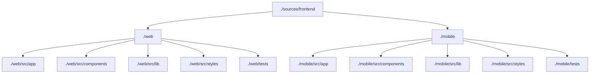

#### 4.1.3. CẤU TRÚC THƯ MỤC INFRASTRUCTURE

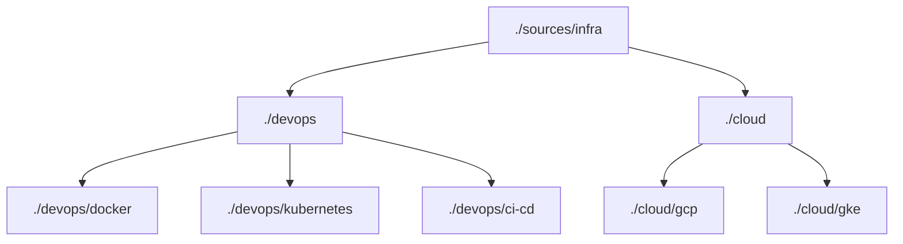

#### 4.1.4. CẤU TRÚC THƯ MỤC DOCUMENTATION

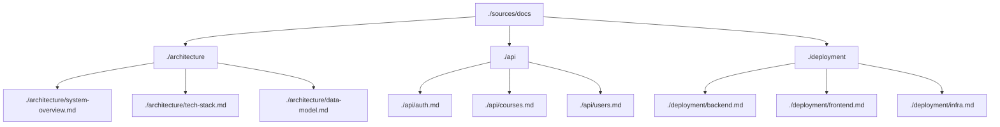

### 4.2. MULTI-PHASE SYNOPSIS MATRIX

<!--START_PHASE_SYNOPSIS_GRID-->

| Giai đoạn | Khoảng ngày | Cấu phần Kiến trúc / Đường dẫn Module | Tóm tắt Sản phẩm Bàn giao | Sub-Agent | Tag IDs Mục tiêu |
| :--- | :--- | :--- | :--- | :--- | :--- |
| Giai đoạn 1 | Ngày 1 - 2 | ./sources/backend/auth, ./sources/backend/users, ./sources/backend/shared | Xây dựng dịch vụ xác thực, quản lý người dùng, và lớp chia sẻ | Coder, Tester, Reviewer, Doc | [REQ-001], [REQ-002], [REQ-003], [DAT-001], [ARC-006] |
| Giai đoạn 2 | Ngày 1 - 3 | ./sources/backend/centers, ./sources/backend/courses, ./sources/frontend/web | Xây dựng dịch vụ quản lý trung tâm, khóa học và giao diện web | Coder, Tester, Reviewer, Doc | [REQ-004], [REQ-005], [REQ-006], [REQ-007], [REQ-008], [REQ-009], [DAT-003], [DAT-004] |
| Giai đoạn 3 | Ngày 1 - 2 | ./sources/backend/attendance, ./sources/frontend/mobile | Xây dựng dịch vụ điểm danh và ứng dụng di động | Coder, Tester, Reviewer, Doc | [REQ-012], [REQ-013], [DAT-006], [ARC-007] |
| Giai đoạn 4 | Ngày 1 - 3 | ./sources/backend/notifications, ./sources/backend/reports | Xây dựng dịch vụ thông báo và báo cáo | Coder, Tester, Reviewer, Doc | [REQ-016], [REQ-024], [REQ-025], [DAT-008], [ARC-008] |
| Giai đoạn 5 | Ngày 1 - 2 | ./sources/infra/devops, ./sources/infra/cloud | Triển khai hạ tầng và cấu hình cloud | Docker, GCP, GKE | [NFR-002], [NFR-004], [NFR-005], [NFR-009], [ARC-010] |
| **KIỂM TRA** | **Xác minh Phân phối Lifecycle Backlog** | **TỔNG CỘNG: 5 Giai đoạn** | **TRẠNG THÁI KHẢ DỤNG:** Đã xác minh: 100% các nhiệm vụ backlog chính đã được phân phối một cách chính xác qua đúng 5 giai đoạn được tính toán | **TRẠNG THÁI:** Đã xác minh | **ĐẦU TƯ:** Đã tuân thủ Ma trận |

<!--END_PHASE_SYNOPSIS_GRID-->

## 5. KIẾN TRÚC LƯỚI SỰ KIỆN & LUỒNG DỮ LIỆU

### 5.1. LƯỚI SỰ KIỆN TOÀN CẦU

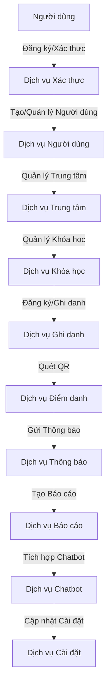

### 5.2. LƯỚI SỰ KIỆN ỨNG DỤNG DI ĐỘNG

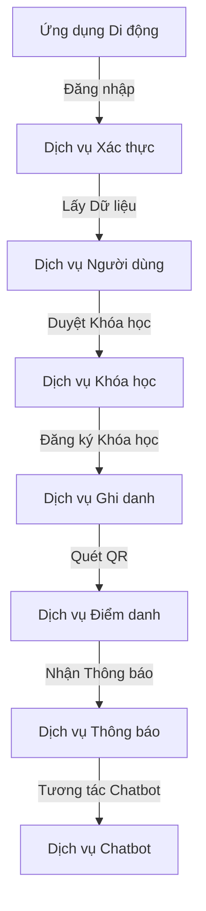

## 6. KIẾN TRÚC BẢO MẬT & TUÂN THỦ

### 6.1. KIẾN TRÚC BẢO MẬT

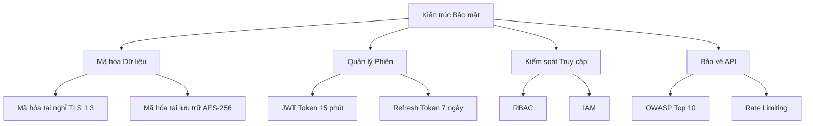

### 6.2. TUÂN THỦ PHI CHỨC NĂNG

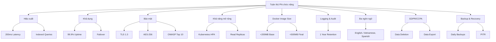

## 7. KIẾN TRÚC PHÂN TÁN & KHAI THÁC

### 7.1. KIẾN TRÚC PHÂN TÁN

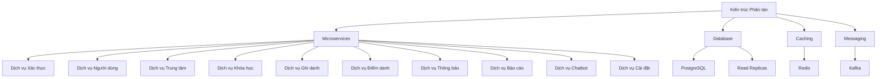

### 7.2. KHAI THÁC

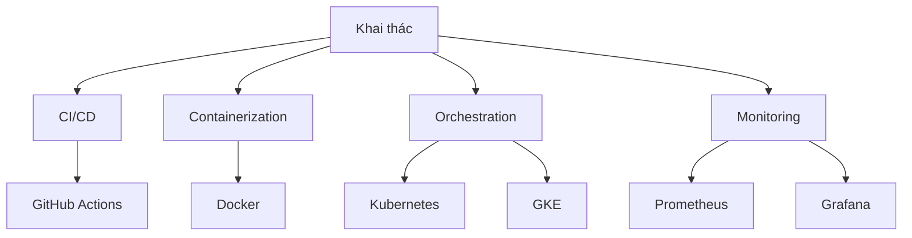

## 8. KIẾN TRÚC BẢN ĐỊA HÓA & SEO

### 8.1. BẢN ĐỊA HÓA

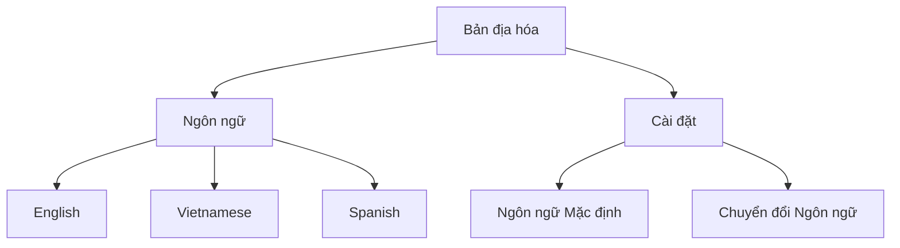

### 8.2. SEO

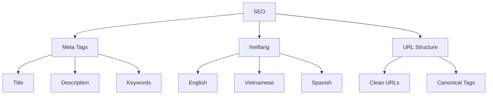