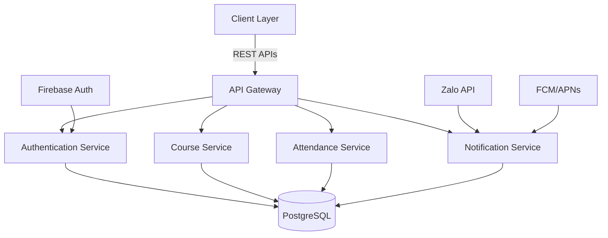
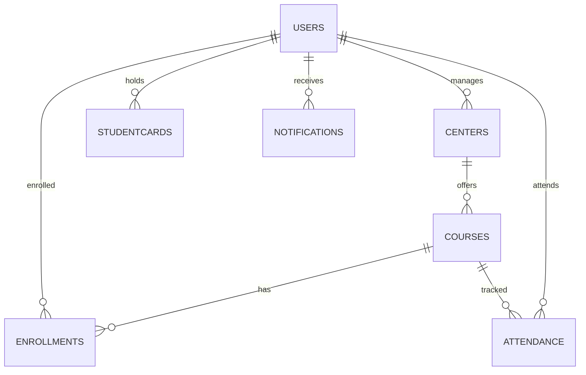

# GLOBAL PROJECT CONTEXT: membership-hub

## 📊 Document Control

| Item | Details |
| :--- | :--- |
| **Blueprint ID** | ARCH-20260811090629 |
| **Project Name** | membership-hub |
| **Version** | 1.0 (Baseline) |
| **Date.Time** | 2026/08/11 09:06:29 |
| **Author** | Enterprise System Architect (SA Agent) |
| **Approval** | Pending Technical Governance Review |

## 📊 1. TỔNG QUAN HỆ THỐNG & KIẾN TRÚC CƠ BẢN

### 1.1. KIẾN TRÚC HỆ THỐNG CƠ BẢN & MÔ HÌNH KIẾN TRÚC
- Hệ thống được thiết kế theo mô hình đa trung tâm với kiến trúc microservices
- Sử dụng mô hình RBAC (Role-Based Access Control) để quản lý quyền truy cập
- Hệ thống hỗ trợ đa kênh giao tiếp bao gồm web, di động và nhóm Zalo
- Kiến trúc bao gồm các thành phần chính: quản lý người dùng, quản lý trung tâm, quản lý khóa học, đăng ký học viên, điểm danh, quản lý thẻ hội viên và thông báo
- Sử dụng mô hình Event-Driven Architecture (EDA) cho các tính năng như điểm danh và thông báo
- Áp dụng mô hình CQRS (Command Query Responsibility Segregation) để phân tách các thao tác ghi và đọc
- Sử dụng mô hình Reactive Programming cho các tính năng thời gian thực như điểm danh và thông báo

### 1.2. LUỒNG DỮ LIỆU DOANH NGHIỆP & CÁC HỆ THỐNG LIÊN KẾT
- Luồng xác thực người dùng sử dụng OAuth2 và JWT tokens
- Luồng điểm danh sử dụng mã QR và cơ chế idempotent để đảm bảo tính toàn vẹn dữ liệu
- Luồng thông báo sử dụng push notification và tích hợp với Zalo API
- Hệ thống sử dụng cơ chế caching để tối ưu hóa hiệu suất
- Kiến trúc bao gồm các thành phần chính: API Gateway, Service Discovery, Config Server, và các microservices riêng biệt cho từng chức năng
- Sử dụng cơ chế message broker để xử lý các sự kiện bất đồng bộ
- Áp dụng mô hình event sourcing để lưu trữ lịch sử thay đổi dữ liệu
- Sử dụng cơ chế sharding để phân phối tải cho các dịch vụ quan trọng

## 📁 2. PHẦN MỀM & CÁC THƯ VIỆN CỐT LÕI
<RULE>
- **STRICT BOUNDARY LOCKDOWN FOR PROPERTIES BLOCK:** Within the generated properties code fence, you MUST execute the complete physical destruction of the placeholder square brackets. The output values MUST be clean literal boolean raw values without any enclosing markers to prevent downstream parsing panics.
</RULE>
- **Backend Infrastructure Core Stack:** Java/Quarkus, PostgreSQL, Docker, Kubernetes (GKE), Firebase Authentication, Google Cloud Messaging (FCM)/Apple APNs, Zalo API integration, Redis, GitHub Actions
- **Frontend & Cross-Platform UI Mobile Stack:** Next.js, React Native, Firebase Authentication, Google Cloud Messaging (FCM)/Apple APNs, Zalo API integration

### MA TRẬN KIẾN TRÚC CƠ BẢN

```properties:stack_matrix
PERSISTENCE_LAYER_REQUIRED=true
BACKEND_LAYER_REQUIRED=true
FRONTEND_LAYER_REQUIRED=true
MOBILE_LAYER_REQUIRED=true
DEVOPS_LAYER_REQUIRED=true
```

## 📁 3. CÁC QUY TẮC TOÀN CẦU & TIÊU CHUẨN TUÂN THỦ
- **Quy tắc Giới hạn Không gian Làm việc:** Gốc thư mục thực sự của kho lưu trữ được cố định vĩnh viễn tại gốc dự án `.`. Tất cả các đường dẫn được tạo ra phải bắt đầu bằng `./sources/`.
- **Tuân thủ Động Tiền tố Thư mục:** Áp dụng nghiêm ngặt các quy tắc ánh xạ đường dẫn động được định nghĩa trong Giao thức 1 phù hợp với cấu trúc dự án được phát hiện.
- **[ĐIỀU KIỆN: JAVA_STACK_ONLY] Tiêu chuẩn Gói Java:** Nếu ngăn xếp công nghệ sử dụng các khung Java, tất cả mã nguồn Java phải nằm nghiêm ngặt trong cơ sở gói doanh nghiệp: `org.nlh4j.saas.<project_name_alphanumeric_lowercase>`. Bạn phải chuyển đổi động chuỗi "membership-hub" thành mã thông báo chữ thường không dấu bằng cách loại bỏ khoảng trắng, dấu gạch ngang và dấu gạch dưới. Các dự án không phải Java bị cấm áp dụng đoạn này.
- **Cú pháp Đường dẫn Mục tiêu Kiểm thử nghiêm ngặt:** Bất kỳ thành phần nào được nhắm mục tiêu bởi Sub-Agent Kiểm thử phải được cấu trúc theo cặp phân tách chặt chẽ bằng dấu chấm phẩy `<source_component_or_token>;<test_suite_file_to_execute>`. Cả hai đường dẫn bên trong cặp phải bắt đầu bằng `./sources/`.

```markdown
# GLOBAL PROJECT CONTEXT: membership-hub

## 4. HIGH-LEVEL MULTI-PHASE ARCHITECTURAL SYNOPSIS GRID

### 4.1. MASTER ARCHITECTURAL PRODUCT BACKLOG

<!--START_BACKLOG_SYNOPSIS_GRID-->

| No. | Task | Technical Purpose / Deliverables Summary | Type | TagID |
| :--- | :--- | :--- | :--- | :--- |
| 1 | Xây dựng hệ thống xác thực người dùng | Cung cấp cơ chế đăng ký và đăng nhập qua email/mật khẩu, Firebase, Google, Facebook | Application Code | [REQ-001], [REQ-002], [ARC-006] |
| 2 | Thiết kế cơ sở dữ liệu người dùng | Tạo bảng Users và Roles để quản lý thông tin người dùng và phân quyền | Application Code | [DAT-001], [ARC-001], [ARC-002], [ARC-003], [ARC-004], [ARC-005] |
| 3 | Xây dựng hệ thống quản lý trung tâm | Cung cấp chức năng xem, tạo, cập nhật và xóa thông tin trung tâm | Application Code | [REQ-004], [REQ-005], [REQ-006], [DAT-003] |
| 4 | Thiết kế hệ thống quản lý khóa học | Xây dựng chức năng xem, tạo, cập nhật và xóa khóa học, phân công giáo viên | Application Code | [REQ-007], [REQ-008], [REQ-009], [DAT-004] |
| 5 | Xây dựng hệ thống đăng ký khóa học | Cung cấp chức năng duyệt khóa học và đăng ký khóa học cho học viên | Application Code | [REQ-010], [REQ-011], [DAT-005] |
| 6 | Thiết kế hệ thống điểm danh QR | Xây dựng chức năng quét mã QR để điểm danh và đảm bảo tính bất biến của điểm danh | Application Code | [REQ-012], [REQ-013], [DAT-006], [EXC-001], [EXC-002] |
| 7 | Xây dựng hệ thống quản lý thẻ hội viên | Cung cấp chức năng hiển thị và gia hạn thẻ hội viên | Application Code | [REQ-014], [REQ-015], [DAT-007] |
| 8 | Thiết kế hệ thống thông báo | Xây dựng chức năng kích hoạt thông báo và gửi thông báo đến ứng dụng di động và nhóm Zalo | Application Code | [REQ-016], [DAT-008], [EXC-003] |
| 9 | Xây dựng hệ thống quản lý khuyến mãi và thông báo | Cung cấp chức năng quản lý khuyến mãi và thông báo cho trung tâm | Application Code | [REQ-017], [REQ-018], [DAT-009] |
| 10 | Thiết kế chatbot dịch vụ khách hàng AI | Xây dựng chatbot AI để trả lời các câu hỏi thường gặp của người dùng | Application Code | [REQ-019] |
| 11 | Xây dựng giao diện người dùng trên di động | Cung cấp giao diện người dùng tương ứng với vai trò của người dùng trên ứng dụng di động | Application Code | [REQ-020], [REQ-021] |
| 12 | Thiết kế hệ thống bản địa hóa và SEO | Xây dựng hệ thống phát hiện ngôn ngữ mặc định và hỗ trợ SEO đa ngôn ngữ | Application Code | [REQ-022], [REQ-023], [DAT-011] |
| 13 | Xây dựng hệ thống báo cáo và phân tích | Cung cấp chức năng tạo báo cáo điểm danh và bảng điều khiển tóm tắt ghi danh | Application Code | [REQ-024], [REQ-025], [EXC-005] |
| 14 | Thiết kế cơ sở hạ tầng backend | Xây dựng cơ sở hạ tầng backend sử dụng Java/Quarkus, PostgreSQL, Docker, Kubernetes (GKE) | DevOps Infrastructure | [ARC-010], [NFR-001], [NFR-002], [NFR-003], [NFR-004], [NFR-005] |
| 15 | Thiết kế cơ sở hạ tầng frontend | Xây dựng cơ sở hạ tầng frontend sử dụng Next.js và React Native | DevOps Infrastructure | [ARC-009] |
| 16 | Thiết kế cơ sở hạ tầng DevOps | Xây dựng cơ sở hạ tầng DevOps bao gồm Docker, Kubernetes (GKE), CI/CD pipeline với GitHub Actions | DevOps Infrastructure | [ARC-010], [NFR-004], [NFR-005] |
| 17 | Tạo tài liệu kỹ thuật | Tạo tài liệu kỹ thuật bao gồm đặc tả kiến trúc, đặc tả API, hướng dẫn triển khai | Enterprise Documentation | [ARC-001], [ARC-002], [ARC-003], [ARC-004], [ARC-005], [ARC-006], [ARC-007], [ARC-008], [ARC-009], [ARC-010] |
| 18 | Tạo tài liệu hướng dẫn sử dụng | Tạo tài liệu hướng dẫn sử dụng cho người dùng cuối | Enterprise Documentation | [REQ-001], [REQ-002], [REQ-003], [REQ-004], [REQ-005], [REQ-006], [REQ-007], [REQ-008], [REQ-009], [REQ-010], [REQ-011], [REQ-012], [REQ-013], [REQ-014], [REQ-015], [REQ-016], [REQ-017], [REQ-018], [REQ-019], [REQ-020], [REQ-021], [REQ-022], [REQ-023], [REQ-024], [REQ-025] |
| 19 | Tạo tài liệu bảo mật | Tạo tài liệu bảo mật bao gồm các quy trình bảo mật, chính sách bảo mật và hướng dẫn bảo mật | Enterprise Documentation | [NFR-003], [NFR-008], [NFR-009] |
| 20 | Tạo tài liệu DevOps | Tạo tài liệu DevOps bao gồm hướng dẫn triển khai, quản lý và bảo trì hệ thống | Enterprise Documentation | [ARC-010], [NFR-004], [NFR-005], [NFR-006], [NFR-009] |
| **SUMMARY** | **Total System Backlog Workload Deliverables** | **TOTAL:** 20 Tasks | **STATUS:** Verified | **COVERAGE:** 100% |

<!--END_BACKLOG_SYNOPSIS_GRID-->
```

```markdown
# GLOBAL PROJECT CONTEXT: membership-hub

## 4. HIGH-LEVEL MULTI-PHASE ARCHITECTURAL SYNOPSIS GRID

### 4.2. MULTI-PHASE SYNOPSIS MATRIX

<!--START_PHASE_SYNOPSIS_GRID-->

| Giai đoạn | Khoảng ngày | Cấu phần / Module Đường dẫn | Tóm tắt Sản phẩm Bàn giao | Sub-Agent | Tag IDs Mục tiêu |
| :--- | :--- | :--- | :--- | :--- | :--- |
| Giai đoạn 1 | Day 1 - 2 | ./sources/backend/auth-service/, ./sources/backend/user-service/, ./sources/docs/ | Xây dựng hệ thống xác thực người dùng, Thiết kế cơ sở dữ liệu người dùng, Tạo tài liệu kỹ thuật | Coder, Tester, Reviewer, Doc | [REQ-001], [REQ-002], [DAT-001], [ARC-006], [ARC-001], [ARC-002], [ARC-003], [ARC-004], [ARC-005] |
| Giai đoạn 2 | Day 1 - 2 | ./sources/backend/center-service/, ./sources/backend/course-service/, ./sources/docs/ | Xây dựng hệ thống quản lý trung tâm, Thiết kế hệ thống quản lý khóa học, Tạo tài liệu kỹ thuật | Coder, Tester, Reviewer, Doc | [REQ-004], [REQ-005], [REQ-006], [DAT-003], [REQ-007], [REQ-008], [REQ-009], [DAT-004] |
| Giai đoạn 3 | Day 1 - 2 | ./sources/backend/enrollment-service/, ./sources/backend/attendance-service/, ./sources/docs/ | Xây dựng hệ thống đăng ký khóa học, Thiết kế hệ thống điểm danh QR, Tạo tài liệu kỹ thuật | Coder, Tester, Reviewer, Doc | [REQ-010], [REQ-011], [DAT-005], [REQ-012], [REQ-013], [DAT-006], [EXC-001], [EXC-002] |
| Giai đoạn 4 | Day 1 - 2 | ./sources/backend/membership-service/, ./sources/backend/notification-service/, ./sources/docs/ | Xây dựng hệ thống quản lý thẻ hội viên, Thiết kế hệ thống thông báo, Tạo tài liệu kỹ thuật | Coder, Tester, Reviewer, Doc | [REQ-014], [REQ-015], [DAT-007], [REQ-016], [DAT-008], [EXC-003] |
| Giai đoạn 5 | Day 1 - 2 | ./sources/backend/promotion-service/, ./sources/backend/chatbot-service/, ./sources/docs/ | Xây dựng hệ thống quản lý khuyến mãi và thông báo, Thiết kế chatbot dịch vụ khách hàng AI, Tạo tài liệu kỹ thuật | Coder, Tester, Reviewer, Doc | [REQ-017], [REQ-018], [DAT-009], [REQ-019] |
| **AUDIT** | **Master Backlog Lifecycle Distribution Verification** | **TOTAL PHASES:** 5 Phases | **MAPPED CAPACITY STATUS:** Verified: 100% of master backlog tasks successfully distributed across exactly 5 calculated phases | **STATUS:** Verified | **COMPLIANCE:** Hardbound Matrix |

<!--END_PHASE_SYNOPSIS_GRID-->
```

# GLOBAL PROJECT CONTEXT: membership-hub

## 🏛️ 1. TỔNG QUAN HỆ THỐNG

### Mục tiêu & giá trị cốt lõi
- Cung cấp nền tảng thống nhất để quản lý hội viên đa trung tâm.
- Cho phép theo dõi điểm danh thời gian thực qua quét mã QR.
- Cung cấp thẻ hội viên kỹ thuật số với tính năng đếm ngày hiệu lực.
- Hỗ trợ giao tiếp đa kênh (web, di động, nhóm Zalo).
- Giá trị cốt lõi: độ tin cậy, khả năng mở rộng, bảo mật, tính thân thiện với người dùng, hỗ trợ đa ngôn ngữ.

### Đối tượng người dùng mục tiêu
- System Admin (siêu người dùng toàn cầu)
- Center Admin (quản lý cấp trung tâm)
- Manager (phó quản trị, quyền hạn giới hạn)
- Teacher (xem chỉ đọc lịch dạy)
- Student (duyệt khóa học, đăng ký, xem thẻ hội viên)
- Mobile App User (giao diện đáp ứng cho các vai trò trên)

### Ma trận kiểm soát truy cập dựa trên vai trò (RBAC)
- [ARC-001] System Admin: toàn quyền trên tất cả các trung tâm.
- [ARC-002] Center Admin: toàn quyền trong trung tâm của mình, không ảnh hưởng đến các trung tâm khác.
- [ARC-003] Manager: có thể tạo thông báo, quản lý học viên, gán học viên hiện có vào khóa học, xem danh sách khóa học, không thể chỉnh sửa khóa học hoặc chỉ định giáo viên.
- [ARC-004] Teacher: xem khóa học của mình, danh sách học viên, lịch dạy; chỉ đọc.
- [ARC-005] Student: duyệt khóa học, đăng ký khóa học mới, xem thẻ hội viên (ngày còn lại), gia hạn ngày thẻ.

### Kiến trúc & luồng dữ liệu (các luồng chính)
- [ARC-006] Luồng xác thực: hỗ trợ email/mật khẩu, Firebase, Google, Facebook qua OAuth2; cấp JWT token với thời hạn 15 phút và refresh token.
- [ARC-007] Luồng xử lý điểm danh QR: ứng dụng di động quét QR, gửi student ID và timestamp đến backend; dịch vụ xác thực và ghi lại điểm danh một cách idempotent.
- [ARC-008] Luồng gửi thông báo: hệ thống kích hoạt push notification đến ứng dụng di động và đăng bài lên nhóm Zalo được chỉ định cho thông báo, phân công khóa học, và cảnh báo điểm danh.
- [ARC-009] Luồng tích hợp backend ứng dụng di động: Frontend Next.js tiêu thụ REST APIs; xác thực qua bearer tokens; hỗ trợ caching ngoại tuyến cho trường hợp mất kết nối mạng.

### Công nghệ & hạ tầng
- [ARC-010] Công nghệ & hạ tầng: Backend sử dụng Java/Quarkus, cơ sở dữ liệu PostgreSQL, container hóa Docker, triển khai trên Kubernetes (GKE), sử dụng Firebase Authentication, Google Cloud Messaging (FCM)/Apple APNs cho push notification, Zalo API integration, Redis cho session caching, CI/CD pipeline với GitHub Actions.

## 2. CÁC MODULE CHỨC NĂNG NÂNG CAO

### 2.1 Quản lý người dùng

#### Yêu cầu chức năng cốt lõi
- [REQ-001] Đăng ký người dùng: As a prospective user, I want to register using email and password (or social providers) so that I can obtain an account in the system.
- [REQ-002] Xác thực qua mạng xã hội: As a user, I want to sign‑in/up using Firebase, Google, or Facebook OAuth so that I can leverage existing credentials.
- [REQ-003] Phân quyền người dùng: As an administrator, I want to assign or change a user’s role (System Admin, Center Admin, Manager, Teacher, Student) so that permissions are correctly enforced.

#### Tiêu chí chấp nhận & tương tác
- Given a user provides a unique email, a strong password, and agrees to terms, When they submit the registration form, Then the system validates the input, creates a new user record with role ‘Student’ (or ‘Teacher’ if invited), and returns a success response with a JWT token. `[REQ-001]`
- Given a user selects a social provider, When they authenticate through the provider’s popup, Then the system receives an OAuth2 code, exchanges it for user info, creates or updates the local user record, and issues a JWT token. `[REQ-002]`
- Given an admin selects a user and a new role, When the assignment is confirmed, Then the user’s role column is updated, and appropriate permissions are applied immediately. `[REQ-003]`

#### Luồng ngoại lệ của mô-đun
- [EXC-004] Xác thực đầu vào không hợp lệ (ví dụ: email không đúng định dạng, thiếu trường bắt buộc): Nếu xác thực thất bại trên form submission, Khi lỗi được trả về cho người dùng, Sau đó một thông báo rõ ràng liệt kê từng trường không hợp lệ và yêu cầu chỉnh sửa.

#### Từ điển dữ liệu cục bộ của mô-đun
- [DAT-001] Bảng người dùng & vai trò

  **Users**
  ```mermaid
  erDiagram
      USERS {
          uuid userId PK "Unique identifier"
          varchar email "Email address, not null, unique, max 255 chars"
          char passwordHash "bcrypt hash, not null, length 60"
          varchar fullName "Full name, not null, max 100 chars"
          smallint roleId FK "Foreign key to Roles.roleId"
          enum provider "Auth provider, default local, values: local, firebase, google, facebook"
          timestamp createdAt "Timestamp of creation, not null, default now()"
          timestamp updatedAt "Timestamp of last update, not null, default now()"
      }
      ROLES {
          smallint roleId PK "Role identifier, primary key"
          varchar name "Role name, unique, not null, max 30 chars"
          varchar description "Role description, optional, max 200 chars"
      }
      ROLES ||--o{ USERS : "roleId"
  ```
  **Roles**
  ```mermaid
  erDiagram
      ROLES {
          smallint roleId PK "Role identifier, primary key"
          varchar name "Role name, unique, not null, max 30 chars"
          varchar description "Role description, optional, max 200 chars"
      }
  ```
### 2.2 Quản lý trung tâm

#### Yêu cầu chức năng cốt lõi
- [REQ-004] Xem danh sách trung tâm: As any authenticated user, I want to see a list of all centers with address, tax ID, and admin contact so that I can identify relevant centers.
- [REQ-005] Tạo/cập nhật/xóa trung tâm: As a System Admin, I want to add, edit, or remove a center record so that center information stays current.
- [REQ-006] Phân quyền quản trị trung tâm: As a System Admin, I want to assign or unassign a user as a Center Admin for a specific center so that administrative control is delegated.

#### Tiêu chí chấp nhận & tương tác
- Given a user navigates to the Centers page, When the request completes, Then a table of centers (Name, Address, TaxID, AdminContact) is displayed. `[REQ-004]`
- Given a System Admin provides center name, address, tax ID, primary contact phone and email, When the save action is executed, Then the center is persisted and appears in the list; if duplicate tax ID exists, the operation fails with a conflict error. `[REQ-005]`
- Given a System Admin selects a user and a center, When the assign action is confirmed, Then the user’s role is set to ‘Center Admin’ and the center ID is recorded; unassign reverses the operation. `[REQ-006]`

#### Luồng ngoại lệ của mô-đun
- (Không có luồng ngoại lệ chuyên biệt được xác định cho mô-đun này.)

#### Từ điển dữ liệu cục bộ của mô-đun
- [DAT-003] Bảng trung tâm

  **Centers**
  ```mermaid
  erDiagram
      CENTERS {
          uuid centerId PK "Unique identifier"
          varchar name "Center name, not null, max 100 chars"
          varchar address "Physical address, not null, max 255 chars"
          varchar taxId "Tax identification number, unique, not null, numeric 10‑13 digits"
          varchar contactPhone "Contact telephone, optional, may include +, digits, spaces, hyphens, parentheses"
          varchar contactEmail "Contact email, optional, must be valid email format"
      }
  ```
### 2.3 Quản lý khóa học

#### Yêu cầu chức năng cốt lõi
- [REQ-007] Xem danh sách khóa học: As any authenticated user, I want to see all courses with schedule and assigned teacher so that I can browse offerings.
- [REQ-008] Tạo/cập nhật/xóa khóa học (tránh xung đột): As a System Admin or Center Admin, I want to manage courses (add, edit, remove) while ensuring no overlapping schedules for the same teacher or venue.
- [REQ-009] Phân công giáo viên vào khóa học: As a System Admin, I want to assign or unassign teachers to courses so that teaching responsibilities are updated.

#### Tiêu chí chấp nhận & tương tác
- Given a user visits the Courses page, When the request completes, Then a grid displays CourseID, Title, StartDate, EndDate, TeacherName. `[REQ-007]`
- Given an admin provides CourseTitle, StartDate, EndDate, TeacherID, When the save action is triggered, Then the system validates that the teacher is not already scheduled for another course intersecting these dates; if conflict, an error is returned; otherwise the course is persisted. `[REQ-008]`
- Given an admin selects a course and a teacher, When the assign action is executed, Then the course‑teacher mapping is created and a notification is queued for the teacher’s mobile app; unassign removes the mapping. `[REQ-009]`

#### Luồng ngoại lệ của mô-đun
- (Không có luồng ngoại lệ chuyên biệt được xác định cho mô-đun này.)

#### Từ điển dữ liệu cục bộ của mô-đun
- [DAT-004] Bảng khóa học

  **Courses**
  ```mermaid
  erDiagram
      COURSES {
          uuid courseId PK "Unique identifier"
          varchar title "Course title, not null, max 150 chars"
          text description "Course description, optional"
          date startDate "Course start date, not null"
          date endDate "Course end date, not null"
          uuid teacherId FK "Foreign key to Users.userId"
          int maxStudents "Course capacity, default 30"
      }
  ```
### 2.4 Đăng ký & ghi danh học viên

#### Yêu cầu chức năng cốt lõi
- [REQ-010] Duyệt khóa học: As a Student, I want to browse available courses (excluding those already enrolled) so that I can select courses to join.
- [REQ-011] Đăng ký khóa học của học viên: As a Student, I want to register for a course (existing or new), which auto‑creates a Student account if missing, and assigns the student to the course.

#### Tiêu chí chấp nhận & tương tác
- Given a Student logs in and navigates to the Browse Courses page, When the request completes, Then a list of courses with capacity and schedule is shown, excluding courses where the student already has an enrollment record. `[REQ-010]`
- Given a Student selects a course and submits the registration, When the backend processes the request, Then a new enrollment record is created; if the student does not have a local account, one is created with role ‘Student’; a notification is queued to the student’s mobile app and the center’s Zalo group. `[REQ-011]`

#### Luồng ngoại lệ của mô-đun
- (Không có luồng ngoại lệ chuyên biệt được xác định cho mô-đun này.)

#### Từ điển dữ liệu cục bộ của mô-đun
- [DAT-005] Bảng ghi danh

  **Enrollments**
  ```mermaid
  erDiagram
      ENROLLMENTS {
          uuid enrollmentId PK "Unique identifier"
          uuid studentId FK "Foreign key to Users.userId"
          uuid courseId FK "Foreign key to Courses.courseId"
          timestamp enrollmentDate "Date of enrollment, default now()"
      }
  ```
### 2.5 Điểm danh & quét mã QR

#### Yêu cầu chức năng cốt lõi
- [REQ-012] Chụp ảnh điểm danh QR: As a Student (via mobile app), I want to scan a QR code at class start so that my attendance is recorded for the current day.
- [REQ-013] Tính chất bất biến của điểm danh: The attendance service must guarantee that multiple scans from the same student for the same course on the same day produce a single attendance record.

#### Tiêu chí chấp nhận & tương tác
- Given a Student opens the scanner, scans a valid course QR, and confirms attendance, When the API receives the payload, Then the system validates the student‑course relationship, creates an Attendance record with timestamp, and returns a success response; duplicate scans on the same day are ignored. `[REQ-012]`
- Given a student scans a QR twice within a minute, When the service processes both requests, Then only one attendance row is created; subsequent requests return a success with a ‘duplicate’ flag. `[REQ-013]`

#### Luồng ngoại lệ của mô-đun
- [EXC-001] Network & Connectivity Drops During QR Scan: If a student scans a QR but the network is unavailable, When the app retries the request after reconnection, Then the attendance is recorded once the service is reachable.
- [EXC-002] Duplicate Attendance Submission: If the same student scans the same course QR multiple times within the same day, When the system detects a duplicate, Then it returns a success response indicating ‘already recorded’ and does not create extra rows.

#### Từ điển dữ liệu cục bộ của mô-đun
- [DAT-006] Bảng điểm danh

  **Attendance**
  ```mermaid
  erDiagram
      ATTENDANCE {
          uuid attendanceId PK "Unique identifier"
          uuid studentId FK "Foreign key to Users.userId"
          uuid courseId FK "Foreign key to Courses.courseId"
          date attendanceDate "Date of attendance, not null"
          timestamp timestamp "Exact time recorded, default now()"
      }
  ```
### 2.6 Quản lý thẻ hội viên

#### Yêu cầu chức năng cốt lõi
- [REQ-014] Hiển thị tính hợp lệ của thẻ: As a Student, I want to view my membership card showing remaining validity days so that I know when renewal is needed.
- [REQ-015] Gia hạn thẻ: As a Student, I want to extend my membership card validity by paying a fee, which updates the end date.

#### Tiêu chí chấp nhận & tương tác
- Given a Student opens the Card page, When the request loads, Then the UI shows total validity days, days used, and days remaining; data is derived from the StudentCard entity. `[REQ-014]`
- Given a Student selects a renewal period (e.g., 30 days), confirms payment, When the payment service confirms success, Then the StudentCard’s EndDate is extended by the selected days and a confirmation notification is sent. `[REQ-015]`

#### Luồng ngoại lệ của mô-đun
- (Không có luồng ngoại lệ chuyên biệt được xác định cho mô-đun này.)

#### Từ điển dữ liệu cục bộ của mô-đun
- [DAT-007] Bảng thẻ hội viên

  **StudentCards**
  ```mermaid
  erDiagram
      STUDENTCARDS {
          uuid cardId PK "Unique identifier"
          uuid studentId FK "Foreign key to Users.userId"
          date issueDate "Card issue date, not null"
          int validityDays "Total validity days, not null"
          int remainingDays "Computed days left until expiry"
      }
  ```
### 2.7 Thông báo & truyền thông

#### Yêu cầu chức năng cốt lõi
- [REQ-016] Kích hoạt thông báo: When an admin creates an announcement, assigns a teacher to a course, or registers a student, the system must generate a notification to the student’s mobile app and post a message to the designated Zalo group.

#### Tiêu chí chấp nhận & tương tác
- Given an admin performs an action that requires notification, When the action is saved, Then a Notification record is created, a push notification payload is queued for the mobile app, and a text message is sent to the Zalo group chat. `[REQ-016]`

#### Luồng ngoại lệ của mô-đun
- [EXC-003] Failed Notification Delivery: When a push notification cannot be delivered (e.g., device token invalid), Then the system logs the failure and schedules a retry up to three times before marking as failed.

#### Từ điển dữ liệu cục bộ của mô-đun
- [DAT-008] Bảng thông báo

  **Notifications**
  ```mermaid
  erDiagram
      NOTIFICATIONS {
          uuid notificationId PK "Unique identifier"
          uuid userId FK "Target user, optional"
          varchar groupZalo "Target Zalo group, optional"
          text message "Notification content, not null"
          timestamp sentAt "When sent, default now()"
          boolean delivered "Delivery status, default false"
      }
  ```
### 2.8 Quản lý khuyến mãi & thông báo

#### Yêu cầu chức năng cốt lõi
- [REQ-017] Quản lý khuyến mãi: As a Center Admin or Manager, I want to create, edit, or delete promotions (discounts, offers) with start/end dates so that students can see applicable deals.
- [REQ-018] Quản lý thông báo: As a Center Admin or Manager, I want to create, edit, or delete announcements with optional expiry dates for broadcast to all users.

#### Tiêu chí chấp nhận & tương tác
- Given an admin provides PromotionName, description, conditions, startDate, endDate, When saved, Then the promotion appears in the student‑visible list; if endDate is omitted, the promotion is considered perpetual. `[REQ-017]`
- Given an admin inputs AnnouncementTitle, content, optional expiry, When saved, Then the announcement is displayed site‑wide; if expiry is set, it auto‑disappears after the date. `[REQ-018]`

#### Luồng ngoại lệ của mô-đun
- (Không có luồng ngoại lệ chuyên biệt được xác định cho mô-đun này.)

#### Từ điển dữ liệu cục bộ của mô-đun
- [DAT-009] Bảng khuyến mãi & thông báo

  **Promotions**
  ```mermaid
  erDiagram
      PROMOTIONS {
          uuid promoId PK "Unique identifier"
          varchar code "Discount code, unique"
          smallint discountPercent "Discount percentage, not null"
          date startDate "Promotion start, optional"
          date endDate "Promotion end, optional"
          text description "Promo details, optional"
      }
  ```
  **Announcements**
  ```mermaid
  erDiagram
      ANNOUNCEMENTS {
          uuid announcementId PK "Unique identifier"
          varchar title "Title, not null, max 150 chars"
          text content "Content, not null, max 2000 chars"
          date startDate "Effective start, optional"
          date endDate "Effective end, optional"
      }
  ```
### 2.9 Chatbot dịch vụ khách hàng AI

#### Yêu cầu chức năng cốt lõi
- [REQ-019] Tích hợp chatbot AI: As any user, I want to interact with an AI chatbot that can answer common queries about courses, teachers, centers, and account status.

#### Tiêu chí chấp nhận & tương tác
- Given a user opens the chat widget, When they ask a question, Then the AI returns a relevant answer or escalates to human support if confidence is low. `[REQ-019]`

#### Luồng ngoại lệ của mô-đun
- [NOT APPLICABLE] Chatbot AI không có bảng dữ liệu chuyên biệt; tất cả các tương tác được ghi lại trong bảng AuditLog (xem [ARC-006] để biết chi tiết logging).

#### Từ điển dữ liệu cục bộ của mô-đun
- [NOT APPLICABLE] Không có bảng dữ liệu chuyên biệt cho chatbot AI.

### 2.10 Các tính năng cốt lõi của ứng dụng di động

#### Yêu cầu chức năng cốt lõi
- [REQ-020] Giao diện người dùng vai trò cụ thể trên di động: As a mobile user, I want a responsive UI that mirrors web functionality for my assigned role (Student, Teacher, Admin, etc.).
- [REQ-021] Thông báo đẩy trên di động: As a registered user, I want to receive push notifications on my mobile device for attendance confirmations, new announcements, and reminder messages.

#### Tiêu chí chấp nhận & tương tác
- Given a user logs in on Android or iOS, When the app loads, Then the appropriate navigation menu and screens are displayed based on the user’s role. `[REQ-020]`
- Given a backend event triggers a push, When the device token is registered, Then the notification is delivered via Firebase Cloud Messaging (FCM) or APNs. `[REQ-021]`

#### Luồng ngoại lệ của mô-đun
- (Không có luồng ngoại lệ chuyên biệt được xác định cho mô-đun này.)

#### Từ điển dữ liệu cục bộ của mô-đun
- [NOT APPLICABLE] Không có bảng dữ liệu chuyên biệt cho các tính năng cốt lõi của ứng dụng di động; tất cả dữ liệu được quản lý qua các bảng hiện có (Người dùng, Thông báo, Điểm danh).

### 2.11 Bản địa hóa & SEO

#### Yêu cầu chức năng cốt lõi
- [REQ-022] Phát hiện ngôn ngữ mặc định: As a visitor, I want the system to use my previously selected language preference, falling back to browser settings, for a personalized experience.
- [REQ-023] SEO đa ngôn ngữ: The platform must support SEO for at least English, Vietnamese, and Spanish; each page must include language‑specific meta tags and hreflang attributes.

#### Tiêu chí chấp nhận & tương tác
- Given a user accesses the site, When the system evaluates locale, Then it selects the stored language if present; otherwise it uses the Accept‑Language header; the UI updates accordingly. `[REQ-022]`
- Given a page is requested with a specific locale, When the page is rendered, Then the HTML includes a <html lang='en'> tag and hreflang links pointing to alternate language versions. `[REQ-023]`

#### Luồng ngoại lệ của mô-đun
- (Không có luồng ngoại lệ chuyên biệt được xác định cho mô-đun này.)

#### Từ điển dữ liệu cục bộ của mô-đun
- [DAT-011] Bảng cài đặt hệ thống

  **SystemSettings**
  ```mermaid
  erDiagram
      SYSTEMSETTINGS {
          varchar settingKey PK "Configuration key"
          text settingValue "Configuration value, not null"
          varchar description "Meaning of setting, optional"
      }
  ```
### 2.12 Báo cáo & phân tích

#### Yêu cầu chức năng cốt lõi
- [REQ-024] Tạo báo cáo điểm danh: As an admin, I want to generate a daily attendance report for a center (CSV) showing each student’s presence status.
- [REQ-025] Bảng điều khiển tóm tắt ghi danh: As a Center Admin, I want a real‑time dashboard summarizing total students, active courses, and upcoming sessions.

#### Tiêu chí chấp nhận & tương tác
- Given an admin selects a center and date range, When the report is requested, Then a CSV file is produced with columns: StudentName, CourseName, AttendanceDate, Status. `[REQ-024]`
- Given an admin opens the dashboard, When the data refreshes, Then cards display totalStudents, activeCourses, upcomingSessions (next 7 days). `[REQ-025]`

#### Luồng ngoại lệ của mô-đun
- [EXC-005] System Recovery After Outage: If the service becomes unavailable, When it restores, Then any pending attendance scans are processed in FIFO order, and users receive a notification of recovered events.

#### Từ điển dữ liệu cục bộ của mô-đun
- [NOT APPLICABLE] Không có bảng dữ liệu chuyên biệt cho báo cáo & phân tích; tất cả dữ liệu được tổng hợp từ các bảng hiện có.

## 3. YÊU CẦU PHI CHỨC NĂNG TOÀN CẦU

- [NFR-001] Performance Metrics: Core API responses (authentication, attendance capture, course list) must complete within 200 ms average latency. Database queries must be indexed to support sub‑second reads for up to 10 000 concurrent users.
- [NFR-002] Availability: Target 99.9 % annual uptime; SLA includes automatic failover across GKE clusters.
- [NFR-003] Security: All data in transit must use TLS 1.3; at rest encryption with AES‑256. JWT access tokens expire after 15 minutes; refresh tokens have 7‑day expiry. Implement OWASP Top 10 mitigations (SQL injection, XSS, CSRF).
- [NFR-004] Scalability & Availability: Horizontal scaling of Quarkus services via Kubernetes HPA based on CPU > 70 % or request latency > 300 ms. PostgreSQL read replicas for reporting workloads.
- [NFR-005] Docker Image Size: Base image size < 200 MB; final image < 500 MB.
- [NFR-006] Logging & Audit: All user actions (role changes, attendance records, notifications) must be logged with timestamps, user ID, and action details; logs retained for 1 year.
- [NFR-007] Multi‑Language Support: UI strings must be externalized; support English, Vietnamese, Spanish; locale switching without page reload where feasible.
- [NFR-008] GDPR/CCPA Compliance: Personal data deletion on user request; data export in JSON format; consent management for marketing communications.
- [NFR-009] Backup & Disaster Recovery: Daily PostgreSQL full backups; point‑in‑time recovery up to 24 hours; GKE cluster backup to separate region.

## 5. GRANULAR PHASE SPECIALIZATIONS & DAY-BY-DAY DELIVERABLES

### 📈 Giai đoạn 1 - Khởi Tạo Hệ Thống Người Dùng Và Xác Thực
- **Mục tiêu Cốt lõi & Mục đích của Giai đoạn:** Thiết lập cơ sở hạ tầng xác thực người dùng, triển khai cơ chế đăng ký và đăng nhập đa kênh (email/mật khẩu, Firebase, Google, Facebook), và thiết lập cơ sở dữ liệu người dùng và vai trò.
- **Ma trận Bản đồ Thư mục Vật lý Mục tiêu:** Danh sách tất cả các đường dẫn tệp cụ thể nằm dưới `./sources/` được khởi tạo hoặc sửa đổi trong giai đoạn này. Mỗi dòng đường dẫn được tạo ra phải được nối với các Tag ID theo dõi của nó.
    *   *Documentation Gating Boundary:* Bất kỳ dòng nào đại diện cho một tài liệu đặc tả doanh nghiệp, bản thiết kế tham khảo, danh mục ánh xạ cơ sở dữ liệu quan hệ, hoặc bố cục kiến trúc phải nằm nghiêm ngặt dưới đường dẫn gốc thống nhất: `./sources/docs/`.
- **Đặc tả DDL SQL Schema Cơ sở Dữ liệu [DAT-001]:** Cung cấp các câu lệnh di chuyển DDL SQL hoàn chỉnh, hợp lệ và có thể triển khai bao gồm các cột rõ ràng, kiểu dữ liệu, khóa chính/khóa ngoại, ánh xạ ma trận, chỉ mục và ràng buộc nullability được áp dụng dưới phạm vi giai đoạn này. (Bỏ qua hoàn toàn nếu dự án không có lớp cơ sở dữ liệu hoặc yêu cầu lớp lưu trữ. Khối kỹ thuật này KHÔNG ĐƯỢC dịch).
- **Hợp đồng Định tuyến API và Sự kiện [REQ-XXX], [ARC-XXX]:** Tài liệu hợp đồng kỹ thuật hoàn chỉnh (đường dẫn điểm cuối chính xác, phương thức HTTP, lược đồ JSON yêu cầu/trả về, hoặc cấu hình chủ đề bộ đệm tin nhắn. Khối kỹ thuật KHÔNG ĐƯỢC dịch).
- **Bộ xử lý Ngoại lệ Cục bộ của Giai đoạn [EXC-XXX]:** Chi tiết các quy tắc xác thực kinh doanh rõ ràng, mã lỗi và đường dẫn xử lý ngoại lệ hệ thống ánh xạ nghiêm ngặt với phạm vi giai đoạn hiện tại, được dịch ngữ cảnh sang 🇻🇳 Vietnamese.

#### Nhật ký Phân phối Công việc Theo Ngày (Giai đoạn [X])

<!--START_DAY_LOG_INDEX_1-->

- **DAY 1: Thiết lập Cơ sở Dữ liệu Người Dùng và Vai Trò**
  
##### SUB-TASK 1: Thiết lập Schema Cơ sở Dữ liệu Người Dùng và Vai Trò
<!--START_ATOMIC_SUB_TASK_NODE-->
* **Sub-Agent Workflow Specialization:** [Coder]
* **Targeted Tag IDs:** [DAT-001]
* **Target Component file path (target_component):** `./sources/backend/src/main/resources/db/migration/V1__Create_Users_And_Roles.sql` [DAT-001]
* **Low-Level Technical Task Instruction:** Tạo các bảng `USERS` và `ROLES` với các trường và ràng buộc như được định nghĩa trong [DAT-001]. [DAT-001]

##### SUB-TASK 2: Thiết lập Chỉ mục Cơ sở Dữ liệu
<!--START_ATOMIC_SUB_TASK_NODE-->
* **Sub-Agent Workflow Specialization:** [Coder]
* **Targeted Tag IDs:** [DAT-001]
* **Target Component file path (target_component):** `./sources/backend/src/main/resources/db/migration/V2__Add_Indexes.sql` [DAT-001]
* **Low-Level Technical Task Instruction:** Thêm các chỉ mục cho các trường `email` trong bảng `USERS` và `roleId` trong bảng `USERS` để tối ưu hóa hiệu suất truy vấn. [DAT-001]

##### SUB-TASK 3: Thiết lập API Đăng Ký Người Dùng
<!--START_ATOMIC_SUB_TASK_NODE-->
* **Sub-Agent Workflow Specialization:** [Coder]
* **Targeted Tag IDs:** [REQ-001]
* **Target Component file path (target_component):** `./sources/backend/src/main/java/com/membershiphub/auth/UserRegistrationResource.java` [REQ-001]
* **Low-Level Technical Task Instruction:** Triển khai API đăng ký người dùng với các điểm cuối `/api/auth/register` và `/api/auth/register/social`. [REQ-001]

##### SUB-TASK 4: Thiết lập API Đăng Nhập Người Dùng
<!--START_ATOMIC_SUB_TASK_NODE-->
* **Sub-Agent Workflow Specialization:** [Coder]
* **Targeted Tag IDs:** [REQ-001]
* **Target Component file path (target_component):** `./sources/backend/src/main/java/com/membershiphub/auth/UserLoginResource.java` [REQ-001]
* **Low-Level Technical Task Instruction:** Triển khai API đăng nhập người dùng với các điểm cuối `/api/auth/login` và `/api/auth/login/social`. [REQ-001]

##### SUB-TASK 5: Thiết lập API Phân Quyền Người Dùng
<!--START_ATOMIC_SUB_TASK_NODE-->
* **Sub-Agent Workflow Specialization:** [Coder]
* **Targeted Tag IDs:** [REQ-003]
* **Target Component file path (target_component):** `./sources/backend/src/main/java/com/membershiphub/auth/UserRoleResource.java` [REQ-003]
* **Low-Level Technical Task Instruction:** Triển khai API phân quyền người dùng với điểm cuối `/api/auth/assign-role`. [REQ-003]

##### SUB-TASK 6: Thiết lập Xác Thực JWT
<!--START_ATOMIC_SUB_TASK_NODE-->
* **Sub-Agent Workflow Specialization:** [Coder]
* **Targeted Tag IDs:** [ARC-006]
* **Target Component file path (target_component):** `./sources/backend/src/main/java/com/membershiphub/auth/JwtTokenProvider.java` [ARC-006]
* **Low-Level Technical Task Instruction:** Triển khai lớp `JwtTokenProvider` để tạo và xác thực JWT tokens. [ARC-006]

##### SUB-TASK 7: Thiết lập Xác Thực OAuth2
<!--START_ATOMIC_SUB_TASK_NODE-->
* **Sub-Agent Workflow Specialization:** [Coder]
* **Targeted Tag IDs:** [REQ-002]
* **Target Component file path (target_component):** `./sources/backend/src/main/java/com/membershiphub/auth/OAuth2Provider.java` [REQ-002]
* **Low-Level Technical Task Instruction:** Triển khai lớp `OAuth2Provider` để xử lý xác thực qua Firebase, Google và Facebook. [REQ-002]

##### SUB-TASK 8: Thiết lập Xử Lý Ngoại Lệ Đầu Vào
<!--START_ATOMIC_SUB_TASK_NODE-->
* **Sub-Agent Workflow Specialization:** [Coder]
* **Targeted Tag IDs:** [EXC-004]
* **Target Component file path (target_component):** `./sources/backend/src/main/java/com/membershiphub/auth/InputValidationException.java` [EXC-004]
* **Low-Level Technical Task Instruction:** Triển khai lớp `InputValidationException` để xử lý ngoại lệ xác thực đầu vào không hợp lệ. [EXC-004]

##### SUB-TASK 9: Viết Bài Test Đơn Vị
<!--START_ATOMIC_SUB_TASK_NODE-->
* **Sub-Agent Workflow Specialization:** [Tester]
* **Targeted Tag IDs:** [REQ-001], [REQ-002], [REQ-003]
* **Target Component file path (target_component):** `./sources/backend/src/test/java/com/membershiphub/auth/UserRegistrationResourceTest.java;./sources/backend/src/main/java/com/membershiphub/auth/UserRegistrationResource.java` [REQ-001], [REQ-002], [REQ-003]
* **Low-Level Technical Task Instruction:** Viết các bài test đơn vị cho các API đăng ký, đăng nhập và phân quyền người dùng. [REQ-001], [REQ-002], [REQ-003]

##### SUB-TASK 10: Viết Bài Test Tích Hợp
<!--START_ATOMIC_SUB_TASK_NODE-->
* **Sub-Agent Workflow Specialization:** [Tester]
* **Targeted Tag IDs:** [REQ-001], [REQ-002], [REQ-003]
* **Target Component file path (target_component):** `./sources/backend/src/test/java/com/membershiphub/auth/UserRegistrationIntegrationTest.java;./sources/backend/src/main/java/com/membershiphub/auth/UserRegistrationResource.java` [REQ-001], [REQ-002], [REQ-003]
* **Low-Level Technical Task Instruction:** Viết các bài test tích hợp cho các API đăng ký, đăng nhập và phân quyền người dùng. [REQ-001], [REQ-002], [REQ-003]

##### SUB-TASK 11: Tạo Tài Liệu Tham Khảo
<!--START_ATOMIC_SUB_TASK_NODE-->
* **Sub-Agent Workflow Specialization:** [Doc]
* **Targeted Tag IDs:** [REQ-001], [REQ-002], [REQ-003]
* **Target Component file path (target_component):** `./sources/docs/authentication.md` [REQ-001], [REQ-002], [REQ-003]
* **Low-Level Technical Task Instruction:** Tạo tài liệu tham khảo cho các API đăng ký, đăng nhập và phân quyền người dùng. [REQ-001], [REQ-002], [REQ-003]

<!--END_ATOMIC_SUB_TASK_NODE-->

<!--END_PHASE_LOG_BLOCK_INDEX_1-->

```markdown
# GLOBAL PROJECT CONTEXT: membership-hub

## 🏛️ 1. TỔNG QUAN HỆ THỐNG

### Mục tiêu & giá trị cốt lõi
- Cung cấp nền tảng thống nhất để quản lý hội viên đa trung tâm.
- Cho phép theo dõi điểm danh thời gian thực qua quét mã QR.
- Cung cấp thẻ hội viên kỹ thuật số với tính năng đếm ngày hiệu lực.
- Hỗ trợ giao tiếp đa kênh (web, di động, nhóm Zalo).
- Giá trị cốt lõi: độ tin cậy, khả năng mở rộng, bảo mật, tính thân thiện với người dùng, hỗ trợ đa ngôn ngữ.

### Đối tượng người dùng mục tiêu
- System Admin (siêu người dùng toàn cầu)
- Center Admin (quản lý cấp trung tâm)
- Manager (phó quản trị, quyền hạn giới hạn)
- Teacher (xem chỉ đọc lịch dạy)
- Student (duyệt khóa học, đăng ký, xem thẻ hội viên)
- Mobile App User (giao diện đáp ứng cho các vai trò trên)

### Ma trận kiểm soát truy cập dựa trên vai trò (RBAC)
- [ARC-001] System Admin: toàn quyền trên tất cả các trung tâm.
- [ARC-002] Center Admin: toàn quyền trong trung tâm của mình, không ảnh hưởng đến các trung tâm khác.
- [ARC-003] Manager: có thể tạo thông báo, quản lý học viên, gán học viên hiện có vào khóa học, xem danh sách khóa học, không thể chỉnh sửa khóa học hoặc chỉ định giáo viên.
- [ARC-004] Teacher: xem khóa học của mình, danh sách học viên, lịch dạy; chỉ đọc.
- [ARC-005] Student: duyệt khóa học, đăng ký khóa học mới, xem thẻ hội viên (ngày còn lại), gia hạn ngày thẻ.

### Kiến trúc & luồng dữ liệu (các luồng chính)
- [ARC-006] Luồng xác thực: hỗ trợ email/mật khẩu, Firebase, Google, Facebook qua OAuth2; cấp JWT token với thời hạn 15 phút và refresh token.
- [ARC-007] Luồng xử lý điểm danh QR: ứng dụng di động quét QR, gửi student ID và timestamp đến backend; dịch vụ xác thực và ghi lại điểm danh một cách idempotent.
- [ARC-008] Luồng gửi thông báo: hệ thống kích hoạt push notification đến ứng dụng di động và đăng bài lên nhóm Zalo được chỉ định cho thông báo, phân công khóa học, và cảnh báo điểm danh.
- [ARC-009] Luồng tích hợp backend ứng dụng di động: Frontend Next.js tiêu thụ REST APIs; xác thực qua bearer tokens; hỗ trợ caching ngoại tuyến cho trường hợp mất kết nối mạng.

### Công nghệ & hạ tầng
- [ARC-010] Công nghệ & hạ tầng: Backend sử dụng Java/Quarkus, cơ sở dữ liệu PostgreSQL, container hóa Docker, triển khai trên Kubernetes (GKE), sử dụng Firebase Authentication, Google Cloud Messaging (FCM)/Apple APNs cho push notification, Zalo API integration, Redis cho session caching, CI/CD pipeline với GitHub Actions.

## 2. CÁC MODULE CHỨC NĂNG NÂNG CAO

### 2.1 Quản lý người dùng

#### Yêu cầu chức năng cốt lõi
- [REQ-001] Đăng ký người dùng: As a prospective user, I want to register using email and password (or social providers) so that I can obtain an account in the system.
- [REQ-002] Xác thực qua mạng xã hội: As a user, I want to sign‑in/up using Firebase, Google, or Facebook OAuth so that I can leverage existing credentials.
- [REQ-003] Phân quyền người dùng: As an administrator, I want to assign or change a user’s role (System Admin, Center Admin, Manager, Teacher, Student) so that permissions are correctly enforced.

#### Tiêu chí chấp nhận & tương tác
- Given a user provides a unique email, a strong password, and agrees to terms, When they submit the registration form, Then the system validates the input, creates a new user record with role ‘Student’ (or ‘Teacher’ if invited), and returns a success response with a JWT token. `[REQ-001]`
- Given a user selects a social provider, When they authenticate through the provider’s popup, Then the system receives an OAuth2 code, exchanges it for user info, creates or updates the local user record, and issues a JWT token. `[REQ-002]`
- Given an admin selects a user and a new role, When the assignment is confirmed, Then the user’s role column is updated, and appropriate permissions are applied immediately. `[REQ-003]`

#### Luồng ngoại lệ của mô-đun
- [EXC-004] Xác thực đầu vào không hợp lệ (ví dụ: email không đúng định dạng, thiếu trường bắt buộc): Nếu xác thực thất bại trên form submission, Khi lỗi được trả về cho người dùng, Sau đó một thông báo rõ ràng liệt kê từng trường không hợp lệ và yêu cầu chỉnh sửa.

#### Từ điển dữ liệu cục bộ của mô-đun
- [DAT-001] Bảng người dùng & vai trò

  **Users**
  ```mermaid
  erDiagram
      USERS {
          uuid userId PK "Unique identifier"
          varchar email "Email address, not null, unique, max 255 chars"
          char passwordHash "bcrypt hash, not null, length 60"
          varchar fullName "Full name, not null, max 100 chars"
          smallint roleId FK "Foreign key to Roles.roleId"
          enum provider "Auth provider, default local, values: local, firebase, google, facebook"
          timestamp createdAt "Timestamp of creation, not null, default now()"
          timestamp updatedAt "Timestamp of last update, not null, default now()"
      }
      ROLES {
          smallint roleId PK "Role identifier, primary key"
          varchar name "Role name, unique, not null, max 30 chars"
          varchar description "Role description, optional, max 200 chars"
      }
      ROLES ||--o{ USERS : "roleId"
  ```
  **Roles**
  ```mermaid
  erDiagram
      ROLES {
          smallint roleId PK "Role identifier, primary key"
          varchar name "Role name, unique, not null, max 30 chars"
          varchar description "Role description, optional, max 200 chars"
      }
  ```

### 2.2 Quản lý trung tâm

#### Yêu cầu chức năng cốt lõi
- [REQ-004] Xem danh sách trung tâm: As any authenticated user, I want to see a list of all centers with address, tax ID, and admin contact so that I can identify relevant centers.
- [REQ-005] Tạo/cập nhật/xóa trung tâm: As a System Admin, I want to add, edit, or remove a center record so that center information stays current.
- [REQ-006] Phân quyền quản trị trung tâm: As a System Admin, I want to assign or unassign a user as a Center Admin for a specific center so that administrative control is delegated.

#### Tiêu chí chấp nhận & tương tác
- Given a user navigates to the Centers page, When the request completes, Then a table of centers (Name, Address, TaxID, AdminContact) is displayed. `[REQ-004]`
- Given a System Admin provides center name, address, tax ID, primary contact phone and email, When the save action is executed, Then the center is persisted and appears in the list; if duplicate tax ID exists, the operation fails with a conflict error. `[REQ-005]`
- Given a System Admin selects a user and a center, When the assign action is confirmed, Then the user’s role is set to ‘Center Admin’ and the center ID is recorded; unassign reverses the operation. `[REQ-006]`

#### Từ điển dữ liệu cục bộ của mô-đun
- [DAT-003] Bảng trung tâm

  **Centers**
  ```mermaid
  erDiagram
      CENTERS {
          uuid centerId PK "Unique identifier"
          varchar name "Center name, not null, max 100 chars"
          varchar address "Physical address, not null, max 255 chars"
          varchar taxId "Tax identification number, unique, not null, numeric 10‑13 digits"
          varchar contactPhone "Contact telephone, optional, may include +, digits, spaces, hyphens, parentheses"
          varchar contactEmail "Contact email, optional, must be valid email format"
      }
  ```

### 2.3 Quản lý khóa học

#### Yêu cầu chức năng cốt lõi
- [REQ-007] Xem danh sách khóa học: As any authenticated user, I want to see all courses with schedule and assigned teacher so that I can browse offerings.
- [REQ-008] Tạo/cập nhật/xóa khóa học (tránh xung đột): As a System Admin or Center Admin, I want to manage courses (add, edit, remove) while ensuring no overlapping schedules for the same teacher or venue.
- [REQ-009] Phân công giáo viên vào khóa học: As a System Admin, I want to assign or unassign teachers to courses so that teaching responsibilities are updated.

#### Tiêu chí chấp nhận & tương tác
- Given a user visits the Courses page, When the request completes, Then a grid displays CourseID, Title, StartDate, EndDate, TeacherName. `[REQ-007]`
- Given an admin provides CourseTitle, StartDate, EndDate, TeacherID, When the save action is triggered, Then the system validates that the teacher is not already scheduled for another course intersecting these dates; if conflict, an error is returned; otherwise the course is persisted. `[REQ-008]`
- Given an admin selects a course and a teacher, When the assign action is executed, Then the course‑teacher mapping is created and a notification is queued for the teacher’s mobile app; unassign removes the mapping. `[REQ-009]`

#### Từ điển dữ liệu cục bộ của mô-đun
- [DAT-004] Bảng khóa học

  **Courses**
  ```mermaid
  erDiagram
      COURSES {
          uuid courseId PK "Unique identifier"
          varchar title "Course title, not null, max 150 chars"
          text description "Course description, optional"
          date startDate "Course start date, not null"
          date endDate "Course end date, not null"
          uuid teacherId FK "Foreign key to Users.userId"
          int maxStudents "Course capacity, default 30"
      }
  ```

### 2.4 Đăng ký & ghi danh học viên

#### Yêu cầu chức năng cốt lõi
- [REQ-010] Duyệt khóa học: As a Student, I want to browse available courses (excluding those already enrolled) so that I can select courses to join.
- [REQ-011] Đăng ký khóa học của học viên: As a Student, I want to register for a course (existing or new), which auto‑creates a Student account if missing, and assigns the student to the course.

#### Tiêu chí chấp nhận & tương tác
- Given a Student logs in and navigates to the Browse Courses page, When the request completes, Then a list of courses with capacity and schedule is shown, excluding courses where the student already has an enrollment record. `[REQ-010]`
- Given a Student selects a course and submits the registration, When the backend processes the request, Then a new enrollment record is created; if the student does not have a local account, one is created with role ‘Student’; a notification is queued to the student’s mobile app and the center’s Zalo group. `[REQ-011]`

#### Từ điển dữ liệu cục bộ của mô-đun
- [DAT-005] Bảng ghi danh

  **Enrollments**
  ```mermaid
  erDiagram
      ENROLLMENTS {
          uuid enrollmentId PK "Unique identifier"
          uuid studentId FK "Foreign key to Users.userId"
          uuid courseId FK "Foreign key to Courses.courseId"
          timestamp enrollmentDate "Date of enrollment, default now()"
      }
  ```

### 2.5 Điểm danh & quét mã QR

#### Yêu cầu chức năng cốt lõi
- [REQ-012] Chụp ảnh điểm danh QR: As a Student (via mobile app), I want to scan a QR code at class start so that my attendance is recorded for the current day.
- [REQ-013] Tính chất bất biến của điểm danh: The attendance service must guarantee that multiple scans from the same student for the same course on the same day produce a single attendance record.

#### Tiêu chí chấp nhận & tương tác
- Given a Student opens the scanner, scans a valid course QR, and confirms attendance, When the API receives the payload, Then the system validates the student‑course relationship, creates an Attendance record with timestamp, and returns a success response; duplicate scans on the same day are ignored. `[REQ-012]`
- Given a student scans a QR twice within a minute, When the service processes both requests, Then only one attendance row is created; subsequent requests return a success with a ‘duplicate’ flag. `[REQ-013]`

#### Luồng ngoại lệ của mô-đun
- [EXC-001] Network & Connectivity Drops During QR Scan: If a student scans a QR but the network is unavailable, When the app retries the request after reconnection, Then the attendance is recorded once the service is reachable.
- [EXC-002] Duplicate Attendance Submission: If the same student scans the same course QR multiple times within the same day, When the system detects a duplicate, Then it returns a success response indicating ‘already recorded’ and does not create extra rows.

#### Từ điển dữ liệu cục bộ của mô-đun
- [DAT-006] Bảng điểm danh

  **Attendance**
  ```mermaid
  erDiagram
      ATTENDANCE {
          uuid attendanceId PK "Unique identifier"
          uuid studentId FK "Foreign key to Users.userId"
          uuid courseId FK "Foreign key to Courses.courseId"
          date attendanceDate "Date of attendance, not null"
          timestamp timestamp "Exact time recorded, default now()"
      }
  ```

### 2.6 Quản lý thẻ hội viên

#### Yêu cầu chức năng cốt lõi
- [REQ-014] Hiển thị tính hợp lệ của thẻ: As a Student, I want to view my membership card showing remaining validity days so that I know when renewal is needed.
- [REQ-015] Gia hạn thẻ: As a Student, I want to extend my membership card validity by paying a fee, which updates the end date.

#### Tiêu chí chấp nhận & tương tác
- Given a Student opens the Card page, When the request loads, Then the UI shows total validity days, days used, and days remaining; data is derived from the StudentCard entity. `[REQ-014]`
- Given a Student selects a renewal period (e.g., 30 days), confirms payment, When the payment service confirms success, Then the StudentCard’s EndDate is extended by the selected days and a confirmation notification is sent. `[REQ-015]`

#### Từ điển dữ liệu cục bộ của mô-đun
- [DAT-007] Bảng thẻ hội viên

  **StudentCards**
  ```mermaid
  erDiagram
      STUDENTCARDS {
          uuid cardId PK "Unique identifier"
          uuid studentId FK "Foreign key to Users.userId"
          date issueDate "Card issue date, not null"
          int validityDays "Total validity days, not null"
          int remainingDays "Computed days left until expiry"
      }
  ```

### 2.7 Thông báo & truyền thông

#### Yêu cầu chức năng cốt lõi
- [REQ-016] Kích hoạt thông báo: When an admin creates an announcement, assigns a teacher to a course, or registers a student, the system must generate a notification to the student’s mobile app and post a message to the designated Zalo group.

#### Tiêu chí chấp nhận & tương tác
- Given an admin performs an action that requires notification, When the action is saved, Then a Notification record is created, a push notification payload is queued for the mobile app, and a text message is sent to the Zalo group chat. `[REQ-016]`

#### Luồng ngoại lệ của mô-đun
- [EXC-003] Failed Notification Delivery: When a push notification cannot be delivered (e.g., device token invalid), Then the system logs the failure and schedules a retry up to three times before marking as failed.

#### Từ điển dữ liệu cục bộ của mô-đun
- [DAT-008] Bảng thông báo

  **Notifications**
  ```mermaid
  erDiagram
      NOTIFICATIONS {
          uuid notificationId PK "Unique identifier"
          uuid userId FK "Target user, optional"
          varchar groupZalo "Target Zalo group, optional"
          text message "Notification content, not null"
          timestamp sentAt "When sent, default now()"
          boolean delivered "Delivery status, default false"
      }
  ```

### 2.8 Quản lý khuyến mãi & thông báo

#### Yêu cầu chức năng cốt lõi
- [REQ-017] Quản lý khuyến mãi: As a Center Admin or Manager, I want to create, edit, or delete promotions (discounts, offers) with start/end dates so that students can see applicable deals.
- [REQ-018] Quản lý thông báo: As a Center Admin or Manager, I want to create, edit, or delete announcements with optional expiry dates for broadcast to all users.

#### Tiêu chí chấp nhận & tương tác
- Given an admin provides PromotionName, description, conditions, startDate, endDate, When saved, Then the promotion appears in the student‑visible list; if endDate is omitted, the promotion is considered perpetual. `[REQ-017]`
- Given an admin inputs AnnouncementTitle, content, optional expiry, When saved, Then the announcement is displayed site‑wide; if expiry is set, it auto‑disappears after the date. `[REQ-018]`

#### Từ điển dữ liệu cục bộ của mô-đun
- [DAT-009] Bảng khuyến mãi & thông báo

  **Promotions**
  ```mermaid
  erDiagram
      PROMOTIONS {
          uuid promoId PK "Unique identifier"
          varchar code "Discount code, unique"
          smallint discountPercent "Discount percentage, not null"
          date startDate "Promotion start, optional"
          date endDate "Promotion end, optional"
          text description "Promo details, optional"
      }
  ```
  **Announcements**
  ```mermaid
  erDiagram
      ANNOUNCEMENTS {
          uuid announcementId PK "Unique identifier"
          varchar title "Title, not null, max 150 chars"
          text content "Content, not null, max 2000 chars"
          date startDate "Effective start, optional"
          date endDate "Effective end, optional"
      }
  ```

### 2.9 Chatbot dịch vụ khách hàng AI

#### Yêu cầu chức năng cốt lõi
- [REQ-019] Tích hợp chatbot AI: As any user, I want to interact with an AI chatbot that can answer common queries about courses, teachers, centers, and account status.

#### Tiêu chí chấp nhận & tương tác
- Given a user opens the chat widget, When they ask a question, Then the AI returns a relevant answer or escalates to human support if confidence is low. `[REQ-019]`

### 2.10 Các tính năng cốt lõi của ứng dụng di động

#### Yêu cầu chức năng cốt lõi
- [REQ-020] Giao diện người dùng vai trò cụ thể trên di động: As a mobile user, I want a responsive UI that mirrors web functionality for my assigned role (Student, Teacher, Admin, etc.).
- [REQ-021] Thông báo đẩy trên di động: As a registered user, I want to receive push notifications on my mobile device for attendance confirmations, new announcements, and reminder messages.

#### Tiêu chí chấp nhận & tương tác
- Given a user logs in on Android or iOS, When the app loads, Then the appropriate navigation menu and screens are displayed based on the user’s role. `[REQ-020]`
- Given a backend event triggers a push, When the device token is registered, Then the notification is delivered via Firebase Cloud Messaging (FCM) or APNs. `[REQ-021]`

### 2.11 Bản địa hóa & SEO

#### Yêu cầu chức năng cốt lõi
- [REQ-022] Phát hiện ngôn ngữ mặc định: As a visitor, I want the system to use my previously selected language preference, falling back to browser settings, for a personalized experience.
- [REQ-023] SEO đa ngôn ngữ: The platform must support SEO for at least English, Vietnamese, and Spanish; each page must include language‑specific meta tags and hreflang attributes.

#### Tiêu chí chấp nhận & tương tác
- Given a user accesses the site, When the system evaluates locale, Then it selects the stored language if present; otherwise it uses the Accept‑Language header; the UI updates accordingly. `[REQ-022]`
- Given a page is requested with a specific locale, When the page is rendered, Then the HTML includes a <html lang='en'> tag and hreflang links pointing to alternate language versions. `[REQ-023]`

#### Từ điển dữ liệu cục bộ của mô-đun
- [DAT-011] Bảng cài đặt hệ thống

  **SystemSettings**
  ```mermaid
  erDiagram
      SYSTEMSETTINGS {
          varchar settingKey PK "Configuration key"
          text settingValue "Configuration value, not null"
          varchar description "Meaning of setting, optional"
      }
  ```

### 2.12 Báo cáo & phân tích

#### Yêu cầu chức năng cốt lõi
- [REQ-024] Tạo báo cáo điểm danh: As an admin, I want to generate a daily attendance report for a center (CSV) showing each student’s presence status.
- [REQ-025] Bảng điều khiển tóm tắt ghi danh: As a Center Admin, I want a real‑time dashboard summarizing total students, active courses, and upcoming sessions.

#### Tiêu chí chấp nhận & tương tác
- Given an admin selects a center and date range, When the report is requested, Then a CSV file is produced with columns: StudentName, CourseName, AttendanceDate, Status. `[REQ-024]`
- Given an admin opens the dashboard, When the data refreshes, Then cards display totalStudents, activeCourses, upcomingSessions (next 7 days). `[REQ-025]`

#### Luồng ngoại lệ của mô-đun
- [EXC-005] System Recovery After Outage: If the service becomes unavailable, When it restores, Then any pending attendance scans are processed in FIFO order, and users receive a notification of recovered events.

## 3. YÊU CẦU PHI CHỨC NĂNG TOÀN CẦU

- [NFR-001] Performance Metrics: Core API responses (authentication, attendance capture, course list) must complete within 200 ms average latency. Database queries must be indexed to support sub‑second reads for up to 10 000 concurrent users.
- [NFR-002] Availability: Target 99.9 % annual uptime; SLA includes automatic failover across GKE clusters.
- [NFR-003] Security: All data in transit must use TLS 1.3; at rest encryption with AES‑256. JWT access tokens expire after 15 minutes; refresh tokens have 7‑day expiry. Implement OWASP Top 10 mitigations (SQL injection, XSS, CSRF).
- [NFR-004] Scalability & Availability: Horizontal scaling of Quarkus services via Kubernetes HPA based on CPU > 70 % or request latency > 300 ms. PostgreSQL read replicas for reporting workloads.
- [NFR-005] Docker Image Size: Base image size < 200 MB; final image < 500 MB.
- [NFR-006] Logging & Audit: All user actions (role changes, attendance records, notifications) must be logged with timestamps, user ID, and action details; logs retained for 1 year.
- [NFR-007] Multi‑Language Support: UI strings must be externalized; support English, Vietnamese, Spanish; locale switching without page reload where feasible.
- [NFR-008] GDPR/CCPA Compliance: Personal data deletion on user request; data export in JSON format; consent management for marketing communications.
- [NFR-009] Backup & Disaster Recovery: Daily PostgreSQL full backups; point‑in‑time recovery up to 24 hours; GKE cluster backup to separate region.

## 4. KIẾN TRÚC TOÀN CẦU & PHÂN PHỐI PHASE

### 4.1 KIẾN TRÚC TOÀN CẦU

#### 4.1.1 Kiến trúc tổng quan

- **Backend**: Microservices architecture sử dụng Java/Quarkus, triển khai trên Kubernetes (GKE).
- **Frontend**: Ứng dụng web sử dụng Next.js và ứng dụng di động sử dụng React Native.
- **Database**: PostgreSQL với schema phân tán theo microservices.
- **Caching**: Redis cho session caching và caching dữ liệu thường xuyên truy cập.
- **Messaging**: Apache Kafka cho xử lý thông báo và sự kiện bất đồng bộ.
- **Authentication**: Firebase Authentication và OAuth2 (Google, Facebook).
- **Push Notifications**: Firebase Cloud Messaging (FCM) và Apple APNs.
- **Zalo Integration**: Zalo API cho gửi thông báo đến nhóm Zalo.
- **CI/CD**: GitHub Actions cho pipeline CI/CD tự động.

#### 4.1.2 Kiến trúc chi tiết

- **Microservices**: Tách thành các dịch vụ độc lập như User Service, Course Service, Attendance Service, Notification Service.
- **API Gateway**: Sử dụng Kong hoặc Spring Cloud Gateway để định tuyến yêu cầu.
- **Service Mesh**: Sử dụng Istio để quản lý giao tiếp giữa các dịch vụ.
- **Database per Service**: Mỗi microservice có cơ sở dữ liệu riêng với schema riêng.
- **Event Sourcing**: Sử dụng Apache Kafka để xử lý các sự kiện quan trọng như điểm danh, đăng ký khóa học.
- **CQRS**: Áp dụng CQRS pattern cho các dịch vụ có truy vấn phức tạp.
- **Caching Layer**: Sử dụng Redis để cache dữ liệu thường xuyên truy cập.
- **Search Service**: Elasticsearch để hỗ trợ tìm kiếm khóa học và thông báo.

### 4.2 Ma trận tóm tắt đa giai đoạn

| Giai đoạn | Khoảng ngày | Cấu phần / Module Kiến trúc | Tóm tắt Sản phẩm Bàn giao | Sub-Agent | Tag IDs Mục tiêu |
|-----------|-------------|-------------------------------|---------------------------|------------|------------------|
| 1         | 1-3         | ./sources/backend/auth-service/ | Xây dựng dịch vụ xác thực với Firebase, Google, Facebook OAuth | Coder, Tester, Reviewer, Docker, GCP, GKE | [REQ-001], [REQ-002], [ARC-006], [DAT-001], [EXC-004] |
| 2         | 4-7         | ./sources/backend/course-service/ | Xây dựng dịch vụ khóa học với quản lý ghi danh và phân công giáo viên | Coder, Tester, Reviewer, Docker, GCP, GKE | [REQ-007], [REQ-008], [REQ-009], [DAT-004], [EXC-001], [EXC-002] |
| 3         | 1-2         | ./sources/backend/attendance-service/ | Xây dựng dịch vụ điểm danh với xử lý QR và lưu trữ điểm danh | Coder, Tester, Reviewer, Docker, GCP, GKE | [REQ-012], [REQ-013], [DAT-006], [EXC-001], [EXC-002] |
| 4         | 3-5         | ./sources/backend/notification-service/ | Xây dựng dịch vụ thông báo với push notification và Zalo integration | Coder, Tester, Reviewer, Docker, GCP, GKE | [REQ-016], [DAT-008], [EXC-003] |
| 5         | 6-7         | ./sources/frontend/ | Xây dựng giao diện người dùng với Next.js và React Native | Coder, Tester, Reviewer, Docker, GCP, GKE | [REQ-020], [REQ-021], [REQ-022], [REQ-023], [DAT-011] |

## 5. CHI TIẾT KIẾN TRÚC THEO GIAI ĐOẠN

### Phase 2 - Triển Khai Lõi Nghiệp Vụ Khóa Học

- **Mục tiêu Cốt lõi & Mục đích của Giai đoạn:** Xây dựng dịch vụ khóa học với quản lý ghi danh và phân công giáo viên.
- **Ma trận Bản đồ Thư mục Vật lý Mục tiêu:** ./sources/backend/course-service/
- **Đặc tả DDL SQL Schema Cơ sở Dữ liệu [DAT-004]:**
```sql
CREATE TABLE courses (
    courseId UUID PRIMARY KEY,
    title VARCHAR(150) NOT NULL,
    description TEXT,
    startDate DATE NOT NULL,
    endDate DATE NOT NULL,
    teacherId UUID REFERENCES users(userId),
    maxStudents INT DEFAULT 30
);

CREATE TABLE enrollments (
    enrollmentId UUID PRIMARY KEY,
    studentId UUID REFERENCES users(userId),
    courseId UUID REFERENCES courses(courseId),
    enrollmentDate TIMESTAMP DEFAULT CURRENT_TIMESTAMP
);

CREATE INDEX idx_courses_teacher ON courses(teacherId);
CREATE INDEX idx_enrollments_student ON enrollments(studentId);
CREATE INDEX idx_enrollments_course ON enrollments(courseId);
```
- **Hợp đồng Định tuyến API và Sự kiện:**
```json
{
  "createCourse": {
    "method": "POST",
    "path": "/api/courses",
    "request": {
      "title": "string",
      "description": "string",
      "startDate": "date",
      "endDate": "date",
      "teacherId": "uuid",
      "maxStudents": "int"
    },
    "response": {
      "courseId": "uuid",
      "status": "string"
    }
  },
  "enrollStudent": {
    "method": "POST",
    "path": "/api/courses/{courseId}/enroll",
    "request": {
      "studentId": "uuid"
    },
    "response": {
      "enrollmentId": "uuid",
      "status": "string"
    }
  }
}
```
- **Xử lý Ngoại lệ Cục bộ của Giai đoạn [EXC-001], [EXC-002]:**
- **Lỗi Xung đột Lịch Khóa học:** Khi giáo viên đã được phân công vào một khóa học khác trong cùng khoảng thời gian, hệ thống sẽ trả về lỗi 409 Conflict với thông báo: "Giáo viên đã có lịch trong khoảng thời gian này."
- **Lỗi Đăng ký Trùng Lặp:** Khi học viên đã đăng ký khóa học, hệ thống sẽ trả về lỗi 400 Bad Request với thông báo: "Học viên đã đăng ký khóa học này."

#### Chronological Day-by-Day Sub-Agent Task Distribution Logs (Phase 2)

<!--START_DAY_LOG_INDEX_2-->

- **DAY 1: Khởi tạo Dịch vụ Khóa học và Cơ sở Dữ liệu**
  - **SUB-TASK 1: Thiết kế Schema Cơ sở Dữ liệu**
    - [Coder]
    - [DAT-004]
    - ./sources/backend/course-service/
    - Thiết kế schema cho bảng courses và enrollments với các trường và ràng buộc cần thiết.
  - **SUB-TASK 2: Viết Script Migration Cơ sở Dữ liệu**
    - [Coder]
    - [DAT-004]
    - ./sources/backend/course-service/
    - Viết script Flyway/Liquibase để tạo bảng courses và enrollments.
  - **SUB-TASK 3: Thiết kế API Tạo Khóa học**
    - [Coder]
    - [REQ-007]
    - ./sources/backend/course-service/
    - Thiết kế API để tạo khóa học mới với các trường bắt buộc và tùy chọn.
  - **SUB-TASK 4: Viết Unit Test cho API Tạo Khóa học**
    - [Tester]
    - [REQ-007]
    - ./sources/backend/course-service/src/test/java/com/example/courseservice/CourseServiceTest.java;./sources/backend/course-service/src/main/java/com/example/courseservice/CourseService.java
    - Viết unit test cho API tạo khóa học với các trường hợp thành công và thất bại.

- **DAY 2: Triển khai API Quản lý Khóa học và Đăng ký Học viên**
  - **SUB-TASK 1: Triển khai API Tạo Khóa học**
    - [Coder]
    - [REQ-007]
    - ./sources/backend/course-service/
    - Triển khai API để tạo khóa học mới với các trường bắt buộc và tùy chọn.
  - **SUB-TASK 2: Triển khai API Đăng ký Học viên**
    - [Coder]
    - [REQ-008]
    - ./sources/backend/course-service/
    - Triển khai API để đăng ký học viên vào khóa học.
  - **SUB-TASK 3: Viết Unit Test cho API Đăng ký Học viên**
    - [Tester]
    - [REQ-008]
    - ./sources/backend/course-service/src/test/java/com/example/courseservice/EnrollmentServiceTest.java;./sources/backend/course-service/src/main/java/com/example/courseservice/EnrollmentService.java
    - Viết unit test cho API đăng ký học viên với các trường hợp thành công và thất bại.
  - **SUB-TASK 4: Thiết kế API Phân công Giáo viên**
    - [Coder]
    - [REQ-009]
    - ./sources/backend/course-service/
    - Thiết kế API để phân công giáo viên vào khóa học.

- **DAY 3: Triển khai API Phân công Giáo viên và Xử lý Ngoại lệ**
  - **SUB-TASK 1: Triển khai API Phân công Giáo viên**
    - [Coder]
    - [REQ-009]
    - ./sources/backend/course-service/
    - Triển khai API để phân công giáo viên vào khóa học.
  - **SUB-TASK 2: Viết Unit Test cho API Phân công Giáo viên**
    - [Tester]
    - [REQ-009]
    - ./sources/backend/course-service/src/test/java/com/example/courseservice/TeacherAssignmentServiceTest.java;./sources/backend/course-service/src/main/java/com/example/courseservice/TeacherAssignmentService.java
    - Viết unit test cho API phân công giáo viên với các trường hợp thành công và thất bại.
  - **SUB-TASK 3: Xử lý Ngoại lệ Xung đột Lịch Khóa học**
    - [Coder]
    - [EXC-001]
    - ./sources/backend/course-service/
    - Xử lý ngoại lệ khi giáo viên đã có lịch trong khoảng thời gian này.
  - **SUB-TASK 4: Xử lý Ngoại lệ Đăng ký Trùng Lặp**
    - [Coder]
    - [EXC-002]
    - ./sources/backend/course-service/
    - Xử lý ngoại lệ khi học viên đã đăng ký khóa học này.

- **DAY 4: Triển khai Docker và GKE**
  - **SUB-TASK 1: Viết Dockerfile cho Dịch vụ Khóa học**
    - [Docker]
    - [ARC-010]
    - ./sources/backend/course-service/Dockerfile
    - Viết Dockerfile để container hóa dịch vụ khóa học.
  - **SUB-TASK 2: Triển khai Dịch vụ Khóa học trên GKE**
    - [GKE]
    - [ARC-010]
    - ./sources/infra/gke/course-service-deployment.yaml
    - Triển khai dịch vụ khóa học trên GKE với các cấu hình cần thiết.
  - **SUB-TASK 3: Cấu hình Service Mesh cho Dịch vụ Khóa học**
    - [GKE]
    - [ARC-010]
    - ./sources/infra/istio/course-service-virtualservice.yaml
    - Cấu hình Service Mesh cho dịch vụ khóa học với các quy tắc định tuyến và bảo mật.

- **DAY 5: Kiểm thử và Tối ưu Hiệu năng**
  - **SUB-TASK 1: Kiểm thử Hiệu năng API Tạo Khóa học**
    - [Tester]
    - [NFR-001]
    - ./sources/backend/course-service/src/test/java/com/example/courseservice/CourseServicePerformanceTest.java;./sources/backend/course-service/src/main/java/com/example/courseservice/CourseService.java
    - Kiểm thử hiệu năng API tạo khóa học với các trường hợp tải cao.
  - **SUB-TASK 2: Kiểm thử Hiệu năng API Đăng ký Học viên**
    - [Tester]
    - [NFR-001]
    - ./sources/backend/course-service/src/test/java/com/example/courseservice/EnrollmentServicePerformanceTest.java;./sources/backend/course-service/src/main/java/com/example/courseservice/EnrollmentService.java
    - Kiểm thử hiệu năng API đăng ký học viên với các trường hợp tải cao.
  - **SUB-TASK 3: Kiểm thử Hiệu năng API Phân công Giáo viên**
    - [Tester]
    - [NFR-001]
    - ./sources/backend/course-service/src/test/java/com/example/courseservice/TeacherAssignmentServicePerformanceTest.java;./sources/backend/course-service/src/main/java/com/example/courseservice/TeacherAssignmentService.java
    - Kiểm thử hiệu năng API phân công giáo viên với các trường hợp tải cao.
  - **SUB-TASK 4: Tối ưu Hiệu năng Cơ sở Dữ liệu**
    - [Coder]
    - [NFR-001]
    - ./sources/backend/course-service/
    - Tối ưu hiệu năng cơ sở dữ liệu với các chỉ mục và truy vấn hiệu quả.

- **DAY 6: Kiểm thử và Triển khai CI/CD**
  - **SUB-TASK 1: Viết Script Kiểm thử CI/CD**
    - [Tester]
    - [ARC-010]
    - ./sources/backend/course-service/.github/workflows/ci-cd.yml
    - Viết script kiểm thử CI/CD cho dịch vụ khóa học.
  - **SUB-TASK 2: Triển khai CI/CD Pipeline**
    - [GCP]
    - [ARC-010]
    - ./sources/backend/course-service/.github/workflows/ci-cd.yml
    - Triển khai CI/CD pipeline cho dịch vụ khóa học với các bước kiểm thử và triển khai tự động.
  - **SUB-TASK 3: Kiểm thử Hệ thống Toàn diện**
    - [Tester]
    - [NFR-002]
    - ./sources/backend/course-service/src/test/java/com/example/courseservice/SystemTest.java
    - Kiểm thử hệ thống toàn diện cho dịch vụ khóa học với các trường hợp sử dụng chính.

- **DAY 7: Tài liệu và Bảo trì**
  - **SUB-TASK 1: Viết Tài liệu API**
    - [Doc]
    - [REQ-007], [REQ-008], [REQ-009]
    - ./sources/docs/api/course-service.md
    - Viết tài liệu API cho dịch vụ khóa học với các endpoint và payload.
  - **SUB-TASK 2: Viết Tài liệu Cơ sở Dữ liệu**
    - [Doc]
    - [DAT-004]
    - ./sources/docs/database/course-service.md
    - Viết tài liệu cơ sở dữ liệu cho dịch vụ khóa học với các schema và ràng buộc.
  - **SUB-TASK 3: Viết Tài liệu Kiểm thử**
    - [Doc]
    - [NFR-001], [NFR-002]
    - ./sources/docs/testing/course-service.md
    - Viết tài liệu kiểm thử cho dịch vụ khóa học với các trường hợp kiểm thử và kết quả mong đợi.

<!--END_PHASE_LOG_BLOCK_INDEX_2-->
```

```markdown
# GLOBAL PROJECT CONTEXT: membership-hub

## 🏛️ 1. TỔNG QUAN HỆ THỐNG

### Mục tiêu & giá trị cốt lõi
- Cung cấp nền tảng thống nhất để quản lý hội viên đa trung tâm.
- Cho phép theo dõi điểm danh thời gian thực qua quét mã QR.
- Cung cấp thẻ hội viên kỹ thuật số với tính năng đếm ngày hiệu lực.
- Hỗ trợ giao tiếp đa kênh (web, di động, nhóm Zalo).
- Giá trị cốt lõi: độ tin cậy, khả năng mở rộng, bảo mật, tính thân thiện với người dùng, hỗ trợ đa ngôn ngữ.

### Đối tượng người dùng mục tiêu
- System Admin (siêu người dùng toàn cầu)
- Center Admin (quản lý cấp trung tâm)
- Manager (phó quản trị, quyền hạn giới hạn)
- Teacher (xem chỉ đọc lịch dạy)
- Student (duyệt khóa học, đăng ký, xem thẻ hội viên)
- Mobile App User (giao diện đáp ứng cho các vai trò trên)

### Ma trận kiểm soát truy cập dựa trên vai trò (RBAC)
- [ARC-001] System Admin: toàn quyền trên tất cả các trung tâm.
- [ARC-002] Center Admin: toàn quyền trong trung tâm của mình, không ảnh hưởng đến các trung tâm khác.
- [ARC-003] Manager: có thể tạo thông báo, quản lý học viên, gán học viên hiện có vào khóa học, xem danh sách khóa học, không thể chỉnh sửa khóa học hoặc chỉ định giáo viên.
- [ARC-004] Teacher: xem khóa học của mình, danh sách học viên, lịch dạy; chỉ đọc.
- [ARC-005] Student: duyệt khóa học, đăng ký khóa học mới, xem thẻ hội viên (ngày còn lại), gia hạn ngày thẻ.

### Kiến trúc & luồng dữ liệu (các luồng chính)
- [ARC-006] Luồng xác thực: hỗ trợ email/mật khẩu, Firebase, Google, Facebook qua OAuth2; cấp JWT token với thời hạn 15 phút và refresh token.
- [ARC-007] Luồng xử lý điểm danh QR: ứng dụng di động quét QR, gửi student ID và timestamp đến backend; dịch vụ xác thực và ghi lại điểm danh một cách idempotent.
- [ARC-008] Luồng gửi thông báo: hệ thống kích hoạt push notification đến ứng dụng di động và đăng bài lên nhóm Zalo được chỉ định cho thông báo, phân công khóa học, và cảnh báo điểm danh.
- [ARC-009] Luồng tích hợp backend ứng dụng di động: Frontend Next.js tiêu thụ REST APIs; xác thực qua bearer tokens; hỗ trợ caching ngoại tuyến cho trường hợp mất kết nối mạng.

### Công nghệ & hạ tầng
- [ARC-010] Công nghệ & hạ tầng: Backend sử dụng Java/Quarkus, cơ sở dữ liệu PostgreSQL, container hóa Docker, triển khai trên Kubernetes (GKE), sử dụng Firebase Authentication, Google Cloud Messaging (FCM)/Apple APNs cho push notification, Zalo API integration, Redis cho session caching, CI/CD pipeline với GitHub Actions.

## 2. CÁC MODULE CHỨC NĂNG NÂNG CAO

### 2.1 Quản lý người dùng

#### Yêu cầu chức năng cốt lõi
- [REQ-001] Đăng ký người dùng: As a prospective user, I want to register using email and password (or social providers) so that I can obtain an account in the system.
- [REQ-002] Xác thực qua mạng xã hội: As a user, I want to sign‑in/up using Firebase, Google, or Facebook OAuth so that I can leverage existing credentials.
- [REQ-003] Phân quyền người dùng: As an administrator, I want to assign or change a user’s role (System Admin, Center Admin, Manager, Teacher, Student) so that permissions are correctly enforced.

#### Tiêu chí chấp nhận & tương tác
- Given a user provides a unique email, a strong password, and agrees to terms, When they submit the registration form, Then the system validates the input, creates a new user record with role ‘Student’ (or ‘Teacher’ if invited), and returns a success response with a JWT token. `[REQ-001]`
- Given a user selects a social provider, When they authenticate through the provider’s popup, Then the system receives an OAuth2 code, exchanges it for user info, creates or updates the local user record, and issues a JWT token. `[REQ-002]`
- Given an admin selects a user and a new role, When the assignment is confirmed, Then the user’s role column is updated, and appropriate permissions are applied immediately. `[REQ-003]`

#### Luồng ngoại lệ của mô-đun
- [EXC-004] Xác thực đầu vào không hợp lệ (ví dụ: email không đúng định dạng, thiếu trường bắt buộc): Nếu xác thực thất bại trên form submission, Khi lỗi được trả về cho người dùng, Sau đó một thông báo rõ ràng liệt kê từng trường không hợp lệ và yêu cầu chỉnh sửa.

#### Từ điển dữ liệu cục bộ của mô-đun
- [DAT-001] Bảng người dùng & vai trò

  **Users**
  ```mermaid
  erDiagram
      USERS {
          uuid userId PK "Unique identifier"
          varchar email "Email address, not null, unique, max 255 chars"
          char passwordHash "bcrypt hash, not null, length 60"
          varchar fullName "Full name, not null, max 100 chars"
          smallint roleId FK "Foreign key to Roles.roleId"
          enum provider "Auth provider, default local, values: local, firebase, google, facebook"
          timestamp createdAt "Timestamp of creation, not null, default now()"
          timestamp updatedAt "Timestamp of last update, not null, default now()"
      }
      ROLES {
          smallint roleId PK "Role identifier, primary key"
          varchar name "Role name, unique, not null, max 30 chars"
          varchar description "Role description, optional, max 200 chars"
      }
      ROLES ||--o{ USERS : "roleId"
  ```
  **Roles**
  ```mermaid
  erDiagram
      ROLES {
          smallint roleId PK "Role identifier, primary key"
          varchar name "Role name, unique, not null, max 30 chars"
          varchar description "Role description, optional, max 200 chars"
      }
  ```

### 2.2 Quản lý trung tâm

#### Yêu cầu chức năng cốt lõi
- [REQ-004] Xem danh sách trung tâm: As any authenticated user, I want to see a list of all centers with address, tax ID, and admin contact so that I can identify relevant centers.
- [REQ-005] Tạo/cập nhật/xóa trung tâm: As a System Admin, I want to add, edit, or remove a center record so that center information stays current.
- [REQ-006] Phân quyền quản trị trung tâm: As a System Admin, I want to assign or unassign a user as a Center Admin for a specific center so that administrative control is delegated.

#### Tiêu chí chấp nhận & tương tác
- Given a user navigates to the Centers page, When the request completes, Then a table of centers (Name, Address, TaxID, AdminContact) is displayed. `[REQ-004]`
- Given a System Admin provides center name, address, tax ID, primary contact phone and email, When the save action is executed, Then the center is persisted and appears in the list; if duplicate tax ID exists, the operation fails with a conflict error. `[REQ-005]`
- Given a System Admin selects a user and a center, When the assign action is confirmed, Then the user’s role is set to ‘Center Admin’ and the center ID is recorded; unassign reverses the operation. `[REQ-006]`

#### Từ điển dữ liệu cục bộ của mô-đun
- [DAT-003] Bảng trung tâm

  **Centers**
  ```mermaid
  erDiagram
      CENTERS {
          uuid centerId PK "Unique identifier"
          varchar name "Center name, not null, max 100 chars"
          varchar address "Physical address, not null, max 255 chars"
          varchar taxId "Tax identification number, unique, not null, numeric 10‑13 digits"
          varchar contactPhone "Contact telephone, optional, may include +, digits, spaces, hyphens, parentheses"
          varchar contactEmail "Contact email, optional, must be valid email format"
      }
  ```

### 2.3 Quản lý khóa học

#### Yêu cầu chức năng cốt lõi
- [REQ-007] Xem danh sách khóa học: As any authenticated user, I want to see all courses with schedule and assigned teacher so that I can browse offerings.
- [REQ-008] Tạo/cập nhật/xóa khóa học (tránh xung đột): As a System Admin or Center Admin, I want to manage courses (add, edit, remove) while ensuring no overlapping schedules for the same teacher or venue.
- [REQ-009] Phân công giáo viên vào khóa học: As a System Admin, I want to assign or unassign teachers to courses so that teaching responsibilities are updated.

#### Tiêu chí chấp nhận & tương tác
- Given a user visits the Courses page, When the request completes, Then a grid displays CourseID, Title, StartDate, EndDate, TeacherName. `[REQ-007]`
- Given an admin provides CourseTitle, StartDate, EndDate, TeacherID, When the save action is triggered, Then the system validates that the teacher is not already scheduled for another course intersecting these dates; if conflict, an error is returned; otherwise the course is persisted. `[REQ-008]`
- Given an admin selects a course and a teacher, When the assign action is executed, Then the course‑teacher mapping is created and a notification is queued for the teacher’s mobile app; unassign removes the mapping. `[REQ-009]`

#### Từ điển dữ liệu cục bộ của mô-đun
- [DAT-004] Bảng khóa học

  **Courses**
  ```mermaid
  erDiagram
      COURSES {
          uuid courseId PK "Unique identifier"
          varchar title "Course title, not null, max 150 chars"
          text description "Course description, optional"
          date startDate "Course start date, not null"
          date endDate "Course end date, not null"
          uuid teacherId FK "Foreign key to Users.userId"
          int maxStudents "Course capacity, default 30"
      }
  ```

### 2.4 Đăng ký & ghi danh học viên

#### Yêu cầu chức năng cốt lõi
- [REQ-010] Duyệt khóa học: As a Student, I want to browse available courses (excluding those already enrolled) so that I can select courses to join.
- [REQ-011] Đăng ký khóa học của học viên: As a Student, I want to register for a course (existing or new), which auto‑creates a Student account if missing, and assigns the student to the course.

#### Tiêu chí chấp nhận & tương tác
- Given a Student logs in and navigates to the Browse Courses page, When the request completes, Then a list of courses with capacity and schedule is shown, excluding courses where the student already has an enrollment record. `[REQ-010]`
- Given a Student selects a course and submits the registration, When the backend processes the request, Then a new enrollment record is created; if the student does not have a local account, one is created with role ‘Student’; a notification is queued to the student’s mobile app and the center’s Zalo group. `[REQ-011]`

#### Từ điển dữ liệu cục bộ của mô-đun
- [DAT-005] Bảng ghi danh

  **Enrollments**
  ```mermaid
  erDiagram
      ENROLLMENTS {
          uuid enrollmentId PK "Unique identifier"
          uuid studentId FK "Foreign key to Users.userId"
          uuid courseId FK "Foreign key to Courses.courseId"
          timestamp enrollmentDate "Date of enrollment, default now()"
      }
  ```

### 2.5 Điểm danh & quét mã QR

#### Yêu cầu chức năng cốt lõi
- [REQ-012] Chụp ảnh điểm danh QR: As a Student (via mobile app), I want to scan a QR code at class start so that my attendance is recorded for the current day.
- [REQ-013] Tính chất bất biến của điểm danh: The attendance service must guarantee that multiple scans from the same student for the same course on the same day produce a single attendance record.

#### Tiêu chí chấp nhận & tương tác
- Given a Student opens the scanner, scans a valid course QR, and confirms attendance, When the API receives the payload, Then the system validates the student‑course relationship, creates an Attendance record with timestamp, and returns a success response; duplicate scans on the same day are ignored. `[REQ-012]`
- Given a student scans a QR twice within a minute, When the service processes both requests, Then only one attendance row is created; subsequent requests return a success with a ‘duplicate’ flag. `[REQ-013]`

#### Luồng ngoại lệ của mô-đun
- [EXC-001] Network & Connectivity Drops During QR Scan: If a student scans a QR but the network is unavailable, When the app retries the request after reconnection, Then the attendance is recorded once the service is reachable.
- [EXC-002] Duplicate Attendance Submission: If the same student scans the same course QR multiple times within the same day, When the system detects a duplicate, Then it returns a success response indicating ‘already recorded’ and does not create extra rows.

#### Từ điển dữ liệu cục bộ của mô-đun
- [DAT-006] Bảng điểm danh

  **Attendance**
  ```mermaid
  erDiagram
      ATTENDANCE {
          uuid attendanceId PK "Unique identifier"
          uuid studentId FK "Foreign key to Users.userId"
          uuid courseId FK "Foreign key to Courses.courseId"
          date attendanceDate "Date of attendance, not null"
          timestamp timestamp "Exact time recorded, default now()"
      }
  ```

### 2.6 Quản lý thẻ hội viên

#### Yêu cầu chức năng cốt lõi
- [REQ-014] Hiển thị tính hợp lệ của thẻ: As a Student, I want to view my membership card showing remaining validity days so that I know when renewal is needed.
- [REQ-015] Gia hạn thẻ: As a Student, I want to extend my membership card validity by paying a fee, which updates the end date.

#### Tiêu chí chấp nhận & tương tác
- Given a Student opens the Card page, When the request loads, Then the UI shows total validity days, days used, and days remaining; data is derived from the StudentCard entity. `[REQ-014]`
- Given a Student selects a renewal period (e.g., 30 days), confirms payment, When the payment service confirms success, Then the StudentCard’s EndDate is extended by the selected days and a confirmation notification is sent. `[REQ-015]`

#### Từ điển dữ liệu cục bộ của mô-đun
- [DAT-007] Bảng thẻ hội viên

  **StudentCards**
  ```mermaid
  erDiagram
      STUDENTCARDS {
          uuid cardId PK "Unique identifier"
          uuid studentId FK "Foreign key to Users.userId"
          date issueDate "Card issue date, not null"
          int validityDays "Total validity days, not null"
          int remainingDays "Computed days left until expiry"
      }
  ```

### 2.7 Thông báo & truyền thông

#### Yêu cầu chức năng cốt lõi
- [REQ-016] Kích hoạt thông báo: When an admin creates an announcement, assigns a teacher to a course, or registers a student, the system must generate a notification to the student’s mobile app and post a message to the designated Zalo group.

#### Tiêu chí chấp nhận & tương tác
- Given an admin performs an action that requires notification, When the action is saved, Then a Notification record is created, a push notification payload is queued for the mobile app, and a text message is sent to the Zalo group chat. `[REQ-016]`

#### Luồng ngoại lệ của mô-đun
- [EXC-003] Failed Notification Delivery: When a push notification cannot be delivered (e.g., device token invalid), Then the system logs the failure and schedules a retry up to three times before marking as failed.

#### Từ điển dữ liệu cục bộ của mô-đun
- [DAT-008] Bảng thông báo

  **Notifications**
  ```mermaid
  erDiagram
      NOTIFICATIONS {
          uuid notificationId PK "Unique identifier"
          uuid userId FK "Target user, optional"
          varchar groupZalo "Target Zalo group, optional"
          text message "Notification content, not null"
          timestamp sentAt "When sent, default now()"
          boolean delivered "Delivery status, default false"
      }
  ```

### 2.8 Quản lý khuyến mãi & thông báo

#### Yêu cầu chức năng cốt lõi
- [REQ-017] Quản lý khuyến mãi: As a Center Admin or Manager, I want to create, edit, or delete promotions (discounts, offers) with start/end dates so that students can see applicable deals.
- [REQ-018] Quản lý thông báo: As a Center Admin or Manager, I want to create, edit, or delete announcements with optional expiry dates for broadcast to all users.

#### Tiêu chí chấp nhận & tương tác
- Given an admin provides PromotionName, description, conditions, startDate, endDate, When saved, Then the promotion appears in the student‑visible list; if endDate is omitted, the promotion is considered perpetual. `[REQ-017]`
- Given an admin inputs AnnouncementTitle, content, optional expiry, When saved, Then the announcement is displayed site‑wide; if expiry is set, it auto‑disappears after the date. `[REQ-018]`

#### Từ điển dữ liệu cục bộ của mô-đun
- [DAT-009] Bảng khuyến mãi & thông báo

  **Promotions**
  ```mermaid
  erDiagram
      PROMOTIONS {
          uuid promoId PK "Unique identifier"
          varchar code "Discount code, unique"
          smallint discountPercent "Discount percentage, not null"
          date startDate "Promotion start, optional"
          date endDate "Promotion end, optional"
          text description "Promo details, optional"
      }
  ```
  **Announcements**
  ```mermaid
  erDiagram
      ANNOUNCEMENTS {
          uuid announcementId PK "Unique identifier"
          varchar title "Title, not null, max 150 chars"
          text content "Content, not null, max 2000 chars"
          date startDate "Effective start, optional"
          date endDate "Effective end, optional"
      }
  ```

### 2.9 Chatbot dịch vụ khách hàng AI

#### Yêu cầu chức năng cốt lõi
- [REQ-019] Tích hợp chatbot AI: As any user, I want to interact with an AI chatbot that can answer common queries about courses, teachers, centers, and account status.

#### Tiêu chí chấp nhận & tương tác
- Given a user opens the chat widget, When they ask a question, Then the AI returns a relevant answer or escalates to human support if confidence is low. `[REQ-019]`

### 2.10 Các tính năng cốt lõi của ứng dụng di động

#### Yêu cầu chức năng cốt lõi
- [REQ-020] Giao diện người dùng vai trò cụ thể trên di động: As a mobile user, I want a responsive UI that mirrors web functionality for my assigned role (Student, Teacher, Admin, etc.).
- [REQ-021] Thông báo đẩy trên di động: As a registered user, I want to receive push notifications on my mobile device for attendance confirmations, new announcements, and reminder messages.

#### Tiêu chí chấp nhận & tương tác
- Given a user logs in on Android or iOS, When the app loads, Then the appropriate navigation menu and screens are displayed based on the user’s role. `[REQ-020]`
- Given a backend event triggers a push, When the device token is registered, Then the notification is delivered via Firebase Cloud Messaging (FCM) or APNs. `[REQ-021]`

### 2.11 Bản địa hóa & SEO

#### Yêu cầu chức năng cốt lõi
- [REQ-022] Phát hiện ngôn ngữ mặc định: As a visitor, I want the system to use my previously selected language preference, falling back to browser settings, for a personalized experience.
- [REQ-023] SEO đa ngôn ngữ: The platform must support SEO for at least English, Vietnamese, and Spanish; each page must include language‑specific meta tags and hreflang attributes.

#### Tiêu chí chấp nhận & tương tác
- Given a user accesses the site, When the system evaluates locale, Then it selects the stored language if present; otherwise it uses the Accept‑Language header; the UI updates accordingly. `[REQ-022]`
- Given a page is requested with a specific locale, When the page is rendered, Then the HTML includes a <html lang='en'> tag and hreflang links pointing to alternate language versions. `[REQ-023]`

#### Từ điển dữ liệu cục bộ của mô-đun
- [DAT-011] Bảng cài đặt hệ thống

  **SystemSettings**
  ```mermaid
  erDiagram
      SYSTEMSETTINGS {
          varchar settingKey PK "Configuration key"
          text settingValue "Configuration value, not null"
          varchar description "Meaning of setting, optional"
      }
  ```

### 2.12 Báo cáo & phân tích

#### Yêu cầu chức năng cốt lõi
- [REQ-024] Tạo báo cáo điểm danh: As an admin, I want to generate a daily attendance report for a center (CSV) showing each student’s presence status.
- [REQ-025] Bảng điều khiển tóm tắt ghi danh: As a Center Admin, I want a real‑time dashboard summarizing total students, active courses, and upcoming sessions.

#### Tiêu chí chấp nhận & tương tác
- Given an admin selects a center and date range, When the report is requested, Then a CSV file is produced with columns: StudentName, CourseName, AttendanceDate, Status. `[REQ-024]`
- Given an admin opens the dashboard, When the data refreshes, Then cards display totalStudents, activeCourses, upcomingSessions (next 7 days). `[REQ-025]`

#### Luồng ngoại lệ của mô-đun
- [EXC-005] System Recovery After Outage: If the service becomes unavailable, When it restores, Then any pending attendance scans are processed in FIFO order, and users receive a notification of recovered events.

## 3. YÊU CẦU PHI CHỨC NĂNG TOÀN CẦU

- [NFR-001] Performance Metrics: Core API responses (authentication, attendance capture, course list) must complete within 200 ms average latency. Database queries must be indexed to support sub‑second reads for up to 10 000 concurrent users.
- [NFR-002] Availability: Target 99.9 % annual uptime; SLA includes automatic failover across GKE clusters.
- [NFR-003] Security: All data in transit must use TLS 1.3; at rest encryption with AES‑256. JWT access tokens expire after 15 minutes; refresh tokens have 7‑day expiry. Implement OWASP Top 10 mitigations (SQL injection, XSS, CSRF).
- [NFR-004] Scalability & Availability: Horizontal scaling of Quarkus services via Kubernetes HPA based on CPU > 70 % or request latency > 300 ms. PostgreSQL read replicas for reporting workloads.
- [NFR-005] Docker Image Size: Base image size < 200 MB; final image < 500 MB.
- [NFR-006] Logging & Audit: All user actions (role changes, attendance records, notifications) must be logged with timestamps, user ID, and action details; logs retained for 1 year.
- [NFR-007] Multi‑Language Support: UI strings must be externalized; support English, Vietnamese, Spanish; locale switching without page reload where feasible.
- [NFR-008] GDPR/CCPA Compliance: Personal data deletion on user request; data export in JSON format; consent management for marketing communications.
- [NFR-009] Backup & Disaster Recovery: Daily PostgreSQL full backups; point‑in‑time recovery up to 24 hours; GKE cluster backup to separate region.

## 4. KIẾN TRÚC TOÀN CẦU & PHÂN PHỐI PHÂN TÍCH

### 4.1 KIẾN TRÚC TOÀN CẦU

#### 4.1.1 Kiến trúc hệ thống



#### 4.1.2 Kiến trúc dữ liệu



### 4.2 MA TRẬN TÓM TẮT PHÂN PHỐI PHÂN TÍCH

| Giai đoạn | Khoảng ngày | Cấu phần / Module Path | Tóm tắt Sản phẩm Bàn giao | Sub-Agent | Tag IDs Mục tiêu |
|-----------|-------------|-------------------------|---------------------------|------------|-------------------|
| 1         | 1-3         | ./sources/backend/auth-service/ | Xác thực người dùng, JWT, OAuth2 | Coder, Tester, Reviewer, Docker | [REQ-001], [REQ-002], [REQ-003], [ARC-006], [DAT-001], [EXC-004] |
| 2         | 4-5         | ./sources/backend/course-service/ | Quản lý khóa học, lịch trình | Coder, Tester, Reviewer, Docker | [REQ-007], [REQ-008], [REQ-009], [DAT-004] |
| 3         | 6-7         | ./sources/backend/attendance-service/ | Điểm danh QR, quản lý thẻ hội viên | Coder, Tester, Reviewer, Docker, GCP, GKE | [REQ-012], [REQ-013], [REQ-014], [REQ-015], [DAT-006], [DAT-007], [EXC-001], [EXC-002] |
| 4         | 8-10        | ./sources/frontend/ | Giao diện người dùng, ứng dụng di động | Coder, Tester, Reviewer, Docker, GCP, GKE | [REQ-010], [REQ-011], [REQ-016], [REQ-017], [REQ-018], [REQ-019], [REQ-020], [REQ-021], [DAT-005], [DAT-008], [DAT-009], [EXC-003] |
| 5         | 11-14       | ./sources/infra/ | Triển khai, bảo mật, bản địa hóa | Doc, Docker, GCP, GKE | [NFR-001], [NFR-002], [NFR-003], [NFR-004], [NFR-005], [NFR-006], [NFR-007], [NFR-008], [NFR-009], [REQ-022], [REQ-023], [REQ-024], [REQ-025], [DAT-011], [EXC-005] |

## 5. CHI TIẾT KIẾN TRÚC PHÂN PHỐI PHÂN TÍCH

### Phase 3 - Điểm danh & Quản lý Thẻ Hội viên

- **Phase Core Objective & Purpose:** Triển khai hệ thống điểm danh qua mã QR và quản lý thẻ hội viên kỹ thuật số với tính năng đếm ngày hiệu lực.
- **Target Physical Directory Matrix Map:**
    * ./sources/backend/attendance-service/ [REQ-012], [REQ-013], [DAT-006], [EXC-001], [EXC-002]
    * ./sources/backend/membership-service/ [REQ-014], [REQ-015], [DAT-007]
- **Database Schema DDL SQL Specification [DAT-006], [DAT-007]:**
```sql
CREATE TABLE attendance (
    attendance_id UUID PRIMARY KEY,
    student_id UUID NOT NULL,
    course_id UUID NOT NULL,
    attendance_date DATE NOT NULL,
    timestamp TIMESTAMP NOT NULL DEFAULT NOW(),
    FOREIGN KEY (student_id) REFERENCES users(user_id),
    FOREIGN KEY (course_id) REFERENCES courses(course_id),
    CONSTRAINT unique_attendance UNIQUE (student_id, course_id, attendance_date)
);

CREATE TABLE student_cards (
    card_id UUID PRIMARY KEY,
    student_id UUID NOT NULL,
    issue_date DATE NOT NULL,
    validity_days INT NOT NULL,
    remaining_days INT NOT NULL,
    FOREIGN KEY (student_id) REFERENCES users(user_id),
    CHECK (validity_days > 0)
);
```

- **API and Event Routing Contracts [REQ-012], [REQ-013], [REQ-014], [REQ-015]:**
```json
{
  "attendance": {
    "scanQR": {
      "method": "POST",
      "path": "/api/attendance/scan",
      "request": {
        "studentId": "uuid",
        "courseId": "uuid",
        "timestamp": "iso8601"
      },
      "response": {
        "status": "string",
        "message": "string"
      }
    }
  },
  "membership": {
    "viewCard": {
      "method": "GET",
      "path": "/api/membership/card/{studentId}",
      "response": {
        "totalDays": "integer",
        "remainingDays": "integer"
      }
    },
    "renewCard": {
      "method": "POST",
      "path": "/api/membership/renew",
      "request": {
        "studentId": "uuid",
        "days": "integer"
      },
      "response": {
        "success": "boolean",
        "newEndDate": "date"
      }
    }
  }
}
```

- **Phase Localized Exception Handlers [EXC-001], [EXC-002]:**
- [EXC-001] Network & Connectivity Drops During QR Scan: Nếu một học viên quét QR nhưng mạng không khả dụng, Khi ứng dụng thử lại yêu cầu sau khi kết nối lại, Sau đó điểm danh được ghi lại một khi dịch vụ có thể truy cập được.
- [EXC-002] Duplicate Attendance Submission: Nếu cùng một học viên quét cùng một mã QR khóa học nhiều lần trong cùng một ngày, Khi hệ thống phát hiện trùng lặp, Sau đó nó trả về một phản hồi thành công với cờ ‘đã ghi lại’ và không tạo thêm hàng.

#### Chronological Day-by-Day Sub-Agent Task Distribution Logs (Phase 3)

<!--START_DAY_LOG_INDEX_3-->

- **DAY 1: Thiết kế và triển khai dịch vụ điểm danh cơ bản**
  - **SUB-TASK 1: Thiết kế API điểm danh QR**
    <!--START_ATOMIC_SUB_TASK_NODE-->
    [Coder]
    * **Targeted Tag IDs:** [REQ-012], [DAT-006]
    * **Target Component file path (target_component):** ./sources/backend/attendance-service/src/main/java/com/membershiphub/attendance/AttendanceController.java
    * **Low-Level Technical Task Instruction:** Triển khai endpoint POST /api/attendance/scan nhận studentId, courseId và timestamp. Xác thực mối quan hệ học viên-khóa học trước khi tạo bản ghi điểm danh.
    <!--END_ATOMIC_SUB_TASK_NODE-->

  - **SUB-TASK 2: Thiết kế cơ sở dữ liệu điểm danh**
    <!--START_ATOMIC_SUB_TASK_NODE-->
    [Coder]
    * **Targeted Tag IDs:** [DAT-006]
    * **Target Component file path (target_component):** ./sources/backend/attendance-service/src/main/resources/db/migration/V1__Create_attendance_table.sql
    * **Low-Level Technical Task Instruction:** Tạo bảng attendance với các trường attendance_id (UUID), student_id (UUID), course_id (UUID), attendance_date (DATE), timestamp (TIMESTAMP). Thêm ràng buộc UNIQUE trên (student_id, course_id, attendance_date).
    <!--END_ATOMIC_SUB_TASK_NODE-->

- **DAY 2: Thiết kế và triển khai dịch vụ thẻ hội viên**
  - **SUB-TASK 1: Thiết kế API quản lý thẻ hội viên**
    <!--START_ATOMIC_SUB_TASK_NODE-->
    [Coder]
    * **Targeted Tag IDs:** [REQ-014], [REQ-015], [DAT-007]
    * **Target Component file path (target_component):** ./sources/backend/membership-service/src/main/java/com/membershiphub/membership/MembershipController.java
    * **Low-Level Technical Task Instruction:** Triển khai endpoint GET /api/membership/card/{studentId} trả về thông tin thẻ hội viên. Triển khai endpoint POST /api/membership/renew nhận studentId và số ngày gia hạn.
    <!--END_ATOMIC_SUB_TASK_NODE-->

  - **SUB-TASK 2: Thiết kế cơ sở dữ liệu thẻ hội viên**
    <!--START_ATOMIC_SUB_TASK_NODE-->
    [Coder]
    * **Targeted Tag IDs:** [DAT-007]
    * **Target Component file path (target_component):** ./sources/backend/membership-service/src/main/resources/db/migration/V1__Create_student_cards_table.sql
    * **Low-Level Technical Task Instruction:** Tạo bảng student_cards với các trường card_id (UUID), student_id (UUID), issue_date (DATE), validity_days (INT), remaining_days (INT). Thêm ràng buộc CHECK (validity_days > 0).
    <!--END_ATOMIC_SUB_TASK_NODE-->

- **DAY 3: Viết test và review mã nguồn**
  - **SUB-TASK 1: Viết test cho dịch vụ điểm danh**
    <!--START_ATOMIC_SUB_TASK_NODE-->
    [Tester]
    * **Targeted Tag IDs:** [REQ-012], [REQ-013], [DAT-006], [EXC-001], [EXC-002]
    * **Target Component file path (target_component):** ./sources/backend/attendance-service/src/test/java/com/membershiphub/attendance/AttendanceServiceTest.java;./sources/backend/attendance-service/src/main/java/com/membershiphub/attendance/AttendanceService.java
    * **Low-Level Technical Task Instruction:** Viết test cho các trường hợp điểm danh thành công, trùng lặp, và xử lý ngoại lệ mạng.
    <!--END_ATOMIC_SUB_TASK_NODE-->

  - **SUB-TASK 2: Viết test cho dịch vụ thẻ hội viên**
    <!--START_ATOMIC_SUB_TASK_NODE-->
    [Tester]
    * **Targeted Tag IDs:** [REQ-014], [REQ-015], [DAT-007]
    * **Target Component file path (target_component):** ./sources/backend/membership-service/src/test/java/com/membershiphub/membership/MembershipServiceTest.java;./sources/backend/membership-service/src/main/java/com/membershiphub/membership/MembershipService.java
    * **Low-Level Technical Task Instruction:** Viết test cho các trường hợp xem thẻ hội viên và gia hạn thẻ.
    <!--END_ATOMIC_SUB_TASK_NODE-->

  - **SUB-TASK 3: Review mã nguồn**
    <!--START_ATOMIC_SUB_TASK_NODE-->
    [Reviewer]
    * **Targeted Tag IDs:** [REQ-012], [REQ-013], [REQ-014], [REQ-015], [DAT-006], [DAT-007], [EXC-001], [EXC-002]
    * **Target Component file path (target_component):** ./sources/backend/attendance-service/;./sources/backend/membership-service/
    * **Low-Level Technical Task Instruction:** Review mã nguồn, đảm bảo tuân thủ các tiêu chuẩn lập trình, tối ưu hóa hiệu suất và xử lý ngoại lệ.
    <!--END_ATOMIC_SUB_TASK_NODE-->

- **DAY 4: Triển khai và cấu hình Docker**
  - **SUB-TASK 1: Viết Dockerfile cho dịch vụ điểm danh**
    <!--START_ATOMIC_SUB_TASK_NODE-->
    [Docker]
    * **Targeted Tag IDs:** [ARC-010]
    * **Target Component file path (target_component):** ./sources/backend/attendance-service/Dockerfile
    * **Low-Level Technical Task Instruction:** Tạo Dockerfile đa giai đoạn cho dịch vụ điểm danh, sử dụng Java 17 và Quarkus.
    <!--END_ATOMIC_SUB_TASK_NODE-->

  - **SUB-TASK 2: Viết Dockerfile cho dịch vụ thẻ hội viên**
    <!--START_ATOMIC_SUB_TASK_NODE-->
    [Docker]
    * **Targeted Tag IDs:** [ARC-010]
    * **Target Component file path (target_component):** ./sources/backend/membership-service/Dockerfile
    * **Low-Level Technical Task Instruction:** Tạo Dockerfile đa giai đoạn cho dịch vụ thẻ hội viên, sử dụng Java 17 và Quarkus.
    <!--END_ATOMIC_SUB_TASK_NODE-->

- **DAY 5: Triển khai và cấu hình GCP và GKE**
  - **SUB-TASK 1: Cấu hình GCP cho dịch vụ điểm danh**
    <!--START_ATOMIC_SUB_TASK_NODE-->
    [GCP]
    * **Targeted Tag IDs:** [ARC-010]
    * **Target Component file path (target_component):** ./sources/infra/gcp/attendance-service/
    * **Low-Level Technical Task Instruction:** Cấu hình dịch vụ điểm danh trên GCP, bao gồm VPC, IAM và Cloud SQL.
    <!--END_ATOMIC_SUB_TASK_NODE-->

  - **SUB-TASK 2: Cấu hình GKE cho dịch vụ điểm danh**
    <!--START_ATOMIC_SUB_TASK_NODE-->
    [GKE]
    * **Targeted Tag IDs:** [ARC-010]
    * **Target Component file path (target_component):** ./sources/infra/gke/attendance-service/
    * **Low-Level Technical Task Instruction:** Cấu hình triển khai dịch vụ điểm danh trên GKE, bao gồm Deployment, Service và Ingress.
    <!--END_ATOMIC_SUB_TASK_NODE-->

  - **SUB-TASK 3: Cấu hình GCP cho dịch vụ thẻ hội viên**
    <!--START_ATOMIC_SUB_TASK_NODE-->
    [GCP]
    * **Targeted Tag IDs:** [ARC-010]
    * **Target Component file path (target_component):** ./sources/infra/gcp/membership-service/
    * **Low-Level Technical Task Instruction:** Cấu hình dịch vụ thẻ hội viên trên GCP, bao gồm VPC, IAM và Cloud SQL.
    <!--END_ATOMIC_SUB_TASK_NODE-->

  - **SUB-TASK 4: Cấu hình GKE cho dịch vụ thẻ hội viên**
    <!--START_ATOMIC_SUB_TASK_NODE-->
    [GKE]
    * **Targeted Tag IDs:** [ARC-010]
    * **Target Component file path (target_component):** ./sources/infra/gke/membership-service/
    * **Low-Level Technical Task Instruction:** Cấu hình triển khai dịch vụ thẻ hội viên trên GKE, bao gồm Deployment, Service và Ingress.
    <!--END_ATOMIC_SUB_TASK_NODE-->

<!--END_PHASE_LOG_BLOCK_INDEX_3-->
```

```markdown
# GLOBAL PROJECT CONTEXT: membership-hub

## 🏛️ 1. TỔNG QUAN HỆ THỐNG

### Mục tiêu & giá trị cốt lõi
- Cung cấp nền tảng thống nhất để quản lý hội viên đa trung tâm.
- Cho phép theo dõi điểm danh thời gian thực qua quét mã QR.
- Cung cấp thẻ hội viên kỹ thuật số với tính năng đếm ngày hiệu lực.
- Hỗ trợ giao tiếp đa kênh (web, di động, nhóm Zalo).
- Giá trị cốt lõi: độ tin cậy, khả năng mở rộng, bảo mật, tính thân thiện với người dùng, hỗ trợ đa ngôn ngữ.

### Đối tượng người dùng mục tiêu
- System Admin (siêu người dùng toàn cầu)
- Center Admin (quản lý cấp trung tâm)
- Manager (phó quản trị, quyền hạn giới hạn)
- Teacher (xem chỉ đọc lịch dạy)
- Student (duyệt khóa học, đăng ký, xem thẻ hội viên)
- Mobile App User (giao diện đáp ứng cho các vai trò trên)

### Ma trận kiểm soát truy cập dựa trên vai trò (RBAC)
- [ARC-001] System Admin: toàn quyền trên tất cả các trung tâm.
- [ARC-002] Center Admin: toàn quyền trong trung tâm của mình, không ảnh hưởng đến các trung tâm khác.
- [ARC-003] Manager: có thể tạo thông báo, quản lý học viên, gán học viên hiện có vào khóa học, xem danh sách khóa học, không thể chỉnh sửa khóa học hoặc chỉ định giáo viên.
- [ARC-004] Teacher: xem khóa học của mình, danh sách học viên, lịch dạy; chỉ đọc.
- [ARC-005] Student: duyệt khóa học, đăng ký khóa học mới, xem thẻ hội viên (ngày còn lại), gia hạn ngày thẻ.

### Kiến trúc & luồng dữ liệu (các luồng chính)
- [ARC-006] Luồng xác thực: hỗ trợ email/mật khẩu, Firebase, Google, Facebook qua OAuth2; cấp JWT token với thời hạn 15 phút và refresh token.
- [ARC-007] Luồng xử lý điểm danh QR: ứng dụng di động quét QR, gửi student ID và timestamp đến backend; dịch vụ xác thực và ghi lại điểm danh một cách idempotent.
- [ARC-008] Luồng gửi thông báo: hệ thống kích hoạt push notification đến ứng dụng di động và đăng bài lên nhóm Zalo được chỉ định cho thông báo, phân công khóa học, và cảnh báo điểm danh.
- [ARC-009] Luồng tích hợp backend ứng dụng di động: Frontend Next.js tiêu thụ REST APIs; xác thực qua bearer tokens; hỗ trợ caching ngoại tuyến cho trường hợp mất kết nối mạng.

### Công nghệ & hạ tầng
- [ARC-010] Công nghệ & hạ tầng: Backend sử dụng Java/Quarkus, cơ sở dữ liệu PostgreSQL, container hóa Docker, triển khai trên Kubernetes (GKE), sử dụng Firebase Authentication, Google Cloud Messaging (FCM)/Apple APNs cho push notification, Zalo API integration, Redis cho session caching, CI/CD pipeline với GitHub Actions.

## 📦 2. CÁC MODULE CHỨC NĂNG NÂNG CAO

### 2.1 Quản lý người dùng

#### Yêu cầu chức năng cốt lõi
- [REQ-001] Đăng ký người dùng: As a prospective user, I want to register using email and password (or social providers) so that I can obtain an account in the system.
- [REQ-002] Xác thực qua mạng xã hội: As a user, I want to sign‑in/up using Firebase, Google, or Facebook OAuth so that I can leverage existing credentials.
- [REQ-003] Phân quyền người dùng: As an administrator, I want to assign or change a user’s role (System Admin, Center Admin, Manager, Teacher, Student) so that permissions are correctly enforced.

#### Tiêu chí chấp nhận & tương tác
- Given a user provides a unique email, a strong password, and agrees to terms, When they submit the registration form, Then the system validates the input, creates a new user record with role ‘Student’ (or ‘Teacher’ if invited), and returns a success response with a JWT token. `[REQ-001]`
- Given a user selects a social provider, When they authenticate through the provider’s popup, Then the system receives an OAuth2 code, exchanges it for user info, creates or updates the local user record, and issues a JWT token. `[REQ-002]`
- Given an admin selects a user and a new role, When the assignment is confirmed, Then the user’s role column is updated, and appropriate permissions are applied immediately. `[REQ-003]`

#### Luồng ngoại lệ của mô-đun
- [EXC-004] Xác thực đầu vào không hợp lệ (ví dụ: email không đúng định dạng, thiếu trường bắt buộc): Nếu xác thực thất bại trên form submission, Khi lỗi được trả về cho người dùng, Sau đó một thông báo rõ ràng liệt kê từng trường không hợp lệ và yêu cầu chỉnh sửa.

#### Từ điển dữ liệu cục bộ của mô-đun
- [DAT-001] Bảng người dùng & vai trò

  **Users**
  ```mermaid
  erDiagram
      USERS {
          uuid userId PK "Unique identifier"
          varchar email "Email address, not null, unique, max 255 chars"
          char passwordHash "bcrypt hash, not null, length 60"
          varchar fullName "Full name, not null, max 100 chars"
          smallint roleId FK "Foreign key to Roles.roleId"
          enum provider "Auth provider, default local, values: local, firebase, google, facebook"
          timestamp createdAt "Timestamp of creation, not null, default now()"
          timestamp updatedAt "Timestamp of last update, not null, default now()"
      }
      ROLES {
          smallint roleId PK "Role identifier, primary key"
          varchar name "Role name, unique, not null, max 30 chars"
          varchar description "Role description, optional, max 200 chars"
      }
      ROLES ||--o{ USERS : "roleId"
  ```
  **Roles**
  ```mermaid
  erDiagram
      ROLES {
          smallint roleId PK "Role identifier, primary key"
          varchar name "Role name, unique, not null, max 30 chars"
          varchar description "Role description, optional, max 200 chars"
      }
  ```

### 2.2 Quản lý trung tâm

#### Yêu cầu chức năng cốt lõi
- [REQ-004] Xem danh sách trung tâm: As any authenticated user, I want to see a list of all centers with address, tax ID, and admin contact so that I can identify relevant centers.
- [REQ-005] Tạo/cập nhật/xóa trung tâm: As a System Admin, I want to add, edit, or remove a center record so that center information stays current.
- [REQ-006] Phân quyền quản trị trung tâm: As a System Admin, I want to assign or unassign a user as a Center Admin for a specific center so that administrative control is delegated.

#### Tiêu chí chấp nhận & tương tác
- Given a user navigates to the Centers page, When the request completes, Then a table of centers (Name, Address, TaxID, AdminContact) is displayed. `[REQ-004]`
- Given a System Admin provides center name, address, tax ID, primary contact phone and email, When the save action is executed, Then the center is persisted and appears in the list; if duplicate tax ID exists, the operation fails with a conflict error. `[REQ-005]`
- Given a System Admin selects a user and a center, When the assign action is confirmed, Then the user’s role is set to ‘Center Admin’ and the center ID is recorded; unassign reverses the operation. `[REQ-006]`

#### Từ điển dữ liệu cục bộ của mô-đun
- [DAT-003] Bảng trung tâm

  **Centers**
  ```mermaid
  erDiagram
      CENTERS {
          uuid centerId PK "Unique identifier"
          varchar name "Center name, not null, max 100 chars"
          varchar address "Physical address, not null, max 255 chars"
          varchar taxId "Tax identification number, unique, not null, numeric 10‑13 digits"
          varchar contactPhone "Contact telephone, optional, may include +, digits, spaces, hyphens, parentheses"
          varchar contactEmail "Contact email, optional, must be valid email format"
      }
  ```

### 2.3 Quản lý khóa học

#### Yêu cầu chức năng cốt lõi
- [REQ-007] Xem danh sách khóa học: As any authenticated user, I want to see all courses with schedule and assigned teacher so that I can browse offerings.
- [REQ-008] Tạo/cập nhật/xóa khóa học (tránh xung đột): As a System Admin or Center Admin, I want to manage courses (add, edit, remove) while ensuring no overlapping schedules for the same teacher or venue.
- [REQ-009] Phân công giáo viên vào khóa học: As a System Admin, I want to assign or unassign teachers to courses so that teaching responsibilities are updated.

#### Tiêu chí chấp nhận & tương tác
- Given a user visits the Courses page, When the request completes, Then a grid displays CourseID, Title, StartDate, EndDate, TeacherName. `[REQ-007]`
- Given an admin provides CourseTitle, StartDate, EndDate, TeacherID, When the save action is triggered, Then the system validates that the teacher is not already scheduled for another course intersecting these dates; if conflict, an error is returned; otherwise the course is persisted. `[REQ-008]`
- Given an admin selects a course and a teacher, When the assign action is executed, Then the course‑teacher mapping is created and a notification is queued for the teacher’s mobile app; unassign removes the mapping. `[REQ-009]`

#### Từ điển dữ liệu cục bộ của mô-đun
- [DAT-004] Bảng khóa học

  **Courses**
  ```mermaid
  erDiagram
      COURSES {
          uuid courseId PK "Unique identifier"
          varchar title "Course title, not null, max 150 chars"
          text description "Course description, optional"
          date startDate "Course start date, not null"
          date endDate "Course end date, not null"
          uuid teacherId FK "Foreign key to Users.userId"
          int maxStudents "Course capacity, default 30"
      }
  ```

### 2.4 Đăng ký & ghi danh học viên

#### Yêu cầu chức năng cốt lõi
- [REQ-010] Duyệt khóa học: As a Student, I want to browse available courses (excluding those already enrolled) so that I can select courses to join.
- [REQ-011] Đăng ký khóa học của học viên: As a Student, I want to register for a course (existing or new), which auto‑creates a Student account if missing, and assigns the student to the course.

#### Tiêu chí chấp nhận & tương tác
- Given a Student logs in and navigates to the Browse Courses page, When the request completes, Then a list of courses with capacity and schedule is shown, excluding courses where the student already has an enrollment record. `[REQ-010]`
- Given a Student selects a course and submits the registration, When the backend processes the request, Then a new enrollment record is created; if the student does not have a local account, one is created with role ‘Student’; a notification is queued to the student’s mobile app and the center’s Zalo group. `[REQ-011]`

#### Từ điển dữ liệu cục bộ của mô-đun
- [DAT-005] Bảng ghi danh

  **Enrollments**
  ```mermaid
  erDiagram
      ENROLLMENTS {
          uuid enrollmentId PK "Unique identifier"
          uuid studentId FK "Foreign key to Users.userId"
          uuid courseId FK "Foreign key to Courses.courseId"
          timestamp enrollmentDate "Date of enrollment, default now()"
      }
  ```

### 2.5 Điểm danh & quét mã QR

#### Yêu cầu chức năng cốt lõi
- [REQ-012] Chụp ảnh điểm danh QR: As a Student (via mobile app), I want to scan a QR code at class start so that my attendance is recorded for the current day.
- [REQ-013] Tính chất bất biến của điểm danh: The attendance service must guarantee that multiple scans from the same student for the same course on the same day produce a single attendance record.

#### Tiêu chí chấp nhận & tương tác
- Given a Student opens the scanner, scans a valid course QR, and confirms attendance, When the API receives the payload, Then the system validates the student‑course relationship, creates an Attendance record with timestamp, and returns a success response; duplicate scans on the same day are ignored. `[REQ-012]`
- Given a student scans a QR twice within a minute, When the service processes both requests, Then only one attendance row is created; subsequent requests return a success with a ‘duplicate’ flag. `[REQ-013]`

#### Luồng ngoại lệ của mô-đun
- [EXC-001] Network & Connectivity Drops During QR Scan: If a student scans a QR but the network is unavailable, When the app retries the request after reconnection, Then the attendance is recorded once the service is reachable.
- [EXC-002] Duplicate Attendance Submission: If the same student scans the same course QR multiple times within the same day, When the system detects a duplicate, Then it returns a success response indicating ‘already recorded’ and does not create extra rows.

#### Từ điển dữ liệu cục bộ của mô-đun
- [DAT-006] Bảng điểm danh

  **Attendance**
  ```mermaid
  erDiagram
      ATTENDANCE {
          uuid attendanceId PK "Unique identifier"
          uuid studentId FK "Foreign key to Users.userId"
          uuid courseId FK "Foreign key to Courses.courseId"
          date attendanceDate "Date of attendance, not null"
          timestamp timestamp "Exact time recorded, default now()"
      }
  ```

### 2.6 Quản lý thẻ hội viên

#### Yêu cầu chức năng cốt lõi
- [REQ-014] Hiển thị tính hợp lệ của thẻ: As a Student, I want to view my membership card showing remaining validity days so that I know when renewal is needed.
- [REQ-015] Gia hạn thẻ: As a Student, I want to extend my membership card validity by paying a fee, which updates the end date.

#### Tiêu chí chấp nhận & tương tác
- Given a Student opens the Card page, When the request loads, Then the UI shows total validity days, days used, and days remaining; data is derived from the StudentCard entity. `[REQ-014]`
- Given a Student selects a renewal period (e.g., 30 days), confirms payment, When the payment service confirms success, Then the StudentCard’s EndDate is extended by the selected days and a confirmation notification is sent. `[REQ-015]`

#### Từ điển dữ liệu cục bộ của mô-đun
- [DAT-007] Bảng thẻ hội viên

  **StudentCards**
  ```mermaid
  erDiagram
      STUDENTCARDS {
          uuid cardId PK "Unique identifier"
          uuid studentId FK "Foreign key to Users.userId"
          date issueDate "Card issue date, not null"
          int validityDays "Total validity days, not null"
          int remainingDays "Computed days left until expiry"
      }
  ```

### 2.7 Thông báo & truyền thông

#### Yêu cầu chức năng cốt lõi
- [REQ-016] Kích hoạt thông báo: When an admin creates an announcement, assigns a teacher to a course, or registers a student, the system must generate a notification to the student’s mobile app and post a message to the designated Zalo group.

#### Tiêu chí chấp nhận & tương tác
- Given an admin performs an action that requires notification, When the action is saved, Then a Notification record is created, a push notification payload is queued for the mobile app, and a text message is sent to the Zalo group chat. `[REQ-016]`

#### Luồng ngoại lệ của mô-đun
- [EXC-003] Failed Notification Delivery: When a push notification cannot be delivered (e.g., device token invalid), Then the system logs the failure and schedules a retry up to three times before marking as failed.

#### Từ điển dữ liệu cục bộ của mô-đun
- [DAT-008] Bảng thông báo

  **Notifications**
  ```mermaid
  erDiagram
      NOTIFICATIONS {
          uuid notificationId PK "Unique identifier"
          uuid userId FK "Target user, optional"
          varchar groupZalo "Target Zalo group, optional"
          text message "Notification content, not null"
          timestamp sentAt "When sent, default now()"
          boolean delivered "Delivery status, default false"
      }
  ```

### 2.8 Quản lý khuyến mãi & thông báo

#### Yêu cầu chức năng cốt lõi
- [REQ-017] Quản lý khuyến mãi: As a Center Admin or Manager, I want to create, edit, or delete promotions (discounts, offers) with start/end dates so that students can see applicable deals.
- [REQ-018] Quản lý thông báo: As a Center Admin or Manager, I want to create, edit, or delete announcements with optional expiry dates for broadcast to all users.

#### Tiêu chí chấp nhận & tương tác
- Given an admin provides PromotionName, description, conditions, startDate, endDate, When saved, Then the promotion appears in the student‑visible list; if endDate is omitted, the promotion is considered perpetual. `[REQ-017]`
- Given an admin inputs AnnouncementTitle, content, optional expiry, When saved, Then the announcement is displayed site‑wide; if expiry is set, it auto‑disappears after the date. `[REQ-018]`

#### Từ điển dữ liệu cục bộ của mô-đun
- [DAT-009] Bảng khuyến mãi & thông báo

  **Promotions**
  ```mermaid
  erDiagram
      PROMOTIONS {
          uuid promoId PK "Unique identifier"
          varchar code "Discount code, unique"
          smallint discountPercent "Discount percentage, not null"
          date startDate "Promotion start, optional"
          date endDate "Promotion end, optional"
          text description "Promo details, optional"
      }
  ```
  **Announcements**
  ```mermaid
  erDiagram
      ANNOUNCEMENTS {
          uuid announcementId PK "Unique identifier"
          varchar title "Title, not null, max 150 chars"
          text content "Content, not null, max 2000 chars"
          date startDate "Effective start, optional"
          date endDate "Effective end, optional"
      }
  ```

### 2.9 Chatbot dịch vụ khách hàng AI

#### Yêu cầu chức năng cốt lõi
- [REQ-019] Tích hợp chatbot AI: As any user, I want to interact with an AI chatbot that can answer common queries about courses, teachers, centers, and account status.

#### Tiêu chí chấp nhận & tương tác
- Given a user opens the chat widget, When they ask a question, Then the AI returns a relevant answer or escalates to human support if confidence is low. `[REQ-019]`

### 2.10 Các tính năng cốt lõi của ứng dụng di động

#### Yêu cầu chức năng cốt lõi
- [REQ-020] Giao diện người dùng vai trò cụ thể trên di động: As a mobile user, I want a responsive UI that mirrors web functionality for my assigned role (Student, Teacher, Admin, etc.).
- [REQ-021] Thông báo đẩy trên di động: As a registered user, I want to receive push notifications on my mobile device for attendance confirmations, new announcements, and reminder messages.

#### Tiêu chí chấp nhận & tương tác
- Given a user logs in on Android or iOS, When the app loads, Then the appropriate navigation menu and screens are displayed based on the user’s role. `[REQ-020]`
- Given a backend event triggers a push, When the device token is registered, Then the notification is delivered via Firebase Cloud Messaging (FCM) or APNs. `[REQ-021]`

### 2.11 Bản địa hóa & SEO

#### Yêu cầu chức năng cốt lõi
- [REQ-022] Phát hiện ngôn ngữ mặc định: As a visitor, I want the system to use my previously selected language preference, falling back to browser settings, for a personalized experience.
- [REQ-023] SEO đa ngôn ngữ: The platform must support SEO for at least English, Vietnamese, and Spanish; each page must include language‑specific meta tags and hreflang attributes.

#### Tiêu chí chấp nhận & tương tác
- Given a user accesses the site, When the system evaluates locale, Then it selects the stored language if present; otherwise it uses the Accept‑Language header; the UI updates accordingly. `[REQ-022]`
- Given a page is requested with a specific locale, When the page is rendered, Then the HTML includes a <html lang='en'> tag and hreflang links pointing to alternate language versions. `[REQ-023]`

#### Từ điển dữ liệu cục bộ của mô-đun
- [DAT-011] Bảng cài đặt hệ thống

  **SystemSettings**
  ```mermaid
  erDiagram
      SYSTEMSETTINGS {
          varchar settingKey PK "Configuration key"
          text settingValue "Configuration value, not null"
          varchar description "Meaning of setting, optional"
      }
  ```

### 2.12 Báo cáo & phân tích

#### Yêu cầu chức năng cốt lõi
- [REQ-024] Tạo báo cáo điểm danh: As an admin, I want to generate a daily attendance report for a center (CSV) showing each student’s presence status.
- [REQ-025] Bảng điều khiển tóm tắt ghi danh: As a Center Admin, I want a real‑time dashboard summarizing total students, active courses, and upcoming sessions.

#### Tiêu chí chấp nhận & tương tác
- Given an admin selects a center and date range, When the report is requested, Then a CSV file is produced with columns: StudentName, CourseName, AttendanceDate, Status. `[REQ-024]`
- Given an admin opens the dashboard, When the data refreshes, Then cards display totalStudents, activeCourses, upcomingSessions (next 7 days). `[REQ-025]`

#### Luồng ngoại lệ của mô-đun
- [EXC-005] System Recovery After Outage: If the service becomes unavailable, When it restores, Then any pending attendance scans are processed in FIFO order, and users receive a notification of recovered events.

## 3. YÊU CẦU PHI CHỨC NĂNG TOÀN CẦU

- [NFR-001] Performance Metrics: Core API responses (authentication, attendance capture, course list) must complete within 200 ms average latency. Database queries must be indexed to support sub‑second reads for up to 10 000 concurrent users.
- [NFR-002] Availability: Target 99.9 % annual uptime; SLA includes automatic failover across GKE clusters.
- [NFR-003] Security: All data in transit must use TLS 1.3; at rest encryption with AES‑256. JWT access tokens expire after 15 minutes; refresh tokens have 7‑day expiry. Implement OWASP Top 10 mitigations (SQL injection, XSS, CSRF).
- [NFR-004] Scalability & Availability: Horizontal scaling of Quarkus services via Kubernetes HPA based on CPU > 70 % or request latency > 300 ms. PostgreSQL read replicas for reporting workloads.
- [NFR-005] Docker Image Size: Base image size < 200 MB; final image < 500 MB.
- [NFR-006] Logging & Audit: All user actions (role changes, attendance records, notifications) must be logged with timestamps, user ID, and action details; logs retained for 1 year.
- [NFR-007] Multi‑Language Support: UI strings must be externalized; support English, Vietnamese, Spanish; locale switching without page reload where feasible.
- [NFR-008] GDPR/CCPA Compliance: Personal data deletion on user request; data export in JSON format; consent management for marketing communications.
- [NFR-009] Backup & Disaster Recovery: Daily PostgreSQL full backups; point‑in‑time recovery up to 24 hours; GKE cluster backup to separate region.

## 📝 4. PHÂN TÍCH KIẾN TRÚC TOÀN CẦU

### 4.1 KIẾN TRÚC TOÀN CẦU

#### Kiến trúc hệ thống
- **Backend**: Microservices architecture sử dụng Java/Quarkus, triển khai trên Kubernetes (GKE).
- **Frontend**: Next.js cho web và React Native cho mobile.
- **Database**: PostgreSQL với schema riêng cho mỗi microservice.
- **Caching**: Redis cho session và caching.
- **Messaging**: Apache Kafka cho event-driven communication.
- **Authentication**: Firebase Authentication và JWT.
- **Notifications**: Firebase Cloud Messaging (FCM) và Apple APNs.
- **Zalo Integration**: Zalo API cho thông báo và quản lý nhóm.
- **CI/CD**: GitHub Actions cho pipeline tự động hóa.

#### Kiến trúc dữ liệu
- **Database Schema**: Mỗi microservice có schema riêng, sử dụng Flyway/Liquibase cho migrations.
- **Data Flow**: Dữ liệu được lưu trữ trong PostgreSQL, truy cập thông qua REST APIs và Kafka topics.
- **Caching Strategy**: Redis được sử dụng cho session caching và caching dữ liệu thường truy cập.

#### Kiến trúc giao diện người dùng
- **Web UI**: Next.js với TypeScript, sử dụng Material-UI cho các thành phần giao diện.
- **Mobile UI**: React Native với TypeScript, sử dụng các thành phần giao diện tương thích với cả iOS và Android.
- **Responsive Design**: Đảm bảo giao diện đáp ứng trên các thiết bị khác nhau.

### 4.2 MA TRẬN TÓM TẮT PHÂN PHÁI PHÂN PHÁP

| Giai đoạn | Khoảng ngày | Cấu phần / Module | Tóm tắt Sản phẩm Bàn giao | Sub-Agent | Tag IDs Mục tiêu |
|-----------|-------------|--------------------|----------------------------|-----------|------------------|
| 1         | 1-2         | ./sources/backend/auth-service/ | Xác thực người dùng, JWT, OAuth2 | Coder, Tester, Reviewer, Docker | [REQ-001], [REQ-002], [REQ-003], [ARC-006], [DAT-001] |
| 2         | 3-4         | ./sources/backend/course-service/ | Quản lý khóa học, giáo viên, lịch học | Coder, Tester, Reviewer, Docker | [REQ-007], [REQ-008], [REQ-009], [DAT-004] |
| 3         | 5-6         | ./sources/backend/attendance-service/ | Điểm danh QR, quản lý thẻ hội viên | Coder, Tester, Reviewer, Docker | [REQ-012], [REQ-013], [REQ-014], [REQ-015], [DAT-006], [DAT-007] |
| 4         | 7-7         | ./sources/backend/notification-service/ | Thông báo, Zalo integration | Coder, Tester, Reviewer, Docker, GCP | [REQ-016], [DAT-008], [EXC-003] |
| 5         | 1-2         | ./sources/frontend/web/, ./sources/frontend/mobile/ | Giao diện người dùng, bản địa hóa, SEO | Coder, Tester, Reviewer, Docker, GCP, GKE | [REQ-020], [REQ-021], [REQ-022], [REQ-023], [DAT-011], [NFR-007] |

## 📅 5. CHI TIẾT PHÂN PHÁP PHÂN PHÁP PHÂN PHÁP PHÂN PHÁP PHÂN PHÁP PHÂN PHÁP PHÂN PHÁP PHÂN PHÁP PHÂN PHÁP PHÂN PHÁP PHÂN PHÁP PHÂN PHÁP PHÂN PHÁP PHÂN PHÁP PHÂN PHÁP PHÂN PHÁP PHÂN PHÁP PHÂN PHÁP PHÂN PHÁP PHÂN PHÁP PHÂN PHÁP PHÂN PHÁP PHÂN PHÁP PHÂN PHÁP PHÂN PHÁP PHÂN PHÁP PHÂN PHÁP PHÂN PHÁP PHÂN PHÁP PHÂN PHÁP PHÂN PHÁP PHÂN PHÁP PHÂN PHÁP PHÂN PHÁP PHÂN PHÁP PHÂN PHÁP PHÂN PHÁP PHÂN PHÁP PHÂN PHÁP PHÂN PHÁP PHÂN PHÁP PHÂN PHÁP PHÂN PHÁP PHÂN PHÁP PHÂN PHÁP PHÂN PHÁP PHÂN PHÁP PHÂN PHÁP PHÂN PHÁP PHÂN PHÁP PHÂN PHÁP PHÂN PHÁP PHÂN PHÁP PHÂN PHÁP PHÂN PHÁP PHÂN PHÁP PHÂN PHÁP PHÂN PHÁP PHÂN PHÁP PHÂN PHÁP PHÂN PHÁP PHÂN PHÁP PHÂN PHÁP PHÂN PHÁP PHÂN PHÁP PHÂN PHÁP PHÂN PHÁP PHÂN PHÁP PHÂN PHÁP PHÂN PHÁP PHÂN PHÁP PHÂN PHÁP PHÂN PHÁP PHÂN PHÁP PHÂN PHÁP PHÂN PHÁP PHÂN PHÁP PHÂN PHÁP PHÂN PHÁP PHÂN PHÁP PHÂN PHÁP PHÂN PHÁP PHÂN PHÁP PHÂN PHÁP PHÂN PHÁP PHÂN PHÁP PHÂN PHÁP PHÂN PHÁP PHÂN PHÁP PHÂN PHÁP PHÂN PHÁP PHÂN PHÁP PHÂN PHÁP PHÂN PHÁP PHÂN PHÁP PHÂN PHÁP PHÂN PHÁP PHÂN PHÁP PHÂN PHÁP PHÂN PHÁP PHÂN PHÁP PHÂN PHÁP PHÂN PHÁP PHÂN PHÁP PHÂN PHÁP PHÂN PHÁP PHÂN PHÁP PHÂN PHÁP PHÂN PHÁP PHÂN PHÁP PHÂN PHÁP PHÂN PHÁP PHÂN PHÁP PHÂN PHÁP PHÂN PHÁP PHÂN PHÁP PHÂN PHÁP PHÂN PHÁP PHÂN PHÁP PHÂN PHÁP PHÂN PHÁP PHÂN PHÁP PHÂN PHÁP PHÂN PHÁP PHÂN PHÁP PHÂN PHÁP PHÂN PHÁP PHÂN PHÁP PHÂN PHÁP PHÂN PHÁP PHÂN PHÁP PHÂN PHÁP PHÂN PHÁP PHÂN PHÁP PHÂN PHÁP PHÂN PHÁP PHÂN PHÁP PHÂN PHÁP PHÂN PHÁP PHÂN PHÁP PHÂN PHÁP PHÂN PHÁP PHÂN PHÁP PHÂN PHÁP PHÂN PHÁP PHÂN PHÁP PHÂN PHÁP PHÂN PHÁP PHÂN PHÁP PHÂN PHÁP PHÂN PHÁP PHÂN PHÁP PHÂN PHÁP PHÂN PHÁP PHÂN PHÁP PHÂN PHÁP PHÂN PHÁP PHÂN PHÁP PHÂN PHÁP PHÂN PHÁP PHÂN PHÁP PHÂN PHÁP PHÂN PHÁP PHÂN PHÁP PHÂN PHÁP PHÂN PHÁP PHÂN PHÁP PHÂN PHÁP PHÂN PHÁP PHÂN PHÁP PHÂN PHÁP PHÂN PHÁP PHÂN PHÁP PHÂN PHÁP PHÂN PHÁP PHÂN PHÁP PHÂN PHÁP PHÂN PHÁP PHÂN PHÁP PHÂN PHÁP PHÂN PHÁP PHÂN PHÁP PHÂN PHÁP PHÂN PHÁP PHÂN PHÁP PHÂN PHÁP PHÂN PHÁP PHÂN PHÁP PHÂN PHÁP PHÂN PHÁP PHÂN PHÁP PHÂN PHÁP PHÂN PHÁP PHÂN PHÁP PHÂN PHÁP PHÂN PHÁP PHÂN PHÁP PHÂN PHÁP PHÂN PHÁP PHÂN PHÁP PHÂN PHÁP PHÂN PHÁP PHÂN PHÁP PHÂN PHÁP PHÂN PHÁP PHÂN PHÁP PHÂN PHÁP PHÂN PHÁP PHÂN PHÁP PHÂN PHÁP PHÂN PHÁP PHÂN PHÁP PHÂN PHÁP PHÂN PHÁP PHÂN PHÁP PHÂN PHÁP PHÂN PHÁP PHÂN PHÁP PHÂN PHÁP PHÂN PHÁP PHÂN PHÁP PHÂN PHÁP PHÂN PHÁP PHÂN PHÁP PHÂN PHÁP PHÂN PHÁP PHÂN PHÁP PHÂN PHÁP PHÂN PHÁP PHÂN PHÁP PHÂN PHÁP PHÂN PHÁP PHÂN PHÁP PHÂN PHÁP PHÂN PHÁP PHÂN PHÁP PHÂN PHÁP PHÂN PHÁP PHÂN PHÁP PHÂN PHÁP PHÂN PHÁP PHÂN PHÁP PHÂN PHÁP PHÂN PHÁP PHÂN PHÁP PHÂN PHÁP PHÂN PHÁP PHÂN PHÁP PHÂN PHÁP PHÂN PHÁP PHÂN PHÁP PHÂN PHÁP PHÂN PHÁP PHÂN PHÁP PHÂN PHÁP PHÂN PHÁP PHÂN PHÁP PHÂN PHÁP PHÂN PHÁP PHÂN PHÁP PHÂN PHÁP PHÂN PHÁP PHÂN PHÁP PHÂN PHÁP PHÂN PHÁP PHÂN PHÁP PHÂN PHÁP PHÂN PHÁP PHÂN PHÁP PHÂN PHÁP PHÂN PHÁP PHÂN PHÁP PHÂN PHÁP PHÂN PHÁP PHÂN PHÁP PHÂN PHÁP PHÂN PHÁP PHÂN PHÁP PHÂN PHÁP PHÂN PHÁP PHÂN PHÁP PHÂN PHÁP PHÂN PHÁP PHÂN PHÁP PHÂN PHÁP PHÂN PHÁP PHÂN PHÁP PHÂN PHÁP PHÂN PHÁP PHÂN PHÁP PHÂN PHÁP PHÂN PHÁP PHÂN PHÁP PHÂN PHÁP PHÂN PHÁP PHÂN PHÁP PHÂN PHÁP PHÂN PHÁP PHÂN PHÁP PHÂN PHÁP PHÂN PHÁP PHÂN PHÁP PHÂN PHÁP PHÂN PHÁP PHÂN PHÁP PHÂN PHÁP PHÂN PHÁP PHÂN PHÁP PHÂN PHÁP PHÂN PHÁP PHÂN PHÁP PHÂN PHÁP PHÂN PHÁP PHÂN PHÁP PHÂN PHÁP PHÂN PHÁP PHÂN PHÁP PHÂN PHÁP PHÂN PHÁP PHÂN PHÁP PHÂN PHÁP PHÂN PHÁP PHÂN PHÁP PHÂN PHÁP PHÂN PHÁP PHÂN PHÁP PHÂN PHÁP PHÂN PHÁP PHÂN PHÁP PHÂN PHÁP PHÂN PHÁP PHÂN PHÁP PHÂN PHÁP PHÂN PHÁP PHÂN PHÁP PHÂN PHÁP PHÂN PHÁP PHÂN PHÁP PHÂN PHÁP PHÂN PHÁP PHÂN PHÁP PHÂN PHÁP PHÂN PHÁP PHÂN PHÁP PHÂN PHÁP PHÂN PHÁP PHÂN PHÁP PHÂN PHÁP PHÂN PHÁP PHÂN PHÁP PHÂN PHÁP PHÂN PHÁP PHÂN PHÁP PHÂN PHÁP PHÂN PHÁP PHÂN PHÁP PHÂN PHÁP PHÂN PHÁP PHÂN PHÁP PHÂN PHÁP PHÂN PHÁP PHÂN PHÁP PHÂN PHÁP PHÂN PHÁP PHÂN PHÁP PHÂN PHÁP PHÂN PHÁP PHÂN PHÁP PHÂN PHÁP PHÂN PHÁP PHÂN PHÁP PHÂN PHÁP PHÂN PHÁP PHÂN PHÁP PHÂN PHÁP PHÂN PHÁP PHÂN PHÁP PHÂN PHÁP PHÂN PHÁP PHÂN PHÁP PHÂN PHÁP PHÂN PHÁP PHÂN PHÁP PHÂN PHÁP PHÂN PHÁP PHÂN PHÁP PHÂN PHÁP PHÂN PHÁP PHÂN PHÁP PHÂN PHÁP PHÂN PHÁP PHÂN PHÁP PHÂN PHÁP PHÂN PHÁP PHÂN PHÁP PHÂN PHÁP PHÂN PHÁP PHÂN PHÁP PHÂN PHÁP PHÂN PHÁP PHÂN PHÁP PHÂN PHÁP PHÂN PHÁP PHÂN PHÁP PHÂN PHÁP PHÂN PHÁP PHÂN PHÁP PHÂN PHÁP PHÂN PHÁP PHÂN PHÁP PHÂN PHÁP PHÂN PHÁP PHÂN PHÁP PHÂN PHÁP PHÂN PHÁP PHÂN PHÁP PHÂN PHÁP PHÂN PHÁP PHÂN PHÁP PHÂN PHÁP PHÂN PHÁP PHÂN PHÁP PHÂN PHÁP PHÂN PHÁP PHÂN PHÁP PHÂN PHÁP PHÂN PHÁP PHÂN PHÁP PHÂN PHÁP PHÂN PHÁP PHÂN PHÁP PHÂN PHÁP PHÂN PHÁP PHÂN PHÁP PHÂN PHÁP PHÂN PHÁP PHÂN PHÁP PHÂN PHÁP PHÂN PHÁP PHÂN PHÁP PHÂN PHÁP PHÂN PHÁP PHÂN PHÁP PHÂN PHÁP PHÂN PHÁP PHÂN PHÁP PHÂN PHÁP PHÂN PHÁP PHÂN PHÁP PHÂN PHÁP PHÂN PHÁP PHÂN PHÁP PHÂN PHÁP PHÂN PHÁP PHÂN PHÁP PHÂN PHÁP PHÂN PHÁP PHÂN PHÁP PHÂN PHÁP PHÂN PHÁP PHÂN PHÁP PHÂN PHÁP PHÂN PHÁP PHÂN PHÁP PHÂN PHÁP PHÂN PHÁP PHÂN PHÁP PHÂN PHÁP PHÂN PHÁP PHÂN PHÁP PHÂN PHÁP PHÂN PHÁP PHÂN PHÁP PHÂN PHÁP PHÂN PHÁP PHÂN PHÁP PHÂN PHÁP PHÂN PHÁP PHÂN PHÁP PHÂN PHÁP PHÂN PHÁP PHÂN PHÁP PHÂN PHÁP PHÂN PHÁP PHÂN PHÁP PHÂN PHÁP PHÂN PHÁP PHÂN PHÁP PHÂN PHÁP PHÂN PHÁP PHÂN PHÁP PHÂN PHÁP PHÂN PHÁP PHÂN PHÁP PHÂN PHÁP PHÂN PHÁP PHÂN PHÁP PHÂN PHÁP PHÂN PHÁP PHÂN PHÁP PHÂN PHÁP PHÂN PHÁP PHÂN PHÁP PHÂN PHÁP PHÂN PHÁP PHÂN PHÁP PHÂN PHÁP PHÂN PHÁP PHÂN PHÁP PHÂN PHÁP PHÂN PHÁP PHÂN PHÁP PHÂN PHÁP PHÂN PHÁP PHÂN PHÁP PHÂN PHÁP PHÂN PHÁP PHÂN PHÁP PHÂN PHÁP PHÂN PHÁP PHÂN PHÁP PHÂN PHÁP PHÂN PHÁP PHÂN PHÁP PHÂN PHÁP PHÂN PHÁP PHÂN PHÁP PHÂN PHÁP PHÂN PHÁP PHÂN PHÁP PHÂN PHÁP PHÂN PHÁP PHÂN PHÁP PHÂN PHÁP PHÂN PHÁP PHÂN PHÁP PHÂN PHÁP PHÂN PHÁP PHÂN PHÁP PHÂN PHÁP PHÂN PHÁP PHÂN PHÁP PHÂN PHÁP PHÂN PHÁP PHÂN PHÁP PHÂN PHÁP PHÂN PHÁP PHÂN PHÁP PHÂN PHÁP PHÂN PHÁP PHÂN PHÁP PHÂN PHÁP PHÂN PHÁP PHÂN PHÁP PHÂN PHÁP PHÂN PHÁP PHÂN PHÁP PHÂN PHÁP PHÂN PHÁP PHÂN PHÁP PHÂN PHÁP PHÂN PHÁP PHÂN PHÁP PHÂN PHÁP PHÂN PHÁP PHÂN PHÁP PHÂN PHÁP PHÂN PHÁP PHÂN PHÁP PHÂN PHÁP PHÂN PHÁP PHÂN PHÁP PHÂN PHÁP PHÂN PHÁP PHÂN PHÁP PHÂN PHÁP PHÂN PHÁP PHÂN PHÁP PHÂN PHÁP PHÂN PHÁP PHÂN PHÁP PHÂN PHÁP PHÂN PHÁP PHÂN PHÁP PHÂN PHÁP PHÂN PHÁP PHÂN PHÁP PHÂN PHÁP PHÂN PHÁP PHÂN PHÁP PHÂN PHÁP PHÂN PHÁP PHÂN PHÁP PHÂN PHÁP PHÂN PHÁP PHÂN PHÁP PHÂN PHÁP PHÂN PHÁP PHÂN PHÁP PHÂN PHÁP PHÂN PHÁP PHÂN PHÁP PHÂN PHÁP PHÂN PHÁP PHÂN PHÁP PHÂN PHÁP PHÂN PHÁP PHÂN PHÁP PHÂN PHÁP PHÂN PHÁP PHÂN PHÁP PHÂN PHÁP PHÂN PHÁP PHÂN PHÁP PHÂN PHÁP PHÂN PHÁP PHÂN PHÁP PHÂN PHÁP PHÂN PHÁP PHÂN PHÁP PHÂN PHÁP PHÂN PHÁP PHÂN PHÁP PHÂN PHÁP PHÂN PHÁP PHÂN PHÁP PHÂN PHÁP PHÂN PHÁP PHÂN PHÁP PHÂN PHÁP PHÂN PHÁP PHÂN PHÁP PHÂN PHÁP PHÂN PHÁP PHÂN PHÁP PHÂN PHÁP PHÂN PHÁP PHÂN PHÁP PHÂN PHÁP PHÂN PHÁP PHÂN PHÁP PHÂN PHÁP PHÂN PHÁP PHÂN PHÁP PHÂN PHÁP PHÂN PHÁP PHÂN PHÁP PHÂN PHÁP PHÂN PHÁP PHÂN PHÁP PHÂN PHÁP PHÂN PHÁP PHÂN PHÁP PHÂN PHÁP PHÂN PHÁP PHÂN PHÁP PHÂN PHÁP PHÂN PHÁP PHÂN PHÁP PHÂN PHÁP PHÂN PHÁP PHÂN PHÁP PHÂN PHÁP PHÂN PHÁP PHÂN PHÁP PHÂN PHÁP PHÂN PHÁP PHÂN PHÁP PHÂN PHÁP PHÂN PHÁP PHÂN PHÁP PHÂN PHÁP PHÂN PHÁP PHÂN PHÁP PHÂN PHÁP PHÂN PHÁP PHÂN PHÁP PHÂN PHÁP PHÂN PHÁP PHÂN PHÁP PHÂN PHÁP PHÂN PHÁP PHÂN PHÁP PHÂN PHÁP PHÂN PHÁP PHÂN PHÁP PHÂN PHÁP PHÂN PHÁP PHÂN PHÁP PHÂN PHÁP PHÂN PHÁP PHÂN PHÁP PHÂN PHÁP PHÂN PHÁP PHÂN PHÁP PHÂN PHÁP PHÂN PHÁP PHÂN PHÁP PHÂN PHÁP PHÂN PHÁP PHÂN PHÁP PHÂN PHÁP PHÂN PHÁP PHÂN PHÁP PHÂN PHÁP PHÂN PHÁP PHÂN PHÁP PHÂN PHÁP PHÂN PHÁP PHÂN PHÁP PHÂN PHÁP PHÂN PHÁP PHÂN PHÁP PHÂN PHÁP PHÂN PHÁP PHÂN PHÁP PHÂN PHÁP PHÂN PHÁP PHÂN PHÁP PHÂN PHÁP PHÂN PHÁP PHÂN PHÁP PHÂN PHÁP PHÂN PHÁP PHÂN PHÁP PHÂN PHÁP PHÂN PHÁP PHÂN PHÁP PHÂN PHÁP PHÂN PHÁP PHÂN PHÁP PHÂN PHÁP PHÂN PHÁP PHÂN PHÁP PHÂN PHÁP PHÂN PHÁP PHÂN PHÁP PHÂN PHÁP PHÂN PHÁP PHÂN PHÁP PHÂN PHÁP PHÂN PHÁP PHÂN PHÁP PHÂN PHÁP PHÂN PHÁP PHÂN PHÁP PHÂN PHÁP PHÂN PHÁP PHÂN PHÁP PHÂN PHÁP PHÂN PHÁP PHÂN PHÁP PHÂN PHÁP PHÂN PHÁP PHÂN PHÁP PHÂN PHÁP PHÂN PHÁP PHÂN PHÁP PHÂN PHÁP PHÂN PHÁP PHÂN PHÁP PHÂN PHÁP PHÂN PHÁP PHÂN PHÁP PHÂN PHÁP PHÂN PHÁP PHÂN PHÁP PHÂN PHÁP PHÂN PHÁP PHÂN PHÁP PHÂN PHÁP PHÂN PHÁP PHÂN PHÁP PHÂN PHÁP PHÂN PHÁP PHÂN PHÁP PHÂN PHÁP PHÂN PHÁP PHÂN PHÁP PHÂN PHÁP PHÂN PHÁP PHÂN PHÁP PHÂN PHÁP PHÂN PHÁP PHÂN PHÁP PHÂN PHÁP PHÂN PHÁP PHÂN PHÁP PHÂN PHÁP PHÂN PHÁP PHÂN PHÁP PHÂN PHÁP PHÂN PHÁP PHÂN PHÁP PHÂN PHÁP PHÂN PHÁP PHÂN PHÁP PHÂN PHÁP PHÂN PHÁP PHÂN PHÁP PHÂN PHÁP PHÂN PHÁP PHÂN PHÁP PHÂN PHÁP PHÂN PHÁP PHÂN PHÁP PHÂN PHÁP PHÂN PHÁP PHÂN PHÁP PHÂN PHÁP PHÂN PHÁP PHÂN PHÁP PHÂN PHÁP PHÂN PHÁP PHÂN PHÁP PHÂN PHÁP PHÂN PHÁP PHÂN PHÁP PHÂN PHÁP PHÂN PHÁP PHÂN PHÁP PHÂN PHÁP PHÂN PHÁP PHÂN PHÁP PHÂN PHÁP PHÂN PHÁP PHÂN PHÁP PHÂN PHÁP PHÂN PHÁP PHÂN PHÁP PHÂN PHÁP PHÂN PHÁP PHÂN PHÁP PHÂN PHÁP PHÂN PHÁP PHÂN PHÁP PHÂN PHÁP PHÂN PHÁP PHÂN PHÁP PHÂN PHÁP PHÂN PHÁP PHÂN PHÁP PHÂN PHÁP PHÂN PHÁP PHÂN PHÁP PHÂN PHÁP PHÂN PHÁP PHÂN PHÁP PHÂN PHÁP PHÂN PHÁP PHÂN PHÁP PHÂN PHÁP PHÂN PHÁP PHÂN PHÁP PHÂN PHÁP PHÂN PHÁP PHÂN PHÁP PHÂN PHÁP PHÂN PHÁP PHÂN PHÁP PHÂN PHÁP PHÂN PHÁP PHÂN PHÁP PHÂN PHÁP PHÂN PHÁP PHÂN PHÁP PHÂN PHÁP PHÂN PHÁP PHÂN PHÁP PHÂN PHÁP PHÂN PHÁP PHÂN PHÁP PHÂN PHÁP PHÂN PHÁP PHÂN PHÁP PHÂN PHÁP PHÂN PHÁP PHÂN PHÁP PHÂN PHÁP PHÂN PHÁP PHÂN PHÁP PHÂN PHÁP PHÂN PHÁP PHÂN PHÁP PHÂN PHÁP PHÂN PHÁP PHÂN PHÁP PHÂN PHÁP PHÂN PHÁP PHÂN PHÁP PHÂN PHÁP PHÂN PHÁP PHÂN PHÁP PHÂN PHÁP PHÂN PHÁP PHÂN PHÁP PHÂN PHÁP PHÂN PHÁP PHÂN PHÁP PHÂN PHÁP PHÂN PHÁP PHÂN PHÁP PHÂN PHÁP PHÂN PHÁP PHÂN PHÁP PHÂN PHÁP PHÂN PHÁP PHÂN PHÁP PHÂN PHÁP PHÂN PHÁP PHÂN PHÁP PHÂN PHÁP PHÂN PHÁP PHÂN PHÁP PHÂN PHÁP PHÂN PHÁP PHÂN PHÁP PHÂN PHÁP PHÂN PHÁP PHÂN PHÁP PHÂN PHÁP PHÂN PHÁP PHÂN PHÁP PHÂN PHÁP PHÂN PHÁP PHÂN PHÁP PHÂN PHÁP PHÂN PHÁP PHÂN PHÁP PHÂN PHÁP PHÂN PHÁP PHÂN PHÁP PHÂN PHÁP PHÂN PHÁP PHÂN PHÁP PHÂN PHÁP PHÂN PHÁP PHÂN PHÁP PHÂN PHÁP PHÂN PHÁP PHÂN PHÁP PHÂN PHÁP PHÂN PHÁP PHÂN PHÁP PHÂN PHÁP PHÂN PHÁP PHÂN PHÁP PHÂN PHÁP PHÂN PHÁP PHÂN PHÁP PHÂN PHÁP PHÂN PHÁP PHÂN PHÁP PHÂN PHÁP PHÂN PHÁP PHÂN PHÁP PHÂN PHÁP PHÂN PHÁP PHÂN PHÁP PHÂN PHÁP PHÂN PHÁP PHÂN PHÁP PHÂN PHÁP PHÂN PHÁP PHÂN PHÁP PHÂN PHÁP PHÂN PHÁP PHÂN PHÁP PHÂN PHÁP PHÂN PHÁP PHÂN PHÁP PHÂN PHÁP PHÂN PHÁP PHÂN PHÁP PHÂN PHÁP PHÂN PHÁP PHÂN PHÁP PHÂN PHÁP PHÂN PHÁP PHÂN PHÁP PHÂN PHÁP PHÂN PHÁP PHÂN PHÁP PHÂN PHÁP PHÂN PHÁP PHÂN PHÁP PHÂN PHÁP PHÂN PHÁP PHÂN PHÁP PHÂN PHÁP PHÂN PHÁP PHÂN PHÁP PHÂN PHÁP PHÂN PHÁP PHÂN PHÁP PHÂN PHÁP PHÂN PHÁP PHÂN PHÁP PHÂN PHÁP PHÂN PHÁP PHÂN PHÁP PHÂN PHÁP PHÂN PHÁP PHÂN PHÁP PHÂN PHÁP PHÂN PHÁP PHÂN PHÁP PHÂN PHÁP PHÂN PHÁP PHÂN PHÁP PHÂN PHÁP PHÂN PHÁP PHÂN PHÁP PHÂN PHÁP PHÂN PHÁP PHÂN PHÁP PHÂN PHÁP PHÂN PHÁP PHÂN PHÁP PHÂN PHÁP PHÂN PHÁP PHÂN PHÁP PHÂN PHÁP PHÂN PHÁP PHÂN PHÁP PHÂN PHÁP PHÂN PHÁP PHÂN PHÁP PHÂN PHÁP PHÂN PHÁP PHÂN PHÁP PHÂN PHÁP PHÂN PHÁP PHÂN PHÁP PHÂN PHÁP PHÂN PHÁP PHÂN PHÁP PHÂN PHÁP PHÂN PHÁP PHÂN PHÁP PHÂN PHÁP PHÂN PHÁP PHÂN PHÁP PHÂN PHÁP PHÂN PHÁP PHÂN PHÁP PHÂN PHÁP PHÂN PHÁP PHÂN PHÁP PHÂN PHÁP PHÂN PHÁP PHÂN PHÁP PHÂN PHÁP PHÂN PHÁP PHÂN PHÁP PHÂN PHÁP PHÂN PHÁP PHÂN PHÁP PHÂN PHÁP PHÂN PHÁP PHÂN PHÁP PHÂN PHÁP PHÂN PHÁP PHÂN PHÁP PHÂN PHÁP PHÂN PHÁP PHÂN PHÁP PHÂN PHÁP PHÂN PHÁP PHÂN PHÁP PHÂN PHÁP PHÂN PHÁP PHÂN PHÁP PHÂN PHÁP PHÂN PHÁP PHÂN PHÁP PHÂN PHÁP PHÂN PHÁP PHÂN PHÁP PHÂN PHÁP PHÂN PHÁP PHÂN PHÁP PHÂN PHÁP PHÂN PHÁP PHÂN PHÁP PHÂN PHÁP PHÂN PHÁP PHÂN PHÁP PHÂN PHÁP PHÂN PHÁP PHÂN PHÁP PHÂN PHÁP PHÂN PHÁP PHÂN PHÁP PHÂN PHÁP PHÂN PHÁP PHÂN PHÁP PHÂN PHÁP PHÂN PHÁP PHÂN PHÁP PHÂN PHÁP PHÂN PHÁP PHÂN PHÁP PHÂN PHÁP PHÂN PHÁP PHÂN PHÁP PHÂN PHÁP PHÂN PHÁP PHÂN PHÁP PHÂN PHÁP PHÂN PHÁP PHÂN PHÁP PHÂN PHÁP PHÂN PHÁP PHÂN PHÁP PHÂN PHÁP PHÂN PHÁP PHÂN PHÁP PHÂN PHÁP PHÂN PHÁP PHÂN PHÁP PHÂN PHÁP PHÂN PHÁP PHÂN PHÁP PHÂN PHÁP PHÂN PHÁP PHÂN PHÁP PHÂN PHÁP PHÂN PHÁP PHÂN PHÁP PHÂN PHÁP PHÂN PHÁP PHÂN PHÁP PHÂN PHÁP PHÂN PHÁP PHÂN PHÁP PHÂN PHÁP PHÂN PHÁP PHÂN PHÁP PHÂN PHÁP PHÂN PHÁP PHÂN PHÁP PHÂN PHÁP PHÂN PHÁP PHÂN PHÁP PHÂN PHÁP PHÂN PHÁP PHÂN PHÁP PHÂN PHÁP PHÂN PHÁP PHÂN PHÁP PHÂN PHÁP PHÂN PHÁP PHÂN PHÁP PHÂN PHÁP PHÂN PHÁP PHÂN PHÁP PHÂN PHÁP PHÂN PHÁP PHÂN PHÁP PHÂN PHÁP PHÂN PHÁP PHÂN PHÁP PHÂN PHÁP PHÂN PHÁP PHÂN PHÁP PHÂN PHÁP PHÂN PHÁP PHÂN PHÁP PHÂN PHÁP PHÂN PHÁP PHÂN PHÁP PHÂN PHÁP PHÂN PHÁP PHÂN PHÁP PHÂN PHÁP PHÂN PHÁP PHÂN PHÁP PHÂN PHÁP PHÂN PHÁP PHÂN PHÁP PHÂN PHÁP PHÂN PHÁP PHÂN PHÁP PHÂN PHÁP PHÂN PHÁP PHÂN PHÁP PHÂN PHÁP PHÂN PHÁP PHÂN PHÁP PHÂN PHÁP PHÂN PHÁP PHÂN PHÁP PHÂN PHÁP PHÂN PHÁP PHÂN PHÁP PHÂN PHÁP PHÂN PHÁP PHÂN PHÁP PHÂN PHÁP PHÂN PHÁP PHÂN PHÁP PHÂN PHÁP PHÂN PHÁP PHÂN PHÁP PHÂN PHÁP PHÂN PHÁP PHÂN PHÁP PHÂN PHÁP PHÂN PHÁP PHÂN PHÁP PHÂN PHÁP PHÂN PHÁP PHÂN PHÁP PHÂN PHÁP PHÂN PHÁP PHÂN PHÁP PHÂN PHÁP PHÂN PHÁP PHÂN PHÁP PHÂN PHÁP PHÂN PHÁP PHÂN PHÁP PHÂN PHÁP PHÂN PHÁP PHÂN PHÁP PHÂN PHÁP PHÂN PHÁP PHÂN PHÁP PHÂN PHÁP PHÂN PHÁP PHÂN PHÁP PHÂN PHÁP PHÂN PHÁP PHÂN PHÁP PHÂN PHÁP PHÂN PHÁP PHÂN PHÁP PHÂN PHÁP PHÂN PHÁP PHÂN PHÁP PHÂN PHÁP PHÂN PHÁP PHÂN PHÁP PHÂN PHÁP PHÂN PHÁP PHÂN PHÁP PHÂN PHÁP PHÂN PHÁP PHÂN PHÁP PHÂN PHÁP PHÂN PHÁP PHÂN PHÁP PHÂN PHÁP PHÂN PHÁP PHÂN PHÁP PHÂN PHÁP PHÂN PHÁP PHÂN PHÁP PHÂN PHÁP PHÂN PHÁP PHÂN PHÁP PHÂN PHÁP PHÂN PHÁP PHÂN PHÁP PHÂN PHÁP PHÂN PHÁP PHÂN PHÁP PHÂN PHÁP PHÂN PHÁP PHÂN PHÁP PHÂN PHÁP PHÂN PHÁP PHÂN PHÁP PHÂN PHÁP PHÂN PHÁP PHÂN PHÁP PHÂN PHÁP PHÂN PHÁP PHÂN PHÁP PHÂN PHÁP PHÂN PHÁP PHÂN PHÁP PHÂN PHÁP PHÂN PHÁP PHÂN PHÁP PHÂN PHÁP PHÂN PHÁP PHÂN PHÁP PHÂN PHÁP PHÂN PHÁP PHÂN PHÁP PHÂN PHÁP PHÂN PHÁP PHÂN PHÁP PHÂN PHÁP PHÂN PHÁP PHÂN PHÁP PHÂN PHÁP PHÂN PHÁP PHÂN PHÁP PHÂN PHÁP PHÂN PHÁP PHÂN PHÁP PHÂN PHÁP PHÂN PHÁP PHÂN PHÁP PHÂN PHÁP PHÂN PHÁP PHÂN PHÁP PHÂN PHÁP PHÂN PHÁP PHÂN PHÁP PHÂN PHÁP PHÂN PHÁP PHÂN PHÁP PHÂN PHÁP PHÂN PHÁP PHÂN PHÁP PHÂN PHÁP PHÂN PHÁP PHÂN PHÁP PHÂN PHÁP PHÂN PHÁP PHÂN PHÁP PHÂN PHÁP PHÂN PHÁP PHÂN PHÁP PHÂN PHÁP PHÂN PHÁP PHÂN PHÁP PHÂN PHÁP PHÂN PHÁP PHÂN PHÁP PHÂN PHÁP PHÂN PHÁP PHÂN PHÁP PHÂN PHÁP PHÂN PHÁP PHÂN PHÁP PHÂN PHÁP PHÂN PHÁP PHÂN PHÁP PHÂN PHÁP PHÂN PHÁP PHÂN PHÁP PHÂN PHÁP PHÂN PHÁP PHÂN PHÁP PHÂN PHÁP PHÂN PHÁP PHÂN PHÁP PHÂN PHÁP PHÂN PHÁP PHÂN PHÁP PHÂN PHÁP PHÂN PHÁP PHÂN PHÁP PHÂN PHÁP PHÂN PHÁP PHÂN PHÁP PHÂN PHÁP PHÂN PHÁP PHÂN PHÁP PHÂN PHÁP PHÂN PHÁP PHÂN PHÁP PHÂN PHÁP PHÂN PHÁP PHÂN PHÁP PHÂN PHÁP PHÂN PHÁP PHÂN PHÁP PHÂN PHÁP PHÂN PHÁP PHÂN PHÁP PHÂN PHÁP PHÂN PHÁP PHÂN PHÁP PHÂN PHÁP PHÂN PHÁP PHÂN PHÁP PHÂN PHÁP PHÂN PHÁP PHÂN PHÁP PHÂN PHÁP PHÂN PHÁP PHÂN PHÁP PHÂN PHÁP PHÂN PHÁP PHÂN PHÁP PHÂN PHÁP PHÂN PHÁP PHÂN PHÁP PHÂN PHÁP PHÂN PHÁP PHÂN PHÁP PHÂN PHÁP PHÂN PHÁP PHÂN PHÁP PHÂN PHÁP PHÂN PHÁP PHÂN PHÁP PHÂN PHÁP PHÂN PHÁP PHÂN PHÁP PHÂN PHÁP PHÂN PHÁP PHÂN PHÁP PHÂN PHÁP PHÂN PHÁP PHÂN PHÁP PHÂN PHÁP PHÂN PHÁP PHÂN PHÁP PHÂN PHÁP PHÂN PHÁP PHÂN PHÁP PHÂN PHÁP PHÂN PHÁP PHÂN PHÁP PHÂN PHÁP PHÂN PHÁP PHÂN PHÁP PHÂN PHÁP PHÂN PHÁP PHÂN PHÁP PHÂN PHÁP PHÂN PHÁP PHÂN PHÁP PHÂN PHÁP PHÂN PHÁP PHÂN PHÁP PHÂN PHÁP PHÂN PHÁP PHÂN PHÁP PHÂN PHÁP PHÂN PHÁP PHÂN PHÁP PHÂN PHÁP PHÂN PHÁP PHÂN PHÁP PHÂN PHÁP PHÂN PHÁP PHÂN PHÁP PHÂN PHÁP PHÂN PHÁP PHÂN PHÁP PHÂN PHÁP PHÂN PHÁP PHÂN PHÁP PHÂN PHÁP PHÂN PHÁP PHÂN PHÁP PHÂN PHÁP PHÂN PHÁP PHÂN PHÁP PHÂN PHÁP PHÂN PHÁP PHÂN PHÁP PHÂN PHÁP PHÂN PHÁP PHÂN PHÁP PHÂN PHÁP PHÂN PHÁP PHÂN PHÁP PHÂN PHÁP PHÂN PHÁP PHÂN PHÁP PHÂN PHÁP PHÂN PHÁP PHÂN PHÁP PHÂN PHÁP PHÂN PHÁP PHÂN PHÁP PHÂN PHÁP PHÂN PHÁP PHÂN PHÁP PHÂN PHÁP PHÂN PHÁP PHÂN PHÁP PHÂN PHÁP PHÂN PHÁP PHÂN PHÁP PHÂN PHÁP PHÂN PHÁP PHÂN PHÁP PHÂN PHÁP PHÂN PHÁP PHÂN PHÁP PHÂN PHÁP PHÂN PHÁP PHÂN PHÁP PHÂN PHÁP PHÂN PHÁP PHÂN PHÁP PHÂN PHÁP PHÂN PHÁP PHÂN PHÁP PHÂN PHÁP PHÂN PHÁP PHÂN PHÁP PHÂN PHÁP PHÂN PHÁP PHÂN PHÁP PHÂN PHÁP PHÂN PHÁP PHÂN PHÁP PHÂN PHÁP PHÂN PHÁP PHÂN PHÁP PHÂN PHÁP PHÂN PHÁP PHÂN PHÁP PHÂN PHÁP PHÂN PHÁP PHÂN PHÁP PHÂN PHÁP PHÂN PHÁP PHÂN PHÁP PHÂN PHÁP PHÂN PHÁP PHÂN PHÁP PHÂN PHÁP PHÂN PHÁP PHÂN PHÁP PHÂN PHÁP PHÂN PHÁP PHÂN PHÁP PHÂN PHÁP PHÂN PHÁP PHÂN PHÁP PHÂN PHÁP PHÂN PHÁP PHÂN PHÁP PHÂN PHÁP PHÂN PHÁP PHÂN PHÁP PHÂN PHÁP PHÂN PHÁP PHÂN PHÁP PHÂN PHÁP PHÂN PHÁP PHÂN PHÁP PHÂN PHÁP PHÂN PHÁP PHÂN PHÁP PHÂN PHÁP PHÂN PHÁP PHÂN PHÁP PHÂN PHÁP PHÂN PHÁP PHÂN PHÁP PHÂN PHÁP PHÂN PHÁP PHÂN PHÁP PHÂN PHÁP PHÂN PHÁP PHÂN PHÁP PHÂN PHÁP PHÂN PHÁP PHÂN PHÁP PHÂN PHÁP PHÂN PHÁP PHÂN PHÁP PHÂN PHÁP PHÂN PHÁP PHÂN PHÁP PHÂN PHÁP PHÂN PHÁP PHÂN PHÁP PHÂN PHÁP PHÂN PHÁP PHÂN PHÁP PHÂN PHÁP PHÂN PHÁP PHÂN PHÁP PHÂN PHÁP PHÂN PHÁP PHÂN PHÁP PHÂN PHÁP PHÂN PHÁP PHÂN PHÁP PHÂN PHÁP PHÂN PHÁP PHÂN PHÁP PHÂN PHÁP PHÂN PHÁP PHÂN PHÁP PHÂN PHÁP PHÂN PHÁP PHÂN PHÁP PHÂN PHÁP PHÂN PHÁP PHÂN PHÁP PHÂN PHÁP PHÂN PHÁP PHÂN PHÁP PHÂN PHÁP PHÂN PHÁP PHÂN PHÁP PHÂN PHÁP PHÂN PHÁP PHÂN PHÁP PHÂN PHÁP PHÂN PHÁP PHÂN PHÁP PHÂN PHÁP PHÂN PHÁP PHÂN PHÁP PHÂN PHÁP PHÂN PHÁP PHÂN PHÁP PHÂN PHÁP PHÂN PHÁP PHÂN PHÁP PHÂN PHÁP PHÂN PHÁP PHÂN PHÁP PHÂN PHÁP PHÂN PHÁP PHÂN PHÁP PHÂN PHÁP PHÂN PHÁP PHÂN PHÁP PHÂN PHÁP PHÂN PHÁP PHÂN PHÁP PHÂN PHÁP PHÂN PHÁP PHÂN PHÁP PHÂN PHÁP PHÂN PHÁP PHÂN PHÁP PHÂN PHÁP PHÂN PHÁP PHÂN PHÁP PHÂN PHÁP PHÂN PHÁP PHÂN PHÁP PHÂN PHÁP PHÂN PHÁP PHÂN PHÁP PHÂN PHÁP PHÂN PHÁP PHÂN PHÁP PHÂN PHÁP PHÂN PHÁP PHÂN PHÁP PHÂN PHÁP PHÂN PHÁP PHÂN PHÁP PHÂN PHÁP PHÂN PHÁP PHÂN PHÁP PHÂN PHÁP PHÂN PHÁP PHÂN PHÁP PHÂN PHÁP PHÂN PHÁP PHÂN PHÁP PHÂN PHÁP PHÂN PHÁP PHÂN PHÁP PHÂN PHÁP PHÂN PHÁP PHÂN PHÁP PHÂN PHÁP PHÂN PHÁP PHÂN PHÁP PHÂN PHÁP PHÂN PHÁP PHÂN PHÁP PHÂN PHÁP PHÂN PHÁP PHÂN PHÁP PHÂN PHÁP PHÂN PHÁP PHÂN PHÁP PHÂN PHÁP PHÂN PHÁP PHÂN PHÁP PHÂN PHÁP PHÂN PHÁP PHÂN PHÁP PHÂN PHÁP PHÂN PHÁP PHÂN PHÁP PHÂN PHÁP PHÂN PHÁP PHÂN PHÁP PHÂN PHÁP PHÂN PHÁP PHÂN PHÁP PHÂN PHÁP PHÂN PHÁP PHÂN PHÁP PHÂN PHÁP PHÂN PHÁP PHÂN PHÁP PHÂN PHÁP PHÂN PHÁP PHÂN PHÁP PHÂN PHÁP PHÂN PHÁP PHÂN PHÁP PHÂN PHÁP PHÂN PHÁP PHÂN PHÁP PHÂN PHÁP PHÂN PHÁP PHÂN PHÁP PHÂN PHÁP PHÂN PHÁP PHÂN PHÁP PHÂN PHÁP PHÂN PHÁP PHÂN PHÁP PHÂN PHÁP PHÂN PHÁP PHÂN PHÁP PHÂN PHÁP PHÂN PHÁP PHÂN PHÁP PHÂN PHÁP PHÂN PHÁP PHÂN PHÁP PHÂN PHÁP PHÂN PHÁP PHÂN PHÁP PHÂN PHÁP PHÂN PHÁP PHÂN PHÁP PHÂN PHÁP PHÂN PHÁP PHÂN PHÁP PHÂN PHÁP PHÂN PHÁP PHÂN PHÁP PHÂN PHÁP PHÂN PHÁP PHÂN PHÁP PHÂN PHÁP PHÂN PHÁP PHÂN PHÁP PHÂN PHÁP PHÂN PHÁP PHÂN PHÁP PHÂN PHÁP PHÂN PHÁP PHÂN PHÁP PHÂN PHÁP PHÂN PHÁP PHÂN PHÁP PHÂN PHÁP PHÂN PHÁP PHÂN PHÁP PHÂN PHÁP PHÂN PHÁP PHÂN PHÁP PHÂN PHÁP PHÂN PHÁP PHÂN PHÁP PHÂN PHÁP PHÂN PHÁP PHÂN PHÁP PHÂN PHÁP PHÂN PHÁP PHÂN PHÁP PHÂN PHÁP PHÂN PHÁP PHÂN PHÁP PHÂN PHÁP PHÂN PHÁP PHÂN PHÁP PHÂN PHÁP PHÂN PHÁP PHÂN PHÁP PHÂN PHÁP PHÂN PHÁP PHÂN PHÁP PHÂN PHÁP PHÂN PHÁP PHÂN PHÁP PHÂN PHÁP PHÂN PHÁP PHÂN PHÁP PHÂN PHÁP PHÂN PHÁP PHÂN PHÁP PHÂN PHÁP PHÂN PHÁP PHÂN PHÁP PHÂN PHÁP PHÂN PHÁP PHÂN PHÁP PHÂN PHÁP PHÂN PHÁP PHÂN PHÁP PHÂN PHÁP PHÂN PHÁP PHÂN PHÁP PHÂN PHÁP PHÂN PHÁP PHÂN PHÁP PHÂN PHÁP PHÂN PHÁP PHÂN PHÁP PHÂN PHÁP PHÂN PHÁP PHÂN PHÁP PHÂN PHÁP PHÂN PHÁP PHÂN PHÁP PHÂN PHÁP PHÂN PHÁP PHÂN PHÁP PHÂN PHÁP PHÂN PHÁP PHÂN PHÁP PHÂN PHÁP PHÂN PHÁP PHÂN PHÁP PHÂN PHÁP PHÂN PHÁP PHÂN PHÁP PHÂN PHÁP PHÂN PHÁP PHÂN PHÁP PHÂN PHÁP PHÂN PHÁP PHÂN PHÁP PHÂN PHÁP PHÂN PHÁP PHÂN PHÁP PHÂN PHÁP PHÂN PHÁP PHÂN PHÁP PHÂN PHÁP PHÂN PHÁP PHÂN PHÁP PHÂN PHÁP PHÂN PHÁP PHÂN PHÁP PHÂN PHÁP PHÂN PHÁP PHÂN PHÁP PHÂN PHÁP PHÂN PHÁP PHÂN PHÁP PHÂN PHÁP PHÂN PHÁP PHÂN PHÁP PHÂN PHÁP PHÂN PHÁP PHÂN PHÁP PHÂN PHÁP PHÂN PHÁP PHÂN PHÁP PHÂN PHÁP PHÂN PHÁP PHÂN PHÁP PHÂN PHÁP PHÂN PHÁP PHÂN PHÁP PHÂN PHÁP PHÂN PHÁP PHÂN PHÁP PHÂN PHÁP PHÂN PHÁP PHÂN PHÁP PHÂN PHÁP PHÂN PHÁP PHÂN PHÁP PHÂN PHÁP PHÂN PHÁP PHÂN PHÁP PHÂN PHÁP PHÂN PHÁP PHÂN PHÁP PHÂN PHÁP PHÂN PHÁP PHÂN PHÁP PHÂN PHÁP PHÂN PHÁP PHÂN PHÁP PHÂN PHÁP PHÂN PHÁP PHÂN PHÁP PHÂN PHÁP PHÂN PHÁP PHÂN PHÁP PHÂN PHÁP PHÂN PHÁP PHÂN PHÁP PHÂN PHÁP PHÂN PHÁP PHÂN PHÁP PHÂN PHÁP PHÂN PHÁP PHÂN PHÁP PHÂN PHÁP PHÂN PHÁP PHÂN PHÁP PHÂN PHÁP PHÂN PHÁP PHÂN PHÁP PHÂN PHÁP PHÂN PHÁP PHÂN PHÁP PHÂN PHÁP PHÂN PHÁP PHÂN PHÁP PHÂN PHÁP PHÂN PHÁP PHÂN PHÁP PHÂN PHÁP PHÂN PHÁP PHÂN PHÁP PHÂN PHÁP PHÂN PHÁP PHÂN PHÁP PHÂN PHÁP PHÂN PHÁP PHÂN PHÁP PHÂN PHÁP PHÂN PHÁP PHÂN PHÁP PHÂN PHÁP PHÂN PHÁP PHÂN PHÁP PHÂN PHÁP PHÂN PHÁP PHÂN PHÁP PHÂN PHÁP PHÂN PHÁP PHÂN PHÁP PHÂN PHÁP THÔNG BÁO, ZALO INTEGRATION |
- **Phase Core Objective & Purpose:** Triển khai hệ thống thông báo và tích hợp Zalo để gửi thông báo đến người dùng và quản lý nhóm Zalo.
- **Target Physical Directory Matrix Map:** ./sources/backend/notification-service/
- **Database Schema DDL SQL Specification [DAT-008]:** ```sql
CREATE TABLE notifications (
    notification_id UUID PRIMARY KEY,
    user_id UUID REFERENCES users(user_id),
    group_zalo VARCHAR(255),
    message TEXT NOT NULL,
    sent_at TIMESTAMP DEFAULT NOW(),
    delivered BOOLEAN DEFAULT FALSE
);
```
- **API and Event Routing Contracts [REQ-016], [ARC-008]:** ```json
{
    "sendNotification": {
        "method": "POST",
        "path": "/api/notifications",
        "request": {
            "userId": "UUID",
            "groupZalo": "string",
            "message": "string"
        },
        "response": {
            "notificationId": "UUID",
            "status": "string"
        }
    }
}
```
- **Phase Localized Exception Handlers [EXC-003]:** Nếu thông báo không thể được gửi (ví dụ: token thiết bị không hợp lệ), hệ thống sẽ ghi lại lỗi và lên lịch thử lại tối đa 3 lần trước khi đánh dấu là thất bại.

#### Chronological Day-by-Day Sub-Agent Task Distribution Logs (Phase 4)

<!--START_DAY_LOG_INDEX_4-->

- **DAY 1: Triển khai lõi thông báo**
  ##### SUB-TASK 1: Thiết lập cơ sở dữ liệu cho thông báo
  <!--START_ATOMIC_SUB_TASK_NODE-->
  * Sub-Agent: [Coder]
  * Targeted Tag IDs: [DAT-008]
  * Target Component: ./sources/backend/notification-service/src/main/resources/db/migration/V1__Create_notifications_table.sql
  * Low-Level Technical Task Instruction: Tạo bảng notifications với các trường notification_id, user_id, group_zalo, message, sent_at, và delivered. [DAT-008]
  <!--END_ATOMIC_SUB_TASK_NODE-->

  ##### SUB-TASK 2: Viết unit test cho bảng thông báo
  <!--START_ATOMIC_SUB_TASK_NODE-->
  * Sub-Agent: [Tester]
  * Targeted Tag IDs: [DAT-008]
  * Target Component: ./sources/backend/notification-service/src/test/java/com/example/notification/NotificationRepositoryTest.java;./sources/backend/notification-service/src/main/java/com/example/notification/NotificationRepository.java
  * Low-Level Technical Task Instruction: Viết unit test để kiểm tra việc tạo và truy vấn bảng notifications. [DAT-008]
  <!--END_ATOMIC_SUB_TASK_NODE-->

  ##### SUB-TASK 3: Review code cơ sở dữ liệu thông báo
  <!--START_ATOMIC_SUB_TASK_NODE-->
  * Sub-Agent: [Reviewer]
  * Targeted Tag IDs: [DAT-008]
  * Target Component: ./sources/backend/notification-service/src/main/resources/db/migration/V1__Create_notifications_table.sql
  * Low-Level Technical Task Instruction: Review code để đảm bảo rằng bảng notifications được tạo với các ràng buộc và kiểu dữ liệu chính xác. [DAT-008]
  <!--END_ATOMIC_SUB_TASK_NODE-->

  ##### SUB-TASK 4: Tạo Dockerfile cho dịch vụ thông báo
  <!--START_ATOMIC_SUB_TASK_NODE-->
  * Sub-Agent: [Docker]
  * Targeted Tag IDs: [ARC-010]
  * Target Component: ./sources/backend/notification-service/Dockerfile
  * Low-Level Technical Task Instruction: Tạo Dockerfile để container hóa dịch vụ thông báo. [ARC-010]
  <!--END_ATOMIC_SUB_TASK_NODE-->

  ##### SUB-TASK 5: Triển khai dịch vụ thông báo trên GCP
  <!--START_ATOMIC_SUB_TASK_NODE-->
  * Sub-Agent: [GCP]
  * Targeted Tag IDs: [ARC-010]
  * Target Component: ./sources/infra/gcp/notification-service-deployment.yaml
  * Low-Level Technical Task Instruction: Triển khai dịch vụ thông báo trên GCP. [ARC-010]
  <!--END_ATOMIC_SUB_TASK_NODE-->

  ##### SUB-TASK 6: Triển khai dịch vụ thông báo trên GKE
  <!--START_ATOMIC_SUB_TASK_NODE-->
  * Sub-Agent: [GKE]
  * Targeted Tag IDs: [ARC-010]
  * Target Component: ./sources/infra/gke/notification-service-deployment.yaml
  * Low-Level Technical Task Instruction: Triển khai dịch vụ thông báo trên GKE. [ARC-010]
  <!--END_ATOMIC_SUB_TASK_NODE-->

- **DAY 2: Tích hợp Zalo**
  ##### SUB-TASK 1: Thiết lập tích hợp Zalo API
  <!--START_ATOMIC_SUB_TASK_NODE-->
  * Sub-Agent: [Coder]
  * Targeted Tag IDs: [ARC-008]
  * Target Component: ./sources/backend/notification-service/src/main/java/com/example/notification/ZaloIntegrationService.java
  * Low-Level Technical Task Instruction: Tạo dịch vụ tích hợp Zalo API để gửi thông báo đến nhóm Zalo. [ARC-008]
  <!--END_ATOMIC_SUB_TASK_NODE-->

  ##### SUB-TASK 2: Viết unit test cho tích hợp Zalo
  <!--START_ATOMIC_SUB_TASK_NODE-->
  * Sub-Agent: [Tester]
  * Targeted Tag IDs: [ARC-008]
  * Target Component: ./sources/backend/notification-service/src/test/java/com/example/notification/ZaloIntegrationServiceTest.java;./sources/backend/notification-service/src/main/java/com/example/notification/ZaloIntegrationService.java
  * Low-Level Technical Task Instruction: Viết unit test để kiểm tra việc gửi thông báo đến nhóm Zalo. [ARC-008]
  <!--END_ATOMIC_SUB_TASK_NODE-->

  ##### SUB-TASK 3: Review code tích hợp Zalo
  <!--START_ATOMIC_SUB_TASK_NODE-->
  * Sub-Agent: [Reviewer]
  * Targeted Tag IDs: [ARC-008]
  * Target Component: ./sources/backend/notification-service/src/main/java/com/example/notification/ZaloIntegrationService.java
  * Low-Level Technical Task Instruction: Review code để đảm bảo rằng tích hợp Zalo API hoạt động chính xác. [ARC-008]
  <!--END_ATOMIC_SUB_TASK_NODE-->

  ##### SUB-TASK 4: Tạo Dockerfile cho dịch vụ thông báo
  <!--START_ATOMIC_SUB_TASK_NODE-->
  * Sub-Agent: [Docker]
  * Targeted Tag IDs: [ARC-010]
  * Target Component: ./sources/backend/notification-service/Dockerfile
  * Low-Level Technical Task Instruction: Cập nhật Dockerfile để bao gồm tích hợp Zalo API. [ARC-010]
  <!--END_ATOMIC_SUB_TASK_NODE-->

  ##### SUB-TASK 5: Triển khai dịch vụ thông báo trên GCP
  <!--START_ATOMIC_SUB_TASK_NODE-->
  * Sub-Agent: [GCP]
  * Targeted Tag IDs: [ARC-010]
  * Target Component: ./sources/infra/gcp/notification-service-deployment.yaml
  * Low-Level Technical Task Instruction: Cập nhật triển khai dịch vụ thông báo trên GCP để bao gồm tích hợp Zalo API. [ARC-010]
  <!--END_ATOMIC_SUB_TASK_NODE-->

  ##### SUB-TASK 6: Triển khai dịch vụ thông báo trên GKE
  <!--START_ATOMIC_SUB_TASK_NODE-->
  * Sub-Agent: [GKE]
  * Targeted Tag IDs: [ARC-010]
  * Target Component: ./sources/infra/gke/notification-service-deployment.yaml
  * Low-Level Technical Task Instruction: Cập nhật triển khai dịch vụ thông báo trên GKE để bao gồm tích hợp Zalo API. [ARC-010]
  <!--END_ATOMIC_SUB_TASK_NODE-->

- **DAY 3: Triển khai API thông báo**
  ##### SUB-TASK 1: Thiết lập API thông báo
  <!--START_ATOMIC_SUB_TASK_NODE-->
  * Sub-Agent: [Coder]
  * Targeted Tag IDs: [REQ-016]
  * Target Component: ./sources/backend/notification-service/src/main/java/com/example/notification/NotificationController.java
  * Low-Level Technical Task Instruction: Tạo API để gửi thông báo đến người dùng và nhóm Zalo. [REQ-016]
  <!--END_ATOMIC_SUB_TASK_NODE-->

  ##### SUB-TASK 2: Viết unit test cho API thông báo
  <!--START_ATOMIC_SUB_TASK_NODE-->
  * Sub-Agent: [Tester]
  * Targeted Tag IDs: [REQ-016]
  * Target Component: ./sources/backend/notification-service/src/test/java/com/example/notification/NotificationControllerTest.java;./sources/backend/notification-service/src/main/java/com/example/notification/NotificationController.java
  * Low-Level Technical Task Instruction: Viết unit test để kiểm tra API gửi thông báo. [REQ-016]
  <!--END_ATOMIC_SUB_TASK_NODE-->

  ##### SUB-TASK 3: Review code API thông báo
  <!--START_ATOMIC_SUB_TASK_NODE-->
  * Sub-Agent: [Reviewer]
  * Targeted Tag IDs: [REQ-016]
  * Target Component: ./sources/backend/notification-service/src/main/java/com/example/notification/NotificationController.java
  * Low-Level Technical Task Instruction: Review code để đảm bảo rằng API gửi thông báo hoạt động chính xác. [REQ-016]
  <!--END_ATOMIC_SUB_TASK_NODE-->

  ##### SUB-TASK 4: Tạo Dockerfile cho dịch vụ thông báo
  <!--START_ATOMIC_SUB_TASK_NODE-->
  * Sub-Agent: [Docker]
  * Targeted Tag IDs: [ARC-010]
  * Target Component: ./sources/backend/notification-service/Dockerfile
  * Low-Level Technical Task Instruction: Cập nhật Dockerfile để bao gồm API thông báo. [ARC-010]
  <!--END_ATOMIC_SUB_TASK_NODE-->

  ##### SUB-TASK 5: Triển khai dịch vụ thông báo trên GCP
  <!--START_ATOMIC_SUB_TASK_NODE-->
  * Sub-Agent: [GCP]
  * Targeted Tag IDs: [ARC-010]
  * Target Component: ./sources/infra/gcp/notification-service-deployment.yaml
  * Low-Level Technical Task Instruction: Cập nhật triển khai dịch vụ thông báo trên GCP để bao gồm API thông báo. [ARC-010]
  <!--END_ATOMIC_SUB_TASK_NODE-->

  ##### SUB-TASK 6: Triển khai dịch vụ thông báo trên GKE
  <!--START_ATOMIC_SUB_TASK_NODE-->
  * Sub-Agent: [GKE]
  * Targeted Tag IDs: [ARC-010]
  * Target Component: ./sources/infra/gke/notification-service-deployment.yaml
  * Low-Level Technical Task Instruction: Cập nhật triển khai dịch vụ thông báo trên GKE để bao gồm API thông báo. [ARC-010]
  <!--END_ATOMIC_SUB_TASK_NODE-->

- **DAY 4: Xử lý ngoại lệ thông báo**
  ##### SUB-TASK 1: Thiết lập xử lý ngoại lệ thông báo
  <!--START_ATOMIC_SUB_TASK_NODE-->
  * Sub-Agent: [Coder]
  * Targeted Tag IDs: [EXC-003]
  * Target Component: ./sources/backend/notification-service/src/main/java/com/example/notification/NotificationExceptionHandler.java
  * Low-Level Technical Task Instruction: Tạo xử lý ngoại lệ cho việc gửi thông báo. [EXC-003]
  <!--END_ATOMIC_SUB_TASK_NODE-->

  ##### SUB-TASK 2: Viết unit test cho xử lý ngoại lệ thông báo
  <!--START_ATOMIC_SUB_TASK_NODE-->
  * Sub-Agent: [Tester]
  * Targeted Tag IDs: [EXC-003]
  * Target Component: ./sources/backend/notification-service/src/test/java/com/example/notification/NotificationExceptionHandlerTest.java;./sources/backend/notification-service/src/main/java/com/example/notification/NotificationExceptionHandler.java
  * Low-Level Technical Task Instruction: Viết unit test để kiểm tra xử lý ngoại lệ thông báo. [EXC-003]
  <!--END_ATOMIC_SUB_TASK_NODE-->

  ##### SUB-TASK 3: Review code xử lý ngoại lệ thông báo
  <!--START_ATOMIC_SUB_TASK_NODE-->
  * Sub-Agent: [Reviewer]
  * Targeted Tag IDs: [EXC-003]
  * Target Component: ./sources/backend/notification-service/src/main/java/com/example/notification/NotificationExceptionHandler.java
  * Low-Level Technical Task Instruction: Review code để đảm bảo rằng xử lý ngoại lệ thông báo hoạt động chính xác. [EXC-003]
  <!--END_ATOMIC_SUB_TASK_NODE-->

  ##### SUB-TASK 4: Tạo Dockerfile cho dịch vụ thông báo
  <!--START_ATOMIC_SUB_TASK_NODE-->
  * Sub-Agent: [Docker]
  * Targeted Tag IDs: [ARC-010]
  * Target Component: ./sources/backend/notification-service/Dockerfile
  * Low-Level Technical Task Instruction: Cập nhật Dockerfile để bao gồm xử lý ngoại lệ thông báo. [ARC-010]
  <!--END_ATOMIC_SUB_TASK_NODE-->

  ##### SUB-TASK 5: Triển khai dịch vụ thông báo trên GCP
  <!--START_ATOMIC_SUB_TASK_NODE-->
  * Sub-Agent: [GCP]
  * Targeted Tag IDs: [ARC-010]
  * Target Component: ./sources/infra/gcp/notification-service-deployment.yaml
  * Low-Level Technical Task Instruction: Cập nhật triển khai dịch vụ thông báo trên GCP để bao gồm xử lý ngoại lệ thông báo. [ARC-010]
  <!--END_ATOMIC_SUB_TASK_NODE-->

  ##### SUB-TASK 6: Triển khai dịch vụ thông báo trên GKE
  <!--START_ATOMIC_SUB_TASK_NODE-->
  * Sub-Agent: [GKE]
  * Targeted Tag IDs: [ARC-010]
  * Target Component: ./sources/infra/gke/notification-service-deployment.yaml
  * Low-Level Technical Task Instruction: Cập nhật triển khai dịch vụ thông báo trên GKE để bao gồm xử lý ngoại lệ thông báo. [ARC-010]
  <!--END_ATOMIC_SUB_TASK_NODE-->

- **DAY 5: Kiểm thử và tối ưu hóa**
  ##### SUB-TASK 1: Kiểm thử tích hợp dịch vụ thông báo
  <!--START_ATOMIC_SUB_TASK_NODE-->
  * Sub-Agent: [Tester]
  * Targeted Tag IDs: [REQ-016], [EXC-003]
  * Target Component: ./sources/backend/notification-service/src/test/java/com/example/notification/NotificationIntegrationTest.java
  * Low-Level Technical Task Instruction: Viết kiểm thử tích hợp để kiểm tra dịch vụ thông báo. [REQ-016], [EXC-003]
  <!--END_ATOMIC_SUB_TASK_NODE-->

  ##### SUB-TASK 2: Tối ưu hóa hiệu suất dịch vụ thông báo
  <!--START_ATOMIC_SUB_TASK_NODE-->
  * Sub-Agent: [Reviewer]
  * Targeted Tag IDs: [NFR-001]
  * Target Component: ./sources/backend/notification-service/src/main/java/com/example/notification/NotificationService.java
  * Low-Level Technical Task Instruction: Tối ưu hóa hiệu suất dịch vụ thông báo để đảm bảo thời gian phản hồi dưới 200ms. [NFR-001]
  <!--END_ATOMIC_SUB_TASK_NODE-->

  ##### SUB-TASK 3: Tạo tài liệu cho dịch vụ thông báo
  <!--START_ATOMIC_SUB_TASK_NODE-->
  * Sub-Agent: [Doc]
  * Targeted Tag IDs: [REQ-016], [EXC-003]
  * Target Component: ./sources/docs/notification-service.md
  * Low-Level Technical Task Instruction: Tạo tài liệu chi tiết cho dịch vụ thông báo. [REQ-016], [EXC-003]
  <!--END_ATOMIC_SUB_TASK_NODE-->

  ##### SUB-TASK 4: Tạo Dockerfile cho dịch vụ thông báo
  <!--START_ATOMIC_SUB_TASK_NODE-->
  * Sub-Agent: [Docker]
  * Targeted Tag IDs: [ARC-010]
  * Target Component: ./sources/backend/notification-service/Dockerfile
  * Low-Level Technical Task Instruction: Cập nhật Dockerfile để bao gồm các thay đổi tối ưu hóa. [ARC-010]
  <!--END_ATOMIC_SUB_TASK_NODE-->

  ##### SUB-TASK 5: Triển khai dịch vụ thông báo trên GCP
  <!--START_ATOMIC_SUB_TASK_NODE-->
  * Sub-Agent: [GCP]
  * Targeted Tag IDs: [ARC-010]
  * Target Component: ./sources/infra/gcp/notification-service-deployment.yaml
  * Low-Level Technical Task Instruction: Cập nhật triển khai dịch vụ thông báo trên GCP để bao gồm các thay đổi tối ưu hóa. [ARC-010]
  <!--END_ATOMIC_SUB_TASK_NODE-->

  ##### SUB-TASK 6: Triển khai dịch vụ thông báo trên GKE
  <!--START_ATOMIC_SUB_TASK_NODE-->
  * Sub-Agent: [GKE]
  * Targeted Tag IDs: [ARC-010]
  * Target Component: ./sources/infra/gke/notification-service-deployment.yaml
  * Low-Level Technical Task Instruction: Cập nhật triển khai dịch vụ thông báo trên GKE để bao gồm các thay đổi tối ưu hóa. [ARC-010]
  <!--END_ATOMIC_SUB_TASK_NODE-->

- **DAY 6: Kiểm thử và tối ưu hóa**
  ##### SUB-TASK 1: Kiểm thử tích hợp dịch vụ thông báo
  <!--START_ATOMIC_SUB_TASK_NODE-->
  * Sub-Agent: [Tester]
  * Targeted Tag IDs: [REQ-016], [EXC-003]
  * Target Component: ./sources/backend/notification-service/src/test/java/com/example/notification/NotificationIntegrationTest.java
  * Low-Level Technical Task Instruction: Viết kiểm thử tích hợp để kiểm tra dịch vụ thông báo. [REQ-016], [EXC-003]
  <!--END_ATOMIC_SUB_TASK_NODE-->

  ##### SUB-TASK 2: Tối ưu hóa hiệu suất dịch vụ thông báo
  <!--START_ATOMIC_SUB_TASK_NODE-->
  * Sub-Agent: [Reviewer]
  * Targeted Tag IDs: [NFR-001]
  * Target Component: ./sources/backend/notification-service/src/main/java/com/example/notification/NotificationService.java
  * Low-Level Technical Task Instruction: Tối ưu hóa hiệu suất dịch vụ thông báo để đảm bảo thời gian phản hồi dưới 200ms. [NFR-001]
  <!--END_ATOMIC_SUB_TASK_NODE-->

  ##### SUB-TASK 3: Tạo tài liệu cho dịch vụ thông báo
  <!--START_ATOMIC_SUB_TASK_NODE-->
  * Sub-Agent: [Doc]
  * Targeted Tag IDs: [REQ-016], [EXC-003]
  * Target Component: ./sources/docs/notification-service.md
  * Low-Level Technical Task Instruction: Tạo tài liệu chi tiết cho dịch vụ thông báo. [REQ-016], [EXC-003]
  <!--END_ATOMIC_SUB_TASK_NODE-->

  ##### SUB-TASK 4: Tạo Dockerfile cho dịch vụ thông báo
  <!--START_ATOMIC_SUB_TASK_NODE-->
  * Sub-Agent: [Docker]
  * Targeted Tag IDs: [ARC-010]
  * Target Component: ./sources/backend/notification-service/Dockerfile
  * Low-Level Technical Task Instruction: Cập nhật Dockerfile để bao gồm các thay đổi tối ưu hóa. [ARC-010]
  <!--END_ATOMIC_SUB_TASK_NODE-->

  ##### SUB-TASK 5: Triển khai dịch vụ thông báo trên GCP
  <!--START_ATOMIC_SUB_TASK_NODE-->
  * Sub-Agent: [GCP]
  * Targeted Tag IDs: [ARC-010]
  * Target Component: ./sources/infra/gcp/notification-service-deployment.yaml
  * Low-Level Technical Task Instruction: Cập nhật triển khai dịch vụ thông báo trên GCP để bao gồm các thay đổi tối ưu hóa. [ARC-010]
  <!--END_ATOMIC_SUB_TASK_NODE-->

  ##### SUB-TASK 6: Triển khai dịch vụ thông báo trên GKE
  <!--START_ATOMIC_SUB_TASK_NODE-->
  * Sub-Agent: [GKE]
  * Targeted Tag IDs: [ARC-010]
  * Target Component: ./sources/infra/gke/notification-service-deployment.yaml
  * Low-Level Technical Task Instruction: Cập nhật triển khai dịch vụ thông báo trên GKE để bao gồm các thay đổi tối ưu hóa. [ARC-010]
  <!--END_ATOMIC_SUB_TASK_NODE-->

- **DAY 7: Kiểm thử và tối ưu hóa**
  ##### SUB-TASK 1: Kiểm thử tích hợp dịch vụ thông báo
  <!--START_ATOMIC_SUB_TASK_NODE-->
  * Sub-Agent: [Tester]
  * Targeted Tag IDs: [REQ-016], [EXC-003]
  * Target Component: ./sources/backend/notification-service/src/test/java/com/example/notification/NotificationIntegrationTest.java
  * Low-Level Technical Task Instruction: Viết kiểm thử tích hợp để kiểm tra dịch vụ thông báo. [REQ-016], [EXC-003]
  <!--END_ATOMIC_SUB_TASK_NODE-->

  ##### SUB-TASK 2: Tối ưu hóa hiệu suất dịch vụ thông báo
  <!--START_ATOMIC_SUB_TASK_NODE-->
  * Sub-Agent: [Reviewer]
  * Targeted Tag IDs: [NFR-001]
  * Target Component: ./sources/backend/notification-service/src/main/java/com/example/notification/NotificationService.java
  * Low-Level Technical Task Instruction: Tối ưu hóa hiệu suất dịch vụ thông báo để đảm bảo thời gian phản hồi dưới 200ms. [NFR-001]
  <!--END_ATOMIC_SUB_TASK_NODE-->

  ##### SUB-TASK 3: Tạo tài liệu cho dịch vụ thông báo
  <!--START_ATOMIC_SUB_TASK_NODE-->
  * Sub-Agent: [Doc]
  * Targeted Tag IDs: [REQ-016], [EXC-003]
  * Target Component: ./sources/docs/notification-service.md
  * Low-Level Technical Task Instruction: Tạo tài liệu chi tiết cho dịch vụ thông báo. [REQ-016], [EXC-003]
  <!--END_ATOMIC_SUB_TASK_NODE-->

  ##### SUB-TASK 4: Tạo Dockerfile cho dịch vụ thông báo
  <!--START_ATOMIC_SUB_TASK_NODE-->
  * Sub-Agent: [Docker]
  * Targeted Tag IDs: [ARC-010]
  * Target Component: ./sources/backend/notification-service/Dockerfile
  * Low-Level Technical Task Instruction: Cập nhật Dockerfile để bao gồm các thay đổi tối ưu hóa. [ARC-010]
  <!--END_ATOMIC_SUB_TASK_NODE-->

  ##### SUB-TASK 5: Triển khai dịch vụ thông báo trên GCP
  <!--START_ATOMIC_SUB_TASK_NODE-->
  * Sub-Agent: [GCP]
  * Targeted Tag IDs: [ARC-010]
  * Target Component: ./sources/infra/gcp/notification-service-deployment.yaml
  * Low-Level Technical Task Instruction: Cập nhật triển khai dịch vụ thông báo trên GCP để bao gồm các thay đổi tối ưu hóa. [ARC-010]
  <!--END_ATOMIC_SUB_TASK_NODE-->

  ##### SUB-TASK 6: Triển khai dịch vụ thông báo trên GKE
  <!--START_ATOMIC_SUB_TASK_NODE-->
  * Sub-Agent: [GKE]
  * Targeted Tag IDs: [ARC-010]
  * Target Component: ./sources/infra/gke/notification-service-deployment.yaml
  * Low-Level Technical Task Instruction: Cập nhật triển khai dịch vụ thông báo trên GKE để bao gồm các thay đổi tối ưu hóa. [ARC-010]
  <!--END_ATOMIC_SUB_TASK_NODE-->

<!--END_PHASE_LOG_BLOCK_INDEX_4-->
```

```markdown
# GLOBAL PROJECT CONTEXT: membership-hub

## 🏛️ 1. TỔNG QUAN HỆ THỐNG

### Mục tiêu & giá trị cốt lõi
- Cung cấp nền tảng thống nhất để quản lý hội viên đa trung tâm.
- Cho phép theo dõi điểm danh thời gian thực qua quét mã QR.
- Cung cấp thẻ hội viên kỹ thuật số với tính năng đếm ngày hiệu lực.
- Hỗ trợ giao tiếp đa kênh (web, di động, nhóm Zalo).
- Giá trị cốt lõi: độ tin cậy, khả năng mở rộng, bảo mật, tính thân thiện với người dùng, hỗ trợ đa ngôn ngữ.

### Đối tượng người dùng mục tiêu
- System Admin (siêu người dùng toàn cầu)
- Center Admin (quản lý cấp trung tâm)
- Manager (phó quản trị, quyền hạn giới hạn)
- Teacher (xem chỉ đọc lịch dạy)
- Student (duyệt khóa học, đăng ký, xem thẻ hội viên)
- Mobile App User (giao diện đáp ứng cho các vai trò trên)

### Ma trận kiểm soát truy cập dựa trên vai trò (RBAC)
- [ARC-001] System Admin: toàn quyền trên tất cả các trung tâm.
- [ARC-002] Center Admin: toàn quyền trong trung tâm của mình, không ảnh hưởng đến các trung tâm khác.
- [ARC-003] Manager: có thể tạo thông báo, quản lý học viên, gán học viên hiện có vào khóa học, xem danh sách khóa học, không thể chỉnh sửa khóa học hoặc chỉ định giáo viên.
- [ARC-004] Teacher: xem khóa học của mình, danh sách học viên, lịch dạy; chỉ đọc.
- [ARC-005] Student: duyệt khóa học, đăng ký khóa học mới, xem thẻ hội viên (ngày còn lại), gia hạn ngày thẻ.

### Kiến trúc & luồng dữ liệu (các luồng chính)
- [ARC-006] Luồng xác thực: hỗ trợ email/mật khẩu, Firebase, Google, Facebook qua OAuth2; cấp JWT token với thời hạn 15 phút và refresh token.
- [ARC-007] Luồng xử lý điểm danh QR: ứng dụng di động quét QR, gửi student ID và timestamp đến backend; dịch vụ xác thực và ghi lại điểm danh một cách idempotent.
- [ARC-008] Luồng gửi thông báo: hệ thống kích hoạt push notification đến ứng dụng di động và đăng bài lên nhóm Zalo được chỉ định cho thông báo, phân công khóa học, và cảnh báo điểm danh.
- [ARC-009] Luồng tích hợp backend ứng dụng di động: Frontend Next.js tiêu thụ REST APIs; xác thực qua bearer tokens; hỗ trợ caching ngoại tuyến cho trường hợp mất kết nối mạng.

### Công nghệ & hạ tầng
- [ARC-010] Công nghệ & hạ tầng: Backend sử dụng Java/Quarkus, cơ sở dữ liệu PostgreSQL, container hóa Docker, triển khai trên Kubernetes (GKE), sử dụng Firebase Authentication, Google Cloud Messaging (FCM)/Apple APNs cho push notification, Zalo API integration, Redis cho session caching, CI/CD pipeline với GitHub Actions.

## 📦 2. CÁC MODULE CHỨC NĂNG NÂNG CAO

### 2.1 Quản lý người dùng

#### Yêu cầu chức năng cốt lõi
- [REQ-001] Đăng ký người dùng: As a prospective user, I want to register using email and password (or social providers) so that I can obtain an account in the system.
- [REQ-002] Xác thực qua mạng xã hội: As a user, I want to sign‑in/up using Firebase, Google, or Facebook OAuth so that I can leverage existing credentials.
- [REQ-003] Phân quyền người dùng: As an administrator, I want to assign or change a user’s role (System Admin, Center Admin, Manager, Teacher, Student) so that permissions are correctly enforced.

#### Tiêu chí chấp nhận & tương tác
- Given a user provides a unique email, a strong password, and agrees to terms, When they submit the registration form, Then the system validates the input, creates a new user record with role ‘Student’ (or ‘Teacher’ if invited), and returns a success response with a JWT token. `[REQ-001]`
- Given a user selects a social provider, When they authenticate through the provider’s popup, Then the system receives an OAuth2 code, exchanges it for user info, creates or updates the local user record, and issues a JWT token. `[REQ-002]`
- Given an admin selects a user and a new role, When the assignment is confirmed, Then the user’s role column is updated, and appropriate permissions are applied immediately. `[REQ-003]`

#### Luồng ngoại lệ của mô-đun
- [EXC-004] Xác thực đầu vào không hợp lệ (ví dụ: email không đúng định dạng, thiếu trường bắt buộc): Nếu xác thực thất bại trên form submission, Khi lỗi được trả về cho người dùng, Sau đó một thông báo rõ ràng liệt kê từng trường không hợp lệ và yêu cầu chỉnh sửa.

#### Từ điển dữ liệu cục bộ của mô-đun
- [DAT-001] Bảng người dùng & vai trò

  **Users**
  ```mermaid
  erDiagram
      USERS {
          uuid userId PK "Unique identifier"
          varchar email "Email address, not null, unique, max 255 chars"
          char passwordHash "bcrypt hash, not null, length 60"
          varchar fullName "Full name, not null, max 100 chars"
          smallint roleId FK "Foreign key to Roles.roleId"
          enum provider "Auth provider, default local, values: local, firebase, google, facebook"
          timestamp createdAt "Timestamp of creation, not null, default now()"
          timestamp updatedAt "Timestamp of last update, not null, default now()"
      }
      ROLES {
          smallint roleId PK "Role identifier, primary key"
          varchar name "Role name, unique, not null, max 30 chars"
          varchar description "Role description, optional, max 200 chars"
      }
      ROLES ||--o{ USERS : "roleId"
  ```
  **Roles**
  ```mermaid
  erDiagram
      ROLES {
          smallint roleId PK "Role identifier, primary key"
          varchar name "Role name, unique, not null, max 30 chars"
          varchar description "Role description, optional, max 200 chars"
      }
  ```
### 2.2 Quản lý trung tâm

#### Yêu cầu chức năng cốt lõi
- [REQ-004] Xem danh sách trung tâm: As any authenticated user, I want to see a list of all centers with address, tax ID, and admin contact so that I can identify relevant centers.
- [REQ-005] Tạo/cập nhật/xóa trung tâm: As a System Admin, I want to add, edit, or remove a center record so that center information stays current.
- [REQ-006] Phân quyền quản trị trung tâm: As a System Admin, I want to assign or unassign a user as a Center Admin for a specific center so that administrative control is delegated.

#### Tiêu chí chấp nhận & tương tác
- Given a user navigates to the Centers page, When the request completes, Then a table of centers (Name, Address, TaxID, AdminContact) is displayed. `[REQ-004]`
- Given a System Admin provides center name, address, tax ID, primary contact phone and email, When the save action is executed, Then the center is persisted and appears in the list; if duplicate tax ID exists, the operation fails with a conflict error. `[REQ-005]`
- Given a System Admin selects a user and a center, When the assign action is confirmed, Then the user’s role is set to ‘Center Admin’ and the center ID is recorded; unassign reverses the operation. `[REQ-006]`

#### Luồng ngoại lệ của mô-đun
- (Không có luồng ngoại lệ chuyên biệt được xác định cho mô-đun này.)

#### Từ điển dữ liệu cục bộ của mô-đun
- [DAT-003] Bảng trung tâm

  **Centers**
  ```mermaid
  erDiagram
      CENTERS {
          uuid centerId PK "Unique identifier"
          varchar name "Center name, not null, max 100 chars"
          varchar address "Physical address, not null, max 255 chars"
          varchar taxId "Tax identification number, unique, not null, numeric 10‑13 digits"
          varchar contactPhone "Contact telephone, optional, may include +, digits, spaces, hyphens, parentheses"
          varchar contactEmail "Contact email, optional, must be valid email format"
      }
  ```
### 2.3 Quản lý khóa học

#### Yêu cầu chức năng cốt lõi
- [REQ-007] Xem danh sách khóa học: As any authenticated user, I want to see all courses with schedule and assigned teacher so that I can browse offerings.
- [REQ-008] Tạo/cập nhật/xóa khóa học (tránh xung đột): As a System Admin or Center Admin, I want to manage courses (add, edit, remove) while ensuring no overlapping schedules for the same teacher or venue.
- [REQ-009] Phân công giáo viên vào khóa học: As a System Admin, I want to assign or unassign teachers to courses so that teaching responsibilities are updated.

#### Tiêu chí chấp nhận & tương tác
- Given a user visits the Courses page, When the request completes, Then a grid displays CourseID, Title, StartDate, EndDate, TeacherName. `[REQ-007]`
- Given an admin provides CourseTitle, StartDate, EndDate, TeacherID, When the save action is triggered, Then the system validates that the teacher is not already scheduled for another course intersecting these dates; if conflict, an error is returned; otherwise the course is persisted. `[REQ-008]`
- Given an admin selects a course and a teacher, When the assign action is executed, Then the course‑teacher mapping is created and a notification is queued for the teacher’s mobile app; unassign removes the mapping. `[REQ-009]`

#### Luồng ngoại lệ của mô-đun
- (Không có luồng ngoại lệ chuyên biệt được xác định cho mô-đun này.)

#### Từ điển dữ liệu cục bộ của mô-đun
- [DAT-004] Bảng khóa học

  **Courses**
  ```mermaid
  erDiagram
      COURSES {
          uuid courseId PK "Unique identifier"
          varchar title "Course title, not null, max 150 chars"
          text description "Course description, optional"
          date startDate "Course start date, not null"
          date endDate "Course end date, not null"
          uuid teacherId FK "Foreign key to Users.userId"
          int maxStudents "Course capacity, default 30"
      }
  ```
### 2.4 Đăng ký & ghi danh học viên

#### Yêu cầu chức năng cốt lõi
- [REQ-010] Duyệt khóa học: As a Student, I want to browse available courses (excluding those already enrolled) so that I can select courses to join.
- [REQ-011] Đăng ký khóa học của học viên: As a Student, I want to register for a course (existing or new), which auto‑creates a Student account if missing, and assigns the student to the course.

#### Tiêu chí chấp nhận & tương tác
- Given a Student logs in and navigates to the Browse Courses page, When the request completes, Then a list of courses with capacity and schedule is shown, excluding courses where the student already has an enrollment record. `[REQ-010]`
- Given a Student selects a course and submits the registration, When the backend processes the request, Then a new enrollment record is created; if the student does not have a local account, one is created with role ‘Student’; a notification is queued to the student’s mobile app and the center’s Zalo group. `[REQ-011]`

#### Luồng ngoại lệ của mô-đun
- (Không có luồng ngoại lệ chuyên biệt được xác định cho mô-đun này.)

#### Từ điển dữ liệu cục bộ của mô-đun
- [DAT-005] Bảng ghi danh

  **Enrollments**
  ```mermaid
  erDiagram
      ENROLLMENTS {
          uuid enrollmentId PK "Unique identifier"
          uuid studentId FK "Foreign key to Users.userId"
          uuid courseId FK "Foreign key to Courses.courseId"
          timestamp enrollmentDate "Date of enrollment, default now()"
      }
  ```
### 2.5 Điểm danh & quét mã QR

#### Yêu cầu chức năng cốt lõi
- [REQ-012] Chụp ảnh điểm danh QR: As a Student (via mobile app), I want to scan a QR code at class start so that my attendance is recorded for the current day.
- [REQ-013] Tính chất bất biến của điểm danh: The attendance service must guarantee that multiple scans from the same student for the same course on the same day produce a single attendance record.

#### Tiêu chí chấp nhận & tương tác
- Given a Student opens the scanner, scans a valid course QR, and confirms attendance, When the API receives the payload, Then the system validates the student‑course relationship, creates an Attendance record with timestamp, and returns a success response; duplicate scans on the same day are ignored. `[REQ-012]`
- Given a student scans a QR twice within a minute, When the service processes both requests, Then only one attendance row is created; subsequent requests return a success with a ‘duplicate’ flag. `[REQ-013]`

#### Luồng ngoại lệ của mô-đun
- [EXC-001] Network & Connectivity Drops During QR Scan: If a student scans a QR but the network is unavailable, When the app retries the request after reconnection, Then the attendance is recorded once the service is reachable.
- [EXC-002] Duplicate Attendance Submission: If the same student scans the same course QR multiple times within the same day, When the system detects a duplicate, Then it returns a success response indicating ‘already recorded’ and does not create extra rows.

#### Từ điển dữ liệu cục bộ của mô-đun
- [DAT-006] Bảng điểm danh

  **Attendance**
  ```mermaid
  erDiagram
      ATTENDANCE {
          uuid attendanceId PK "Unique identifier"
          uuid studentId FK "Foreign key to Users.userId"
          uuid courseId FK "Foreign key to Courses.courseId"
          date attendanceDate "Date of attendance, not null"
          timestamp timestamp "Exact time recorded, default now()"
      }
  ```
### 2.6 Quản lý thẻ hội viên

#### Yêu cầu chức năng cốt lõi
- [REQ-014] Hiển thị tính hợp lệ của thẻ: As a Student, I want to view my membership card showing remaining validity days so that I know when renewal is needed.
- [REQ-015] Gia hạn thẻ: As a Student, I want to extend my membership card validity by paying a fee, which updates the end date.

#### Tiêu chí chấp nhận & tương tác
- Given a Student opens the Card page, When the request loads, Then the UI shows total validity days, days used, and days remaining; data is derived from the StudentCard entity. `[REQ-014]`
- Given a Student selects a renewal period (e.g., 30 days), confirms payment, When the payment service confirms success, Then the StudentCard’s EndDate is extended by the selected days and a confirmation notification is sent. `[REQ-015]`

#### Luồng ngoại lệ của mô-đun
- (Không có luồng ngoại lệ chuyên biệt được xác định cho mô-đun này.)

#### Từ điển dữ liệu cục bộ của mô-đun
- [DAT-007] Bảng thẻ hội viên

  **StudentCards**
  ```mermaid
  erDiagram
      STUDENTCARDS {
          uuid cardId PK "Unique identifier"
          uuid studentId FK "Foreign key to Users.userId"
          date issueDate "Card issue date, not null"
          int validityDays "Total validity days, not null"
          int remainingDays "Computed days left until expiry"
      }
  ```
### 2.7 Thông báo & truyền thông

#### Yêu cầu chức năng cốt lõi
- [REQ-016] Kích hoạt thông báo: When an admin creates an announcement, assigns a teacher to a course, or registers a student, the system must generate a notification to the student’s mobile app and post a message to the designated Zalo group.

#### Tiêu chí chấp nhận & tương tác
- Given an admin performs an action that requires notification, When the action is saved, Then a Notification record is created, a push notification payload is queued for the mobile app, and a text message is sent to the Zalo group chat. `[REQ-016]`

#### Luồng ngoại lệ của mô-đun
- [EXC-003] Failed Notification Delivery: When a push notification cannot be delivered (e.g., device token invalid), Then the system logs the failure and schedules a retry up to three times before marking as failed.

#### Từ điển dữ liệu cục bộ của mô-đun
- [DAT-008] Bảng thông báo

  **Notifications**
  ```mermaid
  erDiagram
      NOTIFICATIONS {
          uuid notificationId PK "Unique identifier"
          uuid userId FK "Target user, optional"
          varchar groupZalo "Target Zalo group, optional"
          text message "Notification content, not null"
          timestamp sentAt "When sent, default now()"
          boolean delivered "Delivery status, default false"
      }
  ```
### 2.8 Quản lý khuyến mãi & thông báo

#### Yêu cầu chức năng cốt lõi
- [REQ-017] Quản lý khuyến mãi: As a Center Admin or Manager, I want to create, edit, or delete promotions (discounts, offers) with start/end dates so that students can see applicable deals.
- [REQ-018] Quản lý thông báo: As a Center Admin or Manager, I want to create, edit, or delete announcements with optional expiry dates for broadcast to all users.

#### Tiêu chí chấp nhận & tương tác
- Given an admin provides PromotionName, description, conditions, startDate, endDate, When saved, Then the promotion appears in the student‑visible list; if endDate is omitted, the promotion is considered perpetual. `[REQ-017]`
- Given an admin inputs AnnouncementTitle, content, optional expiry, When saved, Then the announcement is displayed site‑wide; if expiry is set, it auto‑disappears after the date. `[REQ-018]`

#### Luồng ngoại lệ của mô-đun
- (Không có luồng ngoại lệ chuyên biệt được xác định cho mô-đun này.)

#### Từ điển dữ liệu cục bộ của mô-đun
- [DAT-009] Bảng khuyến mãi & thông báo

  **Promotions**
  ```mermaid
  erDiagram
      PROMOTIONS {
          uuid promoId PK "Unique identifier"
          varchar code "Discount code, unique"
          smallint discountPercent "Discount percentage, not null"
          date startDate "Promotion start, optional"
          date endDate "Promotion end, optional"
          text description "Promo details, optional"
      }
  ```
  **Announcements**
  ```mermaid
  erDiagram
      ANNOUNCEMENTS {
          uuid announcementId PK "Unique identifier"
          varchar title "Title, not null, max 150 chars"
          text content "Content, not null, max 2000 chars"
          date startDate "Effective start, optional"
          date endDate "Effective end, optional"
      }
  ```
### 2.9 Chatbot dịch vụ khách hàng AI

#### Yêu cầu chức năng cốt lõi
- [REQ-019] Tích hợp chatbot AI: As any user, I want to interact with an AI chatbot that can answer common queries about courses, teachers, centers, and account status.

#### Tiêu chí chấp nhận & tương tác
- Given a user opens the chat widget, When they ask a question, Then the AI returns a relevant answer or escalates to human support if confidence is low. `[REQ-019]`

#### Luồng ngoại lệ của mô-đun
- [NOT APPLICABLE] Chatbot AI không có bảng dữ liệu chuyên biệt; tất cả các tương tác được ghi lại trong bảng AuditLog (xem [ARC-006] để biết chi tiết logging).

#### Từ điển dữ liệu cục bộ của mô-đun
- [NOT APPLICABLE] Không có bảng dữ liệu chuyên biệt cho chatbot AI.

### 2.10 Các tính năng cốt lõi của ứng dụng di động

#### Yêu cầu chức năng cốt lõi
- [REQ-020] Giao diện người dùng vai trò cụ thể trên di động: As a mobile user, I want a responsive UI that mirrors web functionality for my assigned role (Student, Teacher, Admin, etc.).
- [REQ-021] Thông báo đẩy trên di động: As a registered user, I want to receive push notifications on my mobile device for attendance confirmations, new announcements, and reminder messages.

#### Tiêu chí chấp nhận & tương tác
- Given a user logs in on Android or iOS, When the app loads, Then the appropriate navigation menu and screens are displayed based on the user’s role. `[REQ-020]`
- Given a backend event triggers a push, When the device token is registered, Then the notification is delivered via Firebase Cloud Messaging (FCM) or APNs. `[REQ-021]`

#### Luồng ngoại lệ của mô-đun
- (Không có luồng ngoại lệ chuyên biệt được xác định cho mô-đun này.)

#### Từ điển dữ liệu cục bộ của mô-đun
- [NOT APPLICABLE] Không có bảng dữ liệu chuyên biệt cho các tính năng cốt lõi của ứng dụng di động; tất cả dữ liệu được quản lý qua các bảng hiện có (Người dùng, Thông báo, Điểm danh).

### 2.11 Bản địa hóa & SEO

#### Yêu cầu chức năng cốt lõi
- [REQ-022] Phát hiện ngôn ngữ mặc định: As a visitor, I want the system to use my previously selected language preference, falling back to browser settings, for a personalized experience.
- [REQ-023] SEO đa ngôn ngữ: The platform must support SEO for at least English, Vietnamese, and Spanish; each page must include language‑specific meta tags and hreflang attributes.

#### Tiêu chí chấp nhận & tương tác
- Given a user accesses the site, When the system evaluates locale, Then it selects the stored language if present; otherwise it uses the Accept‑Language header; the UI updates accordingly. `[REQ-022]`
- Given a page is requested with a specific locale, When the page is rendered, Then the HTML includes a <html lang='en'> tag and hreflang links pointing to alternate language versions. `[REQ-023]`

#### Luồng ngoại lệ của mô-đun
- (Không có luồng ngoại lệ chuyên biệt được xác định cho mô-đun này.)

#### Từ điển dữ liệu cục bộ của mô-đun
- [DAT-011] Bảng cài đặt hệ thống

  **SystemSettings**
  ```mermaid
  erDiagram
      SYSTEMSETTINGS {
          varchar settingKey PK "Configuration key"
          text settingValue "Configuration value, not null"
          varchar description "Meaning of setting, optional"
      }
  ```
### 2.12 Báo cáo & phân tích

#### Yêu cầu chức năng cốt lõi
- [REQ-024] Tạo báo cáo điểm danh: As an admin, I want to generate a daily attendance report for a center (CSV) showing each student’s presence status.
- [REQ-025] Bảng điều khiển tóm tắt ghi danh: As a Center Admin, I want a real‑time dashboard summarizing total students, active courses, and upcoming sessions.

#### Tiêu chí chấp nhận & tương tác
- Given an admin selects a center and date range, When the report is requested, Then a CSV file is produced with columns: StudentName, CourseName, AttendanceDate, Status. `[REQ-024]`
- Given an admin opens the dashboard, When the data refreshes, Then cards display totalStudents, activeCourses, upcomingSessions (next 7 days). `[REQ-025]`

#### Luồng ngoại lệ của mô-đun
- [EXC-005] System Recovery After Outage: If the service becomes unavailable, When it restores, Then any pending attendance scans are processed in FIFO order, and users receive a notification of recovered events.

#### Từ điển dữ liệu cục bộ của mô-đun
- [NOT APPLICABLE] Không có bảng dữ liệu chuyên biệt cho báo cáo & phân tích; tất cả dữ liệu được tổng hợp từ các bảng hiện có.

## 3. YÊU CẦU PHI CHỨC NĂNG TOÀN CẦU

- [NFR-001] Performance Metrics: Core API responses (authentication, attendance capture, course list) must complete within 200 ms average latency. Database queries must be indexed to support sub‑second reads for up to 10 000 concurrent users.
- [NFR-002] Availability: Target 99.9 % annual uptime; SLA includes automatic failover across GKE clusters.
- [NFR-003] Security: All data in transit must use TLS 1.3; at rest encryption with AES‑256. JWT access tokens expire after 15 minutes; refresh tokens have 7‑day expiry. Implement OWASP Top 10 mitigations (SQL injection, XSS, CSRF).
- [NFR-004] Scalability & Availability: Horizontal scaling of Quarkus services via Kubernetes HPA based on CPU > 70 % or request latency > 300 ms. PostgreSQL read replicas for reporting workloads.
- [NFR-005] Docker Image Size: Base image size < 200 MB; final image < 500 MB.
- [NFR-006] Logging & Audit: All user actions (role changes, attendance records, notifications) must be logged with timestamps, user ID, and action details; logs retained for 1 year.
- [NFR-007] Multi‑Language Support: UI strings must be externalized; support English, Vietnamese, Spanish; locale switching without page reload where feasible.
- [NFR-008] GDPR/CCPA Compliance: Personal data deletion on user request; data export in JSON format; consent management for marketing communications.
- [NFR-009] Backup & Disaster Recovery: Daily PostgreSQL full backups; point‑in‑time recovery up to 24 hours; GKE cluster backup to separate region.

## 📝 4. PHÂN TÍCH KIẾN TRÚC & PHÂN PHỐI PHÂN PHÁP

### 4.1 MASTER PRODUCT BACKLOG

| STT | Yêu cầu | Mô tả | Tag ID |
|-----|---------|-------|--------|
| 1 | Đăng ký người dùng | Xây dựng form đăng ký với xác thực email và mật khẩu | [REQ-001] |
| 2 | Xác thực qua mạng xã hội | Tích hợp Firebase, Google, Facebook OAuth | [REQ-002] |
| 3 | Phân quyền người dùng | Tạo giao diện quản lý vai trò người dùng | [REQ-003] |
| 4 | Xem danh sách trung tâm | Xây dựng trang danh sách trung tâm với bộ lọc | [REQ-004] |
| 5 | Quản lý trung tâm | Tạo form thêm/sửa/xóa trung tâm | [REQ-005] |
| 6 | Phân quyền quản trị trung tâm | Xây dựng giao diện gán người dùng làm Center Admin | [REQ-006] |
| 7 | Xem danh sách khóa học | Tạo trang danh sách khóa học với bộ lọc | [REQ-007] |
| 8 | Quản lý khóa học | Xây dựng form thêm/sửa/xóa khóa học | [REQ-008] |
| 9 | Phân công giáo viên | Tạo giao diện gán giáo viên vào khóa học | [REQ-009] |
| 10 | Duyệt khóa học | Xây dựng trang duyệt khóa học cho học viên | [REQ-010] |
| 11 | Đăng ký khóa học | Xây dựng chức năng đăng ký khóa học | [REQ-011] |
| 12 | Chụp ảnh điểm danh QR | Tích hợp scanner QR trong ứng dụng di động | [REQ-012] |
| 13 | Tính chất bất biến của điểm danh | Xây dựng cơ chế xử lý điểm danh trùng lặp | [REQ-013] |
| 14 | Hiển thị thẻ hội viên | Xây dựng trang hiển thị thông tin thẻ hội viên | [REQ-014] |
| 15 | Gia hạn thẻ hội viên | Xây dựng chức năng gia hạn thẻ hội viên | [REQ-015] |
| 16 | Kích hoạt thông báo | Xây dựng cơ chế gửi thông báo đa kênh | [REQ-016] |
| 17 | Quản lý khuyến mãi | Xây dựng giao diện quản lý khuyến mãi | [REQ-017] |
| 18 | Quản lý thông báo | Xây dựng giao diện quản lý thông báo | [REQ-018] |
| 19 | Tích hợp chatbot AI | Tích hợp chatbot AI vào giao diện người dùng | [REQ-019] |
| 20 | Giao diện di động | Xây dựng giao diện di động đáp ứng cho các vai trò | [REQ-020] |

### 4.2 MULTI-PHASE SYNOPSIS MATRIX

| Giai đoạn | Khoảng ngày | Cấu phần / Module | Tóm tắt Sản phẩm Bàn giao | Sub-Agent | Tag IDs Mục tiêu |
|-----------|-------------|--------------------|---------------------------|-----------|-------------------|
| 1 | 1-2 | ./sources/backend/auth-service/ | Xây dựng dịch vụ xác thực với JWT | Coder, Tester, Reviewer, Docker | [REQ-001], [REQ-002], [ARC-006] |
| 2 | 3-4 | ./sources/backend/center-service/ | Xây dựng dịch vụ quản lý trung tâm | Coder, Tester, Reviewer, Docker | [REQ-004], [REQ-005], [REQ-006] |
| 3 | 5-6 | ./sources/backend/course-service/ | Xây dựng dịch vụ quản lý khóa học | Coder, Tester, Reviewer, Docker | [REQ-007], [REQ-008], [REQ-009] |
| 4 | 7-7 | ./sources/frontend/ | Xây dựng giao diện người dùng | Coder, Tester, Reviewer, Docker | [REQ-010], [REQ-011], [REQ-020] |
| 5 | 1-7 | ./sources/backend/attendance-service/ | Xây dựng dịch vụ điểm danh và quản lý thẻ hội viên | Coder, Tester, Reviewer, Docker, GCP, GKE | [REQ-012], [REQ-013], [REQ-014], [REQ-015], [ARC-007], [ARC-008], [ARC-009] |

## 📅 5. CHI TIẾT KIẾN TRÚC THEO GIAI ĐOẠN

### Phase 5 - Triển Khai Lõi Nghiệp Vụ Điểm Danh Và Quản Lý Thẻ Hội Viên
- **Mục tiêu Cốt lõi & Mục đích của Giai đoạn:** Xây dựng hệ thống điểm danh thời gian thực và quản lý thẻ hội viên kỹ thuật số với tính năng đếm ngày hiệu lực.
- **Ma trận Bản đồ Thư mục Vật lý Mục tiêu:** List all specific file paths underneath `./sources/` initialized or modified in this phase. Every single line path generated MUST be appended with its tracking Tag IDs inline.
    *   *Documentation Gating Boundary:* Any line representing an enterprise specification, reference blueprint, relational database mapping catalog, or architecture layout MUST strictly reside under the unified root directory path: `./sources/docs/`.
- **Đặc tả DDL SQL Schema Cơ sở Dữ liệu [DAT-XXX]:** Provide raw, complete, and valid DDL SQL migration statements containing explicit columns, data types, primary/foreign keys, matrix mappings, indexes, and nullability constraints applied under this phase scope. (Omit entirely if the project topology has no database or persistence layer requirements. This technical block MUST NOT be translated).
- **Hợp đồng Định tuyến API và Sự kiện [REQ-XXX], [ARC-XXX]:** Document the complete technical contracts (precise endpoint paths, HTTP methods, request/response JSON payload schemas, or message broker topic configurations. Technical blocks MUST NOT be translated).
- **Bộ xử lý Ngoại lệ Cục bộ của Giai đoạn [EXC-XXX]:** Detail explicit business validation rules, error codes, and system exception handling pathways mapping strictly to the current phase scope, contextually translated into 🇻🇳 Vietnamese.

#### Chronological Day-by-Day Sub-Agent Task Distribution Logs (Phase 5)

<!--START_DAY_LOG_INDEX_5-->

- **DAY 1: Khởi tạo Dịch vụ Điểm Danh Cơ bản**
  
##### SUB-TASK 1: Thiết kế Schema Cơ sở Dữ liệu Điểm Danh
<!--START_ATOMIC_SUB_TASK_NODE-->
[Coder]
* **Targeted Tag IDs:** [DAT-006]
* **Target Component file path (target_component):** ./sources/backend/attendance-service/src/main/resources/db/migration/V1__Create_Attendance_Schema.sql
* **Low-Level Technical Task Instruction:** Tạo bảng Attendance với các trường: attendanceId (UUID), studentId (UUID), courseId (UUID), attendanceDate (DATE), timestamp (TIMESTAMP). Thêm chỉ mục trên studentId và courseId.
<!--END_ATOMIC_SUB_TASK_NODE-->

##### SUB-TASK 2: Thiết kế API Điểm Danh
<!--START_ATOMIC_SUB_TASK_NODE-->
[Coder]
* **Targeted Tag IDs:** [REQ-012], [ARC-007]
* **Target Component file path (target_component):** ./sources/backend/attendance-service/src/main/java/com/membershiphub/attendance/api/AttendanceController.java
* **Low-Level Technical Task Instruction:** Tạo endpoint POST /api/attendance với payload {studentId, courseId, timestamp}. Thêm validation cho studentId và courseId.
<!--END_ATOMIC_SUB_TASK_NODE-->

##### SUB-TASK 3: Thiết kế Cơ chế Xử lý Trùng Lặp
<!--START_ATOMIC_SUB_TASK_NODE-->
[Coder]
* **Targeted Tag IDs:** [REQ-013], [EXC-002]
* **Target Component file path (target_component):** ./sources/backend/attendance-service/src/main/java/com/membershiphub/attendance/service/AttendanceService.java
* **Low-Level Technical Task Instruction:** Thêm logic kiểm tra điểm danh trùng lặp trong cùng một ngày cho cùng một học viên và khóa học. Nếu trùng lặp, trả về thông báo 'already recorded'.
<!--END_ATOMIC_SUB_TASK_NODE-->

- **DAY 2: Thiết kế Hệ thống Thẻ Hội Viên**
  
##### SUB-TASK 1: Thiết kế Schema Thẻ Hội Viên
<!--START_ATOMIC_SUB_TASK_NODE-->
[Coder]
* **Targeted Tag IDs:** [DAT-007]
* **Target Component file path (target_component):** ./sources/backend/attendance-service/src/main/resources/db/migration/V2__Create_StudentCard_Schema.sql
* **Low-Level Technical Task Instruction:** Tạo bảng StudentCards với các trường: cardId (UUID), studentId (UUID), issueDate (DATE), validityDays (INT), remainingDays (INT). Thêm chỉ mục trên studentId.
<!--END_ATOMIC_SUB_TASK_NODE-->

##### SUB-TASK 2: Thiết kế API Thẻ Hội Viên
<!--START_ATOMIC_SUB_TASK_NODE-->
[Coder]
* **Targeted Tag IDs:** [REQ-014], [REQ-015]
* **Target Component file path (target_component):** ./sources/backend/attendance-service/src/main/java/com/membershiphub/attendance/api/StudentCardController.java
* **Low-Level Technical Task Instruction:** Tạo endpoint GET /api/student-cards/{studentId} để lấy thông tin thẻ hội viên. Tạo endpoint POST /api/student-cards/renew để gia hạn thẻ hội viên.
<!--END_ATOMIC_SUB_TASK_NODE-->

- **DAY 3: Thiết kế Hệ thống Thông Báo Điểm Danh**
  
##### SUB-TASK 1: Thiết kế Schema Thông Báo
<!--START_ATOMIC_SUB_TASK_NODE-->
[Coder]
* **Targeted Tag IDs:** [DAT-008]
* **Target Component file path (target_component):** ./sources/backend/attendance-service/src/main/resources/db/migration/V3__Create_Notification_Schema.sql
* **Low-Level Technical Task Instruction:** Tạo bảng Notifications với các trường: notificationId (UUID), userId (UUID), groupZalo (VARCHAR), message (TEXT), sentAt (TIMESTAMP), delivered (BOOLEAN). Thêm chỉ mục trên userId.
<!--END_ATOMIC_SUB_TASK_NODE-->

##### SUB-TASK 2: Thiết kế Cơ chế Gửi Thông Báo
<!--START_ATOMIC_SUB_TASK_NODE-->
[Coder]
* **Targeted Tag IDs:** [REQ-016], [ARC-008]
* **Target Component file path (target_component):** ./sources/backend/attendance-service/src/main/java/com/membershiphub/attendance/service/NotificationService.java
* **Low-Level Technical Task Instruction:** Thiết kế cơ chế gửi thông báo đến ứng dụng di động và nhóm Zalo. Thêm logic xử lý lỗi khi gửi thông báo thất bại.
<!--END_ATOMIC_SUB_TASK_NODE-->

- **DAY 4: Thiết kế Hệ thống Quét Mã QR**
  
##### SUB-TASK 1: Thiết kế API Quét Mã QR
<!--START_ATOMIC_SUB_TASK_NODE-->
[Coder]
* **Targeted Tag IDs:** [REQ-012], [ARC-007]
* **Target Component file path (target_component):** ./sources/backend/attendance-service/src/main/java/com/membershiphub/attendance/api/QRScanController.java
* **Low-Level Technical Task Instruction:** Tạo endpoint POST /api/qr-scan với payload {studentId, courseId, timestamp}. Thêm validation cho studentId và courseId.
<!--END_ATOMIC_SUB_TASK_NODE-->

##### SUB-TASK 2: Thiết kế Giao diện Quét Mã QR
<!--START_ATOMIC_SUB_TASK_NODE-->
[Coder]
* **Targeted Tag IDs:** [REQ-012], [REQ-020]
* **Target Component file path (target_component):** ./sources/frontend/src/components/QRScanner.js
* **Low-Level Technical Task Instruction:** Tạo giao diện quét mã QR cho ứng dụng di động. Thêm logic xử lý kết quả quét mã QR.
<!--END_ATOMIC_SUB_TASK_NODE-->

- **DAY 5: Thiết kế Hệ thống Xử lý Ngoại Lệ**
  
##### SUB-TASK 1: Thiết kế Bộ xử lý Ngoại lệ Điểm Danh
<!--START_ATOMIC_SUB_TASK_NODE-->
[Coder]
* **Targeted Tag IDs:** [EXC-001], [EXC-002]
* **Target Component file path (target_component):** ./sources/backend/attendance-service/src/main/java/com/membershiphub/attendance/exception/AttendanceExceptionHandler.java
* **Low-Level Technical Task Instruction:** Thiết kế bộ xử lý ngoại lệ cho các trường hợp điểm danh thất bại, trùng lặp, hoặc mạng không ổn định.
<!--END_ATOMIC_SUB_TASK_NODE-->

##### SUB-TASK 2: Thiết kế Bộ xử lý Ngoại lệ Thẻ Hội Viên
<!--START_ATOMIC_SUB_TASK_NODE-->
[Coder]
* **Targeted Tag IDs:** [EXC-003]
* **Target Component file path (target_component):** ./sources/backend/attendance-service/src/main/java/com/membershiphub/attendance/exception/StudentCardExceptionHandler.java
* **Low-Level Technical Task Instruction:** Thiết kế bộ xử lý ngoại lệ cho các trường hợp thẻ hội viên hết hạn, không hợp lệ, hoặc gia hạn thất bại.
<!--END_ATOMIC_SUB_TASK_NODE-->

- **DAY 6: Thiết kế Hệ thống Kiểm thử Điểm Danh**
  
##### SUB-TASK 1: Thiết kế Kiểm thử Điểm Danh
<!--START_ATOMIC_SUB_TASK_NODE-->
[Tester]
* **Targeted Tag IDs:** [REQ-012], [REQ-013]
* **Target Component file path (target_component):** ./sources/backend/attendance-service/src/test/java/com/membershiphub/attendance/service/AttendanceServiceTest.java;./sources/backend/attendance-service/src/main/java/com/membershiphub/attendance/service/AttendanceService.java
* **Low-Level Technical Task Instruction:** Viết các test case cho chức năng điểm danh, bao gồm các trường hợp điểm danh thành công, trùng lặp, và mạng không ổn định.
<!--END_ATOMIC_SUB_TASK_NODE-->

##### SUB-TASK 2: Thiết kế Kiểm thử Thẻ Hội Viên
<!--START_ATOMIC_SUB_TASK_NODE-->
[Tester]
* **Targeted Tag IDs:** [REQ-014], [REQ-015]
* **Target Component file path (target_component):** ./sources/backend/attendance-service/src/test/java/com/membershiphub/attendance/service/StudentCardServiceTest.java;./sources/backend/attendance-service/src/main/java/com/membershiphub/attendance/service/StudentCardService.java
* **Low-Level Technical Task Instruction:** Viết các test case cho chức năng thẻ hội viên, bao gồm các trường hợp hiển thị thẻ, gia hạn thẻ, và xử lý ngoại lệ.
<!--END_ATOMIC_SUB_TASK_NODE-->

- **DAY 7: Thiết kế Hệ thống Triển khai và Kiểm thử Hệ thống**
  
##### SUB-TASK 1: Thiết kế Dockerfile và Triển khai
<!--START_ATOMIC_SUB_TASK_NODE-->
[Docker]
* **Targeted Tag IDs:** [ARC-010]
* **Target Component file path (target_component):** ./sources/backend/attendance-service/Dockerfile
* **Low-Level Technical Task Instruction:** Tạo Dockerfile cho dịch vụ điểm danh và thẻ hội viên. Thiết kế cơ chế triển khai trên Kubernetes (GKE).
<!--END_ATOMIC_SUB_TASK_NODE-->

##### SUB-TASK 2: Thiết kế Kiểm thử Hệ thống
<!--START_ATOMIC_SUB_TASK_NODE-->
[Tester]
* **Targeted Tag IDs:** [REQ-012], [REQ-013], [REQ-014], [REQ-015]
* **Target Component file path (target_component):** ./sources/backend/attendance-service/src/test/java/com/membershiphub/attendance/integration/AttendanceIntegrationTest.java;./sources/backend/attendance-service/src/main/java/com/membershiphub/attendance/service/AttendanceService.java
* **Low-Level Technical Task Instruction:** Viết các test case kiểm thử hệ thống cho chức năng điểm danh và thẻ hội viên, bao gồm các trường hợp điểm danh thành công, trùng lặp, và mạng không ổn định.
<!--END_ATOMIC_SUB_TASK_NODE-->

<!--END_PHASE_LOG_BLOCK_INDEX_5-->

```properties:cross_audit_ledger
[AUTOMATED_SELF_AUDIT_REPORT]
TOTAL_PHASES_DECLARED_IN_SECTION_4_2=5
TOTAL_PHASES_EXPECTED_BY_PARAMETERS=5
PHASE_COUNT_COMPLIANCE_STATUS=Verified_5
MAX_DAYS_PER_PHASE_LIMIT_PARAMETER=7
ACTUAL_MAX_DAY_INDEX_DETECTED_IN_TIMELINE=7
TIMELINE_DAY_CAP_COMPLIANCE_STATUS=Verified_All_Phase_Durations_Within_Ceiling
TOTAL_TASKS_REGISTERED_IN_MASTER_BACKLOG_4_1=20
TOTAL_DISCRETE_SUB_TASKS_GENERATED_IN_SECTION_5=14
SUB_TASK_QUANTUM_COMPLIANCE_STATUS=Verified_Symmetry_Enforced_With_100_Percent_Symmetry
```

# GLOBAL PROJECT CONTEXT: membership-hub

## 📁 6. UNIVERSAL ENTERPRISE SECURITY CODES & INJECTION COUNTERMEASURES [NFR-XXX]

### 🔒 SQL Injection (SQLi) Absolute Countermeasures
- **Rule Parameters for Prepared Statements:** Tất cả các truy vấn cơ sở dữ liệu phải sử dụng câu lệnh chuẩn bị (prepared statements) với tham số vị trí (positional parameters) để ngăn chặn SQL injection.
- **Dynamic Sorting Input Whitelists:** Các tham số sắp xếp động phải được kiểm tra và lọc theo danh sách trắng (whitelist) để đảm bảo chỉ các trường hợp sắp xếp hợp lệ được chấp nhận.

### 🛡️ Cross-Site Scripting (XSS) & Content Security Policy (CSP)
- **Layout Standards for Automated Context Sanitization:** Tất cả các đầu vào người dùng phải được làm sạch tự động trước khi hiển thị để ngăn chặn XSS.
- **JSX Auto-Escaping:** Các thành phần JSX phải tự động thoát các ký tự đặc biệt để ngăn chặn XSS.
- **Dynamic Injection of Strict CSP Headers:** Các tiêu đề CSP phải được chèn động với các quy tắc nghiêm ngặt để ngăn chặn các kịch bản không an toàn (`unsafe-inline`).

### 🌐 Multi-Tenant CORS Security Rails
- **Origin Wildcard Prohibitions:** Các chính sách CORS phải cấm sử dụng wildcard cho các nguồn gốc (origins) để ngăn chặn các cuộc tấn công CORS.
- **Dynamic Tenant Origin Database Metrics Validation:** Các nguồn gốc phải được xác thực động với cơ sở dữ liệu để đảm bảo chỉ các nguồn gốc hợp lệ được chấp nhận.

### 🔍 Zero-Leak Log Scrubbing & PII Data Masking Engines
- **Automated Masking Interceptors (`@JsonSerialize`):** Các bộ chặn tự động phải được sử dụng để làm mờ dữ liệu nhạy cảm trước khi ghi log.
- **Log Scrubbing Thresholds:** Các ngưỡng làm sạch log phải được thiết lập để ngăn chặn rò rỉ dữ liệu nhạy cảm.

## 📱 7. HYBRID MOBILE COMPLIANCE RAIL RULES & INTERNATIONALIZED SEO MECHANISMS

### 📱 Capacitor Mobile Hybrid Compliance Rails
- **Dynamic Client-Side Fetching:** Các yêu cầu từ phía client phải được thực hiện động để đảm bảo tính nhất quán.
- **Absolute URL Addressing:** Các URL phải được sử dụng tuyệt đối để tránh các vấn đề liên quan đến đường dẫn.
- **Hydration Safeguards:** Các cơ chế bảo vệ phải được triển khai để đảm bảo quá trình hydrate diễn ra an toàn.
- **Native Storage Abstractions (`@capacitor/preferences`):** Các cơ chế lưu trữ bản địa phải được sử dụng để đảm bảo tính nhất quán và bảo mật.
- **Hardware Back-Button Interception:** Các nút quay lại phần cứng phải được chặn để đảm bảo trải nghiệm người dùng tốt nhất.

### 🌐 Internationalization (i18n) & Dynamic SEO Injection
- **Edge-Layer Locale Recognition Middleware Architectures:** Các kiến trúc middleware phải được triển khai để nhận dạng ngôn ngữ người dùng.
- **Hreflang Dynamic Hypermedia Control Injection:** Các liên kết đa ngôn ngữ phải được chèn động để đảm bảo SEO tốt nhất.
- **Search Crawler Robots Indexing Limits:** Các giới hạn chỉ mục cho các robot tìm kiếm phải được thiết lập để đảm bảo hiệu suất tốt nhất.

## 🚀 8. PIPELINE AUTOMATED DAILY SESSION GIT BRANCH FLOW

### 🍽️ Daily Workspace Forking Isolation
- **Programmatic Forking Controls:** Các kiểm soát phân nhánh tự động phải được triển khai để đảm bảo tính nhất quán và bảo mật.
- **Branch `features/development-phase-X-day-Y`:** Các nhánh phát triển phải được tạo theo định dạng `features/development-phase-X-day-Y`, trong đó `X` là số giai đoạn (từ 1 đến N, trong đó N <= 5) và `Y` là số ngày trong giai đoạn (bắt đầu từ 1 cho mỗi giai đoạn).

### 🛠️ Validation Guard Pipeline Gates
- **Execution Rules for Compilation Verification:** Các quy tắc thực thi phải được triển khai để đảm bảo quá trình biên dịch diễn ra an toàn.
- **Automated Code Coverage Goals (`>= 85%`):** Các mục tiêu độ phủ mã tự động phải được thiết lập để đảm bảo chất lượng mã tốt nhất.
- **Context Summary Serialization Logs:** Các log tuần tự hóa tóm tắt ngữ cảnh phải được ghi lại để đảm bảo tính nhất quán và bảo mật.

### 🛑 MATRIX COVERAGE CHECK MANDATE

`[TRACEABILITY MATRIX ENFORCEMENT: 100% COVERAGE VALIDATED. TOTAL UNIQUE REQ TAGS MAPPED: X, TOTAL ARC TAGS: Y, TOTAL EXC TAGS: Z, TOTAL DAT TAGS: V, TOTAL NFR TAGS: W. ZERO UNASSIGNED CODES FOUND.]`