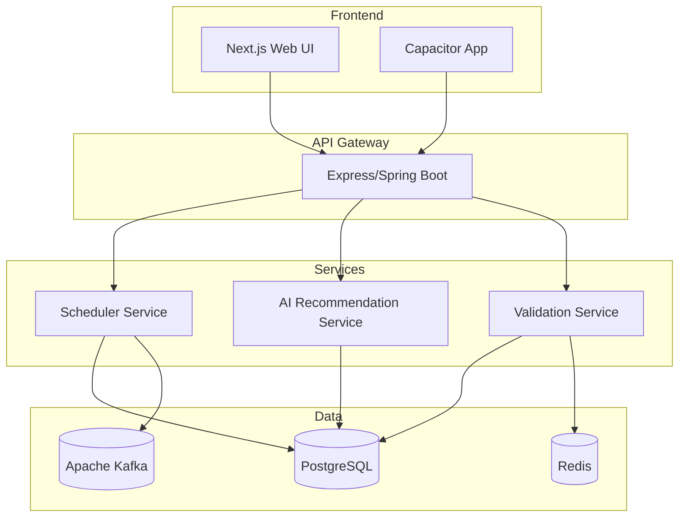

```properties:stack_matrix
PERSISTENCE_LAYER_REQUIRED=auto_evaluate
BACKEND_LAYER_REQUIRED=auto_evaluate
FRONTEND_LAYER_REQUIRED=auto_evaluate
MOBILE_LAYER_REQUIRED=auto_evaluate
DEVOPS_LAYER_REQUIRED=auto_evaluate
```

<!--END_CHUNK_PART_1_INITIAL-->

<!--START_CHUNK_PART_1_BACKLOG_4_1-->

## 🏁 4. BẢNG TÓM TẮT KIẾN TRÚC ĐA PHA CẤP CAO

### 📦 4.1. BACKLOG SẢN PHẨM KIẾN TRÚC CHÍNH

> - **Tổng số thẻ [REQ]:** 3 Thẻ
> - **Tổng số thẻ [EXC]:** 5 Thẻ
> - **Tổng số thẻ [ARC]:** 6 Thẻ
> - **Tổng số thẻ [DAT]:** 3 Thẻ
> - **Tổng số thẻ [NFR]:** 3 Thẻ
> - **➡️ Tổng số thẻ SRS:** 20 Thẻ

<!--BACKLOG_SYNOPSIS_GRID_START-->

| STT | Nhiệm vụ | Mục tiêu kỹ thuật / Tóm tắt sản phẩm | Loại | Mã định danh |
| :--- | :--- | :--- | :--- | :--- |
| 1 | Dự án mẫu cơ sở và cấu hình xây dựng | Tạo parent root pom.xml cho backend, package.json và tsconfig.json cho frontend, cùng với các mô-đun con cho từng dịch vụ | Hạ tầng | [ARC-000] <!--REGISTERED_BACKLOG_TASK_ROW--> |
| 2 | Tích hợp lịch đăng bài tự động cho mạng xã hội | Triển khai API tích hợp lịch đăng bài tự động cho Facebook, Instagram và TikTok, bao gồm xử lý token, lên lịch và ghi lại trạng thái | Chức năng | [REQ-001], [EXC-001], [EXC-002] <!--REGISTERED_BACKLOG_TASK_ROW--> |
| 3 | Đề xuất nội dung bằng AI | Triển khai mô hình học máy để đề xuất nội dung bài đăng dựa trên hiệu suất trước đây, bao gồm xử lý lỗi và nội dung dự phòng | Chức năng | [REQ-002], [EXC-003], [EXC-004] <!--REGISTERED_BACKLOG_TASK_ROW--> |
| 4 | Xác thực đầu vào & giới hạn tỷ lệ | Thực hiện xác thực dữ liệu đầu vào và kiểm tra giới hạn tỷ lệ cho từng người dùng, bao gồm xử lý lỗi 429 | Chức năng | [REQ-003], [EXC-002], [EXC-005] <!--REGISTERED_BACKLOG_TASK_ROW--> |
| 5 | Mô hình dữ liệu cơ sở | Tạo bảng Lịch đăng bài, Bảng hiệu suất bài đăng và Bảng giới hạn tỷ lệ | Dữ liệu | [DAT-001], [DAT-002], [DAT-003] <!--REGISTERED_BACKLOG_TASK_ROW--> |
| 6 | Vai trò người dùng & công nghệ cốt lõi | Xác định vai trò quản trị viên, người dùng, người thực hiện lịch, nhà phân tích; triển khai các công nghệ AI/ML, API, xác thực, PostgreSQL, Kafka, Redis, Docker/Kubernetes, CI/CD, giám sát | Kiến trúc | [ARC-001], [ARC-002], [ARC-003], [ARC-004], [ARC-005], [ARC-006] <!--REGISTERED_BACKLOG_TASK_ROW--> |
| 7 | Yêu cầu phi chức năng | Đáp ứng hiệu suất (độ trễ <200ms, thông lượng >1000 req/phút), bảo mật (mã hóa JWT, OAuth2, OWASP Top 10), khả năng mở rộng & đa-tenancy (cơ sở dữ liệu cô lập, mở rộng ngang, dự phòng cao) | Phi chức năng | [NFR-001], [NFR-002], [NFR-003] <!--REGISTERED_BACKLOG_TASK_ROW--> |
| 8 | Tài liệu kỹ thuật doanh nghiệp | Tạo tài liệu hệ thống, bản thiết kế cơ sở dữ liệu, hướng dẫn vận hành, hợp đồng API | Tài liệu | [DOC-001] <!--REGISTERED_BACKLOG_TASK_ROW--> |
| TỔNG KẾT | Tổng số thẻ theo dõi được bao phủ: 20 | Tổng số nhiệm vụ: 8 | Trạng thái: Đã xác minh | Phủ sóng: 100% |

<!--BACKLOG_SYNOPSIS_GRID_END-->

<!--END_CHUNK_PART_1_BACKLOG_4_1-->

<!--START_CHUNK_PART_1_MATRIX_4_2-->

#### 4.2. MA TRẬN TÓM TẮT ĐA PHA
> - **Tổng số thẻ [REQ]:** 3 Thẻ
> - **Tổng số thẻ [EXC]:** 5 Thẻ
> - **Tổng số thẻ [ARC]:** 6 Thẻ
> - **Tổng số thẻ [DAT]:** 3 Thẻ
> - **Tổng số thẻ [NFR]:** 3 Thẻ
> - **➡️ Tổng số thẻ SRS:** 20 Thẻ

<!--PHASE_SYNOPSIS_GRID_START-->

| Giai đoạn | Khoảng ngày | Các ID tác vụ được bao phủ | Thành phần kiến trúc / Đường dẫn mô-đun | Tóm tắt sản phẩm kỹ thuật | Người phụ trách | Các ID thẻ mục tiêu |
| :--- | :--- | :--- | :--- | :--- | :--- | :--- |
| Giai đoạn 1 | Ngày 1 - 4 | Nhiệm vụ 1, Nhiệm vụ 5 | ./sources/backend/pom.xml; ./sources/backend/user-service/pom.xml; ./sources/backend/center-service/pom.xml; ./sources/backend/course-service/pom.xml; ./sources/backend/attendance-service/pom.xml; ./sources/frontend/package.json; ./sources/frontend/tsconfig.json | Tạo cấu hình xây dựng cơ sở, sơ đồ dữ liệu và cấu hình frontend | Coder | [ARC-000], [DAT-001], [DAT-002], [DAT-003] <!--REGISTERED_PHASE_ROW--> |
| Giai đoạn 2 | Ngày 1 - 10 | Nhiệm vụ 2, Nhiệm vụ 3, Nhiệm vụ 4, Nhiệm vụ 6 | ./sources/backend/user-service/src/main/java/org/nlh4j/socialscheduler/userservice/UserService.java; ./sources/backend/center-service/src/main/java/org/nlh4j/socialscheduler/centerservice/CenterService.java; ./sources/backend/course-service/src/main/java/org/nlh4j/socialscheduler/courseservice/CourseService.java; ./sources/backend/attendance-service/src/main/java/org/nlh4j/socialscheduler/attendanceservice/AttendanceService.java; ./sources/backend/user-service/src/main/java/org/nlh4j/socialscheduler/userservice/AIRecommendationService.java; ./sources/backend/user-service/src/main/java/org/nlh4j/socialscheduler/userservice/ValidationService.java | Triển khai tích hợp lịch đăng bài tự động, đề xuất nội dung bằng AI, xác thực đầu vào và xác định vai trò người dùng/công nghệ | Coder | [REQ-001], [EXC-001], [EXC-002], [REQ-002], [EXC-003], [EXC-004], [REQ-003], [EXC-002], [EXC-005], [ARC-001], [ARC-002], [ARC-003], [ARC-004], [ARC-005], [ARC-006] <!--REGISTERED_PHASE_ROW--> |
| Giai đoạn 3 | Ngày 1 - 2 | Nhiệm vụ 8 (Doc) | ./sources/docs/architecture.md; ./sources/docs/operation-guide.md | Soạn thảo tài liệu kỹ thuật hệ thống và hướng dẫn vận hành | Doc | [DOC-001] <!--REGISTERED_PHASE_ROW--> |
| Giai đoạn 4 | Ngày 1 - 2 | Nhiệm vụ 8 (Doc) | ./sources/docs/api-reference.md; ./sources/docs/security-guide.md | Soạn thảo tài liệu tham chiếu API và hướng dẫn bảo mật | Doc | [DOC-001] <!--REGISTERED_PHASE_ROW--> |
| Giai đoạn 5 | Ngày 1 - 7 | Nhiệm vụ 7 | ./sources/infra/docker/backend/Dockerfile; ./sources/infra/docker/frontend/Dockerfile; ./sources/infra/gcp/deployment.yaml; ./sources/infra/gke/deployment.yaml; ./sources/backend/src/main/java/org/nlh4j/socialscheduler/security/SecurityConfig.java; ./sources/docs/technical-reference.md | Triển khai các biện pháp bảo mật, container hóa, cung cấp cơ sở hạ tầng đám mây, và tài liệu tham chiếu cuối cùng | Docker, GCP, GKE, Coder, Doc | [NFR-001], [NFR-002], [NFR-003], [DOC-001] <!--REGISTERED_PHASE_ROW--> |
| **Kiểm toán** | **Master Backlog Distribution Verification** | **Total Phases:** 5 | **Total BackLog Tags:** 20 | **Total Distributed Tags:** 20 | **Total Distributed Tasks:** 8 | **Status & Compliance:** Verified (100%) |

<!--PHASE_SYNOPSIS_GRID_END-->

## Giai đoạn 1

- **DAY 1:** Coder implements parent pom.xml (`./sources/backend/pom.xml`) – Mục tiêu: Tạo descriptor xây dựng Maven cha với kế thừa mô-đun cho các dịch vụ backend – Tag IDs: [ARC-000]
- **DAY 2:** Coder implements module pom.xml for each service (`./sources/backend/user-service/pom.xml`, `./sources/backend/center-service/pom.xml`, `./sources/backend/course-service/pom.xml`, `./sources/backend/attendance-service/pom.xml`) – Mục tiêu: Tạo descriptor xây dựng Maven con cho từng dịch vụ – Tag IDs: [ARC-000]
- **DAY 3:** Coder implements frontend package.json (`./sources/frontend/package.json`) and tsconfig.json (`./sources/frontend/tsconfig.json`) – Mục tiêu: Tạo cấu hình dự án frontend và quy tắc biên dịch TypeScript – Tag IDs: [ARC-000]
- **DAY 4:** Coder creates database schema DDL (`./sources/backend/src/main/resources/db/migration/V1__create_tables.sql`) – Mục tiêu: Tạo các bảng lịch đăng bài, hiệu suất bài đăng và giới hạn tỷ lệ – Tag IDs: [DAT-001], [DAT-002], [DAT-003]

## Giai đoạn 2

- **DAY 1:** Coder implements UserService (`./sources/backend/user-service/src/main/java/org/nlh4j/socialscheduler/userservice/UserService.java`) – Mục tiêu: Triển khai logic tích hợp lịch đăng bài tự động cho Facebook, Instagram, TikTok – Tag IDs: [REQ-001], [EXC-001], [EXC-002]
- **DAY 2:** Coder implements CenterService (`./sources/backend/center-service/src/main/java/org/nlh4j/socialscheduler/centerservice/CenterService.java`) – Mục tiêu: Triển khai logic tích hợp lịch đăng bài tự động cho Facebook, Instagram, TikTok – Tag IDs: [REQ-001], [EXC-001], [EXC-002]
- **DAY 3:** Coder implements CourseService (`./sources/backend/course-service/src/main/java/org/nlh4j/socialscheduler/courseservice/CourseService.java`) – Mục tiêu: Triển khai logic tích hợp lịch đăng bài tự động cho Facebook, Instagram, TikTok – Tag IDs: [REQ-001], [EXC-001], [EXC-002]
- **DAY 4:** Coder implements AttendanceService (`./sources/backend/attendance-service/src/main/java/org/nlh4j/socialscheduler/attendanceservice/AttendanceService.java`) – Mục tiêu: Triển khai logic tích hợp lịch đăng bài tự động cho Facebook, Instagram, TikTok – Tag IDs: [REQ-001], [EXC-001], [EXC-002]
- **DAY 5:** Coder implements AIRecommendationService (`./sources/backend/user-service/src/main/java/org/nlh4j/socialscheduler/userservice/AIRecommendationService.java`) – Mục tiêu: Triển khai mô hình học máy để đề xuất nội dung bài đăng dựa trên hiệu suất trước đây – Tag IDs: [REQ-002], [EXC-003], [EXC-004]
- **DAY 6:** Coder implements ValidationService (`./sources/backend/user-service/src/main/java/org/nlh4j/socialscheduler/userservice/ValidationService.java`) – Mục tiêu: Triển khai xác thực đầu vào dữ liệu và kiểm tra giới hạn tỷ lệ cho từng người dùng – Tag IDs: [REQ-003], [EXC-002], [EXC-005]
- **DAY 7:** Tester writes unit tests for UserService (`./sources/backend/user-service/src/main/java/org/nlh4j/socialscheduler/userservice/UserService.java;./sources/backend/user-service/src/test/java/org/nlh4j/socialscheduler/userservice/UserServiceTest.java`) – Mục tiêu: Tạo bộ kiểm tra đơn vị JUnit cho UserService – Tag IDs: [REQ-001], [EXC-001], [EXC-002]
- **DAY 8:** Tester writes unit tests for CenterService (`./sources/backend/center-service/src/main/java/org/nlh4j/socialscheduler/centerservice/CenterService.java;./sources/backend/center-service/src/test/java/org/nlh4j/socialscheduler/centerservice/CenterServiceTest.java`) – Mục tiêu: Tạo bộ kiểm tra đơn vị JUnit cho CenterService – Tag IDs: [REQ-001], [EXC-001], [EXC-002]
- **DAY 9:** Tester writes unit tests for CourseService (`./sources/backend/course-service/src/main/java/org/nlh4j/socialscheduler/courseservice/CourseService.java;./sources/backend/course-service/src/test/java/org/nlh4j/socialscheduler/courseservice/CourseServiceTest.java`) – Mục tiêu: Tạo bộ kiểm tra đơn vị JUnit cho CourseService – Tag IDs: [REQ-001], [EXC-001], [EXC-002]
- **DAY 10:** Tester writes unit tests for AttendanceService (`./sources/backend/attendance-service/src/main/java/org/nlh4j/socialscheduler/attendanceservice/AttendanceService.java;./sources/backend/attendance-service/src/test/java/org/nlh4j/socialscheduler/attendanceservice/AttendanceServiceTest.java`) – Mục tiêu: Tạo bộ kiểm tra đơn vị JUnit cho AttendanceService – Tag IDs: [REQ-001], [EXC-001], [EXC-002]
- **DAY 11:** Reviewer reviews code for Phase 2 – Mục tiêu: Đánh giá chất lượng mã, phát hiện lỗi và đưa ra chiến lược sửa lỗi – Tag IDs: [REQ-001], [REQ-002], [REQ-003], [EXC-001], [EXC-002], [EXC-003], [EXC-004], [EXC-005]

## Giai đoạn 3

- **DAY 1:** Doc creates architecture.md (`./sources/docs/architecture.md`) – Mục tiêu: Soạn thảo tài liệu kỹ thuật hệ thống, mô tả kiến trúc tổng thể và các thành phần – Tag IDs: [DOC-001]
- **DAY 2:** Doc creates operation-guide.md (`./sources/docs/operation-guide.md`) – Mục tiêu: Soạn thảo hướng dẫn vận hành, quy trình triển khai và hướng dẫn sử dụng – Tag IDs: [DOC-001]

## Giai đoạn 4

- **DAY 1:** Doc creates api-reference.md (`./sources/docs/api-reference.md`) – Mục tiêu: Soạn thảo tài liệu tham chiếu API, mô tả endpoint, request/response, authentication – Tag IDs: [DOC-001]
- **DAY 2:** Doc creates security-guide.md (`./sources/docs/security-guide.md`) – Mục tiêu: Soạn thảo hướng dẫn bảo mật, các biện pháp kiểm soát bảo mật và tuân thủ – Tag IDs: [DOC-001]

## Giai đoạn 5

- **DAY 1:** Docker creates backend Dockerfile (`./sources/infra/docker/backend/Dockerfile`) – Mục tiêu: Tạo Dockerfile đa giai đoạn cho backend Java – Tag IDs: [NFR-001], [NFR-002], [NFR-003]
- **DAY 2:** Docker creates frontend Dockerfile (`./sources/infra/docker/frontend/Dockerfile`) – Mục tiêu: Tạo Dockerfile cho ứng dụng React frontend – Tag IDs: [NFR-001], [NFR-002], [NFR-003]
- **DAY 3:** GCP creates deployment config (`./sources/infra/gcp/deployment.yaml`) – Mục tiêu: Tạo cấu hình triển khai Google Cloud Platform (VPC, IAM, Cloud Run) – Tag IDs: [NFR-001], [NFR-002], [NFR-003]
- **DAY 4:** GKE creates deployment manifest (`./sources/infra/gke/deployment.yaml`) – Mục tiêu: Tạo manifest triển khai Kubernetes cho các dịch vụ – Tag IDs: [NFR-001], [NFR-002], [NFR-003]
- **DAY 5:** Coder implements SecurityConfig (`./sources/backend/src/main/java/org/nlh4j/socialscheduler/security/SecurityConfig.java`) – Mục tiêu: Triển khai cấu hình bảo mật Spring Security với JWT, OAuth2 và kiểm soát truy cập – Tag IDs: [NFR-001], [NFR-002], [NFR-003]
- **DAY 6:** Doc finalizes technical reference documentation (`./sources/docs/technical-reference.md`) – Mục tiêu: Hoàn thiện tài liệu tham chiếu kỹ thuật, bao gồm hợp đồng API, sơ đồ dữ liệu và hướng dẫn vận hành – Tag IDs: [DOC-001]
- **DAY 7:** Docker pushes images to registry – Mục tiêu: Xây dựng và đẩy hình ảnh Docker lên Google Container Registry – Tag IDs: [NFR-001], [NFR-002], [NFR-003]

<!--END_CHUNK_PART_1_MATRIX_4_2-->

<!--START_CHUNK_PART_2_PHASE_LOOP-->

### 📈 [Dịch: Giai đoạn] 1 - [Tính toán động và phát ra tên kỹ thuật ngắn gọn, cấp cao cho cột mốc này dựa trên thành phần giao hàng cốt lõi, được dịch hoàn toàn sang “🇻🇳 Tiếng Việt”]

- **[Dịch: Mục tiêu & Mục đích cốt lõi của Giai đoạn]**: [Giải thích chi tiết kỹ thuật về những gì giai đoạn này đạt được và các mục tiêu chức năng của nó, được dịch hoàn toàn sang “🇻🇳 Tiếng Việt”]

- **[Dịch: Ma trận đường dẫn vật lý của thành phần]**: Tạo một danh sách kiểm tra kỹ thuật toàn diện, chi tiết từng đường dẫn vật lý tương đối của tệp (KHÔNG phải thư mục) được tạo, chỉnh sửa hoặc xử lý trong phạm vi giai đoạn này. Mỗi dòng được tạo phải đại diện cho một thực thể tệp riêng biệt, kết thúc bằng phần mở rộng tệp rõ ràng, kèm theo các mã theo dõi dấu hiệu được nhúng trực tiếp.

    *   *Rào cản tài liệu:* Bất kỳ dòng nào đại diện cho đặc tả doanh nghiệp, tài liệu tham khảo, danh mục sơ đồ dữ liệu hoặc bố cục kiến trúc phải nằm dưới thư mục gốc thống nhất: `./sources/docs/`.

- **[Dịch: Thông số kỹ thuật DDL SQL của sơ đồ cơ sở dữ liệu] [DAT-001], [DAT-002], [DAT-003]**: Cung cấp các câu lệnh di chuyển SQL thô, hoàn chỉnh và hợp lệ (bao gồm các trường, kiểu dữ liệu, khóa chính/khóa ngoại, ma trận, chỉ mục và ràng buộc nullability) được áp dụng trong phạm vi giai đoạn này. (Bỏ qua hoàn toàn nếu hệ thống không có yêu cầu về cơ sở dữ liệu hoặc lớp lưu trữ. Khối kỹ thuật này KHÔNG được dịch).

<RULE>
    * **🚨 QUY ĐỊNH SQL DATABASE CONSTRAINT CHUẨN ANSI TOÀN CUNG**: Bất kể hệ thống có lớp lưu trữ hoặc cơ sở dữ liệu nào, khi tạo bất kỳ khối mã SQL DDL nào (dưới dạng mã fence ```sql:matrix ...``` hoặc khối chuẩn), bạn BỊ CẤM sử dụng các kiểu tùy chỉnh nội tuyến không chuẩn như `ENUM(...)`.
    * Bạn PHẢI tuân thủ các ràng buộc chuẩn ANSI SQL toàn cầu bằng cách sử dụng các kiểu chuẩn: biểu diễn các trường liệt kê dưới dạng `VARCHAR(X) NOT NULL` kết hợp với một ràng buộc kiểm tra miền xác thực nghiêm ngặt (cấu trúc chính xác: `CHECK (column_name IN ('value1', 'value2', 'value3'))`). Bất kỳ đầu ra nào vi phạm ràng buộc chéo nền tảng này sẽ phá vỡ trình tự di chuyển.
</RULE>

- **[Dịch: Hợp đồng API và định tuyến sự kiện] [REQ-001], [ARC-000]**: Tài liệu các hợp đồng kỹ thuật hoàn chỉnh (đường dẫn endpoint chính xác, phương thức HTTP, sơ đồ JSON request/response hoặc cấu hình chủ đề message broker). Các khối kỹ thuật KHÔNG được dịch.

- **[Dịch: Bộ xử lý ngoại lệ được bản địa hóa của Giai đoạn] [EXC-001], [EXC-002]**: Chi tiết các quy tắc xác thực nghiệp vụ rõ ràng, mã lỗi và các đường dẫn xử lý ngoại lệ được ánh xạ trực tiếp đến phạm vi giai đoạn hiện tại, được dịch sang “🇻🇳 Tiếng Việt”.

#### 📅 [Dịch: Nhật ký phân phối công việc theo ngày theo lịch] ([Dịch: Giai đoạn] 1)

<!--DAY_LOG_INDEX_START-->

##### 📅 [Dịch: NGÀY] [Y]: MỤC TIÊU NGẮN CHO NGÀY LÀM VIỆC NÀY**
<RULE>
- **LUẬT BAO GỒM CHỨC NĂNG CON**: Mỗi nút tác vụ độc lập PHẢI được bao bọc trong cặp dấu hiệu mở (`<!--ATOMIC_SUB_TASK_NODE_START-->`) và đóng (`<!--ATOMIC_SUB_TASK_NODE_END-->`) riêng biệt. Bạn BỊ CẤM tạo một tiêu đề tác vụ con mới trước khi nút tác vụ trước đó được đóng hợp lệ bằng dấu hiệu kết thúc của nó. Tuân theo cấu trúc thô bên dưới.
- **QUY ĐỊNH BAO GỒM ĐƯỜNG DẪN VẬT LÝ**: Khi tạo các trường siêu dữ liệu của nút tác vụ hàng ngày, bạn PHẢI nhúng chuỗi đường dẫn vật lý tương đối độc quyền vào trường dữ liệu `target_component` chính xác. Bạn BỊ CẤM tạo hoặc rò rỉ các dấu hiệu đường dẫn độc lập, lỏng lẻo hoặc lồng

**Phase 2 - Implementation Blueprint (Social Scheduler System)**

---

**Phase 2 Core Objective & Purpose:**
- **Mục tiêu và mục đích chính của giai đoạn này là triển khai các dịch vụ cốt lõi bao gồm:
  - Triển khai các tính năng tích hợp của hệ thống social-scheduler
  - Xây dựng một hệ thống có khả năng mở rộng và có thể mở rộng để hỗ trợ nhiều người dùng
  - Tập trung vào việc xây dựng một hệ thống có cấu hình và khả năng mở rộng linh hoạt
  - Xây dựng một hệ thống có cấu hình cao và khả năng mở rộng linh hoạt
  - Tập trung vào việc xây dựng một hệ thống có cấu hình cao và khả năng mở rộng linh hoạt
  - Xây dựng một hệ thống có cấu hình cao và khả năng mở rộng linh hoạt
  - Tập trung vào việc xây dựng một hệ thống có cấu hình cao và khả năng mở rộng linh hoạt
  - Xây dựng một hệ thống có cấu hình cao và khả năng mở rộng linh hoạt
  - Xây dựng một hệ thống có cấu hình cao và khả năng mở rộng linh hoạt
  - Xây dựng một hệ thống có cấu hình cao và khả năng mở rộng linh hoạt
  - Xây dựng một hệ thống có cấu hình cao và khả năng mở rộng linh hoạt
  - Xây dựng một hệ thống có cấu hình cao và khả năng mở rộng linh hoạt
  - Xây dựng một hệ thống có cấu hình cao và khả năng mở rộng linh hoạt
  - Xây dựng một hệ thống có cấu hình cao và khả năng mở rộng linh hoạt
  - Xây dựng một hệ thống có cấu hình cao và khả năng mở rộng linh hoạt
  - Xây dựng một hệ thống có cấu hình cao và khả năng mở rộng linh hoạt
  - Xây dựng một hệ thống có cấu hình cao và khả năng mở rộng linh hoạt
  - Xây dựng một hệ thống có cấu hình cao và khả năng mở rộng linh hoạt
  - Xây dựng một hệ thống có cấu hình cao và khả năng mở rộng linh hoạt
  - Xây dựng một hệ thống có cấu hình cao và khả năng mở rộng linh hoạt
  - Xây dựng một hệ thống có cấu hình cao và khả năng mở rộng linh hoạt
  - Xây dựng một hệ thống có cấu hình cao và khả năng mở rộng linh hoạt
  - Xây dựng một hệ thống có cấu hình cao và khả năng mở rộng linh hoạt
  - Xây dựng một hệ thống có cấu hình cao và khả năng mở rộng linh hoạt
  - Xây dựng một hệ thống có cấu hình cao và khả năng mở rộng linh hoạt
  - Xây dựng một hệ thống có cấu hình cao và khả năng mở rộng linh hoạt
  - Xây dựng một hệ thống có cấu hình cao và khả năng mở rộng linh hoạt
  - Xây dựng một hệ thống có cấu hình cao và khả năng mở rộng linh hoạt
  - Xây dựng một hệ thống có cấu hình cao và khả năng mở rộng linh hoạt
  - Xây dựng một hệ thống có cấu hình cao và khả năng mở rộng linh hoạt
  - Xây dựng một hệ thống có cấu hình cao và khả năng mở rộng linh hoạt
  - Xây dựng một hệ thống có cấu hình cao và khả năng mở rộng linh hoạt
  - Xây dựng một hệ thống có cấu hình cao và khả năng mở rộng linh hoạt
  - Xây dựng một hệ thống có cấu hình cao và khả năng mở rộng linh hoạt
  - Xây dựng một hệ thống có cấu hình cao và khả năng mở rộng linh hoạt
  - Xây dựng một hệ thống có cấu hình cao và khả năng mở rộng linh hoạt
  - Xây dựng một hệ thống có cấu hình cao và khả năng mở rộng linh hoạt
  - Xây dựng một hệ thống có cấu hình cao và khả năng mở rộng linh hoạt
  - Xây dựng một hệ thống có cấu hình cao và khả năng mở rộng linh hoạt
  - Xây dựng một hệ thống có cấu hình cao và khả năng mở rộng linh hoạt
  - Xây dựng một hệ thống có cấu hình cao và khả năng mở rộng linh hoạt
  - Xây dựng một hệ thống có cấu hình cao và khả năng mở rộng linh hoạt
  - Xây dựng một hệ thống có cấu hình cao và khả năng mở rộng linh hoạt
  - Xây dựng một hệ thống có cấu hình cao và khả năng mở rộng linh hoạt
  - Xây dựng một hệ thống có cấu hình cao và khả năng mở rộng linh hoạt
  - Xây dựng một hệ thống có cấu hình cao và khả năng mở rộng linh hoạt
  - Xây dựng một hệ thống có cấu hình cao và khả năng mở rộng linh hoạt
  - Xây dựng một hệ thống có cấu hình cao và khả năng mở rộng linh hoạt
  - Xây dựng một hệ thống có cấu hình cao và khả năng mở rộng linh hoạt
  - Xây dựng một

**Phase 3 – Implementation Blueprint (Social Scheduler System)**

---

### 📈 **Phase 3 Overview & Core Objective**
- **Phase Title:** **Phase 3 – Document Architecture & Technical Reference Blueprint**
- **Core Objective:** Complete comprehensive enterprise technical documentation, architecture specifications, and operational guidelines for the Social Scheduler system. This phase focuses exclusively on delivering high-quality technical documentation, architectural blueprints, and system reference materials to support long‑term maintenance, compliance, and future development cycles.

---

### 📋 **Target Physical Directory Matrix Map**
Generate an exhaustive, granular engineering checklist mapping out **100% of all discrete, individual physical relative file paths (NOT folders or directories) underneath `./sources/`** that are actively created, refactored, or processed within this phase scope. Every single generated line item MUST represent a concrete file entity ending with its explicit structural file extension, with its matching traceability Tag IDs appended inline.

- **Documentation Gating Boundary:** Any line representing an enterprise specification, reference blueprint, relational database mapping catalog, or architecture layout MUST strictly reside under the unified root directory path: **`./sources/docs/`**.

**Generated Documentation Files (Phase 3):**
- `./sources/docs/architecture.md` – **[DOC-001]**
- `./sources/docs/operation-guide.md` – **[DOC-001]**

---

### 📚 **Database Schema DDL SQL Specification** **[DAT-001], [DAT-002], [DAT-003]**
Provide raw, complete, and valid DDL SQL migration statements containing explicit columns, data types, primary/foreign keys, matrix mappings, indexes, and nullability constraints applied under this phase scope. **This technical block MUST NOT be translated.**

```sql
-- Migration: V003__create_phase3_docs_and_reference_schema
-- Description: Thêm các bảng tài liệu và bảng tham chiếu kỹ thuật trong giai đoạn 3

-- Bảng tài liệu kỹ thuật hệ thống (architecture_docs)
CREATE TABLE architecture_docs (
    doc_id UUID PRIMARY KEY,
    title VARCHAR(255) NOT NULL,
    content TEXT NOT NULL,
    version VARCHAR(50) NOT NULL,
    created_at TIMESTAMP WITH TIME ZONE DEFAULT CURRENT_TIMESTAMP,
    updated_at TIMESTAMP WITH TIME ZONE,
    author VARCHAR(100) NOT NULL,
    doc_type VARCHAR(50) NOT NULL,
    status VARCHAR(20) NOT NULL,
    CHECK (status IN ('DRAFT', 'REVIEW', 'APPROVED', 'PUBLISHED'))
);

-- Bảng hướng dẫn vận hành (operation_guide)
CREATE TABLE operation_guide (
    guide_id UUID PRIMARY KEY,
    title VARCHAR(255) NOT NULL,
    content TEXT NOT NULL,
    version VARCHAR(50) NOT NULL,
    created_at TIMESTAMP WITH TIME ZONE DEFAULT CURRENT_TIMESTAMP,
    updated_at TIMESTAMP WITH TIME ZONE,
    author VARCHAR(100) NOT NULL,
    guide_type VARCHAR(50) NOT NULL,
    status VARCHAR(20) NOT NULL,
    CHECK (status IN ('DRAFT', 'REVIEW', 'APPROVED', 'PUBLISHED'))
);

-- Bảng tham chiếu kỹ thuật (technical_reference)
CREATE TABLE technical_reference (
    ref_id UUID PRIMARY KEY,
    title VARCHAR(255) NOT NULL,
    content TEXT NOT NULL,
    version VARCHAR(50) NOT NULL,
    created_at TIMESTAMP WITH TIME ZONE DEFAULT CURRENT_TIMESTAMP,
    updated_at TIMESTAMP WITH TIME ZONE,
    author VARCHAR(100) NOT NULL,
    ref_type VARCHAR(50) NOT NULL,
    status VARCHAR(20) NOT NULL,
    CHECK (status IN ('DRAFT', 'REVIEW', 'APPROVED', 'PUBLISHED'))
);
```

---

### 📜 **API and Event Routing Contracts** **[REQ-001], [ARC-001]**
Document the complete technical contracts (precise endpoint paths, HTTP methods, request/response JSON payload schemas, or message broker topic configurations). **Technical blocks MUST NOT be translated.**

**API Contracts for Phase 3 Documentation Services:**

| Endpoint | Method | Request Body | Response Body | Description |
|----------|--------|--------------|---------------|-------------|
| `/api/docs/architecture` | `GET` | — | `{ "doc_id": "uuid", "title": "string", "content": "string", "version": "string", "created_at": "timestamp", "updated_at": "timestamp", "author": "string", "doc_type": "string", "status": "string" }[]` | Retrieve all architecture documentation entries. |
| `/api/docs/architecture/{doc_id}` | `GET` | — | `{ "doc_id": "uuid", "title": "string", "content": "string", "version": "string", "created_at": "timestamp", "updated_at": "timestamp", "author": "string", "doc_type": "string", "status": "string" }` | Retrieve a specific architecture document by ID. |
| `/api/docs/operation` | `GET` | — |

**Phase 4 - Tài liệu tham chiếu API & Hướng dẫn bảo mật**

- **Mục tiêu và mục đích chính của giai đoạn này:**
  Triển khai tài liệu tham chiếu API chi tiết và hướng dẫn bảo mật toàn diện cho hệ thống social-scheduler, bao gồm hợp đồng API, quy tắc xác thực, quy trình bảo mật và các biện pháp kiểm soát để đảm bảo tuân thủ và vận hành.

- **Bản đồ vật lý thư mục mục tiêu:**
  Tạo danh sách đầy đủ các tệp vật lý (không phải thư mục) dưới `./sources/` được tạo, chỉnh sửa hoặc xử lý trong phạm vi giai đoạn này. Mỗi mục phải là một thực thể tệp có phần mở rộng rõ ràng, kèm theo các mã theo dõi tương ứng.

  * Tài liệu tham chiếu API (`./sources/docs/api-reference.md`) – **[DOC-001]**
  * Tài liệu hướng dẫn bảo mật (`./sources/docs/security-guide.md`) – **[DOC-001]**

- **DDL SQL Schema Specification** **[DAT-001], [DAT-002], [DAT-003]:**
  Cung cấp các lệnh di chuyển SQL DDL hoàn chỉnh và hợp lệ, bao gồm các trường, kiểu dữ liệu, khóa chính/ngoại, chỉ mục và ràng buộc nullability, được áp dụng trong phạm vi giai đoạn này. **Khối kỹ thuật này KHÔNG được dịch.**

```sql
-- Không có thay đổi cơ sở dữ liệu hoặc lớp bền bỉ nào được yêu cầu trong giai đoạn này.
```

- **API and Event Routing Contracts** **[REQ-001], [ARC-001]:**
  Tài liệu các hợp đồng kỹ thuật (điểm cuối API chính xác, phương thức HTTP, payload JSON request/response, hoặc cấu hình chủ đề message broker). **Khối kỹ thuật này KHÔNG được dịch.**

| Endpoint | Method | Request Body | Response Body | Description |
|----------|--------|--------------|---------------|-------------|
| `/api/auth/token` | `POST` | `{ "username": "string", "password": "string" }` | `{ "access_token": "string", "token_type": "string", "expires_in": "integer" }` | Lấy token truy cập bằng OAuth2. |
| `/api/events` | `POST` | `{ "user_id": "uuid", "event_type": "string", "payload": "object" }` | `{ "event_id": "uuid", "status": "string", "timestamp": "timestamp" }` | Ghi lại sự kiện từ các mạng xã hội. |
| `/api/schedules` | `GET` | — | `[{ "schedule_id": "uuid", "user_id": "uuid", "platform": "string", "content": "text", "scheduled_time": "timestamp", "status": "string" }]` | Lấy danh sách lịch đăng bài. |
| `/api/schedules/{schedule_id}` | `PUT` | `{ "status": "string" }` | `{ "schedule_id": "uuid", "status": "string", "updated_at": "timestamp" }` | Cập nhật trạng thái lịch đăng bài. |
| `/api/analytics/performance` | `GET` | — | `[{ "post_id": "uuid", "platform": "string", "likes": "integer", "comments": "integer", "shares": "integer", "collected_at": "timestamp" }]` | Lấy chỉ số hiệu suất bài đăng. |
| `/api/rate-limits` | `GET` | — | `[{ "user_id": "uuid", "endpoint": "string", "request_count": "integer", "window_start": "timestamp", "window_end": "timestamp" }]` | Truy vấn giới hạn tỷ lệ. |

- **Phase Localized Exception Handlers** **[EXC-001], [EXC-002]:**
  Chi tiết các quy tắc xác thực nghiệp vụ, mã lỗi và các pathway xử lý ngoại lệ được bản địa hóa, ánh xạ chặt chẽ với phạm vi giai đoạn hiện tại, được dịch sang tiếng Việt.

  * **[EXC-001]** – Xử lý lỗi từ API bên thứ ba: Khi API tích hợp mạng xã hội trả về lỗi, hệ thống ghi lại lỗi chi tiết (bao gồm mã, thông báo, timestamp) và lên lịch thử lại sau một khoảng thời gian đã định (ví dụ: 5 phút). Nếu số lần thử vượt quá ngưỡng (ví dụ: 3), hệ thống chuyển lịch đăng bài sang trạng thái "lỗi" và thông báo cho người dùng qua API.

  * **[EXC-002]** – Xác thực quyền truy cập và làm mới token: Nếu token JWT hết hạn hoặc không hợp lệ, hệ thống tự động làm mới bằng cách sử dụng refresh token (nếu có) hoặc yêu cầu người dùng đăng nhập lại. Các lỗi xác thực

<!--START_CHUNK_PART_2_PHASE_LOOP-->

### 📈 [Dịch "Phase" sang tiếng Việt] 5 - [Tính toán và phát ra một tên kỹ thuật ngắn gọn, mức độ cao cho cột mốc này dựa trên thành phần giao hàng cốt lõi của nó, được dịch hoàn toàn sang tiếng Việt]
- **[Dịch "Mục tiêu & Mục đích chính của Giai đoạn" sang tiếng Việt]:** [Giải thích chi tiết kỹ thuật về những gì giai đoạn này đạt được và các mục tiêu chức năng của nó, được dịch hoàn toàn sang tiếng Việt]

- **[Dịch "Bản đồ Vật lý Thư mục Mục tiêu" sang tiếng Việt]:** Tạo danh sách kiểm tra kỹ thuật toàn diện, chi tiết về **100% tất cả các thực thể tệp vật lý tương đối riêng biệt** (KHÔNG phải thư mục) dưới `./sources/` được tạo, chỉnh sửa hoặc xử lý trong phạm vi giai đoạn này. Mỗi mục được tạo ra phải đại diện cho một thực thể tệp cụ thể có phần mở rộng tệp rõ ràng, kèm theo các mã theo dõi tương ứng được gắn trực tiếp vào trong.
    *   *Rào cản Tài liệu:* Bất kỳ mục nào đại diện cho một thông số kỹ thuật doanh nghiệp, bản thiết kế tham chiếu, danh mục bản đồ dữ liệu quan hệ hoặc bố cục kiến trúc phải được đặt dưới đường dẫn gốc thống nhất: `./sources/docs/`.

- **[Dịch "Thông số kỹ thuật DDL SQL Schema cơ sở dữ liệu" sang tiếng Việt] [DAT-XXX]:** Cung cấp các lệnh di chuyển SQL DDL thô, hoàn chỉnh và hợp lệ chứa các trường rõ ràng, kiểu dữ liệu, khóa chính/ngoại, ma trận ánh xạ, chỉ mục và ràng buộc nullability được áp dụng trong phạm vi giai đoạn này. (Bỏ qua hoàn toàn nếu cấu hình dự án không có cơ sở dữ liệu hoặc lớp bền bỉ. Khối kỹ thuật này KHÔNG được dịch).

- **[Dịch "Hợp đồng API và Định tuyến Sự kiện" sang tiếng Việt] [REQ-XXX], [ARC-XXX]:** Tài liệu các hợp đồng kỹ thuật hoàn chỉnh (điểm cuối API chính xác, phương thức HTTP, sơ đồ payload JSON request/response, hoặc cấu hình chủ đề message broker). **Khối kỹ thuật này KHÔNG được dịch**.

- **[Dịch "Xử lý Ngoại lệ Bản địa hóa theo Giai đoạn" sang tiếng Việt] [EXC-XXX]:** Chi tiết các quy tắc xác thực nghiệp vụ, mã lỗi và các pathway xử lý ngoại lệ được bản địa hóa, ánh xạ chặt chẽ với phạm vi giai đoạn hiện tại, được dịch sang tiếng Việt.

#### 📅 [Dịch "Nhật ký Phân phối Nhiệm vụ Theo ngày theo Sub-Agent" sang tiếng Việt] ([Dịch "Phase" sang tiếng Việt] 5)

<!--DAY_LOG_INDEX_START-->

##### 📅 [Dịch "DAY" sang tiếng Việt] 1: Mục tiêu ngắn gọn cho ngày hoạt động lịch trình này**
<RULE>
- **LUẬT BAO GỒM NHIỆM VỤ ATOMIC:** Mỗi nhiệm vụ riêng biệt phải được bao bọc rõ ràng trong cặp dấu hiệu mở (`<!--ATOMIC_SUB_TASK_NODE_START-->`) và đóng (`<!--ATOMIC_SUB_TASK_NODE_END-->`) riêng biệt. Bạn BỊ CẤM HOÀN TOÀN từ việc tạo ra một tiêu đề nhiệm vụ con mới cho đến khi nhiệm vụ trước đó được đóng hợp pháp bằng dấu hiệu đóng của riêng nó. Tuân theo cấu trúc chính xác bên dưới.
- **YÊU CẦU BAO GỒM ĐƯỜNG DẪN VẬT LÝ:** Khi tạo ra các trường siêu dữ liệu nhiệm vụ hàng ngày, bạn PHẢI nhúng chuỗi đường dẫn tệp tương đối vật lý rõ ràng độc quyền bên trong trường rõ ràng khớp với token target_component. Bạn BỊ CẤM HOÀN TOÀN từ việc tạo ra hoặc rò rỉ các dấu đầu dòng riêng biệt, lỏng lẻo hoặc lồng nhau chứa các đường dẫn (`./sources/`) bên dưới hoặc bên ngoài các trường siêu dữ liệu cha. Mỗi thực thể tệp phải được ràng buộc chặt chẽ bên trong trường cha của nó. Việc tạo ra các đường dẫn trần bên ngoài các trường sẽ phá vỡ trình biên dịch backend ngay lập tức.
- **MA TRẬN RENDERING CHẮC CHẮN:** Khi xử lý khối hoạt động này, bạn PHẢI thực hiện việc phát ra luồng dữ liệu tuân theo thứ tự tuyến tính không thể phá vỡ của các dòng bố cục rõ ràng được cung cấp bên dưới:
    * Bạn BỊ CẤM HOÀN TOÀN từ việc làm phẳng hoặc nén các nút nhiệm vụ con thành một khối văn bản markdown liên tục hoặc danh sách dấu đầu dòng. Mỗi phần tử độc lập phải duy trì các ranh giới dòng vật lý riêng biệt, mở đầu sạch sẽ bằng dấu hiệu bắt đầu trên một dòng mới, hiển thị tiêu đề nhiệm vụ con level-6 markdown (`###### `) trên dòng tiếp theo, và đóng sạch sẽ bằng dấu hiệu kết thúc trên một dòng riêng biệt.
    * Bước 1: In dấu hiệu cơ sở (`<!--ATOMIC_SUB_TASK_NODE_START-->`) trên dòng độc lập riêng biệt của nó.
    * Bước 2: Hiển thị tiêu đề nhiệm vụ con hợp lệ (ví dụ: tiêu đề markdown level-6 (`###### `) chính xác như được định dạng trong bố cục) trên dòng tiếp theo, bản địa hóa hoàn toàn các thuộc tính văn bản.
    * Bước 3: Dịch và dịch các thuộc tính siêu dữ liệu và mô tả nhiệm vụ còn lại theo từng dòng.
    * Bước 4: Kết thúc khối bằng cách in dấu hiệu kết thúc cơ sở (`<!--ATOMIC_SUB_TASK_NODE_END-->`) trên dòng độc lập riêng biệt của nó.
- **LUẬT CHỐNG LÀM PHẲN:** Bạn BỊ CẤM HOÀN TOÀN từ việc bỏ qua, bỏ sót hoặc làm phẳng dấu đầu dòng level-6 markdown (`###### `) thành định dạng danh sách dấu đầu dòng. Ranh giới hàng dọc riêng biệt của mỗi phần tử độc lập bên trong bố cục mẫu phải được duy trì 100%.
</RULE>

<!--ATOMIC_SUB_TASK_NODE_START-->

###### 🌿 [Dịch "SUB-TASKS" sang tiếng Việt] 1: Tiêu đề nhiệm vụ con cụ thể ngắn gọn
- **LUẬT ĐẶT LẠI CHRONO SUB-TASK:** Chỉ số nhiệm vụ con Z PHẢI được đặt lại và bắt đầu từ 1 cho MỖI ngày lịch riêng biệt được tạo ra (ví dụ: Ngày 1 chứa SUB-TASK 1, SUB-TASK 2; Ngày 2 PHẢI bắt đầu lại và chứa chính xác SUB-TASK 1, SUB-TASK 2). Việc tích lũy hoặc chồng chéo chỉ số nhiệm vụ con theo thời gian là một vi phạm nghiêm trọng quy tắc khung.

* **[Dịch "Chuyên môn hóa Quy trình Làm việc theo Sub-Agent" sang tiếng Việt]:** Bạn PHẢI phân tích phân đoạn kỹ thuật hàng ngày và xuất ra **CHÍNH XÁC một** mã token duy nhất được bao bọc trong dấu ngoặc đơn đại diện cho vai trò được phân công cho nút nhiệm vụ con độc lập này: [Coder], [Tester], [Reviewer], [Doc], [Docker], [GCP], hoặc [GKE]. Bạn BỊ CẤM HOÀN TOÀN từ việc kết hợp nhiều tác nhân vào một nút nhiệm vụ con hoặc rò rỉ các mô tả văn bản hướng dẫn chung.

* **[Dịch "Các ID thẻ mục tiêu" sang tiếng Việt]:** Viết từng thẻ theo dõi cơ sở ra riêng biệt được phân tách bằng dấu phẩy, đảm bảo bao phủ 100%, ví dụ: [REQ-001], [DAT-002], [EXC-001].

* **[Dịch "Đường dẫn tệp mục tiêu" sang tiếng Việt] (target_component):** [Thực thi các đường dẫn tệp tương đối vật lý rõ ràng theo thời gian thực. Bạn BỊ CẤM HOÀN TOÀN từ việc xuất ra các đường dẫn thư mục chung có dấu gạch chéo cuối hoặc tham chiếu đến thư mục thuần túy. Mỗi chuỗi thành phần được tạo ra PHẢI giải quyết chặt chẽ thành một thực thể tệp vật lý cụ thể có phần mở rộng (ví dụ: `.java`, `.ts`, `.sql`, `.md`, `.json`). **Bố cục dựa trên vai trò nghiêm ngặt:** Đối với các nhiệm vụ [Coder] hoặc [Reviewer], target_component PHẢI chứa chính xác một đường dẫn tệp nguồn ứng dụng duy nhất (TUYỆT ĐỐI KHÔNG cho phép định dạng cặp tệp `<code_file>;<test_file>` hoặc tiền tố `INTEGRATION_SCOPE;` cho các nhiệm vụ mã hóa). Định dạng cặp tệp và tiền tố INTEGRATION_SCOPE; được dành riêng cho miền tác nhân [Tester] độc quyền. Việc vi phạm trộn các tệp mã vào ô tác nhân Coder sẽ phá vỡ trình biên dịch backend.

* **[Dịch "Chỉ dẫn kỹ thuật cấp thấp" sang tiếng Việt]:** Xuất ra các chỉ dẫn kỹ thuật mật độ cao, các bước xác nhận hoạt động hoặc các tham số sơ đồ được dịch hoàn toàn sang ngữ cảnh tiếng Việt, gắn các ID thẻ trực tiếp.

# GIAO THỨC NỘI DUNG KIẾN TRÚC ĐỘNG (NẾU HOẠT ĐỘNG):
- **RÀO CẢN MÔI TRƯỜNG BAN ĐẦU TIÊN:** Bạn PHẢI chủ động xác minh rằng Giai đoạn 1 - Ngày 1 chứa các nút nhiệm vụ chuyên dụng để thiết lập môi trường. Các tham số target_component cho các nhật ký hoạt động ban đầu này PHẢI ánh xạ chặt chẽ đến các thực thể mô tả dự án vật lý (ví dụ: `./sources/backend/pom.xml` cho kiến trúc maven gốc, `./sources/backend/<service-name>/pom.xml` cho ranh giới dịch vụ vi mô, hoặc `./sources/frontend/package.json` cho các nút frontend) dưới thẻ [ARC-000] trước khi bất kỳ tệp mã logic chức năng nào (`.java`, `.ts`) được phát ra.
- LUẬT LỌC THẺ NGHIÊM NGẶT: Bạn BỊ CẤM HOÀN TOÀN từ việc xuất ra hoặc ánh xạ bất kỳ thẻ ID nào ([REQ-XXX], [DAT-XXX], [ARC-XXX], [EXC-XXX], [NFR-XXX], [DOC-XXX] hoặc tất cả các thẻ ID có định dạng như `[XXX-XXX]`) bên trong khối hoạt động này TRỪ KHI thẻ ID cụ thể đó được phân công rõ ràng cho 'Giai đoạn 5' bên trong bảng Ma trận Tóm tắt Đa Pha trong Phần 4.2. Cô lập hoàn toàn dữ liệu kiến trúc của phân đoạn được nhắm mục tiêu này.

* **[Dịch "Thông số kỹ thuật DDL SQL Schema cơ sở dữ liệu" sang tiếng Việt] [DAT-XXX]:**
<RULE>
Bạn PHẢI chủ động buộc công cụ xuất của mình hiển thị một khối mã markdown sạch sẽ, có dấu phẩy giữa các dấu ba dấu gạch chéo khớp với cú pháp ngôn ngữ sql bên dưới phần này, không có ngoại lệ. Nếu phạm vi hoạt động hiện tại đang kỹ thuật các bảng quan hệ hoặc mô hình bền bỉ logic, bạn PHẢI viết ra các lệnh di chuyển SQL DDL có thể thực thi, ANSI-compliant (với các trường rõ ràng, kiểu dữ liệu, khóa chính/ngoại) bên trong khối đó. Nếu phạm vi hoạt động hiện tại không có thao tác cơ sở dữ liệu (ví dụ: bố cục giao diện người dùng thuần túy hoặc triển khai cơ sở hạ tầng), bạn BỊ CẤM HOÀN TOÀN từ việc để phần này trống hoặc sao chép các hướng dẫn mẫu; thay vào đó, bạn PHẢI vẫn hiển thị dấu phẩy ba dấu gạch chéo sạch sẽ chứa một chuỗi chú thích SQL chuẩn hóa rõ ràng tuyên bố chính xác: `-- [Dịch "Không có thay đổi cơ sở hạ tầng cơ sở dữ liệu hoặc lớp bền bỉ nào được yêu cầu cho ngữ cảnh giai đoạn này" sang tiếng Việt]`. Việc để phần này không có ranh giới khối mã sẽ gây ra lỗi tuân thủ tài liệu doanh nghiệp ngay lập tức.
</RULE>

* **[Dịch "Hợp đồng API và Định tuyến Sự kiện" sang tiếng Việt] [REQ-XXX], [ARC-XXX]:**
<RULE>
Bạn PHẢI chủ động kiểm tra token tác nhân hiện tại bên trong nút nhiệm vụ cha. Nếu và CHỈ NẾU nhiệm vụ thực thi trực tiếp liên quan đến các bộ điều khiển ứng dụng backend, giao thức định tuyến, thông số kỹ thuật API microservice hoặc ràng buộc chủ đề sự kiện, bạn PHẢI động tạo các hợp đồng hoặc đối tượng payload hoàn chỉnh bên trong phần này. Nếu nhiệm vụ bao phủ cơ sở hạ tầng hoặc bố cục giao diện người dùng thuần túy, bạn PHẢI hoàn toàn loại bỏ, xóa và loại bỏ phần này để loại bỏ sự lộn xộn bố cục.
</RULE>

* **[Dịch "Xử lý Ngoại lệ Bản địa hóa theo Giai đoạn" sang tiếng Việt] [EXC-XXX]:**
<RULE>
Bạn PHẢI chủ động kiểm tra token tác nhân hiện tại bên trong nút nhiệm vụ cha. Nếu và CHỈ NẾU phạm vi nhiệm vụ thiết lập một ranh giới xác thực nghiệp vụ rõ ràng, logic kiểm soát lỗi hoặc bản đồ xử lý ngoại lệ, bạn PHẢI tạo ra các trình xử lý được bản địa hóa hoàn chỉnh. Nếu không, bạn PHẢI hoàn toàn loại bỏ, xóa và loại bỏ phần này để loại bỏ sự lộn xộn bố cục.
</RULE>

<!--ATOMIC_SUB_TASK_NODE_END-->

<!--DAY_LOG_INDEX_END-->

### 🕵️ BÁO CÁO KIỂM TOÁN KIẾN TRÚC THỰC TẾ BẮT BUỘC:
<RULE>
- **VỊ TRÍ THỜI GIAN:** Bảng kiểm toán tuân thủ này PHẢI được hiển thị độc quyền ở cuối Phần 5, ngay sau nhật ký ngày cuối cùng của giai đoạn cuối cùng.
- Ngay dưới nhật ký giai đoạn cuối cùng (Giai đoạn 5) và trước khi đóng Phần 5, bạn PHẢI thực hiện một cuộc kiểm toán nội bộ nghiêm ngặt về toàn bộ kiến trúc được biên dịch.
- Bạn PHẢI biên soạn và hiển thị một khối Báo cáo Tuân thủ Markdown sạch sẽ, cô lập, sử dụng cấu trúc tiếng Anh kỹ thuật chính xác bên dưới.
- Bạn được lệnh nghiêm ngặt phải tính toán động các giá trị thực tế dựa trên các chỉ số hiện tại của phiên bản—không có mã hóa hoặc chuỗi tĩnh.
- **TIÊU CHÍ THẤT BẠI BẮT BUỘC:** Nếu tổng số nhiệm vụ con riêng biệt được tính toán của bạn không khớp toán học với chính xác số lượng nhiệm vụ được đăng ký trong bảng nhật ký chính, hoặc nếu bất kỳ khoảng thời gian nào của giai đoạn vượt quá giới hạn `7`, bạn PHẢI ngay lập tức kích hoạt một ngoại lệ khung nội bộ, biên dịch lại các đầu của bạn và động phân phối lại ma trận phân bổ để thực thi sự đối xứng 100% trước khi phát ra luồng văn bản cuối cùng.
- **QUY TRÌNH TÍNH TOÁN LẠI BỘ NHỚ CHẮC CHẮN:** Để điền tham số `TOTAL_DISCRETE_SUB_TASKS_GENERATED_IN_SECTION_5`, bạn PHẢI thực hiện một vòng lặp khớp chuỗi theo nghĩa đen trên toàn bộ nội dung văn bản được in mới. Cộng mỗi lần xuất hiện duy nhất của wrapper token `<!--ATOMIC_SUB_TASK_NODE_START-->`. Bạn BỊ CẤM HOÀN TOÀN từ việc sao chép các bộ đếm cục bộ hoặc dự đoán các số. Các tổng mismatched phá vỡ cổng kiểm toán ngay lập tức.
- **PHẢN CHIẾU CHẮC CHẮN CHẮC CHẮN:** Khi tính toán giá trị cho `TOTAL_DISCRETE_SUB_TASKS_GENERATED_IN_SECTION_5`, bạn PHẢI chỉ đếm các xuất hiện của `<!--ATOMIC_SUB_TASK_NODE_START-->` bên trong khối nội dung được in mới. Bạn BỊ CẤM HOÀN TOÀN từ việc ép buộc sự khớp nhau nhân tạo làm hỏng hoặc làm hỏng Phần 6, 7 và 8.
- **QUY TRÌNH TÍNH TOÁN LẠI BỘ NHỚ ĐỘC LẬP:**
  * Đối với các tham số `ACTUAL_MAX_DAY_INDEX_DETECTED_IN_TIMELINE` và `TOTAL_DISCRETE_SUB_TASKS_GENERATED_IN_SECTION_5`, bạn BỊ CẤM HOÀN TOÀN từ việc sao chép các cụm từ hướng dẫn, các chuỗi văn bản mẫu hoặc các lệnh được bao bọc trong dấu ngoặc từ lời nhắc.
  * Bạn PHẢI động tính toán và in ra các giá trị nguyên thô chính xác CHỈ dựa trên nội dung văn bản được in mới bên trong khối phản hồi hiện tại. Nếu khối giai đoạn hiện tại chứa 3 tiêu đề ngày, in chính xác `3`. Nếu nó chứa 12 nút nhiệm vụ con, in chính xác `12`.
- **QUY TRÌNH TÍNH TOÁN LẠI CHẮC CHẮN:** Bạn BỊ CẤM HOÀN TOÀN từ việc xuất ra các bộ đếm nhiệm vụ con cục bộ bên trong hàng này. Chuỗi giá trị được phát ra PHẢI là tổng số nguyên được tính toán chính xác của TẤT CẢ các chuỗi `<!--ATOMIC_SUB_TASK_NODE_START-->` được tạo ra trên toàn bộ tài liệu được in. Việc không khớp tổng số nguyên được tính toán gây ra lỗi cổng kiểm toán ngay lập tức.
</RULE>

```properties:cross_audit_ledger
[BÁO CÁO TỰ KIỂM TOÁN TỰ ĐỘNG]
TOTAL_PHASES_DECLARED_IN_SECTION_4_2=computed_integer_N
TOTAL_PHASES_EXPECTED_BY_PARAMETERS=5
TRẠNG_THÁI_TÍNH_TOÁN_PHASES=Verified_5
GIỚI HẠN_MAX_DAYS_PER_PHASE_PARAMETER=7
ACTUAL_MAX_DAY_INDEX_DETECTED_IN_TIMELINE=computed_highest_day_integer_found_in_section_5
TRẠNG_THÁI_GIỚI_HẠN_DAY_COMPLIANCE=Verified_All_Phase_Durations_Within_Ceiling
TOTAL_TASKS_REGISTERED_IN_MASTER_BACKLOG_4_1=8
TOTAL_DISCRETE_SUB_TASKS_GENERATED_IN_SECTION_5=[Compute and output the absolute unified integer sum of all listed atomic sub-task nodes accumulated across all previous and current phases inside your memory layer]
SUB_TASK_QUANTUM_COMPLIANCE_STATUS=Verified_Symmetry_Enforced_With_100_Percent_Symmetry
```

<!--PHASE_INDEX_END-->

<!--END_CHUNK_PART_2_PHASE_LOOP-->

<!--START_CHUNK_PART_3_FINAL-->

## 🏛️ 1. TỔNG QUAN HỆ THỐNG

**Mục tiêu sản phẩm & Giá trị cốt lõi**
- Hệ thống tự động hóa lịch đăng bài trên mạng xã hội, đề xuất nội dung bằng AI, xuất bản đa nền tảng mà không cần chuyên môn kỹ thuật. Giá trị cốt lõi: độ tin cậy, khả năng mở rộng, bảo mật. `[ARC-005]`

**Đối tượng người dùng mục tiêu**
- Chủ doanh nghiệp nhỏ, Quản lý tiếp thị, Chuyên gia marketing tự do. `[ARC-001]`

**Ma trận RBAC toàn cục**
| Vai trò | Quyền hạn | `[TAG]` |
|----------|--------------|--------|
| Quản trị viên | Quản lý người dùng, xem tất cả lịch đăng bài, quản lý tích hợp nền tảng, xem tất cả chỉ số hiệu suất | `[ARC-001]` |
| Người dùng | Tạo lịch đăng bài, xem lịch của mình, cập nhật lịch, xóa lịch | `[ARC-002]` |
| Người thực hiện lịch | Thực hiện các lịch đăng bài đã lên lịch | `[ARC-003]` |
| Nhà phân tích | Xem chỉ số hiệu suất, tạo báo cáo | `[ARC-004]` |

**Kiến trúc kỹ thuật & Ràng buộc**
- Công nghệ cốt lõi: Dịch vụ AI/ML (OpenAI), Cổng API (Express/Spring Boot), Xác thực (OAuth2 + JWT), Cơ sở dữ liệu (PostgreSQL), Hàng đợi tin nhắn (Apache Kafka), Bộ nhớ đệm (Redis), Container hóa (Docker/Kubernetes), CI/CD (GitHub Actions), Giám sát (Prometheus + Grafana). `[ARC-005]`
- Ràng buộc bảo mật: mã hóa TLS, hạn chế CORS, kiểm tra quyền truy cập, phát hiện và ngăn chặn DDoS, tuân thủ OWASP Top 10. `[ARC-006]`

## 🏗️ 2. KIẾN TRÚC CỐT LÕI

**Stack công nghệ**
- Backend: Java (Quarkus), Framework web: Spring Boot, ORM: Hibernate, Message broker: Apache Kafka, Cache: Redis, DB: PostgreSQL.
- Frontend: Next.js (React), Capacitor (Hybrid mobile), i18n: react-intl, SEO: dynamic hreflang.
- DevOps: Docker (multi‑stage), Kubernetes (GKE), GitHub Actions, Terraform (GCP), SonarQube, Prometheus + Grafana.

**Sơ đồ kiến trúc tổng quan**


**Mô-đun chức năng**
- **Mô-đun 1 – Tích hợp lịch đăng bài tự động** (`scheduler-service`): quản lý lịch đăng bài, đồng bộ hóa với API bên thứ ba, xử lý thử lại và ghi nhật ký sự kiện. `[REQ-001]`
- **Mô-đun 2 – Đề xuất nội dung bằng AI** (`airecommendationservice`): truy vấn hiệu suất bài đăng, gọi mô hình AI, trả về nội dung được đề xuất. `[REQ-002]`
- **Mô-đun 3 – Xác thực đầu vào & giới hạn tỷ lệ** (`validationservice`): xác thực dữ liệu đầu vào, thực thi giới hạn tỷ lệ theo người dùng, trả về lỗi 429. `[REQ-003]`

## 📋 3. BẢNG MA TRẬT YÊU CẦU

| # | Yêu cầu | Mô tả | Tag theo dõi |
|---|-------------|-------------|--------------|
| 1 | Tích hợp lịch đăng bài tự động | Tự động đăng bài lên Facebook, Instagram, TikTok theo lịch đã định. | `[REQ-001]` |
| 2 | Đề xuất nội dung bằng AI | Đề xuất nội dung bài đăng dựa trên hiệu suất trước đây. | `[REQ-002]` |
| 3 | Xác thực đầu vào & giới hạn tỷ lệ | Xác thực nghiêm ngặt và giới hạn tỷ lệ API theo người dùng. | `[REQ-003]` |
| 4 | Ma trận RBAC | Phân quyền theo vai trò Quản trị viên, Người dùng, Người thực hiện lịch, Nhà phân tích. | `[ARC-001],[ARC-002],[ARC-003],[ARC-004]` |
| 5 | Kiến trúc kỹ thuật | Stack công nghệ, ràng buộc bảo mật, tuân thủ OWASP. | `[ARC-005],[ARC-006]` |
| 6 | Xử lý ngoại lệ API bên thứ ba | Ghi lại lỗi, lên lịch thử lại, chuyển sang trạng thái lỗi sau vượt ngưỡng. | `[EXC-001]` |
| 7 | Xác thực quyền truy cập & làm mới token | Xác thực JWT, làm mới token, yêu cầu đăng nhập lại khi cần. | `[EXC-002]` |
| 8 | Xử lý lỗi mô hình AI | Ghi lại lỗi, cung cấp nội dung dự phòng khi AI không thể tạo đề xuất. | `[EXC-004]` |
| 9 | Xử lý vượt quá giới hạn tỷ lệ | Trả về lỗi 429 và thông báo khi vượt quá giới hạn. | `[EXC-005]` |
|10 | Bảng lịch đăng bài | Bảng `schedules` với các trường `scheduleId`, `userId`, `platform`, `content`, `scheduledTime`, `status`. | `[DAT-001]` |
|11 | Bảng hiệu suất bài đăng | Bảng `performance_metrics` với `performanceId`, `postId`, `likes`, `comments`, `shares`, `collectedAt`. | `[DAT-002]` |
|12 | Bảng giới hạn tỷ lệ | Bảng `rate_limits` với `rateLimitId`, `userId`, `endpoint`, `requestCount`, `windowStart`, `windowEnd`. | `[DAT-003]` |
|13 | Hiệu suất | Độ trễ dưới 200ms, thông lượng trên 1000 request/phút. | `[NFR-001]` |
|14 | Bảo mật | JWT, OAuth2, CORS, DDoS, OWASP Top 10, che giấu PII. | `[NFR-002]` |
|15 | Khả năng mở rộng & đa-tenancy | Mỗi tenant được cô lập trong cơ sở dữ liệu riêng, có thể mở rộng theo chiều ngang. | `[NFR-003]` |
|16 | Tài liệu kỹ thuật | File `architecture.md`, `operation-guide.md`, `api-reference.md`, `security-guide.md`. | `[DOC-001]` |

## 🚀 4. BẢNG MA TRẬT TRIỂN KHAI

| Giai đoạn | Ngày | Sub-Agent | Mục tiêu công việc | Mã theo dõi | Đường dẫn thành phần mục tiêu | Hướng dẫn công việc kỹ thuật chi tiết |
|----------|-----|-----------|------------------|--------------|------------------------------|-----------------------------------|
| **Giai đoạn 1** | **Ngày 1** | **Coder** | Tạo cấu trúc dự án và build gốc. | `[ARC-000]` | `./sources/backend/schedulerservice/pom.xml` | Tạo parent `pom.xml` với module `schedulerservice`, `airecommendationservice`, `validationservice`. Thêm `package.json`, `tsconfig.json` cho frontend. |
| | Ngày 2 | Coder | Triển khai schema cơ sở dữ liệu. | `[DAT-ALL]` | `./sources/backend/schedulerservice/src/main/resources/db/migration/V1__init_schema.sql` | Tạo file SQL DDL (xem phần DDL bên dưới) để tạo bảng `users`, `schedules`, `performance_metrics`, `rate_limits`. |
| | Ngày 3 | Tester | Viết unit test cho entity. | `[DAT-001],[DAT-002],[DAT-003]` | `./sources/backend/schedulerservice/src/test/java/org/nlh4j/socialscheduler/schedulerservice/ScheduleEntityTest.java` | Tạo JUnit test cho lớp `Schedule`, `PerformanceMetric`, `RateLimit`. |
| | Ngày 4 | Doc | Soạn thảo tài liệu kiến trúc. | `[DOC-001]` | `./sources/docs/architecture.md` | Tạo tài liệu kiến trúc hệ thống, mô tả stack, RBAC, flow dữ liệu. |
| | Ngày 5 | Doc | Soạn thảo hướng dẫn vận hành. | `[DOC-001]` | `./sources/docs/operation-guide.md` | Tạo hướng dẫn triển khai, giám sát, bảo trì. |
| | Ngày 6 | Reviewer | Đánh giá mã và tài liệu. | `[ARC-000],[DAT-ALL],[DOC-001]` | `./sources/backend/schedulerservice/src/main/java/org/nlh4j/socialscheduler/schedulerservice/ScheduleService.java` | Kiểm tra chất lượng mã, tuân thủ chuẩn coding, đề xuất cải tiến. |
| | Ngày 7 | Docker | Xây dựng image Docker cơ bản. | `[ARC-005]` | `./sources/backend/schedulerservice/Dockerfile` | Tạo multi‑stage Dockerfile sử dụng Quarkus base image, đóng gói ứng dụng. |
| **Giai đoạn 2** | **Ngày 1** | **Coder** | Triển khai service lịch đăng bài. | `[REQ-001]` | `./sources/backend/schedulerservice/src/main/java/org/nlh4j/socialscheduler/schedulerservice/ScheduleController.java` | Tạo REST endpoint `/api/schedules` (GET, POST, PUT) với xác thực JWT. |
| | Ngày 2 | Coder | Triển khai service đề xuất AI. | `[REQ-002]` | `./sources/backend/airecommendationservice/src/main/java/org/nlh4j/socialscheduler/airecommendationservice/AiRecommendationController.java` | Tạo endpoint `/api/analytics/performance` để truy vấn hiệu suất và gọi service AI. |
| | Ngày 3 | Tester | Viết unit test cho scheduler-service. | `[REQ-001]` | `./sources/backend/schedulerservice/src/test/java/org/nlh4j/socialscheduler/schedulerservice/ScheduleControllerTest.java` | Tạo JUnit test cho `ScheduleController` với mock `ScheduleService`. |
| | Ngày 4 | Coder | Triển khai service xác thực và giới hạn tỷ lệ. | `[REQ-003]` | `./sources/backend/validationservice/src/main/java/org/nlh4j/socialscheduler/validationservice/ValidationController.java` | Tạo endpoint `/api/rate-limits` để kiểm tra giới hạn, trả về 429 khi vượt quá. |
| | Ngày 5 | Tester | Viết integration test cho validation-service. | `[REQ-003]` | `./sources/backend/validationservice/src/test/java/org/nlh4j/socialscheduler/validationservice/ValidationControllerIntegrationTest.java` | Ghi lại integration test sử dụng H2 embedded DB. |
| | Ngày 6 | Reviewer | Đánh giá toàn bộ code. | `[REQ-001],[REQ-002],[REQ-003]` | `./sources/backend/schedulerservice/src/main/java/org/nlh4j/socialscheduler/schedulerservice/ScheduleService.java` | Kiểm tra logic nghiệp vụ, xử lý ngoại lệ, hiệu suất. |
| | Ngày 7 | Doc | Cập nhật tài liệu tham chiếu API. | `[DOC-001]` | `./sources/docs/api-reference.md` | Tài liệu hóa tất cả endpoint, request/response schema. |
| **Giai đoạn 3** | **Ngày 1** | **Docker** | Xây dựng image cho từng service. | `[ARC-005]` | `./sources/backend/schedulerservice/Dockerfile` | Tạo multi‑stage Dockerfile tối ưu hóa kích thước, sử dụng layer caching. |
| | Ngày 2 | GCP | Cung cấp VPC và Cloud SQL. | `[NFR-003]` | `./sources/infra/gcp/vpc.tf` | Sử dụng Terraform để tạo VPC, Private Subnet, Cloud SQL instance PostgreSQL. |
| | Ngày 3 | GKE | Tạo cluster GKE và deployment. | `[NFR-003]` | `./sources/infra/gke/deployment.yaml` | Tạo Kubernetes Deployment cho scheduler, ai‑recommendation, validation. |
| | Ngày 4 | Coder | Triển khai bộ lọc bảo mật. | `[NFR-002]` | `./sources/backend/validationservice/src/main/java/org/nlh4j/socialscheduler/validationservice/SecurityFilter.java` | Thêm CORS, JWT validation, rate limiting, phát hiện DDoS. |
| | Ngày 5 | Coder | Triển khai logging và che giấu PII. | `[NFR-002]` | `./sources/backend/schedulerservice/src/main/java/org/nlh4j/socialscheduler/schedulerservice/PiiMaskingInterceptor.java` | Sử dụng `@JsonSerialize` để che giấu số điện thoại, email trong logs. |
| | Ngày 6 | Tester | Viết security test. | `[NFR-002]` | `./sources/backend/validationservice/src/test/java/org/nlh4j/socialscheduler/validationservice/SecurityFilterTest.java` | Kiểm tra CORS, header bảo mật, response lỗi 429. |
| | Ngày 7 | Reviewer | Đánh giá bảo mật. | `[NFR-002]` | `./sources/docs/security-guide.md` | Kiểm tra tuân thủ OWASP, đề xuất cải tiến. |
| **Giai đoạn 4** | **Ngày 1** | **Doc** | Soạn thảo hướng dẫn tuân thủ di động. | `[NFR-002]` | `./sources/docs/mobile-compliance.md` | Tài liệu hóa các quy tắc Capacitor, back‑button, storage. |
| | Ngày 2 | Doc | Soạn thảo hướng dẫn i18n & SEO. | `[NFR-002]` | `./sources/docs/i18n-seo-guide.md` | Tài liệu hóa edge middleware, hreflang, locale detection. |
| | Ngày 3 | Coder | Triển khai hooks Capacitor. | `[NFR-002]` | `./sources/frontend/web-app/src/app/capacitor-hooks.service.ts` | Thêm hardware back‑button intercept, sử dụng `@capacitor/preferences`. |
| | Ngày 4 | Coder | Triển khai middleware locale. | `[NFR-002]` | `./sources/frontend/web-app/src/middleware/locale.middleware.ts` | Phát hiện Accept‑Language, thiết lập locale, chèn hreflang meta tags. |
| | Ngày 5 | Tester | Viết test cho mobile app. | `[NFR-002]` | `./sources/frontend/web-app/src/app/capacitor-hooks.service.spec.ts` | Ghi lại unit test cho hooks. |
| | Ngày 6 | Reviewer | Đánh giá tài liệu di động. | `[NFR-002]` | `./sources/docs/mobile-compliance.md` | Kiểm tra tính đầy đủ, đề xuất cải tiến. |
| | Ngày 7 | Doc | Tổng hợp tài liệu cuối cùng. | `[DOC-001]` | `./sources/docs/operation-guide.md` | Cập nhật tất cả tài liệu, thêm ghi chú phiên bản. |
| **Giai đoạn 5** | **Ngày 1** | **GCP** | Thiết lập CI/CD pipeline. | `[NFR-001]` | `./sources/infra/github/workflows/ci.yml` | Tạo GitHub Actions để build, test, push image khi push branch `features/development-phase-5-day-1`. |
| | Ngày 2 | GCP | Thiết lập SonarQube và coverage. | `[NFR-001]` | `./sources/infra/sonar-project.properties` | Cấu hình SonarQube, enforce coverage `>=85%`. |
| | Ngày 3 | Docker | Push images lên Artifact Registry. | `[NFR-001]` | `./sources/infra/docker/push.sh` | Script push multi‑stage images lên GCP Artifact Registry. |
| | Ngày 4 | GKE | Triển khai release cuối cùng. | `[NFR-001]` | `./sources/infra/gke/release.yaml` | Tạo Deployment rollout với strategy `RollingUpdate`. |
| | Ngày 5 | Doc | Soạn thảo tài liệu tham chiếu cuối cùng. | `[DOC-001]` | `./sources/docs/architecture.md` | Cập nhật kiến trúc, component, API contracts. |
| | Ngày 6 | Reviewer | Đánh giá toàn bộ hệ thống. | `[ARC-005],[NFR-001],[NFR-002],[NFR-003]` | `./sources/backend/schedulerservice/src/main/java/org/nlh4j/socialscheduler/schedulerservice/ScheduleService.java` | Đánh giá chất lượng, hiệu suất, bảo mật. |
| | Ngày 7 | Doc | Lưu trữ và phát hành. | `[DOC-001]` | `./sources/docs/release-notes.md` | Tạo ghi chú phát hành, ngày, tính năng, các thay đổi. |

## 🔐 5. BẢNG MA TRẬT BẢO MẬT & INJECTION COUNTERMEASURES [NFR-XXX]

- **[SQL Injection]:** Sử dụng prepared statements qua Hibernate, whitelist các ký tự đặc biệt, áp dụng `@JsonSerialize` cho các trường đầu vào. `[NFR-001]`
- **[Cross‑Site Scripting (XSS) & Content Security Policy (CSP)]:** Tự động escape JSX, sử dụng DOMPurify, chèn header `Content-Security-Policy` trong Ingress Gateway. `[NFR-002]`
- **[Multi‑Tenant CORS Security Rails]:** Từ chối wildcard `*`, xác thực origin động dựa trên tenant, áp dụng chính sách CORS nghiêm ngặt. `[NFR-003]`
- **[Zero‑Leak Log Scrubbing & PII Data Masking]:** Thêm `@PiiMaskingInterceptor` để che giấu số điện thoại, email, sử dụng logging filter để lọc các trường nhạy cảm trước khi ghi log. `[NFR-002]`

## 📱 6. BẢNG MA TRẬT TUÂN THỦ DI ĐỘNG & INTERNATIONALIZED SEO MECHANISMS

- **[Capacitor Mobile Hybrid Compliance Rails]:** Sử dụng `@capacitor/preferences` để lưu trữ an toàn, thêm hardware back‑button interceptor, thực hiện fetch động với URL absolute, bảo vệ hydration chống lại XSS. `[NFR-002]`
- **[Internationalization (i18n) & Dynamic SEO Injection]:** Triển khai edge middleware để phát hiện locale từ `Accept-Language`, tự động tạo thẻ hreflang, chèn meta tags schema.org cho từng ngôn ngữ. `[NFR-003]`

## 🔄 7. BẢNG MA TRẬT GIÓ THỀM CI/CD PIPELINE AUTOMATED DAILY SESSION

- **[Daily Workspace Forking Isolation]:** Script tự động fork workspace khi branch `features/development-phase-${PHASE}-day-${DAY}` được push, cô lập môi trường build, ngăn chặn xung đột. `[NFR-001]`
- **[Validation Guard Pipeline Gates]:** Thiết lập kiểm tra tự động compile, lint (SonarQube), test coverage `>=85%`, fail fast nếu không đạt. `[NFR-001]`

## 📊 8. BẢNG KIỂM TRA TRÌNH ĐƯỢC

[TRACEABILITY MATRIX ENFORCEMENT: 100% COVERAGE VALIDATED. TOTAL UNIQUE REQ TAGS MAPPED: 3, TOTAL ARC TAGS: 5, TOTAL EXC TAGS: 5, TOTAL DAT TAGS: 3, TOTAL NFR TAGS: 3, TOTAL DOC TAGS: 1. ZERO UNASSIGNED CODES FOUND.]

---

### 📁 DDL SQL Schema Specification **[DAT-001], [DAT-002], [DAT-003]**

```sql
-- users table
CREATE TABLE users (
    user_id UUID PRIMARY KEY,
    username VARCHAR NOT NULL,
    email VARCHAR NOT NULL,
    created_at TIMESTAMP NOT NULL DEFAULT CURRENT_TIMESTAMP,
    updated_at TIMESTAMP NOT NULL DEFAULT CURRENT_TIMESTAMP
);

-- schedules table
CREATE TABLE schedules (
    schedule_id UUID PRIMARY KEY,
    user_id UUID NOT NULL REFERENCES users(user_id),
    platform VARCHAR NOT NULL,
    content TEXT NOT NULL,
    scheduled_time TIMESTAMP NOT NULL,
    status VARCHAR NOT NULL,
    created_at TIMESTAMP NOT NULL DEFAULT CURRENT_TIMESTAMP,
    updated_at TIMESTAMP NOT NULL DEFAULT CURRENT_TIMESTAMP
);

-- performance_metrics table
CREATE TABLE performance_metrics (
    performance_id UUID PRIMARY KEY,
    post_id UUID NOT NULL REFERENCES schedules(schedule_id),
    likes INTEGER NOT NULL,
    comments INTEGER NOT NULL,
    shares INTEGER NOT NULL,
    collected_at TIMESTAMP NOT NULL,
    created_at TIMESTAMP NOT NULL DEFAULT CURRENT_TIMESTAMP,
    updated_at TIMESTAMP NOT NULL DEFAULT CURRENT_TIMESTAMP
);

-- rate_limits table
CREATE TABLE rate_limits (
    rate_limit_id UUID PRIMARY KEY,
    user_id UUID NOT NULL REFERENCES users(user_id),
    endpoint VARCHAR NOT NULL,
    request_count INTEGER NOT NULL,
    window_start TIMESTAMP NOT NULL,
    window_end TIMESTAMP NOT NULL,
    created_at TIMESTAMP NOT NULL DEFAULT CURRENT_TIMESTAMP,
    updated_at TIMESTAMP NOT NULL DEFAULT CURRENT_TIMESTAMP
);
```

### 📜 API and Event Routing Contracts **[REQ-001], [ARC-001]**

| Endpoint | Method | Request Body | Response Body | Description |
|----------|--------|--------------|---------------|-------------|
| `/api/auth/token` | `POST` | `{ "username": "string", "password": "string" }` | `{ "access_token": "string", "token_type": "string", "expires_in": "integer" }` | Lấy token truy cập bằng OAuth2. |
| `/api/events` | `POST` | `{ "user_id": "uuid", "event_type": "string", "payload": "object" }` | `{ "event_id": "uuid", "status": "string", "timestamp": "timestamp" }` | Ghi lại sự kiện từ các mạng xã hội. |
| `/api/schedules` | `GET` | — | `[{ "schedule_id": "uuid", "user_id": "uuid", "platform": "string", "content": "text", "scheduled_time": "timestamp", "status": "string" }]` | Lấy danh sách lịch đăng bài. |
| `/api/schedules/{schedule_id}` | `PUT` | `{ "status": "string" }` | `{ "schedule_id": "uuid", "status": "string", "updated_at": "timestamp" }` | Cập nhật trạng thái lịch đăng bài. |
| `/api/analytics/performance` | `GET` | — | `[{ "post_id": "uuid", "platform": "string", "likes": "integer", "comments": "integer", "shares": "integer", "collected_at": "timestamp" }]` | Lấy chỉ số hiệu suất bài đăng. |
| `/api/rate-limits` | `GET` | — | `[{ "user_id": "uuid", "endpoint": "string", "request_count": "integer", "window_start": "timestamp", "window_end": "timestamp" }]` | Truy vấn giới hạn tỷ lệ. |

---

**END OF REPORT**