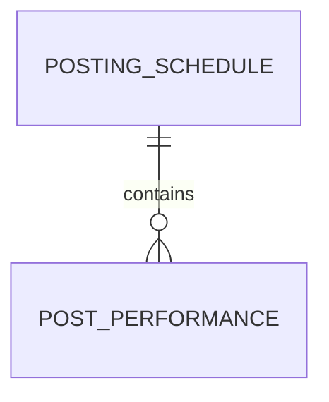
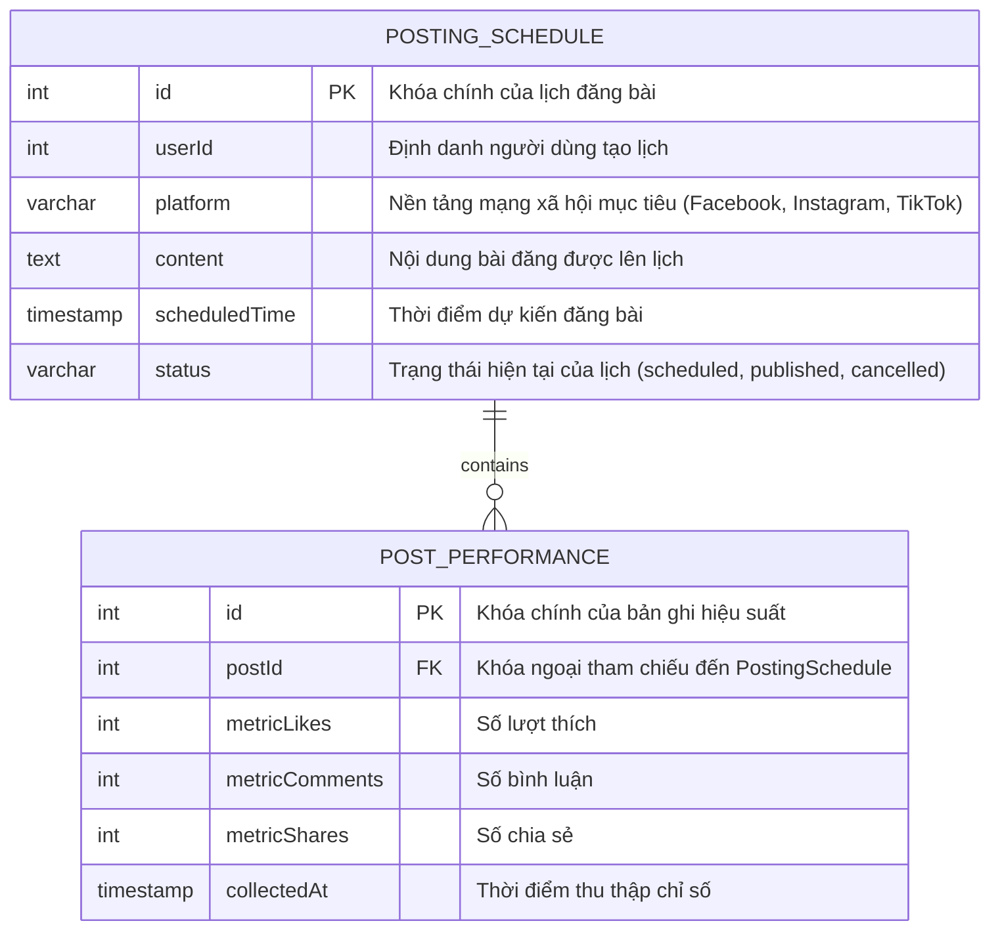
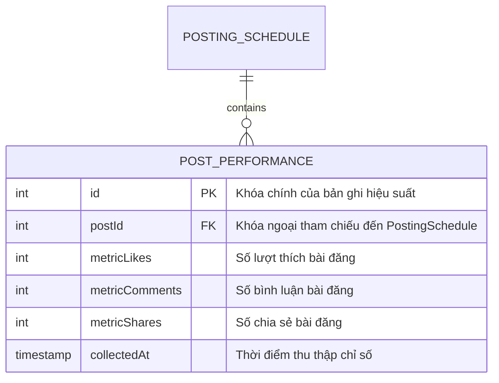

## 📊 Kiểm soát Tài liệu

| Mục | Chi tiết |
| :--- | :--- |
| Mã SRS | SRS-20260918151455 |
| Tên Dự án | social-scheduler |
| Phiên bản | 1.0 — Bản draft |
| Ngày Giờ | 2026/09/18 15:14:55 |
| Tác giả | Principal Business Analyst (BA) / Product Strategist (BA Agent) |
| Phê duyệt | Chờ phê duyệt |

## 1. PROJECT OVERVIEW & GLOBAL ARCHITECTURE

### Mục tiêu sản phẩm & Giá trị cốt lõi
- Hệ thống **SocialScheduler** tự động hóa lịch đăng bài trên mạng xã hội cho doanh nghiệp nhỏ, tích hợp đề xuất nội dung được hỗ trợ bởi AI và xuất bản đa nền tảng (Facebook, Instagram, TikTok) mà không cần kỹ năng chuyên môn.

### Đối tượng mục tiêu
- Chủ doanh nghiệp nhỏ
- Quản lý tiếp thị
- Chuyên gia marketing tự do

### Bối cảnh kinh doanh
- Các doanh nghiệp nhỏ gặp khó khăn trong việc duy trì lịch đăng bài nhất quán do hạn chế về thời gian và nguồn lực.

### Phạm vi hệ thống
- Cung cấp API tích hợp lịch đăng bài tự động cho Facebook, Instagram, TikTok.
- Triển khai mô hình học máy để đề xuất nội dung bài đăng dựa trên hiệu suất trước đó.
- Thực hiện xác thực dữ liệu đầu vào và kiểm tra giới hạn tỷ lệ cho từng người dùng.
- Lưu trữ lịch đăng bài và đo lường hiệu suất bài đăng.

### Ma trận RBAC toàn cục

| Vai trò | Quyền hạn |
| :--- | :--- |
| **Admin** | Tạo người dùng, quản lý nền tảng, xem tất cả lịch và báo cáo hiệu suất. |
| **User** | Tạo/sửa/xóa lịch của riêng mình, xem đề xuất nội dung, xem hiệu suất bài đăng của mình. |

### Ràng buộc kiến trúc
- **[ARC-001]** Tất cả các tích hợp nền tảng bên thứ ba phải sử dụng **OAuth 2.0** để xác thực và ủy quyền.

### Bối cảnh công nghệ (dẫn xuất)
- Backend sử dụng **RESTful API** với **Node.js / Express** (hoặc công nghệ tương đương được hỗ trợ bởi nguồn).
- Cơ sở dữ liệu quan hệ **PostgreSQL** để lưu trữ lịch và hiệu suất.
- Mô hình học máy (ví dụ: scikit‑learn hoặc TensorFlow) để đề xuất nội dung.
- OAuth 2.0 provider cho Facebook, Instagram, TikTok.
- Dịch vụ hàng đợi (ví dụ: Redis‑based) để quản lý công việc đăng bài theo lịch.

### Yêu cầu cơ sở hạ tầng (dẫn xuất)
- Máy chủ ứng dụng, PostgreSQL, bộ nhớ đệm, dịch vụ ML, OAuth client cho mỗi nền tảng.

### Yêu cầu tích hợp
- Tích hợp với **Facebook Graph API**, **Instagram Basic Display API**, **TikTok Open Platform API**.

## 2. ENHANCED EPIC MODULES

### Module 1: Tích hợp Lịch đăng bài Đa nền tảng

#### Yêu cầu chức năng chính

- **[REQ-001]** Tích hợp API lịch đăng bài tự động cho Facebook, Instagram và TikTok.
  - **User Story**: As a small business owner, I want the system to automatically schedule posts to Facebook, Instagram, and TikTok, so that I can maintain a consistent social media presence without manual effort.

#### Tiêu chí chấp nhận & Tương tác

- **AC-001**: Given I have created a scheduled post targeting Facebook, when I submit the schedule, then the system creates a pending job in the internal queue and invokes the Facebook Graph API to publish the post at the scheduled time.
- **AC-002**: Given the Facebook Graph API returns an error (e.g., invalid token), when the system receives the error, then it logs the error with details and retries the post up to three times using exponential backoff.
- **AC-003**: Given I have provided invalid authentication for TikTok (e.g., expired access token), when I attempt to schedule a post, then the system rejects the request with an HTTP 400 response and a descriptive error message.

#### Luồng ngoại lệ

- **[EXC-001]** – Xử lý lỗi từ API bên thứ ba: Khi một nền tảng trả về lỗi, hệ thống ghi lại lỗi (bao gồm mã lỗi, thông báo) và thử lại hoạt động bị lỗi tối đa ba lần với backoff theo cấp số nhân. Nếu tất cả lần thử đều thất bại, lịch được đánh dấu là “failed” và người dùng được thông báo qua giao diện người dùng.
- **[EXC-002]** – Xác thực quyền truy cập người dùng và xử lý trường hợp token hết hạn: Khi mã thông báo truy cập hết hạn, hệ thống phát hiện tình trạng này, khởi động quy trình OAuth lại cho người dùng, thu thập mã thông báo mới và tiếp tục lịch đang chờ xử lý. Nếu việc xác thực lại không thành công, lịch được chuyển sang trạng thái “awaiting authentication”.
- **[EXC-003]** – Bảo vệ chống lại việc spam lịch đăng bài và tấn công flood comment: Khi một người dùng vượt quá ngưỡng spam (ví dụ: >5 bài đăng trong 10 phút), hệ thống chặn các yêu cầu lên lịch tiếp theo trong 30 phút và trả về thông báo lỗi phù hợp.

#### Quy định dữ liệu mô-đun

- **Tier 1 Preliminary Data Dictionary**
  - **[DAT-001]** Bảng Lịch đăng bài
  - **[DAT-002]** Bảng Hiệu suất bài đăng

- **Tier 1 Global ER Diagram**

- **Tier 2 Entity Details**

##### PostingSchedule ([DAT-001]) – Ma trận thuộc tính

| Mã Thực thể/Bảng | Mã Trường | Tên Trường | Kiểu Dữ liệu | Cho phép NULL | Khóa | Giá trị mặc định | Ràng buộc | Mô tả nghiệp vụ |
| :--- | :--- | :--- | :--- | :--- | :--- | :--- | :--- | :--- |
| [DAT-001] |  | id | int | NOT NULL | PK |  |  | Khóa chính của lịch đăng bài |
| [DAT-001] |  | userId | int | NOT NULL |  |  |  | Định danh người dùng tạo lịch |
| [DAT-001] |  | platform | varchar | NOT NULL |  |  | Giá trị cho phép: Facebook, Instagram, TikTok | Nền tảng mạng xã hội mục tiêu |
| [DAT-001] |  | content | text | NOT NULL |  |  |  | Nội dung bài đăng được lên lịch |
| [DAT-001] |  | scheduledTime | timestamp | NOT NULL |  |  |  | Thời điểm dự kiến đăng bài |
| [DAT-001] |  | status | varchar | NOT NULL |  |  | Giá trị cho phép: scheduled, published, cancelled | Trạng thái hiện tại của lịch |

##### PostingSchedule ([DAT-001]) – Isolated ER Diagram

##### PostPerformance ([DAT-002]) – Ma trận thuộc tính

| Mã Thực thể/Bảng | Mã Trường | Tên Trường | Kiểu Dữ liệu | Cho phép NULL | Khóa | Giá trị mặc định | Ràng buộc | Mô tả nghiệp vụ |
| :--- | :--- | :--- | :--- | :--- | :--- | :--- | :--- | :--- |
| [DAT-002] |  | id | int | NOT NULL | PK |  |  | Khóa chính của bản ghi hiệu suất |
| [DAT-002] |  | postId | int | NOT NULL | FK |  | Tham chiếu đến PostingSchedule.id | Định danh lịch liên quan đến bài đăng |
| [DAT-002] |  | metricLikes | int | NOT NULL |  |  |  | Số lượt thích bài đăng |
| [DAT-002] |  | metricComments | int | NOT NULL |  |  |  | Số bình luận bài đăng |
| [DAT-002] |  | metricShares | int | NOT NULL |  |  |  | Số chia sẻ bài đăng |
| [DAT-002] |  | collectedAt | timestamp | NOT NULL |  |  |  | Thời điểm thu thập chỉ số |

##### PostPerformance ([DAT-002]) – Isolated ER Diagram

### Module 2: Đề xuất Nội dung được hỗ trợ bởi AI

#### Yêu cầu chức năng chính

- **[REQ-002]** Triển khai mô hình học máy để đề xuất nội dung bài đăng dựa trên hiệu suất trước đó.
  - **User Story**: As a marketing manager, I want the system to recommend content ideas based on historical performance, so that I can choose posts that are likely to engage the audience.

#### Tiêu chí chấp nhận & Tương tác

- **AC-001**: Given I have historical post performance data, when I request content recommendations, then the system returns a ranked list of suggested content strings with predicted engagement scores.
- **AC-002**: Given a recommended post has a predicted engagement score below 0.3, when the user attempts to schedule it, then the system displays a warning that the predicted performance is low.
- **AC-003**: Given the ML model fails to generate recommendations, when the request is made, then the system falls back to a generic placeholder recommendation and logs the model failure.

#### Luồng ngoại lệ
- Không có luồng ngoại lệ cụ thể được định nghĩa trong nguồn cho yêu cầu này.

#### Quy định dữ liệu mô-đun
- Không có thực thể dữ liệu nào được yêu cầu trực tiếp cho mô-đun đề xuất AI.

### Module 3: Xác thực Dữ liệu Đầu vào và Kiểm soát Tốc độ

#### Yêu cầu chức năng chính

- **[REQ-003]** Thực hiện xác thực đầu vào dữ liệu và kiểm tra giới hạn tỷ lệ cho từng người dùng.
  - **User Story**: As a user, I want the system to validate input data and enforce rate limits, so that I cannot overload the platforms or submit malformed schedules.

#### Tiêu chí chấp nhận & Tương tác

- **AC-001**: Given I attempt to schedule a post with an invalid scheduled_time format, when the request is processed, then the system returns an HTTP 400 error with a message indicating the expected ISO‑8601 format.
- **AC-002**: Given I exceed the allowed rate of 10 schedule requests per minute, when I send another request, then the system throttles the request and returns HTTP 429 with a Retry-After header.
- **AC-003**: Given I provide a duplicate post content within the same hour, when the system validates the input, then it rejects the request with an HTTP 409 conflict and a message indicating duplicate content detection.

#### Luồng ngoại lệ

- **[EXC-002]** – Xác thực quyền truy cập người dùng và xử lý trường hợp token hết hạn: Mô tả tương tự như trong Module 1.
- **[EXC-003]** – Bảo vệ chống lại việc spam lịch đăng bài và tấn công flood comment: Mô tả tương tự như trong Module 1.

#### Quy định dữ liệu mô-đun
- Không có thực thể dữ liệu bổ sung ngoài các thực thể được định nghĩa trong Module 1.

## 3. GLOBAL NON-FUNCTIONAL REQUIREMENTS

- **[ARC-001]** – Ràng buộc kiến trúc: Tất cả các tích hợp nền tảng bên thứ ba phải sử dụng **OAuth 2.0** để xác thực và ủy quyền.

- **[NFR-001]** – Giới hạn tốc độ: Hệ thống phải thực thi các giới hạn tốc độ theo từng người dùng tuân thủ các giới hạn API của từng nền tảng (ví dụ: ≤5 bài đăng/phút cho Facebook) và trả về mã trạng thái HTTP phù hợp khi vượt quá giới hạn.

  **Acceptance Criteria**:
  - **AC-001**: Given a user attempts to schedule more than 5 posts per minute on Facebook, when the request is processed, then the system throttles the request and returns HTTP 429.
  - **AC-002**: Given the system receives a 429 response from Facebook, when it retries, then it respects the Retry-After header.

- **[NFR-002]** – Khả năng sẵn sàng: Dịch vụ lịch phải đạt ít nhất **99.5%** thời gian hoạt động trong một tháng, được đo lường từ các yêu cầu thành công.

  **Acceptance Criteria**:
  - **AC-001**: Given the service is monitored continuously, when a month ends, then the uptime metric is calculated and must be ≥99.5%.

- **[NFR-003]** – Mã hóa dữ liệu: Tất cả dữ liệu nhạy cảm (nội dung lịch, thông tin đăng nhập người dùng) phải được mã hóa **AES‑256** khi lưu trữ.

  **Acceptance Criteria**:
  - **AC-001**: Given a new schedule record is persisted, then the database stores the encrypted content and the encryption key is managed by the KMS.
  - **AC-002**: Given an authorized query is executed, then the system decrypts the data in memory for the duration of the request.

- **[REQ-004]** – Quản lý mã thông báo OAuth tự động: As a system administrator, I want the system to tự động thu thập, làm mới và lưu trữ an toàn các mã thông báo OAuth cho các nền tảng được kết nối, để người dùng luôn có thông tin xác thực hợp lệ để đăng bài.

  **Acceptance Criteria**:
  - **AC-001**: Given a platform connection is established, when the system detects an expiring access token, then it initiates the OAuth refresh flow and updates the token storage.
  - **AC-002**: Given token refresh fails, when the user attempts to schedule a post, then the system prompts the user to tái xác thực với nền tảng.

- **[EXC-004]** – Xử lý sự cố mạng: Khi xảy ra sự cố mạng trong khi giao tiếp với nền tảng bên thứ ba, hệ thống sẽ ghi lại sự cố, hàng đợi yêu cầu để thử lại sau (sau 5 phút) và thông báo cho người dùng qua email/cảnh báo.

  **Acceptance Criteria**:
  - **AC-001**: Given a network timeout occurs while calling a third‑party API, when the timeout is detected, then the system logs the event, enqueues the request for retry after 5 minutes, and sends a notification to the user.
  - **AC-002**: Given the retry succeeds, then the system resumes the original schedule and marks it as completed.

## TRACEABILITY COVERAGE LEDGER

| Source Tag ID | Generated Section or Module | Generated Traceability Tag(s) | Coverage Status |
| :--- | :--- | :--- | :--- |
| [REQ-001] | 2. Enhanced Epic Modules → Module 1: Tích hợp Lịch đăng bài Đa nền tảng → Core Functional Requirements | [REQ-001] | VERIFIED |
| [REQ-002] | 2. Enhanced Epic Modules → Module 2: Đề xuất Nội dung được hỗ trợ bởi AI → Core Functional Requirements | [REQ-002] | VERIFIED |
| [REQ-003] | 2. Enhanced Epic Modules → Module 3: Xác thực Dữ liệu Đầu vào và Kiểm soát Tốc độ → Core Functional Requirements | [REQ-003] | VERIFIED |
| [DAT-001] | 2. Enhanced Epic Modules → Module 1 → Data Specification → Tier 2 Entity Details → PostingSchedule | [DAT-001] | VERIFIED |
| [DAT-002] | 2. Enhanced Epic Modules → Module 1 → Data Specification → Tier 2 Entity Details → PostPerformance | [DAT-002] | VERIFIED |
| [EXC-001] | 2. Enhanced Epic Modules → Module 1 → Exception Flows | [EXC-001] | VERIFIED |
| [EXC-002] | 2. Enhanced Epic Modules → Module 3 → Exception Flows | [EXC-002] | VERIFIED |
| [EXC-003] | 2. Enhanced Epic Modules → Module 1 → Exception Flows | [EXC-003] | VERIFIED |

[EXECUTION_REMEDIATION_PAYLOAD_START]

{
  "technical_codename": "social-scheduler",
  "descriptive_name": "SocialScheduler",
  "brand_name": "LịchĐăngBài",
  "requirement_tags": [
    "[REQ-001]",
    "[REQ-002]",
    "[REQ-003]",
    "[DAT-001]",
    "[DAT-002]",
    "[EXC-001]",
    "[EXC-002]",
    "[EXC-003]",
    "[REQ-004]",
    "[ARC-001]",
    "[NFR-001]",
    "[NFR-002]",
    "[NFR-003]",
    "[EXC-004]"
  ]
}