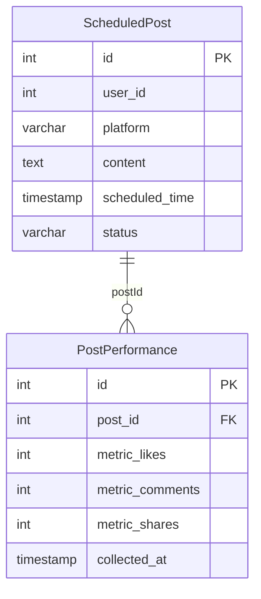

## 📊 Kiểm soát tài liệu

| Mục | Chi tiết |
| :--- | :--- |
| Mã SRS | SRS-20260926133131 |
| Tên Dự án | social-scheduler |
| Phiên bản | 1.0 (Nháp) |
| Ngày giờ | 2026/09/26 13:31:31 |
| Tác giả | Chuyên gia Phân tích Kinh doanh Chính (BA) / Chuyên gia Chiến lược Sản phẩm |
| Phê duyệt | Chờ duyệt |

# 1. TỔNG QUAN VỀ DỰ ÁN & KIẾN TRÚC TOÀN CỤC

## Mục tiêu sản phẩm & Giá trị cốt lõi
Hệ thống SocialScheduler tự động hóa lịch đăng bài trên mạng xã hội, đề xuất nội dung bằng AI và xuất bản đa nền tảng (Facebook, Instagram, TikTok) để giúp doanh nghiệp nhỏ duy trì sự hiện diện trực tuyến một cách nhất quán mà không cần kỹ năng chuyên môn.

## Người dùng mục tiêu
- Chủ doanh nghiệp nhỏ
- Quản lý tiếp thị
- Chuyên gia marketing tự do

## Ngữ cảnh kinh doanh
Các doanh nghiệp nhỏ gặp khó khăn trong việc duy trì lịch đăng bài trên mạng xã hội một cách nhất quán do hạn chế về thời gian và nguồn lực.

## Phạm vi hệ thống
- Tích hợp API tự động đăng bài cho Facebook, Instagram, TikTok
- Triển khai mô hình học máy để đề xuất nội dung dựa trên hiệu suất trước đó
- Xác thực đầu vào dữ liệu và kiểm tra giới hạn tỷ lệ cho từng người dùng
- Xử lý ngoại lệ khi API bên thứ ba trả về lỗi
- Xác thực quyền truy cập người dùng và xử lý token hết hạn
- Bảo vệ chống lại spam lịch đăng bài và tấn công flood comment
- Lưu trữ lịch đăng bài và hiệu suất bài đăng

## Ngữ cảnh công nghệ
- API mạng xã hội: Facebook Graph API, Instagram Basic Display API, TikTok Marketing API
- Mô hình học máy: Phân tích lịch sử tương tác để tạo đề xuất nội dung
- Cơ sở dữ liệu: Lưu trữ lịch đăng bài vàmetrics hiệu suất

## Yêu cầu tích hợp
- Tích hợp API đăng bài với Facebook, Instagram, TikTok
- Thu thập metrics tương tác (thích, bình luận, chia sẻ) từ các nền tảng

# 2. MODULE NÂNG CẤP

## MODULE 1: XUẤT BẢN MẠNG XÃ HỘI

### Yêu cầu chức năng cốt lõi

#### [REQ-001] Tích hợp API lịch đăng bài tự động cho Facebook, Instagram và TikTok
**Mô tả:** Hệ thống cho phép người dùng kết nối tài khoản mạng xã hội và lên lịch đăng bài tự động trên các nền tảng được hỗ trợ.

**Tiêu chí chấp nhận:**
- **Cho** người dùng đã kết nối tài khoản Facebook  
  **Khi** người dùng tạo một bài đăng và lên lịch cho thời gian tương lai  
  **Thì** hệ thống sẽ đăng bài đó trên Facebook vào thời gian đã lên lịch.
- **Cho** người dùng đã kết nối tài khoản Instagram  
  **Khi** người dùng tạo một bài đăng và lên lịch cho thời gian tương lai  
  **Thì** hệ thống sẽ đăng bài đó trên Instagram vào thời gian đã lên lịch.
- **Cho** người dùng đã kết nối tài khoản TikTok  
  **Khi** người dùng tạo một bài đăng và lên lịch cho thời gian tương lai  
  **Thì** hệ thống sẽ đăng bài đó trên TikTok vào thời gian đã lên lịch.

#### [REQ-003] Thực hiện xác thực đầu vào dữ liệu và kiểm tra giới hạn tỷ lệ cho từng người dùng
**Mô tả:** Hệ thống xác thực dữ liệu đầu vào và áp dụng giới hạn tỷ lệ API để ngăn chặn việc lạm dụng và đảm bảo ổn định dịch vụ.

**Tiêu chí chấp nhận:**
- **Cho** nội dung bài đăng vượt quá độ dài cho phép (ví dụ: Facebook > 2000 ký tự)  
  **Khi** người dùngAttempting to schedule the post  
  **Thì** hệ thống sẽ từ chối yêu cầu và trả về lỗi xác thực: "Nội dung vượt quá giới hạn cho phép".
- **Cho** thời gian đăng bài không hợp lệ (ví dụ: định dạng timestamp sai, thời gian trong quá khứ)  
  **Khi** người dùngAttempting to schedule the post  
  **Thì** hệ thống sẽ từ chối yêu cầu và trả về lỗi xác thực: "Thời gian đăng bài không hợp lệ".
- **Cho** người dùng gửi yêu cầu đăng bài quá częста (ví dụ: >10 bài/phút)  
  **Khi** người dùng vượt quá giới hạn tốc độ  
  **Thì** hệ thống sẽ từ chối yêu cầu và trả về lỗi: "Vượt quá giới hạn tốc độ. Vui lòng thử lại sau."

### Luồng ngoại lệ trong module

#### [EXC-001] Xử lý ngoại lệ khi API bên thứ ba trả về lỗi; ghi lại và thử lại sau
**Mô tả:** Khi API mạng xã hội trả về lỗi tạm thời (ví dụ: 5xx, timeout), hệ thống ghi lại lỗi và thực hiện lại việc đăng bài sau khoảng thời gian backoff tăng dần.

#### [EXC-002] Xác thực quyền truy cập người dùng và xử lý trường hợp token hết hạn
**Mô tả:** Hệ thống kiểm tra sự hợp lệ của token truy cập trước mỗi yêu cầu API và tự động làm mới token sử dụng refresh token khi phát hiện token hết hạn.

#### [EXC-003] Bảo vệ chống lại việc spam lịch đăng bài và tấn công flood comment
**Mô tả:** Hệ thống áp dụng giới hạn tốc độ dựa trên địa chỉ IP và danh sách từ khóa spam để phát hiện và chặn các hành為 đăng bài tự động lặp lại hoặc bình luận spam.

### Thông số dữ liệu trong module
Module này sử dụng thực thể **[DAT-001]** để lưu trữ lịch đăng bài. Chi tiết cấu trúc dữ liệu được nêu trong phần [Thông số dữ liệu](#3-qu%E1%BA%A3n-l%C3%BD-d%E1%BB%BJu-li%E1%BB%87t).

---

## MODULE 2: THÔNG MINH NỘI DUNG

### Yêu cầu chức năng cốt lõi

#### [REQ-002] Triển khai mô hình học máy để đề xuất nội dung bài đăng dựa trên hiệu suất trước đó
**Mô tả:** Hệ thống phân tích hiệu suất bài đăng trước đó (thích, bình luận, chia sẻ) để tạo ra đề xuất nội dung tối ưu cho từng nền tảng và đối tượng người dùng.

**Tiêu chí chấp nhận:**
- **Cho** người dùng có ít nhất 10 bài đăng đã được đăng  
  **Khi** người dùng yêu cầu đề xuất nội dung cho nền tảng cụ thể  
  **Thì** hệ thống sẽ提出 đề xuất nội dung dựa trên xu hướng tương tác cao nhất từ lịch sử đăng bài của người dùng trên nền tảng đó.
- **Cho** người dùng chưa có đủ dữ liệu hiệu suất (<10 bài đăng)  
  **Khi** người dùng yêu cầu đề xuất nội dung  
  **Thì** hệ thống sẽ sử dụng mẫu nội dung mặc định dựa trên ngành nghề và xu hướng chung của nền tảng.
- **Cho** đề xuất nội dung được tạo  
  **Khi** người dùng xem đề xuất  
  **Thì** nội dung sẽ bao gồm: gợi ý tiêu đề, nội dung chính, và hashtags phù hợp với nền tảng mục tiêu.

### Luồng ngoại lệ trong module
*Không có yêu cầu ngoại lệ cụ thể cho module này trong nguồn tài nguyên. Các lỗi chung liên quan đến xử lý dữ liệu và mô hình sẽ được xử lý qua cơ chế xử lý ngoại lệ tổng quát.*

### Thông số dữ liệu trong module
Module này sử dụng thực thể **[DAT-002]** để lưu trữ metrics hiệu suất bài đăng. Chi tiết cấu trúc dữ liệu được nêu trong phần [Thông số dữ liệu](#3-qu%E1%BA%A3n-l%C3%BD-d%E1%BB%BJu-li%E1%BB%87t).

---

## MODULE 3: QUẢN LÝ DỮ LIỆU

### Thông số dữ liệu trong module
Module này xác định các thực thể dữ liệu cốt lõi cần thiết để hỗ trợ các chức năng xuất bản và đề xuất nội dung.

#### [DAT-001] Bảng lưu trữ lịch đăng bài
| Thuộc tính | Kiểu dữ liệu | Cho null | Khóa | Mặc định | Ràng buộc | Mô tả nghiệp vụ |
| :--- | :--- | :--- | :--- | :--- | :--- | :--- |
| id | int | NOT NULL | PK |  | AUTO_INCREMENT | Mã định danh duy nhất của bản ghi lịch đăng bài |
| user_id | int | NOT NULL |  |  |  | Mã định danh người dùng sở hữu lịch đăng bài (liên kết với bảng người dùng) |
| platform | varchar | NOT NULL |  |  | IN ('facebook', 'instagram', 'tiktok') | Nền tảng mạng xã hội đích để đăng bài |
| content | text | NOT NULL |  |  |  | Nội dung bài đăng sẽ được xuất bản |
| scheduled_time | timestamp | NOT NULL |  |  |  | Thời gian được lên lịch để xuất bản bài đăng |
| status | varchar | NOT NULL |  | 'scheduled' | IN ('scheduled', 'published', 'failed', 'cancelled') | Trạng thái hiện tại của lịch đăng bài |

#### [DAT-002] Bảng hiệu suất bài đăng
| Thuộc tính | Kiểu dữ liệu | Cho null | Khóa | Mặc định | Ràng buộc | Mô tả nghiệp vụ |
| :--- | :--- | :--- | :--- | :--- | :--- | :--- |
| id | int | NOT NULL | PK |  | AUTO_INCREMENT | Mã định danh duy nhất của bản ghi hiệu suất |
| post_id | int | NOT NULL | FK |  |  | Liên kết đến bản ghi lịch đăng bài trong [DAT-001] |
| metric_likes | int | NOT NULL |  |  | >= 0 | Số lượng tương tác "thích" trên bài đăng |
| metric_comments | int | NOT NULL |  |  | >= 0 | Số lượng bình luận trên bài đăng |
| metric_shares | int | NOT NULL |  |  | >= 0 | Số lượng chia sẻ trên bài đăng |
| collected_at | timestamp | NOT NULL |  | CURRENT_TIMESTAMP |  | Thời điểm metrics được thu thập từ API mạng xã hội |

### Biểu đồ ER toàn cầu (Tier 1)

```mermaid
erDiagram
    ScheduledPost ||--o{ PostPerformance : "postId"
    ScheduledPost {
        int id PK
        int user_id
        varchar platform
        text content
        timestamp scheduled_time
        varchar status
    }
    PostPerformance {
        int id PK
        int post_id FK
        int metric_likes
        int metric_comments
        int metric_shares
        timestamp collected_at
    }
```

### Biểu đồ ER cô lập cho thực thể ScheduledPost (Tier 2)

```mermaid
erDiagram
    ScheduledPost ||--o{ PostPerformance : "postId"
    ScheduledPost {
        int id PK
        int user_id
        varchar platform
        text content
        timestamp scheduled_time
        varchar status
    }
    PostPerformance {
        int id PK
        int post_id FK
        int metric_likes
        int metric_comments
        int metric_shares
        timestamp collected_at
    }
```

### Biểu đồ ER cô lập cho thực thể PostPerformance (Tier 2)

```mermaid
erDiagram
    ScheduledPost ||--o{ PostPerformance : "postId"
    ScheduledPost {
        int id PK
        int user_id
        varchar platform
        text content
        timestamp scheduled_time
        varchar status
    }
    PostPerformance {
        int id PK
        int post_id FK
        int metric_likes
        int metric_comments
        int metric_shares
        timestamp collected_at
    }
```

# 3. YÊU CẦN PHI HIỆU TOÀN CỤC

*Không có yêu cầu phi hiệu uy rõ ràng được nêu trong nguồn tài nguyên. Các yếu tố như hiệu suất và bảo mật được xử lý thông qua các yêu cầu cụ thể như [REQ-003] (giới hạn tỷ lệ) và [EXC-001]-[EXC-003] (xử lý lỗi và bảo vệ).*

# BẢO ĐỘNG PHỤC VỤ TRACEABILITY

| Mã nguồn | Phần/Module được tạo | Mã traceability được tạo | Trạng thái bao phủ |
| :--- | :--- | :--- | :--- |
| [REQ-001] | Module 1: Xuất bản mạng xã hội | [REQ-001] | XÁC NHẬN |
| [REQ-002] | Module 2: Thông minh nội dung | [REQ-002] | XÁC NHẬN |
| [REQ-003] | Module 1: Xuất bản mạng xã hội | [REQ-003] | XÁC NHẬN |
| [DAT-001] | Module 3: Quản lý dữ liệu | [DAT-001] | XÁC NHẬN |
| [DAT-002] | Module 3: Quản lý dữ liệu | [DAT-002] | XÁC NHẬN |
| [EXC-001] | Module 1: Xuất bản mạng xã hội | [EXC-001] | XÁC NHẬN |
| [EXC-002] | Module 1: Xuất bản mạng xã hội | [EXC-002] | XÁC NHẬN |
| [EXC-003] | Module 1: Xuất bản mạng xã hội | [EXC-003] | XÁC NHẬN |

<COMPACT_SRS_START>
PROJECT
codename=social-scheduler

REQ
id=[REQ-001]
statement=Tích hợp API lịch đăng bài tự động cho Facebook, Instagram và TikTok.
actors=Người dùng cuối
behavior=Kết nối tài khoản mạng xã hội, tạo và lên lịch đăng bài tự động trên các nền tảng được hỗ trợ.
constraints=Phải hỗ trợ ít nhất ba nền tảng: Facebook, Instagram, TikTok.
derived=false

REQ
id=[REQ-002]
statement=Triển khai mô hình học máy để đề xuất nội dung bài đăng dựa trên hiệu suất trước đó.
actors=Người dùng cuối
behavior=Phân tích lịch sử tương tác để tạo đề xuất nội dung tối ưu cho từng nền tảng.
constraints=Đề xuất phải dựa trên dữ liệu hiệu suất thực tế và phù hợp với định dạng nội dung của mỗi nền tảng.
derived=false

REQ
id=[REQ-003]
statement=Thực hiện xác thực đầu vào dữ liệu và kiểm tra giới hạn tỷ lệ cho từng người dùng.
actors=Người dùng cuối
behavior=Xác thực độ dài nội dung, định dạng thời gian, và áp dụng giới hạn tốc度 API mỗi người dùng.
constraints=Giới hạn tỷ lệ phải có thể cấu hình và áp dụng riêng biệt cho mỗi người dùng và nền tảng.
derived=false

EXC
id=[EXC-001]
parent=[REQ-001]
statement=Xử lý ngoại lệ khi API bên thứ ba trả về lỗi; ghi lại và thử lại sau.
derived=false

EXC
id=[EXC-002]
parent=[REQ-001]
statement=Xác thực quyền truy cập người dùng và xử lý trường hợp token hết hạn.
derived=false

EXC
id=[EXC-003]
parent=[REQ-001]
statement=Bảo vệ chống lại việc spam lịch đăng bài và tấn công flood comment.
derived=false

DAT
id=[DAT-001]
entity=ScheduledPost
fields=id:int PK NOT NULL AUTO_INCREMENT; user_id:int NOT NULL; platform:varchar NOT NULL; content:text NOT NULL; scheduled_time:timestamp NOT NULL; status:varchar NOT NULL DEFAULT 'scheduled'
relationships=post_id->ScheduledPost.id (1:N)
constraints=platform IN ('facebook','instagram','tiktok'); status IN ('scheduled','published','failed','cancelled')

DAT
id=[DAT-002]
entity=PostPerformance
fields=id:int PK NOT NULL AUTO_INCREMENT; post_id:int NOT NULL FK; metric_likes:int NOT NULL DEFAULT 0; metric_comments:int NOT NULL DEFAULT 0; metric_shares:int NOT NULL DEFAULT 0; collected_at:timestamp NOT NULL DEFAULT CURRENT_TIMESTAMP
relationships=post_id->ScheduledPost.id (N:1)
constraints=metric_likes >= 0; metric_comments >= 0; metric_shares >= 0

DEP
from=[REQ-001]
to=[DAT-001]

DEP
from=[REQ-002]
to=[DAT-002]

DEP
from=[REQ-003]
to=[DAT-001]

TRACE
[REQ-001]=Module 1: Core Functional Requirements
[REQ-002]=Module 2: Core Functional Requirements
[REQ-003]=Module 1: Core Functional Requirements
[DAT-001]=Module 3: Data Specification
[DAT-002]=Module 3: Data Specification
[EXC-001]=Module 1: Exception Flows
[EXC-002]=Module 1: Exception Flows
[EXC-003]=Module 1: Exception Flows
<COMPACT_SRS_END>
[EXECUTION_REMEDIATION_PAYLOAD_START]
{"technical_codename":"social-scheduler","descriptive_name":"LịchĐăngBài","brand_name":"LịchĐăngBài","requirement_tags":["[REQ-001]","[REQ-002]","[REQ-003]","[DAT-001]","[DAT-002]","[EXC-001]","[EXC-002]","[EXC-003]"]}