# PHIẾU YÊU CẦU PHẦN MỀM: hub-thành-viên

## 📊 QUẢN LÝ TÀI LIỆU

| Mục | Chi tiết |
| :--- | :--- |
| **ID SRS** | SRS-20260913135853 |
| **Tên dự án** | hub-thành-viên |
| **Phiên bản** | 1.0 (Cơ sở) |
| **Ngày giờ** | 2026/09/13 13:58:53 |
| **Tác giả** | Trình phân tích nghiệp vụ chính (BA) / Chiến lược gia sản phẩm (BA Agent) |
| **Phê duyệt** | Đang chờ xem xét quản trị kỹ thuật |

## 1. TỔNG QUAN DỰ ÁN & KIẾN TRÚC TOÀN CẦU

### 1.1 Mục tiêu sản phẩm & Giá trị cốt lõi

- Cung cấp nền tảng thống nhất cho quản lý thành viên đa trung tâm.
- Cho phép theo dõi tham gia thực tế qua quét mã QR.
- Cung cấp thẻ thành viên kỹ thuật số với tính hợp lệ đếm.
- Hỗ trợ giao tiếp đa kênh (web, mobile, nhóm Zalo).
- Giá trị cốt lõi: độ tin cậy, khả năng mở rộng, bảo mật, thân thiện với người dùng, hỗ trợ đa ngôn ngữ.

### 1.2 Người dùng mục tiêu

- Quản trị viên hệ thống (siêu người dùng toàn cầu)
- Quản trị viên trung tâm (quản lý cấp trung tâm)
- Quản lý (cấp dưới, quyền hạn hạn chế)
- Giáo viên (xem lịch trình khóa học chỉ đọc)
- Học viên (duyệt khóa học, đăng ký, xem thẻ thành viên)
- Người dùng ứng dụng di động (các vai trò tương tự, giao diện đáp ứng)

### 1.3 Ma trận kiểm soát quyền hạn dựa trên vai trò (RBAC)

- [ARC-001] Quản trị viên hệ thống: quyền hạn đầy đủ trên tất cả các trung tâm.
- [ARC-002] Quản trị viên trung tâm: quyền hạn đầy đủ trong trung tâm riêng, không thể ảnh hưởng đến các trung tâm khác.
- [ARC-003] Quản lý: có thể tạo thông báo, quản lý học viên, gán học viên hiện có vào khóa học, xem danh sách khóa học, không thể chỉnh sửa khóa học hoặc gán giáo viên.
- [ARC-004] Giáo viên: xem các khóa học của mình, danh sách học viên, lịch trình; chỉ đọc.
- [ARC-005] Học viên: duyệt khóa học, đăng ký khóa học mới, xem thẻ thành viên của mình (số ngày còn lại), gia hạn ngày thẻ.

### 1.4 Kiến trúc & Lưu lượng dữ liệu (luồng chính)

- [ARC-006] Luồng xác thực: hỗ trợ email/mật khẩu, Firebase, Google, Facebook qua OAuth2; cấp token JWT với thời gian hết hạn 15 phút và token làm mới.
- [ARC-007] Luồng xử lý QR tham gia: ứng dụng di động quét QR, gửi ID học viên và dấu thời gian đến backend; dịch vụ xác thực và ghi lại tham gia một cách idempotent.
- [ARC-008] Luồng giao hàng thông báo: hệ thống kích hoạt thông báo đẩy đến ứng dụng di động và đăng bài lên nhóm Zalo chỉ định cho thông báo, gán giáo viên vào khóa học, và cảnh báo tham gia.
- [ARC-009] Luồng tích hợp backend ứng dụng di động: frontend Next.js tiêu thụ API REST; xác thực qua token bearer; hỗ trợ bộ đệm ngoại tuyến cho kết nối hạn chế.

## 2. CÁC MODULE CHÍNH (LẶP LẠI ĐỐI VỚI MỖI MODULE/HÌNH MẪU CHÍNH ĐƯỢC PHÁT HIỆN TRONG ĐẦU VÀO NGUYÊN THUY)

Đối với MỖI module/hình mẫu logic được phát hiện, bạn PHẢI cung cấp một phần riêng biệt chứa:

- **Yêu cầu chức năng cốt lõi**: [REQ-XXX] Tên tính năng và câu chuyện người dùng của nó.
- **Tiêu chí chấp nhận & Tương tác**: Gherkin chi tiết (Given/When/Then) ánh xạ đến [REQ-XXX] cha mẹ.
- **Luồng ngoại lệ của module**: [EXC-XXX] Các trường hợp biên nghiệp vụ, giới hạn tỷ lệ, lỗi xác thực và luồng thất bại trạng thái máy cho module này.
- **Từ điển dữ liệu cục bộ của module**: [DAT-XXX] Các bảng cơ sở dữ liệu cần thiết cho module này, chi tiết Tên trường, Loại dữ liệu chính xác, Ràng buộc và Mô tả nghiệp vụ.

### 2.1 Quản lý người dùng

- **[REQ-001] Đăng ký người dùng**: Là một người dùng tiềm năng, tôi muốn đăng ký bằng email và mật khẩu (hoặc nhà cung cấp xã hội) để tôi có thể có tài khoản trong hệ thống.
  - **Tiêu chí chấp nhận**:
    - Cho một người dùng cung cấp một email duy nhất, mật khẩu mạnh và đồng ý với điều khoản, Khi họ gửi biểu mẫu đăng ký, Thì hệ thống xác thực đầu vào, tạo một bản ghi người dùng mới với vai trò 'Học viên' (hoặc 'Giáo viên' nếu được mời), và trả về một phản hồi thành công với một token JWT. *[REQ-001]*
  - **Đầu vào dữ liệu & Xác thực trường**:
    - Email: bắt buộc, tối đa 255 ký tự, phải chứa một '@' duy nhất và một phần miền (ví dụ: user@example.com). Phải là duy nhất.
    - Mật khẩu: bắt buộc, tối thiểu 8 ký tự, ít nhất một chữ hoa, một chữ thường, một chữ số, một ký tự đặc biệt.
    - Điều khoản: hộp kiểm bắt buộc.
- **[REQ-002] Xác thực xã hội**: Là một người dùng, tôi muốn đăng nhập/đăng ký bằng Firebase, Google hoặc Facebook OAuth để tôi có thể tận dụng các thông tin đăng nhập hiện có.
  - **Tiêu chí chấp nhận**:
    - Cho một người dùng chọn một nhà cung cấp xã hội, Khi họ xác thực thông qua cửa sổ bật lên của nhà cung cấp, Thì hệ thống nhận một mã OAuth2, trao đổi nó cho thông tin người dùng, tạo hoặc cập nhật bản ghi người dùng cục bộ, và cấp một token JWT. *[REQ-002]*
  - **Đầu vào dữ liệu & Xác thực trường**: token nhà cung cấp, ảnh hồ sơ tùy chọn.
- **[REQ-003] Gán vai trò người dùng**: Là một quản trị viên, tôi muốn gán hoặc thay đổi vai trò của người dùng (Quản trị viên hệ thống, Quản trị viên trung tâm, Quản lý, Giáo viên, Học viên) để quyền hạn được áp dụng đúng cách.
  - **Tiêu chí chấp nhận**:
    - Cho một quản trị viên chọn một người dùng và một vai trò mới, Khi việc gán được xác nhận, Thì cột vai trò của người dùng được cập nhật, và các quyền hạn thích hợp được áp dụng ngay lập tức. *[REQ-003]*
  - **Đầu vào dữ liệu & Xác thực trường**: dropdown vai trò, bản ghi nhật ký kiểm toán bắt buộc.

### 2.2 Quản lý trung tâm

- **[REQ-004] Xem danh sách trung tâm**: Là bất kỳ người dùng đã xác thực, tôi muốn xem danh sách tất cả các trung tâm với địa chỉ, mã số thuế và liên hệ quản trị viên để tôi có thể xác định các trung tâm liên quan.
  - **Tiêu chí chấp nhận**:
    - Cho một người dùng điều hướng đến trang Trung tâm, Khi yêu cầu hoàn thành, Thì một bảng các trung tâm (Tên, Địa chỉ, Mã số thuế, Liên hệ quản trị viên) được hiển thị. *[REQ-004]*
  - **Đầu vào dữ liệu & Xác thực trường**: Không có (chỉ đọc).
- **[REQ-005] Tạo/Chỉnh sửa/Xóa trung tâm**: Là một Quản trị viên hệ thống, tôi muốn thêm, chỉnh sửa hoặc xóa một bản ghi trung tâm để thông tin trung tâm luôn được cập nhật.
  - **Tiêu chí chấp nhận**:
    - Cho một Quản trị viên hệ thống cung cấp tên trung tâm, địa chỉ, mã số thuế, điện thoại liên hệ chính và email, Khi hành động lưu được thực hiện, Thì trung tâm được lưu trữ và xuất hiện trong danh sách; nếu mã số thuế trùng lặp tồn tại, hoạt động thất bại với lỗi xung đột. *[REQ-005]*
  - **Đầu vào dữ liệu & Xác thực trường**:
    - Tên: bắt buộc, tối đa 100 ký tự.
    - Địa chỉ: bắt buộc, tối đa 255 ký tự.
    - Mã số thuế: bắt buộc, số, 10-13 chữ số, duy nhất.
    - Điện thoại liên hệ: tùy chọn, có thể bao gồm +, chữ số, khoảng trắng, dấu gạch ngang, dấu ngoặc.
    - Email liên hệ: tùy chọn, phải ở định dạng email hợp lệ.
- **[REQ-006] Gán quản trị viên trung tâm**: Là một Quản trị viên hệ thống, tôi muốn gán hoặc hủy gán người dùng làm Quản trị viên trung tâm cho một trung tâm cụ thể để quyền kiểm soát quản trị được ủy quyền.
  - **Tiêu chí chấp nhận**:
    - Cho một Quản trị viên hệ thống chọn một người dùng và một trung tâm, Khi hành động gán được xác nhận, Thì vai trò của người dùng được đặt thành 'Quản trị viên trung tâm' và ID trung tâm được ghi lại; hủy gán đảo ngược hoạt động này. *[REQ-006]*
  - **Đầu vào dữ liệu & Xác thực trường**: ID người dùng, ID trung tâm.

### 2.3 Quản lý khóa học

- **[REQ-007] Xem danh sách khóa học**: Là bất kỳ người dùng đã xác thực, tôi muốn xem tất cả các khóa học với lịch trình và giáo viên được chỉ định để tôi có thể duyệt các khóa học đang cung cấp.
  - **Tiêu chí chấp nhận**:
    - Cho một người dùng truy cập trang Khóa học, Khi yêu cầu hoàn thành, Thì một lưới hiển thị CourseID, Tiêu đề, Ngày bắt đầu, Ngày kết thúc, Tên giáo viên. *[REQ-007]*
  - **Đầu vào dữ liệu & Xác thực trường**: Không có.
- **[REQ-008] Tạo/Chỉnh sửa/Xóa khóa học (Tránh xung đột)**: Là một Quản trị viên hệ thống hoặc Quản trị viên trung tâm, tôi muốn quản lý các khóa học (thêm, chỉnh sửa, xóa) trong khi đảm bảo không có lịch trình trùng lặp cho cùng một giáo viên hoặc địa điểm.
  - **Tiêu chí chấp nhận**:
    - Cho một quản trị viên cung cấp Tiêu đề khóa học, Ngày bắt đầu, Ngày kết thúc, ID giáo viên, Khi hành động lưu được kích hoạt, Thì hệ thống xác thực rằng giáo viên chưa được lên lịch cho khóa học khác trong khoảng thời gian này; nếu xung đột, một lỗi được trả về; nếu không, khóa học được lưu trữ. *[REQ-008]*
  - **Đầu vào dữ liệu & Xác thực trường**:
    - Tiêu đề: bắt buộc, tối đa 150 ký tự.
    - Ngày bắt đầu/Ngày kết thúc: bắt buộc, Ngày kết thúc >= Ngày bắt đầu.
    - ID giáo viên: bắt buộc, khóa ngoại.
    - Kiểm tra xung đột được thực hiện ở cấp cơ sở dữ liệu/trigger.
- **[REQ-009] Gán giáo viên vào khóa học**: Là một Quản trị viên hệ thống, tôi muốn gán hoặc hủy gán giáo viên vào các khóa học để cập nhật trách nhiệm giảng dạy.
  - **Tiêu chí chấp nhận**:
    - Cho một quản trị viên chọn một khóa học và một giáo viên, Khi hành động gán được thực hiện, Thì bản đồ khóa học-giáo viên được tạo và một thông báo được xếp hàng chờ cho ứng dụng di động của giáo viên; hủy gán loại bỏ bản đồ này. *[REQ-009]*
  - **Đầu vào dữ liệu & Xác thực trường**: ID khóa học, ID giáo viên (phải tồn tại).

### 2.4 Đăng ký học viên & Đăng ký

- **[REQ-010] Duyệt khóa học**: Là một Học viên, tôi muốn duyệt các khóa học có sẵn (loại trừ những khóa học đã đăng ký) để tôi có thể chọn các khóa học để tham gia.
  - **Tiêu chí chấp nhận**:
    - Cho một Học viên đăng nhập và điều hướng đến trang Duyệt khóa học, Khi yêu cầu hoàn thành, Thì một danh sách các khóa học với dung lượng và lịch trình được hiển thị, loại trừ các khóa học mà học viên đã có bản ghi đăng ký. *[REQ-010]*
  - **Đầu vào dữ liệu & Xác thực trường**: Không có.
- **[REQ-011] Đăng ký khóa học của học viên**: Là một Học viên, tôi muốn đăng ký một khóa học (hiện có hoặc mới), tự động tạo tài khoản Học viên nếu thiếu, và gán học viên vào khóa học.
  - **Tiêu chí chấp nhận**:
    - Cho một Học viên chọn một khóa học và gửi đăng ký, Khi backend xử lý yêu cầu, Thì một bản ghi đăng ký mới được tạo; nếu học viên chưa có tài khoản cục bộ, một tài khoản được tạo với vai trò 'Học viên'; một thông báo được xếp hàng chờ cho ứng dụng di động của học viên và nhóm Zalo của trung tâm. *[REQ-011]*
  - **Đầu vào dữ liệu & Xác thực trường**:
    - ID khóa học: bắt buộc, phải là hoạt động.
    - ID học viên: được suy ra từ token xác thực (hoặc tạo tự động).

### 2.5 Tham gia & Quét QR

- **[REQ-012] Chụp tham gia QR**: Là một Học viên (qua ứng dụng di động), tôi muốn quét mã QR vào lúc bắt đầu lớp để tham gia của tôi được ghi lại cho ngày hiện tại.
  - **Tiêu chí chấp nhận**:
    - Cho một Học viên mở máy quét, quét một mã QR khóa học hợp lệ, và xác nhận tham gia, Khi API nhận được payload, Thì hệ thống xác thực mối quan hệ học viên-khóa học, tạo một bản ghi Tham gia với dấu thời gian, và trả về một phản hồi thành công; các lần quét trùng lặp trong cùng một ngày được bỏ qua. *[REQ-012]*
  - **Đầu vào dữ liệu & Xác thực trường**:
    - Payload QR: chuỗi base64 được mã hóa chứa ID học viên và ID khóa học.
    - Xác thực: học viên phải được đăng ký trong khóa học cho ngày đó.
- **[REQ-013] Idempotency của Tham gia**: Dịch vụ tham gia phải đảm bảo rằng nhiều lần quét từ cùng một học viên cho cùng một khóa học trong cùng một ngày tạo ra một bản ghi tham gia duy nhất.
  - **Tiêu chí chấp nhận**:
    - Cho một học viên quét một mã QR hai lần trong vòng một phút, Khi dịch vụ xử lý cả hai yêu cầu, Thì chỉ một hàng tham gia được tạo; các yêu cầu tiếp theo trả về một thành công với một cờ 'trùng lặp'. *[REQ-013]*
  - **Đầu vào dữ liệu & Xác thực trường**: Khóa hợp thành duy nhất (ID học viên, ID khóa học, Ngày).

### 2.6 Quản lý thẻ học viên

- **[REQ-014] Hiển thị tính hợp lệ của thẻ**: Là một Học viên, tôi muốn xem thẻ thành viên của mình hiển thị số ngày hợp lệ còn lại để tôi biết khi nào cần gia hạn.
  - **Tiêu chí chấp nhận**:
    - Cho một Học viên mở trang Thẻ, Khi yêu cầu tải, Thì giao diện hiển thị tổng số ngày hợp lệ, ngày đã sử dụng và ngày còn lại; dữ liệu được suy ra từ thực thể StudentCard. *[REQ-014]*
  - **Đầu vào dữ liệu & Xác thực trường**: Không có (chỉ đọc).
- **[REQ-015] Gia hạn thẻ**: Là một Học viên, tôi muốn gia hạn tính hợp lệ của thẻ thành viên bằng cách thanh toán phí, cập nhật ngày kết thúc.
  - **Tiêu chí chấp nhận**:
    - Cho một Học viên chọn một kỳ hạn gia hạn (ví dụ: 30 ngày), xác nhận thanh toán, Khi dịch vụ thanh toán xác nhận thành công, Thì Ngày kết thúc của StudentCard được gia hạn thêm số ngày đã chọn và một thông báo xác nhận được gửi. *[REQ-015]*
  - **Đầu vào dữ liệu & Xác thực trường**:
    - Ngày gia hạn: số nguyên, 1-365.
    - Yêu cầu tích hợp cổng thanh toán (ngoài phạm vi).

### 2.7 Thông báo & Giao tiếp

- **[REQ-016] Kích hoạt thông báo**: Khi một quản trị viên tạo một thông báo, gán một giáo viên vào một khóa học, hoặc đăng ký một học viên, hệ thống phải tạo một thông báo để ứng dụng di động của học viên và đăng một tin nhắn vào nhóm Zalo chỉ định.
  - **Tiêu chí chấp nhận**:
    - Cho một quản trị viên thực hiện một hành động yêu cầu thông báo, Khi hành động được lưu, Thì một bản ghi Thông báo được tạo, một payload thông báo đẩy được xếp hàng chờ cho ứng dụng di động, và một tin nhắn văn bản được gửi đến nhóm trò chuyện Zalo. *[REQ-016]*
  - **Đầu vào dữ liệu & Xác thực trường**: Đối tượng mục tiêu (học viên, giáo viên, nhóm), nội dung tin nhắn, phương tiện tùy chọn.

### 2.8 Quản lý khuyến mãi & Thông báo

- **[REQ-017] Quản lý khuyến mãi**: Là một Quản trị viên trung tâm hoặc Quản lý, tôi muốn tạo, chỉnh sửa hoặc xóa các khuyến mãi (giảm giá, ưu đãi) với ngày bắt đầu/ngày kết thúc để học viên có thể thấy các ưu đãi áp dụng.
  - **Tiêu chí chấp nhận**:
    - Cho một quản trị viên cung cấp Tên khuyến mãi, mô tả, điều kiện, ngày bắt đầu, ngày kết thúc, Khi lưu, Thì khuyến mãi xuất hiện trong danh sách hiển thị cho học viên; nếu ngày kết thúc bị bỏ qua, khuyến mãi được xem là vĩnh viễn. *[REQ-017]*
  - **Đầu vào dữ liệu & Xác thực trường**:
    - Tên: bắt buộc, tối đa 100 ký tự.
    - Ngày bắt đầu/Ngày kết thúc: tùy chọn, định dạng ngày YYYY-MM-DD.
    - Mô tả: tối đa 500 ký tự.
- **[REQ-018] Quản lý thông báo**: Là một Quản trị viên trung tâm hoặc Quản lý, tôi muốn tạo, chỉnh sửa hoặc xóa các thông báo với ngày hết hạn tùy chọn để phát sóng cho tất cả người dùng.
  - **Tiêu chí chấp nhận**:
    - Cho một quản trị viên nhập Tiêu đề thông báo, nội dung, ngày hết hạn tùy chọn, Khi lưu, Thì thông báo được hiển thị trên toàn trang web; nếu ngày hết hạn được đặt, nó tự động biến mất sau ngày đó. *[REQ-018]*
  - **Đầu vào dữ liệu & Xác thực trường**:
    - Tiêu đề: bắt buộc, tối đa 150 ký tự.
    - Nội dung: bắt buộc, tối đa 2000 ký tự.

### 2.9 Trợ lý khách hàng AI Chatbot

- **[REQ-019] Tích hợp Chatbot AI**: Là bất kỳ người dùng, tôi muốn tương tác với một chatbot AI có thể trả lời các truy vấn phổ biến về khóa học, giáo viên, trung tâm và trạng thái tài khoản.
  - **Tiêu chí chấp nhận**:
    - Cho một người dùng mở tiện ích chat, Khi họ hỏi một câu hỏi, Thì AI trả về một câu trả lời liên quan hoặc chuyển tiếp đến hỗ trợ người nếu độ tin cậy thấp. *[REQ-019]*
  - **Đầu vào dữ liệu & Xác thực trường**: Văn bản đầu vào, thời gian chờ phiên.

### 2.10 Tính năng lõi của Ứng dụng di động

- **[REQ-020] Giao diện người dùng cụ thể vai trò trên Ứng dụng di động**: Là một người dùng di động, tôi muốn một giao diện đáp ứng tương tự chức năng web cho vai trò của tôi (Học viên, Giáo viên, Quản trị viên, v.v.).
  - **Tiêu chí chấp nhận**:
    - Cho một người dùng đăng nhập trên Android hoặc iOS, Khi ứng dụng tải, Thì menu điều hướng và màn hình phù hợp được hiển thị dựa trên vai trò của người dùng. *[REQ-020]*
  - **Đầu vào dữ liệu & Xác thực trường**: Không có.
- **[REQ-021] Thông báo đẩy trên di động**: Là một người dùng đã đăng ký, tôi muốn nhận thông báo đẩy trên thiết bị di động của mình cho xác nhận tham gia, thông báo mới và tin nhắn nhắc nhở.
  - **Tiêu chí chấp nhận**:
    - Cho một sự kiện backend kích hoạt một thông báo đẩy, Khi token thiết bị được đăng ký, Thì thông báo được giao hàng thông qua Firebase Cloud Messaging (FCM) hoặc APNs. *[REQ-021]*
  - **Đầu vào dữ liệu & Xác thực trường**: Token thiết bị, Nền tảng (iOS/Android).

### 2.11 Bản địa hóa & SEO

- **[REQ-022] Phát hiện ngôn ngữ mặc định**: Là một khách truy cập, tôi muốn hệ thống sử dụng tùy chọn ngôn ngữ đã chọn trước đó của tôi, trở lại cài đặt trình duyệt, để có trải nghiệm cá nhân hóa.
  - **Tiêu chí chấp nhận**:
    - Cho một người dùng truy cập trang web, Khi hệ thống đánh giá ngôn ngữ, Thì nó chọn ngôn ngữ đã lưu nếu có; nếu không, nó sử dụng tiêu đề Accept-Language; giao diện được cập nhật theo đó. *[REQ-022]*
  - **Đầu vào dữ liệu & Xác thực trường**: Không có.
- **[REQ-023] SEO đa ngôn ngữ**: Nền tảng phải hỗ trợ SEO cho ít nhất tiếng Anh, tiếng Việt và tiếng Tây Ban Nha; mỗi trang phải bao gồm các thẻ meta và thuộc tính hreflang cụ thể ngôn ngữ.
  - **Tiêu chí chấp nhận**:
    - Cho một trang được yêu cầu với một ngôn ngữ cụ thể, Khi trang được hiển thị, Thì HTML bao gồm một thẻ <html lang='en'> và các liên kết hreflang trỏ đến các phiên bản ngôn ngữ thay thế. *[REQ-023]*
  - **Đầu vào dữ liệu & Xác thực trường**: Mã ngôn ngữ (en, vi, es).

### 2.12 Báo cáo & Phân tích

- **[REQ-024] Tạo báo cáo tham gia hàng ngày**: Là một quản trị viên, tôi muốn tạo báo cáo tham gia hàng ngày cho một trung tâm (CSV) hiển thị trạng thái tham gia của mỗi học viên.
  - **Tiêu chí chấp nhận**:
    - Cho một quản trị viên chọn một trung tâm và khoảng thời gian, Khi báo cáo được yêu cầu, Thì một tệp CSV được tạo với các cột: Tên học viên, Tên khóa học, Ngày tham gia, Trạng thái. *[REQ-024]*
  - **Đầu vào dữ liệu & Xác thực trường**:
    - Khoảng thời gian: bắt đầu ≤ kết thúc, tối đa 30 ngày.
- **[REQ-025] Bảng tổng quan đăng ký hàng ngày**: Là một Quản trị viên trung tâm, tôi muốn một bảng điều khiển thời gian thực tổng hợp tổng số học viên, các khóa học hoạt động và các buổi học sắp tới.
  - **Tiêu chí chấp nhận**:
    - Cho một quản trị viên mở bảng điều khiển, Khi dữ liệu làm mới, Thì các thẻ hiển thị tổng số học viên, các khóa học hoạt động, các buổi học sắp tới (7 ngày tới). *[REQ-025]*
  - **Đầu vào dữ liệu & Xác thực trường**: Khoảng thời gian làm mới có thể cấu hình (mặc định 15 phút).

## 3. LUỒNG NGOẠI LỆ & TRƯỜNG HỢP BIÊN

- **[EXC-001] Mất kết nối mạng & Kết nối trong quá trình quét QR**:
  - Nếu một học viên quét một mã QR nhưng mạng không khả dụng, Khi ứng dụng thử lại yêu cầu sau khi kết nối, Thì tham gia được ghi lại một khi dịch vụ có thể truy cập được.
- **[EXC-002] Gửi tham gia trùng lặp**:
  - Nếu cùng một học viên quét cùng một mã QR khóa học nhiều lần trong cùng một ngày, Khi hệ thống phát hiện trùng lặp, Thì nó trả về một phản hồi thành công chỉ ra 'đã ghi lại' và không tạo các hàng bổ sung.
- **[EXC-003] Giao hàng thông báo thất bại**:
  - Khi một thông báo đẩy không thể được giao (ví dụ: token thiết bị không hợp lệ), Thì hệ thống ghi lại thất bại và lên lịch thử lại lên đến ba lần trước khi đánh dấu là thất bại.
- **[EXC-004] Xác thực đầu vào không hợp lệ (ví dụ: email không hợp lệ, thiếu trường bắt buộc)**:
  - Nếu xác thực thất bại khi gửi biểu mẫu, Khi lỗi được trả về cho người dùng, Thì một thông báo rõ ràng liệt kê từng trường không hợp lệ và nhắc nhở sửa đổi.
- **[EXC-005] Khôi phục hệ thống sau sự cố**:
  - Nếu dịch vụ không khả dụng, Khi nó khôi phục, Thì bất kỳ các lần quét tham gia đang chờ xử lý đều được xử lý theo thứ tự FIFO, và người dùng nhận một thông báo về các sự kiện đã khôi phục.

## 4. YÊU CẦU KHÔNG CHỨC NĂNG

- **[NFR-001] Chỉ số hiệu suất**:
  - Các phản hồi API cốt lõi (xác thực, chụp tham gia, danh sách khóa học) phải hoàn thành trong thời gian trung bình 200 ms.
  - Các truy vấn cơ sở dữ liệu phải được lập chỉ mục để hỗ trợ đọc dưới 1 giây cho đến 10.000 người dùng đồng thời.
- **[NFR-002] Khả dụng**:
  - Mục tiêu 99.9% uptime hàng năm; SLA bao gồm tự động chuyển đổi tự động trên các cụm GKE.
- **[NFR-003] Bảo mật**:
  - Tất cả dữ liệu đang truyền phải sử dụng TLS 1.3; mã hóa tại nơi lưu trữ với AES-256.
  - Token truy cập JWT hết hạn sau 15 phút; token làm mới có thời gian hết hạn 7 ngày.
  - Triển khai các biện pháp chống Top 10 lỗ hổng OWASP (tiêm SQL, XSS, CSRF).
- **[NFR-004] Khả năng mở rộng & Khả dụng**:
  - Mở rộng ngang của dịch vụ Quarkus thông qua HPA Kubernetes dựa trên CPU > 70% hoặc độ trễ yêu cầu > 300 ms.
  - Replica đọc của PostgreSQL cho các tải công việc báo cáo.
- **[NFR-005] Kích thước hình ảnh Docker**:
  - Kích thước hình ảnh cơ sở < 200 MB; hình ảnh cuối cùng < 500 MB.
- **[NFR-006] Nhật ký & Kiểm toán**:
  - Tất cả các hành động của người dùng (thay đổi vai trò, bản ghi tham gia, thông báo) phải được ghi lại với dấu thời gian, ID người dùng và chi tiết hành động; nhật ký được giữ trong 1 năm.
- **[NFR-007] Hỗ trợ đa ngôn ngữ**:
  - Các chuỗi UI phải được tách biệt; hỗ trợ tiếng Anh, tiếng Việt, tiếng Tây Ban Nha; chuyển đổi ngôn ngữ mà không cần tải lại trang nơi có thể.
- **[NFR-008] Tuân thủ GDPR/CCPA**:
  - Xóa dữ liệu cá nhân theo yêu cầu của người dùng; xuất dữ liệu ở định dạng JSON; quản lý đồng ý cho các giao tiếp tiếp thị.
- **[NFR-009] Sao lưu & Khôi phục khẩn cấp**:
  - Sao lưu đầy đủ PostgreSQL hàng ngày; khôi phục điểm trong thời gian lên đến 24 giờ; sao lưu cụm GKE đến vùng khác.

## 5. TỪ ĐIỂN DỮ LIỆU SƠ ĐỒ

| Thực thể | Trường | Loại dữ liệu | Ràng buộc | Mô tả |
|--------|-------|-----------|-------------|-------------|
| Users | user_id | UUID | PK, không null | Định danh duy nhất |
| | email | VARCHAR(255) | không null, duy nhất | Định danh đăng nhập chính |
| | password_hash | CHAR(60) | không null | Băm bcrypt |
| | full_name | VARCHAR(100) | không null | Tên thật |
| | role_id | SMALLINT | FK → Roles.role_id | Vai trò được chỉ định |
| | provider | ENUM('local','firebase','google','facebook') | mặc định 'local' | Nhà cung cấp xác thực |
| | created_at | TIMESTAMP | không null, mặc định now() | Tạo tài khoản |
| | updated_at | TIMESTAMP | không null, mặc định now() | Cập nhật cuối cùng |
| Centers | center_id | UUID | PK, không null | Định danh duy nhất |
| | name | VARCHAR(100) | không null | Tên trung tâm |
| | address | VARCHAR(255) | không null | Địa chỉ vật lý |
| | tax_id | VARCHAR(20) | duy nhất, không null | Mã số thuế |
| | contact_phone | VARCHAR(20) | tùy chọn | Điện thoại liên hệ |
| | contact_email | VARCHAR(100) | tùy chọn | Email liên hệ |
| Courses | course_id | UUID | PK, không null | Định danh duy nhất |
| | title | VARCHAR(150) | không null | Tên khóa học |
| | description | TEXT | tùy chọn | Mô tả chi tiết |
| | start_date | DATE | không null | Ngày bắt đầu khóa học |
| | end_date | DATE | không null | Ngày kết thúc khóa học |
| | teacher_id | UUID | FK → Users.user_id | Giáo viên được chỉ định |
| | max_students | INT | mặc định 30 | Sức chứa |
| Enrollments | enrollment_id | UUID | PK, không null | Định danh duy nhất |
| | student_id | UUID | FK → Users.user_id | Học viên đã đăng ký |
| | course_id | UUID | FK → Courses.course_id | Khóa học |
| | enrollment_date | TIMESTAMP | mặc định now() | Khi đăng ký |
| Attendance | attendance_id | UUID | PK, không null | Định danh duy nhất |
| | student_id | UUID | FK → Users.user_id | Học viên có mặt |
| | course_id | UUID | FK → Courses.course_id | Khóa học tham dự |
| | attendance_date | DATE | không null | Ngày tham gia |
| | timestamp | TIMESTAMP | mặc định now() | Thời gian ghi lại chính xác |
| StudentCards | card_id | UUID | PK, không null | Định danh duy nhất |
| | student_id | UUID | FK → Users.user_id | Chủ sở hữu |
| | issue_date | DATE | không null | Ngày phát hành thẻ |
| | validity_days | INT | không null | Tổng số ngày hợp lệ |
| | remaining_days | INT | tính toán | Số ngày còn lại đến hết hạn |
| Notifications | notification_id | UUID | PK, không null | Định danh duy nhất |
| | user_id | UUID | FK → Users.user_id (tùy chọn) | Người dùng mục tiêu |
| | group_zalo | VARCHAR(50) | tùy chọn | Nhóm Zalo mục tiêu |
| | message | TEXT | không null | Nội dung thông báo |
| | sent_at | TIMESTAMP | mặc định now() | Khi gửi |
| | delivered | BOOLEAN | mặc định false | Trạng thái giao hàng |
| Roles | role_id | SMALLINT | PK | Định danh vai trò |
| | name | VARCHAR(30) | duy nhất, không null | Tên vai trò |
| | description | VARCHAR(200) | tùy chọn | Mô tả vai trò |
| Promotions | promo_id | UUID | PK, không null | Định danh duy nhất |
| | code | VARCHAR(30) | duy nhất | Mã giảm giá |
| | discount_percent | SMALLINT | không null | Phần trăm giảm giá |
| | start_date | DATE | tùy chọn | Ngày bắt đầu khuyến mãi |
| | end_date | DATE | tùy chọn | Ngày kết thúc khuyến mãi |
| | description | TEXT | tùy chọn | Chi tiết khuyến mãi |
| Announcements | announcement_id | UUID | PK, không null | Định danh duy nhất |
| | title | VARCHAR(150) | không null | Tiêu đề |
| | content | TEXT | không null | Nội dung |
| | start_date | DATE | tùy chọn | Ngày có hiệu lực bắt đầu |
| | end_date | DATE | tùy chọn | Ngày có hiệu lực kết thúc |
| SystemSettings | setting_key | VARCHAR(50) | PK | Khóa cấu hình |
| | setting_value | TEXT | không null | Giá trị cấu hình |
| | description | VARCHAR(200) | tùy chọn | Ý nghĩa của cài đặt |

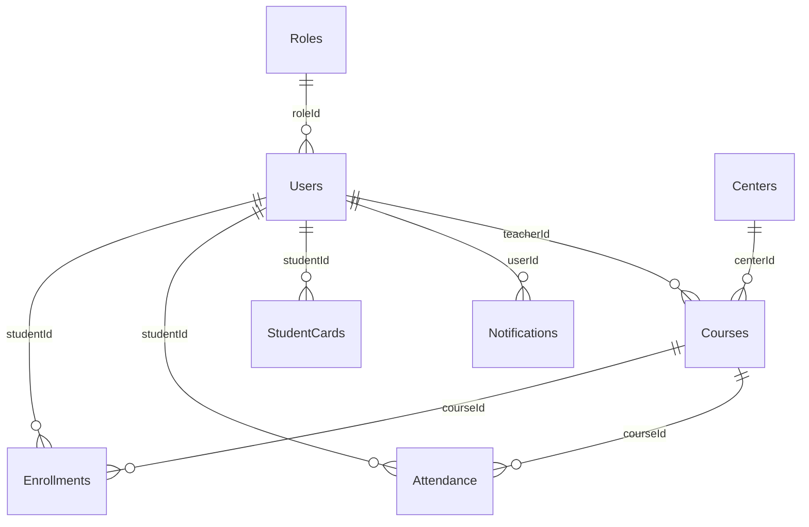

### [DAT-001] Users

| Trường | Loại dữ liệu | Ràng buộc | Mô tả |
|-------|-----------|-------------|-------------|
| user_id | UUID | PK, không null | Định danh duy nhất |
| email | VARCHAR(255) | không null, duy nhất | Định danh đăng nhập chính |
| password_hash | CHAR(60) | không null | Băm bcrypt |
| full_name | VARCHAR(100) | không null | Tên thật |
| role_id | SMALLINT | FK → Roles.role_id | Vai trò được chỉ định |
| provider | ENUM('local','firebase','google','facebook') | mặc định 'local' | Nhà cung cấp xác thực |
| created_at | TIMESTAMP | không null, mặc định now() | Tạo tài khoản |
| updated_at | TIMESTAMP | không null, mặc định now() | Cập nhật cuối cùng |

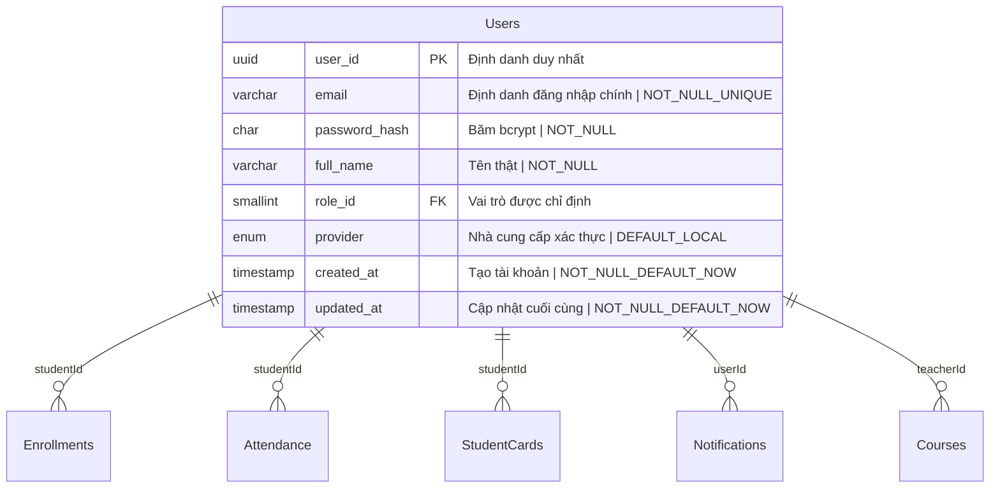

### [DAT-002] Centers

| Trường | Loại dữ liệu | Ràng buộc | Mô tả |
|-------|-----------|-------------|-------------|
| center_id | UUID | PK, không null | Định danh duy nhất |
| name | VARCHAR(100) | không null | Tên trung tâm |
| address | VARCHAR(255) | không null | Địa chỉ vật lý |
| tax_id | VARCHAR(20) | duy nhất, không null | Mã số thuế |
| contact_phone | VARCHAR(20) | tùy chọn | Điện thoại liên hệ |
| contact_email | VARCHAR(100) | tùy chọn | Email liên hệ |

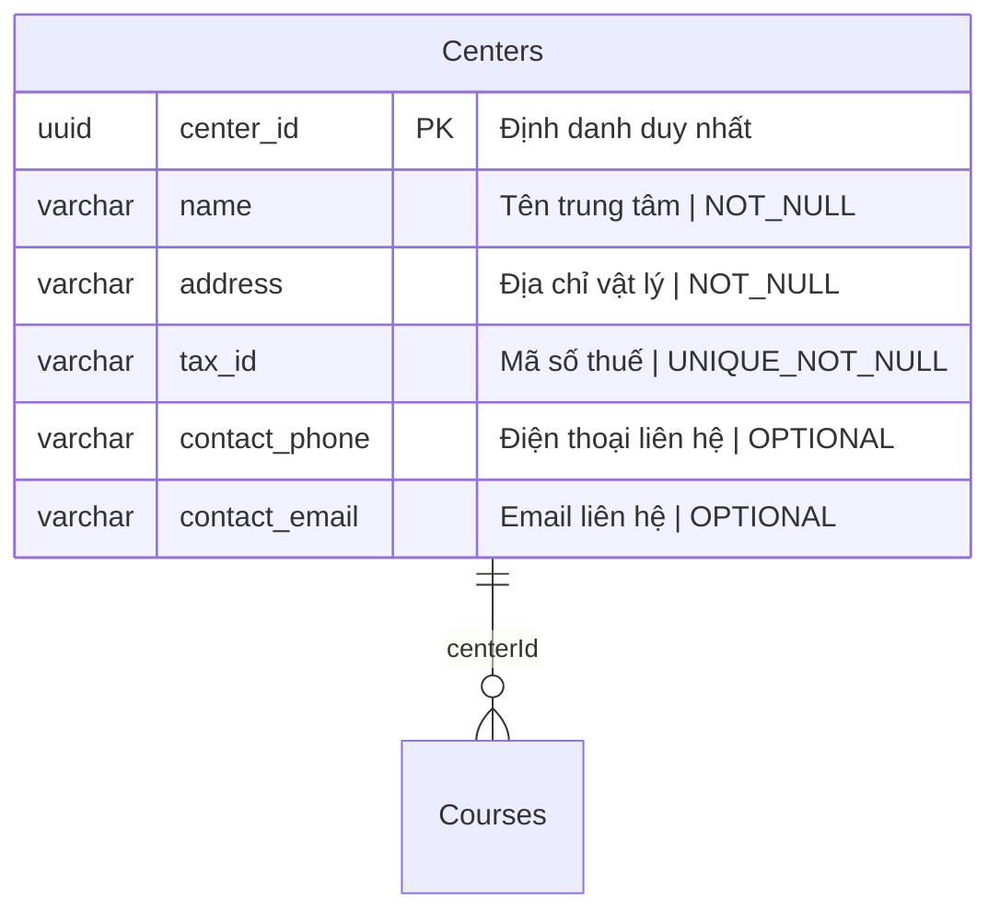

### [DAT-003] Courses

| Trường | Loại dữ liệu | Ràng buộc | Mô tả |
|-------|-----------|-------------|-------------|
| course_id | UUID | PK, không null | Định danh duy nhất |
| title | VARCHAR(150) | không null | Tên khóa học |
| description | TEXT | tùy chọn | Mô tả chi tiết |
| start_date | DATE | không null | Ngày bắt đầu khóa học |
| end_date | DATE | không null | Ngày kết thúc khóa học |
| teacher_id | UUID | FK → Users.user_id | Giáo viên được chỉ định |
| max_students | INT | mặc định 30 | Sức chứa |

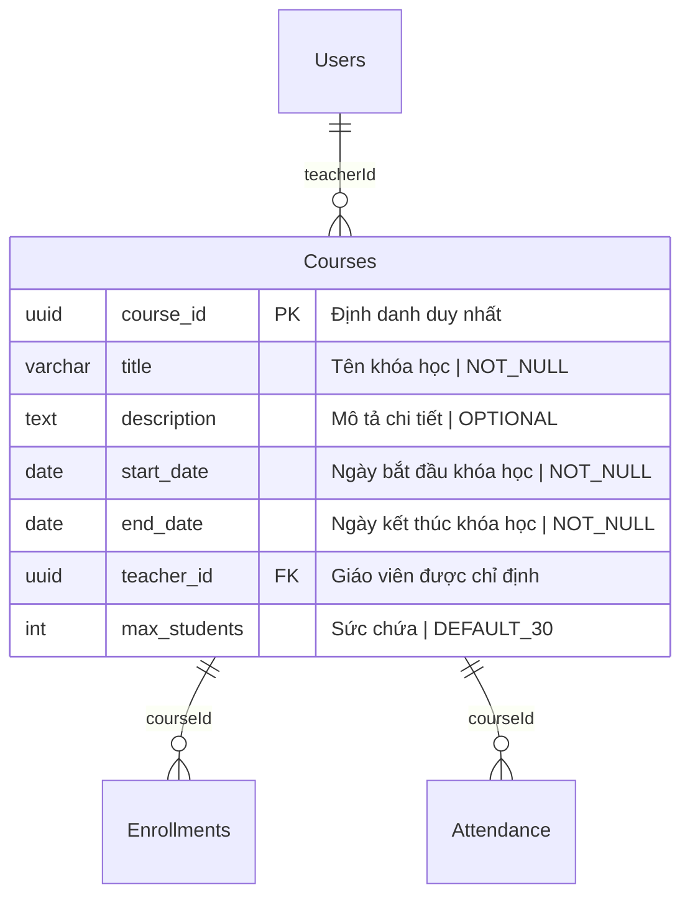

### [DAT-004] Enrollments

| Trường | Loại dữ liệu | Ràng buộc | Mô tả |
|-------|-----------|-------------|-------------|
| enrollment_id | UUID | PK, không null | Định danh duy nhất |
| student_id | UUID | FK → Users.user_id | Học viên đã đăng ký |
| course_id | UUID | FK → Courses.course_id | Khóa học |
| enrollment_date | TIMESTAMP | mặc định now() | Khi đăng ký |

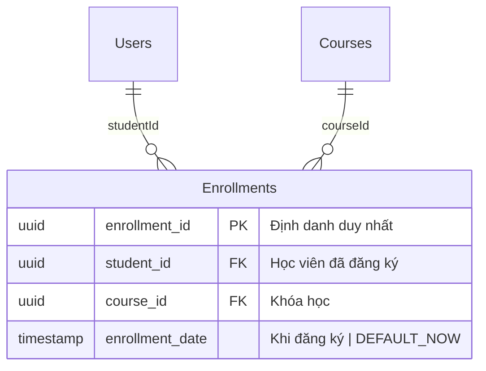

### [DAT-005] Attendance

| Trường | Loại dữ liệu | Ràng buộc | Mô tả |
|-------|-----------|-------------|-------------|
| attendance_id | UUID | PK, không null | Định danh duy nhất |
| student_id | UUID | FK → Users.user_id | Học viên có mặt |
| course_id | UUID | FK → Courses.course_id | Khóa học tham dự |
| attendance_date | DATE | không null | Ngày tham gia |
| timestamp | TIMESTAMP | mặc định now() | Thời gian ghi lại chính xác |

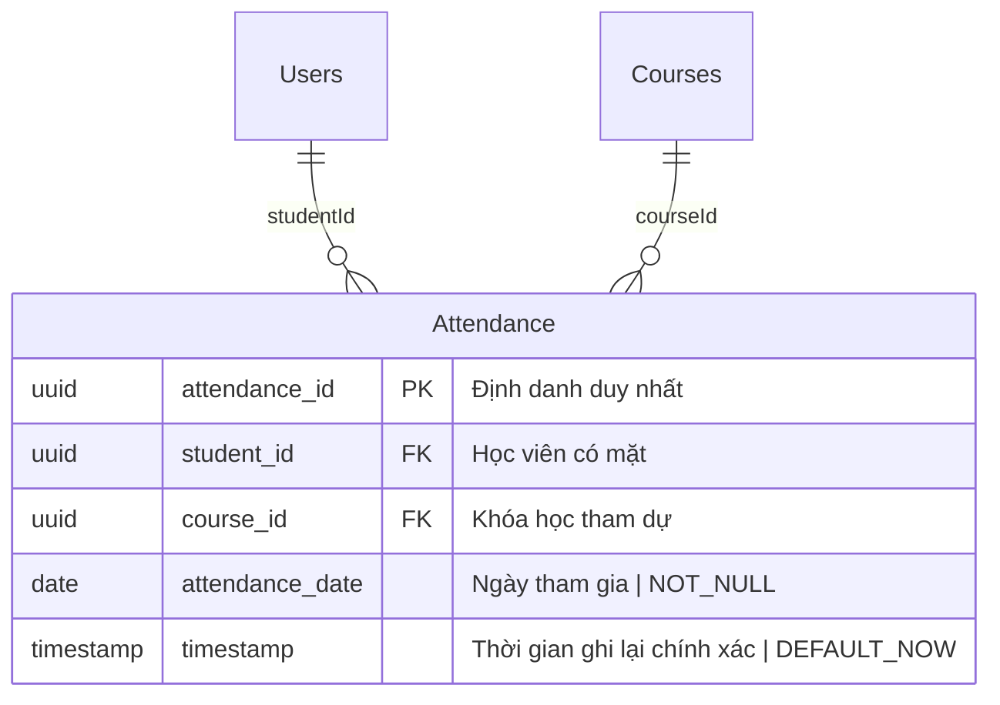

### [DAT-006] StudentCards

| Trường | Loại dữ liệu | Ràng buộc | Mô tả |
|-------|-----------|-------------|-------------|
| card_id | UUID | PK, không null | Định danh duy nhất |
| student_id | UUID | FK → Users.user_id | Chủ sở hữu |
| issue_date | DATE | không null | Ngày phát hành thẻ |
| validity_days | INT | không null | Tổng số ngày hợp lệ |
| remaining_days | INT | tính toán | Số ngày còn lại đến hết hạn |

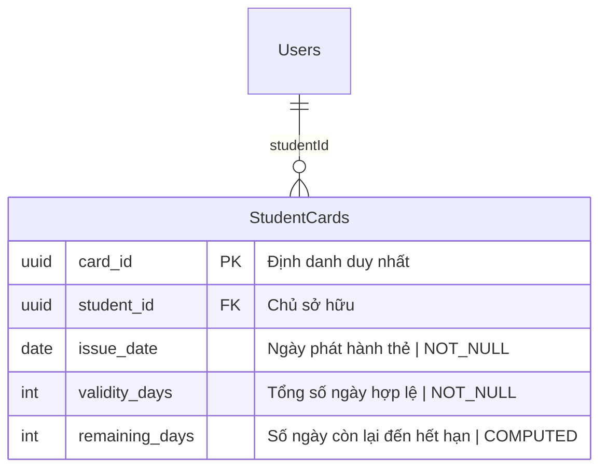

### [DAT-007] Notifications

| Trường | Loại dữ liệu | Ràng buộc | Mô tả |
|-------|-----------|-------------|-------------|
| notification_id | UUID | PK, không null | Định danh duy nhất |
| user_id | UUID | FK → Users.user_id (tùy chọn) | Người dùng mục tiêu |
| group_zalo | VARCHAR(50) | tùy chọn | Nhóm Zalo mục tiêu |
| message | TEXT | không null | Nội dung thông báo |
| sent_at | TIMESTAMP | mặc định now() | Khi gửi |
| delivered | BOOLEAN | mặc định false | Trạng thái giao hàng |

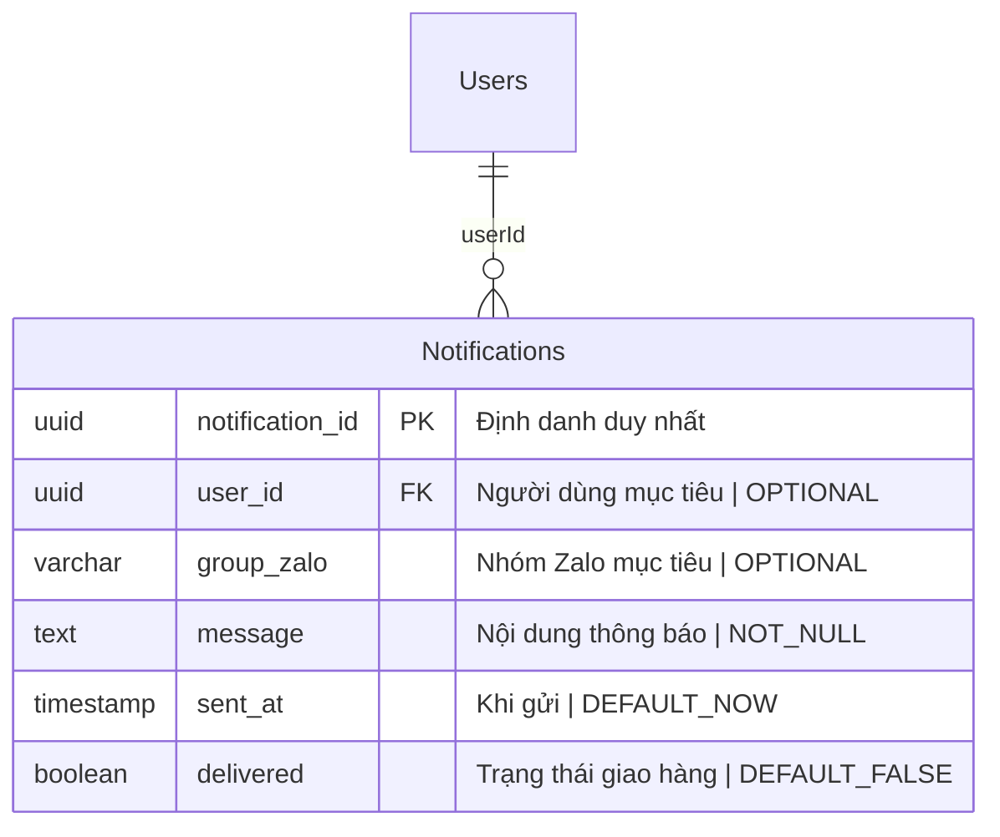

### [DAT-008] Roles

| Trường | Loại dữ liệu | Ràng buộc | Mô tả |
|-------|-----------|-------------|-------------|
| role_id | SMALLINT | PK | Định danh vai trò |
| name | VARCHAR(30) | duy nhất, không null | Tên vai trò |
| description | VARCHAR(200) | tùy chọn | Mô tả vai trò |

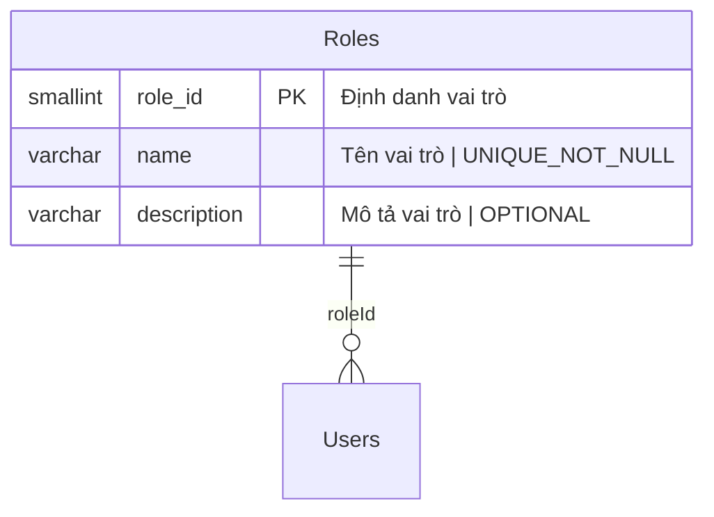

### [DAT-009] Promotions

| Trường | Loại dữ liệu | Ràng buộc | Mô tả |
|-------|-----------|-------------|-------------|
| promo_id | UUID | PK, không null | Định danh duy nhất |
| code | VARCHAR(30) | duy nhất | Mã giảm giá |
| discount_percent | SMALLINT | không null | Phần trăm giảm giá |
| start_date | DATE | tùy chọn | Ngày bắt đầu khuyến mãi |
| end_date | DATE | tùy chọn | Ngày kết thúc khuyến mãi |
| description | TEXT | tùy chọn | Chi tiết khuyến mãi |

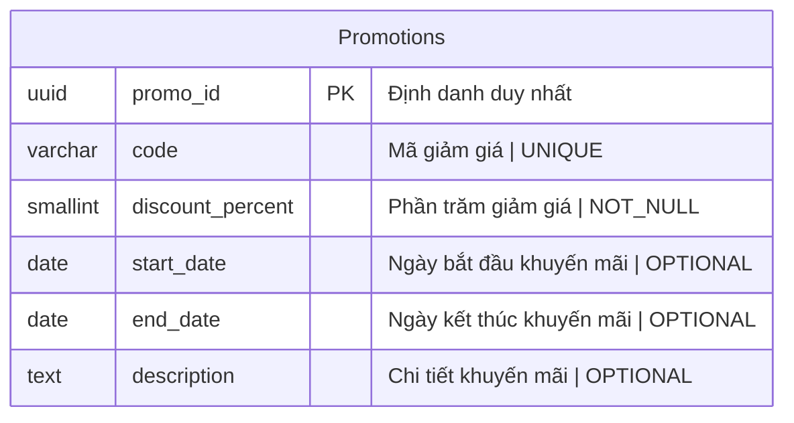

### [DAT-010] Announcements

| Trường | Loại dữ liệu | Ràng buộc | Mô tả |
|-------|-----------|-------------|-------------|
| announcement_id | UUID | PK, không null | Định danh duy nhất |
| title | VARCHAR(150) | không null | Tiêu đề |
| content | TEXT | không null | Nội dung |
| start_date | DATE | tùy chọn | Ngày có hiệu lực bắt đầu |
| end_date | DATE | tùy chọn | Ngày có hiệu lực kết thúc |

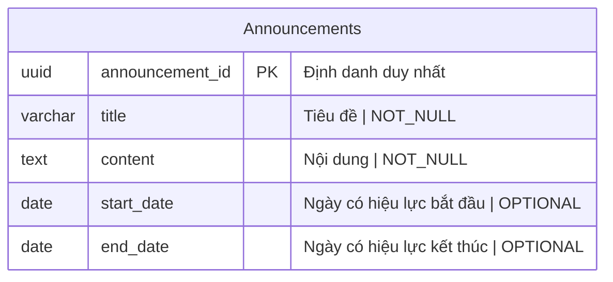

### [DAT-011] SystemSettings

| Trường | Loại dữ liệu | Ràng buộc | Mô tả |
|-------|-----------|-------------|-------------|
| setting_key | VARCHAR(50) | PK | Khóa cấu hình |
| setting_value | TEXT | không null | Giá trị cấu hình |
| description | VARCHAR(200) | tùy chọn | Ý nghĩa của cài đặt |

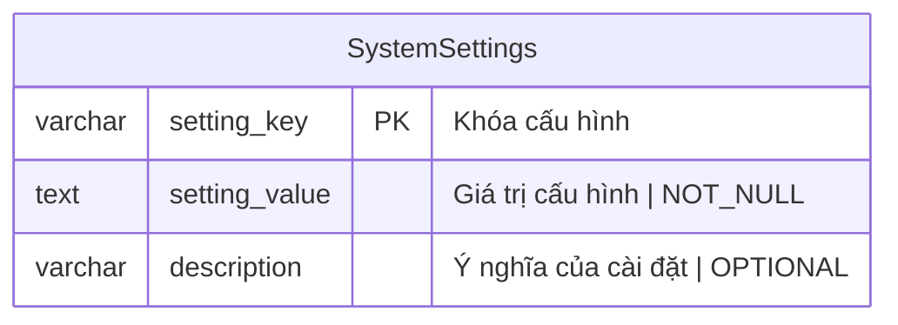

## 🔍 TRACEABILITY COVERAGE LEDGER

| Tag ID | Section Title | Audit Status |
|--------|---------------|--------------|
| [REQ-001] | User Registration | [VERIFIED] |
| [REQ-002] | Social Authentication | [VERIFIED] |
| [REQ-003] | User Role Assignment | [VERIFIED] |
| [REQ-004] | Center List View | [VERIFIED] |
| [REQ-005] | Center Create/Update/Delete | [VERIFIED] |
| [REQ-006] | Center Admin Assignment | [VERIFIED] |
| [REQ-007] | Course List View | [VERIFIED] |
| [REQ-008] | Course Create/Update/Delete (Conflict Avoidance) | [VERIFIED] |
| [REQ-009] | Teacher Assignment to Course | [VERIFIED] |
| [REQ-010] | Course Browse | [VERIFIED] |
| [REQ-011] | Student Course Registration | [VERIFIED] |
| [REQ-012] | QR Attendance Capture | [VERIFIED] |
| [REQ-013] | Attendance Idempotency | [VERIFIED] |
| [REQ-014] | Card Validity Display | [VERIFIED] |
| [REQ-015] | Card Renewal | [VERIFIED] |
| [REQ-016] | Notification Trigger | [VERIFIED] |
| [REQ-017] | Promotion Management | [VERIFIED] |
| [REQ-018] | Announcement Management | [VERIFIED] |
| [REQ-019] | AI Chatbot Integration | [VERIFIED] |
| [REQ-020] | Mobile App Role-Specific UI | [VERIFIED] |
| [REQ-021] | Mobile Push Notifications | [VERIFIED] |
| [REQ-022] | Default Locale Detection | [VERIFIED] |
| [REQ-023] | Multi-Language SEO | [VERIFIED] |
| [REQ-024] | Attendance Report Generation | [VERIFIED] |
| [REQ-025] | Enrollment Summary Dashboard | [VERIFIED] |
| [EXC-001] | Network & Connectivity Drops During QR Scan | [VERIFIED] |
| [EXC-002] | Duplicate Attendance Submission | [VERIFIED] |
| [EXC-003] | Failed Notification Delivery | [VERIFIED] |
| [EXC-004] | Invalid Input Validation | [VERIFIED] |
| [EXC-005] | System Recovery After Outage | [VERIFIED] |
| [DAT-001] | Users | [VERIFIED] |
| [DAT-002] | Centers | [VERIFIED] |
| [DAT-003] | Courses | [VERIFIED] |
| [DAT-004] | Enrollments | [VERIFIED] |
| [DAT-005] | Attendance | [VERIFIED] |
| [DAT-006] | StudentCards | [VERIFIED] |
| [DAT-007] | Notifications | [VERIFIED] |
| [DAT-008] | Roles | [VERIFIED] |
| [DAT-009] | Promotions | [VERIFIED] |
| [DAT-010] | Announcements | [VERIFIED] |
| [DAT-011] | SystemSettings | [VERIFIED] |
| [ARC-001] | System Admin RBAC | [VERIFIED] |
| [ARC-002] | Center Admin RBAC | [VERIFIED] |
| [ARC-003] | Manager RBAC | [VERIFIED] |
| [ARC-004] | Teacher RBAC | [VERIFIED] |
| [ARC-005] | Student RBAC | [VERIFIED] |
| [ARC-006] | Authentication Flow | [VERIFIED] |
| [ARC-007] | Attendance QR Processing Flow | [VERIFIED] |
| [ARC-008] | Notification Delivery Flow | [VERIFIED] |
| [ARC-009] | Mobile App Backend Integration Flow | [VERIFIED] |
| [NFR-001] | Performance Metrics | [VERIFIED] |
| [NFR-002] | Availability | [VERIFIED] |
| [NFR-003] | Security | [VERIFIED] |
| [NFR-004] | Scalability & Availability | [VERIFIED] |
| [NFR-005] | Docker Image Size | [VERIFIED] |
| [NFR-006] | Logging & Audit | [VERIFIED] |
| [NFR-007] | Multi-Language Support | [VERIFIED] |
| [NFR-008] | GDPR/CCPA Compliance | [VERIFIED] |
| [NFR-009] | Backup & Disaster Recovery | [VERIFIED] |