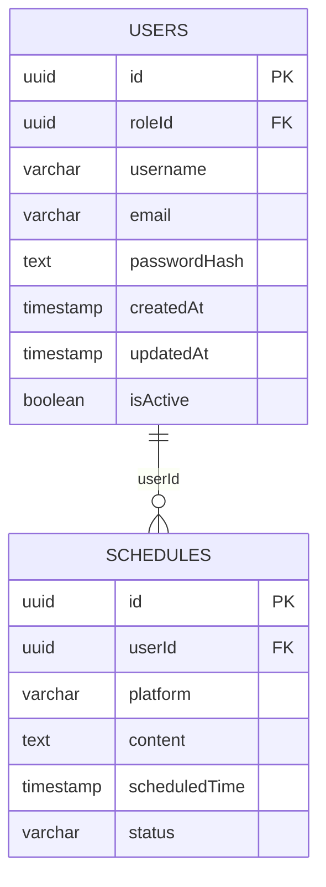
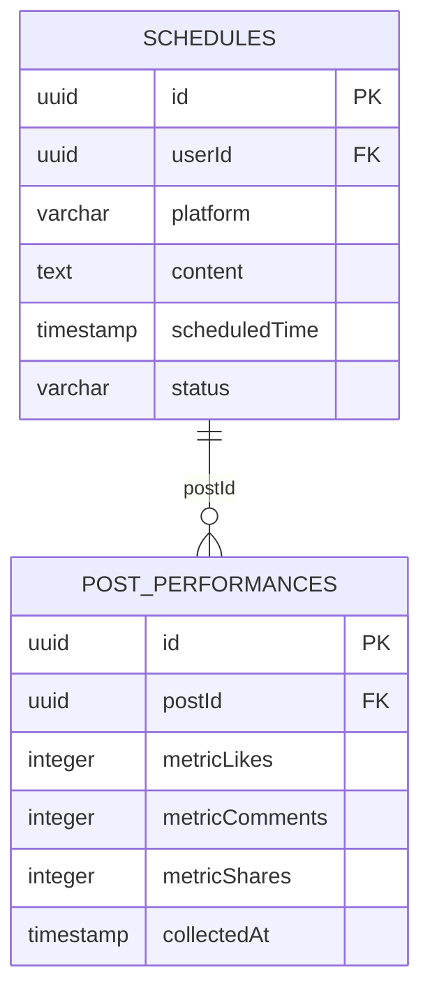
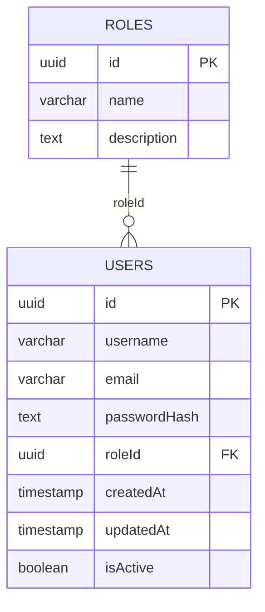
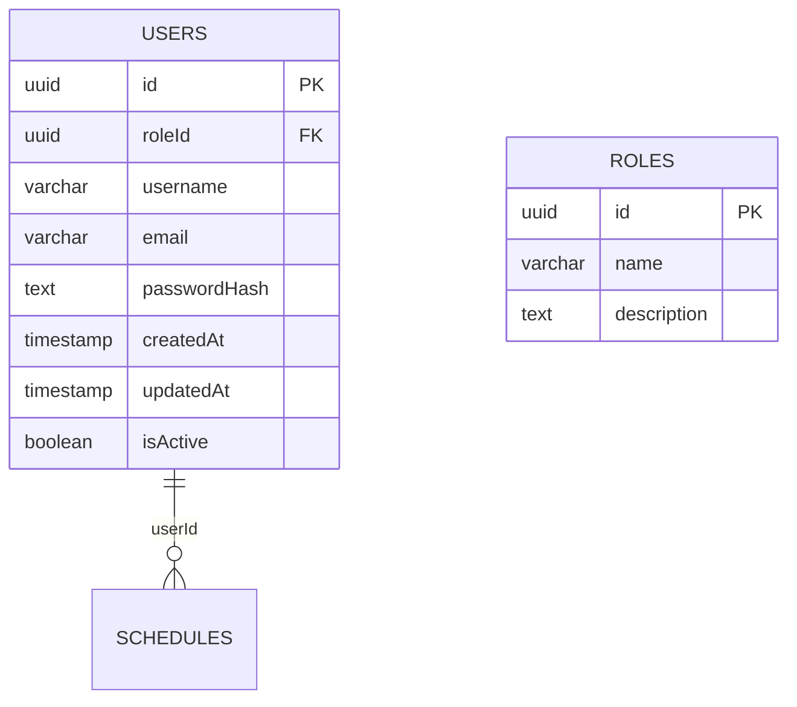
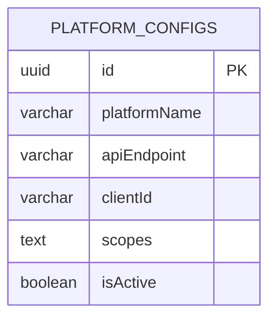
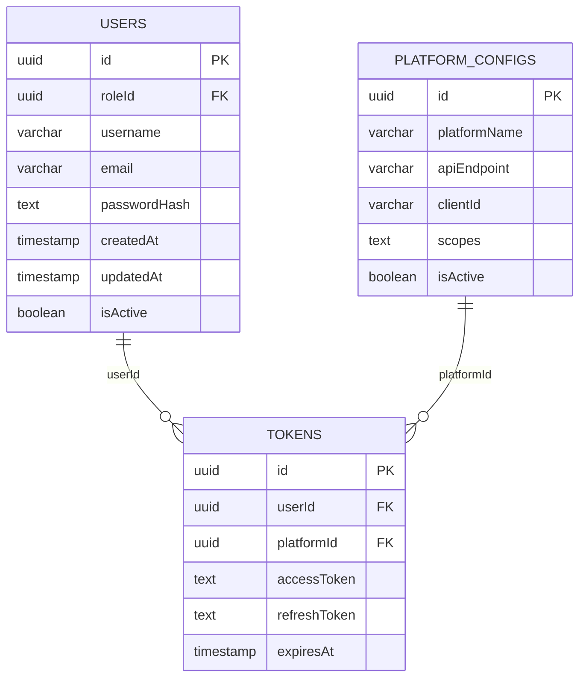
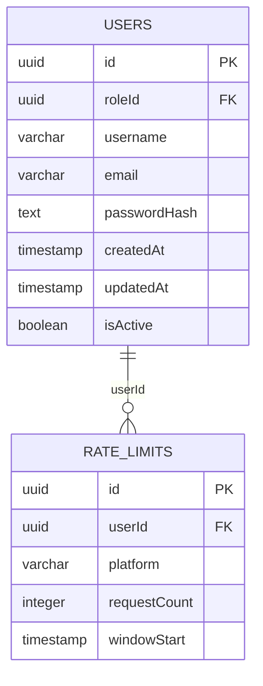

# SOFTWARE REQUIREMENTS SPECIFICATION: membership-hub

| Mục | Chi tiết |
| :--- | :--- |
| **Mã SRS** | SRS-20260830135621 |
| **Tên dự án** | membership-hub |
| **Phiên bản** | 1.0 (Điểm chuẩn) |
| **Ngày giờ** | 2026/08/30 13:56:21 |
| **Tác giả** | Enterprise System Architect (SA Agent) |
| **Phê duyệt** | Chờ phê duyệt quản trị kỹ thuật |

## 1. TỔNG QUAN DỰ ÁN & KIẾN TRÚC TOÀN CẦU

### Mục tiêu sản phẩm & Giá trị cốt lõi

Hệ thống tự động hóa lịch đăng bài trên mạng xã hội, cung cấp đề xuất nội dung được hỗ trợ bởi AI và khả năng xuất bản đa nền tảng (Facebook, Instagram, TikTok) mà không cần kỹ năng chuyên môn, giúp các doanh nghiệp nhỏ duy trì sự hiện diện trực tuyến nhất quán.

### Đối tượng mục tiêu chính

- Chủ doanh nghiệp nhỏ
- Quản lý tiếp thị
- Chuyên gia marketing tự do

### Ma trận kiểm soát truy cập dựa trên vai trò toàn cầu (RBAC)

- [ARC-001] Chủ doanh nghiệp: Tạo và quản lý lịch đăng bài; Truy cập vào tất cả các nền tảng mạng xã hội; Quản lý người dùng và quyền; Xem báo cáo hiệu suất; Cấu hình hệ thống.

- [ARC-002] Quản lý tiếp thị: Tạo và lên lịch bài đăng cho các chiến dịch; Xem báo cáo hiệu suất của nhóm; Quản lý lịch đăng bài được giao; Truy cập vào các nền tảng được chỉ định.

- [ARC-003] Chuyên gia marketing tự do: Tạo và lên lịch bài đăng cho khách hàng; Xem báo cáo hiệu suất cho các chiến dịch được giao; Truy cập vào các nền tảng được chỉ định.

### Blueprint hạ tầng & ràng buộc công nghệ toàn cầu [ARC-004]

- Kiến trúc đa租 (multi‑tenant) với isolation dữ liệu nghiêm ngặt.
- Dịch vụ vi (microservices) được container hóa bằng Docker, triển khai trên Kubernetes (GKE).
- API Gateway (Kong) với JWT OAuth2 để xác thực và ủy quyền.
- Dịch vụ xác thực tập trung (Auth Service) quản lý token và làm mới phiên.
- Dịch vụ lên lịch (Scheduler Service) sử dụng Quarkus, tích hợp với Facebook Graph API, Instagram Basic Display API, TikTok Creative Center API.
- Mô hình học máy cho đề xuất nội dung được lưu trữ trong PostgreSQL, được truy xuất bởi một dịch vụ suy luận chuyên dụng (sử dụng Python/Scikit‑learn hoặc mô hình ngôn ngữ lớn tùy chỉnh).
- Hệ thống giám sát và ghi nhật ký sự kiện (Event Logging) bằng cách sử dụng Fluentd → Elasticsearch.
- Tuân thủ nghiêm ngặt OWASP Top 10, mã hóa dữ liệu ở nghỉ (TLS 1.3) và tại chỗ (AES‑256).
- Hệ thống kiểm soát tỷ lệ (Rate Limiting) sử dụng Redis với bucket theo user‑platform.
- CI/CD pipeline với GitHub Actions, quét bảo mật tự động, và triển khai canary.

## 2. MODULE EPIC: SocialScheduler

### Yêu cầu chức năng cốt lõi

- [REQ-001] Tích hợp API lịch đăng bài tự động cho Facebook, Instagram và TikTok.
  *User story:* As a small business owner, I want the system to automatically schedule posts on Facebook, Instagram, and TikTok so that I can maintain a consistent social media presence without manual intervention.

- [REQ-002] Triển khai mô hình học máy để đề xuất nội dung bài đăng dựa trên hiệu suất trước đó.
  *User story:* As a marketing manager, I want the system to suggest content ideas based on historical post performance so that I can create engaging posts that drive results.

- [REQ-003] Thực hiện xác thực đầu vào dữ liệu và kiểm tra giới hạn tỷ lệ cho từng người dùng.
  *User story:* As a freelance marketer, I want the system to validate input data and enforce rate limits per user to prevent abuse and ensure fair usage.

### Tiêu chí chấp nhận

**REQ-001** – Tiêu chí chấp nhận:

Given hệ thống có kết nối API hợp lệ với Facebook, Instagram, TikTok.
When tôi tạo một lịch đăng bài mới với nền tảng, nội dung và thời gian đã chọn.
Then bài đăng được gửi đến API tương ứng và lịch đăng bài được đánh dấu là đã lên lịch.

**REQ-002** – Tiêu chí chấp nhận:

Given mô hình học máy đã được huấn luyện trên lịch sử hiệu suất bài đăng.
When tôi yêu cầu hệ thống đề xuất ý tưởng nội dung cho một chiến dịch cụ thể.
Then hệ thống trả về danh sách nội dung được ưu tiên cao nhất dựa trên các chỉ số hiệu suất trước đó.

**REQ-003** – Tiêu chí chấp nhận:

Given một người dùng đã xác thực gửi yêu cầu tạo lịch đăng bài.
When dữ liệu đầu vào (platform, content, scheduled_time) không hợp lệ hoặc giới hạn tỷ lệ đã đạt, hệ thống ghi lại lỗi và từ chối yêu cầu.
Then API trả về mã lỗi chi tiết và thông báo cho người dùng về lý do thất bại.

### Luồng ngoại lệ mô-đun

- [EXC-001] Xử lý ngoại lệ khi API bên thứ ba trả về lỗi; ghi lại và thử lại sau.
- [EXC-002] Xác thực quyền truy cập người dùng và xử lý trường hợp token hết hạn.
- [EXC-003] Bảo vệ chống lại việc spam lịch đăng bài và tấn công flood comment.

### Từ điển dữ liệu mô-đun

#### [DAT-001] Bảng lưu trữ lịch đăng bài

| Trường | Kiểu dữ liệu | Ràng buộc | Mô tả |
| :--- | :--- | :--- | :--- |
| id | uuid | PK | Khóa chính cho mục lịch đăng bài |
| userId | uuid | FK | Tham chiếu đến bảng người dùng |
| platform | varchar |  | Tên nền tảng (facebook, instagram, tiktok) |
| content | text |  | Nội dung bài đăng |
| scheduledTime | timestamp |  | Thời điểm dự kiến đăng bài |
| status | varchar |  | Trạng thái (pending, published, failed, cancelled) |

#### [DAT-002] Bảng hiệu suất bài đăng

| Trường | Kiểu dữ liệu | Ràng buộc | Mô tả |
| :--- | :--- | :--- | :--- |
| id | uuid | PK | Khóa chính cho bản ghi hiệu suất |
| postId | uuid | FK | Tham chiếu đến mục lịch đăng bài |
| metricLikes | integer |  | Số lượt thích |
| metricComments | integer |  | Số bình luận |
| metricShares | integer |  | Số lượt chia sẻ |
| collectedAt | timestamp |  | Thời điểm thu thập số liệu |

#### [DAT-003] Bảng người dùng

| Trường | Kiểu dữ liệu | Ràng buộc | Mô tả |
| :--- | :--- | :--- | :--- |
| id | uuid | PK | Khóa chính cho người dùng |
| username | varchar |  | Tên người dùng duy nhất |
| email | varchar |  | Địa chỉ email |
| passwordHash | text |  | Băm mật khẩu |
| roleId | uuid | FK | Tham chiếu đến bảng vai trò |
| createdAt | timestamp |  | Thời điểm tạo tài khoản |
| updatedAt | timestamp |  | Thời điểm cập nhật gần nhất |
| isActive | boolean |  | Trạng thái kích hoạt |

#### [DAT-004] Bảng vai trò

| Trường | Kiểu dữ liệu | Ràng buộc | Mô tả |
| :--- | :--- | :--- | :--- |
| id | uuid | PK | Khóa chính cho vai trò |
| name | varchar |  | Tên vai trò (Owner, Manager, Freelancer) |
| description | text |  | Mô tả chi tiết về vai trò |

#### [DAT-005] Bảng cấu hình nền tảng

| Trường | Kiểu dữ liệu | Ràng buộc | Mô tả |
| :--- | :--- | :--- | :--- |
| id | uuid | PK | Khóa chính cho cấu hình |
| platformName | varchar |  | Tên nền tảng (facebook, instagram, tiktok) |
| apiEndpoint | varchar |  | Điểm cuối API |
| clientId | varchar |  | Client ID ứng dụng |
| scopes | text |  | Phạm vi quyền được cấp |
| isActive | boolean |  | Trạng thái kích hoạt |

#### [DAT-006] Bảng token

| Trường | Kiểu dữ liệu | Ràng buộc | Mô tả |
| :--- | :--- | :--- | :--- |
| id | uuid | PK | Khóa chính cho token |
| userId | uuid | FK | Tham chiếu đến bảng người dùng |
| platformId | uuid | FK | Tham chiếu đến bảng cấu hình nền tảng |
| accessToken | text |  | Token truy cập |
| refreshToken | text |  | Token làm mới |
| expiresAt | timestamp |  | Thời điểm hết hạn |

#### [DAT-007] Bảng giới hạn tỷ lệ

| Trường | Kiểu dữ liệu | Ràng buộc | Mô tả |
| :--- | :--- | :--- | :--- |
| id | uuid | PK | Khóa chính cho bản ghi giới hạn |
| userId | uuid | FK | Tham chiếu đến bảng người dùng |
| platform | varchar |  | Nền tảng áp dụng giới hạn |
| requestCount | integer |  | Số yêu cầu trong khoảng thời gian |
| windowStart | timestamp |  | Thời điểm bắt đầu cửa sổ |

### Yêu cầu phi chức năng toàn cầu

- [NFR-001] Hiệu suất: Độ trễ dưới 200 ms cho việc lên lịch bài đăng, thời gian phản hồi API dưới 500 ms, khả năng mở rộng theo chiều ngang đến 10 000 người dùng đồng thời.

- [NFR-002] Bảo mật: Mã hóa dữ liệu ở nghỉ bằng AES‑256, truyền qua TLS 1.3, JWT có thời gian sống ngắn, kiểm tra quyền nghiêm ngặt, phát hiện và ngăn chặn tấn công DDoS, tuân thủ OWASP Top 10.

- [NFR-003] Khả năng sẵn sàng & Đa-tenancy: Mục tiêu độ khả dụng 99.9 %, isolation dữ liệu hoàn toàn giữa các tenant, tuân thủ GDPR/CCPA khi cần thiết.