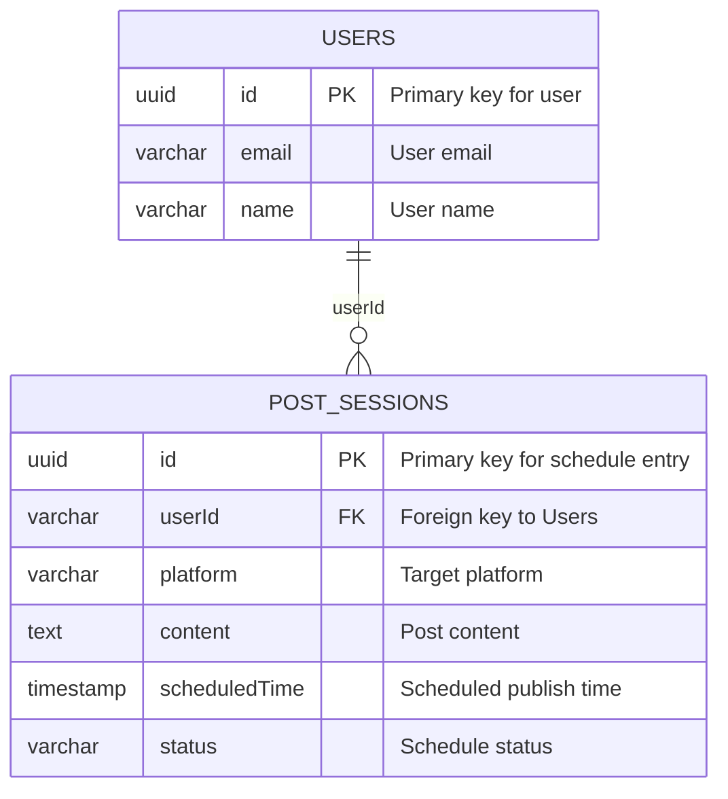
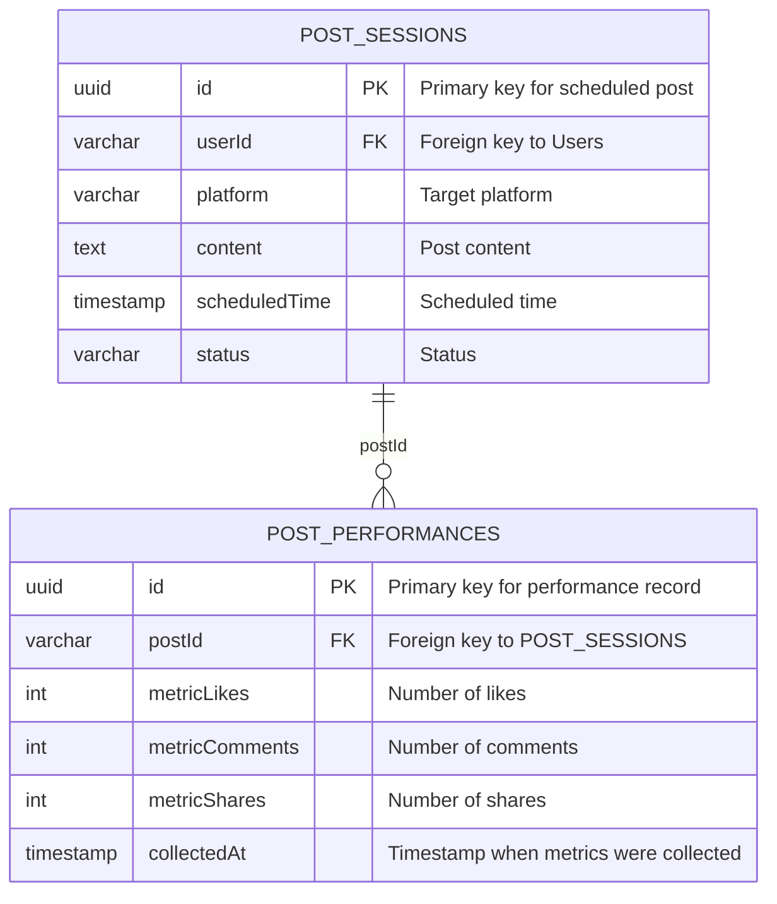
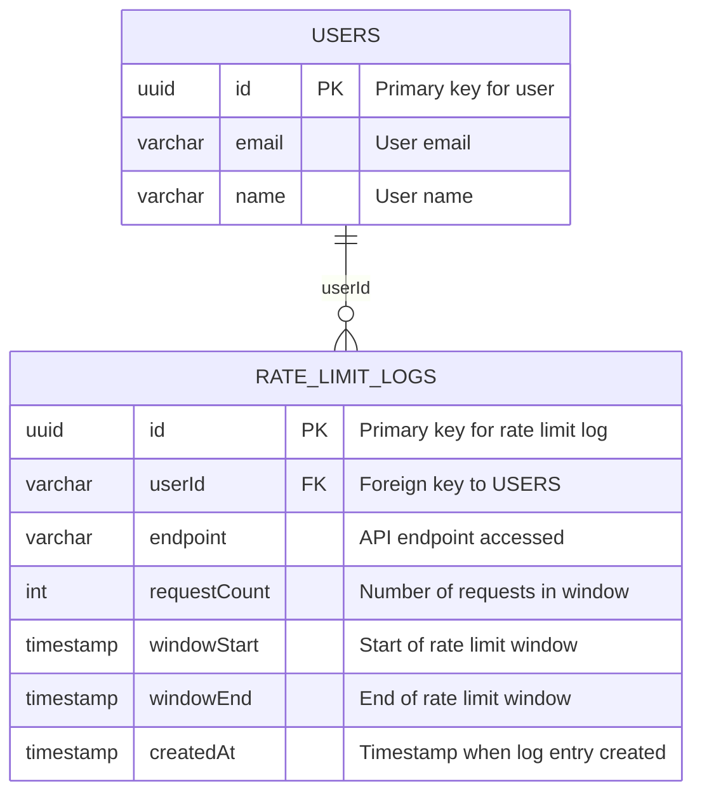

# YÊU CẦU CỦA HỆ THỐNG PHẦN MỀM: social-scheduler

## 📊 Kiểm soát Tài liệu

| Mục | Chi tiết |
| :--- | :--- |
| **SRS ID** | SRS-20260830150648 |
| **Tên Dự án** | social-scheduler |
| **Phiên bản** | 1.0 (Cơ sở) |
| **Ngày Giờ** | 2026/08/30 15:06:48 |
| **Tác giả** | Enterprise System Architect (SA Agent) |
| **Phê duyệt** | Chờ phê duyệt quản trị kỹ thuật

## 1. Tổng quan Dự án & Kiến trúc Toàn cầu

### Mục tiêu Sản phẩm & Giá trị Cốt lõi

- [ARC-001] Mục tiêu: Tự động hóa việc lên lịch đăng bài trên mạng xã hội cho các doanh nghiệp nhỏ để duy trì sự hiện diện trực tuyến nhất quán.
- [ARC-002] Giá trị cốt lõi: Hiệu quả, độ tin cậy, khả năng mở rộng và bảo mật.

### Đối tượng Mục tiêu

- [ARC-003] Chủ doanh nghiệp nhỏ: Người ra quyết định chính cho các hoạt động tiếp thị.
- [ARC-004] Quản lý tiếp thị: Người giám sát chiến dịch và phân công nhiệm vụ.
- [ARC-005] Chuyên gia marketing tự do: Nhà cung cấp dịch vụ làm việc với nhiều khách hàng.

### Ma trận Kiểm soát Truy cập Dựa trên Vai trò (RBAC)

- [ARC-006] Vai trò: Chủ doanh nghiệp (Owner). Quyền: Tạo lịch, xuất bản, quản lý người dùng, xem báo cáo phân tích, cấu hình tích hợp.
- [ARC-007] Vai trò: Quản lý Tiếp thị (Marketing Manager). Quyền: Tạo lịch, xuất bản, xem báo cáo phân tích, cấu hình tích hợp (chỉ đọc).
- [ARC-008] Vai trò: Người lập lịch (Scheduler). Quyền: Tạo lịch, lên lịch, xem lịch đã lên lịch.
- [ARC-009] Vai trò: Nhà phân tích (Analyst). Quyền: Xem báo cáo phân tích, xuất dữ liệu.

### Kiến trúc Kỹ thuật & Stack Toàn cầu

- [ARC-011] API Gateway: Quản lý lưu lượng truy cập, xác thực, giới hạn tỷ lệ.
- [ARC-012] Microservices: Các dịch vụ độc lập cho xác thực, lên lịch, gợi ý nội dung, lưu trữ dữ liệu hiệu suất, nhật ký giới hạn tỷ lệ.
- [ARC-013] Containerization: Docker với Kubernetes để orchestration.
- [ARC-014] Cloud Infrastructure: Triển khai trên AWS (hoặc GCP) với RDS cho PostgreSQL, Redis Cache, và Message Queue (Kafka).
- [ARC-015] Message Queue: Apache Kafka cho các tác vụ đăng bài bất đồng bộ.
- [ARC-016] Monitoring & Logging: Prometheus + Grafana, ELK Stack.
- [ARC-017] Security: OAuth2 / JWT, WAF, mã hóa dữ liệu, tuân thủ OWASP Top 10.
- [ARC-018] Multi-tenancy: Cô lập dữ liệu theo schema mỗi tenant trong PostgreSQL.
- [ARC-019] CI/CD: GitLab CI với tự động triển khai blue-green.

## 2. Các Mô-đun Tính năng Nâng cao

### 2.1 Automated Posting Scheduler (REQ-001)

**Yêu cầu Chức năng Cốt lõi**

- [REQ-001] Là một chủ doanh nghiệp nhỏ, tôi muốn hệ thống tự động lên lịch đăng bài lên Facebook, Instagram và TikTok dựa trên lịch đã định nghĩa, để duy trì sự hiện diện mạng xã hội nhất quán mà không cần thao tác thủ công.

**Tiêu chí Chấp nhận**

- Given tôi có một tài khoản active và một lịch đăng bài được định nghĩa trong hệ thống,
  When tôi kích hoạt engine lên lịch,
  Then bài đăng sẽ được xuất bản lên các nền tảng tương ứng (Facebook, Instagram, TikTok) tại scheduled_time.

- Given trạng thái bài đăng là "scheduled",
  When thời điểm hiện tại đạt đến scheduled_time,
  Then hệ thống cố gắng xuất bản bài đăng qua API nền tảng tương ứng.

**Luồng Ngoại lệ**

- [EXC-001] Xử lý ngoại lệ khi API bên thứ ba trả về lỗi; ghi lại và thử lại sau.

**Từ điển Dữ liệu**

- [DAT-001] Bảng lưu trữ lịch đăng bài: id, user_id, platform, content, scheduled_time, status.

### 2.2 AI Content Suggestion Engine (REQ-002)

**Yêu cầu Chức năng Cốt lõi**

- [REQ-002] Là một quản lý tiếp thị, tôi muốn hệ thống đề xuất nội dung bài đăng dựa trên hiệu suất trước đó, để tạo ra các bài đăng hấp dẫn thúc đẩy tương tác cao hơn.

**Tiêu chí Chấp nhận**

- Given tôi có dữ liệu hiệu suất bài đăng lịch sử,
  When tôi yêu cầu gợi ý nội dung cho một nền tảng mục tiêu,
  Then hệ thống trả về danh sách các đoạn nội dung được gợi ý, được xếp hạng theo dự đoán tương tác.

- Given một mục nội dung được gợi ý,
  When tôi chấp nhận và lên lịch cho nó,
  Then nội dung được lưu vào bảng lịch đăng bài với trạng thái "scheduled".

**Luồng Ngoại lệ**

- [EXC-002] Xác thực quyền truy cập người dùng và xử lý trường hợp token hết hạn.

**Từ điển Dữ liệu**

- [DAT-002] Bảng hiệu suất bài đăng: id, post_id, metric_likes, metric_comments, metric_shares, collected_at.

### 2.3 Validation & Rate Limiting (REQ-003)

**Yêu cầu Chức năng Cốt lõi**

- [REQ-003] Là một quản trị viên hệ thống, tôi muốn hệ thống thực thi xác thực đầu vào dữ liệu và giới hạn tỷ lệ cho từng người dùng để ngăn chặn lạm dụng và đảm bảo tính toàn vẹn dữ liệu.

**Tiêu chí Chấp nhận**

- Given một người dùng thực hiện yêu cầu lên lịch bài đăng,
  When payload yêu cầu chứa dữ liệu không hợp lệ (ví dụ: thiếu trường bắt buộc),
  Then hệ thống trả về lỗi xác thực với thông báo chi tiết.

- Given một người dùng vượt quá ngưỡng yêu cầu cho phép trong một khoảng thời gian,
  When kiểm tra giới hạn tỷ lệ được thực hiện,
  Then yêu cầu bị từ chối với HTTP 429 và một thông báo mô tả.

**Luồng Ngoại lệ**

- [EXC-003] Bảo vệ chống lại việc spam lịch đăng bài và tấn công flood comment.

**Từ điển Dữ liệu**

- [DAT-003] Bảng nhật ký giới hạn tỷ lệ: id, user_id, endpoint, request_count, window_start, window_end, created_at.

## 3. Yêu cầu Phi-chức năng Toàn cầu

- [NFR-001] Hiệu suất: Thời gian phản hồi dưới 200ms cho các API lên lịch và gợi ý; thông lượng tối thiểu 1000 yêu cầu/giây.
- [NFR-002] Bảo mật: Sử dụng JWT/OAuth2, mã hóa dữ liệu, tuân thủ OWASP Top 10, che giấu dữ liệu nhạy cảm, ghi nhật ký kiểm toán.
- [NFR-003] Khả năng mở rộng: Kiến trúc theo chiều ngang, cô lập dữ liệu đa tenant, chia tỷ lệ cơ sở dữ liệu, cân bằng tải.
- [NFR-004] Khả năng sẵn sàng cao: Mục tiêu thời gian hoạt động 99.9%, phục hồi sau sự cố trong vòng 5 phút.
- [NFR-005] Quản lý phiên: Phiên làm việc có thời hạn, có thể thu hồi, ngăn chặn tấn công CSRF.
- [NFR-006] Sao lưu và khôi phục: Sao lưu định kỳ, phục hồi điểm mục tiêu trong vòng 30 phút.