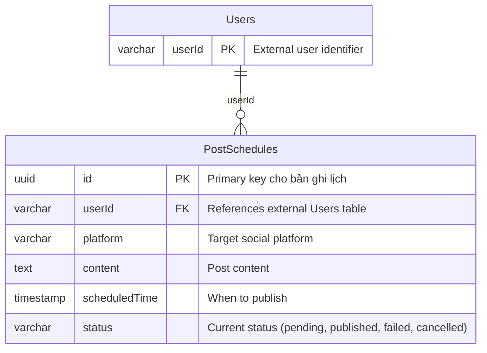
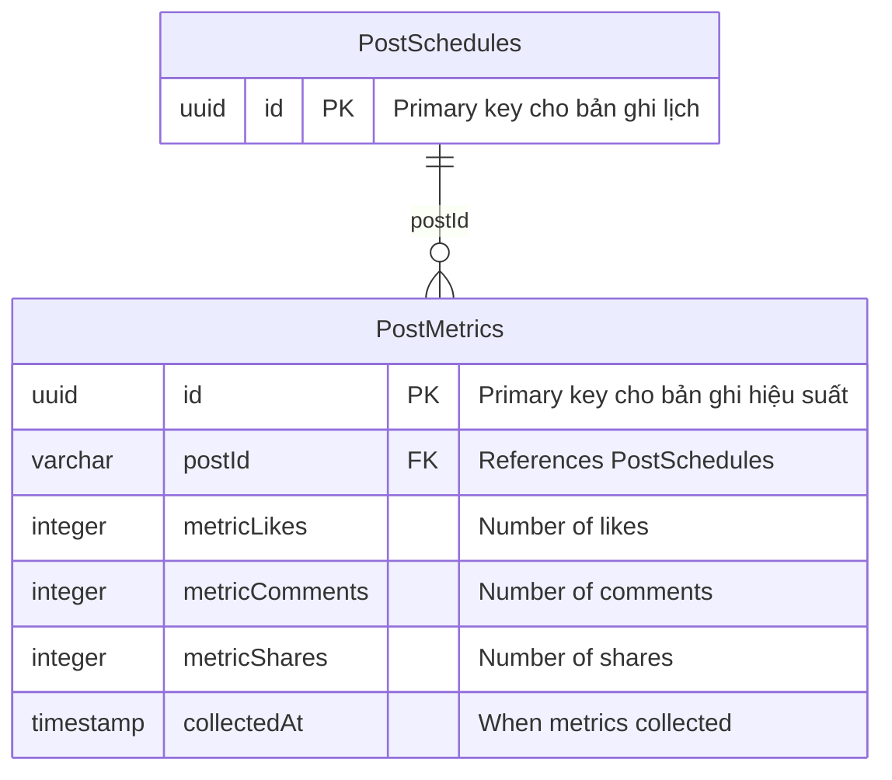

# SOFTWARE REQUIREMENTS SPECIFICATION: None

## 1. TỔNG QUAN DỰ ÁN & KIẾN TRÚC TOÀN CẦU

- Mục tiêu sản phẩm & Giá trị cốt lõi: Cung cấp giải pháp lịch đăng bài tự động trên mạng xã hội giúp doanh nghiệp nhỏ duy trì sự hiện diện trực tuyến một cách nhất quán mà không cần kỹ năng chuyên môn.
- Đối tượng người dùng mục tiêu: Chủ doanh nghiệp nhỏ, quản lý tiếp thị, chuyên gia marketing tự do.
- Ma trận vai trò truy cập (RBAC) toàn cầu:
  - [ARC-003] Chủ doanh nghiệp – Tạo/lịch, Quản lý người dùng, Xem báo cáo.
  - [ARC-004] Quản trị viên tiếp thị – Lên lịch, Chỉnh sửa nội dung, Xem hiệu suất.
  - [ARC-005] Người lên lịch – Tạo/lịch, Chỉnh sửa lịch, Xem lịch của riêng mình.
  - [ARC-006] Người xem – Xem báo cáo, Thống kê.
- Blueprint hạ tầng & Công nghệ:
  - [ARC-002] API Gateway trung tâm, Dịch vụ xác thực (OAuth2/JWT), Dịch vụ lên lịch (SocialScheduler), Dịch vụ đề xuất (Machine Learning), Hàng đợi tin nhắn (Apache Kafka), Cơ sở dữ liệu (PostgreSQL), Cache (Redis), Triển khai container (Docker/Kubernetes), CI/CD (GitHub Actions).

## 2. CÁC MODULO CHỨC NĂNG NÂNG CAO

### 2.1 Lõi lên lịch mạng xã hội (SocialScheduler)

- Yêu cầu chức năng cốt lõi: [REQ-001] Tích hợp API lịch đăng bài tự động cho Facebook, Instagram và TikTok.
  - Tiêu chí chấp nhận:
    - Given người dùng chọn nền tảng và thời gian,
    - When yêu cầu lên lịch được gửi đi,
    - Then hệ thống tạo bản ghi lịch và chuyển tiếp đến API tương ứng.
- Luồng ngoại lệ: [EXC-001] Xử lý ngoại lệ khi API bên thứ ba trả về lỗi; ghi lại và thử lại sau.
- Từ điển dữ liệu: [DAT-001] Bảng lưu trữ lịch đăng bài.
  - Trường: id (uuid) PK "Primary key cho bản ghi lịch"
  - userId (varchar) FK "References external Users table"
  - platform (varchar) "Nền tảng mạng xã hội"
  - content (text) "Nội dung bài đăng"
  - scheduledTime (timestamp) "Thời điểm lên lịch"
  - status (varchar) "Trạng thái hiện tại (pending, published, failed, cancelled)"

### 2.2 Công cụ đề xuất nội dung bằng AI (AI Content Recommendation)

- Yêu cầu chức năng cốt lõi: [REQ-002] Triển khai mô hình học máy để đề xuất nội dung bài đăng dựa trên hiệu suất trước đó.
  - Tiêu chí chấp nhận:
    - Given dữ liệu hiệu suất bài đăng trước đó,
    - When mô hình đề xuất xử lý dữ liệu,
    - Then hệ thống trả về danh sách nội dung được đề xuất hàng đầu.
- Luồng ngoại lệ: [EXC-002] Xác thực quyền truy cập người dùng và xử lý trường hợp token hết hạn.
- Từ điển dữ liệu: [DAT-002] Bảng hiệu suất bài đăng.
  - Trường: id (uuid) PK "Primary key cho bản ghi hiệu suất"
  - postId (varchar) FK "References PostSchedules"
  - metricLikes (integer) "Số lượt thích"
  - metricComments (integer) "Số bình luận"
  - metricShares (integer) "Số chia sẻ"
  - collectedAt (timestamp) "Thời điểm thu thập"

### 2.3 Dịch vụ nền tảng (Xác thực & Bảo mật)

- Yêu cầu chức năng cốt lõi: [REQ-004] Triển khai xác thực người dùng và quản lý phiên truy cập (JWT/OAuth2).
  - Tiêu chí chấp nhận:
    - Given người dùng đăng nhập,
    - When thông tin đăng nhập được xác minh,
    - Then hệ thống cấp JWT token có thời hạn.
- Yêu cầu chức năng cốt lõi: [REQ-005] Thực hiện kiểm soát truy cập dựa trên vai trò (RBAC) và phân quyền theo ngữ cảnh.
  - Tiêu chí chấp nhận:
    - Given vai trò người dùng được xác định,
    - When cố gắng lên lịch bài đăng,
    - Then hệ thống cho phép chỉ khi vai trò có quyền lên lịch.
- Yêu cầu chức năng cốt lõi: [REQ-006] Triển khai nhật ký kiểm toán và ghi log sự kiện an ninh.
  - Tiêu chí chấp nhận:
    - Given một thao tác quan trọng xảy ra,
    - When thao tác được thực hiện,
    - Then hệ thống ghi lại sự kiện trong nhật ký kiểm toán cùng timestamp và ngữ cảnh người dùng.
- Luồng ngoại lệ: [EXC-003] Bảo vệ chống lại việc spam lịch đăng bài và tấn công flood comment.

## 3. YÊU CẦU PHI CHỨC NĂNG TOÀN CẦU

- [NFR-001] Hiệu năng:
  - Độ trễ dưới 200 ms cho việc lên lịch,
  - Xử lý đề xuất dưới 100 ms,
  - Tỷ lệ yêu cầu thành công >= 99.9%.
- [NFR-002] Bảo mật:
  - Sử dụng JWT + OAuth2, mã hóa dữ liệu, tuân thủ OWASP Top 10,
  - Che giấu dữ liệu nhạy cảm, hạn chế CORS, kiểm tra rate limiting,
  - Ghi log sự kiện bảo mật.
- [NFR-003] Khả năng mở rộng & Cô lập đa tenant:
  - Mỗi tenant có schema cơ sở dữ liệu riêng,
  - Chia sẻ read-replica, cân bằng tải, tự động mở rộng theo chiều ngang,
  - Backup/phục hồi theo tenant, cô lập mạng.