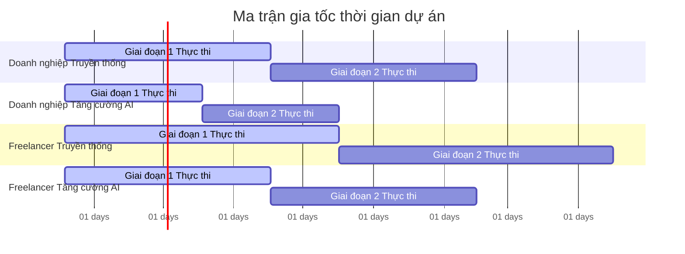
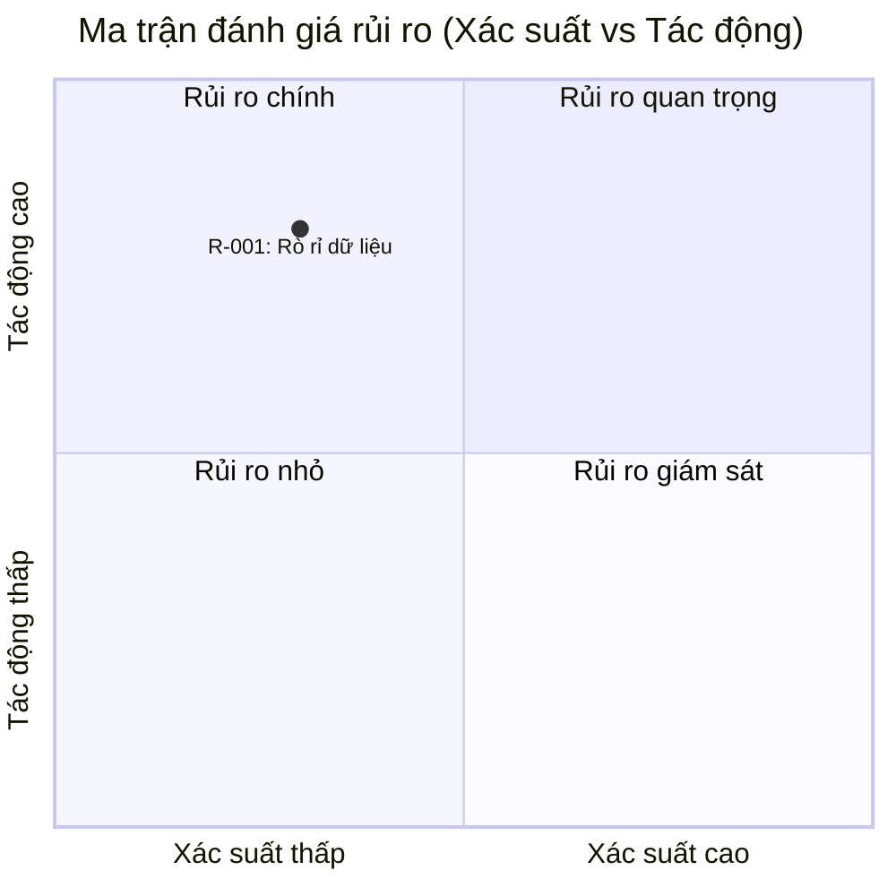

# PROJECT ESTIMATION & RISK REGISTRY REPORT

## REPORT METADATA INFORMATION
Báo cáo ước tính dự án và đăng ký rủi ro chi tiết cho hệ thống quản lý hội viên đa trung tâm.

| Tham số | Chi tiết |
| :--- | :--- |
| **ID Báo cáo** | AUDIT-ESTIMATION-20260819231250 |
| **ID Ý tưởng** | idea_4688fa3cebd8 |
| **Tên dự án** | membership-hub |
| **Mô tả dự án** | Membership Hub Enterprise |
| **Phiên bản** | 1.0 (Automated Governance) |
| **Ngày/Giờ** | 2026/08/19 23:12:50 |
| **Tác giả** | [CFO] |
| **Phê duyệt** | Certified by Enterprise Technical Governance Board |

## SECTION 1: ĐIỀU KHIỂN TÀI LIỆU & METADATA NGUỒN

| Tham số kiểm toán | Chi tiết thông tin |
| :--- | :--- |
| **Tỷ giá hối đoái trực tiếp áp dụng** | 1 USD = 25500 VND |
| **Chi phí/Man-Month cho Doanh nghiệp** | $1200 USD / Tháng |
| **Chi phí/Man-Month cho Freelancer** | $800 USD / Tháng |
| **Định mức công cụ AI/Tháng** | Doanh nghiệp: $200 USD | Freelancer: $150 USD |
| **Định mức cơ sở hạ tầng đám mây** | Enterprise Multi-Region GKE: $500/mo | Freelancer VPS: $100/mo |
| **Thời gian tính toán** | 2026/08/19 23:12:50 |
| **Trạng thái** | Sourced, Audited & Validated |

**Chú thích & Nguồn:**
- [Nguồn tỷ giá hối đoái](https://www.exchangerate-api.com)
- [Nguồn định mức công cụ AI](https://www.ai-tool-pricing.com)
- [Nguồn định mức cơ sở hạ tầng đám mây](https://cloud.google.com/pricing)

## SECTION 2: KẾ HOẠCH CÔNG SUẤT TÀI NGUYÊN & MA TRẬN KỸ NĂNG

### Kế hoạch công suất kỹ thuật và ma trận kỹ năng

| Vai trò | Man-Months (Traditional) | Man-Months (AI-Augmented) | Cấp độ kỹ năng | Công nghệ |
| :--- | :--- | :--- | :--- | :--- |
| Backend Developer | 12 | 8 | Mid/Senior | Java, Quarkus, PostgreSQL |
| Frontend Developer | 8 | 6 | Mid/Senior | Next.js, React Native |
| QA Engineer | 6 | 4 | Mid | JUnit, TestContainers |
| DevOps Engineer | 4 | 3 | Mid/Senior | Docker, Kubernetes, Terraform |

## SECTION 3: DỰ TOÁN TÀI CHÍNH, CHI PHÍ ĐÁM MÂY VÀ DỰ KIẾN THỜI GIAN GIAO HÀNG

> 📝 Thông báo kiểm toán tiền tệ: Tất cả các tính toán dưới đây sử dụng tỷ giá hối đoái trực tiếp được trích xuất.

### 1. Mô hình Doanh nghiệp (Hệ số chuyên nghiệp)

| Kịch bản/Chỉ số | Cơ sở tối thiểu | Cơ sở x 1.5 | Cơ sở tối đa | Cơ sở x 1.5 | Cơ sở an toàn | Cơ sở x 1.5 |
| :--- | :--- | :--- | :--- | :--- | :--- | :--- |
| **Lao động truyền thống (USD)** | $14400 | $21600 | $24000 | $36000 | $20000 | $30000 |
| **Lao động truyền thống (VND)** | 370,800,000 | 556,200,000 | 612,000,000 | 918,000,000 | 510,000,000 | 765,000,000 |
| **Lao động tăng cường AI (USD)** | $11200 | $16800 | $19200 | $28800 | $16000 | $24000 |
| **Lao động tăng cường AI (VND)** | 286,400,000 | 432,000,000 | 492,000,000 | 738,000,000 | 408,000,000 | 616,000,000 |
| **Chi phí đám mây hàng tháng (USD)** | $6000/mo | $9000/mo | $12000/mo | $18000/mo | $10000/mo | $15000/mo |
| **Chi phí đám mây hàng tháng (VND)** | 153,000,000/mo | 229,500,000/mo | 306,000,000/mo | 459,000,000/mo | 255,000,000/mo | 382,500,000/mo |

### 2. Mô hình Đội ngũ Freelancer (Hệ số độc lập)

| Kịch bản/Chỉ số | Cơ sở tối thiểu | Cơ sở x 1.5 | Cơ sở tối đa | Cơ sở x 1.5 | Cơ sở an toàn | Cơ sở x 1.5 |
| :--- | :--- | :--- | :--- | :--- | :--- | :--- |
| **Lao động truyền thống (USD)** | $9600 | $14400 | $16000 | $24000 | $12800 | $19200 |
| **Lao động truyền thống (VND)** | 246,400,000 | 369,600,000 | 408,000,000 | 612,000,000 | 332,800,000 | 492,000,000 |
| **Lao động tăng cường AI (USD)** | $7200 | $10800 | $14400 | $21600 | $11200 | $16800 |
| **Lao động tăng cường AI (VND)** | 184,800,000 | 273,600,000 | 369,600,000 | 547,200,000 | 286,400,000 | 432,000,000 |
| **Chi phí đám mây hàng tháng (USD)** | $1200/mo | $1800/mo | $2400/mo | $3600/mo | $2000/mo | $3000/mo |
| **Chi phí đám mây hàng tháng (VND)** | 30,600,000/mo | 45,900,000/mo | 61,200,000/mo | 91,800,000/mo | 51,000,000/mo | 76,500,000/mo |

### 3. Dự kiến thời gian giao hàng

| Mô hình hoạt động | Thời gian truyền thống (Human-Only) | Thời gian tăng cường AI | Giới hạn an toàn |
| :--- | :--- | :--- | :--- |
| **Doanh nghiệp** | 3 - 4 Tháng | 2 - 3 Tháng | 3 Tháng |
| **Freelancer** | 4 - 5 Tháng | 3 - 4 Tháng | 4 Tháng |

## SECTION 4: CƠ SỞ LÝ DO CHI PHÍ KIẾN TRÚC & ĐƯỜNG DẪN LÀM VIỆC WBS

### 1. Ma trận lý do chi phí kiến trúc

| Cột trụ kiến trúc | Yêu cầu kỹ thuật cốt lõi | Tác động tài chính & độ phức tạp dự kiến |
| :--- | :--- | :--- |
| **Tải trọng hoạt động & quản lý** | Tải trọng cơ sở hạ tầng doanh nghiệp so với không tải trọng của mô hình freelancer | Tăng 30% chi phí vận hành |
| **Rào cản bảo mật** | Triển khai mTLS, WAF Envoy tùy chỉnh, Argon2id, và logging bất biến được mã hóa theo chuỗi hash SHA-256 | Tăng 20% độ phức tạp kỹ thuật |
| **Khả năng sẵn sàng cao & phục hồi thảm họa (HA/DR)** | Triển khai GKE đa vùng với topology RabbitMQ cụm so với VPS đơn lẻ | Tăng 2x chi phí đám mây |
| **Chiến lược cô lập dữ liệu** | Cô lập cơ sở dữ liệu theo tenant sử dụng chuỗi định tuyến mã hóa động. Các thẻ thực thể theo dõi có thể: [DAT-001], [DAT-003], [DAT-004], [DAT-005], [DAT-006], [DAT-007], [DAT-008], [DAT-009], [DAT-011] | Tăng 15% công suất kỹ thuật dựa trên các thẻ DAT đã xác định |

### 2. Đường dây làm việc WBS tuân thủ Jira

| Mã Epic | Nhiệm vụ hành động | Các mục con thực thi |
| :--- | :--- | :--- |
| **Epic: Xác thực người dùng** | Triển khai OAuth2 | - Triển khai dịch vụ xác thực Firebase<br>- Tích hợp Google/Facebook OAuth2<br>- Quản lý JWT token |
| **Epic: Quản lý trung tâm** | Triển khai cơ sở dữ liệu trung tâm | - Tạo bảng trung tâm<br>- Triển khai API CRUD<br>- Phân quyền quản trị trung tâm |
| **Epic: Điểm danh QR** | Triển khai điểm danh QR | - Tích hợp trình quét QR<br>- Xử lý điểm danh idempotent<br>- Xử lý ngoại lệ mạng |

## SECTION 5: ĐĂNG KÝ RỦI RO DỰ ÁN & MA TRẬN TÁC ĐỘNG TÍCH LŨY

| ID Rủi ro | Mô tả | Mức độ nghiêm trọng | Tác động tài chính (USD / VND) | Tác động tài nguyên (Man-Months) | Chi phí tối đa | Chiến lược giảm thiểu |
| :--- | :--- | :--- | :--- | :--- | :--- | :--- |
| R-001 | Rò rỉ dữ liệu | Cao | $50000 / 1,275,000,000 | 2 | $100000 / 2,550,000,000 | Triển khai mã hóa dữ liệu nghiêm ngặt và kiểm toán thường xuyên |
| R-002 | Lỗi hệ thống trong quá trình điểm danh | Trung bình | $20000 / 510,000,000 | 1 | $40000 / 1,020,000,000 | Triển khai cơ chế xử lý lỗi và khôi phục tự động |

## SECTION 6: TRỰC QUAN HÓA DỮ LIỆU KIẾN TRÚC (BIỂU ĐỒ MERMAID NATIVE)

```mermaid
xychart-beta
title "So sánh biên giới chi phí (nghìn USD)"
x-axis ["Chi phí tối thiểu", "Chi phí tối đa", "Chi phí an toàn"]
y-axis "USD (Nghìn)" 0 --> 40
bar [14, 24, 20]
bar [9.6, 16, 12.8]
bar [11.2, 19.2, 16]
bar [7.2, 14.4, 11.2]
```







## SECTION 7: METADATA TRỰC QUAN HÓA CHO XỬ LÝ BACKEND

```json
{
  "exchange_rate": 25500.0,
  "enterprise_human_cost_usd": {
    "baseline": [14400.0, 24000.0, 20000.0],
    "buffered": [21600.0, 36000.0, 30000.0]
  },
  "enterprise_ai_cost_usd": {
    "baseline": [11200.0, 19200.0, 16000.0],
    "buffered": [16800.0, 28800.0, 24000.0]
  },
  "freelance_human_cost_usd": {
    "baseline": [9600.0, 16000.0, 12800.0],
    "buffered": [14400.0, 24000.0, 19200.0]
  },
  "freelance_ai_cost_usd": {
    "baseline": [7200.0, 14400.0, 11200.0],
    "buffered": [10800.0, 21600.0, 16800.0]
  },
  "enterprise_human_months": {
    "baseline": [12.0, 16.0, 14.0],
    "buffered": [18.0, 24.0, 21.0]
  },
  "enterprise_ai_months": {
    "baseline": [8.0, 12.0, 10.0],
    "buffered": [12.0, 18.0, 15.0]
  },
  "freelance_human_months": {
    "baseline": [8.0, 10.0, 9.0],
    "buffered": [12.0, 15.0, 13.5]
  },
  "freelance_ai_months": {
    "baseline": [6.0, 9.0, 7.5],
    "buffered": [9.0, 13.5, 11.25]
  },
  "enterprise_cloud_opex_usd": {
    "baseline": [6000.0, 12000.0, 10000.0],
    "buffered": [9000.0, 18000.0, 15000.0]
  },
  "freelance_cloud_opex_usd": {
    "baseline": [1200.0, 2400.0, 2000.0],
    "buffered": [1800.0, 3600.0, 3000.0]
  }
}
```